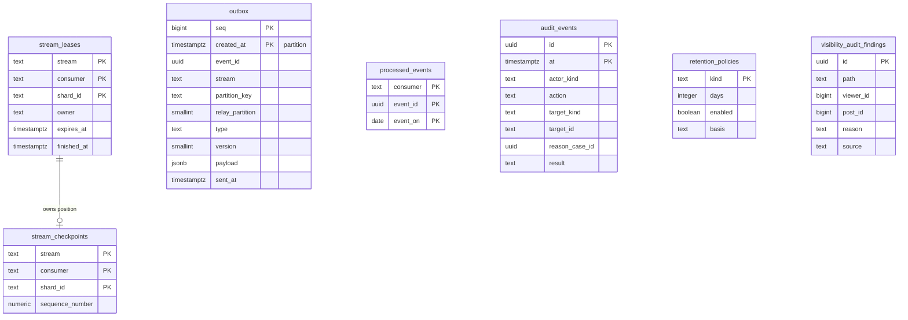

# Data model: 基盤と監査

outbox、Kinesis の消費者の担当と位置、消費者の重複の記録、監査ログ、保持の方針、見える範囲の抜き取りの監査の記録。振る舞いは [infrastructure.md](../infrastructure.md)、[security.md](../security.md)、[observability.md](../observability.md)、決定は [ADR-0005](../../decisions/0005-event-log-and-outbox.md)（outbox）、[ADR-0052](../../decisions/0052-audit-and-operator-access.md)（監査）、[ADR-0053](../../decisions/0053-data-lifecycle-and-retention.md)（保持）、[ADR-0055](../../decisions/0055-kinesis-consumers-and-valkey-clusters.md)（消費者）、[ADR-0056](../../decisions/0056-disaster-recovery-osaka.md)（DR）、[ADR-0059](../../decisions/0059-guardrail-and-audit-metrics.md)（抜き取りの監査）にある。出来事の頭と種類は [stores.md](stores.md) の 2 節。規約は [data-model.md](../data-model.md) の 3 節。

## 1. ER 図

`stream_leases` と `stream_checkpoints` は同じ `(stream, consumer, shard_id)` で論理に対応する（外部キーは張らない）。他の表は互いに関係を持たない。outbox の行と Kinesis のレコードの対応は [stores.md](stores.md) の 2 節。

## 2. 出来事

### 2.1 `outbox`

確定した変更の出来事（[ADR-0005](../../decisions/0005-event-log-and-outbox.md)）。書き込みのサービスが変更と同じトランザクションで書き、`relay` が Kinesis へ送る。

| 列 | 型 | NULL | 既定 | 説明 |
| --- | --- | --- | --- | --- |
| `seq` | `bigint` | NOT NULL | `GENERATED ALWAYS AS IDENTITY` | Relay が読む順 |
| `event_id` | `uuid` | NOT NULL | `uuidv7()` | 出来事の ID（消費者の重複の判定） |
| `stream` | `text` | NOT NULL | — | `posts`・`graph`・`engagement`・`moderation`・`accounts`・`dm`・`audit`（`views` は outbox を通らない） |
| `partition_key` | `text` | NOT NULL | — | 流れごとの鍵（[stores.md](stores.md) の 2.1 節） |
| `relay_partition` | `smallint` | NOT NULL | 生成列 `abs(hashtextextended(partition_key, 0) % 64)` | Relay の区画（64） |
| `type` | `text` | NOT NULL | — | `post.created` など |
| `version` | `smallint` | NOT NULL | `1` | 中身の型のバージョン（[delivery.md](../delivery.md) の 7.2 節） |
| `payload` | `jsonb` | NOT NULL | — | 中身。DM の本文、連絡先、IP を入れない |
| `traceparent` | `text` | NULL | — | W3C Trace Context |
| `created_at` | `timestamptz` | NOT NULL | `clock_timestamp()` | 出来事の `committed_at` に使う |
| `sent_at` | `timestamptz` | NULL | — | Kinesis に送った時刻 |

- キー：PK `(seq, created_at)`（分ける鍵を含める）。
- 索引：`(relay_partition, seq) WHERE sent_at IS NULL` — Relay の読み出し（担当の区画ごとに `seq` の順）。`(sent_at)` — DR の送り直し（切り替えの 15 分前から）。
- CHECK：`stream IN (...)`、`octet_length(payload::text) <= 900000`（Kinesis の 1 レコード 1 MiB の中）。
- 権限：書き込みのサービスは `INSERT` だけ。`relay` は `SELECT` と `sent_at` の `UPDATE` だけ。
- 分割：`created_at` の時間。全部の行に `sent_at` があり、1 時間を過ぎた区画を `DROP`（[ADR-0056](../../decisions/0056-disaster-recovery-osaka.md)）。未送信の行が残る区画は落とさない。
- S2：クラスタごとに `outbox` を持ち、Relay は各クラスタを読む（[infrastructure.md](../infrastructure.md) の 10.1 節）。
- S1 の量：1 時間 約 1,100 万〜2,000 万行、1 行 約 1 KB。11〜20 GB（[capacity.md](../capacity.md) の 5.1 節）。

Relay の区画の担当は表にしない。Valkey（`vk-edge`）の期限つきの鍵 `relay:lease:{relay_partition}` で持ち、Valkey がなければ `pg_try_advisory_lock(relay_partition)` に切り替える（[infrastructure.md](../infrastructure.md) の 3.1 節。旧い索引の `relay_partitions` の表はこれを指していた）。

### 2.2 `stream_leases`

Kinesis のシャードの担当（[infrastructure.md](../infrastructure.md) の 6.4 節）。

| 列 | 型 | NULL | 既定 | 説明 |
| --- | --- | --- | --- | --- |
| `stream` | `text` | NOT NULL | — | |
| `consumer` | `text` | NOT NULL | — | `fanout-router` など |
| `shard_id` | `text` | NOT NULL | — | |
| `parent_shard_ids` | `text[]` | NOT NULL | `'{}'` | 親を読み終えるまで子を読まない |
| `owner` | `text` | NULL | — | タスクの ID |
| `expires_at` | `timestamptz` | NOT NULL | `'-infinity'` | 20 秒。5 秒ごとに延ばす |
| `finished_at` | `timestamptz` | NULL | — | 閉じたシャードを最後まで読んだ時刻 |
| `updated_at` | `timestamptz` | NOT NULL | `now()` | |

- キー：PK `(stream, consumer, shard_id)`。
- 索引：`(stream, consumer, expires_at) WHERE finished_at IS NULL` — 空いた担当を `FOR UPDATE SKIP LOCKED` で取る。
- 保持：閉じたシャードの行は、Kinesis の保持（7 日）の後に消す。S1 の量：数千行。

### 2.3 `stream_checkpoints`

消費者ごと・シャードごとの読み終わりの位置。全部の消費者が Aurora に持つ（[ADR-0055](../../decisions/0055-kinesis-consumers-and-valkey-clusters.md)）。

| 列 | 型 | NULL | 既定 | 説明 |
| --- | --- | --- | --- | --- |
| `stream`・`consumer`・`shard_id` | `text` | NOT NULL | — | |
| `sequence_number` | `numeric(40,0)` | NOT NULL | — | Kinesis の連番（128 ビットまで） |
| `updated_at` | `timestamptz` | NOT NULL | `now()` | |

- キー：PK `(stream, consumer, shard_id)`。
- 書く順：DB に結果を書く消費者は結果と同じトランザクション。`counter-aggregator` は Valkey に足し終えた後。閲覧の数だけは先に書く。SQS に仕事を作る消費者は作った後。
- 更新は `sequence_number` を下げない（`WHERE stream_checkpoints.sequence_number < EXCLUDED.sequence_number`）。
- S1 の量：数千行。

### 2.4 `processed_events`

DB に結果を書く消費者の重複の記録。結果の表の主キーで重複を落とせる消費者（`notification-builder` の `notifications`・`notification_actors`、S2 の `followers`・`author_posts` の作成役など）は使わない。それ以外の DB に書く消費者（`account_risk` の更新、`fanout_mode_log` を書く数の消費者、`media` の配信の停止など）が使う（[ADR-0005](../../decisions/0005-event-log-and-outbox.md) の「`event_id` の一意の制約で重複を落とす」）。この文書で足した表。

| 列 | 型 | NULL | 既定 | 説明 |
| --- | --- | --- | --- | --- |
| `consumer` | `text` | NOT NULL | — | |
| `event_id` | `uuid` | NOT NULL | — | |
| `event_on` | `date` | NOT NULL | — | `event_id` の UUIDv7 の時刻の日（UTC）。分ける鍵 |
| `processed_at` | `timestamptz` | NOT NULL | `now()` | |

- キー：PK `(consumer, event_id, event_on)`。`event_on` は `event_id` から決まるので、同じ出来事は同じ区画で重複になる。
- 書き込み：結果と同じトランザクションで `INSERT ... ON CONFLICT DO NOTHING`。0 行なら結果を書かない。
- 分割・保持：`event_on` の日。8 日（Kinesis の 7 日 ＋ 送り直しの窓）で `DROP`。
- S1 の量：1 日 数百万行。

## 3. 監査と保持

### 3.1 `audit_events`

監査ログ（[security.md](../security.md) の 6.1 節）。追記だけ。中身（本文、連絡先）を入れない。同じ行を outbox の `audit` の流れにも書き、`audit-sink` が log-archive の S3（Object Lock）へ送る。

| 列 | 型 | NULL | 既定 | 説明 |
| --- | --- | --- | --- | --- |
| `id` | `uuid` | NOT NULL | `uuidv7()` | |
| `at` | `timestamptz` | NOT NULL | `now()` | |
| `actor_kind` | `text` | NOT NULL | — | `operator`・`ts`・`legal`・`system`・`user`・`break_glass` |
| `actor_id` | `text` | NOT NULL | — | |
| `action` | `text` | NOT NULL | — | `ts.read`・`moderation.apply`・`legal_hold.create`・`disclosure.export`・`account.state_change`・`data_export`・`app.suspend`・`kms.policy_change` など |
| `target_kind` | `text` | NOT NULL | — | |
| `target_id` | `text` | NOT NULL | — | |
| `reason_case_id` | `uuid` | NULL | — | 案件の ID（`ts_reader` の読み出しでは必須） |
| `request_id` | `text` | NULL | — | |
| `result` | `text` | NOT NULL | — | `ok`・`denied`・`error` |

- キー：PK `(id, at)`。
- 索引：`(target_kind, target_id, at DESC)`、`(actor_id, at DESC)`、`(reason_case_id)`。
- CHECK：`actor_kind <> 'ts' OR action <> 'ts.read' OR reason_case_id IS NOT NULL`。
- トリガー：`UPDATE`・`DELETE` を拒む（[ADR-0052](../../decisions/0052-audit-and-operator-access.md)）。各サービスは `INSERT` だけ。
- 分割：`at` の月。保持：DB は 1 年で区画を `DROP`。log-archive は法務の L8 の確認待ち（決まるまで Object Lock 1 年）。
- S1 の量：1 日 数十万行。

### 3.2 `retention_policies`

データの種類ごとの保持（[security.md](../security.md) の 7.1 節）。値の正本は AppConfig の `retention.*` で、この表は値・根拠・決めた日の記録。

| 列 | 型 | NULL | 既定 | 説明 |
| --- | --- | --- | --- | --- |
| `kind` | `text` | NOT NULL | — | `posts_deleted`・`dm`・`contacts`・`login_events`・`post_origin_logs`・`moderation`・`audit`・`lake_behavior`・`edge_logs` など |
| `days` | `integer` | NULL | — | 未定は NULL |
| `enabled` | `boolean` | NOT NULL | `false` | 物理の削除のジョブを動かすか |
| `basis` | `text` | NOT NULL | — | 法務の確認の記録の ID か、技術の理由 |
| `decided_at` | `date` | NULL | — | |
| `updated_at` | `timestamptz` | NOT NULL | `now()` | |

- キー：PK `kind`。CHECK `NOT enabled OR days IS NOT NULL`。
- 変更は `audit_events` に書く。S1 の量：数十行。

### 3.3 `visibility_audit_findings`

見える範囲の抜き取りの監査で、説明のつかない `hide` の記録（[observability.md](../observability.md) の 7 節、[ADR-0059](../../decisions/0059-guardrail-and-audit-metrics.md)）。

| 列 | 型 | NULL | 既定 | 説明 |
| --- | --- | --- | --- | --- |
| `id` | `uuid` | NOT NULL | `uuidv7()` | |
| `path` | `text` | NOT NULL | — | 漏れの経路（`home`・`for_you`・`search`・`notifications`・`api` など） |
| `viewer_id` | `bigint` | NULL | — | ログインしていない人は NULL |
| `post_id` | `bigint` | NOT NULL | — | |
| `reason` | `text` | NOT NULL | — | `block`・`protected`・`deleted`・`moderation`・`mute` |
| `source` | `text` | NOT NULL | — | 投稿が来た写し（`tl`・`ar`・`index`・`notification`・`rk`） |
| `responded_at` | `timestamptz` | NOT NULL | — | |
| `checked_at` | `timestamptz` | NOT NULL | `now()` | |

- キー：PK `id`。索引 `(checked_at)`。
- 保持：閲覧者の ID を含むので、仮に 30 日（[observability.md](../observability.md) の 7 節の扱いに揃える。法務の L8 の確認待ち）。S1 の量：0 が目標。
