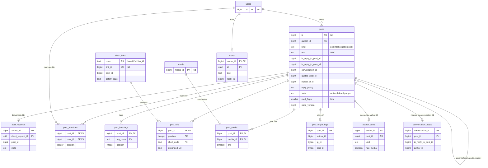

# Data model: 投稿

投稿の行、冪等の記録、抜き出した要素、短縮 URL、メディアの付け先、下書き、投稿の時の IP の記録、`tid` の生成器の貸し出し、S2 の索引の表と対応表。振る舞いは [posts-and-ids.md](../posts-and-ids.md)、決定は [ADR-0002](../../decisions/0002-post-ids-and-ordering.md)（`tid`）、[ADR-0008](../../decisions/0008-post-write-path-and-idempotency.md)（書き込みと冪等）、[ADR-0009](../../decisions/0009-post-state-tombstones-and-state-cache.md)（墓石と状態の版）、[ADR-0010](../../decisions/0010-post-table-partitioning-s2.md)（S2 の分割）にある。規約は [data-model.md](../data-model.md) の 3 節。

## 1. ER 図

投稿どうしの参照（返信先、引用先、リポストの元、会話の根）は論理の参照で、DB の外部キーを張らない（S2 で投稿の ID のハッシュで分けるため、物理の削除の順に縛られないため）。

`tid_generator_leases` と `post_shard_map` は他の表と関係を持たないので図から外した。

## 2. 投稿の表

### 2.1 `posts`

投稿の正本。リポストも自分の `tid` を持つ行（[posts-and-ids.md](../posts-and-ids.md) の 4.1 節）。公開の表で、見える範囲は `visible()` が決める。

| 列 | 型 | NULL | 既定 | 説明 |
| --- | --- | --- | --- | --- |
| `id` | `bigint` | NOT NULL | — | `tid` |
| `author_id` | `bigint` | NOT NULL | — | → `users` |
| `kind` | `text` | NOT NULL | — | `post`・`reply`・`quote`・`repost` |
| `text` | `text` | NULL | — | NFC の後の本文。リポストは NULL。引用は空でもよい |
| `lang` | `text` | NULL | — | 推定した言語（BCP 47） |
| `in_reply_to_post_id` | `bigint` | NULL | — | 返信先 |
| `in_reply_to_user_id` | `bigint` | NULL | — | 返信先の作者（通知と `SELF_THREAD`） |
| `conversation_id` | `bigint` | NOT NULL | — | 会話の根の ID。根では自分の `id` |
| `quoted_post_id` | `bigint` | NULL | — | 引用先。`kind = reply` でも持てる |
| `repost_of_id` | `bigint` | NULL | — | リポストの元（常に元の投稿） |
| `reply_policy` | `text` | NOT NULL | `'everyone'` | `everyone`・`following`・`mentioned`。根の値が会話に効く |
| `sensitive` | `boolean` | NOT NULL | `false` | 作者が付けたセンシティブの印 |
| `has_media` | `boolean` | NOT NULL | `false` | メディアの付いた投稿（プロフィールのメディアのタブ） |
| `region_code` | `text` | NULL | — | 作成の時に決めた地方（トレンド。L4 の確認待ち） |
| `state` | `text` | NOT NULL | `'active'` | `active`・`deleted`・`purged` |
| `mod_flags` | `smallint` | NOT NULL | `0` | 措置の要約のビット（[data-model.md](../data-model.md) の 3.5 節）。`ts` だけが書く |
| `mod_geo` | `text[]` | NOT NULL | `'{}'` | `GEO_WITHHELD` の地域（ISO 3166-1 alpha-2） |
| `state_version` | `bigint` | NOT NULL | `1` | `state`・`mod_flags`・`mod_geo` を変えるたびに 1 上げる |
| `created_at` | `timestamptz` | NOT NULL | `tid` の時刻 | トリガー `set_created_at_from_tid()` |
| `deleted_at` | `timestamptz` | NULL | — | 作者の削除（墓石） |
| `purged_at` | `timestamptz` | NULL | — | 中身を消した時刻 |
| `updated_at` | `timestamptz` | NOT NULL | `now()` | |

- キー：PK `id`。FK `author_id` → `users`（S1 だけ。S2 でクラスタが分かれたら論理の参照）。
- 論理の参照：`in_reply_to_post_id`・`quoted_post_id`・`repost_of_id`・`conversation_id` → `posts`、`in_reply_to_user_id` → `users`。
- 索引（[timeline-fanout.md](../timeline-fanout.md) の 9 節）：
  - `(author_id, id DESC)` — プロフィールの一覧、`ar:` の作り直し、DR の `ar:` の先の作成。
  - `(author_id, id DESC) WHERE has_media` — メディアのタブ。
  - `(conversation_id, id)` — 会話の表示。
  - `(in_reply_to_post_id, id)` — 返信の一覧、返信の数の照合。
  - `(in_reply_to_post_id, author_id)` — 会話の段 2・3（閲覧者とフォロー中の人の返信）。
  - `(quoted_post_id, id) WHERE quoted_post_id IS NOT NULL` — 引用の一覧と数の照合。
  - `(state, deleted_at) WHERE state = 'deleted'` — 保持の後の物理の削除のジョブ。
- CHECK：
  - `kind IN ('post','reply','quote','repost')`、`state IN ('active','deleted','purged')`、`reply_policy IN ('everyone','following','mentioned')`
  - `(kind = 'reply') = (in_reply_to_post_id IS NOT NULL)`、`(kind = 'reply') = (in_reply_to_user_id IS NOT NULL)`
  - `(kind = 'repost') = (repost_of_id IS NOT NULL)`、`kind <> 'repost' OR (text IS NULL AND quoted_post_id IS NULL AND NOT has_media)`
  - `kind <> 'quote' OR quoted_post_id IS NOT NULL`
  - `kind = 'reply' OR conversation_id = id`
  - `text IS NOT NULL OR kind = 'repost' OR state = 'purged'`、`octet_length(text) <= 4096`
  - `state <> 'deleted' OR deleted_at IS NOT NULL`、`(state = 'purged') = (purged_at IS NOT NULL)`
  - `cardinality(mod_geo) = 0 OR mod_flags & 16 <> 0`
- トリガー：`state`・`mod_flags`・`mod_geo` を変えて `state_version` を上げない更新を拒む。`state_version` を下げる更新を拒む（[ADR-0009](../../decisions/0009-post-state-tombstones-and-state-cache.md)）。`purged` から他への遷移を拒む。
- 更新の権限：`post` は `state`・`deleted_at`・`state_version`・`has_media` だけ、`ts` は `mod_flags`・`mod_geo`・`state_version` だけ、`retention` は `purged` への遷移と中身の列を NULL にすることだけ。
- 分割：S1 は `id` の範囲で月ごと（月の初めの時刻から境の `tid` を計算する。`tid_month_start(ts)`）。pg_partman で 3 か月先まで作る。S2 は 1,024 の論理の分割（`xxHash64(id) mod 1024`）を `post_shard_map` で物理のクラスタへ（[ADR-0010](../../decisions/0010-post-table-partitioning-s2.md)）。
- 保持：作者の削除・`removed` の後は墓石。`purged` にする時期は **法務の L8 の確認待ち**（既定 30 日を仮に置き、ジョブは止めておく）。`legal_holds` の対象は `purged` にしない。`purged` は本文・抜き出し・メディアの参照を消し、`id`・`author_id`・`kind`・`state`・時刻を残す。
- S1 の量：1 日 100 万行、年 3.65 億行、1 行 約 1 KB で年 365 GB（[capacity.md](../capacity.md) の 5.1 節）。

### 2.2 `post_requests`

投稿の冪等の記録（[ADR-0008](../../decisions/0008-post-write-path-and-idempotency.md)）。書き込みの経路の内部の表で、API に出さない。

| 列 | 型 | NULL | 既定 | 説明 |
| --- | --- | --- | --- | --- |
| `author_id` | `bigint` | NOT NULL | — | |
| `client_request_id` | `uuid` | NOT NULL | — | クライアントが作った UUIDv7（API の `Idempotency-Key` も同じ列に入る） |
| `post_id` | `bigint` | NOT NULL | — | 振った `tid` |
| `state` | `text` | NOT NULL | `'committed'` | `committed`。S2 の 2 段の書き込みで `reserved` を使う |
| `created_at` | `timestamptz` | NOT NULL | `now()` | |

- キー：PK `(author_id, client_request_id)`。`post_id` は論理の参照。
- 索引：`(created_at)` — 24 時間の後の掃除（1 時間ごと、1,000 行ずつ）。
- CHECK：`state IN ('reserved','committed')`。
- RLS：なし（`post` のロールだけが読み書きする）。
- 分割：S1 はなし。S2 は作者の ID の論理の分割（ADR-0010）。
- 保持：24 時間。S1 の量：約 100 万行（24 時間ぶん）。

### 2.3 `post_mentions`

| 列 | 型 | NULL | 既定 | 説明 |
| --- | --- | --- | --- | --- |
| `post_id` | `bigint` | NOT NULL | — | |
| `user_id` | `bigint` | NOT NULL | — | 書き込みの時に解決した利用者 |
| `position` | `integer` | NOT NULL | — | 本文の中の位置（コードポイント） |

- キー：PK `(post_id, user_id)`。FK `post_id` → `posts`（`ON DELETE CASCADE`）、`user_id` → `users`。
- 索引：`(user_id, post_id DESC)` — メンションの一覧。
- CHECK：1 投稿 50 件までは書き込みの側で守る（`ops.post.max_resolved_mentions`）。
- 分割・保持：`posts` と同じ範囲の分割。`purged` で消す。S1 の量：1 日 約 30 万行。

### 2.4 `post_hashtags`

| 列 | 型 | NULL | 既定 | 説明 |
| --- | --- | --- | --- | --- |
| `post_id` | `bigint` | NOT NULL | — | |
| `tag_norm` | `text` | NOT NULL | — | NFKC の後に小文字 |
| `tag_display` | `text` | NOT NULL | — | 本文の中の表記 |
| `position` | `integer` | NOT NULL | — | |

- キー：PK `(post_id, tag_norm)`。FK `post_id` → `posts`。
- 索引：なし（検索とトレンドは出来事から作る。[search-and-trends.md](../search-and-trends.md)）。
- 分割・保持：`posts` と同じ。S1 の量：1 日 約 20 万行。

### 2.5 `post_urls`

| 列 | 型 | NULL | 既定 | 説明 |
| --- | --- | --- | --- | --- |
| `post_id` | `bigint` | NOT NULL | — | |
| `position` | `integer` | NOT NULL | — | |
| `short_code` | `text` | NOT NULL | — | → `short_links.code` |
| `expanded_url` | `text` | NOT NULL | — | 本文の元の URL |
| `url_domain` | `text` | NOT NULL | — | 小文字のホスト名（検索の `urls_domain`） |

- キー：PK `(post_id, position)`。FK `post_id` → `posts`、`short_code` → `short_links(code)`。
- 分割・保持：`posts` と同じ。S1 の量：1 日 約 10 万行。

### 2.6 `short_links`

短縮 URL（[posts-and-ids.md](../posts-and-ids.md) の 4.4 節）。

| 列 | 型 | NULL | 既定 | 説明 |
| --- | --- | --- | --- | --- |
| `code` | `text` | NOT NULL | — | `link_id` の base62（11 文字以下） |
| `link_id` | `bigint` | NOT NULL | — | `tid` |
| `post_id` | `bigint` | NOT NULL | — | 使った投稿（投稿をまたいで使い回さない） |
| `url` | `text` | NOT NULL | — | 転送先 |
| `safety_state` | `text` | NOT NULL | `'unchecked'` | `unchecked`・`safe`・`warn`・`blocked`（T&S が書く） |
| `safety_checked_at` | `timestamptz` | NULL | — | |
| `disabled_at` | `timestamptz` | NULL | — | 投稿の削除・措置の後始末 |
| `created_at` | `timestamptz` | NOT NULL | `tid` の時刻 | |

- キー：PK `code`。UK `link_id`。UK `(post_id, url)`（同じ投稿の同じ URL は同じ `code`）。`post_id` は論理の参照。
- 索引：`(post_id)` — 後始末で無効にする。
- CHECK：`code ~ '^[0-9A-Za-z]{1,11}$'`、`safety_state IN ('unchecked','safe','warn','blocked')`。
- 読み出し：転送の入口は `code` で 1 行を引く。`visible()` を通さない（URL は投稿の外でも共有される）。
- 保持：投稿の `purged` の後も行を残し、`disabled_at` を立てる（古いリンクが別の URL へ向かないため）。S1 の量：1 日 約 10 万行。

### 2.7 `post_media`

投稿とメディアの結び付き。1 つのメディアは 1 つの投稿か DM にだけ付く（[media.md](../media.md) の 4.2 節）。

| 列 | 型 | NULL | 既定 | 説明 |
| --- | --- | --- | --- | --- |
| `post_id` | `bigint` | NOT NULL | — | |
| `media_id` | `bigint` | NOT NULL | — | → `media` |
| `ord` | `smallint` | NOT NULL | — | 0〜3 |

- キー：PK `(post_id, media_id)`。UK `media_id`。UK `(post_id, ord)`。FK `post_id` → `posts`、`media_id` → `media`（S1。S2 は論理の参照）。
- CHECK：`ord BETWEEN 0 AND 3`。組み合わせ（画像 4 枚まで、GIF・動画は 1 つ）は書き込みの検証で守る。
- 分割・保持：`posts` と同じ。S1 の量：1 日 約 20 万行。

## 3. 本人だけの表

### 3.1 `drafts`

下書き。端末の手元の下書きの写し（[clients.md](../clients.md) の 6.2 節）。

| 列 | 型 | NULL | 既定 | 説明 |
| --- | --- | --- | --- | --- |
| `owner_id` | `bigint` | NOT NULL | — | |
| `id` | `uuid` | NOT NULL | `uuidv7()` | |
| `text` | `text` | NOT NULL | `''` | |
| `media_ids` | `bigint[]` | NOT NULL | `'{}'` | `ready` のメディア（論理の参照） |
| `reply_to` | `bigint` | NULL | — | 返信先の投稿 |
| `quote_of` | `bigint` | NULL | — | 引用先の投稿 |
| `client_request_id` | `uuid` | NOT NULL | — | 送るときの冪等の鍵（`post_requests` と同じ値） |
| `created_at`・`updated_at` | `timestamptz` | NOT NULL | `now()` | |

- キー：PK `(owner_id, id)`。FK `owner_id` → `users`。
- 索引：`(owner_id, updated_at DESC)` — 下書きの一覧。
- CHECK：`cardinality(media_ids) <= 4`、`octet_length(text) <= 4096`。
- RLS：本人。1 人 100 件まで（`ops.post.max_drafts`）。
- 保持：本人が消すまで。アカウントの削除で消す。S1 の量：数百万行。

## 4. 運用の表

### 4.1 `post_origin_logs`

投稿の時の IP とポート。発信者情報の開示（L2）に使う（[security.md](../security.md) の 5.3 節）。`post` は書くだけ、`ts_reader` が案件の ID つきで読む。

| 列 | 型 | NULL | 既定 | 説明 |
| --- | --- | --- | --- | --- |
| `post_id` | `bigint` | NOT NULL | — | |
| `author_id` | `bigint` | NOT NULL | — | 利用者ごとの開示の引き（投稿の `purged` の後も引けるように持つ） |
| `ip_ct` | `bytea` | NOT NULL | — | 封筒の暗号文（`pii-logs` の鍵） |
| `port_ct` | `bytea` | NULL | — | 同上 |
| `created_at` | `timestamptz` | NOT NULL | `now()` | |

- キー：PK `(post_id, created_at)`。`post_id` は論理の参照。
- 索引：`(author_id, created_at)` — 利用者と期間での開示。
- 分割：`created_at` の月。
- RLS：なし。`post` は `INSERT` だけ。読み出しは `ts_reader` の関数 `ts_read_post_origin(case_id, ...)` だけ（監査ログに書く）。
- 保持：**法務の L2・L8 の確認待ち**。値が決まるまで消さない。
- S1 の量：1 日 100 万行、1 行 約 120 B。年 約 45 GB。

### 4.2 `tid_generator_leases`

生成器の番号の貸し出し（[posts-and-ids.md](../posts-and-ids.md) の 8.1 節）。1,024 行を最初に作っておく。

| 列 | 型 | NULL | 既定 | 説明 |
| --- | --- | --- | --- | --- |
| `generator_id` | `smallint` | NOT NULL | — | 0〜1023 |
| `region` | `text` | NOT NULL | — | `ap-northeast-1`（東京）・`ap-northeast-3`（大阪） |
| `holder` | `text` | NULL | — | タスクの ARN とサービスの名前 |
| `lease_epoch` | `bigint` | NOT NULL | `0` | 取るたびに 1 上げる |
| `expires_at` | `timestamptz` | NOT NULL | `'-infinity'` | DB の `now()` で決める（60 秒） |
| `updated_at` | `timestamptz` | NOT NULL | `now()` | |

- キー：PK `generator_id`。
- 索引：`(region, expires_at)` — 期限の切れた番号を `FOR UPDATE SKIP LOCKED` で 1 つ取る。
- CHECK：`(region = 'ap-northeast-1' AND generator_id BETWEEN 0 AND 511) OR (region = 'ap-northeast-3' AND generator_id BETWEEN 512 AND 1023)`（[ADR-0056](../../decisions/0056-disaster-recovery-osaka.md)）。
- 使う：`post`・`accounts`・`dm`・`media`・`engagement`（リポスト）・短縮 URL。
- S1 の量：1,024 行。

## 5. S2 の表

S2 で `posts` を投稿の ID のハッシュで分けた後に足す（[ADR-0010](../../decisions/0010-post-table-partitioning-s2.md)）。`posts` の流れの消費者が冪等に書く。

### 5.1 `author_posts`

| 列 | 型 | NULL | 既定 | 説明 |
| --- | --- | --- | --- | --- |
| `author_id` | `bigint` | NOT NULL | — | |
| `post_id` | `bigint` | NOT NULL | — | |
| `kind` | `text` | NOT NULL | — | `posts.kind` |
| `has_media` | `boolean` | NOT NULL | — | メディアのタブ |

- キー：PK `(author_id, post_id)`。索引 `(author_id, post_id DESC) WHERE has_media`。
- 分割：作者の ID の論理の分割。削除は `post.deleted` で行を消す（`visible()` が正しさを持つので、遅れてもよい）。
- S2 の量：投稿と同じ行の数。

### 5.2 `conversation_posts`

| 列 | 型 | NULL | 既定 | 説明 |
| --- | --- | --- | --- | --- |
| `conversation_id` | `bigint` | NOT NULL | — | |
| `post_id` | `bigint` | NOT NULL | — | |
| `in_reply_to_post_id` | `bigint` | NULL | — | |
| `author_id` | `bigint` | NOT NULL | — | |

- キー：PK `(conversation_id, post_id)`。
- 索引：`(in_reply_to_post_id, post_id)`・`(in_reply_to_post_id, author_id)` — 会話の段（[timeline-fanout.md](../timeline-fanout.md) の 9.2 節）。
- 分割：会話の ID の論理の分割。

### 5.3 `post_shard_map`

投稿のクラスタの論理の分割から物理のクラスタへの対応。`graph_shard_map`（[graph.md](graph.md)）と同じ形（[ADR-0013](../../decisions/0013-graph-partitioning.md) の「同じ形を投稿にも使う」）。

| 列 | 型 | NULL | 既定 | 説明 |
| --- | --- | --- | --- | --- |
| `logical_partition` | `smallint` | NOT NULL | — | 0〜1023 |
| `cluster` | `text` | NOT NULL | — | 物理のクラスタの名前 |
| `state` | `text` | NOT NULL | `'active'` | `active`・`moving`（書き込みを止めている） |
| `moved_at` | `timestamptz` | NULL | — | |

- キー：PK `logical_partition`。CHECK `logical_partition BETWEEN 0 AND 1023`、`state IN ('active','moving')`。
- `posts` とその抜き出しの表は投稿の ID、`post_requests`・`author_posts` は作者の ID、`conversation_posts` は会話の ID で、同じ 1,024 の分割を引く。
- 置き場所：`core` のクラスタ。サービスは 60 秒ごとと移動の出来事で読み直す。

## 6. 書き込みのまとまり

| 操作 | 1 つのトランザクションで書く表 |
| --- | --- |
| 投稿 | `post_requests`、`posts`、`post_mentions`、`post_hashtags`、`post_urls`、`short_links`、`post_media`、`media`（`ready` → `attached`）、`post_origin_logs`、`outbox`（`posts`：`post.created`。返信・引用は `engagement`：`reply.added`・`quote.added`） |
| リポスト（S1） | `reposts`、`posts`（`kind = repost`）、`post_origin_logs`、`outbox`（`post.created`、`repost.created`）。[engagement.md](engagement.md) |
| 削除 | `posts`（`state`・`deleted_at`・`state_version`）、`outbox`（`post.deleted`。返信・引用は `reply.removed`・`quote.removed`） |
| 措置 | [trust-and-safety.md](trust-and-safety.md) の 7 節 |
