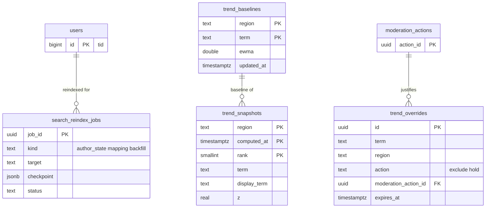

# Data model: 検索とトレンド

検索の索引は OpenSearch の写しで、正本は `posts`・`users`・`post_hashtags`（索引の形は [stores.md](stores.md) の 6 節）。トレンドの数は Valkey の写し（[stores.md](stores.md) の 1.2 節）。この文書は Aurora に置く 4 つの表を書く：索引の作業の進み、トレンドの結果の記録、基準の写し、T&S の除外。振る舞いは [search-and-trends.md](../search-and-trends.md)、決定は [ADR-0025](../../decisions/0025-search-engine-and-japanese-analysis.md)（エンジンと解析）、[ADR-0026](../../decisions/0026-search-index-layout-and-visibility.md)（索引の形と見える範囲）、[ADR-0027](../../decisions/0027-trends-burst-detection.md)（急上昇の検出）にある。規約は [data-model.md](../data-model.md) の 3 節。

## 1. ER 図

`trend_baselines` と `trend_snapshots` は `(region, term)` で論理に対応する（外部キーは張らない）。

## 2. 表

### 2.1 `search_reindex_jobs`

作者の状態の更新（`update_by_query`）と、索引の作り直し・埋め直しの進み（[search-and-trends.md](../search-and-trends.md) の 7.3・7.5 節）。運用の表。

| 列 | 型 | NULL | 既定 | 説明 |
| --- | --- | --- | --- | --- |
| `job_id` | `uuid` | NOT NULL | `uuidv7()` | |
| `kind` | `text` | NOT NULL | — | `author_state`・`mapping`・`backfill` |
| `target` | `text` | NOT NULL | — | `author_state` は作者の `tid`、`mapping` は新しい索引の組（`posts-v2`）、`backfill` は月（`202610`） |
| `checkpoint` | `jsonb` | NOT NULL | `'{}'` | 最後に済んだ `post_id` など |
| `status` | `text` | NOT NULL | `'queued'` | `queued`・`running`・`done`・`failed` |
| `attempts` | `smallint` | NOT NULL | `0` | |
| `started_at`・`finished_at` | `timestamptz` | NULL | — | |
| `created_at` | `timestamptz` | NOT NULL | `now()` | |

- キー：PK `job_id`。
- 一意：`UNIQUE (kind, target) WHERE status IN ('queued','running')`（作者ごとに 1 つ。途中で失敗したら最初からやり直す）。
- 索引：`(status, created_at)` — 作業の取り出し。
- 保持：`done`・`failed` は 30 日（この文書で決めた）。S1 の量：1 日 数千行（鍵の切り替え・凍結の数）。

### 2.2 `trend_snapshots`

トレンドの結果の記録（運用の状況の報告と調査。[search-and-trends.md](../search-and-trends.md) の 9.6 節）。

| 列 | 型 | NULL | 既定 | 説明 |
| --- | --- | --- | --- | --- |
| `region` | `text` | NOT NULL | — | `jp` か地方のコード |
| `computed_at` | `timestamptz` | NOT NULL | — | 5 分の区切りの終わり |
| `rank` | `smallint` | NOT NULL | — | 1〜30 |
| `term` | `text` | NOT NULL | — | 正規化した語 |
| `display_term` | `text` | NOT NULL | — | 表示の表記 |
| `z` | `real` | NOT NULL | — | 急上昇の点 |
| `count_bucket` | `integer` | NOT NULL | — | 数の丸めた値（「1 万件以上」などの表示） |

- キー：PK `(region, computed_at, rank)`。
- 索引：`(term, computed_at DESC)` — 語の履歴の調査。
- 分割：`computed_at` の月。保持：90 日。
- S1 の量：1 日 約 8 万行（地域 9 × 288 区切り × 30）。

### 2.3 `trend_baselines`

基準（指数移動平均）の毎時の写し。Valkey の `tb:{region}` を失ったときの戻し（[search-and-trends.md](../search-and-trends.md) の 9.7 節）。

| 列 | 型 | NULL | 既定 | 説明 |
| --- | --- | --- | --- | --- |
| `region` | `text` | NOT NULL | — | |
| `term` | `text` | NOT NULL | — | |
| `ewma` | `double precision` | NOT NULL | — | |
| `updated_at` | `timestamptz` | NOT NULL | — | |

- キー：PK `(region, term)`。
- 索引：`(updated_at)` — 7 日更新のない語を消す。
- 書き込み：毎時、`INSERT ... ON CONFLICT DO UPDATE` で写す。
- S1 の量：数百万行。

### 2.4 `trend_overrides`

T&S による語の除外と保留（[search-and-trends.md](../search-and-trends.md) の 9.5 節）。

| 列 | 型 | NULL | 既定 | 説明 |
| --- | --- | --- | --- | --- |
| `id` | `uuid` | NOT NULL | `uuidv7()` | |
| `term` | `text` | NOT NULL | — | 正規化した語 |
| `region` | `text` | NULL | — | NULL は全国 |
| `action` | `text` | NOT NULL | — | `exclude`・`hold` |
| `reason_code` | `text` | NOT NULL | — | |
| `moderation_action_id` | `uuid` | NULL | — | → `moderation_actions` |
| `created_by` | `text` | NOT NULL | — | |
| `created_at` | `timestamptz` | NOT NULL | `now()` | |
| `expires_at` | `timestamptz` | NULL | — | |

- キー：PK `id`。一意：`UNIQUE (term, coalesce(region, '')) WHERE expires_at IS NULL`（同じ語と地域の無期限の行は 1 つ）。
- 索引：`(expires_at)`。`trends` は 1 分ごとに効いている行を読み直す。
- CHECK：`action IN ('exclude','hold')`。
- 保持：期限の後 1 年（この文書で決めた。報告と調査）。S1 の量：数千行。
