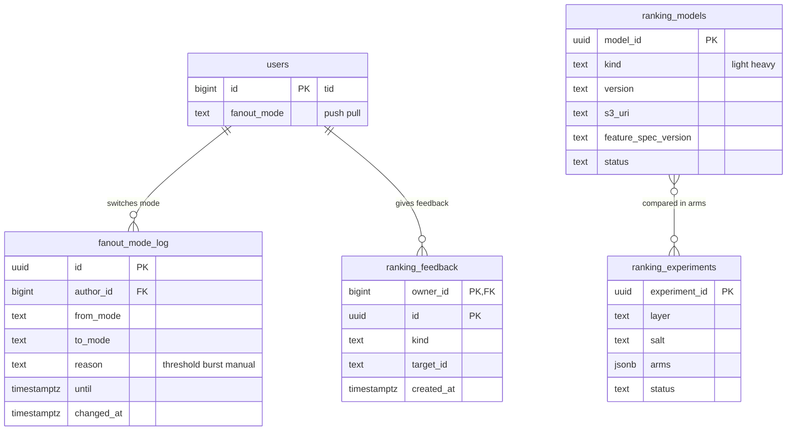

# Data model: タイムラインとランキング

タイムラインとおすすめは、正本の表をほとんど持たない。ホームの写し（`tl:`）、作者の最近の投稿（`ar:`）、特徴、並べた結果は Valkey の写しで、形は [stores.md](stores.md) の 1.1・1.2 節にある。この文書は Aurora に置く 4 つの表を書く：作者の方式の記録、利用者のおすすめへの操作、モデルの登録、実験。振る舞いは [timeline-fanout.md](../timeline-fanout.md) と [ranking-and-recommendation.md](../ranking-and-recommendation.md)、決定は [ADR-0003](../../decisions/0003-timeline-fanout-hybrid.md)、[ADR-0014](../../decisions/0014-home-timeline-replica-format.md)〜[ADR-0020](../../decisions/0020-ranking-evaluation-experiments-and-transparency.md) にある。規約は [data-model.md](../data-model.md) の 3 節。

## 1. ER 図

## 2. 写しと正本の対応

タイムラインの写しは、次の正本から作り直せる（[ADR-0003](../../decisions/0003-timeline-fanout-hybrid.md)、[ADR-0016](../../decisions/0016-timeline-rebuild-single-flight.md)）。写しにしかない状態を作らない。

| 写し（Valkey） | 作り直しの元（Aurora） |
| --- | --- |
| `tl:{viewer_id}` | `following`（閲覧者の `active` のフォロー先）× `posts (author_id, id DESC)` の直近 7 日・800 件 |
| `ar:{author_id}` | `posts (author_id, id DESC)` の直近 7 日・200 件 |
| `pl:{viewer_id}` | `following` × `user_counters.followers >= 1000` |
| `fanout:pull_any` | `users.fanout_mode = 'pull'`（値は無限大）と、`fanout_mode_log` の `until > now()` の行 |
| `cv:{post_id}` | `posts (in_reply_to_post_id, id)` と `post_counters` |
| `rk:{viewer_id}:{request_id}` | 作り直さない（切れたら新しい要求として並べる） |
| 特徴（`pf:`・`af:`・`va:`・`vf:`・`ae:`・`th:`・`tp:`・`pop:jp`） | 出来事の流れとデータレイクから作る。失ったら空から溜め直す |

## 3. 表

### 3.1 `fanout_mode_log`

作者の fan-out の方式の切り替えの記録（[timeline-fanout.md](../timeline-fanout.md) の 5.4・5.5 節）。`fanout:pull_any` の作り直しの元。運用の表。

| 列 | 型 | NULL | 既定 | 説明 |
| --- | --- | --- | --- | --- |
| `id` | `uuid` | NOT NULL | `uuidv7()` | |
| `author_id` | `bigint` | NOT NULL | — | |
| `from_mode`・`to_mode` | `text` | NOT NULL | — | `push`・`pull` |
| `reason` | `text` | NOT NULL | — | `threshold`（フォロワーの数）・`burst`（瞬間のピーク）・`manual`（Ops） |
| `until` | `timestamptz` | NULL | — | プルの合わせの対象に残す期限（プル → プッシュと `burst` は 7 日後。今プルなら NULL） |
| `changed_at` | `timestamptz` | NOT NULL | `now()` | |

- キー：PK `id`。FK `author_id` → `users`。
- 索引：`(until) WHERE until IS NOT NULL` — `fanout:pull_any` の作り直し。`(author_id, changed_at DESC)` — 調査。
- CHECK：`from_mode IN ('push','pull')`、`to_mode IN ('push','pull')`、`reason IN ('threshold','burst','manual')`。
- 書く：`threshold` は Graph の数の消費者（`users.fanout_mode` と同じトランザクション）、`burst` は `fanout-router`。`burst` は `users.fanout_mode` を変えない。
- 保持：1 年（この文書で決めた。閾値の見直しの材料）。S1 の量：月 数千行。

### 3.2 `ranking_feedback`

利用者のおすすめへの操作（[ranking-and-recommendation.md](../ranking-and-recommendation.md) の 12.2 節）。本人だけの表。

| 列 | 型 | NULL | 既定 | 説明 |
| --- | --- | --- | --- | --- |
| `owner_id` | `bigint` | NOT NULL | — | |
| `id` | `uuid` | NOT NULL | `uuidv7()` | |
| `kind` | `text` | NOT NULL | — | `not_interested`（投稿）・`hide_author`（作者）・`less_topic`（話題） |
| `target_id` | `text` | NOT NULL | — | 投稿・作者の `tid` の 10 進の文字列か、話題のコード |
| `created_at` | `timestamptz` | NOT NULL | `now()` | |

- キー：PK `(owner_id, id)`。UK `(owner_id, kind, target_id)`。FK `owner_id` → `users`。
- 索引：`(owner_id, created_at DESC)` — 設定の画面の一覧と、ランキングの前の絞り込みの読み込み。
- CHECK：`kind IN ('not_interested','hide_author','less_topic')`、`kind = 'less_topic' OR target_id ~ '^[1-9][0-9]{0,18}$'`。
- RLS：本人。`ranking` は閲覧者本人の権限で読む（`SET LOCAL app.actor_id`）。
- 保持：本人が消すまで。S1 の量：数百万行の見込み。

### 3.3 `ranking_models`

モデルの登録（S2 から使う。S1 は規則と軽いスコアの重みのバージョンを登録する）。運用の表。

| 列 | 型 | NULL | 既定 | 説明 |
| --- | --- | --- | --- | --- |
| `model_id` | `uuid` | NOT NULL | `uuidv7()` | |
| `kind` | `text` | NOT NULL | — | `light`・`heavy` |
| `version` | `text` | NOT NULL | — | |
| `s3_uri` | `text` | NOT NULL | — | ONNX のファイルか重みの JSON |
| `feature_spec_version` | `text` | NOT NULL | — | `feature-spec.json` のバージョン |
| `status` | `text` | NOT NULL | `'registered'` | `registered`・`approved`・`retired` |
| `approved_by` | `text` | NULL | — | 承認した人（人だけ。エージェントは承認しない） |
| `created_at` | `timestamptz` | NOT NULL | `now()` | |

- キー：PK `model_id`。UK `(kind, version)`。
- CHECK：`status <> 'approved' OR approved_by IS NOT NULL`。
- 保持：消さない。S1 の量：数十行。

### 3.4 `ranking_experiments`

A/B の実験の定義。AppConfig の `experiment.ranking.*` の元（[ranking-and-recommendation.md](../ranking-and-recommendation.md) の 12.3 節）。

| 列 | 型 | NULL | 既定 | 説明 |
| --- | --- | --- | --- | --- |
| `experiment_id` | `uuid` | NOT NULL | `uuidv7()` | |
| `layer` | `text` | NOT NULL | — | 互いに排他の層 |
| `salt` | `text` | NOT NULL | — | 利用者の割り当てのハッシュの塩 |
| `arms` | `jsonb` | NOT NULL | — | `[{name, share, model_id?, weights_version}]` |
| `status` | `text` | NOT NULL | `'draft'` | `draft`・`running`・`stopped`・`completed` |
| `started_at`・`stopped_at` | `timestamptz` | NULL | — | |
| `stop_reason` | `text` | NULL | — | ガードレールの自動の停止など |
| `created_at` | `timestamptz` | NOT NULL | `now()` | |

- キー：PK `experiment_id`。一意：`UNIQUE (layer) WHERE status = 'running'`（1 つの層に走る実験は 1 つ）。
- CHECK：`status IN ('draft','running','stopped','completed')`、`jsonb_typeof(arms) = 'array'`。
- `arms[].model_id` は `ranking_models` への論理の参照。
- 保持：消さない。S1 の量：数百行。
