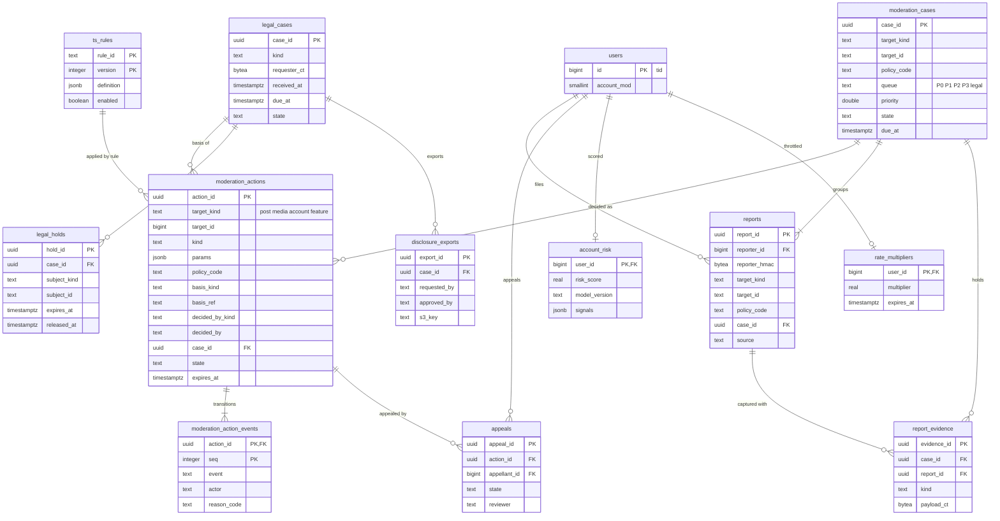

# Data model: トラスト＆セーフティと法令

措置と状態の出来事、通報と証拠の写し、案件、異議、アカウントの危険の点とレート制限の係数、規則、法令の案件、保全、開示の取り出し。振る舞いは [trust-and-safety.md](../trust-and-safety.md)、決定は [ADR-0038](../../decisions/0038-moderation-action-model.md)（措置）、[ADR-0039](../../decisions/0039-reports-queues-and-appeals.md)（通報・案件・異議）、[ADR-0040](../../decisions/0040-spam-and-bot-defense.md)（スパム）、[ADR-0041](../../decisions/0041-legal-requests-and-transparency.md)（法令）にある。規約は [data-model.md](../data-model.md) の 3 節。

## 1. ER 図

## 2. 共通

- 全部が運用の表（RLS の外）。`ts` のロールが書き、`ts_reader` が案件の ID を理由にして読む（[ADR-0052](../../decisions/0052-audit-and-operator-access.md)）。`report_evidence`・`legal_cases`・`legal_holds`・`disclosure_exports` は T&S と法務のロールだけが読める。読み出しは `audit_events` に理由（案件の ID）とともに残す。
- 利用者や通報者に見せる情報（措置の知らせ、異議の画面）は、`app-api` が本人の分だけを `SECURITY DEFINER` の関数（`ts_my_actions(user_id)`、`ts_my_reports(user_id)`）で読む。
- 時刻の期限（`due_at`）は `packages/legal-deadline` の 1 つの関数で計算し、規則のバージョンを `deadline_rule_version` に残す。

## 3. 措置

### 3.1 `moderation_actions`

措置の正本（[ADR-0038](../../decisions/0038-moderation-action-model.md)）。内容の列は書き換えない。状態の変化は `moderation_action_events` に行を足し、同じトランザクションで `state` を写す。

| 列 | 型 | NULL | 既定 | 説明 |
| --- | --- | --- | --- | --- |
| `action_id` | `uuid` | NOT NULL | `uuidv7()` | |
| `target_kind` | `text` | NOT NULL | — | `post`・`media`・`account`・`feature` |
| `target_id` | `bigint` | NOT NULL | — | 投稿・メディア・利用者の `tid`（`feature` は利用者） |
| `kind` | `text` | NOT NULL | — | `label`・`reduce`・`geo_withhold`・`remove`・`remove_media`・`interim_reduce`・`label_account`・`reduce_account`・`read_only`・`suspend`・`feature_limit` |
| `params` | `jsonb` | NOT NULL | `'{}'` | 地域（`geo`）、いいね・リポストを止めるか（`no_engage`）、年齢の制限（`age_gate`）、制限の値、解除の条件 |
| `policy_code` | `text` | NOT NULL | — | 規約の区分（[trust-and-safety.md](../trust-and-safety.md) の 4.1 節） |
| `policy_version` | `text` | NOT NULL | — | |
| `basis_kind` | `text` | NOT NULL | — | `policy`・`legal_case`・`hash_match`・`rule`・`report_threshold` |
| `basis_ref` | `text` | NULL | — | `legal_case:{uuid}`、`hash:{match_ref}`、`rule:{rule_id}@{version}` |
| `decided_by_kind` | `text` | NOT NULL | — | `human`・`rule` |
| `decided_by` | `text` | NOT NULL | — | 担当の ID か `rule:{rule_id}@{version}` |
| `approved_by` | `text` | NULL | — | 2 人目の承認 |
| `case_id` | `uuid` | NULL | — | → `moderation_cases` |
| `state` | `text` | NOT NULL | — | `pending_approval`・`active`・`rejected`・`expired`・`reversed`・`superseded` |
| `state_changed_at` | `timestamptz` | NOT NULL | `now()` | |
| `created_at` | `timestamptz` | NOT NULL | `now()` | |
| `expires_at` | `timestamptz` | NULL | — | |

- キー：PK `action_id`。FK `case_id` → `moderation_cases`。`target_id`・`basis_ref` は論理の参照。
- 索引：`(target_kind, target_id, state)` — 要約の畳み込み（効いている行の全部）。`(expires_at) WHERE state = 'active' AND expires_at IS NOT NULL` — 期限のジョブ。`(state, created_at) WHERE state = 'pending_approval'` — 2 人目の承認の待ち（24 時間）。
- CHECK：
  - 値の一覧（`target_kind`・`kind`・`basis_kind`・`decided_by_kind`・`state`）
  - `target_kind` と `kind` の組（`post` は `label`・`reduce`・`geo_withhold`・`remove`・`interim_reduce`、`media` は `remove_media`、`account` は `label_account`・`reduce_account`・`read_only`・`suspend`、`feature` は `feature_limit`）
  - `basis_kind = 'policy' OR basis_ref IS NOT NULL`、`decided_by_kind = 'human' OR kind IN (...規則に許す種類...)`（最終の判定は `ts_rules.allowed_actions`。PROP-TS-007）
  - `approved_by IS NULL OR approved_by <> decided_by`
- トリガー：`state`・`state_changed_at`・`approved_by` 以外の `UPDATE` を拒む。`state` の変更は、同じトランザクションで `moderation_action_events` に行があるときだけ許す。`DELETE` を拒む（保持のジョブを除く）。
- 要約：同じトランザクションで、対象の `posts.mod_flags`・`posts.mod_geo` か `users.account_mod`・`account_mod_detail`（[data-model.md](../data-model.md) の 3.5 節）と `state_version` を、効いている行の畳み込みで計算し直して書く。outbox に `moderation.action_applied`（流れ `moderation`、鍵は対象の ID）。
- 保持：**法務の L1・L8 の確認待ち**。S1 の量：1 日 数万行。

### 3.2 `moderation_action_events`

| 列 | 型 | NULL | 既定 | 説明 |
| --- | --- | --- | --- | --- |
| `action_id` | `uuid` | NOT NULL | — | |
| `seq` | `integer` | NOT NULL | — | 措置ごとの連番（1 は作成） |
| `event` | `text` | NOT NULL | — | `applied`・`requested_approval`・`approved`・`rejected`・`expired`・`reversed`・`superseded` |
| `actor` | `text` | NOT NULL | — | 担当の ID、`rule:...`、`system:expiry` |
| `reason_code` | `text` | NULL | — | 取り消しの理由など |
| `appeal_id` | `uuid` | NULL | — | 異議による取り消し |
| `created_at` | `timestamptz` | NOT NULL | `now()` | |

- キー：PK `(action_id, seq)`。FK `action_id` → `moderation_actions`、`appeal_id` → `appeals`。
- 更新：追記だけ（`UPDATE`・`DELETE` の権限を与えない）。
- 保持：措置と同じ。

## 4. 通報と案件

### 4.1 `reports`

| 列 | 型 | NULL | 既定 | 説明 |
| --- | --- | --- | --- | --- |
| `report_id` | `uuid` | NOT NULL | `uuidv7()` | |
| `reporter_id` | `bigint` | NULL | — | ログインしていない人と規則は NULL |
| `reporter_hmac` | `bytea` | NULL | — | 通報者の ID（かログインしていない人の連絡先）の HMAC。担当にはこれだけを出す |
| `target_kind` | `text` | NOT NULL | — | `post`・`account`・`media`・`dm`・`trend` |
| `target_id` | `text` | NOT NULL | — | `tid` の 10 進、DM は会話の ID、トレンドは語 |
| `policy_code` | `text` | NOT NULL | — | |
| `note` | `text` | NULL | — | 自由の記述（2,000 文字まで） |
| `legal_flag` | `boolean` | NOT NULL | `false` | 権利の侵害を主張する本人の通報の印（法令の担当の待ち行列にも入れる） |
| `case_id` | `uuid` | NOT NULL | — | → `moderation_cases` |
| `source` | `text` | NOT NULL | — | `app`・`api`・`web`・`rule` |
| `created_at` | `timestamptz` | NOT NULL | `now()` | |

- キー：PK `report_id`。FK `case_id` → `moderation_cases`、`reporter_id` → `users`（S1）。
- 索引：`(case_id, created_at)` — 案件の画面。`(reporter_id, created_at DESC)` — 通報者の採用の率（`reporter_trust`）と本人の通報の一覧。`(target_kind, target_id, created_at DESC)` — 対象の履歴と別々の通報者の数（閾値の `interim_reduce`）。
- CHECK：値の一覧、`char_length(note) <= 2000`、`reporter_id IS NOT NULL OR source IN ('web','rule')`。
- 保持：法務の L8 の確認待ち。S1 の量：1 日 数万行。

### 4.2 `report_evidence`

通報の時の対象の写し。T&S の KMS の鍵 `ts-evidence` で暗号化する（[ADR-0051](../../decisions/0051-encryption-and-key-layout.md) の注記）。

| 列 | 型 | NULL | 既定 | 説明 |
| --- | --- | --- | --- | --- |
| `evidence_id` | `uuid` | NOT NULL | `uuidv7()` | |
| `case_id` | `uuid` | NOT NULL | — | |
| `report_id` | `uuid` | NULL | — | 規則の案件は NULL |
| `kind` | `text` | NOT NULL | — | `post_snapshot`・`dm_messages`・`media_ref` |
| `payload_ct` | `bytea` | NOT NULL | — | 写しの JSON の暗号文（本文、メディアの ID、作者の表示名。DM は選んだメッセージと文脈の 5 件） |
| `captured_at` | `timestamptz` | NOT NULL | `now()` | |

- キー：PK `evidence_id`。FK `case_id` → `moderation_cases`、`report_id` → `reports`。索引 `(case_id)`。
- CHECK：`kind IN ('post_snapshot','dm_messages','media_ref')`。`dm_messages` は `release.dm_report_evidence` が有効なときだけ書く（L3 の確認待ち）。
- 保持：案件と同じ（L8）。

### 4.3 `moderation_cases`

同じ対象・同じ区分の通報をまとめた案件（[ADR-0039](../../decisions/0039-reports-queues-and-appeals.md)）。

| 列 | 型 | NULL | 既定 | 説明 |
| --- | --- | --- | --- | --- |
| `case_id` | `uuid` | NOT NULL | `uuidv7()` | |
| `target_kind` | `text` | NOT NULL | — | `reports.target_kind` と同じ |
| `target_id` | `text` | NOT NULL | — | |
| `policy_code` | `text` | NOT NULL | — | |
| `queue` | `text` | NOT NULL | — | `P0`・`P1`・`P2`・`P3`・`legal` |
| `priority` | `double precision` | NOT NULL | — | `severity · reach · reporter_trust · velocity` |
| `state` | `text` | NOT NULL | `'open'` | `open`・`in_review`・`decided`・`closed` |
| `assignee` | `text` | NULL | — | |
| `report_count` | `integer` | NOT NULL | `0` | |
| `distinct_reporters` | `integer` | NOT NULL | `0` | |
| `first_touched_at` | `timestamptz` | NULL | — | 初動（NFR-010） |
| `due_at` | `timestamptz` | NOT NULL | — | 待ち行列ごとの初動の期限 |
| `decided_at` | `timestamptz` | NULL | — | |
| `outcome` | `text` | NULL | — | `actioned`・`no_violation`・`auto_closed` |
| `created_at` | `timestamptz` | NOT NULL | `now()` | |

- キー：PK `case_id`。
- 一意：`UNIQUE (target_kind, target_id, policy_code) WHERE state IN ('open','in_review')`（開いている案件は 1 つ）。
- 索引：`(queue, priority DESC) WHERE state IN ('open','in_review')` — 待ち行列。`(due_at) WHERE first_touched_at IS NULL` — P0 の 30 分の呼び出し、期限の超過。
- CHECK：値の一覧、`state <> 'decided' OR outcome IS NOT NULL`。
- 保持：法務の L8 の確認待ち。S1 の量：1 日 数万行。

### 4.4 `appeals`

| 列 | 型 | NULL | 既定 | 説明 |
| --- | --- | --- | --- | --- |
| `appeal_id` | `uuid` | NOT NULL | `uuidv7()` | |
| `action_id` | `uuid` | NOT NULL | — | |
| `appellant_id` | `bigint` | NOT NULL | — | |
| `statement` | `text` | NOT NULL | — | 2,000 文字まで |
| `state` | `text` | NOT NULL | `'open'` | `open`・`in_review`・`upheld`・`overturned`・`withdrawn` |
| `reviewer` | `text` | NULL | — | |
| `outcome` | `text` | NULL | — | 理由のコード |
| `created_at` | `timestamptz` | NOT NULL | `now()` | |
| `decided_at` | `timestamptz` | NULL | — | |

- キー：PK `appeal_id`。FK `action_id` → `moderation_actions`、`appellant_id` → `users`。
- 一意：`UNIQUE (action_id) WHERE state IN ('open','in_review')`。
- トリガー：`reviewer` が元の措置の `decided_by`・`approved_by` と同じなら拒む（PROP-TS-005）。
- 保持：措置と同じ。

## 5. スパムとボット

### 5.1 `account_risk`

アカウントの危険の点（[trust-and-safety.md](../trust-and-safety.md) の 8.3 節）。写しは `af:`・`as:`。

| 列 | 型 | NULL | 既定 | 説明 |
| --- | --- | --- | --- | --- |
| `user_id` | `bigint` | NOT NULL | — | |
| `risk_score` | `real` | NOT NULL | — | 0〜1 |
| `model_version` | `text` | NOT NULL | — | |
| `signals` | `jsonb` | NOT NULL | `'{}'` | 規則の ID と値 |
| `copyright_strikes` | `integer` | NOT NULL | `0` | 著作権の侵害の回数（L6。[trust-and-safety.md](../trust-and-safety.md) の 10.4 節） |
| `updated_at` | `timestamptz` | NOT NULL | `now()` | |

- キー：PK `user_id`。FK → `users`。CHECK `risk_score BETWEEN 0 AND 1`。
- 点は `visible()` に入らない（[ADR-0006](../../decisions/0006-ranking-boundary.md)）。点の変化は `accounts` の流れへ。
- S1 の量：300 万行。

### 5.2 `rate_multipliers`

レート制限の係数（措置ではない）。

| 列 | 型 | NULL | 既定 | 説明 |
| --- | --- | --- | --- | --- |
| `user_id` | `bigint` | NOT NULL | — | |
| `multiplier` | `real` | NOT NULL | — | 0〜1 |
| `reason` | `text` | NOT NULL | — | `risk_band`・`manual` |
| `expires_at` | `timestamptz` | NULL | — | |
| `created_at` | `timestamptz` | NOT NULL | `now()` | |

- キー：PK `user_id`。CHECK `multiplier > 0 AND multiplier <= 1`。
- 読み出し：`auth` がセッションの写しを作るときに読み、写しに入れる（[api-and-rate-limits.md](../api-and-rate-limits.md) の 5.3 節）。

### 5.3 `ts_rules`

行動の規則と自動の措置の規則。バージョンで管理する。

| 列 | 型 | NULL | 既定 | 説明 |
| --- | --- | --- | --- | --- |
| `rule_id` | `text` | NOT NULL | — | |
| `version` | `integer` | NOT NULL | — | |
| `definition` | `jsonb` | NOT NULL | — | 条件と窓 |
| `allowed_actions` | `text[]` | NOT NULL | — | 許す措置の種類（[trust-and-safety.md](../trust-and-safety.md) の 6.4 節） |
| `precision_checked_at` | `timestamptz` | NULL | — | 週ごとの抜き取りで 99% 以上を確かめた時刻 |
| `enabled` | `boolean` | NOT NULL | `false` | |
| `created_by` | `text` | NOT NULL | — | |
| `created_at` | `timestamptz` | NOT NULL | `now()` | |

- キー：PK `(rule_id, version)`。一意：`UNIQUE (rule_id) WHERE enabled`。
- CHECK：`NOT ('remove' = ANY(allowed_actions) OR 'suspend' = ANY(allowed_actions)) OR precision_checked_at IS NOT NULL`（照合の一致の規則を除く。除く規則は `definition.kind = 'hash_match'`）。
- 保持：消さない。S1 の量：数百行。

## 6. 法令

### 6.1 `legal_cases`

法令の案件（[ADR-0041](../../decisions/0041-legal-requests-and-transparency.md)）。通報と別の表。

| 列 | 型 | NULL | 既定 | 説明 |
| --- | --- | --- | --- | --- |
| `case_id` | `uuid` | NOT NULL | `uuidv7()` | |
| `kind` | `text` | NOT NULL | — | `takedown`・`disclosure_order`・`provision_order`・`erasure_prohibition`・`voluntary_disclosure`・`law_enforcement`・`copyright` |
| `requester_ct` | `bytea` | NOT NULL | — | 申出者の名前・連絡先・代理の有無の暗号文（`ts-evidence` の鍵） |
| `targets` | `jsonb` | NOT NULL | — | 対象の URL と解決した `{kind, id}` の列 |
| `claim_ct` | `bytea` | NULL | — | 侵害された権利と理由の暗号文 |
| `received_at` | `timestamptz` | NOT NULL | `now()` | |
| `due_at` | `timestamptz` | NULL | — | `legal.*` の値から計算。値が未定の種類は NULL |
| `deadline_rule_version` | `text` | NULL | — | |
| `state` | `text` | NOT NULL | `'received'` | `received`・`in_review`・`decided`・`closed` |
| `decision` | `text` | NULL | — | `actioned`・`no_action`・`disclosed`・`refused` |
| `decision_reason` | `text` | NULL | — | |
| `decided_at` | `timestamptz` | NULL | — | |
| `notifications` | `jsonb` | NOT NULL | `'[]'` | 送り先・型・時刻の列 |
| `created_at` | `timestamptz` | NOT NULL | `now()` | |

- キー：PK `case_id`。
- 索引：`(due_at) WHERE state IN ('received','in_review')` — 48 時間前・24 時間前の警告（NFR-010）。`(kind, received_at)` — 公表の集計。
- CHECK：値の一覧、`state <> 'decided' OR (decision IS NOT NULL AND decision_reason IS NOT NULL)`。
- 保持：法務の L1・L2・L8 の確認待ち。S1 の量：年 数千行。

### 6.2 `legal_holds`

保全。保持のジョブは物理の削除の前に必ず引く（[ADR-0053](../../decisions/0053-data-lifecycle-and-retention.md)）。

| 列 | 型 | NULL | 既定 | 説明 |
| --- | --- | --- | --- | --- |
| `hold_id` | `uuid` | NOT NULL | `uuidv7()` | |
| `case_id` | `uuid` | NOT NULL | — | → `legal_cases` |
| `subject_kind` | `text` | NOT NULL | — | `user`・`post`・`media`・`dm_conversation` |
| `subject_id` | `text` | NOT NULL | — | `tid` の 10 進か会話の ID |
| `scope` | `text[]` | NOT NULL | — | 止めるデータの種類（`retention_policies.kind` の値。例：`posts`・`login_events`・`post_origin_logs`・`media`・`dm`） |
| `period_from`・`period_to` | `timestamptz` | NULL | — | 対象のデータの期間（領域の文書の `from`・`to`。SQL の予約語を避けた名前） |
| `expires_at` | `timestamptz` | NULL | — | |
| `released_at` | `timestamptz` | NULL | — | |
| `created_by` | `text` | NOT NULL | — | |
| `created_at` | `timestamptz` | NOT NULL | `now()` | |

- キー：PK `hold_id`。FK `case_id` → `legal_cases`。
- 索引：`(subject_kind, subject_id) WHERE released_at IS NULL` — 削除の前の確かめ（`retention` は関数 `is_held(kind, id, data_kind, at)` だけを使う）。
- CHECK：`subject_kind IN (...)`、`period_from IS NULL OR period_to IS NULL OR period_from <= period_to`。
- 作成と解除は `audit_events` に書く。保持：解除の後も消さない（法務の L8）。

### 6.3 `disclosure_exports`

開示の取り出し。2 人の承認。

| 列 | 型 | NULL | 既定 | 説明 |
| --- | --- | --- | --- | --- |
| `export_id` | `uuid` | NOT NULL | `uuidv7()` | |
| `case_id` | `uuid` | NOT NULL | — | → `legal_cases` |
| `fields` | `text[]` | NOT NULL | — | 取り出す項目（`login_events.ip`・`post_origin_logs.ip`・`user_contacts.phone` など） |
| `requested_by` | `text` | NOT NULL | — | |
| `approved_by` | `text` | NULL | — | |
| `s3_key` | `text` | NULL | — | 暗号化した束（[stores.md](stores.md) の 4 節） |
| `delivered_at` | `timestamptz` | NULL | — | |
| `expires_at` | `timestamptz` | NULL | — | |
| `created_at` | `timestamptz` | NOT NULL | `now()` | |

- キー：PK `export_id`。FK `case_id` → `legal_cases`。
- CHECK：`approved_by IS NULL OR approved_by <> requested_by`、`s3_key IS NULL OR approved_by IS NOT NULL`。
- 保持：法務の L2・L8 の確認待ち。

## 7. 書き込みのまとまり

| 操作 | 1 つのトランザクションで書く表 |
| --- | --- |
| 投稿の措置 | `moderation_actions`、`moderation_action_events`（`applied`）、`posts`（`mod_flags`・`mod_geo`・`state_version`）、`moderation_cases`（`decided`）、`outbox`（`moderation.action_applied`）、`audit_events` |
| アカウントの措置 | 同上で `users`（`account_mod`・`account_mod_detail`・`state_version`）。`suspend` は続けて Accounts の内部の API で `users.state` を変える（[accounts-and-auth.md](../accounts-and-auth.md) の 8.1 節） |
| 取り消し・期限・置き換え | `moderation_action_events`、`moderation_actions.state`、要約の計算し直し、`outbox`（`moderation.action_reversed` など） |
| 通報 | `moderation_cases`（なければ作る）、`reports`、`report_evidence` |
