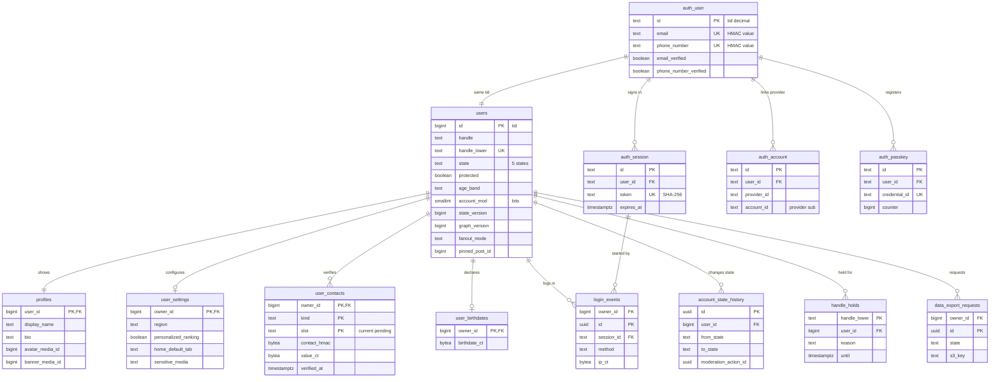

# Data model: 利用者とアカウント

認証（`auth` スキーマ）、公開の利用者の表、プロフィール、ハンドルの保留、状態の記録、本人だけの設定・連絡先・生年月日・ログインの記録・データの書き出し。振る舞いは [accounts-and-auth.md](../accounts-and-auth.md)、決定は [ADR-0043](../../decisions/0043-auth-methods-and-sessions.md)（認証とセッション）と [ADR-0044](../../decisions/0044-account-states-deletion-and-age.md)（状態・削除・年齢）にある。規約は [data-model.md](../data-model.md) の 3 節。

## 1. ER 図

`auth.*` の表は図では `auth_user` のように書く。`auth.user.id` と `users.id` は同じ値（`tid` の 10 進の文字列と `bigint`）で、型が違うので DB の外部キーは張らない。

## 2. `auth` スキーマ（Better Auth）

- Better Auth の表は `auth` スキーマに置き、`auth` のロールだけが読み書きする（RLS の外。[data-model.md](../data-model.md) の 3.4 節）。他のサービスは読まない。
- 列の名前は Better Auth の `fields` の設定で snake_case にする。表の名前は Better Auth の既定（単数形）のままにする。
- **連絡先の平文を持たない**（[security.md](../security.md) の 5.3 節）。Better Auth は `user.email`・`user.phone_number` で利用者を引くので、`packages/auth` のデータベースのフックで、正規化した値の HMAC を `hmac:<kid>:<base64url>` の文字列にして入れる。OTP の送信は、入力された値を送信の関数が受け取って送るので、DB の平文は要らない。電話だけで登録した人の `email` は Better Auth の仮のメール（`p<tid>@invalid`）にする。この扱いは統合の後の決定（[README.md](../README.md) の 6 節）で、E2 の `auth-signup-login` で Better Auth の版に合うかを確かめる。
- IP アドレスは `auth.session` に残さない（`advanced.ipAddress.disableIpTracking`）。ログインの IP は `login_events` に暗号文で持つ。

### 2.1 `auth.user`

| 列 | 型 | NULL | 既定 | 説明 |
| --- | --- | --- | --- | --- |
| `id` | `text` | NOT NULL | — | `packages/tid` で振った 10 進の文字列。`users.id` と同じ値 |
| `name` | `text` | NOT NULL | `''` | Better Auth の必須の列。表示に使わない（表示名は `profiles`） |
| `email` | `text` | NOT NULL | — | 正規化したメールアドレスの HMAC か、仮のメール。平文を入れない |
| `email_verified` | `boolean` | NOT NULL | `false` | |
| `image` | `text` | NULL | — | 使わない（アイコンは `profiles`） |
| `phone_number` | `text` | NULL | — | E.164 に正規化した番号の HMAC |
| `phone_number_verified` | `boolean` | NOT NULL | `false` | |
| `created_at`・`updated_at` | `timestamptz` | NOT NULL | `now()` | |

- キー：PK `id`。UK `email`、UK `phone_number`。
- CHECK：`id ~ '^[1-9][0-9]{0,18}$'`、`email ~ '^(hmac:|p[0-9]+@invalid$)'`。
- 保持：アカウントの削除の後は `users` と同じ（[security.md](../security.md) の 7.1 節。法務の L8 の確認待ち）。S1 の量：300 万行。

### 2.2 `auth.session`

| 列 | 型 | NULL | 既定 | 説明 |
| --- | --- | --- | --- | --- |
| `id` | `text` | NOT NULL | — | UUIDv7 の文字列 |
| `user_id` | `text` | NOT NULL | — | → `auth.user` |
| `token` | `text` | NOT NULL | — | トークンの SHA-256（16 進）。平文を持たない（[accounts-and-auth.md](../accounts-and-auth.md) の 6.1 節） |
| `expires_at` | `timestamptz` | NOT NULL | — | Web 30 日、アプリ 90 日（使うたびに延ばす。`updateAge` 1 日） |
| `user_agent` | `text` | NULL | — | 端末の一覧の表示用の粗い名前（OS とブラウザの種類）。生の User-Agent を入れない |
| `ip_address` | `text` | NULL | — | 常に NULL |
| `client_kind` | `text` | NOT NULL | — | `web`・`ios`・`android`（Better Auth の追加の列） |
| `created_at`・`updated_at` | `timestamptz` | NOT NULL | `now()` | |

- キー：PK `id`。UK `token`。FK `user_id` → `auth.user(id)`（`ON DELETE CASCADE`）。
- 索引：`(user_id)` — 端末の一覧と全部の取り消し。`(expires_at)` — 切れた行の掃除。
- 保持：切れたら 7 日で消す。写しは Valkey の `sess:{sha256}`（[stores.md](stores.md) の 1.4 節）。S1 の量：200 万行。

### 2.3 `auth.account`

Google・Apple の結び付け。Better Auth の `account` の表で、パスワードの列（`password`）は使わない。

| 列 | 型 | NULL | 既定 | 説明 |
| --- | --- | --- | --- | --- |
| `id` | `text` | NOT NULL | — | |
| `user_id` | `text` | NOT NULL | — | → `auth.user` |
| `provider_id` | `text` | NOT NULL | — | `google`・`apple` |
| `account_id` | `text` | NOT NULL | — | 提供者の `sub` |
| `access_token`・`refresh_token`・`id_token`・`password` | `text` | NULL | — | 常に NULL（提供者のトークンを持たない） |
| `created_at`・`updated_at` | `timestamptz` | NOT NULL | `now()` | |

- キー：PK `id`。UK `(provider_id, account_id)` — 結び付けの決定表の 1 行目（[accounts-and-auth.md](../accounts-and-auth.md) の 5.2 節）。FK `user_id` → `auth.user`。
- CHECK：`provider_id IN ('google','apple')`、`password IS NULL`。
- S1 の量：100 万行。

### 2.4 `auth.verification`

登録の前の入力と OTP。

| 列 | 型 | NULL | 既定 | 説明 |
| --- | --- | --- | --- | --- |
| `id` | `text` | NOT NULL | — | |
| `identifier` | `text` | NOT NULL | — | 目的と連絡先の HMAC（`signup:hmac:...`） |
| `value` | `text` | NOT NULL | — | OTP のハッシュと試行の回数（`storeOTP: 'hashed'`） |
| `expires_at` | `timestamptz` | NOT NULL | — | 10 分 |
| `created_at`・`updated_at` | `timestamptz` | NOT NULL | `now()` | |

- 索引：`(identifier)`、`(expires_at)`。保持：期限の後に消す。S1 の量：数万行。

### 2.5 `auth.passkey`

| 列 | 型 | NULL | 既定 | 説明 |
| --- | --- | --- | --- | --- |
| `id` | `text` | NOT NULL | — | |
| `user_id` | `text` | NOT NULL | — | → `auth.user` |
| `name` | `text` | NULL | — | 利用者が付けた名前 |
| `public_key` | `text` | NOT NULL | — | |
| `credential_id` | `text` | NOT NULL | — | |
| `counter` | `bigint` | NOT NULL | `0` | |
| `device_type` | `text` | NOT NULL | — | `singleDevice`・`multiDevice` |
| `backed_up` | `boolean` | NOT NULL | — | |
| `transports` | `text` | NULL | — | |
| `aaguid` | `text` | NULL | — | |
| `created_at` | `timestamptz` | NOT NULL | `now()` | |

- キー：PK `id`。UK `credential_id`。FK `user_id` → `auth.user`。索引 `(user_id)`。
- `login_policy = 'strong'` の条件（パスキー 2 つ以上）は、`accounts` のサービスが数えて確かめる。
- S1 の量：50 万行。

## 3. 公開の表

### 3.1 `users`

利用者の公開の行。持ち主は Accounts。他の領域が求めた列もここに置き、列ごとに書けるロールを分ける（[data-model.md](../data-model.md) の 3.3 節）。定義元：[accounts-and-auth.md](../accounts-and-auth.md) の 7・8・12 節。

| 列 | 型 | NULL | 既定 | 説明 | 書く |
| --- | --- | --- | --- | --- | --- |
| `id` | `bigint` | NOT NULL | — | `tid` | `accounts` |
| `handle` | `text` | NOT NULL | — | 表示の大文字・小文字を保つ。4〜15 文字。仮のハンドルは `u` ＋ `tid` の下 10 桁 | `accounts` |
| `handle_lower` | `text` | NOT NULL | 生成列 `lower(handle)` | 一意の判定 | — |
| `state` | `text` | NOT NULL | `'active'` | `active`・`locked`・`suspended`・`deactivated`・`deleted` | `accounts` |
| `protected` | `boolean` | NOT NULL | `false` | 鍵アカウント | `accounts` |
| `login_policy` | `text` | NOT NULL | `'standard'` | `standard`・`strong` | `accounts` |
| `age_band` | `text` | NOT NULL | — | `minor`・`adult`（`under_min` は登録を拒むので行がない）。境の値は L5 の後 | `accounts` |
| `age_verified_at` | `timestamptz` | NULL | — | 年齢の確かめ（L5 で必要になったら） | `accounts` |
| `age_verify_method` | `text` | NULL | — | 書類の画像は持たない | `accounts` |
| `account_mod` | `smallint` | NOT NULL | `0` | アカウントの措置の要約のビット（[data-model.md](../data-model.md) の 3.5 節） | `ts` |
| `account_mod_detail` | `jsonb` | NOT NULL | `'{}'` | 要約の値：期限、`feature_limit` の種類と値、解除の条件 | `ts` |
| `state_version` | `bigint` | NOT NULL | `1` | 作者の状態の写し `as:` の版。`state`・`protected`・`account_mod` を変えるたびに 1 上げる | `accounts`、`ts` |
| `graph_version` | `bigint` | NOT NULL | `0` | 閲覧者の集合の版（[ADR-0012](../../decisions/0012-viewer-sets-cache.md)） | `graph` |
| `fanout_mode` | `text` | NOT NULL | `'push'` | `push`・`pull`（[ADR-0003](../../decisions/0003-timeline-fanout-hybrid.md)） | `stream_consumer`（Graph の数の消費者） |
| `fanout_mode_changed_at` | `timestamptz` | NULL | — | | 同上 |
| `pinned_post_id` | `bigint` | NULL | — | 固定の投稿（論理の参照 → `posts`） | `accounts` |
| `flags` | `text[]` | NOT NULL | `'{}'` | `synthetic`（合成監視のアカウント。[observability.md](../observability.md) の 4.2 節） | `accounts` |
| `created_at` | `timestamptz` | NOT NULL | `tid` の時刻 | 登録の時刻 | トリガー |
| `state_changed_at` | `timestamptz` | NOT NULL | `now()` | | `accounts` |
| `deleted_at` | `timestamptz` | NULL | — | `deleted` に入った時刻（墓石） | `accounts` |
| `updated_at` | `timestamptz` | NOT NULL | `now()` | | 全部 |

- キー：PK `id`。UK `handle_lower`。
- 索引：
  - `(state_changed_at) WHERE state = 'deactivated'` — 30 日の猶予の満了のジョブ。
  - `(id) WHERE fanout_mode = 'pull'` — `fanout:pull_any` の作り直し（[timeline-fanout.md](../timeline-fanout.md) の 4 節）。
  - `(id) WHERE 'synthetic' = ANY(flags)` — 合成監視のアカウントを指標から除く。
- CHECK：
  - `handle ~ '^[A-Za-z0-9_]{4,15}$'`
  - `state IN ('active','locked','suspended','deactivated','deleted')`、`(state = 'deleted') = (deleted_at IS NOT NULL)`
  - `login_policy IN ('standard','strong')`、`age_band IN ('minor','adult')`、`fanout_mode IN ('push','pull')`
  - `flags <@ ARRAY['synthetic']`
- トリガー：`state`・`protected`・`account_mod` の変更で `state_version` が上がらない更新を拒む（[ADR-0009](../../decisions/0009-post-state-tombstones-and-state-cache.md) の lint と同じ考え方）。`graph_version` は減らす更新を拒む。
- RLS：なし（公開の表）。見える範囲は `visible()` の利用者の版（[ADR-0004](../../decisions/0004-single-tenant-and-visibility.md)）。
- 保持：`deleted` の行は墓石として残す（ID・`state`・`deleted_at`）。ハンドルは 90 日の保留の後に空ける。中身の物理の削除は法務の L8 の後（[security.md](../security.md) の 7.1 節）。
- S1 の量：300 万行、1 行 約 300 B。

### 3.2 `profiles`

表示名・自己紹介など。`users` と 1 対 1 で、登録のトランザクションで作る。

| 列 | 型 | NULL | 既定 | 説明 |
| --- | --- | --- | --- | --- |
| `user_id` | `bigint` | NOT NULL | — | → `users` |
| `display_name` | `text` | NOT NULL | — | 50 文字まで（NFC） |
| `bio` | `text` | NULL | — | 160 文字まで |
| `location` | `text` | NULL | — | 30 文字まで |
| `url` | `text` | NULL | — | 100 文字まで |
| `avatar_media_id` | `bigint` | NULL | — | → `media`（`purpose = avatar`） |
| `banner_media_id` | `bigint` | NULL | — | → `media`（`purpose = banner`） |
| `updated_at` | `timestamptz` | NOT NULL | `now()` | |

- キー：PK `user_id`。FK `user_id` → `users`（`ON DELETE CASCADE`）。`avatar_media_id`・`banner_media_id` は論理の参照（S2 でメディアが別のクラスタになるため）。
- CHECK：`char_length(display_name) BETWEEN 1 AND 50`、`char_length(bio) <= 160`。
- 更新：表示名の変更は検索の索引（`users-v1`）に `accounts` の流れで届く。
- 保持：アカウントの削除で中身を消す（行は残さない）。S1 の量：300 万行。

### 3.3 `handle_holds`

変更・削除の後のハンドルの保留。

| 列 | 型 | NULL | 既定 | 説明 |
| --- | --- | --- | --- | --- |
| `handle_lower` | `text` | NOT NULL | — | |
| `user_id` | `bigint` | NOT NULL | — | 元の持ち主（戻せる人） |
| `reason` | `text` | NOT NULL | — | `changed`（30 日）・`deleted`（90 日）・`reserved`（運営の予約） |
| `until` | `timestamptz` | NULL | — | `reserved` は NULL |
| `created_at` | `timestamptz` | NOT NULL | `now()` | |

- キー：PK `handle_lower`。FK `user_id` → `users`。
- 索引：`(until)` — 期限の切れた行の掃除。
- 新しいハンドルの登録は、`users.handle_lower` の一意と、この表に `until > now()` の行がない（または元の持ち主）ことを、同じトランザクションで確かめる。
- S1 の量：数十万行。

### 3.4 `account_state_history`

状態の遷移の記録。運用の表（`accounts` が書き、`ts_reader` が読む）。

| 列 | 型 | NULL | 既定 | 説明 |
| --- | --- | --- | --- | --- |
| `id` | `uuid` | NOT NULL | `uuidv7()` | |
| `user_id` | `bigint` | NOT NULL | — | |
| `from_state`・`to_state` | `text` | NOT NULL | — | `users.state` の値 |
| `reason` | `text` | NOT NULL | — | `user_request`・`grace_expired`・`moderation`・`takeover_suspected`・`restored` |
| `actor_kind` | `text` | NOT NULL | — | `user`・`system`・`moderator` |
| `actor_id` | `text` | NULL | — | |
| `moderation_action_id` | `uuid` | NULL | — | → `moderation_actions`（措置による遷移） |
| `created_at` | `timestamptz` | NOT NULL | `now()` | |

- キー：PK `id`。FK `user_id` → `users`。
- 索引：`(user_id, created_at DESC)` — 作業の画面の履歴。
- 更新：追記だけ（`UPDATE`・`DELETE` の権限を与えない）。
- 保持：法務の L8 の確認待ち。S1 の量：年 数十万行。

## 4. 本人だけの表

どれも `owner_id` と FORCE RLS を持つ（[data-model.md](../data-model.md) の 3.2 節のポリシー）。

### 4.1 `user_settings`

| 列 | 型 | NULL | 既定 | 説明 |
| --- | --- | --- | --- | --- |
| `owner_id` | `bigint` | NOT NULL | — | |
| `region` | `text` | NULL | — | 地方（トレンドの地域。[search-and-trends.md](../search-and-trends.md) の 9.2 節）。値の一覧は 9.2 節 |
| `personalized_ranking` | `boolean` | NOT NULL | `true` | 個人化するおすすめ（既定は L4 の後に見直す） |
| `home_default_tab` | `text` | NOT NULL | `'for_you'` | `for_you`・`following` |
| `sensitive_media` | `text` | NOT NULL | `'warn'` | `hide`・`warn`・`show`。`minor` は `hide` に固定 |
| `locale` | `text` | NOT NULL | `'ja'` | BCP 47 |
| `updated_at` | `timestamptz` | NOT NULL | `now()` | |

- キー：PK `owner_id`。FK `owner_id` → `users`。行がない利用者は既定の値で扱う。
- CHECK：`home_default_tab IN ('for_you','following')`、`sensitive_media IN ('hide','warn','show')`。
- 読み出し：`app-api` は本人の権限で読み、`visible()` の `ViewerContext`（センシティブ・地域）とランキングに渡す。セッションの写しに入れない。
- S1 の量：300 万行。

### 4.2 `user_contacts`

電話・メール。平文を持たない（[ADR-0051](../../decisions/0051-encryption-and-key-layout.md)）。

| 列 | 型 | NULL | 既定 | 説明 |
| --- | --- | --- | --- | --- |
| `owner_id` | `bigint` | NOT NULL | — | |
| `kind` | `text` | NOT NULL | — | `phone`・`email` |
| `slot` | `text` | NOT NULL | `'current'` | `current`・`pending`（変更の保留の間の新しい連絡先） |
| `value_ct` | `bytea` | NOT NULL | — | 封筒の暗号文（`pii` の鍵） |
| `contact_hmac` | `bytea` | NOT NULL | — | 正規化した値の HMAC-SHA256（鍵 `contact-hmac`） |
| `hmac_kid` | `smallint` | NOT NULL | — | HMAC の鍵の版 |
| `verified_at` | `timestamptz` | NULL | — | |
| `pending_until` | `timestamptz` | NULL | — | 48 時間（パスキーなら 24 時間）の保留の終わり |
| `created_at`・`updated_at` | `timestamptz` | NOT NULL | `now()` | |

- キー：PK `(owner_id, kind, slot)`。FK `owner_id` → `users`。
- 一意：`UNIQUE (contact_hmac) WHERE kind = 'email' AND slot = 'current'`（1 つのメールは 1 アカウント）。電話は 5 アカウントまで（`ts.registration.max_accounts_per_phone`）なので一意にせず、索引 `(contact_hmac) WHERE kind = 'phone'` で数える。
- CHECK：`kind IN ('phone','email')`、`slot IN ('current','pending')`、`slot = 'current' OR pending_until IS NOT NULL`。
- RLS：本人。重複の判定と数え上げは `auth` のロールが `SECURITY DEFINER` の関数 `contact_owner_count(hmac)` で行い、件数だけを返す。
- 保持：アカウントがある間。削除の後は L2・L8 の確認待ち。S1 の量：450 万行。

### 4.3 `user_birthdates`

| 列 | 型 | NULL | 既定 | 説明 |
| --- | --- | --- | --- | --- |
| `owner_id` | `bigint` | NOT NULL | — | |
| `birthdate_ct` | `bytea` | NOT NULL | — | 封筒の暗号文（`pii` の鍵） |
| `updated_at` | `timestamptz` | NOT NULL | `now()` | |

- キー：PK `owner_id`。FK → `users`。
- 読むのは Accounts だけ（`age_band` の毎日の計算）。毎日のジョブは `accounts` の `SECURITY DEFINER` の関数で読み、結果の `age_band` だけを書く。
- S1 の量：300 万行。

### 4.4 `login_events`

ログインの記録。発信者情報の開示（L2）に使う。定義元：[accounts-and-auth.md](../accounts-and-auth.md) の 6.4 節。

| 列 | 型 | NULL | 既定 | 説明 |
| --- | --- | --- | --- | --- |
| `owner_id` | `bigint` | NOT NULL | — | |
| `id` | `uuid` | NOT NULL | `uuidv7()` | |
| `session_id` | `text` | NULL | — | → `auth.session`（論理の参照。セッションは先に消える） |
| `method` | `text` | NOT NULL | — | `phone_otp`・`email_otp`・`passkey`・`google`・`apple` |
| `ip_ct` | `bytea` | NOT NULL | — | 封筒の暗号文（`pii-logs` の鍵） |
| `port_ct` | `bytea` | NULL | — | 同上 |
| `ua_hash` | `bytea` | NULL | — | User-Agent の HMAC（乗っ取りの検出の比較用） |
| `country` | `text` | NULL | — | ISO 3166-1 alpha-2 |
| `asn` | `integer` | NULL | — | |
| `created_at` | `timestamptz` | NOT NULL | `now()` | |

- キー：PK `(owner_id, id, created_at)`（パーティションの鍵を含める）。
- 索引：`(owner_id, created_at DESC)` — 本人のログインの履歴。
- 分割：`created_at` の月。
- RLS：本人。開示は `ts_reader` が案件の ID つきの関数で読む（[security.md](../security.md) の 6.3 節）。
- 保持：**法務の L2・L8 の確認待ち**。値が決まるまで消さない（`retention.login_events.enabled = false`）。
- S1 の量：1 日 約 100 万行、1 行 約 150 B。年 約 55 GB。

### 4.5 `data_export_requests`

データの書き出し（[accounts-and-auth.md](../accounts-and-auth.md) の 5.4 節）。

| 列 | 型 | NULL | 既定 | 説明 |
| --- | --- | --- | --- | --- |
| `owner_id` | `bigint` | NOT NULL | — | |
| `id` | `uuid` | NOT NULL | `uuidv7()` | |
| `state` | `text` | NOT NULL | `'requested'` | `requested`・`building`・`ready`・`expired`・`failed` |
| `requested_at` | `timestamptz` | NOT NULL | `now()` | |
| `ready_at` | `timestamptz` | NULL | — | |
| `s3_key` | `text` | NULL | — | 書き出しの束（[stores.md](stores.md) の 4 節） |
| `expires_at` | `timestamptz` | NULL | — | 渡してから 7 日 |

- キー：PK `(owner_id, id)`。
- 一意：`UNIQUE (owner_id) WHERE state IN ('requested','building')`（同時に 1 つ）。
- 索引：`(state, requested_at)` — 作るジョブ（ジョブは `SECURITY DEFINER` の関数で候補の `(owner_id, id)` だけを引き、本人の権限で処理する）。
- 保持：`expired` の後 30 日で消す。S1 の量：月 数千行。

## 5. 書き込みのまとまり

| 操作 | 1 つのトランザクションで書く表 |
| --- | --- |
| 登録 | `auth.user`、`users`、`profiles`、`user_contacts`、`user_birthdates`、`outbox`（`accounts.registered`） |
| 鍵の切り替え | `users`（`protected`・`state_version`）、`outbox`（`accounts.protected_changed`）。保留の申請の承認は [graph.md](graph.md) |
| 状態の変更 | `users`（`state`・`state_version`）、`account_state_history`、`outbox`（`accounts.state_changed`）、`audit_events` |
| 連絡先の変更 | `user_contacts`（`pending`）、`audit_events`。保留の満了で `current` に入れ替える |
