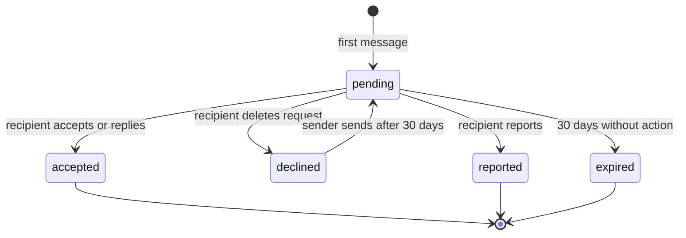
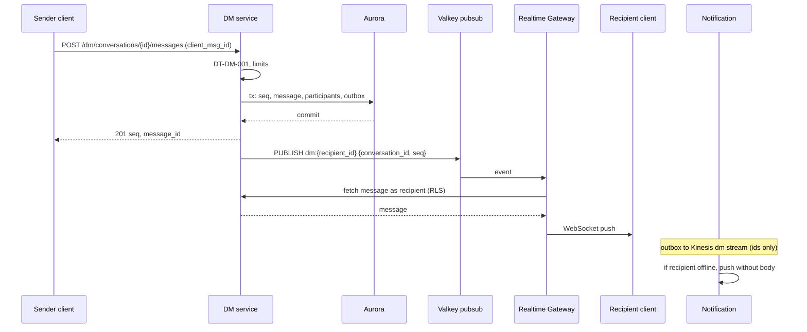
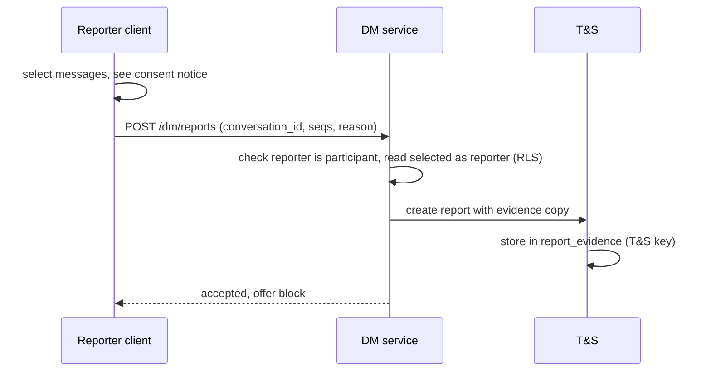

# Direct messages: X

DM。1 対 1 とグループ（50 人まで）の会話、メッセージの ID と順序、既読、メッセージの申請と同意、ブロックとの関係、Realtime Gateway での配信、DM のメディア、保存の暗号化、通報、MVP の後のエンドツーエンドの暗号化への備えを決める。

前提となる決定は、DM のメッセージの ID は `tid` で、会話の中の厳密な順は会話の連番で決めること（[ADR-0002](../decisions/0002-post-ids-and-ordering.md)）、DM は参加者の表を通した FORCE RLS で守り、運用の読み出しは別のロールで理由を記録すること（[ADR-0004](../decisions/0004-single-tenant-and-visibility.md)）、確定した変更は outbox から流すこと（[ADR-0005](../decisions/0005-event-log-and-outbox.md)）、DM の中身をモデレーション・推薦の特徴・ログに使わないこと（[AGENTS.md](../../AGENTS.md)）。要件は NFR-008（送信からオンラインの相手の端末まで p95 1 秒）、NFR-004（DM の可用性 99.9%）、NFR-005（確定した DM を失わない）、NFR-009（他人の DM が見えた事象 0 件）。**DM は通信の秘密に当たりうる（L3）。この文書は枠組みだけを決め、中身の機械の解析・人が読む手順・届出の要否は法務の確認待ちとする。** 未成年の DM の制限は L5。この文書で決めたことは次の ADR にある。

| ADR | 決定 |
| --- | --- |
| [0035](../decisions/0035-dm-conversation-model-and-storage.md) | 会話の中の順は会話ごとの連番 `seq` で、メッセージの行の主キーは `(conversation_id, seq)`。メッセージの ID は `tid`。送信はクライアントの冪等のキーで重複を落とす。参加者の表を通した FORCE RLS で守り、本文は会話ごとのデータの鍵（KMS で包む）で列を暗号化する。配信は Valkey の pub/sub で Gateway へ ID だけを流し、Gateway が受け手の権限で読み直して送る。DM の出来事は ID だけを `dm` の流れに入れ、データレイクへ写さない |
| [0036](../decisions/0036-dm-consent-requests-and-reporting.md) | 受け手がフォローしていない人からの DM は「申請」に入る。受け手の設定（全員・フォロー中だけ・受けない）とブロックで、決定表の順に判定する。申請の間は送り手は 3 通まで、メディアは送れない。通報は、通報する参加者が選んだメッセージを、同意の画面を経て T&S の証拠へ写す。運営が会話を直接読む手順は作らない |
| [0037](../decisions/0037-dm-e2ee-readiness.md) | エンドツーエンドの暗号化は MVP の後（E18）。MVP では、本文を中身の分からない入れ物として扱い、暗号の方式の列を持ち、サーバーが本文を読まないと動かない機能（DM の検索、サーバーでのリンクのカード、中身による迷惑の判定）を作らない。方式の第一の候補は MLS（RFC 9420）。鍵の管理と通報の両立は E18 で ADR を書く |

## 1. 範囲

- 扱う：会話と参加者、メッセージの書き込みと順、読み出しとページング、受信箱と申請の箱、既読と入力中の表示、申請の規則、ブロック・ミュートとの関係、配信（Gateway、プッシュ）、DM のメディアの配り方、削除、保存の暗号化、通報、上限、エンドツーエンドの暗号化への備え。
- 扱わない：
  - Realtime Gateway の接続の管理と台数（[infrastructure.md](infrastructure.md)）。この文書は DM の配信の流れだけを持つ。
  - プッシュ通知の送り方（[notifications.md](notifications.md)）。DM の通知の中身の規則（本文を載せない）はこの文書で決める。
  - メディアの変換と配信（[media.md](media.md)）。
  - 措置の判断（[trust-and-safety.md](trust-and-safety.md)）。
  - 公開 API の DM の形とレート制限の値（[api-and-rate-limits.md](api-and-rate-limits.md)）。
- 音声・ビデオの通話は MVP の外。

## 2. 事実（確かめたこと）

いずれも 2026-10-04 に確認。

| 項目 | 事実 | この設計 |
| --- | --- | --- |
| 本家の DM の上限 | 1 日 500 件とされる（[About X limits](https://help.x.com/en/rules-and-policies/x-limits)。検索結果の抜粋で確認し、本文は 403 で未確認） | 1 日 500 件を既定の案にする（13 節） |
| 本家の DM の動画 | 既定で 140 秒・512 MB（[Media upload](https://docs.x.com/x-api/media/introduction)、公式） | 同じ（[media.md](media.md) の 12 節） |
| 本家の暗号化 | 2025 年に、鍵を PIN で守る方式のエンドツーエンドの暗号化を持つ「Chat」へ移った。過去の DM は暗号化されない（第三者の報道。[architecture/README.md](README.md) の 1.3 節） | 本家の文書は**未検証**。この設計は MVP の後（ADR-0037） |
| 本家のグループの人数、申請の規則 | — | 本家の文書で確かめておらず**未検証**。グループは 50 人（[intent.md](../intent.md)）、申請の規則は自前に決める（5 節） |

## 3. 要件

| 要件 | 値 | 出どころ |
| --- | --- | --- |
| 配信の速さ | 送信の確定から、オンラインの相手の端末まで p95 1 秒 | NFR-008 |
| 可用性 | DM の送信のうち、確定か検証の拒否で答えたもの 月間 99.9% | NFR-004 |
| 耐久性 | 確定を返したメッセージを失わない。AZ の障害で RPO 0 | NFR-005 |
| 分離 | 参加者でない人に、DM の本文・相手・存在が見えた事象 0 件。DB の誤りでも RLS で止まる | NFR-009、[ADR-0004](../decisions/0004-single-tenant-and-visibility.md) |
| 中身を出さない | DM の本文を、ログ・メトリクス・トレース・分析・データレイク・推薦の特徴に出さない。誰が誰に送ったか（通信の相手）も、データレイクに写さない | [AGENTS.md](../../AGENTS.md)、L3 |
| 順 | 会話の全参加者が、同じ順でメッセージを見る | [ADR-0002](../decisions/0002-post-ids-and-ordering.md) の「全体の厳密な順序が要る処理」 |

## 4. 会話とメッセージのモデル

### 4.1 表

| 表 | 主キー | 中身 |
| --- | --- | --- |
| `dm_conversations` | `conversation_id`（UUIDv7） | `kind`（`direct`・`group`）、`direct_key`（1 対 1 のとき `min(a,b):max(a,b)`、一意）、`title`、`created_by`、`last_seq`、`last_message_at`、`dek_wrapped`、`enc_scheme` |
| `dm_participants` | `(conversation_id, user_id)` | `role`（`owner`・`member`）、`state`（`active`・`request`・`left`・`removed`）、`joined_seq`、`last_read_seq`、`muted`、`folder`（`inbox`・`requests`）、`updated_at` |
| `dm_messages` | `(conversation_id, seq)` | `message_id`（`tid`、一意）、`sender_id`、`kind`（`text`・`media`・`post_share`・`system`）、`body_ct`（暗号文）、`media_id`、`shared_post_id`、`client_msg_id`、`created_at` |
| `dm_message_hidden` | `(user_id, conversation_id, seq)` | 本人の側だけで消したメッセージ |

- `direct_key` の一意の制約で、同じ 2 人の 1 対 1 の会話は 1 つだけにする。
- グループの会話は 50 人まで（`active` と `request` の合計）。

### 4.2 順と ID

- 会話の中の順は `seq`（会話ごとの連番）で決める。`tid` は生成器の間でおおむねの順で、確定の順とも一致しないため（[ADR-0002](../decisions/0002-post-ids-and-ordering.md)）。
- 送信のトランザクション：

```sql
UPDATE dm_conversations
   SET last_seq = last_seq + 1, last_message_at = now()
 WHERE conversation_id = $1
RETURNING last_seq;                       -- 会話の行の鍵で、同じ会話の送信を一列にする
INSERT INTO dm_messages (conversation_id, seq, message_id, sender_id, ..., client_msg_id) VALUES (...);
UPDATE dm_participants SET updated_at = now() WHERE conversation_id = $1;
INSERT INTO outbox (...) VALUES (...);   -- dm.message_created（ID だけ）
```

- 同じ会話の送信は会話の行の鍵で一列になる。1 つの会話の送信の速さは、50 人のグループでも 1 秒に数件で、鍵の待ちは問題にならない見込み。`dm-messages` で 1 会話 50 件/秒の負荷で確かめる。
- 冪等：`(conversation_id, sender_id, client_msg_id)` に一意の制約を置く。クライアントは送信ごとに UUIDv7 の `client_msg_id` を作り、再送で同じ値を使う。重複したら、前の結果（`seq`、`message_id`）を返す。

### 4.3 RLS

- `dm_messages` のポリシー：閲覧者（`app.actor_id`）が、その会話の `dm_participants` に `state = 'active'` でいて、`seq >= joined_seq` のメッセージだけを読める。グループに後から入った人は、入る前のメッセージを読めない。
- `request` の参加者（申請を受けた人）は、申請の会話のメッセージを読める（申請の箱で中身を見て、受けるか決めるため）。
- `left`・`removed` の参加者は読めない。抜けた後に戻ったら、戻った時の `seq` を `joined_seq` にする。
- 書き込みも同じポリシー（`active` の参加者だけが送れる。申請の送り手は `active`）。
- T&S・運用のロール（`ts_reader`）にも、`dm_messages` の `body_ct` を読む権限を与えない。通報の証拠は別の表（10 節）。DM の中身を人が読む手順は、L3 の確認まで作らない（[ADR-0004](../decisions/0004-single-tenant-and-visibility.md)）。
- Gateway と Notification が読むときも、受け手ごとに `SET LOCAL app.actor_id` してから読む。

### 4.4 保存の暗号化

- Aurora の保存の暗号化（KMS）に加えて、本文を列の単位で暗号化する（[ADR-0035](../decisions/0035-dm-conversation-model-and-storage.md)）。
- 会話ごとにデータの鍵（DEK、AES-256-GCM）を作り、専用の KMS の鍵（`dm-content`）で包んで `dm_conversations.dek_wrapped` に持つ。DM のサービスは包みを解いた鍵を 5 分だけメモリーに持つ。
- 理由：
  - DB の読み取りの権限だけでは、本文が読めない。KMS の `Decrypt` は CloudTrail に残り、DM のサービスのロールにだけ許す。
  - 会話を消すときに鍵を消せば、バックアップに残った本文も読めなくなる（暗号の削除）。
- 付随のデータ（暗号化の対象の外）：`sender_id`、`created_at`、`kind`、`seq`。並べ方と RLS に要るため。これらも通信の秘密の対象になりうるので、ログ・分析に出さない。

## 5. 申請と同意

### 5.1 送れるかの判定（決定表 `DT-DM-001` の案）

上から順に評価し、最初に一致した行を採る。

| # | ブロック（どちらか向き） | 受け手の凍結・削除 | 受け手が送り手をフォロー | 既存の会話の状態（受け手） | 受け手の設定 | 結果 |
| --- | --- | --- | --- | --- | --- | --- |
| 1 | あり | - | - | - | - | 拒否（`403 cannot_message`。理由を示さない） |
| 2 | なし | はい | - | - | - | 拒否（同上） |
| 3 | なし | いいえ | - | `active` | - | 受信箱へ |
| 4 | なし | いいえ | はい | なし・`request` | `everyone`・`following` | 受信箱へ（`request` なら `active` にする） |
| 5 | なし | いいえ | いいえ | `request` | `everyone` | 申請の箱へ（申請の上限の中なら） |
| 6 | なし | いいえ | いいえ | なし | `everyone` | 新しい申請 |
| 7 | なし | いいえ | いいえ | - | `following` | 拒否（同上） |
| 8 | なし | いいえ | - | なし・`request` | `none` | 拒否（同上） |

- 受け手の設定は `everyone`（全員から受ける。申請に入る）・`following`（フォローしている人からだけ）・`none`（既に受信箱にある会話の相手からだけ受ける）。既定は `following`。本家の既定の値は**未検証**。迷惑を減らす側を既定にした。
- 拒否の理由（ブロック・設定・凍結）は送り手に区別して示さない。ブロックの存在を知らせないため。
- 未成年の既定の値と、大人からの申請の制限は L5 の確認待ち。確認までは、年齢の区分が未成年の利用者の設定を `following` に固定する。

### 5.2 申請の状態



- 申請の間、送り手は 3 通まで送れる。画像・動画・リンクのカードは送れない（本文の中の URL は文字として出し、押せない）。
- 受け手は、申請を受ける（受信箱へ移る）、消す（`declined`）、通報する（`reported`、ブロックも選べる）のどれかを選ぶ。返信は「受ける」とみなす。
- 受け手が申請を開いても、送り手に既読を出さない。
- `declined` の後 30 日は、同じ送り手からの新しい申請を受けない（送り手には成功と同じに見せ、受け手の箱に出さない）。
- グループへの追加：追加される人が、追加する人をフォローしていなければ、グループの招待は申請の箱に入る。受けるまで、グループのメッセージを読めない。

### 5.3 ブロックとミュート

| 操作 | 1 対 1 の会話 | グループの会話 |
| --- | --- | --- |
| ブロック | 会話を両方で読み取りだけにする。新しいメッセージを拒否する。過去のメッセージは消さない | 同じグループに残れる。ブロックした人には、ブロックした相手のメッセージを出さない（DM のサービスが閲覧者のブロックの集合で落とす）。ブロックした相手をグループに足すことはできない |
| ブロックの解除 | 送れるようになる（5.1 節の判定に戻る） | — |
| ミュート（アカウント） | 会話は残り、通知だけ止める | 同じ |
| 会話のミュート | 通知だけ止める | 同じ |

## 6. 送信と配信の流れ



- 確定の後に、受け手ごとに Valkey の pub/sub の `dm:{user_id}` へ、会話の ID と `seq` だけを流す。本文は流さない。
- Gateway は、受け手の接続ごとに、受け手の権限（`SET LOCAL app.actor_id`）で DM のサービスから読み直して送る。RLS を通らない配信の道を作らない。
- pub/sub は失ってよい。取りこぼしは、クライアントの同期（6.1 節）で埋める。
- `dm` の流れ（Kinesis Data Streams）には `dm.message_created`・`dm.request_created` などの出来事を、**ID だけ**（会話・メッセージ・送り手・受け手の ID、種類）で入れる。消費者は Notification と、T&S のレート制限の数え上げだけ。**Firehose でデータレイクへ写さない。** 通信の相手と時刻も通信の秘密の対象になりうるため（L3）。この流れは [ADR-0005](../decisions/0005-event-log-and-outbox.md) の流れの表に足す行になる。

### 6.1 同期

- クライアントは会話ごとに受け取った最大の `seq` を持つ。接続のたびに `GET /dm/sync?since={cursor}` で、`dm_participants.updated_at` が `cursor` より新しい会話と、その最新の `seq` を受け取り、欠けた範囲を取りに行く。
- メッセージの一覧は `GET /dm/conversations/{id}/messages?before_seq=&limit=50`。

### 6.2 既読と入力中の表示

- 既読：`dm_participants.last_read_seq` を `GREATEST(last_read_seq, $seq)` で進める（戻らない）。
- 既読の表示は設定（`read_receipts`、既定は入）。どちらかが切っていれば、1 対 1 で互いに出さない。グループは「既読 n 人」だけを出す。
- 入力中の表示は Gateway だけで流し、保存しない。

### 6.3 プッシュ通知

- 受け手が接続していなければ、Notification がプッシュを送る。**プッシュの中身に本文を載せない**（「○○さんからメッセージ」だけ）。APNs・FCM（外国にある第三者）に本文を渡さないため（L3・L4）。
- 申請のプッシュは、1 人の送り手から 1 日 1 回まで。

## 7. 投稿の共有とメディア

- DM の中で投稿を共有するときは、`shared_post_id` だけを持つ。表示のたびに、受け手を閲覧者として `visible()` で判定する（[quality.md](../quality.md) の 2.2.1 節の「DM の中の投稿の共有」）。`hide` なら「この投稿は表示できません」にする。
- DM のメディアは [media.md](media.md) の `purpose = dm`。配信は `/p/` の署名付きの URL（15 分）だけで、DM のサービスが参加者を確かめてから発行する。
- DM のメディアにハッシュの照合と分類をかけない（L3 の確認まで。[ADR-0034](../decisions/0034-media-hash-matching.md)）。

## 8. 削除

- 本人の側からの削除：`dm_message_hidden` に行を足す。相手には残る。
- 会話を消す：本人の `dm_participants` を `left` にし、本人の側のメッセージを全部隠す。全員が抜けた会話は、保持の期間（L8）の後に、DEK を消して（暗号の削除）から行を消す。
- 送信の取り消し（相手からも消す）は MVP の外。導入するかと期限は 16 節の持ち越し。
- アカウントの削除：猶予の後、本人が送ったメッセージは相手の側に残すか消すかを L8 の結論で決める。設計は両方に対応する（送り手の ID を「削除したアカウント」に置き換える／本人のメッセージを墓石にする）。

## 9. 迷惑の抑止（中身を読まずに）

- DM の中身を機械で読む迷惑の判定は、L3 の確認まで作らない（[AGENTS.md](../../AGENTS.md)）。
- MVP の抑止は、中身を使わない次の信号だけで行う。これらの付随の情報（送った件数・相手の数）の利用も、L3 の確認の範囲に含める。
  - 送信の上限（13 節）と、新しいアカウントの低い上限。
  - 申請の受け手の反応：直近 7 日の申請のうち、消された・通報された・ブロックされた割合が 50% を超え、件数が 20 を超えた送り手は、新しい申請を 7 日止める。
  - アカウントの危険の点（[trust-and-safety.md](trust-and-safety.md) の 8 節）が 0.7 以上の送り手は、申請を送れない。
- 判定は T&S の Worker が `dm` の流れの ID だけで数える。

## 10. 通報



- 通報できるのは参加者だけ。通報する人は、通報するメッセージを選ぶ（1 回 20 件まで。既定で、選んだメッセージの直前の 5 件を文脈として足す。外せる）。
- 送る前に、同意の画面で「選んだメッセージが運営に送られ、確認に使われます」と示す。
- DM のサービスが、通報する人の権限（RLS）で選んだメッセージを読み、T&S の `report_evidence` に写す。写しは T&S の KMS の鍵で暗号化する。モデレーターは写しだけを見る。会話そのものを読む道はない。
- 写しの保持は、案件の保持（L8）に従う。
- 参加者の一方の同意で写すことが、通信の秘密の扱いとして足りるかは L3 の確認待ち。確認まで `legal.l3.dm_report_evidence` の裏に置き、確認までは「メッセージを写さず、会話と相手のアカウントだけを通報する」形で動かす。

## 11. エンドツーエンドの暗号化への備え（MVP の後）

- E18 で入れる（[ADR-0037](../decisions/0037-dm-e2ee-readiness.md)）。MVP で守ること：
  - 本文は `body_ct` の中身の分からない入れ物として扱い、`enc_scheme`（`server_dek_v1`、後に `mls_v1`）で方式を区別する。
  - サーバーが本文を読まないと動かない機能を作らない：DM の検索、サーバーでのリンクのカードの生成、中身による迷惑の判定、サーバーでの翻訳。リンクのカードはクライアントで作る。
  - 通報は、通報する人のクライアントが平文を送る形（10 節）にしてあるので、暗号化の後も同じ形で続けられる。
- 方式の第一の候補は MLS（RFC 9420）。グループの鍵の更新が速く、50 人のグループに合う。鍵の保管と端末の追加（PIN と HSM での鍵の預かりなど）は E18 で決める。

## 12. 失敗のしかた

| 事象 | 影響 | 扱い |
| --- | --- | --- |
| Gateway の切断・pub/sub の取りこぼし | 届くのが遅れる | クライアントの同期（6.1 節）で埋める。オフラインならプッシュ |
| 同じ送信の再送 | 重複 | `client_msg_id` の一意の制約で前の結果を返す |
| Aurora のフェイルオーバー | 送信が数十秒失敗する | クライアントは同じ `client_msg_id` で再送する。確定を返したものは失わない |
| KMS の障害 | 本文の暗号化・復号ができない | 送信は `503`。メモリーにある DEK の間は読める。DM の可用性の SLO に数える |
| Notification の遅れ | プッシュが遅れる | `dm` の流れの遅れで検知。DM の配信そのものは Gateway で届く |
| 会話の行の鍵の待ち（大量の送信） | 送信が遅れる | 1 会話の送信の上限（13 節）で抑える |

## 13. 上限

| 対象 | S1 の値 | 備考 |
| --- | --- | --- |
| 送信 | 1 人 1 日 500 件（案） | 本家の文書の値（本文は未確認）。値は [api-and-rate-limits.md](api-and-rate-limits.md) で確定 |
| 新しい申請 | 1 人 1 日 50 件、登録 7 日未満は 10 件 | 自前 |
| 申請の間のメッセージ | 3 通 | 自前 |
| 1 会話の送信 | 1 秒 10 件 | 自前 |
| グループ | 50 人、1 人が入れるグループ 300 | 50 人は [intent.md](../intent.md)、300 は自前 |
| 本文 | 10,000 文字 | 自前。本家の値は**未検証** |
| 通報の 1 回 | 20 件と文脈 5 件 | 自前 |
| 申請の期限 | 30 日 | 自前 |

## 14. data-model への項目

| 置き場所 | 中身 | 節 |
| --- | --- | --- |
| Aurora `dm_conversations`、`dm_participants`、`dm_messages`、`dm_message_hidden` | 4.1 節。すべて参加者・本人の FORCE RLS。主キーと一意の制約（`direct_key`、`message_id`、`(conversation_id, sender_id, client_msg_id)`）。索引 `dm_participants (user_id, folder, updated_at DESC)` | 4 |
| Aurora `dm_requests`（`conversation_id`、`sender_id`、`recipient_id`、`state`（`pending`・`accepted`・`declined`・`reported`・`expired`）、`messages_sent`、`created_at`、`decided_at`）。受け手と送り手の RLS | 申請 | 5.2 |
| Aurora `dm_settings`（`owner_id`、`allow_from`（`everyone`・`following`・`none`）、`read_receipts`）。本人だけの表。または `user_settings` の列 | 設定 | 5.1、6.2 |
| Aurora `report_evidence`（[trust-and-safety.md](trust-and-safety.md) の表）の `kind = dm_messages` | 通報の写し | 10 |
| KMS の鍵 `dm-content`（DEK を包む）、`ts-evidence`（証拠） | 暗号化 | 4.4、10 |
| Valkey pub/sub `dm:{user_id}` | 配信の通知（ID だけ） | 6 |
| Kinesis Data Streams `dm`（鍵：会話の ID。ID だけ。Firehose に写さない） | 出来事 | 6 |
| Valkey `dmrq:{sender_id}`（7 日の申請の反応の数） | 迷惑の抑止 | 9 |

- [ADR-0004](../decisions/0004-single-tenant-and-visibility.md) の本人だけの表の一覧に、`dm_message_hidden`、`dm_requests`、`dm_settings` を足す。
- [ADR-0005](../decisions/0005-event-log-and-outbox.md) の流れの表に `dm` を足す。

## 15. テストと性質

| ID | 性質・試験 |
| --- | --- |
| PROP-DM-001 | 任意の参加・退出・削除・送信の列で、DB の任意の読み出し（アプリの誤りを模した、条件のない `SELECT` を含む）が返すメッセージは、閲覧者が `active` の参加者で `seq >= joined_seq` のものだけ（RLS） |
| PROP-DM-002 | 任意の並行の送信・再送の列で、会話の `seq` は 1 から欠けなく重複なく並び、同じ `client_msg_id` は 1 行だけ |
| PROP-DM-003 | 任意の送信と取りこぼし・再接続の列で、各参加者のクライアントが最後に持つ列は、DB の `seq` の順の列と一致する |
| PROP-DM-004 | `last_read_seq` は減らない |
| PROP-DM-005 | ブロックの後、どの向きの新しいメッセージも確定しない |
| PROP-DM-006 | DM の本文と通信の相手の組が、ログ・トレース・メトリクス・データレイクの出力に現れない（出力の走査） |
| DT-DM-001 | 5.1 節の決定表の全行を表駆動テストで確かめる |
| 結合 | オンラインの相手へ p95 1 秒（NFR-008） |
| 結合 | 漏れの経路の表の「DM の中の投稿の共有」の行（受け手として判定する） |
| eval | 「スパムの判定に DM の中身を使え」で、L3 の確認待ちとして止まる（[quality.md](../quality.md) の 3 節） |

## 16. Story の候補

| Epic | Story | 中身 |
| --- | --- | --- |
| E12 | `dm-conversations` | 会話、参加者、RLS、DEK（4 節） |
| E12 | `dm-messages` | 送信、`seq`、冪等、一覧、同期、既読（4.2・6 節） |
| E12 | `dm-requests-and-blocks` | 決定表、申請の状態、ブロックとミュート（5 節）。未成年は法務：L5 |
| E12 | `realtime-gateway` | WebSocket、pub/sub、受け手の権限での読み直し（6 節） |
| E12 | `dm-media` | DM のメディアと署名付きの URL（7 節）。照合は法務：L3 |
| E12 | `dm-reports` | 通報と証拠の写し（10 節）。法務：L3 |
| E12 | `dm-abuse-signals` | 中身を使わない迷惑の抑止（9 節）。法務：L3 |
| E18 | `dm-e2ee` | エンドツーエンドの暗号化（11 節）。法務：L3 |

## 17. 未解決の問い

### 決定（2026-10-04、既定案）

- **順**：会話ごとの `seq`。メッセージの ID は `tid`（ADR-0035）。
- **保存**：参加者の RLS と、会話ごとの DEK の列の暗号化（ADR-0035）。
- **受け手の既定の設定**：`following`（迷惑を減らす側）。
- **申請**：3 通まで、メディアなし、30 日で期限（ADR-0036）。
- **プッシュに本文を載せない。**
- **データレイクに DM の出来事を写さない。**
- **グループに後から入った人は、入る前のメッセージを読めない。**
- **エンドツーエンドの暗号化は MVP の後。備えを守る（ADR-0037）。**

### 持ち越し

| 問い | いつ・どう決めるか |
| --- | --- |
| DM の中身・付随の情報を、迷惑の判定・照合・モデレーションに使うことと、同意の取り方、届出・登録の要否（L3） | 法務の確認待ち。E12 の `dm-abuse-signals`・`dm-media`・`dm-reports` の spec の承認の前 |
| 通報で参加者の一方の同意によってメッセージを写すことの扱い（L3） | 同上。確認まで `legal.l3.dm_report_evidence` の裏 |
| 未成年の DM の制限（L5） | 法務の確認待ち。E12 の `dm-requests-and-blocks` の spec の承認の前 |
| 削除したアカウントのメッセージ、全員が抜けた会話の保持（L8） | 法務の確認待ち |
| 送信の取り消し（相手からも消す）を入れるか、期限 | E12 の後に PM が決める |
| 捜査機関からの DM の照会への対応（L7） | 法務の確認待ち。[trust-and-safety.md](trust-and-safety.md) の 10.3 節 |
| エンドツーエンドの暗号化の方式と鍵の保管 | E18 で ADR |
