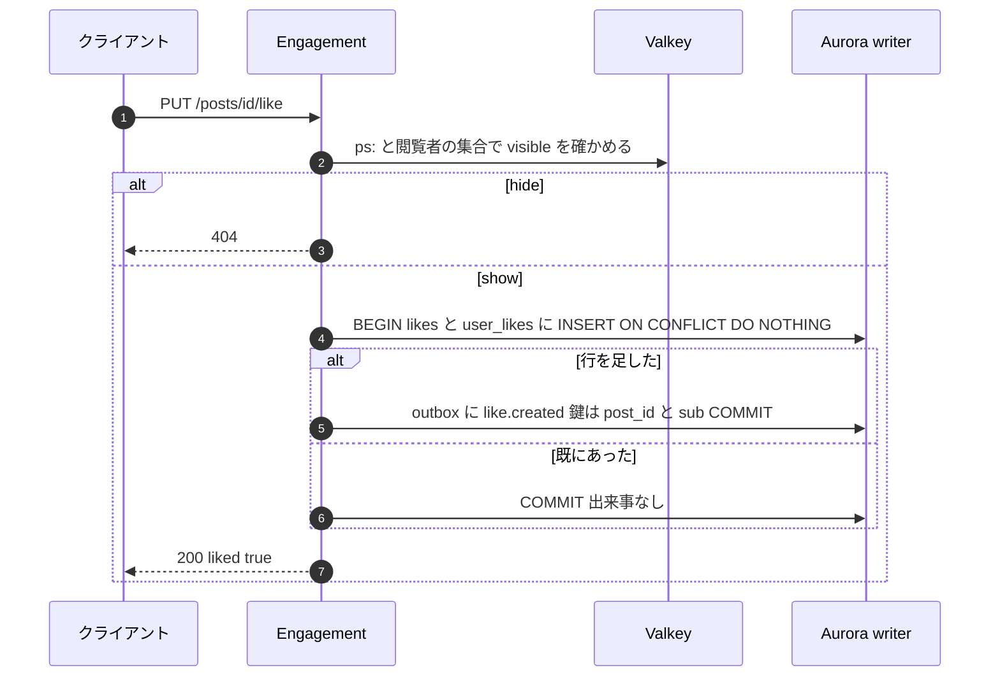
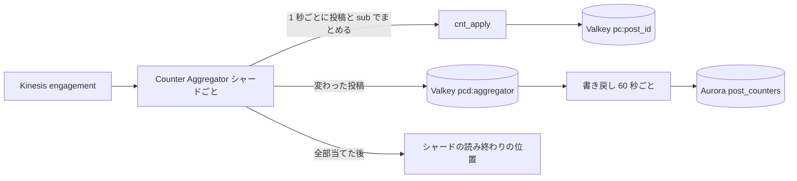
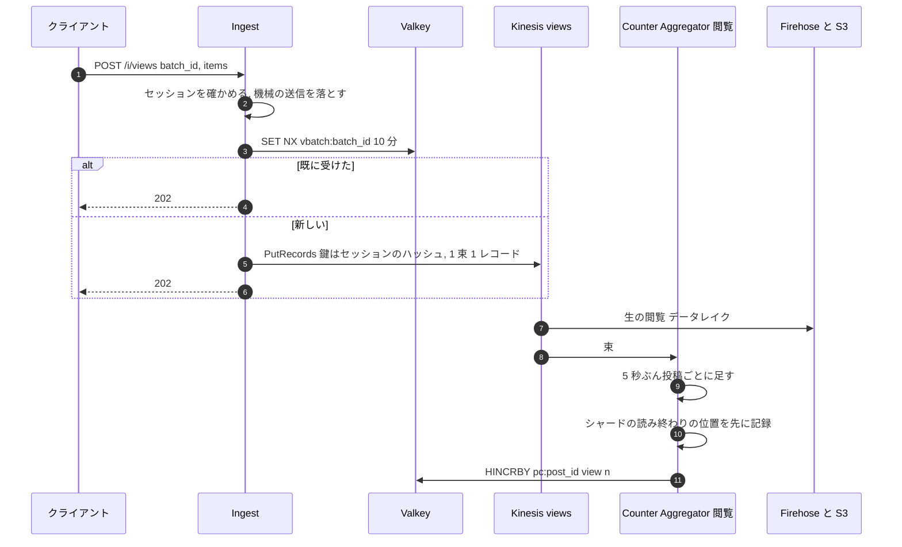

# Engagement and Counters: X

いいね・リポスト・ブックマークの関係と、数の写し。関係の表と書き込み、数の写しの形（Valkey の投稿ごとのハッシュ）、集計と冪等性、Aurora への書き戻し、照合、閲覧の数の取り込みと概算、数の見せ方、殺到する投稿の扱いを決める。

前提となる決定は、outbox と Kinesis と閲覧の別の口（[ADR-0005](../decisions/0005-event-log-and-outbox.md)）、`visible()`（[ADR-0004](../decisions/0004-single-tenant-and-visibility.md)）、投稿の書き込みとリポストの行（[ADR-0008](../decisions/0008-post-write-path-and-idempotency.md)）、フォローの数の元（[follow-graph.md](follow-graph.md) の 7 節）。この文書で決めたことは次の ADR にある。

| ADR | 決定 |
| --- | --- |
| [0022](../decisions/0022-engagement-relations-and-writes.md) | いいねは投稿の側と利用者の側の 2 つの向きの表を正本にし、リポストは `reposts` を正本にする。状態が変わったときだけ出来事を出す。ブックマークは本人だけの表。いいねした人の一覧は投稿の作者だけ、利用者のいいねの一覧は本人だけが見られる |
| [0023](../decisions/0023-counter-aggregation-and-reconciliation.md) | `engagement` の流れの鍵を「投稿の ID と利用者の ID の下 3 ビット」にし、数の写しは Valkey の投稿ごとのハッシュに部分ごとの最後の連番を持って Function で冪等に足す。返信・引用の数も、投稿の書き込みが `engagement` の流れへ出す。書き戻しは 60 秒、照合は静かな投稿で数え直す |
| [0024](../decisions/0024-view-counts-ingest-and-approximation.md) | 閲覧は「画面に 50% 以上が 500ms 以上出た」こと。Ingest はクライアントの束を、閲覧者のセッションで分けた鍵で `views` の流れへ入れる。集計は位置を先に記録してから足し（数えすぎない）、データレイクとの日ごとの補正で上にだけ直す。表示は減らない |

## 1. 目的と範囲

- 扱う：
  - `likes`・`user_likes`・`reposts`・`bookmarks` の表と書き込みの経路
  - 数の種類（いいね・リポスト・返信・引用・ブックマーク・閲覧、フォロー・フォロワー・投稿の数）と写しの形
  - Counter Aggregator、冪等性、殺到する投稿
  - 書き戻し（`post_counters`・`user_counters`）と照合
  - 閲覧の定義、クライアントの送り方、Ingest、概算と補正
  - 数の見せ方、一覧（いいねした人、リポストした人、引用）
- 扱わない：
  - リポストの `posts` の行の形（[posts-and-ids.md](posts-and-ids.md)）
  - フォローの辺（[follow-graph.md](follow-graph.md)。数の写しは、ここの仕組みを使う）
  - いいね・閲覧をおすすめの特徴にする方法（[ranking-and-recommendation.md](ranking-and-recommendation.md)）
  - いいね・リポストの通知（[notifications.md](notifications.md)）
  - 閲覧の出来事の送信の画面の実装（[clients.md](clients.md)）
  - レート制限（[api-and-rate-limits.md](api-and-rate-limits.md)）

## 2. 本家の形（確かめたこと）

| 項目 | 本家 | 出典 |
| --- | --- | --- |
| 表示の数 | ログインした人が投稿を見た回数。同じ人の複数回も数え、本人の閲覧も数える。一意ではない | [View counts](https://help.x.com/en/using-x/view-counts)（検索結果の抜粋で確認。本文は 403 で**未検証**。2026-10-04） |
| 「閲覧」の画面の上の条件（何割が何秒出たら数えるか） | 公開されていない | **未検証** |
| いいねの一覧の公開 | 2024 年に、利用者のいいねの一覧を本人だけに見せる形に変えたと報じられている | 第三者の報道。本家の文書は**未検証** |
| ブックマークの数 | 投稿に表示される | **未検証** |

この設計の閲覧の定義（4.1 節）、一覧の公開の範囲（3.3 節）は自前で決める。

## 3. 関係（ADR-0022）

### 3.1 表

| 表 | 主キー | 種類 | 役目 |
| --- | --- | --- | --- |
| `likes(post_id, user_id, created_at)` | `(post_id, user_id)` | 公開の表（一覧は 3.3 節の範囲だけ API に出す） | いいねの数の正本 |
| `user_likes(user_id, post_id, created_at)` | `(user_id, post_id)` | 同上 | 本人のいいねの一覧。索引 `(user_id, created_at DESC)` |
| `reposts(post_id, user_id, repost_id, created_at)` | `(post_id, user_id)` | 公開の表 | リポストの数の正本、1 人 1 回。`repost_id` はリポストの `posts` の行の ID |
| `bookmarks(owner_id, post_id, created_at)` | `(owner_id, post_id)` | 本人だけの表（FORCE RLS） | ブックマーク |

- 返信・引用の数の正本は `posts`（`in_reply_to_post_id`・`quoted_post_id` の索引）。
- ブックマークの数の正本も `bookmarks` だが、本人だけの表なので、照合のジョブは T&S と同じく別の DB のロール（`counter_reconciler`）で数だけを読む（[ADR-0004](../decisions/0004-single-tenant-and-visibility.md) の運用の読み出し。行の中身は読まない）。

### 3.2 書き込み

- 取り消し（`DELETE /posts/{id}/like`）も同じ形。行を消したときだけ `like.deleted` を出す。
- 見えない投稿にはいいね・リポスト・ブックマークできない（`404`）。取り消しは、見えなくなった後もできる（自分の記録を消せるようにする）。
- **リポスト**：`reposts` に足し、リポストの `posts` の行（`kind = repost`、`tid`）と outbox（`posts` の流れの `post.created` と、`engagement` の流れの `repost.created`）を同じトランザクションで書く（S1。S2 は [ADR-0010](../decisions/0010-post-table-partitioning-s2.md)）。可否は [posts-and-ids.md](posts-and-ids.md) の 4.6 節。
- **ブックマーク**：`bookmarks` に足し、`bookmark.created` を出す。出来事は数のためだけで、`owner_id` を含めない（`post_id` と `sub` だけ）。
- 連打（いいね・取り消しの繰り返し）は、状態が変わるたびに出来事が出る。通知の側でまとめる（[notifications.md](notifications.md)）。速さの上限はレート制限。

### 3.3 一覧の範囲

| 一覧 | 見られる人 |
| --- | --- |
| 投稿にいいねした人 | 投稿の作者だけ |
| 利用者のいいねの一覧 | 本人だけ |
| 投稿をリポストした人 | 投稿を見られる人（リポストは公開の行為） |
| 投稿の引用 | 投稿を見られる人。引用の各投稿にも `visible()` |
| ブックマーク | 本人だけ |

- どの一覧も、行ごとに `visible()`（利用者の版）で絞る。ブロックした・された人は出さない。

## 4. 数の写し（ADR-0023）

### 4.1 数の種類

| 数 | 正本 | 写し | 出来事の流れ |
| --- | --- | --- | --- |
| いいね | `likes` | `pc:{post_id}` の `like` | `engagement`：`like.created`・`like.deleted` |
| リポスト | `reposts` | `repost` | `engagement`：`repost.created`・`repost.deleted` |
| 返信 | `posts`（`in_reply_to_post_id`） | `reply` | `engagement`：`reply.added`・`reply.removed`（投稿の書き込みが出す） |
| 引用 | `posts`（`quoted_post_id`） | `quote` | `engagement`：`quote.added`・`quote.removed` |
| ブックマーク | `bookmarks` | `bookmark` | `engagement`：`bookmark.created`・`bookmark.deleted` |
| 閲覧 | なし（データレイクの集計を参照の値にする） | `view` | `views`（5 節） |
| フォロワー・フォロー | `followers`・`following` | `uc:{user_id}` の `followers`・`following` | `graph` |
| 投稿 | `posts` | `uc:{user_id}` の `posts` | `posts` |

- 返信・引用の数のために、投稿の書き込みのトランザクションは、`posts` の流れの `post.created` に加えて、返信先・引用先の投稿の鍵で `engagement` の流れに `reply.added`・`quote.added` を書く。削除と、`removed` の措置でも `reply.removed`・`quote.removed` を書く（[posts-and-ids.md](posts-and-ids.md) の 12 節）。数の出来事を、投稿ごとに 1 つの流れの同じ鍵の範囲にそろえるため。
- 返信・引用の数に、見えない返信（措置・削除）を数えない。鍵アカウントの返信・ブロックの関係の返信は数える（閲覧者ごとに数を変えない）。

### 4.2 鍵と冪等性

- `engagement` の流れの分ける鍵は `"{post_id}:{sub}"`、`sub = user_id mod 8`（返信・引用は返信した人・引用した人の ID、ブックマークは本人の ID の下 3 ビット）。[ADR-0005](../decisions/0005-event-log-and-outbox.md) の「投稿の ID」を細かくしたもの。1 つの投稿の出来事は最大 8 つのシャードに分かれる。
- `pc:{post_id}` はハッシュで、数の欄と、`sub` ごとの最後に当てた Kinesis の連番（`l0`〜`l7`）とシャードの ID（`s0`〜`s7`）、最後の更新の時刻（`t`）を持つ。
- Function `cnt_apply(key, sub, shard_id, seq, deltas)`：`shard_id` が `s{sub}` と同じで `seq ≤ l{sub}` なら何もしない。それ以外は数を足し、`l{sub}`・`s{sub}`・`t` を書く。
  - シャードが違うときに受けるのは、シャードの分割・併合の後、親のシャードを読み終えてから子を読む（KCL の順）ことに頼る。同じ分ける鍵の連番が子のシャードで親より大きくなるかは、AWS の文書で保証の書き方を確かめていない（**未検証**）。
- 消費者の再起動・持ち主の交代で同じ出来事を読み直しても、`seq` の比較で 2 回足さない。
- Relay の重複（送った後、outbox の行を消す前に落ちた）は、新しい連番で届くので防げない。まれで、1 回の束（最大 500 件）に限られる。照合（4.5 節）で直す。

### 4.3 集計

- Aggregator は、シャードの出来事を 1 秒ぶん手元で投稿と `sub` ごとにまとめ（`seq` はまとめた中の最大）、`cnt_apply` を呼ぶ。人気の投稿でも、1 秒に `sub` ごと 1 回の書き込みになる。
- 全部の `cnt_apply` が済んでから、シャードの読み終わりの位置を Aurora の `stream_checkpoints` に記録する（[ADR-0055](../decisions/0055-kinesis-consumers-and-valkey-clusters.md)）。
- 数は 0 を下回らない（`cnt_apply` が 0 で止め、止めた回数をメトリクスに数える。順の入れ替えで取り消しが先に来た場合）。

### 4.4 書き戻し

- 60 秒ごとに、`pcd:` の投稿の `pc:` を読み、`post_counters` に **絶対の値** と `l0`〜`l7`・`s0`〜`s7` を `INSERT ... ON CONFLICT DO UPDATE` で書く。差分を足さないので、書き戻しを繰り返しても壊れない。
- 閲覧は `GREATEST(今の値, 新しい値)` で書く（減らない）。
- **Valkey を失ったとき**：`pc:` がない投稿の読み出しは `post_counters` から入れる（連番を含む）。Aggregator は、最後の書き戻しより 2 分前の位置から流れを読み直す。`post_counters` に入っている出来事は連番の比較で落ちる。

### 4.5 照合

| 対象 | 頻度 | 方法 |
| --- | --- | --- |
| 過去 24 時間に出来事のあった投稿の 1% の抜き取り | 毎時 | 静かな投稿（`t` が 5 分以上前）だけ、正本を数え直す |
| 数の大きい上位 1,000 件 | 毎時 | 同上。静かでなければ次の回に回す |
| 全投稿（いいね 1 件以上） | 週ごと | 正本の集計（reader、夜間）と `post_counters` を比べる |

- 数え直しは reader で行い、reader の遅れが 1 秒を超えていたら飛ばす。
- 差があれば、`cnt_set(key, field, value, t)` で正本の値に直す（`t` が読んだ時から変わっていないときだけ）。差は `counter_reconcile_log` に記録する（K4）。
- 写しを `UPDATE` で直接書き換えない（AGENTS.md）。直すのは、この照合の経路だけ。

### 4.6 殺到する投稿

- 1 つの投稿の出来事は最大 8 シャード。Relay は同じ分ける鍵の出来事を 1 つの Kinesis のレコードに最大 50 件束ねる。シャードあたり書き込み 1,000 レコード/秒・1 MB/秒（[Kinesis の上限](https://docs.aws.amazon.com/streams/latest/dev/service-sizes-and-limits.html)、2026-10-04 に確認）から、1 投稿の上限はおよそ 4 万件/秒（1 件 200 バイトとして、バイトの上限で決まる）。
- それを超えると、Relay の送信が抑えられ、`engagement` の outbox が溜まる。数の表示が遅れるが、失わない。outbox の溜まりが他の出来事（`posts`・`graph`）を待たせないよう、Relay は流れごとに担当を分ける。
- `likes` の挿入は投稿ごとの行の競合がない（主キーが利用者ごと）。S1 のピーク 2,000 件/秒は 1 つの writer で受ける。

## 5. 閲覧の数（ADR-0024）

### 5.1 定義と送り方

- **閲覧**：ログインした人の画面に、投稿の面積の 50% 以上が 500ms 以上続けて出たこと。タイムライン・会話・プロフィール・検索・投稿の詳細で数える。本人の閲覧、同じ人の繰り返しも数える（本家の扱いに寄せた。出典は 2 節で**未検証**）。
- クライアントは、閲覧を `(post_id, surface, shown_at)` で溜め、10 秒か 50 件ごとに束にして Ingest へ送る（[ADR-0005](../decisions/0005-event-log-and-outbox.md)）。束には `batch_id`（UUIDv7）を付け、送れなかったら同じ `batch_id` で 3 回まで再送する。アプリが背景に移るときにも送る。
- ログインしていない人の閲覧は数えない。

### 5.2 Ingest と集計

- **鍵はセッションのハッシュ**（[ADR-0005](../decisions/0005-event-log-and-outbox.md) の表の「投稿の ID」から変える）。1 束に複数の投稿が入るので、投稿の ID で分けるとレコードの数が 50 倍になる。人気の投稿の閲覧が 1 つのシャードに集まることもなくなる。
- 機械の送信を落とす規則（既定）：無効なセッション、1 セッションから 2 秒に 1 束を超える、1 分に 1,000 件を超える、存在しない投稿の ID の割合が 10% を超える。値は `ops.views.*`。
- **数えすぎない**：Aggregator は、読み終わりの位置を先に記録してから Valkey に足す。足す前に落ちたら、その 5 秒ぶんを失う（少なく数える）。2 回足すことはない。
- **減らない**：`pc:` の `view` は足すだけ。書き戻しは `GREATEST`。
- **補正**：毎日、データレイクの生の閲覧（同じ機械の送信の規則で落とした後）を投稿ごとに集計し、写しより 1% 以上多い投稿は、写しと `post_counters` をデータレイクの値まで上げる。写しのほうが多い投稿は直さない（減らさない）が、件数を記録する。
- 誤差の目標：データレイクの集計との差 2% 以内（NFR-006）。`view-count-poc` で費用と誤差を測る。

### 5.3 量の見積もり（S1）

| 項目 | 値 |
| --- | --- |
| 閲覧 | 1 日 5 億件、ピーク 2 万件/秒 |
| 束（平均 25 件） | ピーク 800 レコード/秒、1 レコード平均 2 KB |
| Kinesis の書き込み | ピーク約 1.6 MB/秒（オンデマンドの既定 4 MB/秒の中） |
| Valkey の書き込み | 5 秒ごとに、変わった投稿の数（ピークで数万件）の `HINCRBY` |

S3（1 日 600 億件）の量と費用は [capacity.md](capacity.md) で見積もる。

## 6. 数の見せ方

- 表示の書き方は `packages/text` の `formatCount` で Web とアプリが共有する。日本語：9,999 まではそのまま（桁区切り）、1 万以上は「1.2万」（小数 1 桁、切り捨て）、1 億以上は「1.2億」。英語：`1.2K`・`3.4M`。
- 自分の操作の直後は、クライアントが楽観的に ±1 して見せ、次に取得した数が楽観の値以上になるまで楽観の値を保つ（写しの遅れ p95 5 秒の間、自分の操作が消えて見えないように）。
- 閲覧の数は「表示」と書き、概算であることをヘルプで示す。広告主への計測（MVP の後）では、概算と誤差を明示する。
- ブックマークの数は投稿の作者にだけ見せる（ADR-0022）。

## 7. 障害と振る舞い

| 障害 | 起きること | 検知 | 回復 |
| --- | --- | --- | --- |
| Valkey の障害 | 数が読めない | 接続のエラー | 数は `post_counters` から返す（60 秒古い）。復旧の後、4.4 節の読み直し |
| Aggregator の遅れ | 数の表示が遅れる | `IteratorAge` | 増設。NFR-006 の p95 5 秒の外れとして数える |
| Relay の重複 | 数が多くなる | 照合の差 | 照合で直す |
| 照合の差が続く | 消費者の欠陥 | `counter_reconcile_log` | intent を起票（[quality.md](../quality.md) の 4.1 節） |
| Ingest の障害 | 閲覧を失う | Ingest の受け付けと集計の差 | 戻さない（概算）。日ごとの補正でデータレイクにある分は戻る |
| Kinesis の `views` の抑制 | Ingest が送れない | `WriteProvisionedThroughputExceeded` | 束を手元で 30 秒まで溜めて再送、超えたら捨てる |
| 殺到する投稿 | `engagement` の outbox が溜まる | outbox の流れごとの年齢 | 4.6 節。数の遅れとして受け入れる |

## 8. 上限

| 項目 | 値 | 持つ場所 |
| --- | --- | --- |
| `engagement` の流れの `sub` の数 | 8 | 出来事の形の契約（変えるときは ADR） |
| 1 レコードに束ねる出来事 | 50 | `ops.relay.max_batch_per_record` |
| Aggregator のまとめの時間 | いいねなど 1 秒、閲覧 5 秒 | `ops.counters.*` |
| 書き戻しの間隔 | 60 秒 | `ops.counters.writeback_interval` |
| 照合の静かさ | 5 分 | `ops.counters.reconcile_quiet` |
| 閲覧の束 | 10 秒か 50 件 | `ops.views.batch_*`（クライアントは起動の時に読む） |
| ブックマーク | 1 人 10,000 件 | `ops.engagement.max_bookmarks` |

## 9. data-model への項目

列・鍵・索引の正本は [data-model/engagement.md](data-model/engagement.md)にある。下の表は、この領域が求めた項目の要点である。

| 表・store | 列・鍵 | 備考 |
| --- | --- | --- |
| `likes` | `(post_id, user_id) PK`、`created_at` | S2 はエンゲージメントのクラスタで `post_id` の論理の分割 |
| `user_likes` | `(user_id, post_id) PK`、`created_at` | 索引 `(user_id, created_at DESC)`。S2 は `user_id` の論理の分割で、出来事から作る |
| `reposts` | `(post_id, user_id) PK`、`repost_id`、`created_at` | |
| `bookmarks` | `(owner_id, post_id) PK`、`created_at` | 本人だけの表、FORCE RLS。索引 `(owner_id, created_at DESC)` |
| `post_counters` | `post_id PK`、`likes`、`reposts`、`replies`、`quotes`、`bookmarks`、`views`、`lsn jsonb`、`updated_at` | 写し。書き戻しと照合だけが書く |
| `user_counters` | `user_id PK`、`followers`、`following`、`posts`、`lsn jsonb`、`updated_at` | 写し。[follow-graph.md](follow-graph.md) |
| `counter_reconcile_log` | `id`（UUIDv7）、`target`、`field`、`replica`、`canonical`、`checked_at` | K4 の計測 |
| `view_daily_corrections` | `post_id`、`day`、`lake_count`、`replica_count`、`applied` | 日ごとの補正の記録 |
| outbox の出来事 | `engagement` の流れ：`like.*`・`repost.*`・`reply.*`・`quote.*`・`bookmark.*`。鍵 `"{post_id}:{sub}"` | [ADR-0005](../decisions/0005-event-log-and-outbox.md) の鍵を細かくした |
| Kinesis `views` | 鍵はセッションのハッシュ。1 レコード 1 束 | Ingest だけが書く |
| Valkey `pc:{post_id}`・`uc:{user_id}` | 数、`l0`〜`l7`、`s0`〜`s7`、`t` | Functions `cnt_apply`・`cnt_set` |
| Valkey `pcd:{aggregator_id}`・`vbatch:{batch_id}` | 書き戻しの対象、閲覧の束の重複 | |
| DB のロール `counter_reconciler` | 正本の数だけを読む | 本人だけの表は件数だけ |

## 10. テストと性質

### 10.1 性質

- **PROP-CNT-001（冪等と収束）**：任意の重複・再起動・持ち主の交代・順の入れ替え・シャードの分割のある出来事の列に対して、Relay の重複がなければ、全部の出来事を当てた後の写しは、関係の表の数え直しと一致する（[ADR-0005](../decisions/0005-event-log-and-outbox.md) の Confirmation）。
- **PROP-CNT-002（照合で戻る）**：Relay の重複を含む任意の列でも、静かになった後の照合の後、写しは正本と一致する。
- **PROP-CNT-003（書き戻しの冪等）**：書き戻しを任意の回数・任意の順で行っても、`post_counters` は最後に読んだ写しの値と同じ。Valkey を失って 4.4 節で戻した後、PROP-CNT-001 が成り立つ。
- **PROP-CNT-004（閲覧は数えすぎず、減らない）**：任意の落ち・再起動の列で、写しの閲覧の数はデータレイクの集計（同じ規則で落とした後）以下で、時間とともに減らない。
- **PROP-CNT-005（関係の状態）**：任意のいいね・取り消しの連打（同時を含む）の後、`likes` と `user_likes` は互いの逆で、出来事の数の差（作成 − 削除）が行の数と等しい。

### 10.2 結合・負荷

- 出来事の再生の試験（[quality.md](../quality.md) の 2.2 節）：合成の出来事の列を Aggregator に流し直し、写しが正本から作ったものと一致する。
- 見えない投稿へのいいね・リポスト・ブックマークが `404`。一覧の範囲（3.3 節）を 5 つの主体で確かめる。
- 負荷：1 投稿へのいいね 1 万件/秒を 1 分。数の遅れ、outbox の溜まり、他の流れへの影響を測る。
- `view-count-poc`：閲覧の量（S1 のピーク）で、Kinesis の費用、誤差、Aggregator の台数を測る。

## 11. Story の候補

| Epic | Story | 中身 |
| --- | --- | --- |
| E6 | `view-count-poc` | 5 節の取り込みの費用と誤差。E6 の前 |
| E6 | `likes-reposts-bookmarks` | 3 節の表と書き込み、一覧の範囲（ADR-0022） |
| E6 | `counter-aggregator` | 4.2・4.3 節、`cnt_apply`、`sub` の鍵（ADR-0023） |
| E6 | `counter-writeback-reconcile` | 4.4・4.5 節 |
| E6 | `view-ingest` | 5 節の Ingest、集計、補正（ADR-0024） |
| E6 | `count-format` | 6 節の `formatCount` と楽観の表示 |
| E3 | `reply-quote-count-events` | 返信・引用の数の出来事を投稿の書き込みに足す（[posts-and-ids.md](posts-and-ids.md) と共同） |

## 12. 未解決の問い

### 決定

2026-10-04 の既定案。E6 の PoC と計測で覆りうる。

- いいねは 2 つの向きの表。一覧の範囲は 3.3 節（ADR-0022）。
- ブックマークの数は作者だけに見せる（ADR-0022）。
- `engagement` の流れの鍵は `"{post_id}:{sub}"`、8 つ（ADR-0023）。
- 返信・引用の数の出来事を、投稿の書き込みが `engagement` の流れへ出す（ADR-0023）。
- 閲覧の定義は 50%・500ms。鍵はセッションのハッシュ。数えすぎない側に倒す（ADR-0024）。

### 持ち越し

| 問い | いつ・どう決めるか |
| --- | --- |
| Kinesis のシャードの分割の後、同じ分ける鍵の連番が増え続けるか | E6 の `counter-aggregator` で AWS の文書と試験で確かめる。保証がなければ、シャードの系譜で比べる（4.2 節の扱いのまま） |
| 閲覧の取り込みの費用（S3 の 1 日 600 億件） | `view-count-poc` と [capacity.md](capacity.md) |
| 閲覧の履歴をおすすめの特徴に使う範囲と説明 | 法務の L4（[ranking-and-recommendation.md](ranking-and-recommendation.md)） |
| いいね・閲覧の出来事のデータレイクでの保持 | 法務の L8 |
| 広告主向けの計測の正確さ（MVP の後） | E20 の着手の時 |

## 13. quality.md・runbooks への項目

- quality.md：E6 の合否基準に PROP-CNT-002（照合で戻る）と、Valkey の喪失からの戻しの試験を足す。
- runbooks：`counter-lag.md`（Aggregator の遅れ、殺到する投稿、outbox の流れごとの溜まり）、`counter-reconcile-diff.md`（照合の差が続くときの調べ方）、`view-ingest-loss.md`（Ingest の受け付けと集計の差、日ごとの補正の確かめ）。統合の工程で、前の 2 つは `counter-drift.md` にまとめた（[runbooks/README.md](../runbooks/README.md) の 4 節）。
