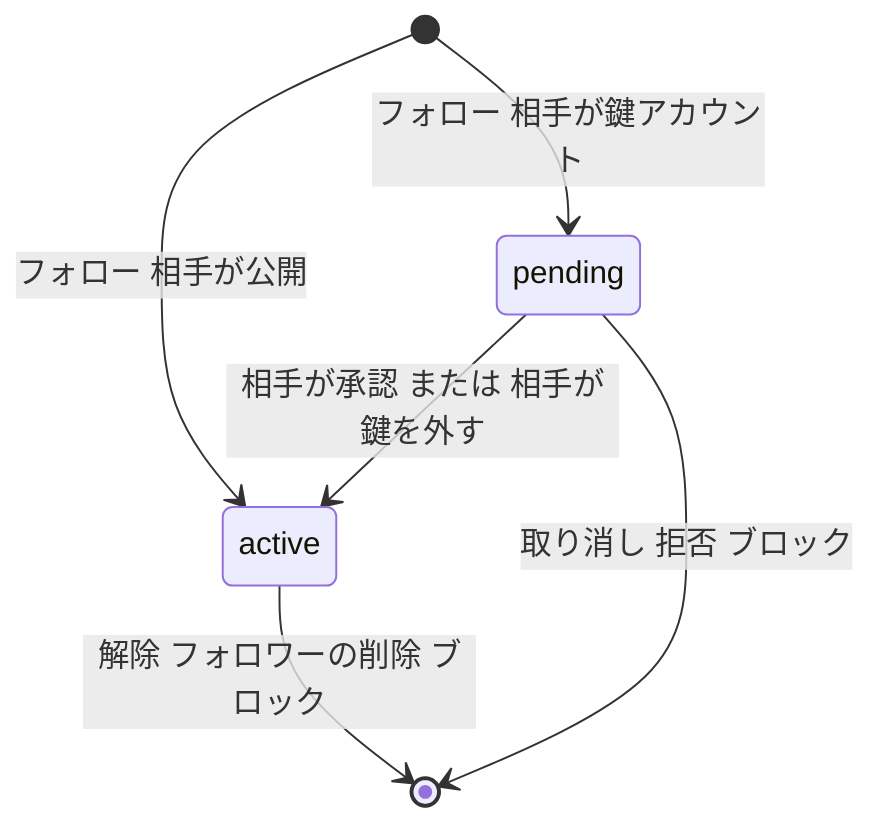
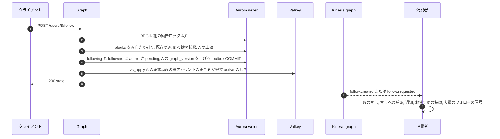
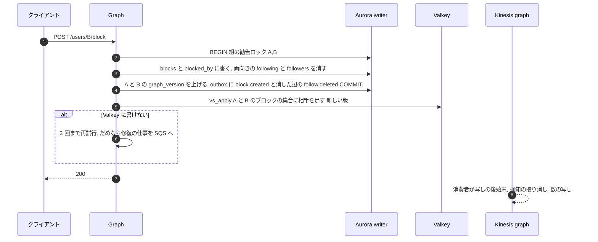
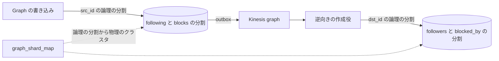

# Follow Graph: X

フォローの関係。フォロー・解除、鍵アカウントへの申請と承認、フォロワーの削除、ブロック、ミュート（アカウント、語）、2 つの隣接の表、閲覧者の集合の写し、数の写し、上限、一覧のページング、大量のフォロー・解除の検出、S2・S3 の分割を決める。

前提となる決定は、2 つの隣接の表（[ADR-0007](../decisions/0007-follow-graph-storage.md)）、`visible()` と本人だけの表の RLS（[ADR-0004](../decisions/0004-single-tenant-and-visibility.md)）、outbox と Kinesis（[ADR-0005](../decisions/0005-event-log-and-outbox.md)）、fan-out の閾値と作者の方式（[ADR-0003](../decisions/0003-timeline-fanout-hybrid.md)）。この文書で決めたことは次の ADR にある。

| ADR | 決定 |
| --- | --- |
| [0011](../decisions/0011-graph-edge-state-machine-and-locking.md) | フォロー・申請・ブロックの辺を 1 つの状態機械で扱い、2 人の組ごとの勧告ロックで直列にする。ブロックは同じトランザクションで両向きのフォローと申請を外す。鍵を外したら、待っている申請をすべて承認する |
| [0012](../decisions/0012-viewer-sets-cache.md) | 閲覧者の集合（ブロックの両向き、ミュート、承認済みの鍵アカウントのフォロー先、ミュートの語）を Valkey に版つきの写しで持つ。書き込みの確定の直後に更新し、出来事の消費者が補い、寿命は 1 時間。版の古い読み込みで新しい写しを壊さない |
| [0013](../decisions/0013-graph-partitioning.md) | 関係の表を利用者の ID のハッシュで 1,024 の論理の分割に分け、物理のクラスタへの対応表で置く。S2 は 4 クラスタから。分割の後は `following` と `blocks` を正本にし、逆向きの表は出来事から作る |

## 1. 目的と範囲

- 扱う：
  - 辺の種類（フォロー、申請、ブロック、ミュート）と状態機械、同時の書き込み
  - 鍵アカウントの申請・承認・拒否、鍵の切り替えの時の扱い、フォロワーの削除
  - ミュートの語の正規化と照合
  - 閲覧者の集合の写し（`visible()` の `ViewerContext` の元）
  - フォロー・フォロワーの数の写し（集計の仕組みは [engagement-and-counters.md](engagement-and-counters.md)）と、作者の fan-out の方式の更新
  - 上限、一覧のページング、大量のフォロー・解除の検出の信号
  - S2・S3 の分割
- 扱わない：
  - `visible()` の決定表の全体（[trust-and-safety.md](trust-and-safety.md)。この文書は、関係が `ViewerContext` に何を渡すかを書く）
  - fan-out の写しの後始末と補充（[timeline-fanout.md](timeline-fanout.md)）
  - 1 日のフォローの数のレート制限（[api-and-rate-limits.md](api-and-rate-limits.md)）
  - 大量のフォローへの措置の判断（[trust-and-safety.md](trust-and-safety.md)。この文書は信号を出すまで）
  - おすすめの 2 歩先の候補の集計（[ranking-and-recommendation.md](ranking-and-recommendation.md)）

## 2. 本家の形（確かめたこと）

| 項目 | 本家 | 出典 |
| --- | --- | --- |
| フォローの上限 | 1 日 400。5,000 人をフォローした後は、フォロワーとの比で制限 | [About following on X](https://help.x.com/en/using-x/x-follow-limit)（検索結果の抜粋で確認。本文は 403 で**未検証**。2026-10-04） |
| 比の具体の値 | 公開されていない | **未検証** |
| 鍵を外したときの待っている申請 | 承認される | **未検証** |
| ブロックされた人がブロックした人のプロフィールを開いたとき | ブロックされていることが示される | **未検証** |

この設計の値（4.4 節の上限）は自前で決める。本家の値に合わせることは目標にしない。

## 3. 要件（NFR との対応）

| 項目 | 目標 | NFR |
| --- | --- | --- |
| フォロー・解除・ブロックの API | p99 300ms | NFR-001 に準じる |
| ブロックが読み出しに効くまで | 確定の直後の読み出しから（閲覧者の集合の写しを確定の直後に更新）。写しの更新が失敗しても p99 60 秒 | NFR-009 |
| 鍵アカウントの承認のない人に見えない | どの経路でも 0 件 | NFR-009 |
| 新しいフォローの投稿がホームに出るまで | 補充は p95 5 秒 | NFR-002 |
| 数の写し | 確定から表示まで p95 5 秒。照合の後、正本との差 0 | NFR-006 |
| 確定した辺を失わない | AZ の障害で RPO 0 | NFR-005 |
| `following` と `followers` の一致 | S1 は同じトランザクション。S2 の後は出来事の遅れの p99 5 秒の中 | [ADR-0007](../decisions/0007-follow-graph-storage.md) |

## 4. 辺と状態

### 4.1 表

| 表 | 主キー | 種類 | 備考 |
| --- | --- | --- | --- |
| `following(src_id, dst_id, state, created_at, updated_at)` | `(src_id, dst_id)` | 公開の表 | `state` は `active`・`pending`。する側から見た辺 |
| `followers(dst_id, src_id, state, created_at, updated_at)` | `(dst_id, src_id)` | 公開の表 | される側から見た辺 |
| `blocks(src_id, dst_id, created_at)` | `(src_id, dst_id)` | 公開の表（API には本人の分だけ出す） | ブロックした側から見た辺 |
| `blocked_by(dst_id, src_id, created_at)` | `(dst_id, src_id)` | 同上 | ブロックされた側から見た辺。閲覧者の集合の元 |
| `mutes(owner_id, target_id, created_at, expires_at)` | `(owner_id, target_id)` | 本人だけの表（FORCE RLS） | 逆向きの表を持たない（4.5 節） |
| `muted_words(owner_id, id, phrase, phrase_norm, scope, created_at, expires_at)` | `(owner_id, id)` | 本人だけの表（FORCE RLS） | `id` は UUIDv7 |

### 4.2 フォローの辺の状態

- 「辺がない」は行がないことで表す。解除・拒否・削除では行を消す。履歴は出来事のログとデータレイクに残る（保持は法務の L8）。
- 鍵アカウントにする：既にある `active` のフォロワーはそのまま。
- 鍵を外す：待っている `pending` をすべて `active` にする（ADR-0011）。件数が多い（1,000 件超）ときは、1,000 件ずつのジョブに分け、利用者の画面には「承認の処理中」を出す。

### 4.3 書き込みの決定表

フォローの要求（する側 A、される側 B）。spec の `DT-GRAPH-001` の元。

| # | A = B | B が A をブロック | A が B をブロック | 既存の辺 | B が鍵アカウント | 上限（4.4 節）を超える | 結果 |
| --- | --- | --- | --- | --- | --- | --- | --- |
| 1 | はい | — | — | — | — | — | `400 invalid_target` |
| 2 | いいえ | はい | — | — | — | — | `403 blocked`（ブロックされていることを示す） |
| 3 | いいえ | いいえ | はい | — | — | — | `409 unblock_first` |
| 4 | いいえ | いいえ | いいえ | `active` か `pending` | — | — | `200`（何もしない。出来事も出さない） |
| 5 | いいえ | いいえ | いいえ | なし | — | はい | `403 follow_limit` |
| 6 | いいえ | いいえ | いいえ | なし | いいえ | いいえ | `active` を作る |
| 7 | いいえ | いいえ | いいえ | なし | はい | いいえ | `pending` を作る。B に申請の通知 |

ブロック（A が B をブロック）。spec の `DT-GRAPH-002` の元。

| 既存の辺 | ブロックの後 |
| --- | --- |
| A → B の `active`・`pending` | 消す |
| B → A の `active`・`pending` | 消す |
| A の B へのミュート | 残す（ブロックを外した後に戻るため） |
| B の投稿・返信・DM | `visible()` で互いに見えない。DM の扱いは [direct-messages.md](direct-messages.md) |
| ブロックの出来事 | `graph` の流れに `block.created`。写しの後始末（[timeline-fanout.md](timeline-fanout.md)）、通知の取り消し（[notifications.md](notifications.md)）、数の写しの更新 |

- ブロックを外しても、消したフォローは戻らない。
- **フォロワーの削除**（B が A を自分のフォロワーから外す）：A → B の辺を消す。ブロックではないので、A は再びフォローできる（B が鍵アカウントなら申請になる）。

### 4.4 上限

| 項目 | 値 | 持つ場所 |
| --- | --- | --- |
| フォローの数 | `max(5,000, ⌊1.1 × フォロワーの数⌋)` まで。絶対の上限 50,000 | `ops.graph.follow_cap_base`・`ops.graph.follow_cap_ratio`・`ops.graph.follow_cap_max` |
| 送った申請（`pending`） | 1,000 件まで | `ops.graph.max_pending_outgoing` |
| ブロック | 上限なし（閲覧者の集合の写しの大きさは 6 節） | — |
| ミュート（アカウント） | 10,000 | `ops.graph.max_mutes` |
| ミュートの語 | 200 件、1 件 100 文字まで | `ops.graph.max_muted_words` |
| 1 日のフォローの数 | [api-and-rate-limits.md](api-and-rate-limits.md) | — |

- 上限の判定は、書き込みの時に `user_counters` の写しで行う。写しは数秒遅れうるので、上限の付近では少しの超過を許す（正本で数え直さない）。超過は照合のジョブで測る。

### 4.5 ミュート

- **アカウントのミュート**：ホーム（フォロー中・おすすめ）、通知、会話の返信の並び（下に畳む）から、その人の投稿とリポストを除く。プロフィールを直接開いたとき、検索で `from:@handle` などで作者を指定したときは見える（[search-and-trends.md](search-and-trends.md) の 6.3 節）。期限（24 時間、7 日、30 日、なし）を選べる。
- ミュートは相手に知られない。逆向きの表を持たないのは、ミュートした人を、された側から引く経路を作らないため（[ADR-0007](../decisions/0007-follow-graph-storage.md) の「同じ 2 つの向き」から外れる。理由は ADR-0012）。
- **ミュートの語**：
  - 正規化：NFKC → 小文字 → カタカナをひらがなに寄せる → 連続する空白を 1 つに。
  - 照合：正規化した本文・ハッシュタグ・作者の表示名に対して行う。語にラテン文字・数字だけを含む場合は語の境で照合し、それ以外（日本語を含む）は部分一致で照合する。
  - 範囲（`scope`）：`home`・`notifications`・`all`。
  - 閲覧者ごとに、語の一覧を Aho–Corasick の照合器に組み立て、閲覧者の集合の写しと同じ版で持つ（6 節）。
- `visible()` は、`ViewerContext.surface`（`home`・`notifications`・`profile`・`search`・`conversation`・`api` など）を見て、ミュートを当てるかを決める。ブロック・鍵・削除・措置は、面に関わらず同じ。

## 5. 流れ

### 5.1 フォロー

### 5.2 ブロック

- 確定の直後の閲覧者の集合の更新で、ブロックは次の読み出しから効く。更新が失敗したら、修復の仕事と `graph` の流れの消費者が書く。どちらも止まったときの上限は 6 節。

### 5.3 一覧のページング

- フォロー中・フォロワーの一覧は `(created_at DESC, 相手の ID DESC)` の順。カーソルは、この 2 つを詰めた不透明な文字列。
- 1 ページ 20 件（画面）、API は最大 1,000 件（[api-and-rate-limits.md](api-and-rate-limits.md)）。
- 一覧の各行は `visible()` の利用者の版（プロフィールの見える範囲）で絞る。ブロックした・された相手は出さない。
- 鍵アカウントの一覧は、本人と承認したフォロワーだけが読める。
- 本人以外が読めるフォロワーの一覧は、新しい順に 50,000 件まで（大量の取得の抑止。`ops.graph.max_list_depth`）。本人は全件。

## 6. 閲覧者の集合の写し（ADR-0012）

`visible()` の `ViewerContext` は、閲覧者ごとの次の集合を要る（[ADR-0004](../decisions/0004-single-tenant-and-visibility.md)）。

| 鍵 | 中身 | 元の表 |
| --- | --- | --- |
| `vb:{viewer_id}` | ブロックした人とブロックされた人の和 | `blocks`・`blocked_by` |
| `vm:{viewer_id}` | ミュートしているアカウント（期限つき） | `mutes` |
| `vp:{viewer_id}` | `active` でフォローしている鍵アカウント | `following` と利用者の鍵の状態 |
| `vw:{viewer_id}` | 組み立てたミュートの語の照合器（直列化したもの） | `muted_words` |
| `vv:{viewer_id}` | 上の 4 つの版（`users.graph_version`） | |

- 集合は Valkey の Set で、ページの全件を `SMISMEMBER` で一度に確かめる。5 つの鍵は `{viewer_id}` のハッシュタグで同じスロットに置き、1 回の Function で読む。
- **版の規則**：辺を変える全てのトランザクションは、関わる利用者の `users.graph_version` を上げる。確定の直後に `vs_apply(viewer, version, 差分)` で写しを更新する（写しがなければ何もしない）。正本から読み込むときは、読み込んだ版が `vv:` 以上のときだけ書く。reader の版が `vv:` より古ければ writer から読み直す。
- **寿命**：1 時間（読み出しで延ばさない）。出来事の経路と修復の仕事がどちらも止まっても、写しの古さは 1 時間で上限になる。この上限は NFR-009 の 60 秒より長いので、修復の仕事の遅れ（SQS の最も古い仕事の年齢）を 30 秒でアラートにし、修復の仕事が止まったら閲覧者の集合を読み出しの時に Aurora から読む（劣化の運転、`ops.graph.viewer_sets_bypass`）。
- 大きな集合：ブロックを数万件持つ利用者も、Set に全件を持つ（10 万件で数 MB）。読み込みは single flight（`vl:{viewer_id}` の `SET NX`）で 1 回にまとめる。10 万件を超える利用者は 1% 未満と見込み、計測で確かめる。
- 写しがない利用者の最初の読み出しは、5 つを 1 回の問い合わせ（reader）で読み込む。S1 の想定で 1 時間に 1 回、アクティブな利用者 100 万人で毎秒 300 回前後。

## 7. 数の写しと作者の方式

- `user_counters(user_id, followers, following, ...)` は、`graph` の流れから Counter Aggregator が作る（集計・書き戻し・照合の仕組みは [engagement-and-counters.md](engagement-and-counters.md)）。正本は `followers`・`following` の `active` の行の数。
- **作者の fan-out の方式**（[ADR-0003](../decisions/0003-timeline-fanout-hybrid.md)）：Graph の数の消費者が、フォロワーの数が `ops.fanout.pull_threshold`（既定 10,000）以上になったら `users.fanout_mode = pull`、`0.8 ×` 閾値を下回ったら `push` に書き、`author.fanout_mode_changed` を出す。閾値の一時の引き下げ（瞬間のピーク）は [timeline-fanout.md](timeline-fanout.md) の ADR-0015。
- 数の表示では、鍵アカウントの承認のない人にも数は見せる（本家の現在の扱いは**未検証**。数は公開のプロフィールの一部とする）。

## 8. 大量のフォロー・解除の検出

T&S への信号だけを出す。措置の判断は [trust-and-safety.md](trust-and-safety.md)。

| 信号 | 条件（既定） | 窓 |
| --- | --- | --- |
| `graph.follow_burst` | フォローが 100 件を超える | 10 分 |
| `graph.unfollow_burst` | 解除が 100 件を超える | 10 分 |
| `graph.follow_churn` | 同じ相手へのフォローと解除の繰り返しが 3 回を超える | 24 時間 |
| `graph.target_burst` | 1 人へのフォローが、普段の 1 時間あたりの 50 倍を超え、かつ新しいアカウントからが 8 割を超える | 1 時間 |

- 数は Valkey の 1 分ごとの桶で持ち、`graph` の流れの消費者が数える。値は `ops.graph.signals.*`。
- 信号は `moderation` の流れでなく、T&S の入力の SQS に入れる（確定した変更ではないため）。

## 9. 分割（S2・S3、ADR-0013）

- 利用者の ID を xxHash64 でハッシュし、1,024 で割った余りを論理の分割にする。論理の分割から物理のクラスタへの対応は `graph_shard_map`（小さな表。サービスは 60 秒ごとに読み直す）。S2 の初めは 4 クラスタ（1 クラスタに 256 の論理の分割）。
- 分割の後は、`following`・`blocks` を正本にして先に書き（outbox を含む）、`followers`・`blocked_by` は出来事から冪等に作る（[ADR-0007](../decisions/0007-follow-graph-storage.md)）。
- 2 人の組の勧告ロックは、する側（`src_id`）の分割で取る。ブロックで消す逆向きのフォロー（B → A）は B の分割にあるので、出来事から消す。その間も `visible()` がブロックで隠す。
- B → A のフォローと、A の B へのブロックが同時に起きた場合：どちらの出来事の消費者も、処理の時に正本の `blocks` を確かめ、ブロックがあればフォローの辺を消す。どの順でも、最後はフォローの辺がない。
- 論理の分割の移動：移動の元で書き込みを止め（数秒）、移動の先へ写し、対応表を変えてから再開する。手順は infrastructure の領域。

## 10. 障害と振る舞い

| 障害 | 起きること | 検知 | 回復 |
| --- | --- | --- | --- |
| Aurora の writer の切り替え | フォロー・ブロックが失敗する | API のエラー率 | クライアントが再送する（書き込みは冪等。4.3 節の 4 行目） |
| Valkey の障害 | 閲覧者の集合が読めない | 接続のエラー | 読み出しの時に reader から読み込み、写しなしで判定する（遅くなる。タイムラインの読み出しは NFR-003 を外しうる） |
| 閲覧者の集合の更新の失敗 | ブロックが写しに入らない | 修復の仕事の数と年齢 | 修復の仕事、`graph` の流れの消費者、1 時間の寿命。30 秒の遅れで劣化の運転 |
| 逆向きの作成役の遅れ（S2） | `followers` が遅れ、fan-out の配り先が欠ける | 消費者の遅れ（`IteratorAge`） | 追いつけば欠けは埋まる。fan-out の仕事は `followers` を読むので、遅れの間の新しいフォロワーには、新しいフォローの補充（[timeline-fanout.md](timeline-fanout.md)）が届ける |
| 数の写しのずれ | 上限の判定と方式の切り替えがずれる | 照合のジョブ | 照合で正本の値に直す |

## 11. data-model への項目

列・鍵・索引の正本は [data-model/graph.md](data-model/graph.md)にある。下の表は、この領域が求めた項目の要点である。

| 表・store | 列・鍵 | 備考 |
| --- | --- | --- |
| `following` | `(src_id, dst_id) PK`、`state`、`created_at`、`updated_at` | 索引 `(src_id, created_at DESC, dst_id DESC)`、`(src_id) WHERE state = 'pending'` |
| `followers` | `(dst_id, src_id) PK`、`state`、`created_at`、`updated_at` | 索引 `(dst_id, created_at DESC, src_id DESC)`、`(dst_id) WHERE state = 'pending'`（届いた申請の一覧） |
| `blocks`・`blocked_by` | 4.1 節 | 索引 `(src_id, created_at DESC)` |
| `mutes` | `(owner_id, target_id) PK`、`expires_at` | 本人だけの表、FORCE RLS |
| `muted_words` | `(owner_id, id) PK`、`phrase`、`phrase_norm`、`scope`、`expires_at` | 本人だけの表、FORCE RLS |
| `users.graph_version` | `bigint` | 閲覧者の集合の版（表は [accounts-and-auth.md](accounts-and-auth.md) の 12 節） |
| `users.fanout_mode`、`users.fanout_mode_changed_at` | `push`・`pull` | [ADR-0003](../decisions/0003-timeline-fanout-hybrid.md)。統合の工程で `users` の列に決めた（表は [accounts-and-auth.md](accounts-and-auth.md) の 12 節） |
| `user_counters` | `user_id PK`、`followers`、`following`、`posts`、`updated_at` | 写し。[engagement-and-counters.md](engagement-and-counters.md) |
| `graph_shard_map`（S2） | `logical_partition smallint PK`、`cluster`、`state`、`moved_at` | |
| outbox の出来事 | `graph` の流れ：`follow.created`・`follow.requested`・`follow.approved`・`follow.deleted`（理由：解除・拒否・取り消し・削除・ブロック）・`block.created`・`block.deleted`・`mute.created`・`mute.deleted`・`author.fanout_mode_changed`。鍵の切り替えは Accounts が `accounts` の流れに `accounts.protected_changed` を書く | 鍵は `src_id`（[ADR-0005](../decisions/0005-event-log-and-outbox.md)）。ミュートの出来事は相手の ID を含むが、データレイクに写すときは本人だけの出来事として扱う |
| Valkey `vb:`・`vm:`・`vp:`・`vw:`・`vv:`・`vl:` | 6 節 | 寿命 1 時間 |
| Valkey の信号の桶 | `gs:{user_id}:{signal}:{minute}` | 寿命 25 時間 |
| SQS `graph-cache-repair` | 閲覧者の集合の修復の仕事 | |

## 12. テストと性質

### 12.1 性質

- **PROP-GRAPH-001（2 つの表）**：任意のフォロー・解除・申請・承認・拒否・フォロワーの削除・ブロック・鍵の切り替えの列の後、`following` と `followers` が互いの逆。S2 では、出来事を全部当てた後に（[ADR-0007](../decisions/0007-follow-graph-storage.md)）。
- **PROP-GRAPH-002（ブロックの排他）**：任意の列（同時の操作を含む）の後、A と B の間にブロックがあれば、両向きのフォローの辺（`active`・`pending`）がない。
- **PROP-GRAPH-003（同時の操作）**：同じ組への同時のフォロー・解除・ブロックの任意の重なりで、結果はどれかの直列の順で当てた結果と等しい。
- **PROP-GRAPH-004（閲覧者の集合）**：任意の書き込み・読み込み（遅れた reader を含む）・写しの更新の失敗の列で、`vv:` は減らない。更新の失敗がなければ、確定の直後の読み出しの集合は正本と一致する。
- **PROP-GRAPH-005（鍵の承認）**：任意の列の後、`vp:` の要素は、閲覧者が `active` でフォローしている鍵アカウントと一致する（写しがある場合）。鍵を外した後、待っていた申請はすべて `active`。
- **PROP-GRAPH-006（ミュートの語）**：正規化の後に語を部分として含む任意の本文は、範囲の面で `hide` になり、範囲の外の面では語で隠れない。

### 12.2 表駆動・結合

- `DT-GRAPH-001`（フォロー）・`DT-GRAPH-002`（ブロック）の全行。
- ブロックの直後、ホーム・会話・通知・検索・プロフィールの経路で、相手の投稿を返さない（漏れの経路の表の「ブロックされた人」）。閲覧者の集合の更新を失敗させた場合も、修復の後に同じ。
- 鍵アカウントの承認のない人への 5 経路の結合テスト（[quality.md](../quality.md) の 2.2.1 節）。
- 負荷：100 万フォロワーの作者へのフォローの殺到（1 秒 1,000 件）で、勧告ロックの待ちと `followers` の分割の書き込みを測る。

## 13. Story の候補

| Epic | Story | 中身 |
| --- | --- | --- |
| E4 | `follow-tables` | 4.1 節の表、組の勧告ロック、outbox（ADR-0011） |
| E4 | `follow-requests` | 申請・承認・拒否・取り消し、鍵の切り替えの一括の承認 |
| E4 | `blocks-and-mutes` | ブロック・ミュート・ミュートの語、`DT-GRAPH-002` |
| E4 | `viewer-sets-cache` | 6 節の写し、版の規則、修復の仕事（ADR-0012） |
| E4 | `follow-counters` | 7 節の数の写しと作者の方式の更新（E6 の `counter-aggregator` と共同） |
| E4 | `follow-limits` | 4.4 節の上限、8 節の信号 |
| E4 | `follow-lists` | 5.3 節のページング |

## 14. 未解決の問い

### 決定

2026-10-04 の既定案。E4 の計測で覆りうる。

- 辺の書き込みは組の勧告ロックで直列（ADR-0011）。
- 鍵を外したら、待っている申請をすべて承認する（ADR-0011）。
- ブロックされた人がフォローしようとしたら、ブロックされていることを示す（`403 blocked`）。
- ミュートは逆向きの表を持たない（ADR-0012）。
- 閲覧者の集合の寿命は 1 時間、修復の遅れ 30 秒で劣化の運転（ADR-0012）。
- フォローの上限は `max(5,000, 1.1 × フォロワー)`、絶対の上限 50,000。
- 分割は 1,024 の論理の分割、S2 は 4 クラスタ（ADR-0013）。

### 持ち越し

| 問い | いつ・どう決めるか |
| --- | --- |
| フォローの上限の比（1.1）と絶対の上限が、スパムの抑止と普通の利用に合うか | E4 の後の計測と、T&S の評価（[trust-and-safety.md](trust-and-safety.md)） |
| ブロックが 10 万件を超える利用者の割合と、写しの大きさ | E4 の計測 |
| 本人以外のフォロワーの一覧の深さ（50,000 件）の妥当さ | E13 の公開 API の設計と合わせて決める（[api-and-rate-limits.md](api-and-rate-limits.md)） |
| ブロック・ミュートの記録の保持の期間 | 法務の L8 |
| 未成年の利用者へのフォローの申請・DM の制限 | 法務の L5（[accounts-and-auth.md](accounts-and-auth.md)・[trust-and-safety.md](trust-and-safety.md)） |

## 15. quality.md・runbooks への項目

- quality.md：漏れの経路の表に「閲覧者の集合の更新の失敗」のシナリオを足す（ホーム・会話・通知の行）。
- runbooks：`viewer-sets-repair-lag.md`（修復の仕事の遅れと劣化の運転への切り替え）、`graph-reverse-lag.md`（S2 の逆向きの作成役の遅れ）。
