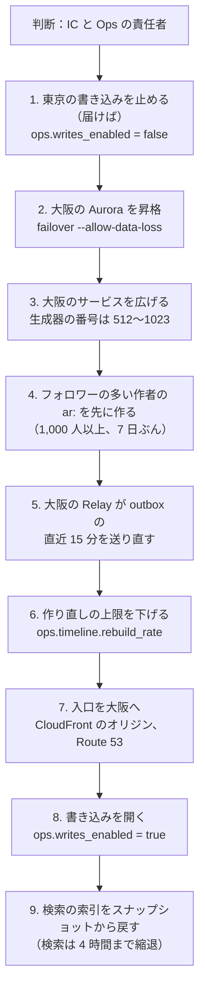

# Infrastructure: X

AWS のアカウントとネットワーク、入口とホスト名、サービスの分け方と配置、Valkey のクラスタの分け方、Kinesis の流れと消費者、バックアップと DR（大阪、`tid` の生成器の範囲、写しの作り直し）、段階を上げる基準、S2・S3 の構成、Terraform、コストを決める。他の題材（Linear・Slack の infrastructure.md）の形を土台にし、この題材に固有の事情（写し・出来事のログ・fan-out）だけを変える（[ADR-0001](../decisions/0001-platform-and-stack.md)）。

| ADR | 決定 |
| --- | --- |
| [0054](../decisions/0054-accounts-network-and-services.md) | アカウントとネットワークは他の題材の形を引き継ぐ。入口は CloudFront → ALB（画面と API を分ける）。サービスは、入口（App API、Public API、Gateway、Ingest）、書き込み（Post、Graph、Engagement、Accounts、DM、T&S）、読み出し（Timeline、Ranking、Search）、出来事の消費者、SQS の Worker に分け、すべて ECS Fargate（ARM64）に置く。外の宛先への送信は egress の専用の経路 |
| [0055](../decisions/0055-kinesis-consumers-and-valkey-clusters.md) | Kinesis の消費者は自前の TypeScript の読み手（`packages/stream-consumer`）にし、遅れに厳しい消費者は拡張ファンアウト（`SubscribeToShard`）、他は共有の読み出しを使う。シャードの担当と読み終わりの位置は Aurora に持つ（Valkey に結果を書く消費者は ADR-0005 のとおり Valkey）。Valkey は用途で 4 つのクラスタ（`vk-timeline`・`vk-cache`・`vk-counters`・`vk-edge`）に分ける |
| [0056](../decisions/0056-disaster-recovery-osaka.md) | 大阪にウォームスタンバイを持ち、切り替えは人が判断してワークフローで行う。大阪は生成器の番号 512〜1023 だけを使う。送った outbox の行を 1 時間残し、切り替えの後に大阪の Relay が直近 15 分を送り直す。Valkey の写しは空から作り直し、作り直しの範囲を狭めて殺到を抑える。プルの作者の最近の投稿は、入口を開く前に先に作る |

ログ・メトリクス・SLI は [observability.md](observability.md)、負荷と台数の根拠は [capacity.md](capacity.md)、CI とリリースは [delivery.md](delivery.md)、鍵と監査は [security.md](security.md) にある。数値のうち「初期見積もり」と書いたものは、E14 の負荷試験の前の仮の値である。AWS の仕様で確かめていないものは「未検証」と書く。

## 1. AWS アカウント

ADR-0054。Linear・Auth0 の題材と同じ形にする。

| アカウント | OU | 中身 |
| --- | --- | --- |
| management | Root | Organizations、SCP、IAM Identity Center、請求 |
| security | Security | GuardDuty・Security Hub・Inspector の委任管理者、調査用のロール |
| log-archive | Security | 組織の CloudTrail、Config、VPC フローログ、監査ログの写し、エッジのアクセスログ（[security.md](security.md) の 6・9 節）。Object Lock。東京 → 大阪へ複製 |
| shared | Infrastructure | ECR（東京・大阪に複製）、Route 53（`<brand>.<domain>`、`<brand>.<short-tld>`、`<brand>media.<domain>`）、Managed Grafana、Terraform の状態、アプリの署名の鍵（[delivery.md](delivery.md) の 5 節） |
| edge | Infrastructure | CloudFront、WAF、ACM（us-east-1）、CloudFront のログ |
| data | Workloads/Prod | データレイク（S3、Glue、Athena）、学習と評価のジョブ（[ranking-and-recommendation.md](ranking-and-recommendation.md)）。本番のサービスのアカウントと分け、学習の権限から本番の DB に届かないようにする |
| dev、staging | Workloads/NonProd | 開発・検証。staging は本番と同じ構成を最小の台数で持ち、負荷試験の時だけ広げる |
| prod | Workloads/Prod | 本番（東京と大阪） |

- **SCP**（Workloads）：東京・大阪以外のリージョンを禁止する（us-east-1 のグローバルなサービスを除く）。CloudTrail・Config・GuardDuty の停止、KMS の鍵の削除の予約・無効化を break-glass 以外に禁止する。
- data のアカウントは、prod から Firehose で S3 へ書かれた行だけを読む。本人だけの表は流さない（[security.md](security.md) の 3.4 節）。

## 2. ネットワーク

### 2.1 prod の VPC（東京・大阪で同じ形）

| サブネット | 置くもの | インターネットへの経路 |
| --- | --- | --- |
| public | ALB（`alb-app`、`alb-api`）、NAT | Internet Gateway |
| private | 入口・書き込み・読み出しのサービス、消費者、Worker | NAT 経由。Network Firewall で宛先を許可リストに限る（APNs、FCM、SMS・メールの事業者、ハッシュの照合の提供者、Apple・Google の OIDC） |
| egress | `worker-egress`（リンクのカードの取り出し、後の Webhook の送信） | 専用の NAT。本体の VPC エンドポイントと DB への経路を持たない |
| isolated | Aurora、ElastiCache（Valkey）、OpenSearch | なし |

- 入口は CloudFront → ALB だけ。ALB のセキュリティグループは CloudFront のマネージドプレフィックスリストだけを許し、CloudFront が付ける秘密のヘッダーをリスナーの規則で確かめる。
- VPC エンドポイント：S3、ECR、SQS、Kinesis、Firehose、KMS、Secrets Manager、CloudWatch Logs、STS、X-Ray、AppConfig。

### 2.2 ホスト名と CloudFront

| ホスト名 | ビヘイビア | オリジン |
| --- | --- | --- |
| `<brand>.<domain>` | 既定：Web の殻（ハッシュ付きの資産、`index.html`、Service Worker） | S3（静的） |
| 同 | `/<handle>/posts/<id>`、`/<handle>`（ボットと初回の HTML。[clients.md](clients.md) の 9 節）、`/api/*`、`/api/auth/*`、`/i/oauth/*` | `alb-app` → `app-api`（`/api/auth/*` は `auth`） |
| 同 | `/i/views`、`/i/rum` | `alb-app` → `ingest` |
| 同 | `/ws` | `alb-app` → `gateway`（WebSocket） |
| 同 | `/.well-known/apple-app-site-association`、`/.well-known/assetlinks.json` | S3（静的） |
| `api.<brand>.<domain>` | `/v1/*` | `alb-api` → `public-api` |
| `<brand>media.<domain>` | メディアの配信 | S3（メディア、OAC）。鍵アカウントは署名付きの URL（[media.md](media.md)） |
| `<brand>.<short-tld>` | 短縮 URL | `alb-app` → `app-api`（[posts-and-ids.md](posts-and-ids.md)） |
| `updates.<brand>.<domain>` | アプリの OTA の更新（[delivery.md](delivery.md) の 5 節） | S3（署名した束）、`alb-api` → `public-api`（案内） |

- WebSocket も CloudFront を通す（Linear の ADR-0049 の考え方を引き継ぐ）。Gateway は 20 秒ごとに ping を送る（CloudFront の 10 分の無通信の切断に当たらない）。

### 2.3 外向きの送信

| 送信 | 経路 |
| --- | --- |
| APNs、FCM、SMS・メールの事業者、ハッシュの照合の提供者 | private → NAT → Network Firewall（許可リスト） |
| リンクのカードの取り出し（投稿の URL の先の OGP） | egress の `worker-egress`。SSRF の踏み台にしない（内部の宛先・メタデータの IP を拒む） |
| 後の Webhook（[api-and-rate-limits.md](api-and-rate-limits.md) の 7 節） | egress |

## 3. サービスと配置

ADR-0054。すべて ECS Fargate（ARM64）。サービスごとにタスク定義と IAM ロールを分ける。サービスの間は Service Connect（HTTP/2、TLS）。

### 3.1 サービス

| 区分 | サービス | 役割 | スケールの指標 |
| --- | --- | --- | --- |
| 入口 | `app-api` | 画面向けの BFF。セッションの確かめ、内部のサービスの束ね、公開の URL の HTML | CPU 50%、要求の数 |
| 入口 | `public-api` | 公開 API、OAuth、レート制限、計量 | CPU 50%、要求の数 |
| 入口 | `gateway` | WebSocket（DM、通知の数、`hidden` の知らせ） | タスクあたりの接続の数（目標 1 万） |
| 入口 | `ingest` | 閲覧の出来事・RUM を束ねて Kinesis・Firehose へ | 要求の数 |
| 入口 | `auth` | Better Auth（[accounts-and-auth.md](accounts-and-auth.md)） | CPU 50% |
| 書き込み | `post`、`graph`、`engagement`、`dm`、`accounts`、`ts` | 正本の書き込みと outbox | CPU 50% |
| 読み出し | `timeline` | フォロー中の読み出し、写しとプルの合わせ、作り直し | CPU 50%、作り直しの同時の数 |
| 読み出し | `ranking` | おすすめのパイプライン | CPU 60%（推論は S2） |
| 読み出し | `search-api` | 検索とトレンドの読み出し | CPU 50% |
| 読み出し | `media` | アップロードの受け付け、配信の URL | 要求の数 |
| 送り | `relay` | outbox → Kinesis | outbox の最古の行の年齢 |
| 消費者 | `fanout-router`、`author-recent`、`timeline-maint`、`counter-aggregator`、`search-indexer`、`trends`、`notification-builder`、`ts-stream`、`audit-sink` | Kinesis の消費者（6 節） | シャードの数と遅れ（`MillisBehindLatest`） |
| Worker | `fanout-worker`、`push-sender`、`mailer`、`sms-sender`、`media-worker`、`reconciler`、`scheduler`、`retention-jobs`、`worker-egress` | SQS の仕事 | キューの最古のメッセージの年齢 |
| 社内 | `ts-console` | T&S の作業の画面（社内の入口。Identity Center の後ろ） | 固定 |

- 書き込みのサービスだけが Aurora の writer に書く。読み出しのサービスは reader と Valkey を読む。
- Relay は outbox の区画（`hash(partition_key) mod 64`）を期限つきの担当で分け合う（Linear の Relay と同じ考え方）。

### 3.2 WAF

- 共通のルール、IP の評判、Bot Control（登録・ログイン・投稿の入口に Targeted、閲覧に Common）。
- IP ごとのレート：`/api/auth/*` は 5 分 300、`/i/views` は 5 分 3,000、全体は 5 分 3 万。細かな上限はアプリの層のトークンバケット（[api-and-rate-limits.md](api-and-rate-limits.md)）。値は E11・E14 で調整する。

### 3.3 AZ の障害への備え

- 各サービスは、残る 2 AZ で最大負荷をさばける台数を常に持つ。平常の使用率を 2/3 以下に保つ（[capacity.md](capacity.md) の 7 節）。
- Gateway の 1 AZ の喪失で、その AZ の接続が残る AZ へつなぎ直す。つなぎ直しは 0〜30 秒の乱数の待ちで散らす。

## 4. データの置き場所（S1）

| 置き場所 | 中身 | 冗長 |
| --- | --- | --- |
| Aurora PostgreSQL 18 | 正本（利用者、投稿、関係、エンゲージメント、通知、DM、措置、outbox、`auth` スキーマ、監査、`stream_leases`） | 3 AZ、Global Database で大阪へ |
| ElastiCache（Valkey） | 写しと短い状態（5 節） | クラスタモード、レプリカ。失ってよい |
| OpenSearch | 検索の索引（[search-and-trends.md](search-and-trends.md)） | 3 AZ、スナップショットを大阪へ |
| Kinesis Data Streams | 出来事のログ（6 節）。保持 7 日 | 東京だけ（大阪は空の流れ） |
| SQS | 仕事の待ち行列 | 東京だけ（大阪は空） |
| S3 | メディア、Web の資産、データレイク、監査の写し、スナップショット、OTA の束 | メディア・資産・OTA・スナップショットは大阪へ複製 |

## 5. Valkey の構成

ADR-0055。用途ごとにクラスタを分ける。理由：写しの喪失の影響と、負荷の形が違う。タイムラインの書き込みの殺到が、セッションとレート制限を巻き込まないようにする。

| クラスタ | 中身 | 形（S1、初期見積もり） | 失ったとき |
| --- | --- | --- | --- |
| `vk-timeline` | ホームの写し（`tl:`。形は [ADR-0014](../decisions/0014-home-timeline-replica-format.md) の詰めた列）、作者の最近の投稿（`ar:`）、プルの作者の一覧（`pl:`） | クラスタモード、6 シャード × （プライマリ 1 ＋ レプリカ 1）、`cache.r7g.2xlarge` | 作り直し（7.5 節）。読み出しは作り直しで返す |
| `vk-cache` | 投稿の状態の写し（`ps:`・`as:`・`pb:`）、閲覧者の集合（`vb:`・`vm:`・`vp:`・`vw:`・`vv:`）、ランキングの特徴と候補の写し、理由の記録の 1 時間の写し | 3 シャード × 2、`cache.r7g.xlarge` | Aurora から引き直す。reader の負荷が上がる |
| `vk-counters` | いいね・リポストなどの数の写し（`pc:`・`uc:`）と、部分ごとの最後の連番（[ADR-0023](../decisions/0023-counter-aggregation-and-reconciliation.md)） | 3 シャード × 2、`cache.r7g.large` | `post_counters` と流れの読み直しで戻す（[engagement-and-counters.md](engagement-and-counters.md)） |
| `vk-edge` | セッションとトークンの写し、レート制限の桶、月の計量、Gateway の pub/sub | 3 シャード × 2、`cache.r7g.large` | セッションは `auth` に聞き直す。レート制限は近似（[api-and-rate-limits.md](api-and-rate-limits.md) の 5.5 節） |

- 版は Valkey 8 系（ElastiCache の対応の版は E1 の着手の時に確かめる。**未検証**）。
- `vk-timeline` の記憶の量は、写しの形（ソート済みの集合か、詰めた列か）で 3 倍ほど変わる。形は [timeline-fanout.md](timeline-fanout.md) と E5 の前の `fanout-poc` で決まる。上の形は、ソート済みの集合の場合でも入る大きさにした（[capacity.md](capacity.md) の 5.2 節）。
- 各ノードの記憶の量の値は AWS の仕様で確かめていない（**未検証**。E1 で確かめる）。
- `maxmemory-policy`：`vk-timeline` と `vk-cache` は `volatile-lru`（写しには必ず TTL を付ける）、`vk-counters` と `vk-edge` は `noeviction`（溢れたら書き込みを失敗させ、アラートにする）。

## 6. Kinesis の流れと消費者

ADR-0055。

### 6.1 流れ

| 流れ | 鍵 | 中身（ADR-0005） | モード |
| --- | --- | --- | --- |
| `posts` | 作者の ID | 作成、削除、措置の反映 | オンデマンド |
| `graph` | フォローする側の ID | フォロー、解除、申請、承認、ブロック、ミュート | オンデマンド |
| `engagement` | `"{post_id}:{user_id mod 8}"`（[ADR-0023](../decisions/0023-counter-aggregation-and-reconciliation.md)） | いいね、取り消し、リポスト、ブックマーク、返信・引用の数 | オンデマンド |
| `moderation` | 対象の ID | 措置、取り消し、異議の結果 | オンデマンド |
| `accounts` | 利用者の ID | 登録、鍵の切り替え、状態の変更 | オンデマンド |
| `views` | 閲覧者のセッションで分けた鍵（[ADR-0024](../decisions/0024-view-counts-ingest-and-approximation.md) が ADR-0005 の鍵を置き換えた） | 閲覧の束（Ingest から） | オンデマンド |
| `dm` | 会話の ID | DM の出来事（ID だけ。[ADR-0035](../decisions/0035-dm-conversation-model-and-storage.md)） | オンデマンド |
| `audit` | 対象の ID | 監査の出来事（[security.md](security.md) の 6.1 節） | オンデマンド |

- `audit` は監査ログの写しを outbox から確かに流すための流れで、消費者は `audit-sink`（Firehose → log-archive）だけ。`dm` は direct-messages の領域が足した流れ。どちらも統合の工程で [ADR-0005](../decisions/0005-event-log-and-outbox.md) の表に足した。
- 確定した変更でない分析の記録（`ranking-served`、`api-usage`、`visibility-audit`、`rum`）は、Kinesis Data Streams を通さず Firehose へ直接書く（ADR-0005）。

### 6.2 事実（2026-10-04 に確認）

[Quotas and limits](https://docs.aws.amazon.com/streams/latest/dev/service-sizes-and-limits.html) による。

- オンデマンドの流れは、作った時に書き込み 4 MB/秒・読み出し 8 MB/秒で、東京のような「その他のリージョン」では書き込み 200 MB/秒・読み出し 400 MB/秒まで自動で広がる。それを超えるには申請が要る（10 GB/秒まで）。
- 共有の読み出しは、1 シャードあたり 1 秒 5 回の `GetRecords`、合計 2 MB/秒を、全部の消費者で分け合う。
- 拡張ファンアウト（登録した消費者）は、オンデマンドの Standard とプロビジョンドで、1 つの流れに 20 まで（On-demand Advantage では 50）。`SubscribeToShard` は、登録した消費者・シャードごとに 1 秒 1 回。
- `PutRecords` は 1 回 500 件・10 MiB まで。1 シャードは 1 秒 1,000 件・1 MB の書き込み。
- オンデマンドの流れの数は、既定で 50 まで。

### 6.3 消費者の読み方

| 流れ | 拡張ファンアウト（遅れに厳しい） | 共有の読み出し |
| --- | --- | --- |
| `posts` | `fanout-router`、`author-recent`、`notification-builder`、`counter-aggregator`、`search-indexer`、`timeline-maint`、`ts-stream` | `trends`、Firehose（データレイク） |
| `graph` | `timeline-maint`、`counter-aggregator`、`notification-builder`、`ts-stream` | `ranking` の特徴の集計、Firehose |
| `engagement` | `counter-aggregator`、`notification-builder` | `trends`、`ranking` の特徴、`ts-stream`、Firehose |
| `moderation` | `timeline-maint`、`search-indexer`、`notification-builder` | Firehose |
| `accounts` | `timeline-maint`、`search-indexer` | Firehose |
| `views` | `counter-aggregator`（閲覧の数） | Firehose |
| `dm` | `notification-builder` | `ts-stream`（数え上げだけ）。Firehose に写さない |
| `audit` | — | `audit-sink` |

- 共有の読み出しを 9 つの消費者で分けると、1 つの消費者は 1 シャードを 1 秒に 0.5 回しか読めず、遅れが秒の単位になる。NFR-002（p95 5 秒）・NFR-008（p95 5 秒）・NFR-009（60 秒）に関わる消費者は拡張ファンアウトにする。
- 1 つの流れの拡張ファンアウトは最大 7 で、上限 20 の中に収まる。

### 6.4 自前の読み手

- `packages/stream-consumer`（TypeScript）。KCL は Java の実装で、Node.js からは別のプロセス（MultiLangDaemon）を通すことになるため使わない。
- **担当**：`stream_leases(stream, consumer, shard_id, owner, expires_at, parent_shard_ids)` を Aurora に持つ。期限は 20 秒、5 秒ごとに延ばす。タスクは空いた担当を `FOR UPDATE SKIP LOCKED` で取る。
- **読み終わりの位置**：
  - DB に結果を書く消費者：結果と位置（`stream_checkpoints`）を同じトランザクションで書く。
  - Valkey に結果を書く消費者（`counter-aggregator`）：投稿ごとの写しに部分ごとの最後の連番を持って冪等に足し、足し終えた後に `stream_checkpoints` に位置を書く（[ADR-0023](../decisions/0023-counter-aggregation-and-reconciliation.md)）。閲覧の数だけは位置を先に書く（[ADR-0024](../decisions/0024-view-counts-ingest-and-approximation.md)）。
  - SQS に仕事を作る消費者（`fanout-router`）と、外に送る消費者：仕事を作った後に位置を書く（少なくとも 1 回。仕事は冪等）。
- **シャードの分割・統合**（オンデマンドで自動に起きる）：子のシャードは、親のシャードを最後まで読んだ後でしか読まない（`parent_shard_ids` で確かめる）。同じ鍵の順序を保つため。
- 遅れの計測は、拡張ファンアウトの `MillisBehindLatest` と、出来事の `committed_at` との差（[observability.md](observability.md) の 4 節）。

## 7. バックアップと DR

ADR-0056。

### 7.1 バックアップ

| 対象 | 方法 | 保持 |
| --- | --- | --- |
| Aurora | 自動バックアップ（PITR）＋ AWS Backup。Vault Lock | 35 日（[security.md](security.md) の 7.4 節） |
| S3（メディア） | バージョニング、大阪へ複製。消した版は 30 日で消える | 30 日 |
| OpenSearch | 1 時間ごとのスナップショット（大阪へ） | 7 日 |
| Valkey、SQS、Kinesis | バックアップしない | 失ってよい（正本と outbox から作り直す） |

### 7.2 AZ の障害（NFR-005：RPO 0、RTO 5 分）

| 部品 | 動き |
| --- | --- |
| Aurora | 別の AZ の reader へ自動のフェイルオーバー。確定を失わない |
| Valkey | レプリカの昇格。その間、`vk-timeline` の読み出しは作り直しに回る |
| ECS | 残る AZ でタスクを起動し直す |
| Kinesis・SQS | リージョンのサービスで、AZ の障害を吸収する |

### 7.3 リージョンの障害（NFR-005：RPO 1 分、RTO 1 時間）

S1 から大阪に **ウォームスタンバイ** を持つ。切り替えは IC と Ops の責任者が判断し、手順はワークフローで自動化する（[runbooks/README.md](../runbooks/README.md) の `disaster-recovery.md`）。

- Aurora Global Database の事実（計画外のフェイルオーバーは複製の遅延ぶんを失いうる、古い一次の書き込みを先に止めることの勧め）は、Linear の題材で確かめた内容を引き継ぐ（[Linear の infrastructure.md](../../../linear/docs/architecture/infrastructure.md) の 6.3 節、2026-09-28 に確認）。
- `rds.global_db_rpo` は設定しない。`AuroraGlobalDBRPOLag` が 10 秒を超えたら呼び出す。

### 7.4 `tid` の生成器の範囲

- 生成器の番号は **0〜511 を東京、512〜1023 を大阪**（[ADR-0002](../decisions/0002-post-ids-and-ordering.md)）。大阪の `post`・`dm`・`accounts`・`media` のタスクは、待機の間も切り替えの後も、512〜1023 だけを借りる。
- 貸し出しの表 `tid_generator_leases` は Global Database で大阪に複製されるが、失った範囲（RPO の窓）に東京の貸し出しの行があっても、大阪は別の範囲を使うので重ならない。番号の範囲で分けることが、DR での重なりを防ぐ要である。
- 大阪の生成器の上限は 512。S1 の大阪で `post` のタスクを最大 60 にしても足りる。
- 東京へ戻した後は、東京のタスクが 0〜511 を借り直す。大阪で振った ID はそのまま残る（時刻の順で並ぶ）。

### 7.5 写しと出来事

| もの | 切り替えの後 |
| --- | --- |
| outbox の未送信の行 | Global Database で大阪に届いた分は、大阪の Relay が送る |
| 送ったが東京の Kinesis の中で消費されなかった出来事 | **送った outbox の行を 1 時間残す**（`sent_at` を立て、1 時間ごとの区画を落とす）。大阪の Relay は、切り替えの時刻の 15 分前から後に送った行を送り直す。消費者は冪等（ADR-0005）なので重複はよい |
| 失った範囲（RPO の窓）の確定 | 失う。利用者には「確定」を返した投稿が消えうる。NFR-005 の RPO 1 分の中 |
| `views` の出来事 | 失う（失ってよい出来事） |
| ホームの写し（`tl:`） | 空から作り直す。single flight で利用者ごとに 1 回、全体の上限 `ops.timeline.rebuild_rate` を超えたら 24 時間・200 件に狭めて `partial` で返す（[ADR-0016](../decisions/0016-timeline-rebuild-single-flight.md)）。大阪の切り替えの直後は、上限を先に下げておく |
| 作者の最近の投稿（`ar:`） | `ar:` は全作者に持つ（[ADR-0015](../decisions/0015-fanout-pipeline-and-burst-control.md)）。入口を開く前に、読み出しで合わせる作者（フォロワー 1,000 人以上と `fanout:pull_any`）の `ar:` を Aurora から作る。作らずに開くと、フォロワーの多い作者の投稿がホームから消える。残りの作者は、作り直しの時に Aurora の作者の索引を使う（[ADR-0016](../decisions/0016-timeline-rebuild-single-flight.md)）。東京の Kinesis を読み直せないので、ADR-0016 の「`posts` の流れを読み直して `ar:` を作り直す」は DR では使わない |
| 数の写し | `post_counters` から戻し、照合のジョブで 1 日で差を 0 に戻す（[quality.md](../quality.md) の 2.4 節） |
| SQS の仕事 | 失う。fan-out の仕事は、送り直した `posts` の出来事から作り直される |
| 検索の索引 | 大阪に OpenSearch を常に置かない。最新のスナップショットから戻し（時間は E14 の `dr-drill` で測る。**未検証**）、戻した時刻から後の出来事を読み直す。検索の RTO は 4 時間 |

- outbox の行を送った後も 1 時間残すのは、ADR-0005 の「送れたら行を消す」を変える。理由：Kinesis はリージョンをまたいで複製されないので、送った直後の出来事が大阪の消費者に届かない。Aurora の行は Global Database で届く。1 時間ぶんの行の量は、S1 のピークで 1 時間 約 2,000 万行と見込む（[capacity.md](capacity.md) の 5.1 節）。

### 7.6 東京へ戻す

- 東京の回復の後、Aurora が東京を二次として加え直す。別の計画作業として switchover（RPO 0）で戻す。
- 東京の Valkey は空から作り直す（7.5 節と同じ。switchover の時は、事前に東京のタスクを広げてから入口を戻す）。

### 7.7 大阪の待機の確かめ

| 確かめ | 頻度 |
| --- | --- |
| 大阪からの合成監視（大阪の ALB へ直接、監視用のアカウントで読み出し） | 1 分 |
| 大阪の Terraform の plan に差分がない | 毎日 |
| ECR・Secrets Manager・KMS のマルチリージョンの鍵の複製 | 毎日 |
| OpenSearch のスナップショットが大阪にある（最新が 2 時間以内） | 1 時間 |
| Fargate の vCPU のクォータと Kinesis のオンデマンドの上限が、大阪でも東京と同じ | 月 1 回 |
| SMS・メール・プッシュの事業者の設定が大阪からも使える | 月 1 回 |

## 8. S1 の構成と台数（初期見積もり）

根拠は [capacity.md](capacity.md)。

| リソース | 構成 |
| --- | --- |
| Aurora PostgreSQL 18 | writer `db.r8g.4xlarge` × 1、reader 同型 × 2（自動で 6 まで）。I/O-Optimized。大阪の二次に reader 同型 × 1 |
| Valkey | 5 節 |
| OpenSearch | データノード 3 ＋ 専用のマスター 3。型は `search-poc` で決める |
| Kinesis | 6.1 節の 8 つの流れ、オンデマンド |
| `app-api` | 2 vCPU / 4 GB × 6〜30 |
| `timeline` | 2 vCPU / 4 GB × 6〜40（作り直しの殺到の時は 80 まで） |
| `ranking` | 2 vCPU / 4 GB × 6〜30 |
| `public-api` | 1 vCPU / 2 GB × 3〜12 |
| `gateway` | 2 vCPU / 4 GB × 6〜20 |
| `ingest` | 1 vCPU / 2 GB × 3〜12 |
| `post` | 1 vCPU / 2 GB × 3〜20（瞬間のピーク） |
| `graph`、`engagement`、`dm`、`accounts`、`auth`、`ts` | 1 vCPU / 2 GB × 3〜10 ずつ |
| `fanout-worker` | 1 vCPU / 2 GB × 6〜60（[capacity.md](capacity.md) の 2 節） |
| 消費者 | 0.5〜1 vCPU、シャードの数に合わせる（計 20〜60） |
| 他の Worker | 0.5〜1 vCPU × 計 20（最大 80） |
| 大阪（ウォームスタンバイ） | 各サービスを最小 1〜2 タスク、Aurora の二次に reader 1、Valkey は各クラスタ 1 シャード（空）、OpenSearch は置かない |

## 9. 段階を上げる判断の基準

次のどれかに当たり、戻らない見込みになったら、次の段階への移行を始める。移行に四半期ほどかかるので、上限の手前で始める。

| 指標 | S1 → S2 を始める目安 | S2 → S3 を始める目安 |
| --- | --- | --- |
| DAU | 20 万を 4 週続けて超える（S1 の想定 30 万の 2/3） | 270 万 |
| 投稿のピーク | 200 件/秒を 2 週続けて超える | 2,000 件/秒 |
| タイムラインの読み出しのピーク | 6,500 件/秒 | 6.5 万件/秒 |
| Aurora の writer の CPU（ピークの p95） | 60% を超える、または 1 段上げても 6 か月もたない | 機能ごとのクラスタの 1 つが最大のクラスで 60% |
| `vk-timeline` の記憶 | 70% を超え、シャードを足しても 6 か月もたない | 記憶の階層が要る量（[capacity.md](capacity.md) の 5.2 節） |
| fan-out の書き込み（ピーク） | 設計の 60%（18 万件/秒）を 2 週 | 180 万件/秒 |
| フォローの辺 | 4 億 | 10 億 |
| Kinesis の書き込み | 1 つの流れが東京の上限 200 MB/秒の 50% | 上限の引き上げの申請の後の 50% |
| 可用性 | — | 1 リージョンの障害で読み出しが 1 時間止まることが許されない |

## 10. S2・S3 の構成

### 10.1 S2

- Aurora を機能ごとのクラスタに分ける：`posts`、`graph`、`engagement`、`dm`、`accounts`（[architecture/README.md](README.md) の 2 節）。投稿と関係は鍵で分割する。分割の鍵は [posts-and-ids.md](posts-and-ids.md)・[follow-graph.md](follow-graph.md) で決める。outbox は各クラスタに持ち、Relay は各クラスタを読む。
- `vk-timeline` のシャードを増やす（12〜24）。
- `views` は束のまま流す（[ADR-0024](../decisions/0024-view-counts-ingest-and-approximation.md)）。それでも S3 で約 170 MB/秒になり、東京の上限（200 MB/秒）の 8 割を超える見込み（[capacity.md](capacity.md) の 5.3 節）。S2 の間に上限の引き上げを申請する。
- Kinesis のオンデマンドの上限の引き上げを申請する。

### 10.2 S3

- 東京と大阪の両方で読み出しを受ける（書き込みは東京のまま）。大阪の Aurora の二次から読み、写しは各リージョンで持つ。
- タイムラインの写しを記憶の階層に分ける（最近の利用者は Valkey、その他は安い保存）。方式は S3 の前に ADR を書く。
- 1 リージョンの障害で全部が止まらない構成（セルの分け方）は、S2 の計測の後に別の ADR で決める。

## 11. Terraform

開発リポジトリの `infra/` に置く。状態は shared のバケット（東京、大阪へ複製）。

| ルートモジュール | 中身 | 変更の承認 |
| --- | --- | --- |
| `org/`・`security/` | Organizations、SCP、Identity Center、GuardDuty、log-archive | Ops の責任者＋セキュリティの担当 |
| `global/edge` | CloudFront、WAF、ACM、Route 53。変数 `active_region` | Ops（WAF は `security:sensitive`） |
| `regional/network` | VPC、サブネット、NAT、Network Firewall、VPC エンドポイント | Ops |
| `regional/data` | Aurora、Valkey の 4 クラスタ、OpenSearch、Kinesis、SQS、S3 | Ops。状態を持つリソースの削除・置き換えは CI で拒否 |
| `regional/keys` | KMS の鍵（[security.md](security.md) の 5.2 節） | `security:sensitive` |
| `regional/services` | ECS、ALB、オートスケール、Service Connect | Ops |
| `data-account/` | データレイク、Glue、Athena、学習のジョブ | Ops ＋ データの責任者 |

- plan のポリシー検査（OPA・Checkov）で拒否する：isolated のサブネットの経路表に NAT・IGW、egress から VPC エンドポイント・isolated への経路、`pii`・`pii-logs`・`dm-content` の鍵の `kms:Decrypt` を決めたロール以外に与える、Valkey のクラスタに TTL のない方針（`vk-timeline` の `maxmemory-policy` が `volatile-lru` 以外）、Kinesis の `PutRecord(s)` の権限を Relay・Ingest 以外に与える（ADR-0005）、大阪の生成器の範囲の変数が 512〜1023 以外。

## 12. 環境とデータ

| 環境 | データ |
| --- | --- |
| local・dev | seed（合成。本物の投稿・利用者を使わない。AGENTS.md） |
| staging | 合成のソーシャルグラフ（[quality.md](../quality.md) の 2.4 節：利用者 100 万、辺 2,000 万） |
| prod | 本番。合成監視のための監視用のアカウント（[observability.md](observability.md) の 6 節） |

- 本番のデータを本番のアカウントの外（data のアカウントを除く）に出さない。data のアカウントにも本人だけの表を出さない。

## 13. コスト（S1、初期見積もり）

単価は AWS の価格表で確かめていない（**未検証**）。E14 の `cost-baseline` で確定する。月の USD。

| 項目 | 見積もり | 根拠 |
| --- | --- | --- |
| CloudFront（メディアの配信） | 50,000〜100,000 | DAU 30 万 × 1 日 100〜200 MB の画像と動画。最大の不確かさ。量は [media.md](media.md) の画像の形式と動画の段で決まる |
| CloudFront（API・資産）、WAF | 5,000 | — |
| ECS Fargate | 10,000〜15,000 | 8 節の台数の平均 |
| Aurora（東京 3 台、大阪 1 台、保存、バックアップ） | 10,000 | — |
| Valkey（4 クラスタ、大阪） | 12,000 | 5 節 |
| OpenSearch | 5,000 | `search-poc` で変わる |
| Kinesis（8 つの流れ、拡張ファンアウト）、Firehose | 4,000〜8,000 | 拡張ファンアウトは消費者×シャードの時間と読んだ量で課金される |
| S3（メディア、データレイク）、Athena | 5,000 | — |
| MediaConvert | 3,000〜10,000 | 動画の割合で変わる |
| SMS、メール、外部の照合 | 3,000〜10,000 | SMS は登録とログインの数 × 単価。送信の上限で抑える |
| 可観測性、セキュリティのサービス | 6,000 | — |
| **本番の合計** | **約 120,000〜190,000** | — |

- メディアの配信が半分以上を占める見込み。画像の形式（AVIF・WebP）と、端末に合わせた大きさで量を減らす（[media.md](media.md)）。
- 費用は、アカウントとタグ（`service`、`env`）ごとに毎月見る。

## 14. data-model への項目

列・鍵・索引の正本は [data-model/platform-and-audit.md](data-model/platform-and-audit.md)、DB の外の置き場所は [data-model/stores.md](data-model/stores.md)にある。下の表は、この領域が求めた項目の要点である。

| 表・置き場所 | 中身 | 節 |
| --- | --- | --- |
| `stream_leases` | シャードの担当、親のシャード | 6.4 |
| `stream_checkpoints` | DB に書く消費者の読み終わりの位置 | 6.4 |
| `outbox.sent_at`、1 時間ごとの区画 | 送った行を 1 時間残す | 7.5 |
| Valkey `relay:lease:{n}` | Relay の区画の担当（期限つきの鍵。Valkey がなければ勧告的ロック。表は持たない） | 3.1 |
| `tid_generator_leases.region` | 東京 0〜511、大阪 512〜1023 の検査の制約 | 7.4 |
| Kinesis `audit` の流れ | 監査の写し | 6.1 |

## 15. テスト

| 種類 | 対象 |
| --- | --- |
| 性質 | PROP-INFRA-001：任意のシャードの分割・統合と消費者の再起動の列で、同じ鍵の出来事を、その消費者は確定の順に処理する（親を読み終える前に子を読まない）。PROP-INFRA-002：任意の DR の切り替え（東京の最後の k 件を失い、outbox の送り直しの窓を重ねる）で、大阪の消費者の結果は、出来事を 1 回ずつ当てた結果と同じ（冪等） |
| 結合 | `stream-consumer` の担当の奪い合い（2 タスク、期限切れ）、位置の保存と結果の原子性 |
| 障害の注入 | Valkey の各クラスタの喪失、Kinesis の消費者の停止、Aurora のフェイルオーバー（[quality.md](../quality.md) の 2.2 節の AWS FIS） |
| DR の訓練 | [quality.md](../quality.md) の 2.4 節の合格基準。大阪の `tid` が 512 以上、写しの作り直し p99 2 秒、`ar:` を先に作ったことの確かめ |
| ポリシー | 11 節の Terraform の検査 |

## 16. Story の候補

| Epic | Story | 中身 |
| --- | --- | --- |
| E1 | `aws-accounts-and-network` | 1・2 節（roadmap の既存の Story） |
| E1 | `edge-and-waf` | 2.2・3.2 節 |
| E1 | `ecs-services-skeleton` | 3 節 |
| E1 | `valkey-clusters` | 5 節の 4 クラスタ |
| E1 | `stream-consumer-lib` | 6.4 節の `packages/stream-consumer`（`outbox-relay-kinesis` の後） |
| E1 | `terraform-root-modules` | 11 節 |
| E1 | `osaka-warm-standby` | 7・8 節の大阪の骨格、7.7 節の確かめ |
| E14 | `dr-failover-workflow` | 7.3 節のワークフロー、outbox の送り直し、`ar:` の先の作成 |
| E14 | `dr-drill` | 訓練（staging 四半期、本番の switchover 年 1 回） |
| E14 | `cost-baseline` | 13 節の確定 |

## 17. 未解決の問い

### 決定

2026-10-04 の既定案。E1 と E14 で覆りうる。

- **サービスの分け方と配置**：入口・書き込み・読み出し・消費者・Worker、すべて Fargate（ADR-0054）。
- **Kinesis の消費者は自前の読み手、遅れに厳しいものは拡張ファンアウト。担当と位置は Aurora**（ADR-0055）。
- **Valkey は 4 クラスタ**（ADR-0055）。
- **DR はウォームスタンバイ、大阪は生成器 512〜1023、outbox を 1 時間残して送り直す、`ar:` を先に作る**（ADR-0056）。
- **`audit` の流れを足す**。

### 持ち越し

| 問い | いつ・どう決めるか |
| --- | --- |
| ElastiCache の Valkey の版、ノードの記憶の量 | E1 の着手の時に AWS の文書で確かめる（**未検証**） |
| `vk-timeline` の写しを大阪へ複製するか（Global Datastore） | S2 の前。DR の訓練の作り直しの時間と費用で決める。ElastiCache の Global Datastore の Valkey への対応は**未検証** |
| OpenSearch の大阪での戻しの時間 | E14 の `dr-drill` |
| メディアの配信の量と費用 | E7 と E14 の `cost-baseline` |
| S3 のセルの分け方、東京と大阪の両方での読み出し | S2 の計測の後に別の ADR |

## 18. quality.md・runbooks への項目

### quality.md

- DR の訓練の合格基準（[quality.md](../quality.md) の 2.4 節）に、「`ar:` を入口を開く前に作った」「outbox の送り直しの後、カウンターの照合の差が 1 日で 0」「大阪の `tid` の生成器の番号が 512 以上」を足す。
- 本番の指標：`AuroraGlobalDBRPOLag`、大阪の合成監視、OpenSearch のスナップショットの年齢。

### runbooks

- `disaster-recovery.md`：7.3 節の 9 段。
- `valkey-cluster-loss.md`：5 節のクラスタごとの影響と戻し方（`timeline-rebuild-storm.md` から参照）。

## 出典

いずれも 2026-10-04 に確認。

- AWS, [Amazon Kinesis Data Streams: Quotas and limits](https://docs.aws.amazon.com/streams/latest/dev/service-sizes-and-limits.html)
- Aurora Global Database と CloudFront の WebSocket の事実は、Linear の題材の infrastructure.md の出典（2026-09-28 に確認）に従う。
