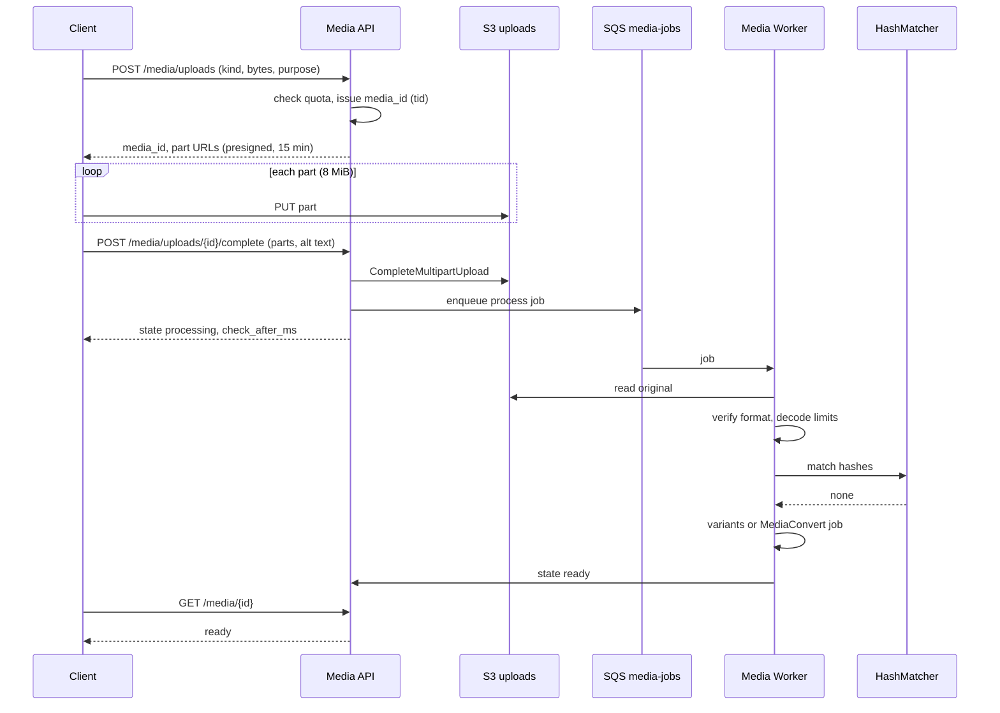
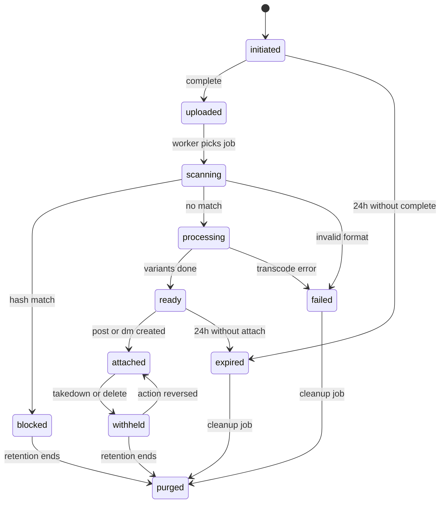
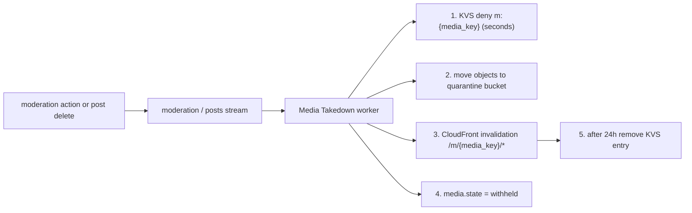

# Media: X

投稿・DM・プロフィールの画像と動画。分割のアップロード、検査、画像の変換、動画の変換（HLS）、代替のテキスト、センシティブの印、配信のドメインと CDN、鍵アカウントのメディア、措置での配信の停止、有害なメディアのハッシュの照合の入口、保持と削除を決める。

前提となる決定は、メディアの ID は `tid`（[ADR-0002](../decisions/0002-post-ids-and-ordering.md)）、全経路が `visible()` を通り、メディアは公開の CDN で配り、鍵アカウントのメディアは推測できない URL と短い期限の署名で配ること（[ADR-0004](../decisions/0004-single-tenant-and-visibility.md)）、画像は `sharp`、動画は MediaConvert（[ADR-0001](../decisions/0001-platform-and-stack.md)）、措置は記録してから効かせること（[trust-and-safety.md](trust-and-safety.md)）。要件は NFR-013（画像 p95 3 秒、1 分の動画 p95 60 秒、CDN のヒットの率 95%）と NFR-009（措置から 60 秒で配信を止める）。法務の確認待ちは L3（DM のメディアの照合）、L5（センシティブなメディアと未成年）、L6（著作権の申出）、L7（照合の一致の届け出）、L8（保持）。この文書で決めたことは次の ADR にある。

| ADR | 決定 |
| --- | --- |
| [0032](../decisions/0032-media-upload-and-processing.md) | クライアントは S3 の署名付きの URL へ分割で直接上げ、サーバーは本体を通さない。上げ終わったら検査（形式、大きさ、ハッシュの照合）を通るまで `ready` にしない。画像は `sharp` で位置の情報（EXIF）を消して 4 つの大きさの JPEG と WebP に、GIF は繰り返しの MP4 に、動画は MediaConvert で HLS（6 秒の区切り、240p〜1080p の 5 段）にする |
| [0033](../decisions/0033-media-delivery-and-takedown.md) | 公開のメディアは `<brand>media.<domain>` の CloudFront で、推測できない 128 ビットのキーの URL で配り、1 年キャッシュする。鍵アカウントと DM のメディアは別の道で署名付きの URL（15 分）。措置・削除のときは CloudFront KeyValueStore の拒否の一覧に入れ（数秒で効く）、元のオブジェクトを隔離の置き場へ移し、CDN を無効にする |
| [0034](../decisions/0034-media-hash-matching.md) | 既知の違法なメディアの照合は、提供者を差し替えられる口（`HashMatcher`）の後ろに置き、公開の投稿のメディアは照合の結果が出るまで公開しない（閉じる側に倒す）。自前で措置したメディアの知覚ハッシュ（PDQ）の一覧も持ち、再投稿を止める。提供者は未定。DM のメディアの照合は L3 の確認まで作らない |

## 1. 範囲

- 扱う：アップロードの流れと状態、検査、画像と GIF と動画の変換、代替のテキスト、センシティブの印（作者・モデレーター・分類）、配信の URL とキャッシュ、鍵アカウントと DM のメディアの配り方、措置・削除・鍵の切り替えでの配信の停止、ハッシュの照合の口と流れ、保持と物理の削除、メディアの数の上限。
- 扱わない：
  - 投稿へのメディアの添付の検証（4 枚まで等の規則の適用は [posts-and-ids.md](posts-and-ids.md)。この文書は上限の値を定める）。
  - 措置の判断と待ち行列（[trust-and-safety.md](trust-and-safety.md)）。
  - DM の会話と参加者の判定（[direct-messages.md](direct-messages.md)）。この文書は DM のメディアの配り方だけを持つ。
  - リンクのカードの画像の取得（URL の先の画像）。[posts-and-ids.md](posts-and-ids.md) の短縮 URL と一緒に扱う。
  - CloudFront と WAF の全体の構成（[infrastructure.md](infrastructure.md)、[security.md](security.md)）。

## 2. 事実（確かめたこと）

いずれも 2026-10-04 に確認。

| 項目 | 事実 | この設計 |
| --- | --- | --- |
| 本家の大きさの上限 | 画像 5 MB（JPG、PNG、GIF、WEBP）、GIF 15 MB。動画は既定のアカウントで 20 分・8 GB、有料のアカウントで 125 分・16 GB。DM の動画は既定で 140 秒・512 MB。最短 0.5 秒。投稿には画像 4 枚、GIF 1 つ、動画 1 つのどれか（[Media upload](https://docs.x.com/x-api/media/introduction)、公式） | 添付の組み合わせは同じ。S1 の動画は 10 分・2 GB に絞る（費用。12 節） |
| 本家のアップロードの形 | 画像・GIF・動画の分割のアップロードを勧める（INIT・APPEND・FINALIZE）（同上） | 形は寄せるが、本体はクライアントから S3 へ直接（ADR-0032） |
| 本家の代替のテキスト | 1,000 文字まで付けられるとされる | 公式の文書で確かめておらず**未検証**。この設計は 1,000 文字（7.1 節） |
| CloudFront KeyValueStore | CloudFront Functions から読める、エッジの低遅延のキーと値の保存。1 つの保存は 5 MB まで、キー 512 バイト、値 1 KB まで。更新は数秒ですべてのエッジに広がる（[KeyValueStore](https://docs.aws.amazon.com/AmazonCloudFront/latest/DeveloperGuide/kvs-with-functions.html)、[AWS のブログ](https://aws.amazon.com/blogs/aws/introducing-amazon-cloudfront-keyvaluestore-a-low-latency-datastore-for-cloudfront-functions/)） | 措置の拒否の一覧に使う（8.4 節） |
| CloudFront の無効化 | 無効化と、版つきのファイル名の 2 つの方法がある。無効化しても、利用者の端末や途中のキャッシュには古いものが残りうる（[Invalidate files](https://docs.aws.amazon.com/AmazonCloudFront/latest/DeveloperGuide/Invalidation.html)） | 無効化だけに頼らない。完了までの時間は文書に書かれておらず**未検証**（`media-delivery-and-takedown` で測る） |

## 3. 要件

| 要件 | 値 | 出どころ |
| --- | --- | --- |
| 画像の処理 | アップロードの完了から投稿に使えるまで p95 3 秒（照合を含む） | NFR-013 |
| 動画の処理 | 1 分の動画の変換 p95 60 秒 | NFR-013 |
| CDN | 配信のヒットの率 95% 以上 | NFR-013 |
| 配信の停止 | 削除・措置から、CDN の配信が止まるまで p99 60 秒 | NFR-009 |
| 鍵アカウント | 承認のない人とログインしていない人に、メディアの URL を渡さない。渡った URL は 15 分で切れる | NFR-009、[intent.md](../intent.md) の「守るべき振る舞い」 |
| 位置の情報 | 配る画像に、撮影の位置（EXIF の GPS）を残さない | 個人データの保護 |
| 投稿の書き込み | 投稿の API はメディアの変換を待たない（`ready` のメディアだけを受け付ける） | NFR-001 |

## 4. アップロード

### 4.1 流れ



- `purpose` は `post`・`dm`・`avatar`・`banner`。上限と配り方が変わる。
- 本体はクライアントから S3 の `uploads` の置き場へ直接上げる。App API のタスクは本体を通さない（[ADR-0032](../decisions/0032-media-upload-and-processing.md)）。
- 分割は 8 MiB。画像（15 MB まで）は 2 つまで。署名付きの URL の期限は 15 分で、期限が切れたら `POST /media/uploads/{id}/parts` で取り直す。
- 完了の要求に、部分の ETag と、全体の SHA-256 を付ける。サーバーは S3 の完了の後に大きさを確かめる。
- 状態の問い合わせは、クライアントが `check_after_ms`（画像 500ms、動画 5 秒）ごとに行う。動画の完了は通知（[notifications.md](notifications.md) の「アプリの中の一覧」ではなく、アプリの中の状態の更新）でも知らせる。

### 4.2 状態



- `media.state` が正本。状態を変えるたびに `state_version` を上げる（投稿と同じ規則。[ADR-0009](../decisions/0009-post-state-tombstones-and-state-cache.md)）。
- `ready` にならないメディアは、投稿にも DM にも付けられない。投稿の API は `ready` で、同じ作者のメディアだけを受け付ける。
- `blocked` は照合の一致。投稿者には「このメディアは投稿できません」とだけ返し、一致の種類を示さない（11 節）。
- `withheld` は配信の停止。投稿の削除・措置（`moderation`）、作者の凍結で入る。取り消しで `attached` に戻る。
- 1 つのメディアは 1 つの投稿か DM にだけ付く。同じ画像を別の投稿に使うときは、もう一度上げる（参照の数え上げを持たないため、削除と措置が単純になる）。

### 4.3 検査

| 検査 | 規則 |
| --- | --- |
| 形式 | 先頭のバイト（magic number）で確かめる。拡張子と申告の MIME を信じない。画像は JPEG・PNG・GIF・WebP・HEIC、動画は MP4・MOV（H.264・HEVC）|
| 大きさ | 申告の大きさと実際の大きさが合わなければ `failed` |
| 画像の展開の上限 | 一辺 8,192 ピクセル、全体 4,000 万ピクセルまで（展開の爆弾を防ぐ）。`sharp` の `limitInputPixels` で止める |
| 動画 | 長さ 0.5 秒〜上限、解像度 4K まで、フレームの率 60 まで。音声だけ・映像のない MP4 は拒む |
| ハッシュの照合 | 11 節。公開の投稿・プロフィールのメディアは一致しないことを確かめてから `processing` に進む |

## 5. 画像

- Media Worker（ECS、`sharp`）が SQS の仕事で処理する。
- 処理：
  1. 向き（EXIF の Orientation）を当ててから、**EXIF・XMP・IPTC を全部消す**。色のプロファイルは sRGB に変換してから消す。
  2. 大きさごとの版を作る。

| 版 | 長い辺 | 用途 |
| --- | --- | --- |
| `orig` | 4,096 まで（元が小さければ元の大きさ） | 拡大の表示、保存 |
| `large` | 2,048 | タブレット・Web の大きな表示 |
| `medium` | 1,200 | タイムライン |
| `small` | 680 | 一覧・低速の回線 |
| `thumb` | 150 の正方形（中央の切り抜き） | DM の一覧、プロフィールの小さな表示 |

  3. 形式は JPEG（品質 82、プログレッシブ）と WebP（品質 80）。透過のある画像は PNG と WebP。AVIF は S2 で検討する。
  4. ぼかしの下絵（BlurHash、4×3）と、主な色を作り、メディアの行に持つ。
  5. 知覚ハッシュ（PDQ）と SHA-256 を記録する（11 節）。
- GIF：繰り返しの MP4（H.264、音声なし、元の大きさ、長い辺 1,280 まで）と、最初のフレームの JPEG にする。配るのは MP4。
- アイコンとヘッダー：アイコンは 400 の正方形と 48・96・200 の版、ヘッダーは 1,500×500。
- 時間の予算（p95 3 秒）：完了の要求 → 仕事の受け取り 300ms、照合 800ms、変換 1.5 秒、状態の書き込み 100ms、余裕 300ms。

## 6. 動画

- Media Worker が MediaConvert の仕事を作る。完了・失敗は EventBridge の出来事で受け、メディアの状態を変える。
- 出力は HLS（fMP4 の区切り、6 秒、キーフレームの間隔 2 秒）。段は元の解像度を超えない範囲で次から作る。

| 段 | 解像度 | 映像（QVBR の上限） | 音声 |
| --- | --- | --- | --- |
| 1080p | 1920×1080 | 5 Mbps | AAC 128 kbps |
| 720p | 1280×720 | 2.5 Mbps | AAC 128 kbps |
| 480p | 854×480 | 1.0 Mbps | AAC 96 kbps |
| 360p | 640×360 | 0.6 Mbps | AAC 64 kbps |
| 240p | 426×240 | 0.3 Mbps | AAC 64 kbps |

- あわせて、720p の MP4（1 本のファイル）を作る。公開 API と埋め込み、HLS を再生できない相手向け。
- 表紙の画像（最初の 1 秒の後のフレーム）と、ハッシュの照合のためのフレーム（2 秒ごと、最大 300 枚）を書き出す。
- 時間の目標（1 分の動画 p95 60 秒）を守れるかは、MediaConvert の速い変換の設定と同時の仕事の数に依る。**未検証**。`video-transcode` の Story で 1 分の動画 100 本の分布を測り、足りなければ「360p を先に出して `ready` にし、他の段を後で足す」に切り替える。
- 字幕（WebVTT）の添付は MVP の後。

## 7. 代替のテキストとセンシティブの印

### 7.1 代替のテキスト

- 1 つのメディアに 1,000 文字まで（重みのない文字数。`packages/text` の書記素で数える）。
- 作者はいつでも直せる（投稿の後も）。直したら `media.alt_text` を書き換え、検索の索引に反映する（[search-and-trends.md](search-and-trends.md) の 5.2 節）。
- 画面は、代替のテキストのない画像に「説明なし」の印を出さない（作者を責める見せ方を避ける）。投稿の画面では、付けるよう促す。
- 自動の説明の生成は MVP の後。

### 7.2 センシティブの印

| 源 | 付け方 | 記録 |
| --- | --- | --- |
| 作者 | 投稿の時に `nudity`・`violence`・`other` を選ぶ | `media.sensitive_labels` |
| アカウントの設定 | 「自分のメディアにいつも印を付ける」 | 作者の設定 |
| モデレーター | 措置（`label`）として付ける | `moderation_actions`（[trust-and-safety.md](trust-and-safety.md)） |
| 分類 | 公開の投稿の画像に、内容の分類（Amazon Rekognition の内容のモデレーションを第一の候補）をかけ、確からしさ 0.9 以上で印の候補を作る | 規則による措置として `moderation_actions` に書く（判断した主体は規則） |

- 印のあるメディアは、`visible()` が閲覧者の設定と年齢の区分で `interstitial` か `hide` を返す（[ADR-0004](../decisions/0004-single-tenant-and-visibility.md)）。未成年への扱いと、年齢の確かめ方は L5 の確認待ち。確認までは、年齢の区分が不明な人には `interstitial` にする。
- 分類のサービスに画像を送ることは、外国にある第三者への提供（L4）に当たりうる。東京のリージョンの AWS のサービスで処理するので、当たらない見込みだが、L4 の確認に含める。
- DM のメディアには分類をかけない（L3）。

## 8. 配信

### 8.1 URL の形

| 種類 | URL | キャッシュ |
| --- | --- | --- |
| 公開のメディア | `https://<brand>media.<domain>/m/{media_key}/{variant}.{ext}` | `Cache-Control: public, max-age=31536000, immutable` |
| 鍵アカウント・DM のメディア | `https://<brand>media.<domain>/p/{media_key}/{variant}.{ext}?Expires=…&Signature=…&Key-Pair-Id=…` | `private, max-age=900` |
| HLS | `…/m/{media_key}/hls/master.m3u8`（区切りも同じ前置き） | 公開と同じ |

- `media_key` は 128 ビットの乱数（base32 で 26 文字）。`media_id`（`tid`）と別にする。`tid` は時刻と連番から推測できるため。
- 公開のメディアの URL は推測できないが、渡れば誰でも読める。見える範囲の判定は、URL を応答に入れる時（`visible()`）で行う。
- `/p/` の道は CloudFront の署名付きの URL（期限 15 分、[security.md](security.md) の鍵で署名）でだけ読める。App API が `visible()` で `show` と判定した閲覧者にだけ発行する。
- 元の置き場（S3）は CloudFront の OAC からだけ読める。利用者が S3 を直接読む道はない。

### 8.2 キャッシュとヒットの率

- 公開のメディアは版ごとに URL が変わらないので、1 年キャッシュする。ヒットの率 95%（NFR-013）は、Origin Shield（東京）を置き、版の数を 8.1 節の固定の組に限ることで狙う。
- HLS の区切りは同じ前置きで、プレイリストは 1 年（変換の後は変わらないため）。

### 8.3 鍵の切り替え

- 作者が公開から鍵アカウントに切り替えたら、作者のメディアのキーを `/m/` から `/p/` へ移す仕事を作る。仕事の間は、作者の `media_key` の一覧を KeyValueStore の拒否の一覧に入れ（8.4 節）、`/m/` の道を止める。移し終えたら拒否を外す。
- 作者のメディアが多く、拒否の一覧の容量（5 MB）を超えるときは、`media_key` の前に作者ごとの前置き（`/m/{author_key}/{media_key}`）を持たせる案に替える。S1 は `media_key` ごとの拒否で始め、容量を監視する（14 節の持ち越し）。
- 鍵アカウントから公開に戻したら、逆に `/p/` から `/m/` へ移す。

### 8.4 措置・削除での配信の停止



1. **拒否の一覧**：CloudFront KeyValueStore に `m:{media_key}` を書く。ビューアーの要求の CloudFront Function が、前置きの `media_key` を取り出して一覧を引き、あれば `451`（法令の措置）か `404`（削除・規約の措置）を返す。更新は数秒で全エッジに広がる（2 節）。
2. **元の隔離**：`uploads`・`public` の置き場から、隔離の置き場（`quarantine`、別の KMS の鍵、T&S と法務のロールだけが読める）へオブジェクトを移す。異議の申立てで戻せるようにし、保全（L2）の対象にもする。
3. **無効化**：`/m/{media_key}/*` を無効にする。
4. **状態**：`media.state = withheld`。
5. 無効化の完了から 24 時間たったら、拒否の一覧から外す（元がないので、キャッシュが切れた後は 404 になる）。

- 1 と 4 は、出来事の受け取りから 5 秒以内。60 秒の目標（NFR-009）は、1 で守る。2・3 が遅れても、1 が効いている。
- 地域での非表示（法令の措置が日本の中だけなど）は、拒否の値に地域の一覧を書き、CloudFront Function が閲覧者の国の見出しと比べる。国の見出しを CloudFront Function で読めることは `media-delivery-and-takedown` で確かめる（**未検証**）。
- 利用者の端末に残ったキャッシュは消せない（2 節）。アプリは、投稿の取得で `withheld` を受けたら、端末のキャッシュから消す。
- 措置の取り消しは逆の順で戻す（隔離から戻し、拒否を外す）。無効化は要らない。

## 9. 有害なメディアの照合

詳細は [ADR-0034](../decisions/0034-media-hash-matching.md)。T&S の扱いは [trust-and-safety.md](trust-and-safety.md) の 9 節。

### 9.1 口

```ts
interface HashMatcher {
  match(input: { sha256: string; pdq?: string; frames?: string[] }): Promise<MatchResult>;
}
type MatchResult =
  | { kind: "none" }
  | { kind: "known_illegal"; list: string; matchId: string }
  | { kind: "known_policy"; list: string; matchId: string };
```

- 実装は 2 つを順に呼ぶ：外部の提供者（既知の違法なメディア、提供者は未定）と、自前の一覧（措置したメディアの PDQ）。
- 外部の提供者の候補：Microsoft の PhotoDNA、Thorn の Safer など。日本での提供の条件と、送る値（ハッシュだけか、画像そのものか）は**未検証**。送る値が画像そのものなら、外国にある第三者への提供（L4）に当たりうる。
- 自前の一覧：措置で `remove` にしたメディアの PDQ（256 ビット）を `media_hash_blocklist` に持つ。ハミング距離 31 以下で一致とする（初期値。誤一致の率を `media-hash-matching` で測って決める）。

### 9.2 流れ

- 公開の投稿・アイコン・ヘッダーのメディアは、照合が `none` を返すまで `processing` に進まない。照合が 5 秒で返らなければ 3 回まで再試行し、それでも返らなければ `scanning` のまま待つ（閉じる側に倒す）。利用者には「処理中」と出す。待ちが 10 分を超えたら `failed` にして、もう一度上げるよう促す。
- `known_illegal`：`blocked` にし、元を隔離し、T&S の最優先（P0）の案件を作る。アカウントの措置と、外部への届け出は T&S の手順（L7 の確認待ち）。
- `known_policy`：`blocked` にし、T&S の案件（P2）を作る。
- 提供者の障害の間、アップロードの処理は止まる。止まった件数と時間を計測し、障害の手順（`media-hash-provider-outage.md`、作る Story は `media-hash-matching`）を持つ。
- **DM のメディアは照合しない。** DM の中身の機械の解析に当たりうるため、L3 の確認まで作らない（[direct-messages.md](direct-messages.md) の 10 節）。
- 試験は、提供者の試験用のハッシュと合成の画像で行う。本物の有害なメディアを使わない（[AGENTS.md](../../AGENTS.md)）。

## 10. 保持と削除

| 対象 | 扱い |
| --- | --- |
| 付けられなかったメディア（`expired`） | 24 時間で消す |
| `failed` | 24 時間で消す |
| 投稿の削除で `withheld` | 隔離の置き場に移し、保持の期間（L8）の後に物理の削除。保持の期間の値は法務の確認の後 |
| 措置で `withheld` | 同上。異議の申立ての期限（[trust-and-safety.md](trust-and-safety.md) の 7 節）が過ぎるまで必ず残す |
| `blocked`（照合の一致） | 隔離。保持と届け出は L7 の確認待ち |
| 保全（開示の請求、L2） | `legal_holds` にある利用者・投稿のメディアは、保持の期間を過ぎても消さない |
| アカウントの削除 | 猶予（[accounts-and-auth.md](accounts-and-auth.md)）の後に、上の「投稿の削除」と同じ扱い |

- 物理の削除は保持のジョブだけが行う（[AGENTS.md](../../AGENTS.md)）。ジョブは削除の前に `legal_holds` を確かめる。

## 11. 失敗のしかた

| 事象 | 影響 | 扱い |
| --- | --- | --- |
| クライアントの回線が切れる | 部分が欠ける | 署名付きの URL を取り直して続きから上げる。24 時間で `expired` |
| Media Worker の停止・遅れ | 処理が遅れる | SQS に溜まる。最古の仕事の年齢でアラート（NFR-013 の p95 の 3 倍を 30 分） |
| MediaConvert の失敗 | 動画が `failed` | 1 回だけ自動で再試行。続けて失敗したら利用者に知らせる |
| 照合の提供者の障害 | 公開のメディアの処理が止まる | 閉じる側に倒す（9.2 節）。障害の手順に従う |
| 照合の誤一致 | 正当な画像が投稿できない | 投稿者は T&S の窓口から問い合わせられる。誤一致は自前の一覧の閾値の見直しに使う |
| KeyValueStore の更新の失敗 | 措置の配信の停止が遅れる | 再試行。60 秒で効かなければ無効化を先に出し、`takedown-propagation.md` の手順（[runbooks/README.md](../runbooks/README.md) の 4 節） |
| KeyValueStore の容量の逼迫 | 拒否を書けない | 80% でアラート。24 時間より古い項目を先に外す（無効化が済んでいるもの） |
| 元の置き場の誤削除 | メディアを失う | S3 の版の管理（30 日）で戻す |

## 12. 上限

| 対象 | S1 の値 | 備考 |
| --- | --- | --- |
| 画像 | 入力 15 MB、一辺 8,192、4,000 万ピクセル | 変換の後は 4,096 まで |
| GIF | 15 MB | 本家と同じ |
| 動画（投稿） | 10 分、2 GB | 本家より小さい（費用）。S2 で見直す |
| 動画（DM） | 140 秒、512 MB | 本家と同じ |
| 1 投稿 | 画像 4 枚、GIF 1、動画 1 のどれか | 本家と同じ |
| 1 DM | 画像 1、GIF 1、動画 1 のどれか | 自前 |
| 代替のテキスト | 1,000 文字 | — |
| アップロードの同時の数 | 1 人 5 | 自前 |
| アップロードの量 | 1 人 1 日 200 件・10 GB | 値は [api-and-rate-limits.md](api-and-rate-limits.md) と合わせる |
| 分割 | 8 MiB、署名の期限 15 分 | — |
| 署名付きの配信の URL | 15 分 | — |

## 13. data-model への項目

| 置き場所 | 中身 | 節 |
| --- | --- | --- |
| Aurora `media`（`media_id`（`tid`）、`owner_id`、`purpose`、`kind`（`image`・`gif`・`video`）、`state`、`state_version`、`media_key`、`access`（`public`・`private`）、`bytes`、`width`、`height`、`duration_ms`、`sha256`、`pdq`、`blurhash`、`alt_text`、`sensitive_labels`、`attached_to_kind`（`post`・`dm`・`profile`）、`attached_to_id`、`created_at`、`ready_at`、`withheld_at`）。主キー `media_id`、一意 `media_key`、索引 `(owner_id, created_at)`・`(state, created_at)` | メディアの正本 | 4.2 |
| Aurora `media_upload_sessions`（`media_id`、`s3_upload_id`、`parts_expected`、`expires_at`） | 分割のアップロード | 4.1 |
| Aurora `media_variants`（`media_id`、`variant`、`format`、`s3_key`、`bytes`、`width`、`height`） | 版 | 5、6 |
| Aurora `media_hash_blocklist`（`pdq`、`source_media_id`、`moderation_action_id`、`created_at`） | 自前の一覧 | 9.1 |
| Aurora `media_match_results`（`id`（UUIDv7）、`media_id`、`provider`、`kind`、`match_ref`、`checked_at`）。T&S のロールだけが読める | 照合の結果 | 9.2 |
| Aurora `media_takedowns`（`media_id`、`moderation_action_id`、`kvs_written_at`、`quarantined_at`、`invalidation_id`、`invalidated_at`、`kvs_removed_at`） | 配信の停止の進み | 8.4 |
| S3 `uploads`（元。版の管理 30 日）、`public`（変換の後）、`private`（鍵・DM）、`quarantine`（隔離。別の KMS の鍵） | 置き場 | 8、10 |
| CloudFront KeyValueStore `media-deny`（`m:{media_key}` → `{"kind":"removed"|"legal","regions":[…]}`） | 拒否の一覧 | 8.4 |
| `legal_holds`（[trust-and-safety.md](trust-and-safety.md) の表）を、保持のジョブが読む | 保全 | 10 |

## 14. テストと性質

| ID | 性質・試験 |
| --- | --- |
| PROP-MEDIA-001 | 任意のアップロードと状態の変化の列で、`ready` でないメディアは投稿・DM に付かない。照合が `none` でない公開のメディアは `ready` にならない |
| PROP-MEDIA-002 | 任意の画像（EXIF・XMP の GPS を含む合成の画像）について、配る版のすべてに位置の情報が残らない |
| PROP-MEDIA-003 | 任意の措置・取り消しの列で、`withheld` のメディアの `media_key` は、反映の後に拒否の一覧にあるか、元が隔離されている（どちらかが常に成り立つ） |
| PROP-MEDIA-004 | 鍵アカウントと DM のメディアについて、App API の応答に `/m/` の URL が現れない |
| 結合 | 漏れの経路の表の「メディアの配信」の行：措置から 60 秒で CDN が 404・451 を返す（合成監視と同じシナリオ。[quality.md](../quality.md) の 2.2.1 節） |
| 結合 | 署名付きの URL の期限切れ（15 分）で読めない |
| 結合 | 展開の爆弾（一辺の大きい PNG）、偽の拡張子、壊れた MP4 を `failed` にする |
| 計測 | 画像 p95 3 秒、1 分の動画 p95 60 秒、CDN のヒットの率（NFR-013） |
| 試験 | 照合は提供者の試験用のハッシュと合成の画像だけで行う |

## 15. Story の候補

| Epic | Story | 中身 |
| --- | --- | --- |
| E7 | `media-upload` | 分割のアップロード、署名付きの URL、状態、`tid`（4 節） |
| E7 | `image-processing` | 検査、EXIF の除去、版、BlurHash、PDQ、代替のテキスト（4.3・5・7.1 節） |
| E7 | `video-transcode` | MediaConvert、HLS、MP4、表紙、照合のフレーム、時間の計測（6 節） |
| E7 | `media-delivery-and-takedown` | 配信のドメイン、`/m/` と `/p/`、KeyValueStore、隔離、無効化、鍵の切り替え（8 節） |
| E7 | `sensitive-media` | 印、分類、`visible()` との連携。法務：L5 |
| E11 | `media-hash-matching` | `HashMatcher`、提供者の選定、自前の一覧、障害の手順（9 節）。届け出は法務：L7 |
| E14 | `data-lifecycle` | 保持のジョブ（10 節）。法務：L8 |

## 16. 未解決の問い

### 決定（2026-10-04、既定案）

- **アップロード**：S3 への直接の分割のアップロード。サーバーは本体を通さない（ADR-0032）。
- **画像の形式**：JPEG と WebP の 5 つの大きさ。AVIF は S2（5 節）。
- **動画**：HLS の 5 段と 720p の MP4（6 節）。
- **配信と停止**：推測できないキー、`/p/` の署名、KeyValueStore の拒否の一覧（ADR-0033）。
- **照合**：口の後ろに置き、公開のメディアは閉じる側に倒す。自前の PDQ の一覧（ADR-0034）。
- **S1 の動画の上限**：10 分・2 GB。
- **1 つのメディアは 1 つの投稿か DM にだけ付く。**

### 持ち越し

| 問い | いつ・どう決めるか |
| --- | --- |
| ハッシュの照合の提供者、送る値、外国にある第三者への提供（L4） | E11 の `media-hash-matching`。法務の確認と合わせる |
| 照合の一致の届け出の先と手順（L7） | 法務の確認待ち |
| DM のメディアの照合（L3） | 法務の確認待ち。確認まで作らない |
| センシティブなメディアと未成年（L5） | 法務の確認待ち。E7 の `sensitive-media` の spec の承認の前 |
| 著作権の申出と送信防止の措置（L6） | 法務の確認待ち。[trust-and-safety.md](trust-and-safety.md) の 10.4 節 |
| 保持の期間（L8） | 法務の確認待ち |
| 1 分の動画 p95 60 秒を MediaConvert で守れるか | `video-transcode` で測る |
| CloudFront の無効化の完了までの時間、CloudFront Function での国の見出し | `media-delivery-and-takedown` で測る |
| 鍵の切り替えで KeyValueStore の容量が足りるか（作者ごとの前置きに替えるか） | S1 の運用で容量を監視して決める |
