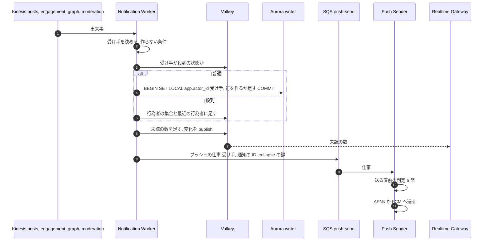
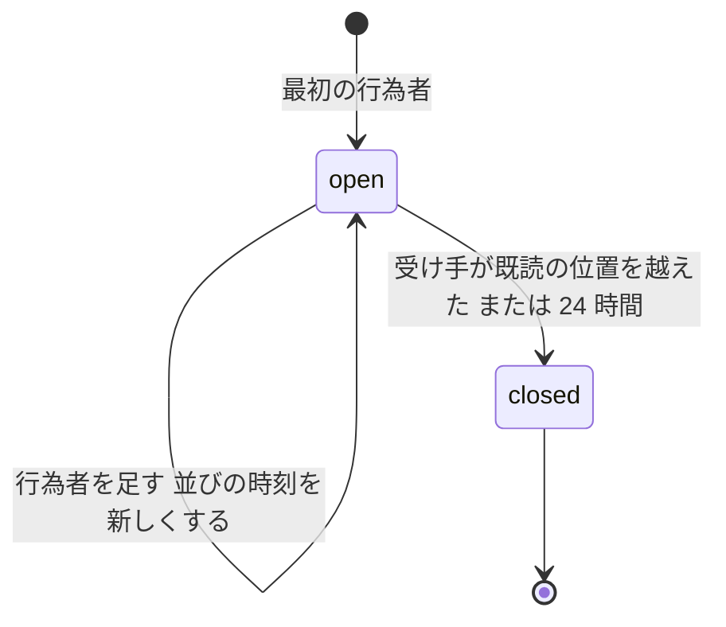

# Notifications: X

通知。通知の種類、出来事から通知の行を作る規則、まとめ（「他 99 人がいいね」）、大きなアカウントへの殺到、既読と未読の数、設定、プッシュ（APNs・FCM）とメール、見える範囲の再確認を決める。DM の通知は [direct-messages.md](direct-messages.md)、アカウントの安全に関わるメール（ログインの通知など）は [accounts-and-auth.md](accounts-and-auth.md) が持つ。

前提となる決定は、本人だけの表の FORCE RLS と `visible()`（[ADR-0004](../decisions/0004-single-tenant-and-visibility.md)）、outbox と Kinesis と SQS（[ADR-0005](../decisions/0005-event-log-and-outbox.md)）、投稿の出来事とメンション（[ADR-0008](../decisions/0008-post-write-path-and-idempotency.md)）、閲覧者の集合（[ADR-0012](../decisions/0012-viewer-sets-cache.md)）、いいね・リポストの出来事（[ADR-0022](../decisions/0022-engagement-relations-and-writes.md)）。この文書で決めたことは次の ADR にある。

| ADR | 決定 |
| --- | --- |
| [0029](../decisions/0029-notification-rows-and-grouping.md) | 通知の行は受け手の本人だけの表に書く。いいね・リポスト・フォローは対象ごとに 1 行にまとめ、開いている間（未読で 24 時間以内）は行為者を足す。殺到を受けている受け手は、行為者の集合を Valkey で数えて 60 秒ごとに書き戻す |
| [0030](../decisions/0030-push-and-email-delivery.md) | プッシュは送る直前に見える範囲・設定・送る量の上限を確かめる。本文を載せない形を既定にし、端末が API で中身を取る。まとめの通知は collapse の鍵で上書きする。メールは日ごとの要約だけ |
| [0031](../decisions/0031-read-state-and-visibility-rechecks.md) | 既読は受け手ごとの 1 本の位置で持ち、未読の数は Valkey の写しで数えて Realtime Gateway で届ける。見える範囲は、作る時・送る時・読む時の 3 回判定する |

## 1. 目的と範囲

- 扱う：
  - 通知の種類と受け手の決め方、作らない条件
  - 通知の行の形、まとめ、冪等性、殺到への備え
  - 既読、未読の数、一覧の読み出し
  - 設定（種類ごと、品質のフィルター、静かな時間）
  - プッシュ（端末の登録、送る判断、APNs・FCM、collapse、失効したトークン）
  - メールの要約
  - 見える範囲の再確認
- 扱わない：
  - DM の通知（[direct-messages.md](direct-messages.md)）
  - ログイン・パスワード・アカウントの安全のメール（[accounts-and-auth.md](accounts-and-auth.md)）
  - 措置の通知の文面と根拠の示し方（[trust-and-safety.md](trust-and-safety.md)。この文書は、措置の通知を一覧とプッシュに載せる経路だけを書く）
  - WebSocket の接続と配信（Realtime Gateway。[direct-messages.md](direct-messages.md) と [infrastructure.md](infrastructure.md)）
  - アプリの通知の画面（[clients.md](clients.md)）

## 2. 本家の形（確かめたこと）

| 項目 | 本家 | 出典 |
| --- | --- | --- |
| 通知のまとめ | 同じ投稿へのいいねなどを「○○さんと他 N 人」でまとめる | **未検証**（ヘルプセンターに到達できない） |
| 品質のフィルター | 質の低い通知を除く設定がある | **未検証** |
| 認証のない相手からの通知を絞る設定 | ある | **未検証** |

この設計のまとめの規則と既定の設定は自前で決める。

## 3. 要件（NFR との対応）

| 項目 | 目標 | NFR |
| --- | --- | --- |
| 出来事から通知の行まで | p95 5 秒 | NFR-008 |
| 出来事からプッシュの送信まで | p95 10 秒（静かな時間・まとめの待ちを除く） | NFR-008 |
| 通知の一覧の読み出し | p99 300ms（最初の 20 件） | NFR-003 に準じる |
| 可用性 | 月間 99.9% | NFR-004 |
| ブロック・措置の後のプッシュ | 0 件（送る直前に判定） | NFR-009 |
| 削除・措置の投稿の通知 | 一覧から 60 秒以内に消える（読み出しの判定） | NFR-009 |
| 本人だけのデータ | 通知・設定・端末は FORCE RLS | [ADR-0004](../decisions/0004-single-tenant-and-visibility.md) |

## 4. 種類と受け手

### 4.1 種類

| 種類 | 元の出来事（流れ） | 受け手 | まとめ |
| --- | --- | --- | --- |
| `reply` | `post.created`（`posts`、`kind = reply`） | 返信先の作者（`in_reply_to_user_id`） | しない |
| `mention` | `post.created` のメンション | `post_mentions` の利用者（最大 50） | しない |
| `quote` | `post.created`（引用） | 引用された投稿の作者 | しない |
| `like` | `like.created`（`engagement`） | 投稿の作者 | 投稿ごと |
| `repost` | `repost.created`（`engagement`） | 元の投稿の作者 | 投稿ごと |
| `follow` | `follow.created`（`graph`） | フォローされた人 | 受け手ごと |
| `follow_request` | `follow.requested` | 申請された人 | 受け手ごと |
| `follow_accepted` | `follow.approved` | 申請した人 | しない |
| `account_notice` | 措置・異議の結果（`moderation`） | 措置を受けた人・通報した人 | しない |

- 返信とメンションが重なる（返信先の作者が本文でもメンションされている）ときは `reply` だけを作る。
- 引用のリポスト（引用した人が自分でリポスト）は、`quote` と `repost` の両方を作る。

### 4.2 作らない条件（作る時の判定）

spec の `DT-NOTIF-001` の元。上から順に判定し、当たったら作らない。

| # | 条件 | 理由 |
| --- | --- | --- |
| 1 | 行為者 = 受け手 | 自分の行為 |
| 2 | 行為者と受け手の間にブロック（どちらの向きでも） | [follow-graph.md](follow-graph.md) |
| 3 | 受け手が行為者をミュートしている | ミュートの面 `notifications` |
| 4 | 元の投稿が受け手に見えない（`visible()` が `hide`、`surface = notifications`）。ミュートの語を含む | 鍵アカウントの承認のない人へのメンションなど |
| 5 | 受け手の設定で、その種類が切られている | 5.4 節 |
| 6 | 受け手の品質のフィルター・相手の絞り込みに当たる | 5.4 節 |
| 7 | 受け手のアカウントが凍結・削除の猶予中 | |

- `account_notice` は 2〜6 を当てない（措置の知らせは必ず届ける）。
- 判定は閲覧者の集合の写し（[ADR-0012](../decisions/0012-viewer-sets-cache.md)）と投稿の状態の写し（[ADR-0009](../decisions/0009-post-state-tombstones-and-state-cache.md)）で行う。

## 5. 流れ

### 5.1 全体

- Worker は流れのシャードごとに 1 つ。1 秒ぶんの出来事を受け手ごとにまとめ、受け手ごとに 1 つのトランザクションで書く（`SET LOCAL app.actor_id` は受け手。[ADR-0004](../decisions/0004-single-tenant-and-visibility.md) の「受け手ごとに `SET LOCAL`」）。
- 元の投稿を知らない出来事（流れの間の順の入れ替え。[ADR-0005](../decisions/0005-event-log-and-outbox.md) の Consequences）は、SQS の遅延つきの再試行（5 秒、3 回）に回し、それでも投稿がなければ捨てる。

### 5.2 まとめ（ADR-0029）

- まとめの鍵：`(owner_id, type, target)`。`target` は `like`・`repost` で投稿の ID、`follow`・`follow_request` で受け手自身。
- `open` の行があれば行為者を足し、`latest_at` を新しくする（一覧の上に上がる）。`closed` の後の行為者は、新しい行を開く。
- 行為者は `notification_actors(owner_id, notification_id, actor_id)` の主キーで重ねない。同じ人のいいね・取り消し・いいねは 1 人に数える。
- 取り消し（`like.deleted`・`follow.deleted`）では行を変えない。表示の時に、ブロック・ミュートした行為者を除く（7 節）。
- 表示：最近の行為者 3 人の名前と「他 N 人」。行に最近の行為者 50 人の ID と数を持つ。

### 5.3 殺到への備え（ADR-0029）

- 受け手が、まとめる種類の出来事を 1 分に 1,000 件を超えて受けたら、その受け手を **殺到の状態** にする（`nh:{owner_id}`、30 分。超え続ける間は延ばす）。フォロワー 10 万人以上の利用者は、最初から殺到の状態として扱う。
- 殺到の状態では：
  - 行為者を Aurora の `notification_actors` に書かない。Valkey の HyperLogLog（`nha:{owner_id}:{notification_id}`）で数え、最近の 50 人をリスト（`nhr:…`）で持つ。
  - 60 秒ごとに、数（HyperLogLog の推定）と最近の 50 人を通知の行に書き戻す。数は概算になる（誤差 1% 前後）。
  - まとめない種類（返信・メンション・引用）は、受け手ごとに 1 分 1,000 件を超えた分を、投稿ごとに 1 行の「他 N 件の返信」に畳む（`reply_digest`）。
- 殺到の状態の出入りは `ops.notifications.hot_*` の値で決める。

### 5.4 設定

| 設定 | 既定 | 持つ場所 |
| --- | --- | --- |
| 種類ごとの一覧・プッシュ・メールの可否 | 一覧は全部、プッシュは全部、メールは要約だけ（下の注） | `notification_settings` |
| 品質のフィルター（T&S のスパムの点が高い相手、重複の多い相手を除く） | オン | 同上 |
| 相手の絞り込み：フォローしていない人・フォローされていない人・新しいアカウント（30 日未満）・電話番号を確かめていない人・プロフィールの画像がない人 | すべてオフ | 同上 |
| 静かな時間（プッシュを送らない時間帯。日本時間） | なし | 同上 |

- メールの要約の既定（オンかオフか）は、法務の L11 の後に決める（14 節の持ち越し）。

## 6. プッシュ（ADR-0030）

### 6.1 端末

- `push_devices(owner_id, device_id, platform, token, app_version, locale, created_at, last_seen_at, disabled_at)`。本人だけの表。端末はログインの時と、アプリの起動のたびにトークンを登録し直す。
- ログアウト・アカウントの削除で、その端末の行を消す。

### 6.2 送る直前の判定

Push Sender は、送る直前に次を確かめる。spec の `DT-NOTIF-002` の元。

| # | 条件 | 結果 |
| --- | --- | --- |
| 1 | 通知の行が隠れた（7 節）か、まとめの行為者が全員除かれた | 送らない |
| 2 | 元の投稿が受け手に見えない（`visible()`、`surface = notifications`） | 送らない |
| 3 | 行為者と受け手の間にブロックがある | 送らない |
| 4 | 受け手のプッシュの設定で、その種類が切られている | 送らない |
| 5 | 静かな時間 | 送らない（一覧には残る） |
| 6 | 受け手が、その通知を既に見た（既読の位置が通知の時刻を越えた） | 送らない |
| 7 | 送る量の上限（6.3 節）を超えた | まとめの鍵の通知なら、最後の 1 件だけを後で送る。それ以外は送らない |
| 8 | 上のどれでもない | 送る |

- 判定に使う状態は、作る時から送る時までに変わりうる（ブロック、削除、措置）。プッシュは外の事業者に渡すと取り消せないので、送る直前に必ず判定し直す（[quality.md](../quality.md) の 2.2.1 節の「通知」の行）。

### 6.3 送る量

| 項目 | 値 | 持つ場所 |
| --- | --- | --- |
| まとめの通知のプッシュ | 同じ行について 10 分に 1 回。後のものは collapse の鍵で前のものを置き換える | `ops.notifications.push_group_interval` |
| 受け手ごとの上限 | 1 時間 30 件（フォローしている人からの返信・メンションと `account_notice` は数えない） | `ops.notifications.push_hourly_cap` |
| 殺到の状態の受け手 | まとめの通知は投稿ごとに 1 時間 1 回 | `ops.notifications.hot_*` |

### 6.4 中身と事業者

- **本文を載せない形を既定にする。** プッシュの中身は、種類、通知の ID、まとめの鍵、端末の表示用の短い一般の文（「新しい返信があります」）だけにする。iOS は通知のサービスの拡張（中身を書き換える仕組み）、Android はデータのメッセージで、端末が API から通知の中身を取り、表示を作る。取れなければ一般の文のまま出す。
- 理由：プッシュの事業者（APNs・FCM）は外国にある第三者で、そこに投稿の本文や相手の名前を渡すことの扱いが法務の確認待ち（L4）。本文を載せる形は `release.push.rich_payload` の後ろに置き、L4 の結論まで有効にしない。
- APNs はトークンの認証の HTTP/2、FCM は HTTP v1 の API で送る。collapse の鍵は APNs の `apns-collapse-id`、FCM の `collapse_key` に入れる。失効したトークンの応答（APNs・FCM それぞれの「登録されていない」の応答）で `push_devices` を無効にする。応答のコードと上限の正確な値は、E8 の `push-delivery` で公式の文書を確かめる（**未検証**）。
- 事業者の一時の失敗（429・5xx）は、指数の待ちで 5 回まで再試行し、送る直前の判定（6.2 節）からやり直す。

## 7. 既読と一覧（ADR-0031）

- **既読**は、受け手ごとの 1 本の位置（`notification_cursors.last_seen_at`）。通知の一覧を開いたとき、クライアントが一覧の先頭の `latest_at` を送り、位置を進める（戻さない）。複数の端末で同じ位置。
- **未読の数**：`latest_at > last_seen_at` の行の数。Valkey の `nu:{owner_id}` に写しを持ち、行を作ったとき・まとめの行が位置の前から後へ上がったときに 1 足し、位置を進めたら 0 にする。写しがなければ Aurora で数え直す（100 件で打ち切り、表示は「99+」）。
- 未読の数の変化は Valkey の pub/sub で Realtime Gateway に送り、接続している端末に届ける。接続していない端末は、プッシュのバッジの数と、アプリの起動の時の取得で知る。
- **一覧の読み出し**：`(latest_at DESC, id DESC)` で 20 件。各行で次を判定する（読む時の判定）。

| 対象 | 判定 | 結果 |
| --- | --- | --- |
| 元の投稿 | `visible()`（`surface = notifications`） | `hide` なら行を出さない |
| まとめの行為者 | ブロック・ミュート・凍結 | その行為者を除く。全員が除かれたら行を出さない |
| 返信・メンション・引用の行為者 | 同上 | 行を出さない |

- 判定で出さなかった行のうち、理由が恒久のもの（削除、`removed`、ブロック）は、`state = hidden` にする（後始末。正しさの条件ではない）。
- 削除された投稿の通知の後始末：`post.deleted` で、その投稿を対象にする未送信のプッシュの仕事を取り消す（Push Sender は 6.2 節の 1・2 でも落とす）。

## 8. メール

- **要約のメール**：未読の通知が 24 時間以上たち、受け手が 72 時間以上アプリを開いていないとき、1 日 1 通まで、未読の上位 10 件の要約を送る。送る直前に 7 節と同じ判定をする。
- 送信は Amazon SES（東京）。送信の記録には、受け手の ID・種類・結果だけを書き、メールアドレス・本文を書かない。
- 一括の配信の停止（ワンクリックの停止のヘッダー）と、本文の中の停止のリンクを付ける。
- 要約のメールが広告・宣伝のメール（特定電子メール法の特定電子メール）に当たるか、同意の取り方と表示の義務は、法務の確認待ち（L11。14 節の持ち越し）。

## 9. 障害と振る舞い

| 障害 | 起きること | 検知 | 回復 |
| --- | --- | --- | --- |
| Notification Worker の遅れ | 通知の行が遅れる | `IteratorAge` | 増設。NFR-008 の外れとして数える |
| Aurora の writer の切り替え | 行を書けない | 書き込みのエラー | Worker は位置を進めずに再試行する（行の作成は冪等。5.2 節） |
| Valkey の障害 | 殺到の状態と未読の数が読めない | 接続のエラー | 殺到の判定を「フォロワー 10 万人以上」だけにして Aurora に書く。未読の数は Aurora で数える |
| APNs・FCM の障害 | プッシュが届かない | 送信の失敗の率 | 再試行の後に捨てる（一覧には残る）。溜めて後から大量に送らない（古い通知で起こさない） |
| SQS `push-send` の溜まり | プッシュが遅れる | 最も古い仕事の年齢 | 30 分より古い仕事は送らずに捨てる |
| 殺到する受け手 | 1 人への書き込みが集中 | 受け手ごとの出来事の率 | 5.3 節の殺到の状態 |

## 10. 上限

| 項目 | 値 | 持つ場所 |
| --- | --- | --- |
| 1 投稿のメンションの通知 | 50 人 | [posts-and-ids.md](posts-and-ids.md) の 4.3 節 |
| まとめの開いている時間 | 24 時間 | `ops.notifications.group_window` |
| 行に持つ最近の行為者 | 50 人 | `ops.notifications.recent_actors` |
| 殺到の状態に入る率 | 1 分 1,000 件 | `ops.notifications.hot_rate` |
| プッシュ | 6.3 節 | |
| 一覧の保持 | 90 日（それより古い行は消す。法務の L8 の後に見直す） | `ops.notifications.retention_days` |
| 端末 | 1 人 20 台 | `ops.notifications.max_devices` |
| 古いプッシュの仕事 | 30 分で捨てる | `ops.notifications.push_max_age` |

## 11. data-model への項目

| 表・store | 列・鍵 | 備考 |
| --- | --- | --- |
| `notifications` | `owner_id`、`id`（UUIDv7）、`type`、`group_key`、`target_post_id`、`source_post_id`、`recent_actor_ids bigint[]`、`actor_count`、`latest_at`、`created_at`、`state`（`active`・`hidden`）、`is_open`、`open_until` | 本人だけの表、FORCE RLS。主キー `(owner_id, id)`。部分の一意の索引 `(owner_id, group_key) WHERE is_open`（開いている行は 1 つ。既読の位置か `open_until` を越えたら Worker が `is_open = false` にする）。一意 `(owner_id, type, source_post_id)`（まとめない種類の冪等）。索引 `(owner_id, latest_at DESC, id DESC)`。日ごとのパーティション、90 日で落とす |
| `notification_actors` | `(owner_id, notification_id, actor_id) PK`、`created_at` | 本人だけの表。殺到の状態では書かない |
| `notification_cursors` | `owner_id PK`、`last_seen_at`、`updated_at` | 本人だけの表 |
| `notification_settings` | `owner_id PK`、種類ごとの可否（`jsonb`）、品質のフィルター、相手の絞り込み、静かな時間、メールの要約 | 本人だけの表 |
| `push_devices` | `(owner_id, device_id) PK`、`platform`、`token`（暗号化）、`app_version`、`locale`、`last_seen_at`、`disabled_at` | 本人だけの表。トークンはログに出さない |
| `push_deliveries` | `id`、`owner_id`、`notification_id`、`device_id`、`result`、`sent_at` | 7 日。本文を持たない。本人だけの表 |
| Valkey `nu:{owner_id}` | 未読の数 | 写し |
| Valkey `nh:`・`nha:`・`nhr:` | 殺到の状態、行為者の HyperLogLog、最近の行為者 | 写し。60 秒ごとに書き戻す |
| SQS `push-send`（と DLQ）、`email-digest` | プッシュとメールの仕事 | |
| DB のロール | Worker は受け手ごとに `SET LOCAL app.actor_id` | [ADR-0004](../decisions/0004-single-tenant-and-visibility.md) |

## 12. テストと性質

### 12.1 性質

- **PROP-NOTIF-001（冪等）**：任意の出来事の重複・再起動・順の入れ替えの列で、まとめない種類の通知は元の投稿ごとに最大 1 行、まとめの行の行為者は重ならず、行為者の数は「受け手に通知を作る条件を満たした、異なる行為者」の数と等しい（殺到の状態でない場合）。
- **PROP-NOTIF-002（送らない）**：任意のブロック・削除・措置・設定の変更の列で、変更の後に送る直前の判定を通ったプッシュは、その時点の正本で 6.2 節の 1〜6 のどれにも当たらない。
- **PROP-NOTIF-003（既読）**：任意の既読の位置の更新（複数の端末、順の入れ替え）の列で、位置は減らず、未読の数は `latest_at > last_seen_at` の見える行の数と、写しの再計算の後に一致する。
- **PROP-NOTIF-004（まとめ）**：任意の出来事の列で、同じまとめの鍵の `open` の行は最大 1 つ。

### 12.2 表駆動・結合・負荷

- `DT-NOTIF-001`（作らない条件）、`DT-NOTIF-002`（送る直前の判定）の全行。
- 漏れの経路の表の「通知」の行：ブロックの直後、措置の直後に、一覧とプッシュの両方に出ない。プッシュの事業者は模擬にし、渡した中身を確かめる（本文を載せない形）。
- 負荷：1 人の受け手への 1 分 10 万件のいいね（殺到の状態）。Aurora の書き込みの量、未読の数の遅れ、プッシュの数を測る。
- 確定から通知の行まで p95 5 秒、プッシュの送信まで p95 10 秒。

## 13. Story の候補

| Epic | Story | 中身 |
| --- | --- | --- |
| E8 | `notification-rows` | 4・5 節、まとめ、冪等、殺到の状態（ADR-0029） |
| E8 | `notification-read-state` | 7 節の既読、未読の数、Gateway への配信（ADR-0031） |
| E8 | `push-delivery` | 6 節。本文を載せる形は法務の L4 の後（ADR-0030） |
| E8 | `email-delivery` | 8 節。要約の既定と同意の取り方は法務の確認の後 |
| E8 | `notification-settings` | 5.4 節の設定、品質のフィルター |

## 14. 未解決の問い

### 決定

2026-10-04 の既定案。E8 の計測で覆りうる。

- いいね・リポスト・フォローを対象ごとにまとめ、開いている時間は 24 時間（ADR-0029）。
- 殺到の状態は 1 分 1,000 件か、フォロワー 10 万人以上。行為者の数は概算（ADR-0029）。
- プッシュは本文を載せない形が既定。送る直前に判定する（ADR-0030）。
- 既読は 1 本の位置（ADR-0031）。
- 通知の行の保持は 90 日（法務の L8 の後に見直す）。

### 持ち越し

| 問い | いつ・どう決めるか |
| --- | --- |
| プッシュの事業者（外国にある第三者）へ渡してよい中身、本人への説明 | 法務の L4。結論まで `release.push.rich_payload` を有効にしない |
| 要約のメールが広告・宣伝のメールに当たるか、同意の取り方と既定 | 法務の L11（統合の工程で [intent.md](../intent.md) に足した）。E8 の `email-delivery` の spec の承認の前 |
| 未成年の利用者へのプッシュ（深夜の時間帯など） | 法務の L5 |
| 通知の行・送信の記録の保持の期間 | 法務の L8 |
| APNs・FCM の応答のコードと上限の値 | E8 の `push-delivery` で公式の文書を確かめる |
| 殺到の状態の閾値（1 分 1,000 件） | E8 の負荷試験 |

## 15. quality.md・runbooks への項目

- quality.md：漏れの経路の表の「通知」の行に、「作る時は見えたが、送る前にブロック・措置」のシナリオを足す。E8 の合否基準に PROP-NOTIF-002 を足す。
- runbooks：`notification-lag.md`（Worker の遅れ、殺到の受け手）、`push-provider-errors.md`（事業者の失敗の率、トークンの失効の急増、証明書・鍵の期限）。
