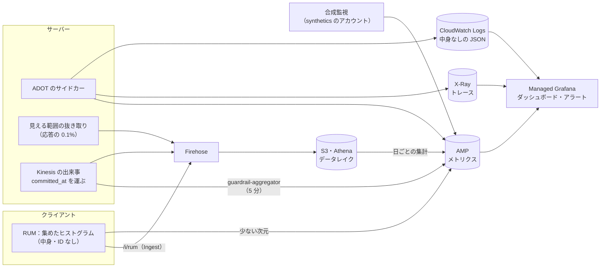
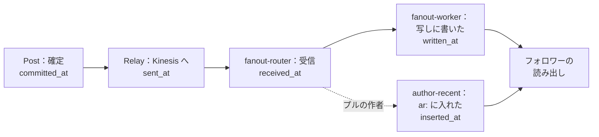

# Observability: X

ログ・メトリクス・トレース、中身を出さない計装、クライアントの RUM、SLI の計測（[runbooks/README.md](../runbooks/README.md) の 1 節の SLO を計る側）、タイムラインの届く速さ（鮮度）の計測、出来事の遅れ、見える範囲の抜き取りの監査、カウンターの照合の指標、ランキングのガードレールの指標、合成監視、ダッシュボードとアラートを決める。道具は他の題材と同じ（OpenTelemetry（ADOT）→ AMP、X-Ray、CloudWatch Logs、Managed Grafana）。

**SLO の値とアラートの一覧の正本は [runbooks/README.md](../runbooks/README.md)** である。この文書は、それを計測・実装する側の記述で、値を書き写すときは runbooks を参照する。

| ADR | 決定 |
| --- | --- |
| [0058](../decisions/0058-timeline-freshness-measurement.md) | タイムラインの届く速さは 3 つの方法で測る。(1) 合成監視の組（正解の値。SLO に使う）、(2) 出来事に確定の時刻 `committed_at` を運び、fan-out の書き込みと `ar:` への挿入の時刻との差を、フォロワーの数で重みを付けて測る（内訳）、(3) 読み出しの抜き取りで、返した最初のページの「入っているべき最新の投稿」が入っているかを確かめる（漏れの検出）。全部のサーバーの時計は Amazon Time Sync に合わせ、差を測る区間を同じ時計の基準にする |
| [0059](../decisions/0059-guardrail-and-audit-metrics.md) | ランキングのガードレールの指標は、出来事の流れから 5 分ごとに実験の群ごとに近似で数え（自動で広げるのを止める判断）、データレイクで日ごとに正しく数える（100% にする判断）。群の割り当ては、おすすめの理由の記録から引く。見える範囲の抜き取りの監査は、応答の 0.1% を記録し、数秒後に正本で `visible()` し直し、その間に状態が変わったものを「説明のつく不一致」として除いて数える |

## 1. 全体の流れ

## 2. 計装

### 2.1 中身を出さない

- ログ・トレース・メトリクス・RUM に、投稿・DM の本文、検索の語、プロフィールの文、電話番号、メールアドレス、IP アドレス、トークンを出さない（[security.md](security.md) の 9 節）。
- 出してよい：利用者・投稿・会話の ID（`tid`。ログとトレースだけ。メトリクスの次元にはしない）、理由のコード、件数、大きさ、時間、版、方式（`push`・`pull`）、モデルの版。
- ログは `packages/log` の型付きの関数で書く。任意の文字列の引数を受けない。
- ALB のアクセスログは問い合わせの部分を落とせないので、`/api/search*` と `/v1/search*` の ALB のアクセスログを無効にし、アプリのログで数える（検索の語を残さない）。エッジのアクセスログ（IP を含む）は log-archive に分ける。
- 常時の走査：CloudWatch Logs の購読で、秘密の形（`<brand>_` の接頭辞、電話・メールの形、E2E のカナリアの文字列）を探し、見つけたら呼び出す。

### 2.2 トレース

- W3C Trace Context。入口で始め、内部のサービスへ運ぶ。outbox の行と Kinesis の出来事、SQS のメッセージの属性に `traceparent` を入れ、消費者と Worker の処理を同じトレースにつなぐ（投稿 → fan-out → 写しへの書き込みが 1 本のトレースになる）。
- クライアントからは `traceparent` を送らない。
- 抜き取り：入口は 1%。エラー、1 秒を超えるもの、合成監視の要求は全部（テールサンプリング）。fan-out は、フォロワーの多い作者（プッシュで 5,000 人以上）の投稿を全部。

### 2.3 メトリクスの次元

- 利用者・投稿・アプリの ID を次元にしない（数が多い）。
- 使う次元：`service`、`route`（パスの型）、`status_class`、`mode`（`push`・`pull`・`rebuild`）、`follower_band`（作者のフォロワーの数の帯：`<100`・`<1k`・`<10k`・`>=10k`）、`tier`（利用者の段）、`stream`、`consumer`、`arm`（実験の群。0059）、`app_version_band`（アプリ）。
- 個別の値が要るもの（特定の作者の fan-out、特定のアプリの量）は、ログの集計（CloudWatch Logs Insights）と、トレースで見る。

## 3. クライアントの RUM

| 系統 | 中身 | 抜き取り |
| --- | --- | --- |
| 読み出し | ホームの最初の描画（手元の写しから・サーバーから）、続きのページ | 全部 |
| スクロール | 落ちたフレームの割合（[clients.md](clients.md) の 5.2 節） | 端末の 10% |
| 投稿 | 送信から確定の表示まで、失敗の理由のコード | 全部 |
| オフライン | 待ち行列の件数、下書きに戻した数 | 全部 |
| アプリ | クラッシュのないセッション、起動の時間 | 全部 |

- 端末は 60 秒ごとにヒストグラムにまとめて、`/i/rum`（Ingest）へ送る。Ingest は Firehose（データレイク）と、少ない次元に絞った AMP へ入れる。
- RUM の送り先の外部の事業者は使わない（外部送信の規律の対象を増やさない。法務の L3）。クラッシュの報告も自前の口で受け、記号の解決（ソースマップ・dSYM）は CI の成果物で行う。

## 4. 届く速さ（鮮度）と出来事の遅れ

ADR-0058。

### 4.1 区間

| メトリクス | 区間 | 次元 |
| --- | --- | --- |
| `outbox.relay_lag` | `committed_at` → `sent_at` | `stream` |
| `stream.consumer_lag` | `sent_at` → 消費者の受信（拡張ファンアウトは `MillisBehindLatest` も） | `stream`、`consumer` |
| `fanout.page_lag` | `committed_at` → そのページの最後の写しの書き込み | `follower_band` |
| `fanout.delivery_lag` | 同上を、ページの中の書いた人数で重みを付けたヒストグラム（「フォロワー 1 人にとっての遅れ」） | `follower_band` |
| `ar.insert_lag` | `committed_at` → `ar:` への挿入 | — |
| `fanout.queue_oldest_age` | Fanout の SQS の最古のメッセージ | — |

- `committed_at` は Post が DB のトランザクションの確定の直前に取った時刻で、outbox の行と出来事の中身に入れる。区間の両端は別のタスクの時計だが、すべて Amazon Time Sync に合わせており（[ADR-0002](../decisions/0002-post-ids-and-ordering.md)）、ずれはミリ秒以下と見込む（**未検証**。E1 の `otel-baseline` で、同じタスクの往復と比べて測る）。秒の単位の目標（NFR-002）には十分である。
- 区間の値は内訳であり、SLO は 4.2 節の合成監視で測る。区間の合計が合成監視とずれたら（読み出しの側の遅れ、写しの欠け）、4.3 節の抜き取りで調べる。

### 4.2 合成監視の組（SLO の正解）

- 監視用の作者：プッシュの作者（フォロワー 100 人）と、プルの作者（`fanout_mode = pull` を設定で固定）を、東京・大阪に 1 組ずつ。
- 監視用のフォロワー：プッシュ・プルの両方をフォローする人（写しあり）、写しを持たない人（作り直しの経路）、鍵アカウントの承認あり・なし、作者をブロックした人。
- 1 分ごとに作者が投稿し、各フォロワーがホーム（フォロー中）を 1 秒ごとに読み、出るまでの時間を測る。「届いてはいけない人」（承認なし、ブロック）に出たら、見える範囲の漏れとして呼び出す。
- 投稿は 10 分後に消し、消してから全経路（写し、検索、プロフィール、公開の URL、メディアの URL）で見えなくなるまでの時間も測る（NFR-009 の 60 秒。runbooks の「削除・措置の反映」）。
- 監視用のアカウントは T&S の規則・おすすめ・トレンド・数から外す（`users.flags.synthetic`）。

### 4.3 読み出しの抜き取り（漏れの検出）

- ホーム（フォロー中）の読み出しの 0.1% で、`timeline` は返した最初のページとは別に、「その閲覧者がフォローしている作者のうち、直近 60 秒より前に確定した投稿で、`visible()` が `show`、かつ最初のページの範囲に入るべきもの」を正本（reader）から引き、ページに入っていたかを数える（`timeline.freshness_miss`）。
- 重い問い合わせなので、抜き取りの読み出しは応答を返した後に非同期で行い、reader の負荷の上限（1 秒 20 回）を置く。
- 抜けの理由のコード：`fanout_pending`（まだ書いていない）、`replica_trimmed`（800 件の切り詰め）、`pull_list_stale`（プルの作者の一覧の写しが古い）、`unknown`。`unknown` を 0 にすることを目標にする。

## 5. SLI の計測

runbooks の 1 節の SLI を、どこで、どう数えるか。値は runbooks を見る。

| SLI | 数える場所 | メトリクス |
| --- | --- | --- |
| タイムラインの読み出しの可用性 | `app-api` のホーム・プロフィール・会話の要求 | `http.requests{route=timeline.*, status_class}`。おすすめの代わりの並び（`ranking.fallback=true`）は良いに数える |
| 投稿・DM の書き込みの可用性 | `post`・`dm` | 確定か検証の拒否を良い、5xx・時間切れを悪い |
| 公開 API の可用性 | `public-api` | `429` を良いに数える |
| 投稿の書き込みの遅延 | `post` の応答 | `post.create.latency`（メディアの変換を除く） |
| fan-out の遅延 | 合成監視（4.2 節） | `synthetic.delivery_seconds{mode}` |
| 読み出しの遅延 | `timeline`・`ranking` | `timeline.read.latency{kind=following\|for_you\|rebuild, page=first\|next}` |
| 見える範囲の分離 | 抜き取りの監査（7 節） | `visibility.audit.hide_unexplained` |
| 削除・措置の反映 | 合成監視（4.2 節） | `synthetic.takedown_seconds{path}` |
| カウンター | `counter-aggregator`、`reconciler` | `counter.display_lag`、`counter.reconcile.diff_after` |
| 閲覧の数の誤差 | データレイクの日ごとの集計 | `views.error_ratio` |
| 検索 | `search-indexer`、`search-api` | `search.index_lag`、`search.latency` |
| 通知 | `notification-builder`、`push-sender` | `notification.row_lag`、`push.send_lag` |
| DM の配信 | `gateway` | `dm.deliver_lag`（送信の確定 → 相手の接続への書き込み） |
| 法令の期限 | `ts` | `legal.deadline.remaining` の最小、期限の超過の数 |
| 命に関わる通報の初動 | `ts` | `report.urgent.unstarted_age` |
| 公開 API の遅延 | `public-api` | `api.latency` |
| メディアの処理 | `media-worker` | `media.image_ready_lag`、`media.video_transcode_seconds` |

- バーンレート（1 時間 14.4 倍・6 時間 6 倍で呼び出し、3 日 1 倍でチケット）は、AMP の記録の規則で 5 分・1 時間・6 時間・3 日の窓の比を作って計算する。

## 6. 出来事・写し・カウンターの指標

| 指標 | アラート（runbooks の 4 節） |
| --- | --- |
| `outbox.oldest_age{cluster}` | `event-log-lag.md` |
| `stream.consumer_lag{stream, consumer}` | 同上 |
| `stream.lease_unowned{stream, consumer}`（担当のいないシャード） | 同上 |
| `fanout.queue_oldest_age`、`fanout.dlq_depth` | `fanout-backlog.md` |
| `timeline.rebuild_rate`、`timeline.rebuild_inflight`、Aurora reader の CPU | `timeline-rebuild-storm.md` |
| `counter.reconcile.diff_before`・`diff_after` | `counter-drift.md` |
| `tid.pk_conflict`、`tid.clock_backward_fail` | `tid-collision.md` |
| `valkey.memory_ratio{cluster}`、`valkey.evictions{cluster}` | `valkey-cluster-loss.md`（[infrastructure.md](infrastructure.md) の 18 節） |

## 7. 見える範囲の抜き取りの監査

ADR-0059。[quality.md](../quality.md) の 4.2 節の「全経路の応答の 0.1%」を実装する。

- 抜き取り：漏れの経路の表（[quality.md](../quality.md) の 2.2.1 節）の各経路の応答の 0.1% で、`(path, viewer_id, post_ids[], responded_at)` を Firehose の `visibility-audit` に送る。閲覧者と投稿の ID だけで、中身を入れない。
- 判定：`visibility-auditor` が 5 秒後に、正本（reader）から `ViewerContext` と `PostState` を引き、`visible()` を判定し直す。
- **説明のつく不一致**：判定し直した時に `hide` でも、ブロック・削除・措置・鍵の切り替えの時刻が `responded_at` より後なら、応答の時点では正しかったので除く（`explained`）。状態の変更の時刻は、各表の `updated_at` と出来事の `committed_at` で見る。
- 残った `hide` を `visibility.audit.hide_unexplained` に数える。1 件で呼び出す（SEV1 の候補）。記録には、経路・理由（ブロック・鍵・削除・措置）・どの写しから来たか（`tl:`、`ar:`、索引、通知）を付け、`visibility-leak.md` の調査に使う。
- メディアの URL と公開の URL の HTML（CDN の上）は、応答を抜き取れないので、合成監視（4.2 節の削除の後の確かめ）で見る。

## 8. ランキングのガードレールの指標

ADR-0059。[ADR-0006](../decisions/0006-ranking-boundary.md) のガードレールと、[quality.md](../quality.md) の 4.1 節の基準を計る。

| 指標 | 分子 | 分母 |
| --- | --- | --- |
| 通報の率 | おすすめで表示した投稿への通報 | おすすめの表示 |
| ミュート・ブロックの率 | おすすめで表示した投稿の作者へのミュート・ブロック（表示から 1 時間以内） | おすすめの表示 |
| 「興味がない」の率 | 「興味がない」の操作 | おすすめの表示 |
| スパムの点の高い投稿の表示の割合 | T&S の点が閾値以上の作者の投稿の表示 | おすすめの表示 |
| 代わりの並びの割合 | `ranking.fallback=true` の応答 | おすすめの応答 |
| フォロー外の割合、作者の偏り | 混ぜ合わせの段の出力 | 同 |

- **群の割り当て**：おすすめの応答ごとに、Ranking は理由の記録（[ranking-and-recommendation.md](ranking-and-recommendation.md)）に `(request_id, arm, model_version, post_ids)` を書き、Firehose へ流す。
- **5 分ごとの近似**（`guardrail-aggregator`）：`views`・`engagement`・`graph`・`moderation`（通報）の流れを読み、直近 1 時間の理由の記録（`vk-cache` に 1 時間の写し）で群を引いて、群ごとの分子と分母を数える。AMP の `ranking.guardrail{metric, arm}`。前の版（対照の群）より既定 5% 以上悪いのが 30 分続いたら、`experiment.ranking.*` の割合を広げるのを止め（自動）、チケットにする（`ranking-regression.md`）。
- **日ごとの正しい値**：データレイクで、理由の記録と出来事を結合して数える。100% に広げる判断（PM）と、週ごとの品質の判定（[quality.md](../quality.md) の 4.1 節）は、日ごとの値で行う。
- 近似の誤差：表示の数は失ってよい出来事（ADR-0005）なので、近似の分母は少なめに出る。群の間で同じ割合で失うので、群の比べには使える。誤差は日ごとの値との差で毎日見る。

## 9. ダッシュボード

| ダッシュボード | 中身 |
| --- | --- |
| 概要 | SLI の全部、エラーバジェット、デプロイとフラグの変更の印 |
| タイムライン | 4 節の区間、合成監視、抜けの理由、作り直し、`vk-timeline` |
| 出来事 | outbox、消費者の遅れ、担当、DLQ |
| 見える範囲 | 抜き取りの監査、削除・措置の反映 |
| ランキング | 8 節の指標を群ごとに、代わりの並び、段ごとの遅延 |
| カウンター | 表示の遅れ、照合の差、閲覧の誤差 |
| 公開 API | 遅延、`429`、近似の桶の時間（[api-and-rate-limits.md](api-and-rate-limits.md) の 9 節） |
| クライアント | RUM（版・OS・回線の別） |
| T&S | 期限、命に関わる通報、措置の数（中身なし） |
| DR | `AuroraGlobalDBRPOLag`、大阪の合成監視、スナップショットの年齢 |

## 10. ログの保持とアクセス

- アプリのログ・トレース：30 日（中身・IP を含まないため。[security.md](security.md) の 7.1 節）。
- エッジのアクセスログ：log-archive。保持は法務の L2・L8 の確認待ち。
- 抜き取りの監査の記録（`visibility-audit`）：閲覧者と投稿の ID を含むので、データレイクの仮名の扱いと同じにする。保持は法務の L8 の確認待ち。値が決まるまで 30 日を仮に置く（監査の結果の集計だけを残す）。
- ログを読めるのは Ops とその題材の Dev。T&S の担当は読まない（T&S の調査はコンソールで行う）。

## 11. data-model への項目

| 表・置き場所 | 中身 |
| --- | --- |
| outbox の出来事の中身に `committed_at`・`traceparent` | 4.1 節、2.2 節。出来事の形の共通の頭（[delivery.md](delivery.md) の 7.2 節） |
| `users.flags.synthetic` | 合成監視のアカウントの印 |
| Firehose `visibility-audit`、`ranking-reasons`、`rum` | 7・8・3 節 |
| Valkey（`vk-cache`）`rr:{request_id}` | 理由の記録の 1 時間の写し（8 節） |
| `visibility_audit_findings` | 説明のつかない `hide` の記録（経路、理由のコード、ID） |

## 12. テスト

| 種類 | 対象 |
| --- | --- |
| 単体 | 説明のつく不一致の判定（状態の変更の時刻と応答の時刻の前後）、バーンレートの計算 |
| 性質 | PROP-OBS-001：任意の状態の変更と応答の時刻の列で、抜き取りの監査は「応答の時点で `hide` だった投稿」だけを `hide_unexplained` に数える（変更が後なら数えない） |
| 結合 | 1 本のトレースが投稿から写しの書き込みまでつながる。ログの走査がカナリアの文字列を見つける |
| 合成監視 | 4.2 節のシナリオの全部が staging で通る |
| 品質 | 漏れを人為的に入れた版（staging）で、抜き取りの監査が 1 時間以内に見つける |

## 13. Story の候補

| Epic | Story | 中身 |
| --- | --- | --- |
| E1 | `otel-baseline` | 2 節（roadmap の既存の Story）。時計のずれの計測 |
| E1 | `log-redaction` | 2.1 節の走査（security と共同） |
| E5 | `fanout-synthetic-monitor` | 4.2 節（roadmap の既存の Story） |
| E5 | `freshness-metrics` | 4.1・4.3 節 |
| E10 | `ranking-guardrails` | 8 節（roadmap の既存の Story。ranking と共同） |
| E14 | `visibility-audit` | 7 節（roadmap の既存の Story） |
| E14 | `slo-dashboards-alerts` | 5・6・9 節、runbook の URL の検査 |
| E2 | `rum-ingest` | 3 節 |

## 14. 未解決の問い

### 決定

2026-10-04 の既定案。

- **届く速さは合成監視を正解にし、区間の内訳と読み出しの抜き取りで補う**（ADR-0058）。
- **ガードレールは 5 分の近似で止め、日ごとの値で決める**（ADR-0059）。
- **抜き取りの監査は 5 秒後に判定し直し、説明のつく不一致を除く**（ADR-0059）。
- **RUM とクラッシュの報告は自前の口**。

### 持ち越し

| 問い | いつ・どう決めるか |
| --- | --- |
| サーバーの時計のずれの実測 | E1 の `otel-baseline`（**未検証**） |
| 抜き取りの監査の記録の保持（L8） | 法務の確認 |
| ガードレールの悪化の幅（既定 5%）と続く時間（30 分） | QA が E10 の A/B の試行で決める |
| 読み出しの抜き取り（4.3 節）の reader の負荷 | E5 の負荷試験 |

## 15. quality.md・runbooks への項目

### quality.md

- 4.1 節の品質の判定基準の「見える範囲の抜き取りの監査の `hide`」を、`hide_unexplained` と定義する（説明のつく不一致を除く）ことを提案する。
- ランキングのガードレールの指標の定義（8 節の表）を、QA の判定の正本として合意する。

### runbooks

- 1 節の SLI の「数える場所」の列と、5 節の表を合わせる（値は runbooks が正本）。
- `freshness-miss.md`：`timeline.freshness_miss` の `unknown` の増え（`fanout-backlog.md` から参照）。

## 出典

- 道具の選定は他の題材（Slack・Linear の observability.md）を引き継いだ。
