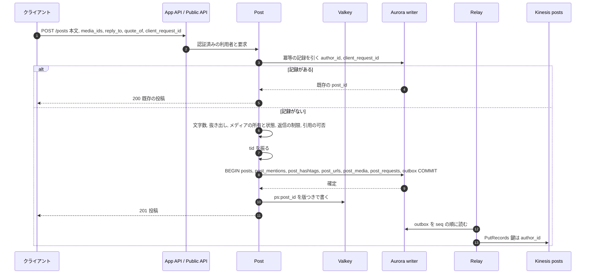
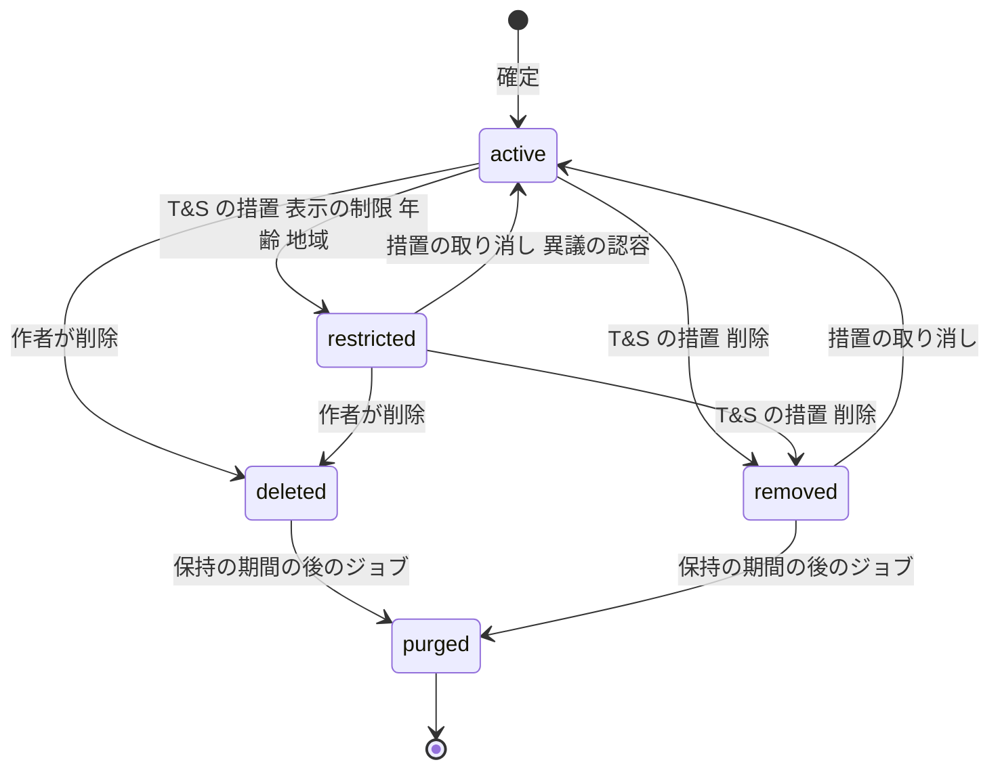
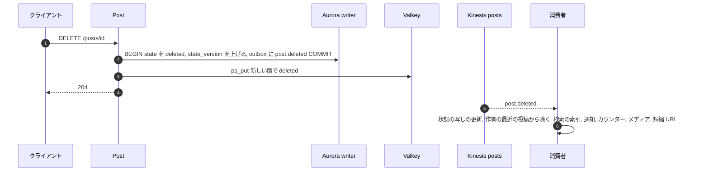
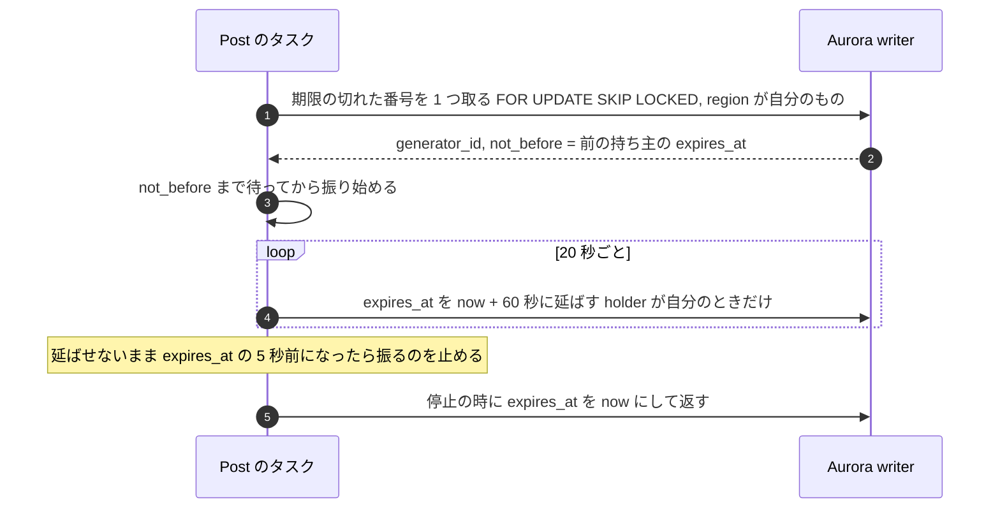
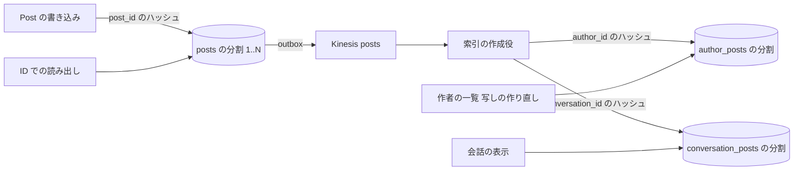

# Posts and IDs: X

投稿の書き込みの経路。検証（重み付きの文字数、URL の短縮、メンション・ハッシュタグの抜き出し）、返信とスレッド、引用、リポスト、返信の制限、削除と後始末、`tid` の生成器と貸し出し、投稿の状態の写し、S2 での投稿の表の分割、会話の ID を決める。

前提となる決定は、基盤と自前の核（[ADR-0001](../decisions/0001-platform-and-stack.md)）、64 ビットの `tid`（[ADR-0002](../decisions/0002-post-ids-and-ordering.md)）、fan-out の組み合わせ（[ADR-0003](../decisions/0003-timeline-fanout-hybrid.md)）、`visible()`（[ADR-0004](../decisions/0004-single-tenant-and-visibility.md)）、outbox と Kinesis（[ADR-0005](../decisions/0005-event-log-and-outbox.md)）。この文書で決めたことは次の ADR にある。

| ADR | 決定 |
| --- | --- |
| [0008](../decisions/0008-post-write-path-and-idempotency.md) | 投稿の書き込みは、検証 → `tid` → 1 つの DB のトランザクション（`posts`・抜き出した要素・冪等の記録・outbox）で確定する。再送は `(author_id, client_request_id)` で同じ投稿を返す。リポストも `posts` の行で、関係の正本は `reposts` |
| [0009](../decisions/0009-post-state-tombstones-and-state-cache.md) | 削除と措置は行を消さず、状態と `state_version` を変える。投稿の状態の写し（`ps:`）は版の新しいものだけを書き、削除の確定の直後に書き換える。写しの寿命は 45 秒で、出来事の取りこぼしがあっても 60 秒（NFR-009）の中で正本に戻る |
| [0010](../decisions/0010-post-table-partitioning-s2.md) | S2 で投稿の表を投稿の ID のハッシュで分割し、作者・会話ごとの一覧は別の索引の表（`author_posts`・`conversation_posts`）を、それぞれ作者・会話の ID で分割して出来事から作る |

## 1. 目的と範囲

- 扱う：
  - 投稿の種類（通常、返信、引用、リポスト）と、行の形
  - 書き込みの経路、検証、冪等性、`tid` の採番
  - 文字数の数え方（`packages/text`）、URL の短縮、メンション・ハッシュタグの抜き出し
  - 返信とスレッド、会話の ID、返信の制限
  - 削除と措置の状態、投稿の状態の写し、後始末の出来事
  - `tid` の生成器の貸し出しと時計の監視（ADR-0002 の実装の細部）
  - S2 での投稿の表の分割
- 扱わない：
  - いいね・リポストの関係の表と数（[engagement-and-counters.md](engagement-and-counters.md)。この文書はリポストの `posts` の行の形だけを書く）
  - ホームへの配り方、プロフィールの一覧と会話の並べ方（[timeline-fanout.md](timeline-fanout.md)）
  - `visible()` の決定表の全体（[trust-and-safety.md](trust-and-safety.md)。この文書は、投稿の状態が `PostState` に何を渡すかを書く）
  - メディアのアップロードと変換（[media.md](media.md)）、短縮 URL の安全の確かめ（[trust-and-safety.md](trust-and-safety.md)）
  - 投稿の数の上限（1 日あたり）とレート制限（[api-and-rate-limits.md](api-and-rate-limits.md)）
  - 投稿の検索の索引（[search-and-trends.md](search-and-trends.md)）

## 2. 本家の形（確かめたこと）

| 項目 | 本家 | 出典 |
| --- | --- | --- |
| 文字数 | 上限 280。ラテン文字・句読点・よく使う記号は 1、絵文字・CJK の文字・その他は 2。絵文字は肌の色や ZWJ の組み合わせでも 2。数える前に NFC に正規化する。URL は短縮されて 23 | [Counting characters](https://docs.x.com/fundamentals/counting-characters)（公式。2026-10-04 に確認）。重み 1 の Unicode の範囲の正確な一覧は、この文書には書かれていない（**未検証**） |
| ID | 41 ビットの時刻、10 ビットの機械、12 ビットの連番 | [ADR-0002](../decisions/0002-post-ids-and-ordering.md) |
| 鍵アカウントの投稿のリポスト | できない | **未検証**（ヘルプセンターに到達できない） |
| 返信できる人の制限 | 全員・フォローしている人・メンションした人などから選ぶ | **未検証**（同上） |

重み 1 の範囲は、公式の文書の分類（ラテン文字・句読点・よく使う記号）を、この設計で Unicode の範囲に置き換えて決める（4.2 節）。本家のライブラリ `twitter-text` の設定の値は写さない（[ADR-0001](../decisions/0001-platform-and-stack.md)）。境の文字で本家と数え方がずれうることは、受け入れる。

## 3. 要件（NFR との対応）

| 項目 | 目標 | NFR |
| --- | --- | --- |
| 投稿の API の応答 | p99 300ms（メディアの変換を除く）。内訳は 5.3 節 | NFR-001 |
| 確定した投稿を失わない | 確定を返した投稿は Aurora の writer にコミット済み。AZ の障害で RPO 0 | NFR-001・005 |
| 再送で重ならない | 同じ `client_request_id` の再送は、同じ投稿を返す | NFR-001 |
| 削除・措置が見えなくなるまで | 確定から全経路で p99 60 秒。この領域の受け持ちは、投稿の状態の写しが 45 秒以内に正本と一致すること | NFR-009 |
| 文字数 | クライアントとサーバーで同じ結果。例の集まりで不一致 0 | NFR-001（[quality.md](../quality.md) のリスク 8） |
| ID | 重なり 0。同じ生成器の中で単調に増える | NFR-005（[ADR-0002](../decisions/0002-post-ids-and-ordering.md)） |
| 瞬間のピーク | S1 で投稿 3,000 件/秒を受ける。fan-out はキューで均す | NFR-001・002 |

## 4. 投稿の形

### 4.1 種類

| 種類（`kind`） | 本文 | 主な列 | タイムラインの項目の `flags` |
| --- | --- | --- | --- |
| `post` | あり | — | 0 |
| `reply` | あり | `in_reply_to_post_id`、`in_reply_to_user_id`、`conversation_id` | `REPLY` |
| `quote` | あり（空でもよい） | `quoted_post_id`。返信と引用を兼ねられる（`kind = reply` で `quoted_post_id` を持つ） | `QUOTE` |
| `repost` | なし | `repost_of_id` | `REPOST` |

- 投稿は `tid` を持つ（[ADR-0002](../decisions/0002-post-ids-and-ordering.md)）。リポストも自分の `tid` を持ち、タイムラインの項目は `(post_id = リポストの ID, author_id = リポストした人, repost_of_id = 元の ID)` になる。
- リポストのリポストは、元の投稿のリポストとして書く（`repost_of_id` は常に元の投稿）。
- **会話の ID**（`conversation_id`）は、会話の根の投稿の ID。根の投稿では自分の ID と同じ。返信は、返信先の `conversation_id` を写す。
- **スレッド**は、作者が自分の投稿へ続けた返信の列。別の列は持たず、`conversation_id` と `in_reply_to_user_id = author_id` で表す。

### 4.2 文字数（`packages/text`）

1. 本文を NFC に正規化する。保存する本文も NFC の後のもの。
2. URL を抜き出し（4.3 節）、URL の 1 つを 23 と数える。
3. 残りを書記素のまとまり（Unicode の拡張書記素クラスター、UAX #29）ごとに数える。
   - 絵文字の書記素のまとまり（`Extended_Pictographic` を含むか、地域の旗の組）は 2。
   - それ以外は、まとまりの各コードポイントの重みの和。重み 1 の範囲は U+0000–U+10FF、U+2000–U+200D、U+2010–U+201F、U+2032–U+2037。それ以外は 2。
   - この範囲は、公式の文書の分類（ラテン文字・句読点・よく使う記号は 1）を、この設計で範囲に置き換えたもの。本家の範囲と同じかは**未検証**。
4. 合計が 280 以下なら受け付ける。上限は AppConfig の `ops.post.max_weighted_length` で持つ（既定 280）。
5. 同じ `packages/text` を Web とアプリとサーバーで使う。例の集まり（`text-examples.json`。日本語、絵文字の ZWJ、結合文字、異体字セレクター、URL の境）を 3 者の試験で共有する。

| 例 | 数 |
| --- | --- |
| `こんにちは` | 10 |
| `hello` | 5 |
| `👍🏽`（肌の色つき） | 2 |
| `👨‍👩‍👧`（ZWJ） | 2 |
| `https://example.com/very/long/path` | 23 |
| 全角の 140 文字 | 280（上限） |

### 4.3 抜き出し

抜き出しは `packages/text` の 1 つの関数で行い、位置はコードポイントの数で持つ（UTF-16 の位置にしない。API の利用者の言語に依らないため）。

| 要素 | 規則 | 保存 |
| --- | --- | --- |
| URL | `http://`・`https://` で始まるもの、または既知の TLD を持つドメインの形。末尾の句読点（`。`・`、`・`)` など）は含めない | `post_urls(post_id, position, short_code, expanded_url)`。本文には元の URL を保存し、表示で短縮の URL を出す |
| メンション | `@` か全角の `＠` の後に `[A-Za-z0-9_]{1,15}`。直前が英数字なら認めない（メールアドレスを除く） | `post_mentions(post_id, user_id, position)`。ハンドルを書き込みの時に利用者の ID に解決する。解決できないものは保存しない |
| ハッシュタグ | `#` か全角の `＃` の後に、文字（Unicode の L）・結合文字（M）・数字（N）・`_`・`ー`・`・` が 1 文字以上続き、数字だけではないもの | `post_hashtags(post_id, tag_norm, position)`。`tag_norm` は NFKC の後に小文字にしたもの |

- 1 件の投稿で解決するメンションは 50 件まで。超えた分は本文に残るが、`post_mentions` に入れない（通知の殺到の入口を狭める）。値は `ops.post.max_resolved_mentions`。
- 返信の時に、返信先の作者と、返信先が持つメンションを、本文の先頭に自動で入れない（本家の現在の画面の形は**未検証**）。返信先の作者は `in_reply_to_user_id` で持ち、通知もそれで送る。

### 4.4 URL の短縮

- 短縮の URL は `https://<brand>.<short-tld>/<code>`。`code` は短縮の行の `tid` を base62 にしたもの（11 文字以下）。
- 同じ投稿の同じ URL は同じ `code`。投稿をまたいでは使い回さない（クリックの計測と、措置での無効化を投稿ごとに行うため）。
- リンクの安全の確かめ（既知の悪いドメイン、フィッシング）は T&S が非同期に行い、`short_links.safety_state` を書く（[trust-and-safety.md](trust-and-safety.md)）。転送の時に `blocked` なら警告の画面を出す。
- 転送の処理は App API の外の小さな入口で行い、`visible()` で元の投稿を確かめない（URL は投稿の外でも共有されるため）。投稿が削除・措置されたら、その投稿の短縮の行を `disabled` にする（後始末、7.3 節）。

### 4.5 返信の制限

作者は投稿ごとに `reply_policy` を選ぶ。会話の根の投稿の設定が、会話の全体に効く。

| `reply_policy` | 返信できる人 |
| --- | --- |
| `everyone`（既定） | 全員（ブロックの関係を除く） |
| `following` | 根の投稿の作者と、作者がフォローしている人と、根の投稿でメンションされた人 |
| `mentioned` | 根の投稿の作者と、根の投稿でメンションされた人 |

決定表（spec の `DT-POST-001` の元）：

| # | 返信する人は根の作者 | ブロックの関係（どちらかの向き） | 根の `reply_policy` | 作者がフォローしている | 根でメンションされた | 結果 |
| --- | --- | --- | --- | --- | --- | --- |
| 1 | はい | — | — | — | — | 許す |
| 2 | いいえ | あり | — | — | — | 拒否（`reply_not_allowed`、存在を明かさない文言） |
| 3 | いいえ | なし | `everyone` | — | — | 許す |
| 4 | いいえ | なし | `following` | はい | — | 許す |
| 5 | いいえ | なし | `following` | いいえ | はい | 許す |
| 6 | いいえ | なし | `following` | いいえ | いいえ | 拒否 |
| 7 | いいえ | なし | `mentioned` | — | はい | 許す |
| 8 | いいえ | なし | `mentioned` | — | いいえ | 拒否 |
| 9 | いいえ | なし | — | — | — | 根の投稿が見えない（`visible()` が `hide`）なら、上の行より先に拒否（`not_found`） |

- 「フォローしている」は、書き込みの時の `following` の主キーで引く（写しを使わない）。
- 制限は書き込みの時に判定する。後から作者がフォローを外しても、既にある返信は消さない。

### 4.6 引用とリポストの規則

| 対象 | リポスト | 引用 |
| --- | --- | --- |
| 公開の投稿 | できる | できる |
| 鍵アカウントの投稿 | できない（本人も含む。承認したフォロワーの外に広がるため） | 書ける。引用の中の元の投稿は、閲覧者ごとに `visible()` で判定し、見えない人には「この投稿は表示できません」を出す |
| 削除・措置された投稿、見えない投稿 | できない（`not_found`） | できない（`not_found`） |
| ブロックの関係にある作者の投稿 | できない | できない |

- 同じ人が同じ投稿を 2 回リポストできない。正本は `reposts(post_id, user_id)` の主キー（[engagement-and-counters.md](engagement-and-counters.md)）。リポストの取り消しは、`reposts` の行を消し、リポストの `posts` の行を `deleted` にする。

## 5. 書き込みの経路

### 5.1 流れ

- 返信・引用のときは、同じトランザクションで、返信先・引用先の数のための出来事（`reply.added`・`quote.added`）を `engagement` の流れへ書く（[engagement-and-counters.md](engagement-and-counters.md) の 4.1 節）。
- 冪等の記録（`post_requests`）は、投稿の行と同じトランザクションで書く。同じ `client_request_id` で同時に 2 つの要求が来たら、主キーの重複で後の方が失敗し、既存の行を読み直して返す。保持は 24 時間。
- クライアントは、送信の前に `client_request_id`（UUIDv7）を作って下書きと一緒に持ち、応答を受けるまで同じ値で再送する。
- `posts` の流れの出来事は `post.created`（本文を含まない。ID・作者・種類・返信先・引用先・リポスト元・会話の ID・メンションした利用者の ID・ハッシュタグ・言語・`state_version`）。本文が要る消費者（検索、T&S）は、出来事の後に正本を読む。出来事のログに本文を流さないことで、削除の後に出来事のログ（7 日）とデータレイクに本文が残る量を減らす（保持は法務の L8）。

### 5.2 検証の順序

安い検査から順に行い、最初に失敗したもので返す。

| 順 | 検査 | 失敗の応答 |
| --- | --- | --- |
| 1 | 利用者の状態（凍結、読み取りだけの制限） | `403 account_restricted` |
| 2 | レート制限（[api-and-rate-limits.md](api-and-rate-limits.md)） | `429` |
| 3 | 本文の形（空でないか、メディアか引用がある。制御文字を除く） | `400 invalid_text` |
| 4 | 重み付きの文字数 | `400 text_too_long` |
| 5 | メディアの数と組み合わせ（画像 4 枚まで、GIF・動画は 1 つで画像と混ぜない）、所有者、変換の済み | `400 invalid_media` |
| 6 | 返信先・引用先の存在と `visible()`、返信の制限、引用の可否 | `404 not_found`・`403 reply_not_allowed` |
| 7 | T&S の同期の規則（重複の連投、既知の悪い URL。予算 20ms、超えたら通して非同期の判定に回す） | `403 post_rejected`（理由のコード） |

### 5.3 遅延の予算（NFR-001：p99 300ms）

| 区間 | 予算（p99） |
| --- | --- |
| 入口（認証、レート制限） | 40ms |
| 冪等の記録の確かめ | 15ms |
| 検証（文字数・抜き出し・メディア・返信先の確かめ） | 60ms |
| T&S の同期の規則 | 20ms |
| DB のトランザクション（writer、同期のレプリケーション） | 80ms |
| 状態の写しの書き込み、応答の組み立て | 25ms |
| 余裕 | 60ms |

### 5.4 状態

- `posts.state` は `active`・`deleted`・`purged`。措置は `moderation_actions` が正本で、`posts` には効いている措置の要約（`mod_flags` のビット：`LABEL`・`REDUCE`・`REMOVED`・`AGE_GATED`・`GEO_WITHHELD`・`UNDER_REVIEW`・`NO_ENGAGE`・`MEDIA_REMOVED`、地域の一覧は `mod_geo`。[data-model.md](data-model.md) の 3.5 節）を写す（[trust-and-safety.md](trust-and-safety.md)）。図の `restricted` は `LABEL`・`REDUCE` などの制限、`removed` は `REMOVED` を表す。
- 状態が変わるたびに `state_version` を 1 つ上げる。`state_version` は投稿の状態の写しの版になる（6 節）。
- `deleted` は作者が戻せない。`removed` は異議で戻りうる。
- `purged` は、本文・抜き出し・メディアの参照を消し、行の骨（ID・作者・状態）だけを残す。保持の期間は法務の L8 の後に決める。開示の請求のための保全（L2）がかかった投稿は、保全が解けるまで `purged` にしない。

## 6. 投稿の状態の写し（`ps:`）

`visible()` は、読み出しのたびに `PostState` を要る（[ADR-0004](../decisions/0004-single-tenant-and-visibility.md)）。タイムラインの 1 ページで数十〜数百件を引くので、Aurora を毎回引かない。

| 鍵 | 中身 | 寿命 |
| --- | --- | --- |
| `ps:{post_id}` | `PostState`（作者、作者の鍵の状態、`state`、`mod_flags`、センシティブの印、返信の制限、`kind`、`repost_of_id`・`quoted_post_id`）と `state_version` | 45 秒 |
| `pb:{post_id}` | 表示の本体（本文、抜き出し、メディアの参照、作成の時刻） | 1 時間。状態の判定に使わない |

- **版の新しいものだけを書く。** 書き込みは Valkey Functions の `ps_put(key, version, value, ttl)` で行い、今の版以上のときだけ書く。Aurora の reader から読んだ古い状態が、削除の後の状態を上書きしない。
- **削除・措置の確定の直後に、新しい状態を書く**（消すのではなく `deleted` の状態を書く）。書けなかったら（Valkey の障害）、`posts` の流れの消費者（状態の写しの更新役）が出来事から書く。それも遅れたら、45 秒の寿命で切れ、次の読み出しで正本から入る。
- 鍵アカウントへの切り替え・解除は、作者の状態の写し（`as:{user_id}`、寿命 45 秒、同じ版の規則）で持ち、`PostState` を組み立てるときに合わせる。作者の投稿を 1 件ずつ書き換えない。
- 寿命の 45 秒は、出来事の経路がすべて止まっても NFR-009 の 60 秒に収めるための上限。読み出しの抜き取りの監査（[quality.md](../quality.md) の 4.2 節）で、写しが正本より古かった件数を数える。
- 正本を引くとき（写しがない）は reader から読む。reader の遅れで古い状態を読んでも、版の比較で新しい写しを壊さない。削除の直後に、写しがなく、reader が遅れている場合は、削除の前の状態が最大で reader の遅れ（p99 1 秒未満を想定）だけ見える。これは NFR-009 の 60 秒の中に入る。

## 7. 削除と後始末

### 7.1 作者の削除

- 自分の投稿だけを消せる。リポストの取り消しは [engagement-and-counters.md](engagement-and-counters.md) の経路。
- 削除は冪等。`deleted` の投稿をもう一度消しても `204` を返し、出来事を出さない。

### 7.2 消えたものの見せ方

| 場面 | 見せ方 |
| --- | --- |
| 投稿の URL を直接開く | `404`（削除）。措置の場合は措置の種類の表示（[trust-and-safety.md](trust-and-safety.md)） |
| 会話の中の削除された投稿 | 「この投稿は削除されました」の枠を残し、子の返信は見せる（子の返信の作者の資産のため） |
| 引用の中の削除された投稿 | 「この投稿は表示できません」 |
| 削除された投稿のリポスト | 出さない（`visible()` がリポストの元の状態を見て `hide`） |

- `visible()` に渡す `PostState` は、リポストのときは元の投稿の状態も持つ（`original: PostState`）。元が `hide` なら、リポストも `hide`。

### 7.3 後始末（正しさの条件ではない）

正しさは読み出しの `visible()` が持つ。後始末は、写しと索引の量を減らすためと、外に残る経路（CDN、プッシュ）を止めるために行う。

| 消費者 | 扱い | 文書 |
| --- | --- | --- |
| 状態の写しの更新役 | `ps:` を新しい版で書く | この文書の 6 節 |
| Timeline | 作者の最近の投稿（`ar:`）から除く。ホームの写しからは、読み出しの時の詰め直しで除く | [timeline-fanout.md](timeline-fanout.md) |
| Search Indexer | 索引の文書に削除の印を入れ、後で消す | [search-and-trends.md](search-and-trends.md) |
| Notification | 削除された投稿に関わる未送信のプッシュを取り消し、通知の行を隠す | [notifications.md](notifications.md) |
| Counter Aggregator | 返信・引用の数を減らす（返信先・引用先の数） | [engagement-and-counters.md](engagement-and-counters.md) |
| Media | 他の投稿から参照されていなければ配信を止める | [media.md](media.md) |
| 短縮 URL | その投稿の `short_links` を `disabled` にする | 4.4 節 |

## 8. `tid` の生成器（ADR-0002 の実装）

### 8.1 貸し出し

- `tid_generator_leases(generator_id, region, holder, lease_epoch, expires_at)`。`generator_id` は東京 0〜511、大阪 512〜1023（ADR-0002）。`CHECK` で `region` と範囲の組を強制する。
- 取得は 1 回の SQL で行う：`expires_at < now()` の行のうち 1 つを `FOR UPDATE SKIP LOCKED` で取り、`holder`・`lease_epoch + 1`・`expires_at = now() + 60s` を書く。返り値の前の `expires_at` を `not_before` にする。
- DB の時刻（`now()`）で期限を決め、タスクの時計と比べるときは、取得の往復の時間を引いた控えめの値を使う。
- 1 つのタスクは 1 つの番号を持つ。投稿のサービスのほか、Accounts（利用者）、DM（メッセージ）、Media（メディア）、Engagement（リポスト）、短縮 URL も同じライブラリで番号を借りる。S1 の想定は、全体で 150 前後（リージョンの上限 512 の 3 割）。7 割を超えたらアラートにする。

### 8.2 時計

- 時刻は Amazon Time Sync Service に合わせた OS の時計。Fargate のタスクのメタデータが時計の誤差の上限と同期の状態を返すかは**未検証**（E1 の `tid-generator` で確かめる）。返すなら、同期していない状態か、誤差の上限が 100ms を超えたら振るのを止める。
- 前の ID のミリ秒より時計が戻ったら、5ms までは待ち、それより大きければ `503 id_unavailable` で失敗させ、アラートを出す（ADR-0002）。投稿の API は、クライアントの再送（同じ `client_request_id`）で回復する。
- 連番が 4,096 に達したら次のミリ秒まで待つ。

### 8.3 失敗と回復

| 失敗 | 起きること | 回復 |
| --- | --- | --- |
| 貸し出しの延長ができない（DB の切り替え） | 期限の 5 秒前に振るのを止め、投稿が `503` | DB が戻れば同じ番号を延ばすか、取り直す。Aurora の切り替え（目標 60 秒以内）の間、投稿は止まる（NFR-005 の書き込みの停止の範囲） |
| 番号が尽きた（タスクが多すぎる） | 新しいタスクが起動の時に番号を取れない | タスクを起動の失敗にし、アラート。1 タスクで複数の番号を持つか、配分の見直しの ADR を書く（ADR-0002） |
| 時計の大きな戻り | そのタスクが振らない | タスクを入れ替える。続くなら Time Sync の状態を調べる |
| 主キーの重複（起きてはいけない） | 投稿の確定が失敗 | アラート（SEV2）。貸し出しの表と、そのタスクの時計の記録を調べる |

## 9. S2 の分割（ADR-0010）

S1 は Aurora の 1 クラスタで、`posts` を `id` の範囲で月ごとのパーティションに分ける（`tid` は時刻の順なので、月の初めの時刻から境の ID を計算できる）。古いパーティションの保守と、保持のジョブを軽くするため。

S2 では次の形にする。

- `posts` は投稿の ID のハッシュで分割する。1 件の読み出し（状態の写しの元、埋め込み、API）は 1 つの分割で済む。
- `author_posts(author_id, post_id, kind)`・`conversation_posts(conversation_id, post_id, in_reply_to_post_id, author_id)` は、出来事から冪等に作る（主キーで重複を落とす）。遅れは p99 5 秒を目標にし、読み出しの側では、作者の最近の投稿の写し（`ar:`）が新しい部分を補う（[timeline-fanout.md](timeline-fanout.md)）。
- S1 の計測で「作者の一覧の読み出し（写しの作り直し、プロフィール）」が全体の読み出しの 2 割を超えるなどの理由で、作者のハッシュで `posts` を分けるほうがよいと分かったら、この ADR を見直す。

## 10. 障害と振る舞い

| 障害 | 起きること | 検知 | 回復 |
| --- | --- | --- | --- |
| Aurora の writer の切り替え | 投稿が失敗する（最大 60 秒） | API のエラー率 | クライアントが同じ `client_request_id` で再送する |
| Valkey の障害 | 状態の写しが読めない・書けない | Valkey の接続のエラー | 状態は Aurora の reader から読む（読み出しの経路で 1 回の束ねた問い合わせ）。削除の後の書き込みが失敗したら、出来事の経路と 45 秒の寿命で戻る |
| Relay の停止 | 出来事が流れない。投稿は確定するが、ホームに届かない | outbox の最も古い行の年齢 | 待機の Relay が引き継ぐ。NFR-002 の外れとして数える |
| T&S の同期の規則の遅れ | 予算の 20ms を超える | 規則の遅延 | 通して非同期の判定に回す（投稿を止めない） |
| メンションの解決の失敗（利用者の表が遅い） | 投稿が遅れる | 区間の遅延 | 解決できない分は抜き出しに入れず、出来事の後に解決し直す（`post_mentions` を後から足す。通知はその時に出る） |

## 11. 上限

| 項目 | 値 | 持つ場所 |
| --- | --- | --- |
| 重み付きの文字数 | 280 | `ops.post.max_weighted_length` |
| 本文のバイト数（NFC の後、UTF-8） | 4,096 バイト（重み 280 の最悪の場合を超える余裕） | コード（形の上限） |
| 解決するメンション | 50 | `ops.post.max_resolved_mentions` |
| ハッシュタグ | 抜き出しは 30 まで | `ops.post.max_hashtags` |
| URL | 10 まで | `ops.post.max_urls` |
| メディア | 画像 4 枚、または GIF 1、動画 1 | [media.md](media.md) |
| 冪等の記録の保持 | 24 時間 | 保持のジョブ |
| 1 日の投稿の数 | [api-and-rate-limits.md](api-and-rate-limits.md) で決める | — |
| 生成器の番号 | リージョンごとに 512 | ADR-0002 |

## 12. data-model への項目

列・鍵・索引の正本は [data-model/posts.md](data-model/posts.md)にある。下の表は、この領域が求めた項目の要点である。

| 表・store | 列・鍵 | 備考 |
| --- | --- | --- |
| `posts` | `id bigint PK`（`tid`）、`author_id bigint`、`kind`、`text`（NFC）、`lang`、`in_reply_to_post_id`、`in_reply_to_user_id`、`conversation_id`、`quoted_post_id`、`repost_of_id`、`reply_policy`、`sensitive`、`has_media`、`region_code`（作成の時に決めた地方。[search-and-trends.md](search-and-trends.md) の 9.2 節。L4 の確認待ち）、`state`、`mod_flags`、`mod_geo`、`state_version bigint`、`created_at`、`deleted_at`、`purged_at` | 公開の表（RLS なし）。S1 は `id` の範囲で月ごとのパーティション。索引：`(author_id, id DESC)`、`(author_id, id DESC) WHERE has_media`、`(conversation_id, id)`、`(in_reply_to_post_id, id)`、`(in_reply_to_post_id, author_id)`、`(quoted_post_id, id)`（[timeline-fanout.md](timeline-fanout.md) の 13 節） |
| `post_requests` | `(author_id, client_request_id) PK`、`post_id`、`state`（S2 の `reserved`）、`created_at` | 冪等の記録。24 時間。投稿者だけが使うが、書き込みの経路の内部の表なので RLS の対象にしない（API に出さない） |
| `post_mentions` | `(post_id, user_id) PK`、`position` | 索引 `(user_id, post_id DESC)`（メンションの一覧） |
| `post_hashtags` | `(post_id, tag_norm) PK`、`position` | 検索とトレンドは出来事から作る |
| `post_urls` | `(post_id, position) PK`、`short_code`、`expanded_url` | |
| `short_links` | `code PK`、`link_id`（`tid`）、`post_id`、`url`、`safety_state`、`disabled_at` | |
| `post_media` | `(post_id, media_id) PK`、`ord` | メディアの行は [media.md](media.md) |
| `drafts` | `(owner_id, id) PK`（UUIDv7）、`text`、`media_ids`、`reply_to`、`quote_of`、`updated_at` | 本人だけの表（FORCE RLS）。[clients.md](clients.md) の 6.2 節 |
| `post_origin_logs` | `(post_id, ip_ct, port_ct, created_at)` | 開示に使うログ。形と鍵は [security.md](security.md) の 5.3 節。Post は書くだけ |
| `tid_generator_leases` | `generator_id smallint PK`、`region`、`holder`、`lease_epoch`、`expires_at` | `CHECK (region, generator_id の範囲)` |
| `author_posts`・`conversation_posts`（S2） | 9 節 | 出来事から作る索引の表 |
| outbox の出来事 | `posts` の流れ：`post.created`・`post.deleted`・`post.state_changed`（措置の反映） | 鍵は `author_id`（[ADR-0005](../decisions/0005-event-log-and-outbox.md)） |
| outbox の出来事（数） | `engagement` の流れ：返信・引用のとき `reply.added`・`quote.added`、削除と `removed` の措置で `reply.removed`・`quote.removed` | 鍵は返信先・引用先の `"{post_id}:{sub}"`（[engagement-and-counters.md](engagement-and-counters.md) の 4.1 節）。同じトランザクションで書く |
| Valkey `ps:{post_id}`・`as:{user_id}` | `PostState`・作者の状態と版、寿命 45 秒 | 6 節 |
| Valkey `pb:{post_id}` | 表示の本体、寿命 1 時間 | |

## 13. テストと性質

### 13.1 性質

- **PROP-TID-001（重ならない）**：任意の生成器の数・貸し出しの交代・延長の失敗・時計の揺れ（戻りを含む）の列で、振った ID は全体で重ならず、同じ生成器の中で単調に増える（ADR-0002 の Confirmation）。
- **PROP-TID-002（時刻の順の近さ）**：時計のずれが ε 以内の生成器の間で、時刻 t1 < t2 − ε に振った ID は `id1 < id2`。
- **PROP-POST-001（冪等）**：同じ `(author_id, client_request_id)` の要求を何回、どの順で送っても、確定する投稿は 1 件で、全ての成功の応答が同じ ID を返す。
- **PROP-POST-002（確定と出来事）**：`post.created` が流れた投稿は確定しており、確定した投稿は必ず `post.created` が流れる（途中の失敗の注入を含む）。
- **PROP-POST-003（状態の写しの単調）**：任意の書き込み・正本からの読み込み（遅れた reader を含む）・出来事の再送の列で、`ps:` の版は減らない。最後の出来事から 45 秒後には、写しは正本の状態と一致する。
- **PROP-POST-004（文字数の一致）**：任意の Unicode の列で、Web・アプリ・サーバーの `weightedLength` が同じ。NFC の正規化の前後で、正規化の後の値が使われる。
- **PROP-POST-005（会話）**：任意の返信の木で、全ての投稿の `conversation_id` は根の ID と等しい。

### 13.2 表駆動・例示

- `DT-POST-001`：4.5 節の返信の制限の全行。
- `DT-POST-002`：4.6 節の引用・リポストの可否の全行。
- 文字数の例の集まり：4.2 節の表と、日本語・絵文字・URL の境の例（[quality.md](../quality.md) のリスク 8）。

### 13.3 結合・負荷

- 投稿のトランザクションの途中で失敗させ、`posts`・抜き出し・outbox のどれも残らない。
- 削除の後、`ps:` の書き込みを失敗させ、Relay を止めても、60 秒以内に全経路の読み出しで見えない（漏れの経路の表の「削除の直後の人」）。
- 負荷：S1 の瞬間のピーク（3,000 件/秒）で投稿の p99 300ms。生成器の貸し出しの交代を負荷の最中に起こす。

## 14. Story の候補

| Epic | Story | 中身 |
| --- | --- | --- |
| E1 | `tid-generator` | 8 節の貸し出し、時計の監視、PROP-TID-001・002 |
| E3 | `text-weighted-count` | 4.2 節の数え方と例の集まり |
| E3 | `post-write-path` | 5 節の経路、冪等の記録、outbox の出来事の形 |
| E3 | `post-state-cache` | 6 節の `ps:`・`as:`、`ps_put` の Function |
| E3 | `replies-and-threads` | 4.1 節の会話の ID、スレッド |
| E3 | `quote-and-repost` | 4.6 節の規則（リポストの関係は E6 の `likes-reposts-bookmarks` と共同） |
| E3 | `reply-restrictions` | 4.5 節と `DT-POST-001` |
| E3 | `post-delete-cleanup` | 7 節。物理の削除は法務の L8 の後 |
| E3 | `short-links` | 4.4 節 |

## 15. 未解決の問い

### 決定

2026-10-04 の既定案。E3 の計測で覆りうる。

- 書き込みは 1 つのトランザクション、冪等の記録は 24 時間（ADR-0008）。
- 出来事に本文を載せない（ADR-0008）。
- 状態の写しは版の新しいものだけを書き、寿命 45 秒（ADR-0009）。
- S2 の分割の鍵は投稿の ID のハッシュ。作者・会話の一覧は別の表（ADR-0010）。
- 重み 1 の範囲は 4.2 節の 4 つ。位置はコードポイントで数える。
- 鍵アカウントの投稿はリポストできない。引用は書けるが、中身は閲覧者ごとに判定する。

### 持ち越し

| 問い | いつ・どう決めるか |
| --- | --- |
| 重み 1 の範囲が本家とずれる文字の扱い | E3 の `text-weighted-count` で例の集まりを広げ、ずれを記録する。合わせる必要があれば PM に確認 |
| Fargate で時計の誤差の上限が取れるか | E1 の `tid-generator` で確かめる。取れなければ Time Sync の同期の状態だけを見る |
| 削除の後に本文を消すまでの期間、出来事・データレイクの扱い | 法務の L8 |
| 開示の請求のための保全と、`purged` の関係 | 法務の L2（[trust-and-safety.md](trust-and-safety.md) と共同） |
| 投稿の編集（MVP の後、E17） | `state_version` と別に版の表を持つ。E17 の着手の時に ADR |

## 16. quality.md・runbooks への項目

- quality.md：漏れの経路の表の「削除の直後の人」の行に、`ps:` の書き込みの失敗と Relay の停止を重ねたシナリオを足す。文字数の例の集まりを E3 の合否基準に入れる（既にある）。
- runbooks：`tid-lease-exhaustion.md`（番号の使用率、起動の失敗）、`tid-clock-regression.md`（時計の戻りのアラート）、`post-write-latency.md`（5.3 節の区間ごとの確かめ方）。統合の工程で、時計の戻りは主キーの重複と同じ `tid-collision.md` にまとめた（[runbooks/README.md](../runbooks/README.md) の 4 節）。
