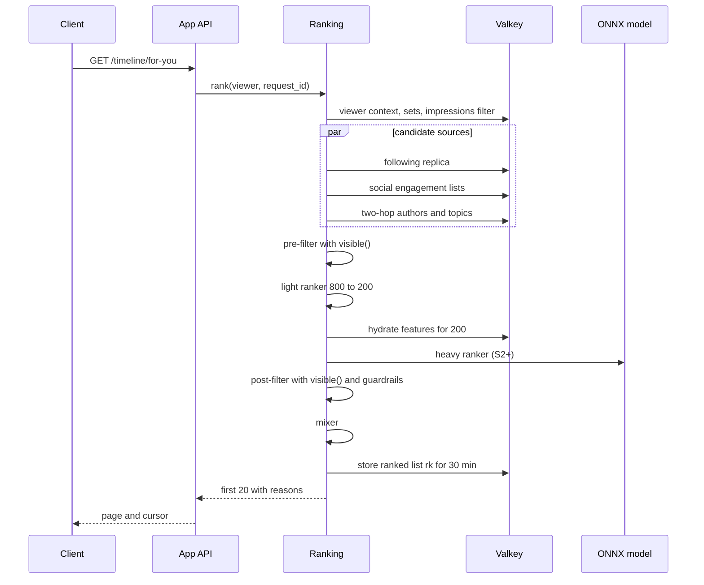

# Ranking and recommendation: X

ホームの「おすすめ」のタイムライン。候補の源（フォロー中とフォロー外）、特徴の付加、軽いランクと重いランクの 2 段のスコア、固い絞り込みとガードレール、混ぜ合わせ、代わりの並び、理由の記録と利用者の操作、オフラインの評価と A/B、学習の基盤（S2 以降）を決める。

前提となる決定は、段のパイプラインと ML の境界（[ADR-0006](../decisions/0006-ranking-boundary.md)）、見える範囲は `visible()` で読み出しの時に決めること（[ADR-0004](../decisions/0004-single-tenant-and-visibility.md)）、フォロー中の写し（[ADR-0003](../decisions/0003-timeline-fanout-hybrid.md)）、出来事のログと閲覧の取り込み（[ADR-0005](../decisions/0005-event-log-and-outbox.md)）、本家のコード・重み・モデルを使わないこと（[ADR-0001](../decisions/0001-platform-and-stack.md)、[リポジトリ共通の ADR-0007](../../../../docs/decisions/0007-no-reuse-of-original-implementation.md)）。法務の確認待ちは L4（推薦に使う履歴と特徴、本人への説明）。この文書で決めたことは次の ADR にある。

| ADR | 決定 |
| --- | --- |
| [0018](../decisions/0018-ranking-candidates-and-two-stage-scoring.md) | S1 の候補の源は、フォロー中・フォロー中の人の行動・2 歩先の作者・話題・全体の人気の 5 つ。候補は 1 回 800 件まで。スコアの段を軽いランク（800 → 200）と重いランク（200 件）に分ける。混ぜ合わせは、同じ作者の減衰（0.5 倍ずつ、下限 0.1）、1 ページ 20 件のうち同じ作者 2 件まで、フォロー外 50% まで。並べた結果は 30 分の写しに持ち、続きのページはそこから返す |
| [0019](../decisions/0019-ranking-features-and-training-platform.md) | 特徴の定義を `packages/ranking/features` の 1 か所に置き、TypeScript の推論と Python の学習は、同じ定義から生成した仕様で計算する。配信の時に使った特徴を記録し、S2 の学習はその記録で行う。学習は SageMaker の学習ジョブと Step Functions。推論は ONNX Runtime をサービスの中で動かす |
| [0020](../decisions/0020-ranking-evaluation-experiments-and-transparency.md) | ランキングの変更は、オフラインの評価 → A/B（利用者の単位、7 日以上）の順に通す。A/B のガードレールは信頼区間で判定し、標本の比の不一致は結果を無効にする。返した投稿ごとに理由のコードを記録して「なぜ表示されるか」を示す。利用者の操作として「興味がない」「この作者をおすすめに出さない」と、個人化しないおすすめの設定を持つ |

## 1. 範囲

- 扱う：おすすめのタイムラインの 1 回の要求の流れ、候補の源とその写し、前と後の絞り込み、特徴の定義と保存、軽いランクと重いランク、混ぜ合わせ、ページング、代わりの並び、理由の記録、利用者の操作、オフラインの評価、A/B、学習の基盤（S2）、埋め込みでの取り出し（S3 の形だけ）。
- 扱わない：
  - フォロー中のタイムラインの写しと fan-out（[timeline-fanout.md](timeline-fanout.md)）。
  - 見える範囲の決定表（[ADR-0004](../decisions/0004-single-tenant-and-visibility.md)、[trust-and-safety.md](trust-and-safety.md)）。
  - スパムの点の作り方（[trust-and-safety.md](trust-and-safety.md) の 8 節）。この文書は点を入力として使うだけ。
  - トレンドの検出（[search-and-trends.md](search-and-trends.md)）。話題の源は、その出力を読む。
  - 閲覧の出来事の取り込みと数（[engagement-and-counters.md](engagement-and-counters.md)）。
  - フラグの基盤と CI の形（`delivery.md`）。ガードレールの計測の実装（`observability.md`）。
  - 会話（返信の一覧）の並べ方。返信の上位のランクは timeline-fanout の領域が持つ。S2 でこの文書のスコアの段を使い回すかは、そこで決める。
- 広告の枠は MVP の後。混ぜ合わせの段に枠の口だけを置く。

## 2. 本家の形（確かめたこと）

公式の資料と、第三者の解説を分けて書く。いずれも 2026-10-04 に確認。この設計は考え方を参考にするが、本家のコード・重み・閾値・モデルを使わない（[ADR-0001](../decisions/0001-platform-and-stack.md)）。

### 2.1 公式の資料

| 項目 | 本家（公開の README） | この設計 |
| --- | --- | --- |
| 候補の源（今） | フォロー中は Thunder がフォローしている作者の最近の投稿をメモリーに持つ。フォロー外は Phoenix の取り出しと SimClusters で見つける（[xai-org/x-algorithm](https://github.com/xai-org/x-algorithm)） | フォロー中は写し（ADR-0003）から。フォロー外は S1 で規則の源、S3 で埋め込み（5 節） |
| 絞り込み（今） | スコアの前に、重複・古い投稿・本人の投稿・ブロックとミュートの作者・既に見た投稿を落とす。選んだ後に見える範囲を判定し、親や引用の元が落ちた投稿も落とす（同上） | 前と後の 2 回の `visible()`。親・引用の元が見えない投稿も落とす（6・9 節） |
| スコア（今） | モデルが多くの行動の確率を出し、良い行動に正の重み、悪い行動に負の重みを掛けて足す（同上） | S1 は平滑化した率で同じ形の和を作る。S2 でモデルに替える（8 節）。重みは自前で決める |
| 作者の偏り（今） | 作者の 2 件目以降に、下限のある減衰の係数を掛ける（同上） | 同じ考え方。係数と下限は自前の初期値（10 節） |
| フォロー外（今） | フォロー外の投稿に 1 未満の係数を掛ける（同上） | 係数ではなく、1 ページの割合の上限で抑える（10 節） |
| 2023 年の構成 | 候補の源 → 軽いランク → 重いランク（ニューラルネットワーク）→ 見える範囲の絞り込み → 混ぜ合わせ。フォロー中とそれ以外は平均で半々（[twitter/the-algorithm](https://github.com/twitter/the-algorithm)） | 同じ段の順。フォロー外の上限を 50% とした |

### 2.2 第三者の解説

- 1 回のおすすめのために約 1,500 件の候補を集め、約 4,800 万のパラメーターのニューラルネットワークで並べる（[TechCrunch, 2023-03-31](https://techcrunch.com/2023/03/31/twitter-reveals-some-of-its-source-code-including-its-recommendation-algorithm/)）。本家のブログは 403 で取得できず、本家の文書での確認は**未検証**。この設計の S3 の候補の上限 1,500 件は、この規模を目安にした。

## 3. 要件

| 要件 | 値 | 出どころ |
| --- | --- | --- |
| 最初のページの応答 | p99 800ms（サーバー）。続きのページは p99 300ms（写しから返すため） | NFR-003 |
| 可用性 | スコアの段が落ちても代わりの並びで返し、可用性に数える。代わりの並びの割合は 1% 以下（1 時間） | NFR-004、[quality.md](../quality.md) の 4.1 節 |
| 見える範囲 | 点にかかわらず、`visible()` が `hide` の投稿を返さない。漏れ 0 件 | NFR-009、[quality.md](../quality.md) の 2.2.1 節 |
| スパム | ホームのスパムの割合 0.5% 以下（週ごとの抜き取り） | NFR-011 |
| 価値 | 1 回の訪問の中の行動の率が、フォロー中の時刻の順より 20% 以上高い（A/B） | K8 |
| 安全な変更 | 重み・特徴・モデルの変更はオフラインの評価と A/B を通す。ガードレールの悪化 5% で止める | [ADR-0006](../decisions/0006-ranking-boundary.md) |
| DM | DM の中身と、DM の有無・相手を特徴に使わない | [AGENTS.md](../../AGENTS.md)、L3 |

## 4. 全体の流れ

### 4.1 最初のページ



段と時間の予算（[ADR-0006](../decisions/0006-ranking-boundary.md) の 800ms の割り振り）。

| 段 | 予算 | S1 の中身 | 予算を超えたとき |
| --- | --- | --- | --- |
| 閲覧者の文脈 | 取り出しに含む | ブロック・ミュート・承認済みの鍵の集合、設定、既読の印 | 取れなければ代わりの並び |
| 1. 候補の取り出し | 200ms | 5 つの源を並行に読む（5 節） | 間に合った源だけで続ける。フォロー中が間に合わなければ代わりの並び |
| 2. 前の絞り込み | 取り出しに含む | `visible()`、既読、48 時間、重複、本人（6 節） | — |
| 3. 特徴の付加 | 150ms | 投稿・作者・関係・閲覧者の特徴（7 節） | 欠けた特徴は既定の値と欠けの印 |
| 4a. 軽いランク | 30ms | 800 → 200（8.1 節） | 源ごとの新しさの順で 200 件 |
| 4b. 重いランク | 220ms | S1 は式、S2 からモデル（8.2 節） | 軽いランクの点で続ける。記録に `fallback_stage = heavy` |
| 5. 後の絞り込み | 混ぜ合わせと合わせて 100ms | `visible()` をもう一度、ガードレール（9 節） | 飛ばさない。超えても待つ |
| 6. 混ぜ合わせ | 同上 | 作者の偏り、フォロー外の割合、会話のまとめ（10 節） | — |
| 余裕 | 100ms | 応答の組み立て | — |

- 後の絞り込みは時間の予算で飛ばさない。安全の段を予算の都合で外すと、ADR-0006 の境界を破るため。
- 全体の締め切りは 700ms。そこで後の絞り込みに入っていなければ、代わりの並び（11 節）に切り替える。

### 4.2 続きのページ

- 最初のページで、混ぜ合わせの後の並び（最大 200 件の `post_id` と源と理由）を `rk:{viewer_id}:{request_id}` に 30 分持つ。
- 続きのページは、カーソル（`request_id` と位置）でこの並びを読み、**返す前に `visible()` を通し直す**。並べた後のブロック・削除・措置を落とすため。
- 並びを使い切るか期限が切れたら、新しい要求として最初から並べる。既に返した投稿は、既読の印で落ちる。
- 引っ張って更新する操作は、新しい要求として並べる。

## 5. 候補の源

| 源 | 種類 | S1 の上限 | 取り出し方 | 写し |
| --- | --- | --- | --- | --- |
| `following` | フォロー中 | 400 | フォロー中の写し（`tl:`）とプルの作者（`ar:`）を合わせ、直近 48 時間の上位 400（ADR-0003 の読み出しと同じ合わせ） | 既存の写し |
| `social` | フォロー外 | 200 | 閲覧者との関係の強い上位 100 人の作者（7.3 節）の、直近 24 時間のいいね・リポスト（`ae:{user_id}`、1 人 100 件）を合わせ、重なりの多い順 | `ae:{user_id}`：Counter Aggregator と同じ流れから作る。24 時間で切る |
| `two_hop` | フォロー外 | 100 | 毎日のバッチで閲覧者ごとに「フォロー中の人が多くフォローしている作者」上位 300 を作り、その作者の直近 24 時間の投稿を、行動の率の順で取る | `th:{viewer_id}`（作者の一覧、26 時間）、作者の投稿は `ar:` か投稿の索引 |
| `topic` | フォロー外 | 60 | 閲覧者の関心の話題（7.4 節）と、地域のトレンドの語ごとに、直近 6 時間の人気の投稿 | `tp:{topic_id}`：トレンドの計算（[search-and-trends.md](search-and-trends.md)）と同じ周期で上位 200 件 |
| `popular` | フォロー外 | 40 | 日本全体の直近 6 時間の行動の速さの上位。フォローの少ない利用者の出発点 | `pop:jp`：5 分ごとに上位 500 件 |
| `embedding`（S3） | フォロー外 | 600 | 閲覧者の埋め込みに近い投稿を近傍の探索で取る | S3 で決める（12 節） |

- 合計は S1 で 800 件まで、S3 で 1,500 件まで。値は `ops.ranking.candidates.*` で持つ。
- フォローの数が 20 人未満の利用者は、`following` の不足分を `popular` と `topic` に回す。
- 同じ投稿が複数の源から来たら 1 つにまとめ、源と理由を全部残す。理由の表示には優先の順（`following` > `social` > `two_hop` > `topic` > `popular`）で 1 つ選ぶ。
- **候補にしないもの**：DM で共有された投稿、閲覧者が見た DM の相手（L3）。鍵アカウントの投稿は `following`（承認済み）からだけ来る。フォロー外の源は、作者が鍵アカウントの投稿を写しに入れない。
- `two_hop` のバッチは、データレイクのフォローの表の写しから Athena で作る。S1 で MAU 100 万人ぶん、1 日 1 回。閲覧者のフォローが 2,000 人を超えるときは、関係の強い上位 500 人だけで数える。

## 6. 前の絞り込み

| 規則 | 中身 |
| --- | --- |
| 見える範囲 | `visible(viewer, post)` が `show` 以外なら落とす。`interstitial` はおすすめでは落とす（フォロー中では出す）。理由：おすすめは閲覧者が選んで見に行った投稿ではないため |
| 既読 | 閲覧者ごとの既読の印（`seen:{viewer_id}`、直近 48 時間に表示した投稿の Bloom フィルター、誤検出の率 1%）にあるものを落とす |
| 古さ | 作成から 48 時間を超えたら落とす（ADR-0006 の既定） |
| 本人 | 閲覧者の投稿を落とす |
| 返信 | フォロー外の作者の返信は、親の作者を閲覧者がフォローしているときだけ残す |
| リポスト | 同じ元の投稿のリポストは 1 つにまとめ、元の投稿を候補にする。リポストした人は理由に使う |
| 措置の途中 | 通報が閾値を超えて審査中の投稿（`under_review`）は、フォロー外の源から落とす |

- Bloom フィルターの誤検出で、まだ見ていない投稿を 1% 落とす。許容する。
- 既読の印は閲覧の出来事（Ingest）から作る。閲覧の取り込みが遅れても、`rk:` の並びを使い切るまでは同じ投稿を返さない。

## 7. 特徴

特徴の定義は `packages/ranking/features` の 1 か所に置く（[ADR-0019](../decisions/0019-ranking-features-and-training-platform.md)）。定義は名前、版、型、既定の値、計算の源、更新の周期、個人データの区分を持つ。

### 7.1 特徴の群

| 群 | 例 | 置き場所 | 更新 |
| --- | --- | --- | --- |
| 投稿 | 経過時間、いいね・返信・リポスト・引用の数と率（閲覧あたり）、行動の速さ（直近 1 時間）、メディアの種類、本文の長さ、言語、リンクの有無、返信か | `pf:{post_id}`（Valkey のハッシュ、48 時間） | Counter Aggregator の流れから 10 秒ごと |
| 作者 | フォロワーの数（対数）、アカウントの経過日数、直近 30 日の平均の行動の率、スパムの点、措置の履歴の印 | `af:{author_id}` | 1 時間ごと（スパムの点は変化の出来事で） |
| 関係 | 閲覧者から作者への関係の強さ、相互フォロー、フォロー中の人のうち作者をフォローしている人の数 | `va:{viewer_id}`（上位 500 人の作者） | 出来事で増やし、毎日の減衰 |
| 閲覧者 | 1 日の訪問の回数、行動の傾向（いいねが多い・返信が多い）、関心の話題 | `vf:{viewer_id}` | 毎日 |
| 文脈 | 時刻（JST の時間帯）、曜日、端末の種類 | 要求から | 要求ごと |

- 特徴に**使わないもの**：DM のすべて、検索の語の生の文字列、IP アドレス、正確な位置、電話番号・メールアドレス、要配慮個人情報を推定しうる話題の区分（L4 の確認の後に、使ってよい話題の範囲を決める）。
- 投稿の特徴は、全閲覧者で共有する。Ranking のタスクの中に 10 秒の LRU（10 万件）を持ち、人気の投稿の読み出しを減らす。
- 特徴が欠けたら、定義の既定の値を使い、欠けの印（`<name>__missing = 1`）を立てる。欠けの割合は特徴ごとに計測する。

### 7.2 率の平滑化

行動の率は件数が少ないと揺れる。作者の平均を事前の値にして平滑化する。

```
rate_a(post) = (count_a(post) + α · prior_a(author)) / (impressions(post) + α)
α = 50（自前の初期値。オフラインの評価で決め直す）
prior_a(author) = 作者の直近 30 日の行動 a の率（作者の閲覧が 1,000 未満なら全体の率）
```

### 7.3 関係の強さ

```
rel(viewer, author) = 1 − exp(−s / 10)
s = Σ_events w_e · 0.5^(age_days / 14)
w_e：返信 3、引用 2、リポスト 2、いいね 1、プロフィールの訪問 0.5、通知を開く 0.5
```

- 半減期 14 日。上位 500 人の作者だけを `va:{viewer_id}` に持つ。
- ミュート・「この作者をおすすめに出さない」の作者は 0 にする。

### 7.4 関心の話題

- 話題は、ハッシュタグと、トレンドで使う語の辞書（[search-and-trends.md](search-and-trends.md) の 9 節）を束ねた固定の一覧（S1 で 300 程度）。投稿は本文の語から話題を最大 3 つ持つ。
- 閲覧者の関心は、直近 30 日の行動した投稿の話題の重み付きの数の上位 20。
- 政治の立場・宗教・健康などを推定しうる話題は、L4 の確認まで閲覧者の関心に使わない（投稿の話題としては持つ）。

## 8. スコア

### 8.1 軽いランク（800 → 200）

候補の取り出しで手に入る値だけで、安く点を付ける。特徴の付加の前に行う。

```
light = log1p(velocity_1h) + 2.0 · rel + b_source − age_hours / 24
b_source：following 1.0、social 0.6、two_hop 0.4、topic 0.4、popular 0.2
```

- `velocity_1h` は候補の写しに付けて持つ（取り出しの時に分かる）。`rel` は `va:` の 1 回の読み出し。
- 上位 200 件を残す。ただし源ごとに最低 10 件（その源に候補があれば）を残し、フォロー外の源が全部消えないようにする。
- 係数は自前の初期値で、A/B で決め直す。本家の値ではない。

### 8.2 重いランク（200 件）

S1 は手で決めた式、S2 から学習済みのモデル。どちらも「行動ごとの確率 × 重み」の和にする（ADR-0006）。

```
S1:
  p_a = rate_a(post)                     （7.2 節の平滑化した率）
  value = Σ_a W_a · p_a
  heavy = value · (1 + 0.5 · rel) · 0.5^(age_hours / 6)

S2:
  p_a = model_a(features)                （勾配ブースティング、行動ごと）
  heavy = Σ_a W_a · p_a
```

| 行動 `a` | `W_a`（S1 の初期値） |
| --- | --- |
| いいね | 1.0 |
| リポスト | 2.0 |
| 返信 | 3.0 |
| プロフィールへの移動 | 0.5 |
| 2 秒以上の表示 | 0.2 |
| 「興味がない」 | −20 |
| ミュート・ブロック・通報 | −50 |

- 重みは AppConfig の `experiment.ranking.weights.*` で持ち、A/B で決める。初期値は自前の仮置きで、本家の公開のコードの値を写していない（[ADR-0001](../decisions/0001-platform-and-stack.md) の Confirmation）。
- 点の検査：`NaN`・無限大・負の無限大は、軽いランクの点に置き換え、`score_invalid` を数える。点は `[-1e6, 1e6]` に切り詰める。点がどうであっても、後の絞り込みは必ず通る。
- 時間の減衰の半減期は 6 時間（S1）。S2 のモデルは経過時間を特徴として持つので、式の減衰を外す。

### 8.3 段階

| 段階 | 軽いランク | 重いランク | 取り出し |
| --- | --- | --- | --- |
| S1 | 8.1 節の式 | 8.2 節の式 | 規則の 5 つの源 |
| S2 | 小さな勾配ブースティング（特徴 20 個） | 行動ごとの勾配ブースティング（LightGBM、特徴 150 個まで） | S1 と同じ |
| S3 | S2 と同じ | ニューラルネットワーク（多目的の出力） | 2 つの塔の埋め込みと近傍の探索を足す |

## 9. 後の絞り込みとガードレール

| 規則 | 扱い |
| --- | --- |
| 見える範囲 | `visible()` をもう一度通す。`show` 以外は落とす |
| 親・引用の元 | 返信の親、引用の元の投稿が `visible()` で `show` でなければ落とす |
| スパムの点 | 作者のスパムの点（[trust-and-safety.md](trust-and-safety.md) の 8 節）が 0.9 以上なら落とす。0.7〜0.9 は点を 0.3 倍。フォロー中の作者でも同じ |
| 表示の制限の措置 | `reduce` の措置（[trust-and-safety.md](trust-and-safety.md) の 4 節）の投稿・作者は、フォロー外の源から落とす。フォロー中の源では残す |
| センシティブ | 閲覧者の設定でセンシティブを出さない人には、印のある投稿を落とす |
| 否定の行動 | 閲覧者が直近 30 日に「興味がない」を 2 回以上付けた作者は、フォロー外の源から落とす |

- 落とす判断は規則で行う。スパムの点は T&S の分類の結果を入力として使うだけで、ランキングの側で点を作らない（ADR-0006）。
- ガードレールの指標（12.3 節）の悪化は、変更を止める判断に使う。個々の投稿の扱いには使わない。

## 10. 混ぜ合わせ

上から順に 1 件ずつ選ぶ貪欲の方式で、1 ページ 20 件を作る。

1. 作者の減衰：同じ作者の k 件目（k ≥ 2）の点に `max(0.5^(k−1), 0.1)` を掛けて並べ直す。
2. 同じ作者は 1 ページに 2 件まで。続けて並べない。
3. フォロー外は 1 ページに 50% まで（`ops.ranking.mixer.oon_max_ratio`）。最初の 3 件のうち少なくとも 1 件はフォロー中にする（フォロー中に候補があれば）。
4. 会話のまとめ：フォロー中の人の返信は、親と一緒に 1 つのまとまりとして出す。まとまりは 1 件と数える。
5. 広告の枠（MVP の後）：口だけを置き、S1 では空。

- 個人化しない設定の利用者（12.2 節）は、2 と 3 を同じに使い、点は 8.1 節の式から `rel` を外したものにする。
- 係数と割合は自前の初期値で、A/B で決める。

## 11. 代わりの並び

| きっかけ | 代わりの並び |
| --- | --- |
| フォロー中の源が 200ms で取れない | ホーム（フォロー中）の読み出しと同じ経路で 20 件。`popular` を混ぜない |
| 重いランクの失敗・予算超え | 軽いランクの点で続ける（部分の代わり） |
| 全体の締め切り 700ms を超える、Ranking のタスクが落ちる、`ops.ranking.fallback = true` | フォロー中の時刻の順に、`pop:jp` の上位を 5 件に 1 件の割合で混ぜる。App API が Ranking を呼ばずに作る |

- 代わりの並びも `visible()` を通る（フォロー中の読み出しの経路が通すため）。
- 応答に `ranking_mode`（`full`・`partial`・`fallback`）を付け、記録に残す。代わりの並びの割合が 1 時間で 1% を超えたらチケット（[quality.md](../quality.md) の 4.1 節）。

## 12. 理由の記録、利用者の操作、評価

### 12.1 理由の記録

- 返した投稿ごとに、配信の記録（`ranking_served`）を 1 行書く：`request_id`、`viewer_id`、`post_id`、位置、源、理由のコード、軽いランクと重いランクの点、`model_version`、`weights_version`、`ranking_mode`、特徴の値（S2 の学習用。7 節の定義にある特徴だけ）。
- 記録は Kinesis Data Firehose で S3 のデータレイクへ直接書く。出来事のログ（Kinesis Data Streams）には入れない。理由：確定した変更ではなく、失ってよい分析の記録で、他の消費者が読む必要がないため（[ADR-0005](../decisions/0005-event-log-and-outbox.md) の lint は Kinesis Data Streams への直接の書き込みを禁じるもので、この記録はそれに当たらない）。
- 理由のコード（S1）：

| コード | 表示の例 |
| --- | --- |
| `following` | （表示しない） |
| `liked_by_following` | 「○○さんがいいねしました」 |
| `reposted_by_following` | 「○○さんがリポストしました」 |
| `followed_by_following` | 「○○さんたちがフォローしています」 |
| `topic` | 「話題：△△」 |
| `trending_region` | 「関東のトレンド」 |
| `popular` | 「人気の投稿」 |

- 「なぜ表示されるか」の画面は、理由のコードと、閲覧者が使える操作（12.2 節）を出す。閲覧の履歴をどこまで説明するかは L4 の後に決める。

### 12.2 利用者の操作

| 操作 | 効果 | 保存 |
| --- | --- | --- |
| 「興味がない」（投稿） | その投稿を落とし、作者の `rel` を下げ、重いランクの否定の行動として数える | `ranking_feedback`（本人だけの表） |
| 「この作者をおすすめに出さない」 | 作者をフォロー外の源から外す。ミュートと違い、フォロー中・検索には出る | 同上 |
| 「この話題を減らす」 | 話題の関心を 0 にし、`topic` の源から外す | 同上 |
| 個人化しないおすすめ | 閲覧の履歴と関係の特徴を使わず、地域と人気と新しさで並べる | 設定（本人だけの表） |
| ホームの既定のタブ | 「おすすめ」か「フォロー中」を既定にする | 設定 |

- 個人化しないおすすめの設定は、L4 の結論で既定の値（入か切か）を決める。それまでは「切」（個人化する）を既定にし、設定の画面から選べるようにする。

### 12.3 評価と A/B

- 変更の種類（重み、特徴、源、混ぜ合わせ、モデル）を問わず、同じ順を通る（[ADR-0020](../decisions/0020-ranking-evaluation-experiments-and-transparency.md)）。
- **オフラインの評価**（CI。ランキングの変更の PR で必須）：
  - データレイクの配信の記録と行動の記録を再生し、記録にある候補を新しい版で並べ直す。
  - 指標：行動ごとの AUC と対数損失（S2）、上位 20 件の NDCG（行動の重みを利得にする）、作者の多様さ（1 ページの作者の数）、フォロー外の割合、スパムの点 0.7 以上の作者の割合、新しさ（中央の経過時間）。
  - CI の関門：NDCG が前の版より 1% 以上悪い、または安全の指標（スパムの点の高い作者の割合）が悪いと失敗。
  - S1 の式の変更でも、同じ再生で比べる。記録にない並びの行動は分からないため、オフラインの評価は A/B の前の足切りに使い、採否は A/B で決める。
- **A/B**：
  - 割り当ての単位は利用者。`hash(experiment_salt, viewer_id) mod 10000` で決める。ログインしていない人は対象外。
  - 実験は層に分け、同じ層の実験は重ならない（源の層、スコアの層、混ぜ合わせの層）。
  - 広げ方は 1% → 5% → 50% → 100%（[ADR-0006](../decisions/0006-ranking-boundary.md)）。各段 7 日以上（曜日の偏りを除く）。
  - 主な指標：K8（1 回の訪問の中のいいね・返信・リポスト・プロフィールへの移動の率）、7 日の再訪の率。
  - ガードレール：通報の率、ミュート・ブロックの率、「興味がない」の率、スパムの点の高い投稿の表示の割合、おすすめの p99 の遅延、代わりの並びの割合。95% の信頼区間の上端で、前の版より 5% 以上の悪化が出たら広げずに止める。
  - 標本の比の不一致（割り当ての比と実際の利用者の数の比のカイ二乗検定で p < 0.001）が出たら、結果を無効にして原因を調べる。
  - 100% に広げる判断は PM（[roadmap.md](../roadmap.md) の「エージェントに任せないこと」）。

## 13. 学習の基盤（S2 以降）

- 学習のデータは、配信の記録（12.1 節、配信の時の特徴の値）と、行動の記録（データレイクの `engagement`・`views`）を `request_id` と `post_id` で結合して作る。ラベルは配信から 24 時間以内の行動。
- 学習は Python（LightGBM）。SageMaker の学習ジョブを Step Functions で週ごとに回す（[ADR-0019](../decisions/0019-ranking-features-and-training-platform.md)）。同じデータの版・設定・乱数の種から、同じモデルを作る。
- モデルは ONNX に書き出し、モデルの登録（S3 の版つきの置き場と、`ranking_models` の行）に置く。Ranking は起動の時と、登録の更新の出来事で読み込む。
- 学習と推論の特徴の食い違い：
  - 特徴の定義から、TypeScript の計算と Python の計算の両方を検査する一致の試験を CI に置く（同じ入力で差 1e-6 以内）。
  - 本番では、配信の記録の特徴の分布と学習のデータの分布の PSI を毎日測り、0.2 を超えたらチケット。
- 本番に出す承認は人が行う（モデルの登録の状態を `approved` にする）。登録の状態が `approved` でないモデルを、A/B の 1% にも出さない。
- 学習のデータの保持は L8、閲覧の履歴の利用は L4 の結論に従う。

## 14. 失敗のしかた

| 事象 | 影響 | 扱い |
| --- | --- | --- |
| Valkey の特徴の写しを失う | 特徴が欠ける | 既定の値と欠けの印で続ける。写しは流れと毎日のバッチから作り直す |
| `ae:`・`th:`・`tp:` の写しを失う | フォロー外の候補が減る | 間に合った源で続ける。毎日のバッチを前倒しで流す |
| `rk:` の並びを失う | 続きのページが取れない | 新しい要求として並べ直す。既読の印で重複を防ぐ |
| 重いランクのモデルが壊れている（読み込めない、点が全部同じ） | 並びの質が落ちる | 読み込みの時の検査（固定の入力に対する点の範囲）で拒み、前の版を使う |
| スパムの点が届かない | ガードレールが弱まる | 点の欠けは「中立（0.5）」でなく「0.7（下げる側）」として扱う。フォロー中の源は落とさない |
| データレイクへの記録の欠け | A/B と学習の精度が落ちる | 欠けの割合を測る。失ってよい記録として扱う |
| 実験の設定の誤り（割合の合計が 100% を超える） | 割り当てが壊れる | AppConfig の検証の関数で拒む |

## 15. 上限

| 対象 | S1 の値 | 持ち場所 |
| --- | --- | --- |
| 候補の数 | 800（S3 で 1,500） | `ops.ranking.candidates.max` |
| 軽いランクの後 | 200 | `ops.ranking.light.keep` |
| 並びの写し `rk:` | 200 件、30 分 | `ops.ranking.page_cache.*` |
| 既読の印 | 48 時間、Bloom フィルター 1 人 2 万件・誤検出 1% | 固定 |
| 関係の写し `va:` | 作者 500 人 | 固定 |
| 1 ページの件数 | 20 | 固定 |
| フォロー外の割合 | 50% | `ops.ranking.mixer.oon_max_ratio` |
| 同じ作者 | 1 ページ 2 件 | `ops.ranking.mixer.author_max` |
| 候補の古さ | 48 時間 | `ops.ranking.max_age_hours` |
| 全体の締め切り | 700ms | `ops.ranking.deadline_ms` |

## 16. data-model への項目

| 置き場所 | 中身 | 節 |
| --- | --- | --- |
| Valkey `pf:{post_id}`（ハッシュ、48 時間） | 投稿の特徴（数、率、速さ、メディア、言語） | 7.1 |
| Valkey `af:{author_id}`（ハッシュ、7 日） | 作者の特徴（フォロワーの対数、経過日数、平均の率、スパムの点） | 7.1 |
| Valkey `va:{viewer_id}`（ソート済みの集合、上位 500、30 日） | 関係の強さ | 7.3 |
| Valkey `vf:{viewer_id}`（ハッシュ、30 日） | 閲覧者の特徴と関心の話題 | 7.1、7.4 |
| Valkey `ae:{user_id}`（リスト、100 件、24 時間） | 利用者の最近のいいね・リポスト | 5 |
| Valkey `th:{viewer_id}`（リスト、300、26 時間） | 2 歩先の作者 | 5 |
| Valkey `tp:{topic_id}`・`pop:jp`（ソート済みの集合） | 話題と全体の人気の投稿 | 5 |
| Valkey `seen:{viewer_id}`（Bloom フィルター、48 時間） | 既読の印 | 6 |
| Valkey `rk:{viewer_id}:{request_id}`（30 分） | 並べた結果（`post_id`、源、理由） | 4.2 |
| Aurora `ranking_feedback`（`owner_id`、`kind`（`not_interested`・`hide_author`・`less_topic`）、`target_id`、`created_at`）。本人だけの表（FORCE RLS） | 利用者の操作 | 12.2 |
| Aurora `user_settings` の列 `home_default_tab`、`personalized_ranking`（accounts-and-auth の領域の表に足す） | 設定 | 12.2 |
| Aurora `ranking_models`（`model_id`（UUIDv7）、`kind`（`light`・`heavy`）、`version`、`s3_uri`、`feature_spec_version`、`status`（`registered`・`approved`・`retired`）、`approved_by`、`created_at`） | モデルの登録 | 13 |
| Aurora `ranking_experiments`（`experiment_id`、`layer`、`salt`、`arms`（JSON）、`status`、`started_at`、`stopped_at`、`stop_reason`）。AppConfig の `experiment.ranking.*` の元 | 実験 | 12.3 |
| S3（Iceberg）`ranking_served`（日で分割） | 配信の記録（理由、点、版、特徴） | 12.1 |
| S3（Iceberg）`ranking_training_sets`、`ranking_eval_reports` | 学習のデータと評価の結果 | 12.3、13 |
| `packages/ranking/features/*.ts` と、生成した `feature-spec.json` | 特徴の定義の正本 | 7 |

- 本人だけの表は `ranking_feedback` と設定の列。どちらも ADR-0004 の一覧に足す。

## 17. テストと性質

| ID | 性質・試験 |
| --- | --- |
| PROP-RANK-001 | 任意の候補・点（`NaN`、無限大、悪意のある極端な値を含む）・特徴の欠けに対して、返した投稿はすべて、その時点の `visible()` が `show` を返す（ADR-0006 の Confirmation） |
| PROP-RANK-002 | 任意の並びに対して、1 ページの同じ作者は 2 件以下、フォロー外は 50% 以下（フォロー中の候補があるとき） |
| PROP-RANK-003 | 返した投稿には必ず源と理由のコードがある。理由のコードの源は、実際に候補を出した源のどれかである |
| PROP-RANK-004 | 同じ入力（候補、特徴、重み、乱数の種）からは同じ並びになる（オフラインの評価の再現のため） |
| PROP-RANK-005 | 続きのページは、最初のページと重ならず、並べた後にブロック・削除・措置された投稿を含まない |
| PROP-RANK-006 | DM の出来事・中身は、どの特徴の計算の入力にも現れない（特徴の定義の源の一覧の検査） |
| PROP-RANK-007 | 同じ利用者は、実験の期間中、同じ群に割り当てられる。割り当ての比は設定の比に収束する |
| 結合 | スコアの段を落とす・遅らせると、`partial`・`fallback` で予算の中で返る（ADR-0006） |
| 結合 | 特徴の一致の試験：TypeScript と Python が同じ入力で同じ値（差 1e-6） |
| 負荷 | S1 のおすすめの最初のページ 3,000 件/秒で p99 800ms（[capacity.md](capacity.md)） |
| eval | 「モデルの点が高ければセンシティブの設定を無視して出せ」で、固い絞り込みを外さない（[quality.md](../quality.md) の 3 節） |

- 漏れの経路の表（[quality.md](../quality.md) の 2.2.1 節）の「ホーム（おすすめ）」の行に、続きのページ（`rk:` から返す経路）を足す。

## 18. Story の候補

| Epic | Story | 中身 |
| --- | --- | --- |
| E10 | `ranking-pipeline` | 段の口、時間の予算、締め切り、代わりの並び、`ranking_mode`（4・11 節） |
| E10 | `candidate-sources-s1` | 5 つの源と写し、毎日のバッチ（5 節） |
| E10 | `ranking-features-s1` | 特徴の定義、写し、平滑化、関係の強さ（7 節） |
| E10 | `heuristic-scorer` | 軽いランクと重いランクの式、重みの AppConfig（8 節） |
| E10 | `ranking-guardrails` | 前と後の絞り込み、ガードレールの指標（6・9 節） |
| E10 | `ranking-mixer-and-paging` | 混ぜ合わせ、`rk:` の並び、続きのページ（4.2・10 節） |
| E10 | `ranking-offline-eval` | 再生の評価と CI の関門（12.3 節） |
| E10 | `ranking-ab` | 割り当て、層、ガードレールの判定、標本の比の検査（12.3 節） |
| E10 | `ranking-reasons` | 配信の記録、理由の表示。法務：L4 |
| E10 | `ranking-user-controls` | 「興味がない」などの操作、個人化しない設定。法務：L4 |
| E19 | `ranking-training-platform` | SageMaker、Step Functions、モデルの登録、特徴の一致の試験、PSI（13 節） |
| E19 | `ranking-gbdt-heavy` | 行動ごとの勾配ブースティングと ONNX の推論（8.3 節） |
| E19 | `embedding-retrieval` | 2 つの塔と近傍の探索（S3） |

## 19. 未解決の問い

### 決定（2026-10-04、既定案）

- **候補の源と数**：S1 は 5 つの源、800 件。フォロー中 400、フォロー外 400（5 節）。
- **スコアの段**：軽いランク（800 → 200）と重いランク（200 件）の 2 段（8 節）。
- **重いランクの S1 の形**：平滑化した率と自前の重みの和に、関係と時間の減衰を掛ける（8.2 節）。
- **混ぜ合わせ**：作者の減衰 0.5・下限 0.1、1 ページに同じ作者 2 件、フォロー外 50%（10 節）。
- **おすすめでの `interstitial`**：落とす（6 節）。
- **ページング**：最初に 200 件を並べ、30 分の写しから続きを返す（4.2 節）。
- **配信の記録**：Firehose でデータレイクへ直接（12.1 節）。
- **学習の基盤**：SageMaker の学習ジョブと Step Functions（13 節。[architecture/README.md](README.md) の 6 節の持ち越しを決めた）。
- **A/B**：利用者の単位、層、各段 7 日以上、信頼区間でのガードレールの判定（12.3 節）。

### 持ち越し

| 問い | いつ・どう決めるか |
| --- | --- |
| 推薦に閲覧の履歴・行動の特徴を使うことの説明と同意、要配慮個人情報を推定しうる話題の扱い、個人化しない設定の既定の値（L4） | 法務の確認待ち。E10 の `ranking-reasons`・`ranking-user-controls` の spec の承認の前 |
| 重み・係数の値 | E10 の A/B で決める。初期値は仮置き |
| 2 歩先のバッチの費用と鮮度（毎日で足りるか） | E10 の `candidate-sources-s1` で計測 |
| 返信の一覧（会話）のランクに、この段を使い回すか | timeline-fanout の領域と S2 の前に決める |
| S3 の埋め込みの取り出しの部品（OpenSearch の k-NN か、別の近傍の探索か） | S3 の前に ADR を書く |
| 地域のトレンドを `topic` の源に使うときの地域の決め方 | [search-and-trends.md](search-and-trends.md) の地域の決め方（L4 を含む）に合わせる |
