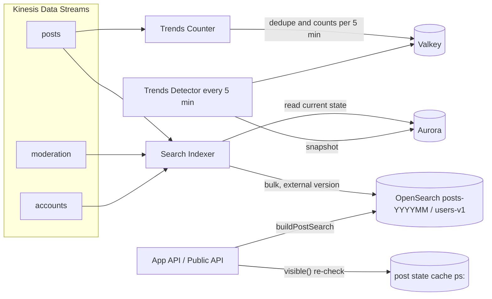
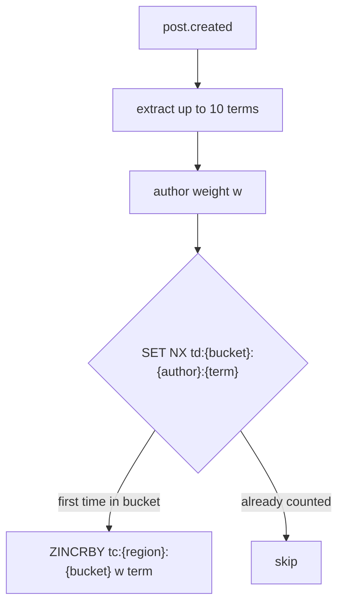

# Search and trends: X

投稿と利用者の全文検索、ハッシュタグ、トレンド。日本語の解析と正規化、索引の形と更新、見える範囲での絞り込み、問い合わせの形、トレンドの数え方と急上昇の検出、操作への強さを決める。

前提となる決定は、見える範囲は読み出しの時に `visible()` で決め、索引には粗い絞り込みの印だけを入れること（[ADR-0004](../decisions/0004-single-tenant-and-visibility.md)）、出来事のログから索引を作ること（[ADR-0005](../decisions/0005-event-log-and-outbox.md)）、投稿の ID が時刻の順を運ぶこと（[ADR-0002](../decisions/0002-post-ids-and-ordering.md)）、投稿の状態と `state_version`（[ADR-0009](../decisions/0009-post-state-tombstones-and-state-cache.md)）、検索の核を自前で作ること（[ADR-0001](../decisions/0001-platform-and-stack.md)）。要件は NFR-007（投稿から検索まで p95 15 秒、応答 p99 500ms、日本語の部分一致で取りこぼさない、トレンドの更新 5 分ごと）と NFR-009。法務の確認待ちは L4（地域の推定に使う情報）。この文書で決めたことは次の ADR にある。

| ADR | 決定 |
| --- | --- |
| [0025](../decisions/0025-search-engine-and-japanese-analysis.md) | Amazon OpenSearch Service を使う。一致の判定は 1〜2 文字の N-gram のフィールドで連続を求め（取りこぼさない）、関連度の点は kuromoji のフィールドで付ける。正規化は `packages/text` の `normalizeForSearch`（NFKC、小文字、長音と波ダッシュの統一）で、索引と問い合わせの両方にかける。ひらがなとカタカナは同一視しない。Sudachi は `search-poc` で比べる |
| [0026](../decisions/0026-search-index-layout-and-visibility.md) | 投稿の索引は月ごとに分け、投稿の `tid` の時刻で書き先を決める。書き込みは `state_version` を外部の版にして古い版で上書きしない。削除は墓石。問い合わせは 1 つの組み立て関数だけで作り、削除・措置・鍵・ブロックの条件を必ず含め、返す前に `visible()` で判定し直す。検索はログインした人だけ |
| [0027](../decisions/0027-trends-burst-detection.md) | トレンドは、全国と 8 つの地方ごとに、5 分の区切りで語ごとの「重み付きの一意の投稿者の数」を数える。1 人は 1 つの語に区切りあたり 1 回だけ数え、新しい・スパムの点の高いアカウントの重みを下げる。急上昇は直近 15 分と基準の差をポアソンの揺れで割った点で決め、最低の人数と増え方の比を満たすものだけを出す。T&S は語を即座に外せる |

## 1. 範囲

- 扱う：投稿の検索（「話題」と「最新」）、利用者の検索、ハッシュタグの検索と一覧、検索の語の補完、日本語の正規化と解析、索引の形・更新・作り直し、見える範囲での絞り込み、トレンド（語の取り出し、数え方、急上昇の検出、地域、操作への強さ、除外、表示）。
- 扱わない：
  - DM の検索。MVP に含めない。DM は本人だけの表にあり、索引に入れない（[direct-messages.md](direct-messages.md)）。
  - ブックマークの中の検索。MVP の後。
  - おすすめの並び（[ranking-and-recommendation.md](ranking-and-recommendation.md)）。話題の源はトレンドの出力を読む。
  - 公開 API の検索の形と課金（[api-and-rate-limits.md](api-and-rate-limits.md)）。この文書の問い合わせの組み立てを使う。
  - OpenSearch のドメインの台数と費用（[infrastructure.md](infrastructure.md)、[capacity.md](capacity.md)）。

## 2. 事実（確かめたこと）

いずれも 2026-10-04 に確認。

| 項目 | 事実 | この設計 |
| --- | --- | --- |
| OpenSearch の日本語の解析 | Amazon OpenSearch Service は、Japanese（kuromoji）と ICU の解析をすべてのドメインに入れている。Sudachi は任意のプラグインで、AWS は日本語に Sudachi を勧める。Sudachi の辞書を差し替えても、次の blue/green のデプロイまで反映されない（[Plugins by engine version](https://docs.aws.amazon.com/opensearch-service/latest/developerguide/supported-plugins.html)） | S1 は追加の部品の要らない kuromoji で始め、Sudachi は `search-poc` で比べる（ADR-0025） |
| 他の題材の先例 | Slack の題材は、一致の判定を 1〜2 文字の N-gram、関連度を形態素解析に分けた（[Slack の search.md](../../../slack/docs/architecture/search.md) の 5.2 節） | 同じ分け方を採る |
| 本家の検索の演算子 | `from:`、`since:`、`until:`、`lang:`、`filter:` などの演算子を持つとされる | 本家の文書は確かめておらず**未検証**。この設計の構文（6.2 節）は自前に決める |
| 本家のトレンド | 地域と、フォローしている人などで個人化し、人気よりも「今増えているもの」を出すとされる | help.x.com は 403 で**未検証**。この設計は地域だけで個人化しない（9 節） |
| 本家の検索のログインの要否 | ログインしていない人の検索を止めたと報じられた | 第三者の報道で**未検証**。この設計は、取り込み（スクレイピング）を抑えるため、検索をログインした人に限る（6.1 節） |

## 3. 要件

| 要件 | 値 | 出どころ |
| --- | --- | --- |
| 索引の遅れ | 投稿の確定から検索に出るまで p95 15 秒 | NFR-007 |
| 応答 | 検索の応答 p99 500ms（サーバー） | NFR-007 |
| 取りこぼし | 日本語の部分一致で取りこぼさない。例示テストの集まりで取りこぼし 0（[quality.md](../quality.md) の E9） | NFR-007 |
| トレンドの更新 | 5 分ごと | NFR-007 |
| 見える範囲 | 索引の遅れの間も、`hide` の投稿を返さない。削除・措置から 60 秒で検索に出ない | NFR-009 |
| スパム | トレンドにスパムと措置の対象を出さない | NFR-011 |
| 中身をログに出さない | 検索の語・本文をログ・メトリクス・トレースに出さない。語は長さと種類（日本語・英字・記号）だけを計測する | [quality.md](../quality.md) の 2.1 節 |

## 4. 構成



- Search Indexer と Trends Counter は、`posts` の流れの別々の消費者（[ADR-0005](../decisions/0005-event-log-and-outbox.md)）。どちらかが遅れても、もう一方は遅れない。
- 索引とトレンドの写しは正本ではない。投稿の表と措置の表から作り直せる。

## 5. 正規化と解析

### 5.1 正規化 `normalizeForSearch`

`packages/text` に置き、索引の本文・問い合わせの語・トレンドの語の 3 つに同じ関数をかける。Web とアプリの補完でも同じ関数を使う。

| 段 | 中身 | 例 |
| --- | --- | --- |
| 1 | Unicode の NFKC | 全角英数 → 半角、半角カナ → 全角カナ、`㈱` → `(株)` |
| 2 | 小文字にする | `ABC` → `abc` |
| 3 | 長音と波の記号を揃える | `ー`・`―`・`−`（カナの間）→ `ー`、`〜`・`～` → `〜` |
| 4 | 幅のない文字（ZWJ を除く）と異体字セレクタを除く | `U+200B` を除く |
| 5 | 連続する空白を 1 つにする | — |

- ひらがなとカタカナは同一視しない（[ADR-0025](../decisions/0025-search-engine-and-japanese-analysis.md)）。濁点の有無も区別する。
- 絵文字は残す。ハッシュタグは `#` を除いた語を正規化して `hashtags` に持つ。
- 正規化の版を `norm_version` として文書に持つ。版を変えたら索引を作り直す（7.5 節）。

### 5.2 フィールドと解析

| フィールド | 解析 | 役割 |
| --- | --- | --- |
| `text.gram` | `ngram` の字句の分け方（1〜2 文字、文字と数字） | **一致の判定**。語ごとに `match_phrase` で連続を求める。日本語の語の途中・未知語も取りこぼさない |
| `text` | kuromoji（`search` の分け方、品詞の除外、`kuromoji_baseform`、`ja_stop`） | **関連度の点**。`should` にだけ使う |
| `text.word` | `standard` と小文字 | 英字の語の一致の判定（英字は語の単位で一致させる） |
| `hashtags` | `keyword` | ハッシュタグの完全一致 |
| `mentions` | `keyword`（利用者の ID） | 返信・メンションの検索 |

- 問い合わせの語が英字と数字だけなら `text.word`、日本語を含むなら `text.gram` で一致を判定する。混ざった語（`iPhone16 発売`）は空白で分けてから、語ごとに選ぶ。
- 1 文字の語（「猫」）は `text.gram` の 1 文字の字句で一致する。候補が多いので、時間の上限（6.4 節）で守る。
- 代替のテキスト（メディアの説明、[media.md](media.md) の 7 節）は `text` と同じ解析で `alt_text` に持ち、検索の対象にする。
- N-gram の索引の大きさは、`search-poc` で測る。公式の目安はない（**未検証**）。

## 6. 問い合わせ

### 6.1 入口

- 検索はログインした利用者だけ（画面と公開 API）。ログインしていない人には検索の画面を出さない。
- 利用者ごとの上限は、画面と API の共通の桶で、15 分に 180 回を既定の案にする。値は [api-and-rate-limits.md](api-and-rate-limits.md) で決める。

### 6.2 構文

| 構文 | 意味 |
| --- | --- |
| `語` | 部分一致。空白で区切った語はすべて含む（AND） |
| `"語 語"` | 空白を含めて連続する文字列として一致 |
| `-語` | 含まない |
| `A OR B` | どちらかを含む（1 つの問い合わせに 5 つまで） |
| `#タグ` | ハッシュタグの完全一致 |
| `from:@handle`、`to:@handle`、`@handle` | 作者、返信先、メンション |
| `since:2026-10-01`、`until:2026-10-04` | 日付（JST） |
| `lang:ja` | 言語 |
| `has:media`、`has:video`、`has:link` | メディア・リンクがある |
| `-is:reply`、`is:quote` | 返信を除く、引用だけ |
| `min_likes:100` | いいねの数の下限（数の写しの値。概算） |

- 肯定の語も条件もない問い合わせは `400`。語は 1 つの問い合わせに 20 まで、全体で 512 文字まで。
- `from:` の handle は、問い合わせの時点の handle を利用者の ID に解いて使う。handle の変更の前の投稿も、ID で見つかる。

### 6.3 組み立てと絞り込み

問い合わせは `buildPostSearch(viewer, query)` の 1 か所だけで作る。OpenSearch のクライアントを他の場所から呼ぶことは lint で禁止する。

```json
{
  "query": { "bool": {
    "filter": [
      { "term": { "deleted": false } },
      { "term": { "mod_hidden": false } },
      { "term": { "search_excluded": false } },
      { "term": { "author_suspended": false } },
      { "bool": { "must_not": { "terms": { "mod_regions": ["<閲覧者の地域>"] } } } },
      { "bool": { "should": [
          { "term": { "author_protected": false } },
          { "terms": { "author_id": ["<閲覧者>", "<承認済みの鍵の作者>"] } } ] } }
    ],
    "must_not": [
      { "terms": { "author_id": ["<ブロックした・された・ミュートした作者>"] } }
    ],
    "must":   [ { "match_phrase": { "text.gram": "<語>" } } ],
    "should": [ { "match": { "text": "<語>" } } ]
  } }
}
```

- 閲覧者の集合（ブロック・ミュート・承認済みの鍵）は、`visible()` と同じ写し（[ADR-0004](../decisions/0004-single-tenant-and-visibility.md)）から取る。`terms` は 1 万件までにし、超えた分は返す前の `visible()` だけで落とす。
- ミュートの語は、問い合わせの `must_not` に入れる（`text.gram` の `match_phrase`）。
- **返す前に `visible(viewer, post)` で判定し直す。** 判定には投稿の状態の写し（`ps:`、[ADR-0009](../decisions/0009-post-state-tombstones-and-state-cache.md)）を使う。索引の更新の遅れの間の漏れを防ぐ。
- 判定で落ちた件数を `search_visibility_drop` として理由ごとに数える。削除・措置の直後（60 秒以内）の分は想定内。それ以外（ブロック、鍵）が続くなら、組み立ての条件の漏れとして調べる。
- ページの件数が足りなければ、1.5 倍を取り直す。取り直しは 2 回まで。足りなくても、そのまま返す。

### 6.4 並べ方、ページング、時間の上限

| タブ | 並べ方 | ページング |
| --- | --- | --- |
| 最新 | `post_id`（`tid`）の降順 | `search_after`（`post_id`）。深さの上限なし（日付の範囲で絞って辿れる） |
| 話題 | `score = BM25(text) · log1p(likes + 2·reposts + replies) の正規化 · 0.5^(age_hours/24)`。作者ごとに 1 ページ 2 件まで | `search_after`（点、`post_id`）。1,000 件まで |

- 話題のタブは、直近 7 日の投稿を既定の範囲にする（`since:` で広げられる）。
- 数（いいね・リポスト）は、索引の更新の時の値で、10 分ごとに人気の投稿だけ更新する（7.3 節）。
- サーバーの時間の上限は 400ms（OpenSearch の `timeout`）。超えたら途中の結果を返し、`partial = true` を付ける。
- スパムの点の高い作者（0.7 以上）の投稿は、話題のタブで点を 0.3 倍にする。最新のタブでは「質の低い返信」と同じ扱いで、末尾の「さらに表示」に寄せる。

### 6.5 利用者の検索と補完

- `users-v1` の索引：`handle`（`keyword` と、前方一致の `edge_ngram` 1〜15）、`display_name`（`text.gram` と kuromoji）、`bio`（kuromoji）、`followers_log`（数の対数を丸めた値）、`protected`、`suspended`、`state_version`。
- 並べ方：handle の完全一致 > handle の前方一致 > 表示名の一致。同じ段の中は、閲覧者がフォローしている人、`followers_log` の順。
- 凍結・削除のアカウントは出さない。鍵アカウントは出す（プロフィールの存在は公開の情報）。ブロックした・された人は出さない。
- 補完（入力中の候補）は、利用者の handle の前方一致と、ハッシュタグの前方一致を合わせて 8 件。トレンドの語も候補に入れる。

## 7. 索引の更新

### 7.1 文書の形（投稿）

| 項目 | 中身 |
| --- | --- |
| `post_id`、`author_id`、`conversation_id`、`reply_to_user_id`、`quote_of_id` | ID（文字列で持つ。数の型は 53 ビットを超えるため使わない） |
| `created_at` | `tid` から取り出した時刻 |
| `text`（`text.gram`、`text.word`）、`alt_text` | 正規化した本文と代替のテキスト |
| `hashtags`、`mentions`、`urls_domain`、`lang` | 抜き出した値 |
| `has_media`、`has_video`、`has_link`、`is_reply`、`is_quote` | 条件の印 |
| `deleted`、`mod_hidden`、`mod_regions`、`search_excluded`、`sensitive` | 粗い絞り込みの印（[ADR-0004](../decisions/0004-single-tenant-and-visibility.md)） |
| `author_protected`、`author_suspended` | 作者の状態の印 |
| `likes`、`reposts`、`replies` | 数（概算） |
| `state_version`、`norm_version` | 版 |

- リポストは文書にしない（元の投稿を検索する）。引用は自分の本文を持つ投稿として入れる。

### 7.2 流れ

1. Search Indexer は `posts`・`moderation`・`accounts` の流れを読み、出来事を「きっかけ」として扱う。
2. 投稿の現在の状態（本文、`state`、`mod_flags`、`state_version`、作者の鍵と凍結）を Aurora から読む。reader の遅れで古い版を読んだら、版の比較で捨てられるので害はない。最新の版が出来事の版より古ければ、1 秒待って 3 回まで読み直す。
3. 文書を作り、`version_type = external_gte`・`version = state_version` で書く。古い版で新しい版を上書きしない。
4. 書き込みは 1 秒か 1,000 件ごとに `_bulk` でまとめる。`refresh_interval` は 1 秒。
5. 失敗した文書は SQS の再試行の待ち行列に入れ、5 回で DLQ とアラート。

| 区間 | 目安 |
| --- | --- |
| 確定 → Relay → Kinesis | 1 秒 |
| Kinesis → Indexer | 1 秒 |
| Aurora の読み出しとまとめ書き | 1.5 秒 |
| 検索に見えるまで（refresh） | 1 秒 |
| 合計の目安 | 5 秒（目標 p95 15 秒の中） |

### 7.3 作者の状態と数の更新

- 作者の鍵の切り替え・凍結・解除は、`accounts` の流れから、その作者の文書を `update_by_query`（`author_id` で絞る）で更新する。投稿の多い作者は時間がかかるので、更新の間は返す前の `visible()` が守る。作業は作者ごとに 1 つに絞り、途中で失敗したら最初からやり直す（冪等）。
- 数（いいね・リポスト・返信）は、Counter Aggregator の書き戻し（[engagement-and-counters.md](engagement-and-counters.md)）を待たず、10 分ごとに「直近 7 日の、数が 10 以上変わった投稿」だけを部分更新する。数の更新は `state_version` を上げないので、版の比較の外で、`script` で単調に大きい値だけを書く。

### 7.4 削除

- 削除・措置の非表示は墓石（`deleted = true` か `mod_hidden = true`、本文と代替のテキストを空）で書く。物理に消すと、遅れて届いた古い版の書き込みで戻りうるため。
- 墓石は 7 日後に、定期のジョブが `delete_by_query` で消す。
- 措置の取り消しは、`state_version` の上がった新しい文書として書き直す。

### 7.5 索引の形と作り直し

- 投稿の索引は月ごとに分ける（`posts-YYYYMM`）。書き先は `post_id` の `tid` の時刻で決まるので、古い投稿の更新も同じ索引に届く（[ADR-0026](../decisions/0026-search-index-layout-and-visibility.md)）。
- 読み出しは別名 `posts-read`（全月）。「最新」の既定の範囲が直近なので、日付の範囲に合わない索引は OpenSearch が速く飛ばす。
- 主シャードは、S1 で月あたり 3（1 シャード 30〜50 GB を目安）。S2 で直近 3 か月より前を UltraWarm に移す。値は `search-poc` と [capacity.md](capacity.md) で決める。
- マッピングや正規化の版を変えるときは、新しい索引の組（`posts-v2-YYYYMM`）を作り、二重書き込み → Aurora からの埋め直し（`post_id` の順、チェックポイントつき）→ 件数と抜き取りの一致の検証 → 別名の付け替えの順で移る。古い組は 2 週間残してから消す。

## 8. 失敗のしかた（検索）

| 事象 | 影響 | 扱い |
| --- | --- | --- |
| OpenSearch の遅れ・一部のシャードの失敗 | 結果が欠ける | 時間の上限で途中の結果を返す。`partial` を付ける |
| OpenSearch のドメインの停止 | 検索ができない | `503` と「検索は一時的に使えません」。タイムライン・投稿には影響しない |
| Indexer の遅れ | 新しい投稿が出ない | `search_index_lag` で検知（[runbooks/README.md](../runbooks/README.md) の 1 節）。見える範囲は返す前の判定で守る |
| 索引の喪失・破損 | 検索が空になる | Aurora からの埋め直し（7.5 節の手順）。直近 7 日を先に埋める |
| 組み立ての条件の漏れ（不具合） | 見てはいけない投稿が候補に入る | 返す前の `visible()` で落ちる。`search_visibility_drop` の理由で検知する |

## 9. トレンド

### 9.1 語の取り出し

- Trends Counter は `posts` の流れの作成の出来事を読む。リポストは数えない（引用は数える）。返信は数える。
- 1 件の投稿から最大 10 の語を取る：
  - ハッシュタグ（正規化したもの）。
  - 本文を kuromoji の辞書（IPADIC）で形態素に分け、連続する名詞（固有名詞、一般名詞、サ変接続）の 1〜3 つの並びで、2 文字以上のもの。数字だけ・記号だけの語、止め語（自前の一覧）を除く。
  - 解析には kuromoji.js（第三者の汎用の部品）を使う。OpenSearch の解析と完全には一致しなくてよい（トレンドの語は表示と検索の語として使い、検索は `text.gram` の一致で取りこぼさないため）。
- 語の正規化は `normalizeForSearch`。表示には、区切りの中で最も多く使われた元の表記を使う。
- 電話番号・メールアドレス・URL の形をした語は取らない。

### 9.2 地域

- 地域は「全国」と 8 つの地方（北海道、東北、関東、中部、近畿、中国、四国、九州・沖縄）。都道府県の単位は S2 で検討する。
- 投稿の地域は、作者がプロフィールの設定で選んだ地方を使う。設定がなければ、投稿の時の IP アドレスから推定した都道府県を地方に丸めて使い、地域の値だけを残す（IP アドレスはトレンドの側に持たない）。IP アドレスからの推定を使ってよいかと、本人への説明は L4 の確認待ち。確認までは、設定のある作者だけを地方に数え、全国は全員を数える。
- 閲覧者に出す地域は、閲覧者の設定の地方。設定がなければ全国。

### 9.3 数え方



- 区切りは 5 分。キーは `tc:{region}:{bucket}`（語ごとの重み付きの数のソート済みの集合）と、重複の印 `td:{bucket}:{author_id}:{term}`（10 分で消える）。
- **1 人の作者は、1 つの語に、1 つの区切りで 1 回だけ数える。** 連投で数を増やせない。
- 作者の重み `w`：

```
w = age_factor · trust_factor
age_factor   = min(1, account_age_days / 30)          （登録 7 日未満は 0）
trust_factor = 0      （スパムの点 ≥ 0.7、凍結・読み取りだけの措置、電話番号もメールも未確認）
             = 1 − spam_score   （それ以外）
```

- 2 時間を超えた区切りの集合は消す。毎時、全国と地方ごとに上位 1 万語の 1 時間の数を `tb:{region}` に足し込み、基準（9.4 節）を更新する。

### 9.4 急上昇の検出

5 分ごとに Trends Detector が、地域ごとに次を計算する。

```
c   = 直近 3 区切り（15 分）の重み付きの数
e   = 基準：同じ語の 15 分あたりの数の指数移動平均（半減期 24 時間）
      基準のない語は e = 0.5
z   = (c − e) / sqrt(e + β)          β = 5
条件：c ≥ c_min（全国 30、地方 10）かつ c / (e + 1) ≥ 3
```

- 条件を満たす語を `z` の順に並べ、上位 50 を候補にする。候補に除外（9.5 節）をかけ、全国 30 件・地方 20 件を出す。
- 前回のトレンドにあった語は、`z` が 0 を下回るか 2 時間たつまで残す（ばたつきを防ぐ）。表示の順は今回の `z` で決める。
- 同じものを指す語（ハッシュタグと同じ語、`○○選手` と `○○`）は、同じ投稿の集合を 70% 以上共有するなら 1 つにまとめ、`z` の高い表記を出す。共有の割合は、区切りの中の投稿の ID の抜き取り（語ごとに 200 件）で推定する。
- 値（`β`、`c_min`、比 3、半減期）は自前の初期値で、`ops.trends.*` で持つ。S1 の運用の後、人の評価（トレンドの抜き取りの妥当さ）で決め直す。

### 9.5 操作への強さと除外

| 手口 | 対策 |
| --- | --- |
| 1 人の連投 | 区切りあたり 1 回（9.3 節） |
| 新しいアカウントの大量の投稿 | 登録 7 日未満は重み 0、30 日で 1 に上がる |
| ボットの群れ | スパムの点・未確認のアカウントは重み 0。候補の語ごとに、寄与した作者のうち登録 30 日未満の割合と、本文の近さ（SimHash のハミング距離 3 以内）の割合を測り、どちらかが 50% を超えたら出さずに T&S の待ち行列へ送る |
| 同じ文の貼り付け | 上と同じ（本文の近さ） |
| リポストでの水増し | リポストは数えない |
| 措置・不適切な語 | T&S の除外の一覧（`trend_overrides`）にある語は出さない。T&S は作業の画面から語を外せ、60 秒以内に反映する |
| 個人の名前のさらし | 一般の個人の名前を出さないため、地方のトレンドで新しく出る語（基準が 0.5 の語）は、全国より c_min を高く（20）する。苦情は T&S の通報の経路で受ける |
| 措置の済んだ投稿 | 語の例の投稿は検索の経路で出すので、`visible()` で落ちる。措置された投稿の作者は重み 0 にする |

- トレンドの抜き取り（週ごと、全国と地方の上位 10 件の 1 か月ぶん）で、操作・スパムと判断した割合を測る（NFR-011 の補助の指標）。

### 9.6 表示

- 5 分ごとの結果を `trend_snapshots` に書き、Valkey の `trends:{region}` に置く。画面と API はそこから読む。
- 件数は概算として丸めて出す（「1,000 件以上」「1 万件以上」）。重み付きの数は出さない。
- トレンドの語を押すと、その語の検索（話題のタブ、直近 24 時間）に移る。例の投稿は検索の経路を通り、`visible()` を通る。
- トレンドは個人化しない（地域だけ）。フォローしている人の関心での個人化は S2 で検討する（L4）。

### 9.7 失敗のしかた（トレンド）

| 事象 | 扱い |
| --- | --- |
| Trends Counter の遅れ | 区切りの数が少なく出る。遅れが 5 分を超えたら、Detector は前回の結果を出し続ける（`stale` の印） |
| Valkey の喪失 | 2 時間ぶんの数と基準を失う。基準は `trend_baselines`（毎時の写し）から戻し、数は流れの読み直し（直近 2 時間）で戻す |
| 地震などの大きな出来事 | 多くの語が同時に急上昇する。上限の件数で切るだけで、特別な扱いはしない。T&S が誤情報の語を外す |

## 10. 上限

| 対象 | S1 の値 | 持ち場所 |
| --- | --- | --- |
| 検索の回数 | 15 分に 180 回（案） | [api-and-rate-limits.md](api-and-rate-limits.md) |
| 問い合わせの語 | 20 語、512 文字、`OR` 5 つ | 固定 |
| 1 ページ | 20 件（API は 100 件まで） | 固定 |
| 話題のタブの深さ | 1,000 件 | 固定 |
| サーバーの時間の上限 | 400ms | `ops.search.timeout_ms` |
| `terms` の閲覧者の集合 | 1 万件 | 固定 |
| 墓石の保持 | 7 日 | 固定 |
| トレンドの語 | 1 投稿 10 語 | `ops.trends.max_terms_per_post` |
| トレンドの件数 | 全国 30、地方 20 | `ops.trends.*` |
| トレンドの区切り | 5 分、検出の窓 15 分、数の保持 2 時間 | `ops.trends.*` |

## 11. data-model への項目

| 置き場所 | 中身 | 節 |
| --- | --- | --- |
| OpenSearch `posts-YYYYMM`（別名 `posts-read`） | 投稿の文書（7.1 節） | 7 |
| OpenSearch `users-v1` | 利用者の文書（6.5 節） | 6.5 |
| OpenSearch `hashtags-v1` | ハッシュタグと直近 7 日の使用の数（補完用） | 6.5 |
| Aurora `search_reindex_jobs`（`job_id`、`kind`（`author_state`・`mapping`・`backfill`）、`target`、`checkpoint`、`status`、`started_at`、`finished_at`） | 作者の状態の更新と作り直しの進み | 7.3、7.5 |
| Valkey `tc:{region}:{bucket}`（ソート済みの集合、2 時間）、`td:{bucket}:{author_id}:{term}`（10 分） | トレンドの数と重複の印 | 9.3 |
| Valkey `tb:{region}`（ハッシュ：語 → 指数移動平均、更新の時刻） | 基準 | 9.4 |
| Valkey `trends:{region}` | 表示用の最新の結果 | 9.6 |
| Aurora `trend_snapshots`（`region`、`computed_at`、`rank`、`term`、`display_term`、`z`、`count_bucket`）。主キー `(region, computed_at, rank)`。保持 90 日 | 結果の記録（運用の状況の報告と調査） | 9.6 |
| Aurora `trend_baselines`（`region`、`term`、`ewma`、`updated_at`）。毎時の写し | 基準の作り直し | 9.7 |
| Aurora `trend_overrides`（`id`（UUIDv7）、`term`、`region`（null は全国）、`action`（`exclude`・`hold`）、`reason_code`、`moderation_action_id`、`created_by`、`created_at`、`expires_at`） | T&S の除外 | 9.5 |
| Aurora `user_settings` の列 `region`（地方。accounts-and-auth の領域の表に足す） | 地域 | 9.2 |
| `posts` の列 `region_code`（作成の時に決めた地方。posts-and-ids の領域の表に足す。L4 の確認待ち） | トレンドの地域 | 9.2 |

## 12. テストと性質

| ID | 性質・試験 |
| --- | --- |
| PROP-SRCH-001 | 任意の投稿・措置・ブロック・鍵の切り替えの列と、任意の索引の遅れに対して、検索が返す投稿はすべて、その時点の `visible()` が `show` を返す |
| PROP-SRCH-002 | 任意の順・重複の出来事を Indexer に与えても、最後の文書は Aurora の最新の状態（`state_version` の最大）と一致する。墓石は古い版で戻らない |
| PROP-SRCH-003 | 任意の `SearchQuery` について、`buildPostSearch` の結果は 6.3 節の `filter` をすべて含む |
| PROP-SRCH-004 | `normalizeForSearch` は冪等（2 回かけても同じ）で、Web・アプリ・サーバーで同じ結果になる |
| PROP-TRND-001 | 任意の投稿の列で、1 人の作者が 1 つの語の 1 つの区切りに足す値は、その作者の重み以下 |
| PROP-TRND-002 | 重み 0 の作者（7 日未満、スパムの点 0.7 以上、措置）だけの投稿をいくら足しても、トレンドの結果は変わらない |
| PROP-TRND-003 | `trend_overrides` の `exclude` にある語は、反映の後のどの結果にも出ない |
| 例示 | 日本語の例の集まり：語の途中（「東京都庁」を「京都」で見つける）、カタカナの未知語、全角・半角、長音の揺れ、1 文字の語、英字と日本語の混在、絵文字、ハッシュタグ。取りこぼし 0（[quality.md](../quality.md) の E9） |
| 結合 | 漏れの経路の表の「検索・ハッシュタグ・トレンドの例」の行の 5 つの主体（[quality.md](../quality.md) の 2.2.1 節） |
| 結合 | 削除・措置から 60 秒以内に検索に出ない（合成監視と同じシナリオ） |
| 試験 | 合成の操作（新しいアカウントの群れ、同じ文の貼り付け、1 人の連投）で、トレンドに出ないか待ち行列に送られる |
| 負荷 | 検索 p99 500ms、索引の遅れ p95 15 秒（[capacity.md](capacity.md)） |

## 13. Story の候補

| Epic | Story | 中身 |
| --- | --- | --- |
| E9 | `search-poc` | kuromoji と Sudachi、N-gram の大きさ、月ごとの索引のシャード、p99（5・7.5 節）。E9 の前 |
| E9 | `search-normalization` | `normalizeForSearch` と例の集まり（5.1 節） |
| E9 | `search-indexer` | 流れの消費、版つきの書き込み、墓石、作者の状態の更新（7 節） |
| E9 | `post-search` | 構文、`buildPostSearch`、返す前の `visible()`、2 つのタブ（6 節） |
| E9 | `user-search` | 利用者の索引と補完（6.5 節） |
| E9 | `search-reindex` | 版を変える作り直しの手順（7.5 節） |
| E9 | `trends` | 語の取り出し、数え方、検出、表示（9 節） |
| E9 | `trends-manipulation-defense` | 重み、群れと貼り付けの検出、`trend_overrides`、T&S の待ち行列（9.5 節） |
| E9 | `trends-regional` | 地方の地域。法務：L4（IP アドレスからの推定） |

## 14. 未解決の問い

### 決定（2026-10-04、既定案）

- **検索の部品と解析**：OpenSearch。一致は N-gram、点は kuromoji（ADR-0025）。
- **ひらがなとカタカナ**：同一視しない。Slack の題材と同じ理由（同一視すると索引と問い合わせの両方に同じ変換が要り、差の源になる）。
- **索引の形**：月ごとの索引、`tid` の時刻で書き先を決める、`state_version` の外部の版（ADR-0026）。
- **検索の入口**：ログインした人だけ。
- **ミュートの扱い**：ミュートした作者と語は、検索の結果からも除く。
- **トレンドの地域**：全国と 8 つの地方。個人化しない（ADR-0027）。

### 持ち越し

| 問い | いつ・どう決めるか |
| --- | --- |
| Sudachi に替えるか、N-gram の索引の大きさと費用 | E9 の前の `search-poc` |
| 投稿の時の IP アドレスから地方を推定してよいか（L4） | 法務の確認待ち。E9 の `trends-regional` の spec の承認の前 |
| トレンドの値（`β`、`c_min`、比、半減期） | S1 の運用の後、人の評価で |
| 都道府県のトレンド、関心による個人化 | S2 で検討 |
| 選挙の期間のトレンドの扱い（L9） | 法務の確認待ち |
| 公開 API での検索の範囲（直近 7 日か全期間か）と課金 | [api-and-rate-limits.md](api-and-rate-limits.md) |
