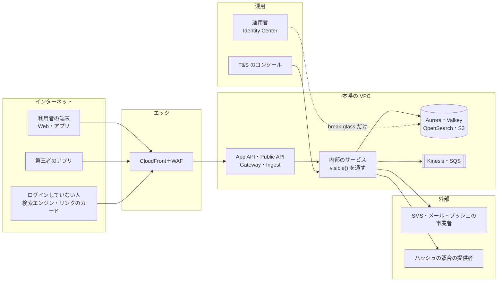
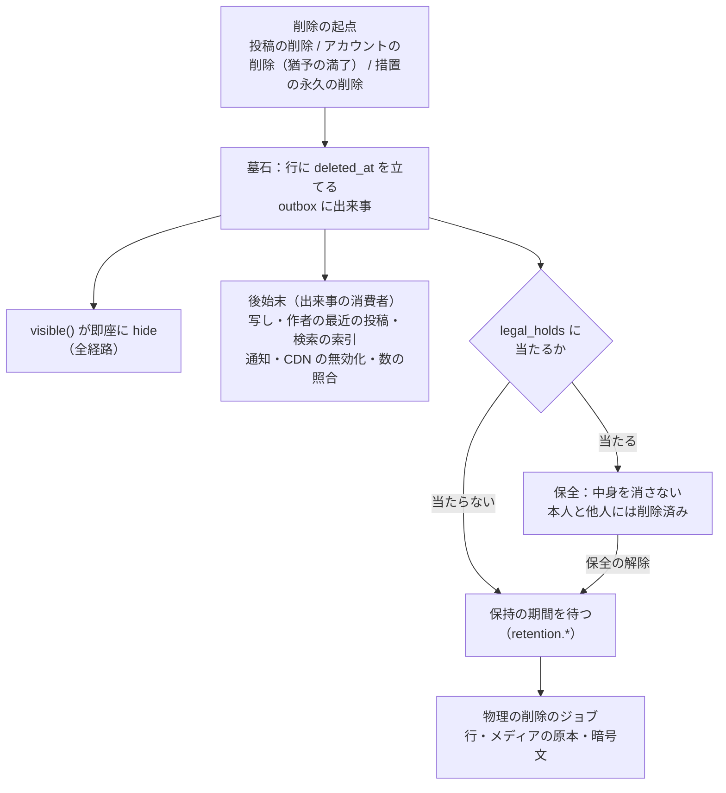
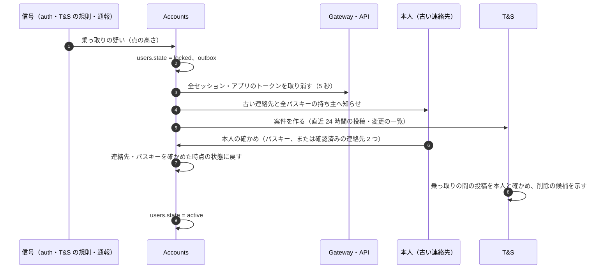

# Security: X

脅威モデル、暗号化と鍵の配置、本人だけの表の RLS の運用、監査ログと運用者のアクセス、個人データの分類、ログに出さないもの、データのライフサイクル（保持・削除・法的な保全）、乗っ取りへの対応、脆弱性の管理、インシデントへの対応を決める。法令の解釈は結論を出さず、[intent.md](../intent.md) の「法務の確認待ち」の番号で参照する。

| ADR | 決定 |
| --- | --- |
| [0051](../decisions/0051-encryption-and-key-layout.md) | KMS の鍵をデータの種類ごとに分ける（`aurora`、`pii`、`pii-logs`、`dm-content`、`media`、`lake`、`audit`、`secrets`）。電話番号・メールアドレス・生年月日・ログインの IP アドレスは、DB の保存の暗号化に加えて、アプリの層で封筒の暗号化をし、検索は鍵付きの HMAC の列で行う。鍵はマルチリージョンの鍵で大阪に複製する |
| [0052](../decisions/0052-audit-and-operator-access.md) | 監査ログは、Aurora の追記だけの表に書き、同じ内容を Firehose で log-archive の S3（Object Lock）へ送る。本番の DB への人の常時のアクセスを置かず、読み出しは理由（案件の ID）を必須にした決まったロールと、2 人の承認の break-glass だけにする。DM の中身を人が読む手順は、法務の L3 が済むまで作らない |
| [0053](../decisions/0053-data-lifecycle-and-retention.md) | データを種類ごとの保持の方針の表で管理し、法令に関わる期間は法務の L2・L8 の値を入れるまで「消さない」を既定にする。削除はアカウント・投稿ごとの削除の流れ（墓石 → 写し・索引・メディアの後始末 → 物理の削除）で行い、法的な保全（`legal_holds`）がかかった対象は止める。バックアップは 35 日で切れることを削除の約束に含める |

前提は、テナントが 1 つで本人だけの表を FORCE RLS で守ること（[ADR-0004](../decisions/0004-single-tenant-and-visibility.md)）、確定した変更を outbox から流すこと（[ADR-0005](../decisions/0005-event-log-and-outbox.md)）、ML が安全の判定を上書きしないこと（[ADR-0006](../decisions/0006-ranking-boundary.md)）。

## 1. 目標と前提

| 目標 | 指標 |
| --- | --- |
| 見てはいけないものを見せない | NFR-009：見えた事象 0 件。`visible()` の漏れは [quality.md](../quality.md) の 2.2.1 節の表と抜き取りの監査で見る。この文書は、`visible()` を迂回する経路（運用者、バックアップ、データレイク、ログ）を塞ぐ |
| 本人だけのデータを守る | DM・ブックマーク・通知・下書き・ログインの記録を、本人と、法令に基づく手続きを経た場合を除き、誰も読まない（[intent.md](../intent.md) の「守るべき振る舞い」） |
| 乗っ取りを早く止める | 乗っ取りの疑いから `locked` まで 5 分以内（8 節） |
| 開示・保全の要請に応える | 法令の手続きに必要な記録を、決めた期間だけ持ち、勝手に消さない・増やさない（AGENTS.md の規則、法務の L2・L7） |

- 前提：AWS の東京（DR は大阪）。運用者は社員と、T&S の委託先。委託先は作業の画面（T&S のコンソール）だけを使い、AWS の権限を持たない。

## 2. 信頼境界

| 境界 | 越えるもの | 守り |
| --- | --- | --- |
| 端末 ↔ エッジ | セッション、投稿、メディア | TLS 1.2 以上、WAF、レート制限（[api-and-rate-limits.md](api-and-rate-limits.md)） |
| エッジ ↔ 入口 | 要求 | CloudFront の秘密のヘッダー、ALB はマネージドプレフィックスリストだけ（[infrastructure.md](infrastructure.md) の 2 節） |
| 入口 ↔ 内部 | 利用者の ID、`ViewerContext` | Service Connect の TLS、サービスごとの IAM ロール、`Visible<Post>` の型 |
| 内部 ↔ データ | SQL、Valkey の命令 | DB のロールの分離、`SET LOCAL app.actor_id`、isolated のサブネット |
| 運用 ↔ データ | 調査の読み出し | 理由の記録、break-glass、監査（6 節） |
| 内部 ↔ 外部の事業者 | 電話番号、メール、プッシュのトークン、ハッシュ | 送る項目を最小にする、egress の許可リスト。外国にある第三者への提供は法務の L4 |

## 3. 脅威モデル（STRIDE）

### 3.1 クライアント

| 脅威 | 種類 | 対策 |
| --- | --- | --- |
| 盗まれた端末から DM・セッションを読む | I | DM の中身を手元に保存しない、アプリのトークンは Keychain・Keystore（[clients.md](clients.md) の 4 節）。端末の一覧から取り消し |
| XSS で本文・プロフィールから台本を動かす | T・E | 本文は `packages/text` の抜き出しの範囲で描き、HTML を解釈しない。CSP（`script-src 'self'`、インラインの台本なし）、Trusted Types |
| 偽のアプリ・改ざんしたアプリ | S | アプリの証明（App Attest、Play Integrity）を登録と投稿の危険の評価の入力にする（拒否はしない。誤判定の影響が大きいため） |
| OTA の更新の差し替え | T | `expo-updates` のコード署名（[delivery.md](delivery.md) の 5 節） |

### 3.2 入口（App API・Public API・Gateway・Ingest）

| 脅威 | 種類 | 対策 |
| --- | --- | --- |
| クレデンシャルスタッフィング | S | パスワードを持たない（[ADR-0043](../decisions/0043-auth-methods-and-sessions.md)） |
| SMS の送信料の詐取 | D・R | 日本の番号だけ、連絡先・IP・全体の上限、Valkey が落ちたら止める（[accounts-and-auth.md](accounts-and-auth.md) の 4.4 節） |
| 列挙（連絡先・ハンドル・鍵アカウントの投稿の有無） | I | 同じ応答と時間、見えない投稿は `not_found` |
| トークンの漏れ（公開のリポジトリ） | S | 接頭辞とチェックサム、シークレットスキャンの通報で取り消し（[api-and-rate-limits.md](api-and-rate-limits.md) の 4.2 節） |
| 閲覧の出来事の水増し | T | Ingest でセッションと端末を確かめ、機械の送信を落とす。表示の数は概算と明示（[engagement-and-counters.md](engagement-and-counters.md)） |
| 大量の要求 | D | WAF（Bot Control、IP の評判、レート）、トークンバケット、全体の天井 |

### 3.3 内部のサービス

| 脅威 | 種類 | 対策 |
| --- | --- | --- |
| `visible()` を通らない新しい読み出しの経路 | I | `Visible<Post>` の型と lint、漏れの経路の表、抜き取りの監査（ADR-0004） |
| ML の点で見える範囲を変える | I・E | ランキングの段の境界（ADR-0006） |
| 本人だけの表を別の利用者として読む | I | FORCE RLS と `SET LOCAL`、マイグレーションの検査（9 節） |
| 出来事の偽造（内部の誰かが Kinesis に直接書く） | S・T | 書けるのは Relay と Ingest の IAM ロールだけ（ADR-0005 の lint と IAM） |

### 3.4 データの置き場所

| 脅威 | 種類 | 対策 |
| --- | --- | --- |
| DB のスナップショットの持ち出し | I | KMS の鍵の利用を決めたロールに限る。電話・メール・IP は封筒の暗号化で、スナップショットだけでは読めない（5.3 節） |
| データレイク（S3・Athena）から本人だけのデータを読む | I | データレイクに本人だけの表を流さない。閲覧の出来事は利用者の ID を仮名（鍵付きの HMAC）にする（7.1 節） |
| 検索の索引からの漏れ | I | 索引は粗い絞り込みの印を持ち、返す前に `visible()`（ADR-0004）。OpenSearch に人の直接のアクセスを置かない |
| バックアップに削除したデータが残る | I | 35 日で切れることを削除の約束に書く（7.4 節） |

### 3.5 運用と T&S

| 脅威 | 種類 | 対策 |
| --- | --- | --- |
| 運用者・委託先の目的外の閲覧 | I・R | 理由の必須、監査、抜き取りの点検（6 節） |
| 運用者のアカウントの乗っ取り | S・E | Identity Center、ハードウェアの鍵（FIDO2）、常時の権限なし |
| T&S の措置の悪用（個人的な凍結） | T・R | 措置の記録の根拠と主体、2 人目の確かめ（大きなアカウントの凍結）、異議の申立て（[trust-and-safety.md](trust-and-safety.md)） |

### 3.6 CI/CD とサプライチェーン

| 脅威 | 種類 | 対策 |
| --- | --- | --- |
| 依存の乗っ取り | T・E | 依存の固定、`npm audit`・OSV の走査、新しい依存は承認（[delivery.md](delivery.md) の 2 節） |
| 本家の実装の取り込み | — | 依存と写しの検査（ADR-0001） |
| CI の秘密の漏れ | I | OIDC で一時の資格情報、フォークの PR に秘密を渡さない |

### 3.7 外部の事業者

| 脅威 | 種類 | 対策 |
| --- | --- | --- |
| プッシュの本文が事業者に残る | I | 本文を入れない形を第一にする（[clients.md](clients.md) の 8.1 節、法務の L4） |
| ハッシュの照合の提供者へ渡す中身 | I | 画像のハッシュだけを送り、画像を送らない形を選ぶ（[trust-and-safety.md](trust-and-safety.md)、[media.md](media.md)） |

## 4. 端末に残るデータ

| 中身 | 残るか | 守り |
| --- | --- | --- |
| セッションのトークン | アプリ：Keychain・Keystore。Web：HttpOnly のクッキー | 端末の一覧から取り消し |
| ホームの写し、プロフィール、通知 | アプリ：SQLite。Web：IndexedDB | 公開の投稿が中心。ログアウトで消す。暗号化しない（OS の端末の暗号化に頼る） |
| DM の中身 | 残さない | メモリーだけ |
| 下書き | 残る | 本人のもの |
| 画像のキャッシュ | 残る | LRU |

- 手元の DB を暗号化しないのは、中身が公開の投稿と本人の下書きで、鍵を端末に置く暗号化は盗難への効き目が小さいため。DM を残さないことで守る。

## 5. 暗号化と鍵

ADR-0051。

### 5.1 転送中

- 外：TLS 1.2 以上（CloudFront のセキュリティポリシー）。HSTS（`includeSubDomains`、`preload`）。
- 内：Service Connect の TLS、Aurora・Valkey・OpenSearch は TLS 必須。

### 5.2 保存時と鍵の配置

| 鍵（KMS、マルチリージョンの鍵） | 使う場所 | 使えるロール |
| --- | --- | --- |
| `aurora` | Aurora のクラスタの保存の暗号化、スナップショット | RDS のサービス |
| `pii` | 電話番号・メールアドレス・生年月日の封筒の暗号化（5.3 節） | `auth`、`notification`（送信の時だけ）、`ts`（開示の手続き） |
| `pii-logs` | ログインの記録の IP アドレス・ポート、投稿の時の IP アドレスの封筒の暗号化 | `auth`、`post`（書くだけ）、`ts`（開示の手続き） |
| `dm-content` | DM の本文の封筒の暗号化（形は [direct-messages.md](direct-messages.md)） | `dm` |
| `media` | S3 のメディアのバケット | `media`、CloudFront（OAC） |
| `lake` | データレイクの S3、Firehose、Athena の結果 | 分析のロール、学習のジョブ |
| `audit` | 監査ログの表の写し、log-archive | 監査の書き込み、監査の読み出し（セキュリティの担当） |
| `secrets` | Secrets Manager（SMS・メールの事業者の鍵、APNs の鍵、OAuth の HMAC の鍵） | 各サービス |
| `stream` | Kinesis・SQS の保存の暗号化 | Relay、Ingest、消費者 |
| `cache` | ElastiCache の保存の暗号化 | ElastiCache のサービス |

- 鍵の使い方を CloudTrail で全部記録する。`pii`・`pii-logs`・`dm-content` の `Decrypt` は、データキーのキャッシュ（5 分）を使っても 1 秒に数千回になりうる。KMS の要求の上限を [capacity.md](capacity.md) の 6 節で確かめる。
- 鍵の削除の予約と無効化は、break-glass のロール以外に SCP で禁止する（[infrastructure.md](infrastructure.md) の 1 節）。

### 5.3 項目の暗号化（電話・メール・生年月日・IP）

- 形：AES-256-GCM。データキーは KMS の `GenerateDataKey` で作り、暗号文と、包んだデータキーを同じ列（`*_ct`）に持つ。データキーは 1 時間ごとに作り直し、タスクのメモリーにだけ置く。
- 検索：等しさの検索が要る項目（電話・メールの重複の判定、ログイン）は、正規化した値の HMAC-SHA256（鍵は Secrets Manager の `contact-hmac`）を別の列（`contact_hmac`）に持つ。HMAC の鍵を変えるときは、2 つの列を並べて書き直す。
- 投稿の時の IP アドレス（開示に使う）は、投稿の行には持たず、`post_origin_logs`（`(post_id, ip_ct, port_ct, created_at)`）に `pii-logs` の鍵で持つ。保持は法務の L2・L8（7.1 節）。

### 5.4 鍵の入れ替え

- KMS の鍵は年ごとの自動の入れ替え。封筒の暗号化のデータキーは古いものも読めるので、書き直しは要らない。
- HMAC の鍵と OAuth の `next_token` の HMAC の鍵は、`kid` を付けて 2 つを並べ、90 日で古い鍵を外す。

## 6. 監査と運用者のアクセス

ADR-0052。

### 6.1 監査ログ

- `audit_events`（追記だけ。UPDATE・DELETE をトリガーで拒む）：`(id, at, actor_kind, actor_id, action, target_kind, target_id, reason_case_id, request_id, result)`。中身（本文、連絡先）は入れない。
- 同じ行を outbox から出来事（`audit`）にし、Firehose で log-archive のアカウントの S3（Object Lock のコンプライアンスの形）へ送る。DB の行が消されても、写しが残る。
- 書くもの：運用者・T&S の読み出し（理由つき）、措置、開示・保全の手続き、break-glass、鍵とロールの変更、本人だけの表の RLS の外での読み出し、データの書き出し、アカウントの状態の変更、OAuth のアプリの停止。

### 6.2 運用者

- 人の AWS の権限は IAM Identity Center の一時のロールだけ。本番の DB・Valkey・OpenSearch に、人の常時のアクセスを置かない。
- 調査は、メトリクス・トレース・中身のないログで行う（9 節）。データを見る必要があれば、T&S のコンソールの決まった画面を使う。
- **break-glass**：本番の DB への直接のアクセスは、2 人の承認（Ops の責任者とセキュリティの担当）、4 時間の期限、全操作の記録（セッションの記録）。使ったら 24 時間以内に振り返りを書く。
- 運用者の端末はハードウェアの鍵での多要素を必須にする。

### 6.3 T&S の読み出し

- T&S のコンソールの読み出しは、`ts_reader` の DB のロールで、RLS を通さない代わりに **案件の ID を必須** にする（ADR-0004）。案件の ID のない読み出しの API は作らない。
- 読める範囲は、案件の種類で決める（通報の対象の投稿とその周り、措置の対象のアカウントの公開の情報、開示の手続きならログインの記録の暗号文を復号した値）。
- **DM の中身を人が読む画面は作らない**（法務の L3 が済むまで。AGENTS.md）。DM の通報は、通報した人が添えたメッセージ（通報した人は当事者）だけを、通報の記録として持つ形を [trust-and-safety.md](trust-and-safety.md) と [direct-messages.md](direct-messages.md) で決める。
- 抜き取りの点検：週ごとに、T&S の読み出しの 1% をセキュリティの担当が見て、理由と範囲が合っているか確かめる。

## 7. データのライフサイクル

ADR-0053。

### 7.1 分類と保持

| 種類 | 例 | 分類 | 保持（既定） |
| --- | --- | --- | --- |
| 公開の投稿・プロフィール | 投稿、プロフィール、フォローの辺、いいね | 公開 | 本人が消すまで。削除の後は 7.2 節 |
| 削除した投稿の中身 | 本文、メディア | 公開だったもの | **法務の確認待ち（L8）**。既定は「物理の削除まで 30 日の墓石の期間」を仮に置き、値が決まるまで物理の削除のジョブを本番で動かさない |
| 本人だけのデータ | ブックマーク、下書き、通知、ミュートの語、設定 | 本人だけ | 本人が消すまで。アカウントの削除で消す |
| DM | 会話、メッセージ | 本人だけ（通信の秘密に当たりうる。L3） | **法務の確認待ち（L8）**。相手がいる会話の扱いは [direct-messages.md](direct-messages.md) |
| 連絡先、生年月日 | 電話、メール | 個人データ（暗号化） | アカウントがある間。削除の後は **法務の確認待ち（L2・L8）** |
| ログインの記録、投稿の時の IP | `login_events`、`post_origin_logs` | 開示に使うログ | **法務の確認待ち（L2・L8）**。値が決まるまで消さない（AGENTS.md の「勝手に消さない・増やさない」） |
| 措置・通報・申出の記録 | `moderation_actions`、通報、申出の案件 | 運用の記録 | **法務の確認待ち（L1・L8）** |
| 監査ログ | `audit_events` | 運用の記録 | **法務の確認待ち（L8）**。log-archive の Object Lock の期間は、値が決まるまで 1 年を置く |
| 出来事のログ | Kinesis | 運用 | 7 日（ADR-0005） |
| データレイク（閲覧・行動の出来事） | 閲覧、いいね、表示 | 仮名の行動の記録 | **法務の確認待ち（L4・L8）**。利用者の ID は鍵付きの HMAC の仮名で入れる |
| アプリのログ・トレース | CloudWatch Logs、X-Ray | 運用（中身なし） | 30 日（中身・IP を含まないため、法務の値に依らない） |
| エッジのアクセスログ（IP を含む） | CloudFront・WAF・ALB のログ | 運用（IP あり） | **法務の確認待ち（L2・L8）**。既定 90 日を仮に置く |
| 写し | Valkey | 写し | それぞれの TTL |

- 保持の値は AppConfig の `retention.*` に持ち、`retention_policies` の表に、値・根拠（法務の確認の記録の ID か、技術の理由）・決めた日を残す。
- **「法務の確認待ち」の種類は、物理の削除のジョブを `retention.<種類>.enabled = false` で止めておく**。値が決まったら、その種類だけを有効にする。

### 7.2 削除の流れ

- 墓石を立てた時点で、`visible()` が `hide` を返す（ADR-0004）。NFR-009 の 60 秒は、写し・検索・CDN の後始末の速さで守る（各領域）。
- アカウントの削除（[accounts-and-auth.md](accounts-and-auth.md) の 8.2 節）の後始末：投稿・リポスト・いいね・フォローの辺・ブロック・ミュートを墓石にし、数を照合で直す。本人だけのデータを消す。プロフィールを墓石にする。DM は [direct-messages.md](direct-messages.md) で決める。
- 物理の削除は、保持の期間の後のジョブだけが行う（AGENTS.md の「物理の削除は保持の期間の後のジョブだけ」）。ジョブは小さな束（1,000 行）で、`legal_holds` を毎回確かめる。

### 7.3 法的な保全

- `legal_holds` の表は T&S が持つ（[trust-and-safety.md](trust-and-safety.md)、[ADR-0041](../decisions/0041-legal-requests-and-transparency.md)。対象は利用者・投稿・メディア・DM の会話）。保全は T&S の開示・法執行の手続き（法務の L2・L7）で作る。保全の間、削除の流れは墓石までで止まり、物理の削除をしない。
- 保全の作成と解除は監査ログに書く。

### 7.4 バックアップ

- Aurora の自動バックアップと AWS Backup の保持は 35 日（[infrastructure.md](infrastructure.md) の 7 節）。削除したデータは、バックアップから 35 日で消える。これを、プライバシーの方針の「削除から完全に消えるまで」の説明に含める（文言は法務の確認）。
- バックアップから戻すとき（論理の破損）、戻した範囲に、その後に削除・墓石にした行があれば、墓石を当て直す（削除の出来事を S3 の監査の写しから読み直す）。

## 8. 乗っ取りへの対応

### 8.1 検出

| 信号 | 出どころ |
| --- | --- |
| 新しい国・ASN からのログインの直後の連絡先の変更、パスキーの削除 | `auth` |
| 連絡先の変更の保留の間の、古い連絡先からの取り消し | `auth`（[accounts-and-auth.md](accounts-and-auth.md) の 6.3 節） |
| ログインの直後の投稿の急増、リンクの多い投稿、普段と違う時間・言語 | T&S の規則 |
| 本人・他人からの通報（「乗っ取られた」） | 通報 |
| シークレットスキャンの通報（アプリのトークンの漏れ） | Public API |

### 8.2 手順

- `locked` の間、本人はログインできるが、読み出しだけ（[accounts-and-auth.md](accounts-and-auth.md) の 8.1 節）。投稿・DM・フォローはできない。
- 本人の確かめは、乗っ取りの前から持っているパスキーか、乗っ取りの前から確認済みの連絡先を 2 つ（電話とメール）。保留の間に足された連絡先・パスキーは使えない。
- 乗っ取りの間の投稿は自動で消さない。本人に一覧を示し、選んで消す。災害の時の自治体の投稿のように、消すと困る投稿がありうるため。
- 報道機関・自治体などの大きなアカウント（フォロワー 10 万以上）の `locked` は、T&S の当番を呼ぶ。
- 目標：疑いの信号から `locked` まで 5 分以内（自動の規則の場合）。
- 手順書：`account-takeover.md`（17 節）。

## 9. ログ・計装に出さないもの

- 出さない：投稿・DM の本文、検索の語、プロフィールの文、電話番号、メールアドレス、生年月日、IP アドレス（アプリのログ）、セッション・トークン・OTP、プッシュのトークン、`Authorization`・クッキー。
- 出してよい：利用者・投稿・会話の ID（`tid`）、理由のコード、件数、時間、バージョン。
- 仕組み：ログの書き出しは `packages/log` の型付きの関数だけ（任意の文字列を受けない）。lint で `console.log` を禁止する。ログの秘密の形の走査（`<brand>_` の接頭辞、電話・メールの形）を常時流し、見つけたら呼び出す（[observability.md](observability.md) の 2.1 節）。
- エッジのアクセスログ（IP を含む）は、log-archive に置き、アプリのログと分ける。読めるのはセキュリティの担当と、開示の手続きの T&S のロール。
- 本人だけの表の一覧は data-model の規約の 1 か所に書き、CI で `owner_id` と FORCE RLS を確かめる（ADR-0004）。四半期に、一覧と本番の DB の設定を突き合わせる（[runbooks/README.md](../runbooks/README.md) の 5 節）。

## 10. 脆弱性の管理とセキュリティの試験

| 対象 | 方法 | 頻度 |
| --- | --- | --- |
| コード | SAST（Semgrep の規則：`visible()` の迂回、SQL の組み立て、ID の `number`） | PR |
| 依存 | OSV・`npm audit`、Better Auth の Security Advisories の監視 | PR、毎日 |
| イメージ | ECR の走査（Inspector） | 毎回の push |
| IaC | Checkov・OPA | PR |
| 動いているもの | DAST（staging） | 夜間 |
| 外部のペンテスト | 認証、見える範囲、公開 API、メディアの URL、DM | E14 と、年 1 回 |
| 脆弱性の報告の受け付け | `security.txt`、報告の窓口 | 常時。報奨の制度は GA の後に決める |

- 修正の期限：Critical 72 時間、High 7 日、Medium 30 日。認証の部品（Better Auth）の High 以上の告知は 7 日（[accounts-and-auth.md](accounts-and-auth.md) の 3 節）。

## 11. インシデントへの対応

- 見える範囲の漏れ（抜き取りの監査の `hide`）は SEV1 の候補（[runbooks/README.md](../runbooks/README.md) の 4 節の `visibility-leak.md`）。
- 個人データの漏えい・滅失・毀損の疑いは、セキュリティの担当が IC になり、範囲（人数、項目）を監査ログとアクセスの記録から特定する。**当局への報告と本人への通知の要否・期限は法務の確認待ち（L4）**。手順の枠：検知 → 封じ込め → 範囲の特定 → 法務へ報告 → 法務の判断に従い報告・通知。
- 乗っ取りの大量の発生（同じ手口）は、ログインの経路の一時の強化（`ops.auth.require_passkey_for_change` など）で止める。

## 12. 法務の論点（法務の確認待ち）

| # | この領域で関わること |
| --- | --- |
| L2 | 開示に使うログ（ログイン・投稿の時の IP、ポート、時刻、連絡先）の項目と期間。消去の禁止の命令への対応（`legal_holds`） |
| L3 | DM の中身の扱い（人が読む手順、機械の解析）。この文書は「作らない」を既定にする |
| L4 | 外国にある第三者（SMS・プッシュ・ハッシュの照合の事業者）への提供、漏えい等の報告、推薦に使う行動の記録の仮名の扱い |
| L7 | 捜査機関・裁判所への対応と、保全の手続き |
| L8 | 7.1 節の「法務の確認待ち」の各行の期間 |

## 13. data-model への項目

列・鍵・索引の正本は [data-model/platform-and-audit.md](data-model/platform-and-audit.md)、暗号化の列は [data-model.md](data-model.md) の 3.9 節にある。下の表は、この領域が求めた項目の要点である。

| 表・置き場所 | 中身 | 種類 |
| --- | --- | --- |
| `audit_events` | 6.1 節 | 運用の表（追記だけ） |
| `legal_holds` | T&S が持つ（[trust-and-safety.md](trust-and-safety.md)）。削除のジョブが読む | 運用の表 |
| `retention_policies` | `(kind, days, enabled, basis, decided_at)` | 運用の表 |
| `post_origin_logs` | 5.3 節 | 開示に使うログ（`post` は書くだけ、`ts` が読む） |
| `user_contacts.value_ct`・`contact_hmac`、`user_birthdates.birthdate_ct`、`login_events.ip_ct` | 5.3 節 | 本人だけの表（RLS） |
| S3 log-archive `audit/`、`edge-logs/` | Object Lock | 運用 |
| データレイクの仮名の鍵（`lake-pseudonym`、Secrets Manager） | 利用者の ID の HMAC | — |

## 14. テスト

| 種類 | 対象 |
| --- | --- |
| 表駆動 | DT-SEC-001（データの種類 × 保持の方針 × 保全の有無 → 消すか）。DT-SEC-002（T&S の案件の種類 × 読める範囲） |
| 性質 | PROP-SEC-001：任意の削除・保全・解除・ジョブの実行の列で、保全のかかった対象の行は物理の削除をされない。PROP-SEC-002：任意の書き込みの列で、`audit_events` の行は消えず、変わらない |
| 結合 | 本人だけの表を別の利用者の `app.actor_id` で読むと 0 行。`ts_reader` の読み出しが案件の ID なしで失敗する。封筒の暗号化の往復と、HMAC での重複の判定 |
| 走査 | ログ・トレースに、合成のテストデータの電話・メール・本文の印（カナリアの文字列）が出ない（E2E の後に走査） |
| 訓練 | 乗っ取りの手順（staging の合成のアカウント）。疑いから `locked` まで 5 分 |
| ペンテスト | 10 節 |

## 15. Story の候補

| Epic | Story | 中身 |
| --- | --- | --- |
| E1 | `kms-key-layout` | 5.2 節の鍵とキーポリシー |
| E1 | `pii-field-encryption` | 5.3 節（`packages/crypto`）。E2 の前 |
| E1 | `audit-log` | 6.1 節（roadmap の既存の Story） |
| E1 | `log-redaction` | 9 節の `packages/log` と走査（`otel-baseline` と共同） |
| E11 | `ts-reader-access` | 6.3 節の理由の必須と範囲（`moderation-console` と共同） |
| E11 | `legal-holds` | 7.3 節。法務：L2・L7 |
| E14 | `data-lifecycle` | 7 節の保持の方針と削除の流れ（roadmap の既存の Story）。法務：L8 |
| E14 | `account-takeover-response` | 8 節（accounts-and-auth の `contact-change-hold` の後） |
| E14 | `external-pentest` | 10 節 |

## 16. 未解決の問い

### 決定

2026-10-04 の既定案。

- **鍵はデータの種類ごと。電話・メール・生年月日・IP はアプリの層でも暗号化し、HMAC で検索**（ADR-0051）。
- **監査ログは DB の追記だけの表と log-archive の Object Lock の 2 つ**。人の常時の DB のアクセスなし（ADR-0052）。
- **保持は種類ごとの表。法務の確認待ちの種類は物理の削除を止めておく**。バックアップは 35 日（ADR-0053）。
- **乗っ取りは `locked` と、乗っ取りの前の手段での確かめ**。投稿は自動で消さない。

### 持ち越し

| 問い | いつ・どう決めるか |
| --- | --- |
| 7.1 節の「法務の確認待ち」の各期間（L2・L8） | 法務の確認。E14 の `data-lifecycle` の spec の承認の前 |
| 漏えい等の報告の手順（L4） | 法務の確認。E14 の前 |
| DM の中身の扱い（L3） | 法務の確認。それまで読む手順を作らない |
| 脆弱性の報奨の制度 | GA の後 |
| アプリの証明（App Attest、Play Integrity）を拒否に使うか | E11 の計測の後。誤判定の率を見て決める |

## 17. quality.md・runbooks への項目

### quality.md

- E1・E14 の合否基準に、PROP-SEC-001・002、ログのカナリアの走査を足す。
- 漏れの経路の表に「運用者・T&S のコンソール」の行を足すことを提案する（判定の場所：理由の必須と範囲。確かめること：案件の外の対象を読めない）。

### runbooks

- `account-takeover.md`：8 節。
- `data-breach.md`：11 節の枠。法務の L4 の後に報告の期限を入れる。
- `break-glass.md`：6.2 節の承認と振り返り。

## 出典

- [intent.md](../intent.md) の「法務の確認待ち」（L2〜L8）
- 他の題材（Linear の security.md）の形を引き継いだ。
