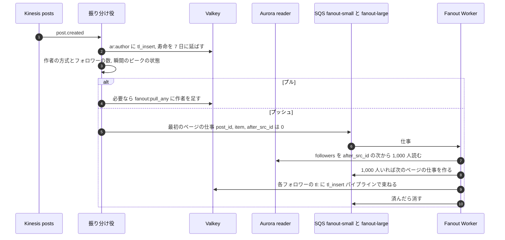
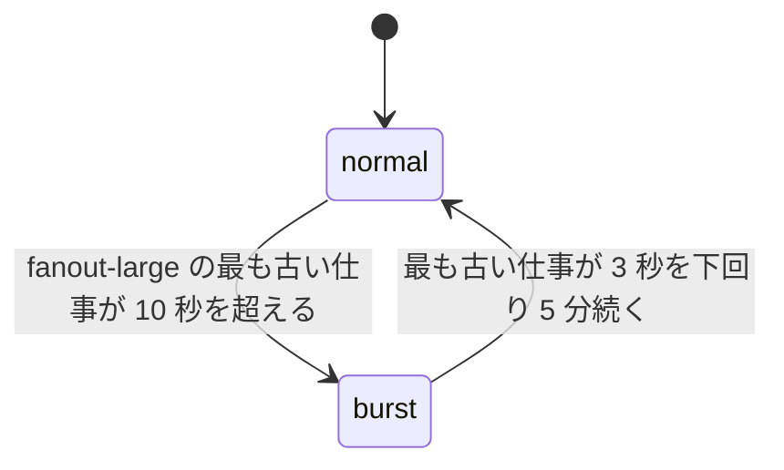
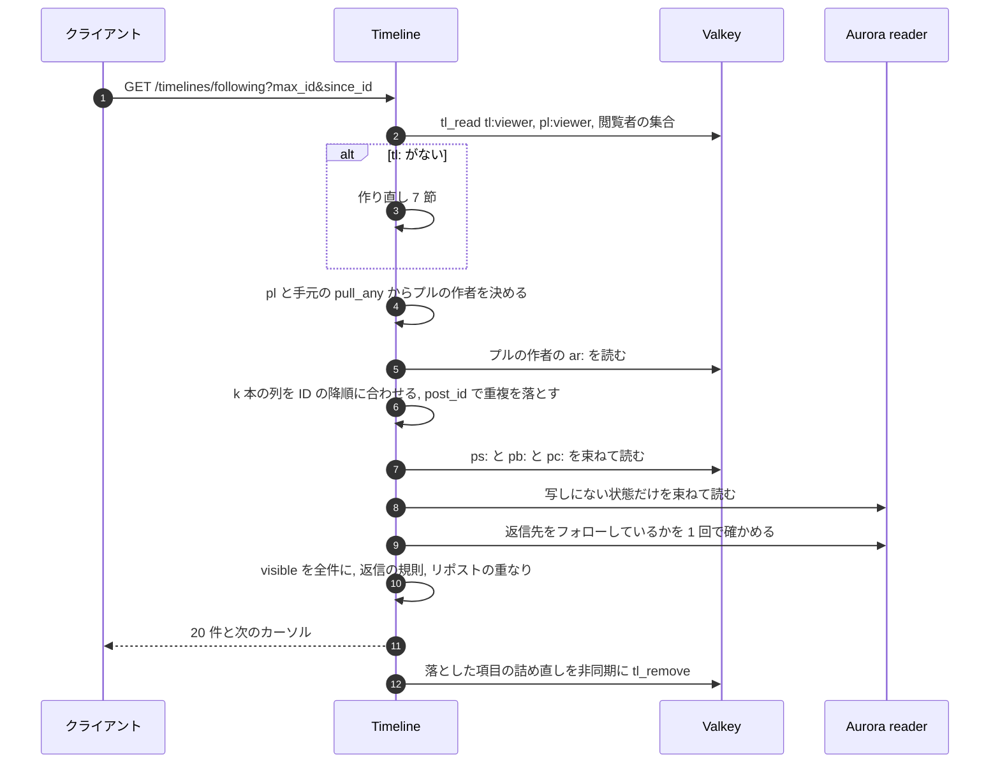
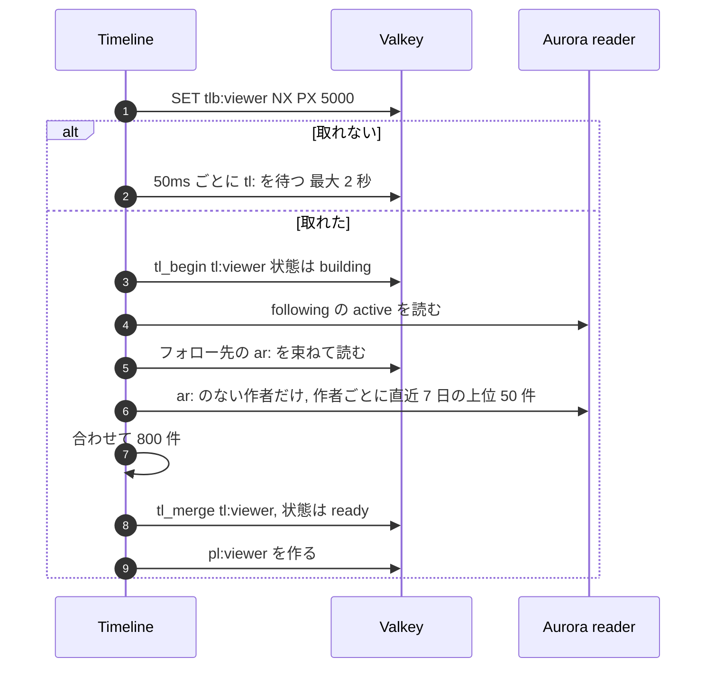

# Timeline and Fan-out: X

ホーム（フォロー中）のタイムライン。写しの形、プッシュとプルの閾値と切り替え、アクティブの定義、fan-out の仕事の流れと瞬間のピークの均し、読み出しと合わせ、写しの作り直し（single flight）、削除・ブロック・フォロー解除の後始末と新しいフォローの補充、プロフィールの投稿の一覧、会話の表示を決める。

前提となる決定は、`tid`（[ADR-0002](../decisions/0002-post-ids-and-ordering.md)）、プッシュとプルの組み合わせ・写し 800 件・アクティブなフォロワーだけへの配り（[ADR-0003](../decisions/0003-timeline-fanout-hybrid.md)）、読み出しの時の `visible()`（[ADR-0004](../decisions/0004-single-tenant-and-visibility.md)）、outbox と Kinesis と SQS（[ADR-0005](../decisions/0005-event-log-and-outbox.md)）、2 つの隣接の表（[ADR-0007](../decisions/0007-follow-graph-storage.md)）、投稿の状態の写し（[ADR-0009](../decisions/0009-post-state-tombstones-and-state-cache.md)）、閲覧者の集合（[ADR-0012](../decisions/0012-viewer-sets-cache.md)）。この文書で決めたことは次の ADR にある。

| ADR | 決定 |
| --- | --- |
| [0014](../decisions/0014-home-timeline-replica-format.md) | ホームの写しは、32 バイトの項目を ID の降順に詰めた Valkey の文字列にし、挿入・合わせ・除去を Valkey Functions で行う。返信の項目は、4 つ目の欄に返信先の利用者を入れる |
| [0015](../decisions/0015-fanout-pipeline-and-burst-control.md) | 振り分け役は、全作者の最近の投稿の写し（`ar:`）を先に書いてから、フォロワーのページの仕事を作者の大きさで 2 つの待ち行列に分けて作る。瞬間のピークでは閾値を一時的に下げ、プルに回した作者を 7 日間「プルの合わせの対象」に入れる |
| [0016](../decisions/0016-timeline-rebuild-single-flight.md) | 写しの作り直しは、空の「作り直し中」の写しを先に置いてから、フォローしている作者の `ar:` を合わせて作る（なければ Aurora）。single flight は Valkey の鍵で行い、全体の作り直しの速さに上限を置き、超えたら範囲を狭めて返す |
| [0017](../decisions/0017-profile-and-conversation-reads.md) | プロフィールの一覧は `ar:` と作者の索引から読む。会話は会話の ID の索引から読み、返信を段（作者の続き、自分、フォロー中、その他）と規則の点で並べる。直接の返信が 1,000 件を超える会話は、上位 200 件の候補の写しを持つ |

## 1. 目的と範囲

- 扱う：
  - ホームの写し（`tl:`）、作者の最近の投稿の写し（`ar:`）、閲覧者のプルの候補（`pl:`）、プルの合わせの対象（`fanout:pull_any`）
  - 振り分け役と Fanout Worker、待ち行列、瞬間のピークの均し
  - フォロー中の読み出し、ページング、新着の窓、重複の除去
  - 写しの作り直しと殺到への備え
  - 後始末と補充
  - プロフィールの投稿の一覧、会話の表示
  - fan-out の合成監視
- 扱わない：
  - おすすめ（[ranking-and-recommendation.md](ranking-and-recommendation.md)。フォロー中の写しを候補の源として渡す）
  - 閾値をまたいだ作者の方式の更新の仕組み（[follow-graph.md](follow-graph.md) の 7 節。この文書は方式の使い方を書く）
  - Valkey のクラスタの構成、S3 の記憶の階層（[infrastructure.md](infrastructure.md)）、必要な台数（[capacity.md](capacity.md)）
  - `visible()` の決定表（[trust-and-safety.md](trust-and-safety.md)）

## 2. 本家の形（確かめたこと）

| 項目 | 本家 | 出典 |
| --- | --- | --- |
| ホームの作り方 | 書くときにフォロワーのメモリーの中のタイムラインへ配り、フォロワーの多い作者は読むときに合わせる | [ADR-0003](../decisions/0003-timeline-fanout-hybrid.md)（2012 年の講演。具体の数値は**未検証**） |
| おすすめの候補の源 | フォロー中の最近の投稿をメモリーに持つ部品がある | [xai-org/x-algorithm](https://github.com/xai-org/x-algorithm)（公式の README。2026-10-04 に確認） |
| ホームに出る返信の範囲 | フォローしている 2 人の間の返信が出る | **未検証**（ヘルプセンターに到達できない） |

この設計の数値（800 件、7 日、閾値）は自前で決め、`fanout-poc` で確かめる。

## 3. 要件（NFR との対応）

| 項目 | 目標 | NFR |
| --- | --- | --- |
| 投稿からホームに出るまで | p95 5 秒、p99 30 秒。プルの作者、瞬間のピークの間も同じ | NFR-002 |
| フォロー中の最初のページ・続きのページ | p99 300ms（20 件） | NFR-003 |
| 写しのない利用者の作り直し | p99 2 秒 | NFR-003 |
| 読み出しの可用性 | 月間 99.95%。写しを失っても作り直しで返す | NFR-004・005 |
| 見える範囲 | 写しに残った項目を、ブロック・削除・措置・フォロー解除の後に返さない | NFR-009 |
| 写しの喪失 | 正本から作り直して同じ並び（800 件と 7 日の範囲の中で） | NFR-005（[ADR-0003](../decisions/0003-timeline-fanout-hybrid.md)） |

## 4. 写しと鍵

| 鍵 | 形 | 中身 | 寿命 |
| --- | --- | --- | --- |
| `tl:{viewer_id}` | 文字列（ADR-0014） | 頭（16 バイト）＋項目（32 バイト）× 最大 800。ID の降順 | 最後の読み出しから 30 日 |
| `ar:{author_id}` | 文字列（同じ項目の形） | 作者の直近 7 日・最大 200 件（返信・リポストを含む） | 最後の投稿から 7 日 |
| `pl:{viewer_id}` | Set | フォローしている作者のうち、フォロワー 1,000 人以上の人 | 10 分。閲覧者のフォローの変化で消す |
| `fanout:pull_any` | Sorted Set | プルの合わせの対象の作者（値は「いつまで」。今プルの作者は無限大） | なし（正本は `users.fanout_mode` と 6.3 節の記録） |
| `tlb:{viewer_id}` | 文字列 | 作り直しの single flight の鍵 | 5 秒 |

### 4.1 項目の形（ADR-0014）

```
 0        8        16       24       32 バイト
 ┌────────┬────────┬────────┬────────┐
 │ post_id│author_id│ ref_id │ flags  │   各 64 ビット、ビッグエンディアン
 └────────┴────────┴────────┴────────┘
 ref_id：リポストなら元の投稿の ID、返信なら返信先の利用者の ID、それ以外は 0
 flags ：REPOST、REPLY、QUOTE、HAS_MEDIA、SELF_THREAD（作者が自分に返信）、予備
```

- 頭（16 バイト）：形のバージョン（1）、状態（`ready`・`building`・`partial`）、項目の数（2）、作った時刻（ミリ秒、6）、予備。
- Functions：`tl_insert(key, items...)`（鍵があるときだけ。位置を二分探索で決めて挿入し、800 件に切り詰める。同じ `post_id` は 1 つ）、`tl_begin(key)`（なければ `building` の頭だけで作る）、`tl_merge(key, items..., state)`（和を取り、状態を書く）、`tl_remove(key, post_ids...)`、`tl_remove_author(key, author_id)`、`tl_read(key, max_id, n)`。
- S1 の記憶の量：アクティブな利用者 100 万人 × 25.6 KB ≒ 26 GB（Valkey の上乗せを除く）。S3 は [infrastructure.md](infrastructure.md) で記憶の階層を決める。

## 5. fan-out の流れ（ADR-0015）

### 5.1 全体



- **`ar:` を先に書く。** プッシュの仕事を作る前に `ar:` に入れる。作り直し（7 節）は、この順序に頼る。
- 振り分け役は `posts` の流れのシャードごとに 1 つ。`post.created` のうち、`kind` が `post`・`reply`・`quote`・`repost` のものを扱う。
- ページは `followers` の `(dst_id, src_id)` の主キーの順に、前のページの最後の `src_id` から 1,000 人ずつ読む。次のページの仕事は、ページを読んだ Worker が書き込みの前に作る（大きな作者のページが並列に進む）。
- ページの仕事は `(post_id, after_src_id)` で冪等。同じ仕事を 2 回処理しても `tl_insert` が同じ項目を 1 つにまとめる（[ADR-0003](../decisions/0003-timeline-fanout-hybrid.md)）。
- 仕事の順が入れ替わっても、`tl_insert` が ID の位置に入れるので並びは正しい。
- 作者本人の写しにも入れる（本人のホームに自分の投稿が出る）。
- 鍵アカウントの作者の投稿も、承認したフォロワー（`followers` の `active`）にだけ配る。配った後の判定は読み出しの `visible()` が行う。

### 5.2 どこへ配るか

| 項目 | 配る | 理由 |
| --- | --- | --- |
| 通常・引用 | アクティブなフォロワー全員 | |
| 返信 | アクティブなフォロワー全員。ホームに出すかは読み出しで決める（8.3 節） | 配る時に「フォロワーが返信先をフォローしているか」を 1 人ずつ引かない |
| 自分のスレッドの続き（`SELF_THREAD`） | 配る | |
| リポスト | 配る。元の投稿の作者をブロック・ミュートしている人も、読み出しで落とす | |

- 「アクティブ」は `tl:` があること（最後の読み出しから 30 日。[ADR-0003](../decisions/0003-timeline-fanout-hybrid.md)）。`tl_insert` は鍵がなければ何もしない。非アクティブな人への呼び出しは安いが、数は減らしたい。S2 で、アクティブな利用者の印を論理の分割ごとのビット列に持つかを、`fanout-poc` の結果で決める。

### 5.3 待ち行列と優先度

| 待ち行列 | 作者 | Worker の扱い |
| --- | --- | --- |
| `fanout-small` | フォロワー 1,000 人未満（仕事は 1 つ） | 先に取る |
| `fanout-large` | 1,000 人以上、閾値未満 | `fanout-small` が空か、取り出しの 4 回に 1 回 |

- 投稿の大部分はフォロワーの少ない作者で、`fanout-small` の 1 つの仕事で済む。大きな作者のページが溜まっても、小さな作者の投稿が待たない。
- 仕事の再試行は 5 回（指数の待ち、最大 30 秒）、その後は DLQ。DLQ の仕事は Ops が再投入する（失った配りは、読み出しでは見つからないが、作り直しで戻る）。

### 5.4 瞬間のピーク（ADR-0015）



- `burst` の間、振り分け役は、フォロワーが `T_burst = max(2,000, T / 2)` 以上の作者の新しい投稿をプッシュせず、作者を `fanout:pull_any` に「今から 7 日」の値で足す。
- 読み出しは、閲覧者の `pl:`（フォロワー 1,000 人以上のフォロー先）と `fanout:pull_any` の交わりをプルの作者として合わせる。7 日の間は、`burst` の間の投稿も `ar:` から見つかる。7 日は `ar:` の範囲と同じ。
- `burst` を抜けた後、遅れてプッシュし直すことはしない。
- 値は `ops.fanout.burst_*`。状態の変化は記録に残し、合成監視の結果と合わせて見る。

### 5.5 閾値をまたぐ作者

- 方式は `users.fanout_mode`（[follow-graph.md](follow-graph.md) の 7 節）。プッシュ → プル：振り分け役は以後プッシュしない。`fanout:pull_any` に無限大で足す。
- プル → プッシュ：以後プッシュする。`fanout:pull_any` の値を「今から 7 日」に変える。プルの間の投稿は、7 日の間 `ar:` から見つかる。
- どちらの向きでも、過去の投稿を配り直さない・消さない。読み出しは写しと `ar:` を合わせ、`post_id` で重複を落とす。
- `fanout:pull_any` は、全ての読み出しが引く熱い鍵になる。Timeline のタスクは、これを手元のメモリーに持ち、1 秒ごとにバージョンを見て読み直す。

## 6. 読み出し（フォロー中）

### 6.1 流れ



### 6.2 遅延の予算（NFR-003：p99 300ms）

| 区間 | 予算（p99） |
| --- | --- |
| 入口（認証、レート制限） | 30ms |
| `tl:`・`pl:`・閲覧者の集合の読み出し | 25ms |
| プルの作者の `ar:` の読み出しと合わせ | 30ms |
| 投稿の状態・本体・数の束ねた読み出し | 50ms |
| 写しにない状態の Aurora の読み出し（起きたとき） | 40ms |
| 返信先のフォローの確かめ | 15ms |
| `visible()`・規則・組み立て | 30ms |
| 余裕 | 80ms |

### 6.3 ページングと新着

- カーソルは `max_id`（この ID より古いもの）。続きのページは `max_id` から 20 件。
- 1 ページのために読む項目は 200 件まで（[ADR-0003](../decisions/0003-timeline-fanout-hybrid.md)）。絞り込みで 20 件に届かなければ、そこまでで返し、次のカーソルを付ける。
- 新着（`since_id`）：`since_id − (10,000 << 22)`（10 秒ぶん戻した位置）から読み、クライアントで重複を落とす（[ADR-0002](../decisions/0002-post-ids-and-ordering.md)）。窓の値は `ops.timeline.since_overlap_ms`（既定 10,000）。`fanout-poc` で、確定の順と ID の順のずれの p99.9 を測って決める。
- 写しの 800 件の外（古いページ）は、作り直しと同じ方法で Aurora から読む（`ar:` と作者の索引の合わせ）。7 日より古いページは、1 回 50 件ずつ、作者ごとの索引から読む（遅くてよい。目標は p99 1 秒）。

### 6.4 規則

| 規則 | 扱い |
| --- | --- |
| 見える範囲 | 全件に `visible()`（`surface = home`）。`hide` は落とす。`interstitial` は警告つきで出す |
| フォローを外した作者 | 落とす（`following` の写しでなく、`pl:` と閲覧者のフォローの確かめで判定。8.2 節の後始末で写しからも消える） |
| 返信 | 返信先の利用者が、閲覧者本人か、閲覧者がフォローしている人か、作者本人（`SELF_THREAD`）のときだけ出す |
| リポストの重なり | 同じ元の投稿は、ページの中で 1 つだけ（いちばん新しい項目。「○○さんがリポスト」を付ける）。元の投稿そのものが先にあれば、それを出す |
| 自分の投稿 | 出す |

## 7. 作り直し（ADR-0016）



- **空の写しを先に置く。** `building` の写しがある間に届いたプッシュは、そこに入る。写しを置く前に配られた投稿は、`ar:` に先に入っている（5.1 節）ので、`ar:` の読み出しで見つかる。どちらかで必ず拾う。
- フォローが 2,000 人を超える利用者は、直近 3 日に絞る（[ADR-0003](../decisions/0003-timeline-fanout-hybrid.md)）。
- **全体の上限**：作り直しは、Timeline の全体で毎秒 `ops.timeline.rebuild_rate`（S1 の既定 500）まで。超えたら、範囲を 24 時間・200 件に狭めて `partial` で返し、残りを低い優先度の仕事で埋める。
- `ar:` がない作者が多い（Valkey のノードを失った直後）ときは、Aurora の読み出しが増える。`ar:` は、`posts` の流れを喪失の 5 分前から読み直して作り直す（Kinesis の保持は 7 日。[ADR-0005](../decisions/0005-event-log-and-outbox.md)）。その間の作り直しは Aurora の作者の索引を使う。
- 作り直しの結果は、プッシュで作った写しと同じ並びになる（800 件と 7 日の範囲の中で。性質 PROP-TL-002）。

## 8. 後始末と補充

正しさは読み出しが持つ（6.4 節）。後始末は写しの量を減らし、ページの絞り込みの無駄を減らすために行う。

### 8.1 出来事ごとの扱い

| 出来事 | 扱い | 遅れの目標 |
| --- | --- | --- |
| 投稿の削除・措置 | `ar:` から除く。`tl:` は読み出しの詰め直しで除く（全フォロワーへの除去の仕事は作らない） | `ar:` は p95 5 秒 |
| フォローの解除・フォロワーの削除 | 閲覧者の `tl:` から作者の項目を `tl_remove_author`。`pl:` を消す | p95 5 秒 |
| ブロック | 両者の `tl:` から相手の項目を除く。`pl:` を消す | p95 5 秒 |
| 新しいフォロー（プッシュの作者） | 作者の `ar:`（なければ Aurora）から直近 50 件を `tl_merge` | p95 5 秒（NFR-002） |
| 新しいフォロー（プルの作者） | `pl:` を消すだけ | — |
| ミュート | 何もしない（読み出しで落とす。ミュートの解除で戻るため） | — |
| 鍵アカウントへの切り替え | 何もしない（読み出しの `visible()`） | — |
| 作者の方式の切り替え | 5.5 節 | — |

### 8.2 読み出しの詰め直し

- 読み出しで落とした項目のうち、理由が恒久のもの（削除、`removed` の措置、フォロー解除、ブロック）は、`tl_remove` で写しから除く。ミュート・`interstitial`・一時の理由は除かない。
- 詰め直しは応答の後に非同期で行い、失敗してもよい。

## 9. プロフィールと会話（ADR-0017）

### 9.1 プロフィールの投稿の一覧

| タブ | 中身 | 読み方 |
| --- | --- | --- |
| 投稿 | 通常・引用・リポスト・自分のスレッドの続き | `ar:`（直近 7 日・200 件）、続きは `posts (author_id, id DESC)` |
| 返信 | 返信を含む全部 | 同じ |
| メディア | メディアつきの投稿 | `posts (author_id, id DESC) WHERE has_media`（部分索引） |

- 固定の投稿（`users.pinned_post_id`）を先頭に出す。
- 鍵アカウントの一覧は、本人と承認したフォロワーだけ（`visible()` の利用者の判定）。見えない人には、件数を含めて何も返さない。
- p99 300ms（`ar:` で済む場合）。

### 9.2 会話

- 中心の投稿（開いた投稿）、祖先の列（返信先を辿る。最大 30 件、`ps:`・`pb:` から）、中心への返信を返す。
- 返信の読み出し：`posts (in_reply_to_post_id, id)` から。
- 返信の並び（段の順。段の中は規則の点の降順）：

| 段 | 中身 | 段の中の順 |
| --- | --- | --- |
| 1 | 中心の投稿の作者の続き（`SELF_THREAD`） | 古い順 |
| 2 | 閲覧者本人の返信 | 新しい順 |
| 3 | 閲覧者がフォローしている人の返信 | 点 |
| 4 | その他 | 点 |
| 5 | ミュートした人の返信、T&S のスパムの点が高い作者の返信 | 「さらに表示」の下に畳む |

- 点：`(いいね + 2 × 返信 + 1) / (経過時間（時間） + 2)^1.5`。重みと指数は `ops.conversation.*`。並びの変更は、おすすめと同じく、記録した出来事での再生の評価と A/B（`experiment.conversation.*`）を通す（[ADR-0006](../decisions/0006-ranking-boundary.md) の「変更の出し方」に準じる）。ML の点は使わない。
- **大きな会話**：直接の返信が 1,000 件を超えたら、上位 200 件の候補を `cv:{post_id}`（Sorted Set、点）に持ち、30 秒ごとに数の写しから作り直す。段 2・3 は閲覧者ごとに索引から引く（閲覧者の返信と、フォロー中の人の返信は、`(in_reply_to_post_id, author_id)` の索引で、フォロー中の人の数が 2,000 以下のときだけ引く）。
- 全件に `visible()`（`surface = conversation`）。ブロックした・された人の返信は出さない（漏れの経路の表の「会話」）。
- p99 400ms（最初の 20 件）。

## 10. 合成監視

- 監視用の作者：プッシュ（フォロワー 100 人）、プル（フォロワー 2 万人、監視用の合成のアカウント）、閾値の付近（9,000 人）。
- 監視用のフォロワー：アクティブ（毎分読む）、鍵アカウントの承認あり・なし、作者をブロックした人、作者をミュートした人。
- 1 分ごとに各作者が投稿し、各フォロワーのホームに出るまでの時間と、出てはいけない人に出ないことを確かめる（[quality.md](../quality.md) の 4.2 節）。投稿は合成の本文で、監視の後に消す。

## 11. 障害と振る舞い

| 障害 | 起きること | 検知 | 回復 |
| --- | --- | --- | --- |
| Valkey のノードの喪失 | その範囲の `tl:`・`ar:` が消える | 接続のエラー、写しのない読み出しの率 | 読み出しで作り直す。全体の上限と `partial` で Aurora を守る。`ar:` は流れの読み直しで戻す |
| Fanout Worker の停止・遅れ | ホームに届かない | 待ち行列の最も古い仕事の年齢、合成監視 | 再起動と増設。10 秒で `burst` に入り、大きな作者をプルに回す |
| 振り分け役の遅れ | `ar:` とプッシュの両方が遅れる | `IteratorAge` | 増設。シャードの数は Kinesis のオンデマンドに従う |
| Relay の停止 | 出来事が流れない | outbox の年齢 | [posts-and-ids.md](posts-and-ids.md) の 10 節 |
| Aurora の reader の遅れ | 作り直しが新しい投稿を欠く | reader の遅れ | `ar:` が新しい部分を持つので、遅れは作り直しの結果に出ない |
| DR の切り替え | 大阪の写しが空 | — | 全員が作り直しになる。全体の上限と `partial` で返し、30 分で収める（[quality.md](../quality.md) の 2.4 節） |
| `fanout:pull_any` の手元の写しが古い | プルに回した直後の投稿が最大 1 秒見えない | — | 1 秒ごとの読み直し |

## 12. 上限

| 項目 | 値 | 持つ場所 |
| --- | --- | --- |
| 写しの件数 | 800 | `ops.timeline.max_entries` |
| 写しの寿命（アクティブ） | 30 日 | `ops.timeline.active_ttl_days` |
| `ar:` | 7 日・200 件 | `ops.timeline.author_recent_*` |
| プルの閾値 | 10,000（戻りは 0.8 倍） | `ops.fanout.pull_threshold`（[ADR-0003](../decisions/0003-timeline-fanout-hybrid.md)） |
| 瞬間のピークの閾値 | `max(2,000, T / 2)` | `ops.fanout.burst_*` |
| `pl:` に入れるフォロワーの下限 | 1,000 | `ops.timeline.pull_candidate_min_followers` |
| ページ | 20 件、読む項目 200 件まで | `ops.timeline.page_*` |
| 新着の窓 | 10 秒 | `ops.timeline.since_overlap_ms` |
| 作り直しの全体の上限 | 毎秒 500（S1） | `ops.timeline.rebuild_rate` |
| フォローが多い人の作り直しの範囲 | 2,000 人超で 3 日 | `ops.timeline.rebuild_*` |
| 会話の候補の写し | 直接の返信 1,000 件超で上位 200 件 | `ops.conversation.*` |

## 13. data-model への項目

列・鍵・索引の正本は [data-model/timelines-and-ranking.md](data-model/timelines-and-ranking.md)、Valkey の鍵は [data-model/stores.md](data-model/stores.md) の 1 節にある。下の表は、この領域が求めた項目の要点である。

| 表・store | 列・鍵 | 備考 |
| --- | --- | --- |
| `posts` の索引 | `(author_id, id DESC)`、`(author_id, id DESC) WHERE has_media`、`(in_reply_to_post_id, id)`、`(in_reply_to_post_id, author_id)`、`(conversation_id, id)` | 表は [posts-and-ids.md](posts-and-ids.md) |
| `users.fanout_mode` | [follow-graph.md](follow-graph.md) | |
| `fanout_mode_log` | `author_id`、`from`、`to`、`reason`（閾値・瞬間のピーク）、`until`、`changed_at` | `fanout:pull_any` の作り直しの元と、記録 |
| `users.pinned_post_id` | `bigint` | 表は [accounts-and-auth.md](accounts-and-auth.md) の 12 節 |
| Valkey `tl:`・`ar:`・`pl:`・`tlb:`・`fanout:pull_any`・`cv:` | 4 節、9.2 節 | すべて写し。正本から作り直せる |
| SQS `fanout-small`・`fanout-large`（と DLQ） | ページの仕事 `(post_id, item, after_src_id)` | |
| AppConfig | `ops.fanout.*`・`ops.timeline.*`・`ops.conversation.*`・`experiment.conversation.*` | 閾値をコードに書かない（AGENTS.md） |

## 14. テストと性質

### 14.1 性質

- **PROP-TL-001（抜けと重なりがない）**：任意の投稿・フォロー・解除・ブロック・削除・閾値の変更（またぎを含む）・瞬間のピークの出入り・写しの喪失・仕事の重複と順の入れ替えの列に対して、フォロー中の読み出しは「その時点でフォローしていて、見てよい作者の投稿（6.4 節の規則の後）」を、ID の降順で、重複なく、抜けなく（800 件と 7 日の範囲の中で）返す（[ADR-0003](../decisions/0003-timeline-fanout-hybrid.md) の Confirmation）。
- **PROP-TL-002（作り直しの一致）**：任意の列の後、作り直した写しと、プッシュで作った写しは、読み出しの結果（`visible()` の後の 800 件と 7 日の範囲）が同じ。
- **PROP-TL-003（作り直しの最中の投稿）**：作り直しの開始の前後のどの時点に確定した投稿も、作り直しの後の読み出しに出る。
- **PROP-TL-004（項目の形）**：任意の `tl_insert`・`tl_merge`・`tl_remove` の列の後、写しは ID の降順で、`post_id` が重ならず、800 件以下。
- **PROP-TL-005（ページング）**：任意の `max_id` の列でページを辿ったとき、同じ投稿が 2 回出ず、辿った範囲の見てよい投稿が全部出る（その間に新しい書き込みがない場合）。

### 14.2 決定的な模擬

- fan-out の性質は、本物の振り分け役・Worker・読み出しのコードを、メモリーの Valkey（Functions を同じ形で実装したもの）と仮想の時計の上で動かす模擬で確かめる。PR ごとに 1,000 の列、夜間に 10 万の列（[quality.md](../quality.md) の 2.3 節の「fan-out の性質ベーステストの完全版」）。失敗した列は縮めて回帰テストに残す。
- 合成のソーシャルグラフ（[quality.md](../quality.md) の 2.4 節）で、フォロワーの数のべき乗の分布を使う。

### 14.3 結合・負荷・障害

- Valkey の Functions は本物の Valkey（Testcontainers）で、項目の形と境の場合（800 件ちょうど、同じ ID、空の写し）を確かめる。
- 負荷：S1 の瞬間のピーク（投稿 3,000 件/秒、うちフォロワー 100 万人の作者の連投を含む）で NFR-002 の p99 30 秒。読み出し 1 万件/秒で NFR-003。
- 障害の注入：Valkey のノードの喪失（作り直しの殺到）、Fanout Worker の停止、振り分け役の遅れ。

## 15. Story の候補

| Epic | Story | 中身 |
| --- | --- | --- |
| E5 | `fanout-poc` | 写しの形（詰めた文字列とソート済みの集合の比較）、閾値、書き込みの量、瞬間のピーク、新着の窓の値 |
| E5 | `timeline-replica-functions` | 4.1 節の形と Functions（ADR-0014） |
| E5 | `fanout-worker` | 5 節の振り分け役、待ち行列、Worker（ADR-0015） |
| E5 | `author-recent-cache` | `ar:`、`pl:`、`fanout:pull_any` と手元の写し |
| E5 | `fanout-burst-control` | 5.4 節の瞬間のピーク |
| E5 | `home-following-read` | 6 節の読み出しと規則 |
| E5 | `timeline-rebuild` | 7 節（ADR-0016） |
| E5 | `timeline-cleanup` | 8 節 |
| E5 | `profile-timeline` | 9.1 節 |
| E5 | `conversation-view` | 9.2 節（ADR-0017） |
| E5 | `fanout-synthetic-monitor` | 10 節 |
| E5 | `fanout-simulator` | 14.2 節の決定的な模擬と PROP-TL-001〜005 |

## 16. 未解決の問い

### 決定

2026-10-04 の既定案。`fanout-poc` と E5 の計測で覆りうる。

- 写しは 32 バイトの項目を詰めた文字列と Functions（ADR-0014）。PoC で CPU が足りなければソート済みの集合に戻す。
- `ar:` は全作者に持つ（[ADR-0003](../decisions/0003-timeline-fanout-hybrid.md) の「フォロワーの多い作者」から広げた。ADR-0015・0016）。
- 待ち行列は 2 つ、瞬間のピークでは閾値を `max(2,000, T / 2)` に下げる（ADR-0015）。
- 作り直しは空の写しを先に置き、全体の上限は毎秒 500（ADR-0016）。
- ホームの返信は、返信先が閲覧者・閲覧者のフォロー先・作者本人のときだけ出す。
- 会話の並びは段と規則の点（ADR-0017）。

### 持ち越し

| 問い | いつ・どう決めるか |
| --- | --- |
| 閾値 `T`（既定 1 万）、`T_burst`、`ar:` の件数 | `fanout-poc` と E5 の負荷試験 |
| アクティブの印をビット列で持つか | `fanout-poc` で、非アクティブな人への呼び出しの割合を測る |
| 新着の窓（10 秒） | `fanout-poc` で確定の順と ID の順のずれを測る |
| S3 の写しの記憶の階層 | [infrastructure.md](infrastructure.md) |
| ADR-0003 の案 4（大きな作者を、とくにアクティブなフォロワーへ遅れてプッシュ） | S2 の前に、プルの合わせの費用を見て決める |

## 17. quality.md・runbooks への項目

- quality.md：E5 の合否基準に PROP-TL-003（作り直しの最中の投稿）と、瞬間のピークの出入りのシナリオを足す。
- runbooks：`fanout-backlog.md`（待ち行列の年齢、`burst` の状態、Worker の増設、DLQ の再投入）、`timeline-rebuild-storm.md`（作り直しの殺到、全体の上限、`partial` の割合、Aurora の負荷）、`author-recent-rebuild.md`（Valkey の喪失の後の `ar:` の読み直し）。
