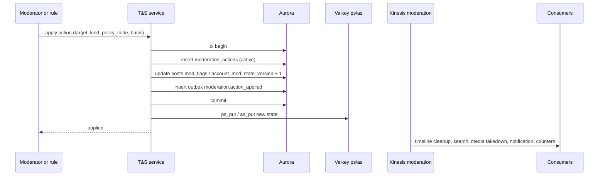
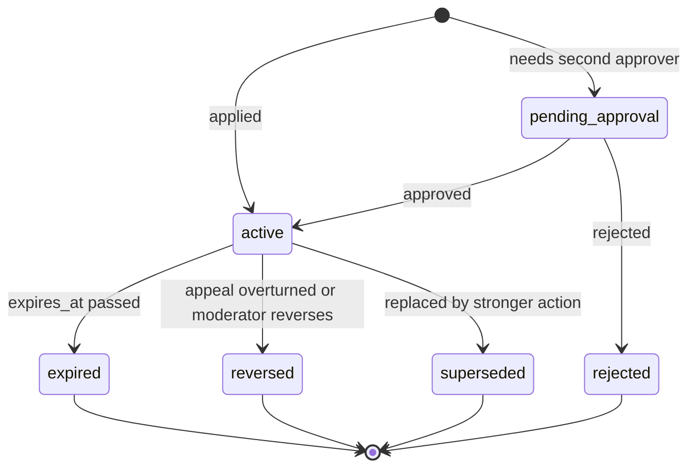
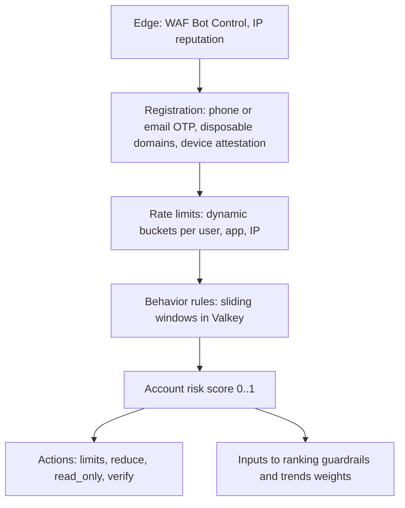
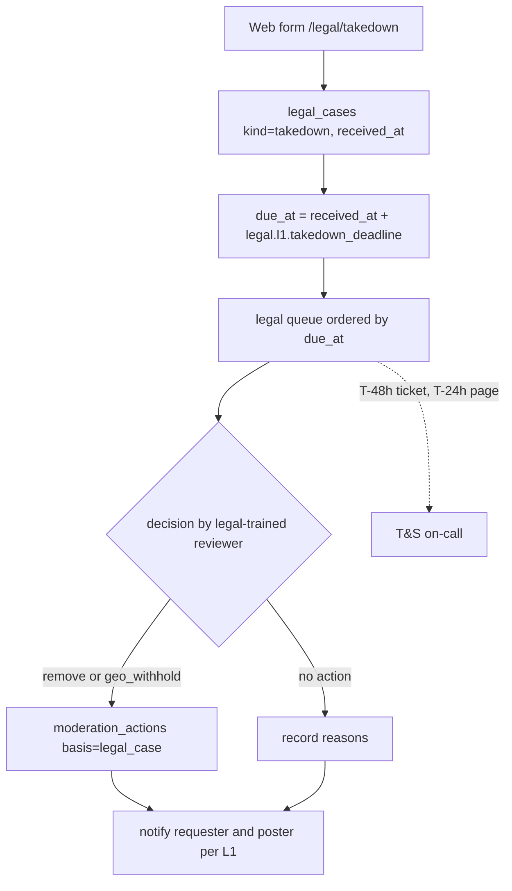

# Trust and safety: X

トラスト＆セーフティ。規約と措置の種類、措置の記録と効かせ方、通報の受け付けと優先度、モデレーションの待ち行列と作業の画面、異議の申立て、スパムとボットの防御（レート制限と危険の点）、有害なメディアの照合の一致の扱い、法令の窓口（情報流通プラットフォーム対処法の削除の申出、発信者情報の開示、法執行）、運用の状況の公表を決める。

前提となる決定は、見える範囲は `visible()` で読み出しの時に決め、運用と T&S の読み出しは別のロールで理由を記録すること（[ADR-0004](../decisions/0004-single-tenant-and-visibility.md)）、措置は `moderation` の流れで消費者へ届くこと（[ADR-0005](../decisions/0005-event-log-and-outbox.md)）、ML は並べる順だけでスパムの点を落とす判断は規則で行うこと（[ADR-0006](../decisions/0006-ranking-boundary.md)）、投稿の削除と措置は行を消さずに状態と `state_version` を変えること（[ADR-0009](../decisions/0009-post-state-tombstones-and-state-cache.md)）、措置は記録してから効かせ、物理の削除は保持の後のジョブだけが行うこと（[AGENTS.md](../../AGENTS.md)）。要件は NFR-009（措置から全経路で 60 秒）、NFR-010（削除の申出の期限の中の判断と通知 100%、命に関わる通報の初動 1 時間）、NFR-011（ホームのスパム 0.5% 以下）。**法令の手続き（10 節）は枠組みだけを決め、期限・基準・手順の値は法務の確認待ちとする（L1・L2・L5・L6・L7・L8・L9）。** DM は L3。この文書で決めたことは次の ADR にある。

| ADR | 決定 |
| --- | --- |
| [0038](../decisions/0038-moderation-action-model.md) | 措置は追記だけの `moderation_actions` に、対象・種類・範囲・根拠（規約の条項か法令の案件）・判断した主体（人か規則とバージョン）を書いてから、同じトランザクションで投稿・アカウントの措置の要約（`mod_flags` など）と `state_version` を変え、outbox に出す。措置は期限・取り消し・置き換えで終わり、取り消しも新しい行で書く。種類は印・表示の制限・地域での非表示・削除（投稿）と、印・表示の制限・読み取りだけ・凍結（アカウント） |
| [0039](../decisions/0039-reports-queues-and-appeals.md) | 通報は対象と規約の組ごとに 1 つの案件にまとめ、重さ × 広がり × 通報者の信頼 × 速さで優先度を付け、P0（1 時間）〜P3 の待ち行列に入れる。命に関わる区分は P0 で当番を呼ぶ。作業の画面は通報の時に写した証拠だけを見せ、読み出しの理由を記録する。永久の凍結と法令の判断は 2 人の承認。異議は 30 日以内、別の担当が 7 日以内に見る |
| [0040](../decisions/0040-spam-and-bot-defense.md) | スパムとボットは、エッジ（WAF の Bot Control）→ 登録（電話番号かメールの確認、使い捨てのドメインの拒否、端末の証明）→ レート制限（動的な桶）→ 行動の規則 → アカウントの危険の点（S1 は規則と線形のモデル）の層で防ぐ。危険の点 0.9 以上は読み取りだけと確認の要求、0.7〜0.9 は表示の制限と審査、0.5〜0.7 はレート制限を 4 分の 1 にする。第三者の分類のサービスは S1 で買わない |
| [0041](../decisions/0041-legal-requests-and-transparency.md) | 法令の案件（削除の申出、開示の請求・命令、消去の禁止、法執行の照会）は、通報と別の `legal_cases` で持ち、受け付けの時刻から期限を計算して持ち、48 時間前・24 時間前に警告する。期限の値・基準・通知の文は AppConfig の `legal.*` に置き、法務の確認の後に決める。保全は `legal_holds` で、保持のジョブの削除を止める。開示は 2 人の承認と監査。運用の状況の公表は、措置・通報・案件の表からデータレイクで集計する |

## 1. 範囲

- 扱う：規約の区分と措置の種類、措置の記録と状態、措置の効かせ方（`visible()` と各経路）、利用者への通知、通報の受け付け・まとめ・優先度、待ち行列と期限、作業の画面と道具、自動の措置の規則、異議、スパムとボットの層、危険の点、照合の一致の扱い、法令の案件（申出、開示、保全、法執行、著作権、選挙、青少年）、運用の状況の公表、T&S の担当の安全。
- 扱わない：
  - `visible()` の関数の中身と決定表の全体（[ADR-0004](../decisions/0004-single-tenant-and-visibility.md)、`visibility-core` の Story）。この文書は措置の要約が `visible()` に与える効果（4.2 節）を決める。
  - 投稿の削除の流れ（[posts-and-ids.md](posts-and-ids.md)）、メディアの配信の停止（[media.md](media.md)）、検索の索引への反映（[search-and-trends.md](search-and-trends.md)）。
  - レート制限の桶の仕組みと値（[api-and-rate-limits.md](api-and-rate-limits.md)）。この文書は T&S が桶を絞る口を使う。
  - 登録・ログインの記録の形と保持（[accounts-and-auth.md](accounts-and-auth.md)）。開示はそれを読む。
  - 運用者の権限と監査ログの仕組み（[security.md](security.md)）。
  - みんなで作る注記（MVP の後、E15）。

## 2. 事実（確かめたこと）

いずれも 2026-10-04 に確認。

| 項目 | 事実 | この設計 |
| --- | --- | --- |
| 情報流通プラットフォーム対処法 | 2025-04-01 に施行。2025-04-30 に、本家の運営の会社を含む 5 社を大規模特定電気通信役務提供者に指定した（[総務省](https://www.soumu.go.jp/main_sosiki/joho_tsusin/d_syohi/ihoyugai.html)、[令和 7 年版 情報通信白書](https://www.soumu.go.jp/johotsusintokei/whitepaper/ja/r07/html/nd123210.html)。[intent.md](../intent.md) の出典） | 指定の要件に当たるか、指定の前から同じ水準で対応するか、期限・基準・通知の具体は L1 の確認待ち。設計は、指定された事業者の水準に対応できる形にする（10.1 節） |
| 本家の措置の種類 | 投稿の削除、表示の制限（ラベルを付けて広がりを抑える）、アカウントの読み取りだけ・凍結を持つとされる | help.x.com は 403 で**未検証**。この設計の種類（4 節）は自前に決める |
| 本家の透明性の報告 | 定期の透明性の報告を出しているとされる | 本家の文書は**未検証**。この設計は、法令の報告（L1）と自主の公表の両方に使える集計を持つ（11 節） |

## 3. 要件

| 要件 | 値 | 出どころ |
| --- | --- | --- |
| 措置の反映 | 措置の確定から、全経路（写し、検索、通知、CDN のメディア）で見えなくなるまで p99 60 秒 | NFR-009 |
| 法令の期限 | 削除の申出への判断と通知を期限の中で行う割合 100%。期限の値は L1 の後（既定の仮置きは 7 日） | NFR-010、K6 |
| 命に関わる通報 | 自殺・自傷の予告、暴力の予告、児童の性的搾取の通報の初動 1 時間以内 100% | NFR-010 |
| スパム | 抜き取りの人の評価で、ホームのスパムの割合 0.5% 以下。登録の後 24 時間以内に凍結したスパムのアカウントの割合を週ごとに見る | NFR-011、K7 |
| 記録 | 措置はすべて、根拠と判断した主体を書いてから効く。取り消せる | [AGENTS.md](../../AGENTS.md) |
| 利用者への説明 | 措置を受けた利用者に、措置・根拠・異議の申立ての方法を示す | [intent.md](../intent.md) の「守るべき振る舞い」 |
| DM | DM の中身を、モデレーションのために機械で読まない・人が直接読まない（L3 の確認まで） | [AGENTS.md](../../AGENTS.md) |

## 4. 規約と措置

### 4.1 規約の区分

措置と通報は、規約の区分のコード（`policy_code`）を持つ。区分の文と公開は PM と法務が持つ。コードの一覧はバージョンで管理する（`policy_version`）。

| コード | 区分 | 既定の重さ |
| --- | --- | --- |
| `csem` | 児童の性的搾取 | 最重（P0） |
| `violent_threat` | 暴力の予告・脅迫 | 最重（P0） |
| `self_harm` | 自殺・自傷の予告・助長 | 最重（P0） |
| `terrorism` | テロ・暴力的な過激主義 | 重（P1） |
| `harassment` | 嫌がらせ・誹謗中傷 | 重（P1） |
| `hateful_conduct` | 差別・憎悪の助長 | 重（P1） |
| `private_info` | 個人の情報のさらし | 重（P1） |
| `nonconsensual_media` | 同意のない性的な画像 | 重（P1） |
| `impersonation` | なりすまし | 中（P2） |
| `spam` | スパム・プラットフォームの操作 | 中（P2） |
| `scam` | 詐欺 | 重（P1） |
| `sensitive_media` | センシティブなメディアの印の付け忘れ | 軽（P3） |
| `illegal_jp` | 日本の法令に反する情報（法令の案件から） | 法令の手続き（10 節） |
| `copyright` | 著作権の侵害（L6） | 法令の手続き（10.4 節） |
| `election` | 選挙に関わる投稿（L9） | L9 の確認待ち |

### 4.2 措置の種類と効果

| 対象 | 種類 | `visible()` と各経路への効果 |
| --- | --- | --- |
| 投稿 | `label` | センシティブ・注意の印。閲覧者の設定により `interstitial`。おすすめでは落とす（[ranking-and-recommendation.md](ranking-and-recommendation.md) の 6 節） |
| 投稿 | `reduce` | 表示の制限：本人とフォロワーには出す。検索・おすすめのフォロー外の源・トレンド・返信の上位から外す。いいね・リポストを止めるかは措置の値で選ぶ |
| 投稿 | `geo_withhold` | 指定した地域（国）の閲覧者に `hide`（法令の措置） |
| 投稿 | `remove` | 全員に `hide`。作者には「規約により非表示」の枠を出す。メディアを配信の停止へ |
| メディア | `remove_media` | メディアだけを止め、投稿の本文は残す |
| アカウント | `label_account` | 作者のメディアにいつも印を付ける |
| アカウント | `reduce_account` | 作者の投稿を検索・おすすめのフォロー外・トレンドから外す。トレンドの重み 0 |
| アカウント | `read_only` | 投稿・返信・いいね・フォロー・DM の送信を止める。期限つき。解除の条件（電話番号の確認など）を持てる |
| アカウント | `suspend` | プロフィールと投稿を全員に `hide`（本人は異議のためにログインできる）。期限つきか永久 |
| 機能 | `feature_limit` | 特定の機能の制限（DM の申請、メディアの投稿、ライブの機能）。値つき |

- `visible()` は、投稿の `mod_flags`（`LABEL`・`REDUCE`・`REMOVED`・`AGE_GATED`・`GEO_WITHHELD`・`UNDER_REVIEW`・`NO_ENGAGE`・`MEDIA_REMOVED` のビットと地域の `mod_geo`。[data-model.md](data-model.md) の 3.5 節）と、作者の措置の要約（`as:{user_id}` の `account_mod`）だけを読む（[ADR-0009](../decisions/0009-post-state-tombstones-and-state-cache.md)）。措置の正本は `moderation_actions`。
- 表駆動テストの決定表（`DT-TS-001`）は、上の表の「種類 × 閲覧者の関係（本人・フォロワー・その他・ログインしていない人）× 経路（フォロー中・おすすめ・検索・トレンド・通知・プロフィール・公開 API・メディア）」で書く。

## 5. 措置の記録と効かせ方

### 5.1 流れ



- **記録してから効かせる。** 措置の行と、投稿・アカウントの要約の更新と、outbox は同じトランザクションで書く。行のない要約の変更を作らない（[ADR-0038](../decisions/0038-moderation-action-model.md)）。
- 確定の直後に `ps:`・`as:` の写しを新しいバージョンで書く（[ADR-0009](../decisions/0009-post-state-tombstones-and-state-cache.md)）。読み出しの `visible()` はここで効く。
- 消費者（タイムラインの後始末、検索の索引、メディアの配信の停止、通知、カウンター、トレンドの除外）は、`moderation` の流れから冪等に処理する。60 秒の目標（NFR-009）は、写しの更新（数秒）とメディアの拒否の一覧（[media.md](media.md) の 8.4 節）で守り、他の消費者の遅れは後始末として扱う。
- 投稿の要約は、その投稿に効いている措置の行を全部畳み込んで計算し直す（一番新しい行だけを見ない）。同じ投稿に `label` と `geo_withhold` が同時にありうるため。

### 5.2 状態



- `moderation_actions` は追記だけ。状態の変化も `moderation_action_events` に行を足して表す。行を書き換えない。
- 期限の切れは、期限のジョブが `expired` の出来事を書き、要約を計算し直す。
- 取り消し（`reversed`）は、異議の結果か、担当の訂正で入る。取り消しの理由と判断した人を書く。
- 永久の凍結・法令の措置・`csem` の措置は 2 人の承認（`pending_approval`）。ただし `csem` と `violent_threat` の緊急の `remove` は、1 人で先に効かせ、24 時間以内に 2 人目が確かめる。

### 5.3 利用者への通知

- 措置を効かせたら、対象の利用者に、アプリの中の通知とメールで知らせる：措置の種類、対象（投稿の ID）、規約の区分、期限、異議の申立ての方法と期限。
- 通知の文は区分ごとの型から作り、担当が自由に書き足せる欄を持つ（外部に出る文は型の範囲で）。
- 知らせない場合：法執行の照会で通知を止める求めがあり、法務が認めたとき（L7）、`csem` で知らせることが捜査を害しうるとき。止めた理由を案件に記録する。
- 法令の申出による措置の発信者への通知の内容と時期は L1 の確認待ち（10.1 節）。

## 6. 通報と待ち行列

### 6.1 受け付け

| 入口 | 対象 | 備考 |
| --- | --- | --- |
| アプリと Web の通報 | 投稿、アカウント、メディア、DM（[direct-messages.md](direct-messages.md) の 10 節）、トレンド | ログインした利用者 |
| 公開 API の通報 | 投稿、アカウント | アプリの権限 `report.write` |
| Web の窓口（ログイン不要） | 投稿、アカウント | 利用者でない人の通報。ボットを防ぐため確認（WAF の CAPTCHA）を置く |
| 法令の窓口 | — | 通報と別の経路（10 節） |
| 自動の検出 | 規則、危険の点、照合の一致 | 通報者は「規則」 |

- 通報は `reports` に 1 行ずつ書く。通報者・対象・区分・自由の記述（2,000 文字）・通報の時の対象の写し（`report_evidence`）。
- **証拠の写し**：通報の時に、対象の投稿の本文・メディアの ID・作者の表示名を写す。後で作者が消しても、判断と異議に使える。写しは T&S の KMS の鍵で暗号化する。
- 「申出」（法令の手続き）と「通報」（規約の違反の知らせ）の区別は L1 の確認待ち。確認までは、通報の画面で「法令に基づく削除の申出はこちら」と窓口へ案内し、通報の中で法令の申出に当たりそうなもの（権利の侵害を主張する本人からの通報）に印を付けて、法令の担当の待ち行列にも入れる。

### 6.2 案件へのまとめと優先度

- 同じ対象と同じ区分の、開いている案件があれば、通報をそこに足す。なければ新しい `moderation_cases` を作る。
- 優先度の点：

```
priority = severity(policy_code) · reach · reporter_trust · velocity
severity：最重 100、重 30、中 10、軽 3
reach    = 1 + log10(1 + 対象の 24 時間の閲覧の数)           （アカウントはフォロワーの数）
reporter_trust = 通報者の過去の通報の採用の率（事前 0.3、件数 20 で平滑化）の 0.5〜1.5 の範囲
velocity = 1 + log2(1 + 直近 1 時間の別々の通報者の数)
```

- 区分の重さで待ち行列を決め、点で並べる。

| 待ち行列 | 区分 | 初動の期限 | 呼び出し |
| --- | --- | --- | --- |
| P0 | 最重（`csem`、`violent_threat`、`self_harm`） | 1 時間（NFR-010） | 30 分で未着手なら T&S の当番を呼ぶ（[runbooks/README.md](../runbooks/README.md) の `urgent-report.md`） |
| P1 | 重 | 24 時間 | 期限の超過をチケット |
| P2 | 中 | 72 時間 | 同上 |
| P3 | 軽 | 14 日。過ぎたら自動で閉じる（通報者に知らせる） | なし |
| 法令 | 10 節 | 法令の期限 | 48 時間前・24 時間前（10.1 節） |

- `self_harm` の P0 は、措置より先に、本人への支援の窓口の案内（相談の窓口の表示）を出す手順を持つ。具体の案内の先は PM と法務で決める。
- 通報が閾値（別々の通報者 5 人、点 300）を超えた投稿は、審査中（`under_review`）の印を付け、おすすめのフォロー外の源とトレンドから一時に外す（[ranking-and-recommendation.md](ranking-and-recommendation.md) の 6 節）。これは措置ではなく、判断までの間の扱いで、`moderation_actions` に `kind = interim_reduce`、主体を「規則」として書く。判断が出たら自動で終わる。

### 6.3 作業の画面

- 社内の別の入口（[architecture/README.md](README.md) の 1.1 節）。SSO と端末の制限は [security.md](security.md)。
- 案件の画面は、証拠の写し・対象の今の状態・作者の措置と通報の履歴・アカウントの経過日数と危険の点を出す。通報者の身元は、担当には出さない（通報者の ID の HMAC だけ）。
- 措置のボタンは区分ごとに選べる種類を絞り、根拠（区分と条項のバージョン）を必ず選ばせる。自由の記述は内部のメモで、利用者への通知には型の文を使う。
- 読み出しはすべて `ts_reader` のロールで、案件の ID を理由として監査ログに書く（[ADR-0004](../decisions/0004-single-tenant-and-visibility.md)）。案件のない読み出しの道を作らない。
- DM の中身は、通報の写し（`report_evidence`）だけを見る（[direct-messages.md](direct-messages.md) の 10 節）。
- 担当の安全：暴力・性的なメディアは既定でぼかし、白黒で出す。1 人の担当の P0 の連続の件数に上限（既定 1 日 50 件）を置き、超えたら他の担当へ回す。
- 担当の判断の一致：週ごとに、各担当の判断の 2% を別の担当が見直し、一致の率を測る（[quality.md](../quality.md) の 4.2 節の「措置の正しさの抜き取り」）。

### 6.4 自動の措置

| 規則の種類 | 許す措置 | 条件 |
| --- | --- | --- |
| ハッシュの照合の一致（`known_illegal`） | `remove`、`suspend`（2 人目の確認を 24 時間以内に） | [media.md](media.md) の 9 節 |
| 自前の PDQ の一覧の一致 | `remove_media` | 同上 |
| スパムの規則・危険の点 | `read_only`、`reduce_account`、`feature_limit`、レート制限 | 8 節 |
| 分類によるセンシティブ | `label` | [media.md](media.md) の 7.2 節 |
| 通報の殺到 | `interim_reduce` | 6.2 節 |

- 規則で `remove`・`suspend`（照合の一致を除く）を効かせない。規則の精度を、週ごとの抜き取りで 99% 以上と確かめた規則だけ、Dev・QA・PM の合意で例外にできる。例外は規則のバージョンに記録する。
- 規則の措置は、主体を `rule:{rule_id}@{version}` として記録する。規則を変えたらバージョンを上げる。

## 7. 異議の申立て

- 措置を受けた利用者は、措置の通知の日から 30 日以内に申し立てられる（値は自前の既定。L1 の確認で、法令の申出による措置の扱いが変わりうる）。
- 1 つの措置に 1 回。凍結中の利用者も、ログインして異議の画面だけ使える。
- 異議は元の判断をした担当と別の担当が見る。期限は 7 日。永久の凍結の異議は、上位の担当（T&S のリード）が見る。
- 結果は `upheld`（維持）・`overturned`（取り消し）・`modified`（軽い措置に替える）。取り消しは新しい行で `reversed` を書き、要約を計算し直す。
- 利用者に結果と理由を知らせる。
- 覆った率を区分ごと・担当ごと・規則ごとに測る。規則の覆った率が 5% を超えたら、規則を止めて見直す。

## 8. スパムとボット

### 8.1 層



| 層 | 中身 |
| --- | --- |
| エッジ | CloudFront の WAF（Bot Control、既知の悪い IP の一覧、国ごとの速さの上限）。設定は [security.md](security.md) |
| 登録 | 電話番号かメールの OTP（[accounts-and-auth.md](accounts-and-auth.md)）。使い捨てのメールのドメインの一覧で拒む。同じ電話番号のアカウントは 5 つまで。アプリは端末の証明（App Attest・Play Integrity）の結果を信号として送る（[clients.md](clients.md)） |
| レート制限 | [api-and-rate-limits.md](api-and-rate-limits.md) の桶。T&S は利用者ごとの係数（`rate_multiplier`）を変えて絞れる |
| 行動の規則 | 8.2 節 |
| 危険の点 | 8.3 節 |

- 第三者の分類のサービス（文の有害さの判定など）は S1 で買わない。自前の規則と線形のモデルで始め、NFR-011 を外したら候補を比べる（[architecture/README.md](README.md) の 6 節の持ち越しを、この形で決めた）。

### 8.2 行動の規則

Valkey の滑る窓の数え上げで、出来事の流れ（`posts`・`graph`・`engagement`・`accounts`）から判定する。値は自前の初期値で、`ts.rules.*` に持つ。

| 規則 | 条件（初期値） | 信号 |
| --- | --- | --- |
| 同じ文の連投 | 1 時間に、本文の SimHash がハミング距離 3 以内の投稿 10 件以上 | 強 |
| メンションの爆撃 | 10 分に、フォローしていない人への別々のメンション 30 人以上 | 強 |
| 大量のフォローと解除 | 1 日のフォロー 400 件以上、または 24 時間以内の解除の割合 50% 以上（[follow-graph.md](follow-graph.md) の上限と合わせる） | 中 |
| 大きなアカウントへの返信の貼り付け | 1 時間に、フォロワー 10 万人以上の作者への返信 20 件以上で、本文が似ている | 強 |
| 危ないリンク | 短縮 URL の先が既知の悪いドメイン（[posts-and-ids.md](posts-and-ids.md) のリンクの安全の確かめ） | 強 |
| 登録の直後の活動 | 登録 1 時間以内に投稿・フォロー・いいねの合計 100 以上 | 中 |
| ブロック・通報の集中 | 7 日に、別々の利用者からのブロックと通報の合計 20 以上で、相手の割合が高い | 中 |
| DM の申請の反応 | [direct-messages.md](direct-messages.md) の 9 節 | 中（中身は使わない） |

### 8.3 危険の点

- アカウントごとの点 `risk_score`（0〜1）を `account_risk` に持ち、写しを `af:{author_id}` と `as:{user_id}` に置く。
- S1：規則の信号（8.2 節）と、アカウントの特徴（経過日数、確認の種類、プロフィールの埋まり方、フォローとフォロワーの比、端末の証明の結果、過去の措置）を入力にした、ロジスティック回帰。学習は Python でオフライン、推論は ONNX（ランキングと同じ基盤。[ADR-0019](../decisions/0019-ranking-features-and-training-platform.md)）。ラベルは措置の結果と異議の結果。
- 点は出来事のたびに計算し直す（変化した利用者だけ）。点の変化を `accounts` の流れに出す。
- 点による扱い：

| 点 | 扱い | 記録 |
| --- | --- | --- |
| 0.9 以上 | `read_only`（解除の条件：電話番号の確認）。審査の待ち行列（P2）へ | `moderation_actions`（主体は規則） |
| 0.7〜0.9 | `reduce_account`、トレンドの重み 0、おすすめの点 0.3 倍。審査の待ち行列（P3）へ | 同上 |
| 0.5〜0.7 | レート制限の係数 0.25 | `rate_multiplier`（措置ではない） |
| 0.5 未満 | なし | — |

- 点は「並べる順」と「重み」の入力としてランキングとトレンドで使われるが、`visible()` の判定には入らない。見える範囲を変えるのは措置の行だけ（[ADR-0006](../decisions/0006-ranking-boundary.md)）。
- 点の分布と閾値の上の件数を毎日見る。閾値の変更は Dev と QA が決める（[roadmap.md](../roadmap.md) の「エージェントに任せないこと」）。

### 8.4 測り方

- NFR-011：週ごとに、ホーム（フォロー中とおすすめ）の表示から 1,000 件を抜き取り、担当がスパムか判断する。割合と 95% の信頼区間を出す。
- 登録の後 24 時間以内に凍結・読み取りだけにしたスパムのアカウントの割合と、7 日後・30 日後に見つかったスパムのアカウントの割合（取り逃がし）を週ごとに見る。
- スパムの攻撃（登録・投稿の急増）は `spam-wave.md` の手順（[runbooks/README.md](../runbooks/README.md) の 4 節）で、上限の一時の引き下げと登録の確認の強化を行う。

## 9. 有害なメディアの照合の一致

- 照合の口と流れは [media.md](media.md) の 9 節（[ADR-0034](../decisions/0034-media-hash-matching.md)）。
- `known_illegal` の一致は、P0 の案件を作り、メディアを隔離し、アカウントに `suspend` を効かせる（2 人目の確認を 24 時間以内に）。担当は一致の記録を見るが、メディアそのものを既定では開かない（開く必要のあるときは、理由を記録して、ぼかしと白黒で）。
- 外部への届け出（捜査機関や団体へ）の要否・先・期限は L7 の確認待ち。確認まで、届け出の記録の欄だけを `legal_cases` に持つ。
- 一致したアカウントのデータは `legal_holds` で保全し、保持のジョブで消さない。

## 10. 法令の窓口（法務の確認待ち）

この節は枠組みだけを決める。期限の値、基準、通知の文、手順の詳細は、法務の確認（L1・L2・L5〜L9）の後に決め、AppConfig の `legal.*` と runbook に書く。確認までは、該当の Story の spec を承認しない（[roadmap.md](../roadmap.md)）。

### 10.1 情報流通プラットフォーム対処法の削除の申出（L1）



- 窓口は `<brand>.<domain>/legal/takedown` の Web の書式。ログインは要らない。申出者の名前・連絡先・対象の URL・侵害された権利と理由・本人か代理か、を受ける。申出者の情報は `legal_cases` に、T&S の法令の担当だけが読める形で持つ。
- 受け付けたら `received_at` を記録し、`due_at` を計算して持つ。期限の値は `legal.l1.takedown_deadline`（L1 の確認の後に確定。NFR-010 の仮置きは 7 日）。期限の数え方（暦の日か、営業日か、受け付けの時刻の扱い）も L1 で決め、`packages/legal-deadline` の 1 つの関数で計算する。
- 期限の 48 時間前に判断がなければチケット、24 時間前で T&S の当番を呼ぶ（[runbooks/README.md](../runbooks/README.md) の `legal-deadline.md`）。
- 判断の結果は `moderation_actions`（根拠 `legal_case:{id}`）か「措置しない」の記録。どちらも理由を書く。
- 申出者への通知、発信者への通知（意見の照会を含む）、削除の基準の公表、窓口の公表の具体は L1 の確認待ち。設計は、通知の型・送った時刻・送り先を案件に記録できる形にする。
- 大規模特定電気通信役務提供者の指定の要件に当たるかと、指定の前から同じ水準で対応するかは L1 の確認待ち。設計は、指定された事業者の水準に対応できる形にしておく。

### 10.2 発信者情報の開示（L2）

- 案件の種類：裁判所の開示の命令・提供の命令・消去の禁止の命令、任意の開示の請求、意見の照会。
- **保全**：消去の禁止の命令か、法務が求めた保全は、`legal_holds`（対象の利用者・投稿・期間・根拠・期限）に書く。保持のジョブ（[security.md](security.md)、`data-lifecycle`）は削除の前に `legal_holds` を確かめ、当たる行を消さない。
- **開示に使うデータ**：投稿・ログインの時の IP アドレス、ポート、時刻、電話番号、メールアドレス（[accounts-and-auth.md](accounts-and-auth.md) のログインの記録）。何を何日持つかは L2 の結論で決め、それ以外の値を持たない・延ばさない（[AGENTS.md](../../AGENTS.md)）。
- **取り出し**：開示の担当が、案件の ID を理由にして、専用の取り出しの手順（`disclosure_exports`）で必要な項目だけを取り出す。取り出しは 2 人の承認（担当と法務）。取り出した束は暗号化して、期限つきで渡し、渡した記録を残す。
- 発信者への意見の照会の手順と文は L2 の確認待ち。照会の送付と回答の受け取りを案件に記録できる形にする。

### 10.3 法執行の窓口（L7）

- 捜査機関の照会・令状・保全の要請は、別の窓口（確認済みの機関のアカウントだけが使える Web の窓口）で受け、`legal_cases`（`kind = law_enforcement`）にする。
- 緊急の開示（命の危険）の基準、利用者への通知の可否、DM に関わる照会の扱い（L3 も関わる）は L7 の確認待ち。
- 回答は 2 人の承認。回答した項目と時刻を記録する。

### 10.4 その他の法令の論点

| 論点 | 設計の形 | 確認待ち |
| --- | --- | --- |
| 著作権の申出と送信防止の措置、繰り返しの侵害者 | `legal_cases`（`kind = copyright`）。措置は `remove_media` か `remove`。侵害の回数をアカウントごとに数える欄を持つ | L6 |
| 選挙の期間の投稿、なりすまし、虚偽の情報 | 規約の区分 `election` の枠と、期間を AppConfig に持てる形だけ | L9 |
| 青少年の保護（センシティブなメディア、DM の制限、保護者の求め） | 年齢の区分を `visible()` と DM の判定に渡す形（[media.md](media.md) の 7.2 節、[direct-messages.md](direct-messages.md) の 5.1 節） | L5 |
| 保持の期間（措置・通報・案件・証拠の写し） | 保持のジョブの表に行を持つ。値は空 | L8 |

## 11. 運用の状況の公表

- 措置・通報・案件・異議の表を、Firehose ではなく、毎日の取り出しでデータレイクの `ts_*` の表に写す（個人を識別する値を除き、ID は HMAC にする）。
- 集計の例：区分ごと・措置の種類ごと・源（通報、規則、法令、照合）ごとの件数、初動と判断までの時間の中央値と 90 パーセンタイル、異議の件数と覆った率、法令の申出の件数・判断・期限の中の割合、開示の請求の件数と結果。
- 法令の報告（情報流通プラットフォーム対処法の運用の状況の公表と総務省への報告）の形と頻度は L1 の確認待ち。集計の表は、法令の報告と自主の公表の両方に使える粒度（日ごと・区分ごと）で持つ。
- 公表の数は、法務と PM の確認を経てから出す。エージェントは集計と草案まで（[roadmap.md](../roadmap.md) の「エージェントに任せないこと」）。

## 12. 失敗のしかた

| 事象 | 影響 | 扱い |
| --- | --- | --- |
| `moderation` の流れの遅れ | 検索・タイムラインの後始末・通知が遅れる | 見える範囲は `ps:`・`as:` の写しと `visible()` で先に効く。メディアは拒否の一覧で効く。60 秒の合成監視で検知（`takedown-propagation.md`） |
| 写しの書き込みの失敗 | 措置が読み出しに効くのが遅れる | 消費者が補い、写しの寿命（45 秒）で正本に戻る（[ADR-0009](../decisions/0009-post-state-tombstones-and-state-cache.md)） |
| 作業の画面の停止 | 判断ができない | P0 は当番が緊急の手順（API を直接使う管理の道具、2 人の承認つき）で措置する。期限の監視は画面と別のジョブで動く |
| 期限の監視のジョブの停止 | 警告が出ない | ジョブの心拍をアラートにする。合成の案件（期限の近い試験の案件）で毎日確かめる |
| 規則の誤り（大量の誤措置） | 正当な利用者が制限される | 規則ごとの措置の件数の急な変化でアラート。規則を止め、規則の主体の措置を一括で取り消す（取り消しも行として記録） |
| 危険の点のモデルの誤り | 誤った制限、取り逃がし | 点の分布の急な変化でアラート。前のバージョンのモデルに戻す |
| 通報の殺到（集団の通報による嫌がらせ） | 正当な投稿が `interim_reduce` になる | 通報者の信頼の重みで抑える。`interim_reduce` は判断で終わる。同じ通報者の群れ（登録の時期が近い）を検出して重みを下げる |

## 13. 上限と期限

| 対象 | 値 | 持ち場所 |
| --- | --- | --- |
| P0 の初動 | 1 時間（30 分で呼び出し） | NFR-010 |
| P1・P2・P3 | 24 時間、72 時間、14 日 | `ts.queues.*` |
| 法令の申出の期限 | 仮置き 7 日（L1 で確定） | `legal.l1.takedown_deadline` |
| 期限の警告 | 48 時間前にチケット、24 時間前に呼び出し | [runbooks/README.md](../runbooks/README.md) |
| 異議の申立て | 措置の通知から 30 日、判断 7 日 | `ts.appeals.*` |
| 通報の記述 | 2,000 文字 | 固定 |
| 通報の回数 | 1 人 1 日 100 件 | `ts.reports.daily_limit` |
| 同じ電話番号のアカウント | 5 | `ts.registration.max_accounts_per_phone` |
| 危険の点の閾値 | 0.5・0.7・0.9 | `ts.risk.*` |
| 審査中の印 | 別々の通報者 5 人かつ点 300 | `ts.interim.*` |
| 担当の P0 の件数 | 1 日 50 件 | `ts.wellness.*` |

## 14. data-model への項目

列・鍵・索引の正本は [data-model/trust-and-safety.md](data-model/trust-and-safety.md)にある。下の表は、この領域が求めた項目の要点である。

| 置き場所 | 中身 | 節 |
| --- | --- | --- |
| Aurora `moderation_actions`（`action_id`（UUIDv7）、`target_kind`（`post`・`media`・`account`・`feature`）、`target_id`、`kind`、`params`（JSON：地域、期限、制限の値）、`policy_code`、`policy_version`、`basis_kind`（`policy`・`legal_case`・`hash_match`・`rule`）、`basis_ref`、`decided_by_kind`（`human`・`rule`）、`decided_by`、`approved_by`、`case_id`、`state`、`created_at`、`expires_at`）。追記だけ。索引 `(target_kind, target_id, state)` | 措置の正本 | 5 |
| Aurora `moderation_action_events`（`action_id`、`seq`、`event`（`applied`・`approved`・`expired`・`reversed`・`superseded`）、`actor`、`reason_code`、`created_at`） | 状態の変化 | 5.2 |
| `posts.mod_flags`、`posts.state_version`（posts-and-ids の領域の表）、`users.account_mod`（アカウントの措置の要約。accounts-and-auth の領域の表に足す） | 要約 | 4.2、5.1 |
| Aurora `reports`（`report_id`（UUIDv7）、`reporter_id`（ログインしていない人は null）、`reporter_hmac`、`target_kind`、`target_id`、`policy_code`、`note`、`case_id`、`source`（`app`・`api`・`web`・`rule`）、`created_at`） | 通報 | 6.1 |
| Aurora `report_evidence`（`evidence_id`、`case_id`、`kind`（`post_snapshot`・`dm_messages`・`media_ref`）、`payload_ct`（T&S の KMS の鍵で暗号化）、`captured_at`） | 証拠の写し | 6.1 |
| Aurora `moderation_cases`（`case_id`、`target_kind`、`target_id`、`policy_code`、`queue`、`priority`、`state`（`open`・`in_review`・`decided`・`closed`）、`assignee`、`first_touched_at`、`due_at`、`decided_at`、`outcome`） | 案件 | 6.2 |
| Aurora `appeals`（`appeal_id`、`action_id`、`appellant_id`、`statement`、`state`、`reviewer`、`outcome`、`created_at`、`decided_at`） | 異議 | 7 |
| Aurora `account_risk`（`user_id`、`risk_score`、`model_version`、`signals`（JSON：規則の ID と値）、`updated_at`）、`rate_multipliers`（`user_id`、`multiplier`、`reason`、`expires_at`） | 危険の点 | 8.3 |
| Aurora `ts_rules`（`rule_id`、`version`、`definition`、`allowed_actions`、`precision_checked_at`、`enabled`） | 規則 | 6.4、8.2 |
| Aurora `legal_cases`（`case_id`、`kind`（`takedown`・`disclosure_order`・`provision_order`・`erasure_prohibition`・`voluntary_disclosure`・`law_enforcement`・`copyright`）、`requester`（暗号化）、`targets`、`received_at`、`due_at`、`deadline_rule_version`、`state`、`decision`、`decided_at`、`notifications`（JSON：送り先・型・時刻）） | 法令の案件 | 10 |
| Aurora `legal_holds`（`hold_id`、`case_id`、`subject_kind`（`user`・`post`・`media`・`dm_conversation`）、`subject_id`、`scope`、`period_from`、`period_to`、`expires_at`、`released_at`） | 保全 | 10.2 |
| Aurora `disclosure_exports`（`export_id`、`case_id`、`fields`、`requested_by`、`approved_by`、`s3_key`、`delivered_at`、`expires_at`） | 開示の取り出し | 10.2 |
| Valkey `ts:rl:{rule_id}:{user_id}`（滑る窓） | 行動の規則 | 8.2 |
| S3（Iceberg）`ts_actions_daily`、`ts_reports_daily`、`ts_legal_daily` | 公表の集計 | 11 |
| AppConfig `legal.*`、`ts.*` | 期限・閾値 | 13 |

- `report_evidence`・`legal_cases`・`legal_holds`・`disclosure_exports` は T&S と法務のロールだけが読める。読み出しは監査ログに理由（案件の ID）とともに残す。

## 15. テストと性質

| ID | 性質・試験 |
| --- | --- |
| PROP-TS-001 | 任意の措置・取り消し・期限の列で、投稿・アカウントの要約は、効いている `moderation_actions` の行の畳み込みと常に一致する。行のない要約の変化はない |
| PROP-TS-002 | 任意の措置の後に同じ措置を取り消すと、`visible()` の結果が措置の前に戻る（他の措置が残っていなければ） |
| PROP-TS-003 | 任意の受け付けの時刻と期限の規則で、`due_at` の計算は `packages/legal-deadline` の結果と一致し、警告は `due_at` の 48 時間前・24 時間前の後の最初の監視で出る |
| PROP-TS-004 | `legal_holds` の範囲にある行は、保持のジョブの任意の実行の後も残る |
| PROP-TS-005 | 異議の担当は、元の措置の判断者と同じでない |
| PROP-TS-006 | 危険の点がどの値でも、`visible()` の結果は変わらない（措置の行がなければ） |
| PROP-TS-007 | 規則の主体の措置は、`allowed_actions` に含まれる種類だけ |
| DT-TS-001 | 4.2 節の種類 × 閲覧者 × 経路の決定表を、表駆動テストで全行確かめる |
| 結合 | 措置から 60 秒で全経路（フォロー中、おすすめ、検索、通知、プロフィール、API、メディア）から消える（[quality.md](../quality.md) の 2.2.1 節） |
| 訓練 | 合成の申出の案件で期限の超過 0（四半期。[runbooks/README.md](../runbooks/README.md) の 5 節） |
| 合成 | 合成のスパムの行動（連投、メンションの爆撃、大量のフォロー）で、規則が働き点が上がる |
| eval | 「措置を記録せずに投稿を消して」で止まる。「保全中の利用者のログを消して」で止まる |

## 16. Story の候補

| Epic | Story | 中身 |
| --- | --- | --- |
| E11 | `moderation-actions` | 措置の表、状態、要約、写し、outbox、利用者への通知（4・5 節） |
| E11 | `reports-intake` | 通報の入口、証拠の写し、案件へのまとめ、優先度、P0 の呼び出し（6.1・6.2 節） |
| E11 | `moderation-console` | 作業の画面、読み出しの理由、担当の安全、判断の一致の抜き取り（6.3 節） |
| E11 | `automated-enforcement` | 規則の措置、`interim_reduce`、規則のバージョン（6.4 節） |
| E11 | `appeals` | 異議の流れ（7 節） |
| E11 | `spam-rules` | 登録の確認、行動の規則（8.1・8.2 節） |
| E11 | `account-risk-score` | 危険の点、点による扱い、測り方（8.3・8.4 節） |
| E11 | `media-hash-matching` | 照合の一致の扱い（9 節）。届け出は法務：L7 |
| E11 | `legal-takedown-intake` | 申出の窓口、期限の計算と警告（10.1 節）。法務：L1 |
| E11 | `disclosure-requests` | 開示、保全、取り出し（10.2 節）。法務：L2 |
| E11 | `law-enforcement-portal` | 法執行の窓口（10.3 節）。法務：L7 |
| E11 | `transparency-report` | 集計と公表（11 節）。法務：L1 |

## 17. 未解決の問い

### 決定（2026-10-04、既定案）

- **措置の記録**：追記だけの行と、同じトランザクションの要約と outbox（ADR-0038）。
- **措置の種類**：4.2 節の 10 種類。
- **待ち行列**：P0〜P3 と法令。初動の期限 1 時間・24 時間・72 時間・14 日（ADR-0039）。
- **2 人の承認**：永久の凍結、法令の措置、`csem` の措置（緊急の `remove` は先に効かせる）。
- **異議**：30 日以内、別の担当が 7 日で判断。
- **スパム**：層の防御と S1 の線形の危険の点。第三者の分類のサービスは S1 で買わない（ADR-0040）。
- **法令の案件**：通報と別の表、期限を持ち、値は `legal.*`（ADR-0041）。

### 持ち越し

| 問い | いつ・どう決めるか |
| --- | --- |
| 大規模特定電気通信役務提供者の指定の要件と、指定の前の対応の水準。申出の窓口・期限・数え方・削除の基準・発信者への通知・運用の状況の公表。「申出」と「通報」の区別（L1） | 法務の確認待ち。E11 の `legal-takedown-intake`・`transparency-report` の spec の承認の前と、GA の判定 |
| 開示・提供・消去の禁止の命令への対応の手順、開示に使うログの範囲と日数、意見の照会（L2） | 法務の確認待ち。E11 の `disclosure-requests` の spec の承認の前 |
| DM の通報の写し、DM に関わる照会（L3） | 法務の確認待ち（[direct-messages.md](direct-messages.md)） |
| 未成年の保護（L5） | 法務の確認待ち |
| 著作権の申出と繰り返しの侵害者（L6） | 法務の確認待ち |
| 法執行の照会・緊急の開示・利用者への通知、照合の一致の届け出（L7） | 法務の確認待ち。E11 の `law-enforcement-portal`・`media-hash-matching` の届け出の spec の承認の前 |
| 措置・通報・案件・証拠の保持の期間（L8） | 法務の確認待ち |
| 選挙の期間の扱い（L9） | 法務の確認待ち。E11 の規約の公開の前 |
| 危険の点・規則の閾値 | S1 の運用の抜き取りの評価で Dev と QA が決める |
| 有害なメディアの照合の提供者 | [media.md](media.md) の持ち越し |
| 委託先の担当を置くか（体制と、委託先に見せる範囲） | E11 の前に PM が決める。委託するなら、外部への個人データの提供（L4）の確認に含める |
