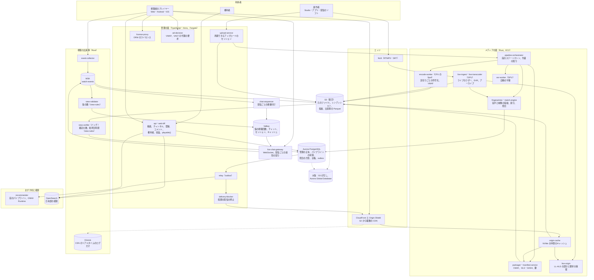

# Architecture: YouTube

全体像と横断的な方針。領域ごとの設計は、同じディレクトリに領域ごとのファイルとして置く（一覧は 7 節）。データモデルの正本（規約、表の目録、ER 図、置き場所、形式、不変条件）は [data-model.md](data-model.md) と [data-model/](data-model/) にある。品質の戦略は [quality.md](../quality.md)、Epic と Story は [roadmap.md](../roadmap.md)、SLO と運用は [runbooks/](../runbooks/README.md) にある。

## 1. 全体構成

### 1.1 コンテキスト

```
 創作者（Web の Studio、アプリ、ライブの配信のソフト）      権利者（参照の登録、方針、一致の確認）
      │ HTTPS（再開できるアップロード）                       │ HTTPS（参照のアップロード、API）
      │ RTMPS・SRT（ingest.<brand>.<domain>）                 │
      ▼                                                       ▼
┌──── 本システム（<brand>.<domain>、api.<brand>.<domain>、<brand>video.<domain>）──────────────┐
│  アップロード、変換のパイプライン、パッケージ、配信のオリジン、ライブ、ライブチャット、視聴の計測、 │
│  おすすめ、検索、著作権の照合、コメントとモデレーション、チャンネルと通知、収益化                  │
└─────────────────────────────────────────────────────────────────────────────┘
   ▲ 再生（HLS・DASH、CDN 経由）  ▲ 視聴の出来事       │ 外向き
   │ Web・Android・iOS・テレビ     │                    ▼
 視聴者                          視聴者の端末         CDN、外部の広告サーバー（VAST・VMAP）、決済の事業者、
                                                      DRM のライセンスの事業者、プッシュ（APNs・FCM）、メール
```

### 1.2 コンテナ



| コンテナ | 責務 |
| --- | --- |
| `upload-service` | 再開できるアップロードのセッション（作成、部分の受け取り、位置の問い合わせ、完了）。S3 のマルチパートのアップロードを裏に持ち、部分のチェックサムと全体の CRC64NVME を S3 に確かめさせてから完了を返す（[ADR-0002](../decisions/0002-upload-and-pipeline-orchestration.md)、[ADR-0011](../decisions/0011-upload-session-protocol-and-checksums.md)） |
| `pipeline-orchestrator` | 動画ごとのパイプラインのステートマシン（検査 → 解析 → 指紋 → 速い段の符号化 → 公開の判定 → 全段の符号化 → 字幕 → 人気での AV1）。段の作業を SQS で配り、結果を Aurora に記録する。指揮は自前（[ADR-0002](../decisions/0002-upload-and-pipeline-orchestration.md)） |
| `encode-worker` | GOP に揃えた区切り（既定 20 秒）ごとの符号化。FFmpeg のライブラリと x264・SVT-AV1 を呼ぶ。試しの符号化と VMAF でラダーを決める。EC2 の Spot（[ADR-0003](../decisions/0003-codecs-and-per-title-ladder.md)） |
| `packager`・`manifest-service` | 区切りを CMAF の fMP4 のセグメントにまとめ、レンディションごとに 1 つのファイルとセグメントの索引を S3 に置く。HLS・DASH のマニフェストは要求の時に索引から作る。DRM の対象は CENC（`cbcs`）で暗号化する（[ADR-0004](../decisions/0004-cmaf-packaging-and-drm-scope.md)） |
| `origin-cache` | CDN と S3 の間の自前の中間のキャッシュ（NVMe）。ロングテールのセグメントの範囲の読み出しをまとめ、S3 の GET を減らす。措置の拒否の集まりを持つ（[ADR-0005](../decisions/0005-cdn-and-origin-strategy.md)、[ADR-0026](../decisions/0026-origin-cache-routing-admission-and-coalescing.md)） |
| `live-ingest`・`live-transcoder` | RTMPS・SRT を受け、GPU（NVENC）でライブのラダーに変換し、LL-HLS の部分セグメントを出す。DVR の窓、ライブからの VOD（[ADR-0006](../decisions/0006-live-ingest-and-latency.md)、[ADR-0028](../decisions/0028-live-ingest-keys-backup-and-source-recording.md)、[ADR-0029](../decisions/0029-live-transcoder-placement-and-standby.md)） |
| `live-origin` | 配信ごとに直近 60 秒の部分・セグメント・プレイリストをメモリーに持ち、LL-HLS の要求の保留に答える。配信ごとに 2 つの AZ に写し（[ADR-0030](../decisions/0030-ll-hls-parameters-and-live-origin.md)） |
| `fingerprinter`・`match-engine` | 音声と映像の指紋を作り、参照の索引（メモリー、シャード）で照合し、一致の区間と方針を返す。ライブは窓ごとに照合する（[ADR-0008](../decisions/0008-fingerprinting-and-match-engine.md)） |
| `asr-worker` | 日本語・英語の自動の字幕。`AsrEngine` の口の裏のエンジン（[ADR-0017](../decisions/0017-audio-loudness-and-asr-adapter.md)） |
| `event-collector`・MSK・`view-validator`・`view-verifier` | 視聴の出来事を受けて MSK に書き、流れの中で仮の視聴回数を出し、S3 の Parquet をバッチで検証して確定の数・総再生時間・分析を作る（[ADR-0007](../decisions/0007-two-phase-view-counting.md)、[ADR-0034](../decisions/0034-watch-event-envelope-and-ingest.md)〜[0036](../decisions/0036-watch-time-retention-and-analytics-store.md)） |
| `view-rules`（クレート） | 検証の規則の 1 つの Rust のクレート。`view-validator` と `view-verifier` の両方が同じ関数を呼ぶ（[ADR-0035](../decisions/0035-view-rules-catalog-and-public-count-composition.md)） |
| `recommender` | ホームと「次の動画」のおすすめ。候補の取り出し → 絞り込み → 特徴 → スコア → 絞り込み → 混ぜ合わせ（[ADR-0010](../decisions/0010-recommendation-boundary.md)） |
| OpenSearch | 題・説明・字幕・チャンネルの検索。outbox から索引を作る（search の領域） |
| `live-chat-gateway` | ライブチャットの WebSocket。配信ごとの購読、扇形の配り、低速モード、モデレーション（[live-chat.md](live-chat.md)。Slack の題材の Gateway の形を参考にする：[realtime.md](../../../slack/docs/architecture/realtime.md)） |
| `chat-sequencer` | MSK の `chat-in` を読み、配信ごとに番号を振り、まとめを Valkey の sharded pub/sub へ送る（[ADR-0032](../decisions/0032-chat-sequencer-and-batched-fanout.md)） |
| `api`・`web-bff` | 管理の面。動画の情報、チャンネル、登録、コメント、通知、権利者と方針、異議、収益と台帳、`playable()`。TypeScript・Hono |
| `relay` | outbox を読み、SNS・SQS へ（検索の索引、通知、配信の停止、分析） |
| `license-proxy` | 再生のトークンと `playable()` を確かめてから、DRM の事業者にライセンスを求める。鍵は要求ごとに渡す（[ADR-0021](../decisions/0021-drm-key-hierarchy-and-license-proxy.md)） |
| `delivery-blocker` | 措置の outbox から、KeyValueStore の拒否の鍵・`playable()` の写し・`origin-cache` の拒否・cache tag の無効化を並べて効かせる（[ADR-0027](../decisions/0027-takedown-deny-list-within-60s.md)） |
| `ad-decision` | VMAP を作り、各枠の VAST を外部の広告サーバーへ代わりに要求する（[ADR-0055](../decisions/0055-ad-decision-vmap-and-server-side-ad-request.md)） |
| Kinesis Data Streams | CloudFront のリアルタイムのログの送り先にだけ使う（送り先が Kinesis だけのため）。視聴の出来事には使わない（[ADR-0001](../decisions/0001-platform-and-stack.md) の注記、[ADR-0067](../decisions/0067-sli-sources-and-computation.md)） |
| Aurora | 管理の正本、パイプラインの状態、照合の方針と申し立て、収益の台帳。本人だけの表は FORCE RLS（[ADR-0009](../decisions/0009-single-tenant-and-playable.md)） |
| S3 | 元のファイル、レンディション、セグメントの索引、指紋、視聴の出来事の Parquet。大阪へ CRR |
| Valkey | 仮の視聴回数、チャットの扇形の配り、セッション、キャッシュ。失ってよい |

原則は 6 つ。

- **パイプラインは段のステートマシンにし、段は冪等にする。** 各段の出力のキーは入力のハッシュと設定のバージョンから決まる。どこで落ちても、その段からやり直せる（[ADR-0002](../decisions/0002-upload-and-pipeline-orchestration.md)）。
- **公開の前に照合する。** 指紋は速い段の符号化と並べて作り、照合の結果が出るまで公開にしない（[ADR-0008](../decisions/0008-fingerprinting-and-match-engine.md)）。
- **符号化の費用は人気に合わせて使う。** すべての動画に H.264 の全段を作り、AV1 は人気が出た動画にだけ足す。配信の節約が符号化の費用を上回るところで切り替える（[ADR-0003](../decisions/0003-codecs-and-per-title-ladder.md)）。
- **1 つの形式で保存し、マニフェストは要求の時に作る。** CMAF のセグメントを 1 回だけ保存し、HLS と DASH の両方で配る（[ADR-0004](../decisions/0004-cmaf-packaging-and-drm-scope.md)）。
- **キャッシュを層にする。** CDN のエッジ → Origin Shield → 自前の中間のキャッシュ → S3。人気の動画はエッジで、ロングテールは中間のキャッシュで受ける（[ADR-0005](../decisions/0005-cdn-and-origin-strategy.md)）。
- **数は 2 段で出す。** 視聴回数は流れの中の仮の数と、遅れた検証の確定の数に分け、収益と公開の確定は後者だけを使う（[ADR-0007](../decisions/0007-two-phase-view-counting.md)）。

### 1.3 主要な流れ

**A. アップロードから公開まで**

1. 創作者がアップロードのセッションを作る（大きさ、全体の SHA-256 は任意）。`upload-service` は `video_id`（UUIDv7）とセッションの URL を返す。
2. クライアントは部分（既定 16 MiB、8〜64 MiB）を順に送る。切れたら、セッションに受け取り済みの位置を問い合わせ、続きから送る。セッションの期限は 7 日。
3. すべての部分が S3 に確定し、全体のハッシュが合ったら、完了を返し、`pipeline-orchestrator` に段の開始を出す（[ADR-0002](../decisions/0002-upload-and-pipeline-orchestration.md)）。
4. 検査（コンテナと符号化の解析、長さ、壊れた区間、既知の違法なメディアのハッシュ）。通らなければ「処理の失敗」にし、理由を返す。
5. 並べて進める：(a) 速い段の符号化（H.264 の 360p と 720p）、(b) 指紋の作成と照合、(c) 複雑さの試しの符号化（ラダーを決める）。
6. 速い段と照合が終わり、方針（一致なし、またはブロック・収益化・追跡の適用）が決まったら、公開の判定を行う。ブロックなら公開にせず、創作者に一致を示す。予約の公開なら時刻まで待つ。
7. 公開の後に、残りの段（H.264 の全段、字幕、シークの縮小の画像）を足し、マニフェストに段を加える。人気のしきい値を超えたら AV1 のラダーを作る（[ADR-0003](../decisions/0003-codecs-and-per-title-ladder.md)）。

**B. 再生**

1. プレイヤーが再生の API に `video_id` を出す。`api` が `playable(viewer, video, region)` を判定し、許すなら、マニフェストの短い期限の署名つきの URL と、広告の枠の情報（VMAP）と、DRM のライセンスの URL（メンバー限定だけ）を返す（[ADR-0009](../decisions/0009-single-tenant-and-playable.md)）。
2. プレイヤーが CDN からマニフェストを取る。`manifest-service` は、端末の対応（AV1 の復号の可否）に合わせて段を選んだマニフェストを作る。
3. プレイヤーは最初のセグメントを、回線の推定から選んだ段で取り、ABR で段を選び続ける（playback-and-abr の領域）。
4. プレイヤーは再生の開始、10 秒ごと（最初の 1 分）と 30 秒ごとの心拍、段の切り替え、再バッファ、終了を `event-collector` に送る。

**C. ライブ**

1. 配信者のソフトが RTMPS か SRT でストリームキー（`<brand>_sk_`）を付けて `ingest.<brand>.<domain>` に送る。
2. `live-ingest` がキーを確かめ、配信を 1 つの `live-transcoder`（GPU）に割り当てる。予備の割り当てを別の AZ に持つ。
3. `live-transcoder` は H.264 のラダーに変換し、CMAF の部分セグメント（0.5 秒）と完全なセグメント（2 秒）を出す。低遅延のモードは LL-HLS、通常のモードは 2 秒のセグメントの HLS・DASH（[ADR-0006](../decisions/0006-live-ingest-and-latency.md)）。
4. セグメントは S3 に書き、DVR の窓（12 時間）の索引を更新する。`match-engine` が 30 秒の窓ごとに照合し、ブロックの方針に当たったら配信を止めて差し替えの画面にする。
5. 配信の終わりに、同じセグメントの索引から VOD を作る。VOD のラダー（H.264 の全段）を元の流れから作り直すのは、7 日で確定の視聴が 100 回を超えたアーカイブなどに限る（[ADR-0031](../decisions/0031-dvr-storage-and-live-to-vod.md) の 2026-10-10 の注記）。

**D. 視聴回数**

1. `event-collector` が出来事の署名（再生の API が渡した再生のトークン）を確かめ、MSK の `watch-events` に書く。
2. `view-validator` が、`view-rules` のクレートで流れの中の判定（重複、明らかなボット、速すぎる繰り返し）を行い、仮の視聴回数を Valkey に積む。公開の数として p95 60 秒で出す。
3. 出来事は 5 分ごとに S3 の Parquet にまとまる。`view-verifier` が 1 時間ごとと 1 日ごとに、同じクレートの全部の規則（端末と回線の集団の偏り、視聴の工場の型、ボットの点）で確定の数・総再生時間・エンゲージ ビューを作り、Aurora に書く（[ADR-0007](../decisions/0007-two-phase-view-counting.md)）。
4. 公開の数は「確定の数 ＋ 確定の後の仮の数」で出す。確定で減った分は、理由のコードとともに記録する。

**E. 著作権の照合**

1. 権利者が参照のファイルを上げる。同じパイプラインで指紋を作り、参照の索引に入れる。他の参照との重なり（所有の衝突）を確かめる。
2. 動画の指紋（音声は山の組のハッシュ、映像はフレームの知覚ハッシュ）で、参照の索引を引き、時刻のずれの揃いで候補を絞り、区間ごとに確かめる（[ADR-0008](../decisions/0008-fingerprinting-and-match-engine.md)）。
3. 一致ごとに、参照の方針（地域ごとのブロック・収益化・追跡）を当て、複数の一致を決定表で 1 つの結果にまとめる（ブロックが最も強い）。
4. 創作者は一致を見て、異議を申し立てられる。権利者が応じなければ一致を外す。権利者は削除の申出に進められる（copyright-claims-and-disputes の領域。法務の L1・L2）。

### 1.4 本家の形（確かめたこと）

| 項目 | 本家 | 出典 |
| --- | --- | --- |
| アップロードの上限 | 256 GB か 12 時間の小さいほう。15 分を超えるのは確認済みのアカウント | [Upload videos longer than 15 minutes](https://support.google.com/youtube/answer/71673) |
| 推奨のアップロードの形 | MP4、H.264 High、閉じた GOP（フレームレートの半分）、1080p30 で 8 Mbps、AAC-LC か Opus | [Recommended upload encoding settings](https://support.google.com/youtube/answer/1722171) |
| 変換の基盤 | 専用のチップ（VCU）。VP9 の符号化は H.264 の 5 倍の計算。AV1 を足す | [Reimagining video infrastructure](https://blog.youtube/inside-youtube/new-era-video-infrastructure/)（2021-04-21） |
| 視聴回数 | 2026-08-24 から再生の開始で数える。人の視聴を確かめるため、数を遅らせ・止め・直すことがある。収益はエンゲージ ビューで決まる | [How video views are counted](https://support.google.com/youtube/answer/2991785) |
| ライブの遅延 | 通常・低遅延（10 秒未満）・超低遅延（5 秒未満）。低遅延と超低遅延は 4K なし | [Live stream latency](https://support.google.com/youtube/answer/7444635) |
| ライブの取り込み | RTMP・RTMPS（推奨）、HDR は HLS も。H.264・H.265・AV1 | [Live encoder settings](https://support.google.com/youtube/answer/2853702) |
| DVR とアーカイブ | 12 時間を超えると DVR が制限され、アーカイブされないことがある | [Turn on DVR](https://support.google.com/youtube/answer/9296823)、[Archive live streams](https://support.google.com/youtube/answer/6247592) |
| 自動の字幕 | 日本語を含む多くの言語。ライブは英語だけ | [Use automatic captioning](https://support.google.com/youtube/answer/6373554) |
| Content ID | 自動の走査、ブロック・収益化・追跡（地域ごと）、権利者の審査 | [How Content ID works](https://support.google.com/youtube/answer/2797370) |
| 反論の通知 | 申し立てた側は 10 営業日で応える。応えなければ戻す | [Counter notification](https://support.google.com/youtube/answer/2807684) |
| 収益化の条件 | 登録者 1,000 と 12 か月の公開の視聴時間 4,000 時間（長い動画の道） | [YPP overview](https://support.google.com/youtube/answer/72851) |
| 収益の分配 | 視聴の画面の広告の純収益の 55%、メンバーシップなどの商取引の純収益の 70% を創作者へ | [YPP: Revenue shares](https://support.google.com/youtube/answer/72902) |
| 申し立ての異議 | 申し立てた側は異議に 30 日、再審査に 7 日で応える。ブロックの申し立ては直接の再審査（7 日） | [Dispute a Content ID claim](https://support.google.com/youtube/answer/2797454) |
| 違反の記録（strike） | 最初は警告。strike は 90 日で失効、90 日に 3 つでチャンネルの終了。著作権の strike は削除した動画ごとに 1 つ | [Community Guidelines strike basics](https://support.google.com/youtube/answer/2802032)、[Copyright strike basics](https://support.google.com/youtube/answer/2814000) |
| チャンネルの役割 | 所有者・管理者・編集者・編集者（限定）・字幕の編集者・閲覧者・閲覧者（限定）の 7 つ。所有者は移せない | [Manage channel permissions](https://support.google.com/youtube/answer/9481328) |
| 履歴の停止 | 履歴を止めていて意味のある履歴がない人に、ホームのおすすめを出さない | [View, delete, or pause watch history](https://support.google.com/youtube/answer/95725) |
| 1 分あたりのアップロードの時間、Content ID の参照の規模と方式、ライブの照合、通常のモードの遅延、照合の後に公開するか、純収益の定義と支払いの日、DRM の範囲、所有者のいないチャンネルの扱い | 公式の資料で確かめられなかった（**未検証**） | — |

いずれも 2026-10-10 に確認。この設計は振る舞いを参考にするが、本家のコード・プレイヤー・内部の形式・モデルは使わない（[リポジトリ共通の ADR-0007](../../../../docs/decisions/0007-no-reuse-of-original-implementation.md)）。

**本家との意図した違い**：

| 項目 | 本家 | 本システム | 理由・根拠 |
| --- | --- | --- | --- |
| コーデックの組 | H.264・VP9・AV1 | H.264 と AV1 の 2 つ。VP9 を作らない | 3 つ目のラダーの保存と符号化の費用を省く。AV1 の復号は 2026 年の端末で広く使え、使えない端末は H.264 で受ける（[ADR-0003](../decisions/0003-codecs-and-per-title-ladder.md)） |
| 変換の基盤 | 専用のチップ | 汎用の CPU（Spot）と GPU（ライブ） | 小さなチームの題材の外。AV1 を人気の動画に絞って費用を抑える |
| ライブの取り込み | RTMP・RTMPS・HLS | RTMPS と SRT（暗号つき）。平文の RTMP は受けない | ストリームキーを平文で流さない。SRT は揺れる回線に強い（[ADR-0006](../decisions/0006-live-ingest-and-latency.md)） |
| 超低遅延のライブ | あり（5 秒未満） | MVP はなし。低遅延（LL-HLS、p95 6 秒）まで | WebRTC の配信の仕組みが別になる。MVP の後に決める |
| 公開と照合 | 照合の後に公開するかは未検証 | 照合の結果が出るまで公開しない | 権利者を守る側に倒す。照合を速い段と並べて待ちを短くする（[ADR-0008](../decisions/0008-fingerprinting-and-match-engine.md)） |
| ライブの自動の字幕 | 英語だけ | MVP はなし | 流れの中の ASR の費用と質を MVP の後に測る |
| DRM | 有料の作品に使う（範囲は未検証） | メンバー限定の動画だけ。公開の動画は暗号化しない | 費用と再生の開始の速さ（[ADR-0004](../decisions/0004-cmaf-packaging-and-drm-scope.md)） |
| ライブのアーカイブ | 12 時間を超える配信は記録されないことがある（どの部分を残すかは書かれていない） | 12 時間を超える配信は最後の 12 時間を残す。DVR の窓と同じ中身にする | intent の「DVR で見た範囲と同じ中身」（[ADR-0031](../decisions/0031-dvr-storage-and-live-to-vod.md)） |
| ライブのアーカイブの画質 | 未検証 | 7 日で確定の視聴が 100 回に届かないアーカイブは、ライブのラダーのまま VOD にし、30 日の後に 720p・360p と音声だけに間引く（仮。PM の判断待ち） | 平均 400 配信を全部作り直すと、保存が 1 年で約 21 PB になる（2.2 節、[ADR-0031](../decisions/0031-dvr-storage-and-live-to-vod.md) の注記） |
| 履歴を止めた利用者のホーム | ホームのおすすめを出さない | 個人化しない並び（人気・カテゴリ・登録の新着）を出す | ログインしない視聴者と同じ並びを出せる。履歴は使わない（[ADR-0039](../decisions/0039-diversity-mixer-history-controls-and-non-personalized-feed.md)） |
| 広告の要求 | 未検証 | VAST はサーバー（`ad-decision`）が代わりに要求し、文脈の値だけを送る。利用者の識別子・IP アドレスを広告サーバーへ送らない | 第三者に渡る情報を本システムが決める（[ADR-0055](../decisions/0055-ad-decision-vmap-and-server-side-ad-request.md)。法務の L5・L6） |
| 所有者のいないチャンネル | 未検証 | 所有者のアカウントが消えたら 90 日の「所有者なし」の間に、運用のサポートの手続きで管理者を所有者にできる | 企業のチャンネルの運用を止めない（[ADR-0059](../decisions/0059-accounts-channels-and-roles.md)） |
| 支払いの口座 | 未検証 | 所有者だけが扱える | 乗っ取りの目的になるため（[ADR-0059](../decisions/0059-accounts-channels-and-roles.md)） |
| 2 要素の必須 | 未検証 | 登録者 1 万以上・収益化・ライブ・権利者のチャンネルの所有者と管理者に必須。SMS は回復だけ | 乗っ取りの被害を絞る（[ADR-0060](../decisions/0060-authentication-2fa-and-creator-sessions.md)） |
| ハンドル | 未検証 | ASCII の 3〜30 文字。日本語のハンドルは S2 | なりすましの文字の検査を後に回す（[ADR-0053](../decisions/0053-handles-and-subscription-tables.md)） |
| メンバーシップの販売 | アプリでも買える（範囲は未検証） | MVP は Web だけで売る | アプリの店の規則と法務の L7（[ADR-0056](../decisions/0056-channel-memberships-via-payment-provider.md)） |
| 反論の通知 | 米国の 10 営業日の手続き | 枠組みだけを作り、既定は無効（`legal.copyright.counter.enabled`） | 日本で持つかは法務の L2（[ADR-0049](../decisions/0049-takedown-cases-counter-notice-and-strikes.md)） |
| 著作権の strike の再審査の条件 | 未検証 | 再審査は上級の機能の段のチャンネルだけ、開いている再審査 3 件まで | 本システムの値（[ADR-0048](../decisions/0048-claim-dispute-appeal-state-machine-and-deadlines.md)） |
| 視聴回数の数え方の細部 | エンゲージ ビューのしきい値は非公開 | エンゲージ ビューは 30 秒（30 秒未満の動画は 90%）。同じ組は 24 時間に 4 回まで | 本システムの値（[ADR-0007](../decisions/0007-two-phase-view-counting.md)、[ADR-0035](../decisions/0035-view-rules-catalog-and-public-count-composition.md)） |
| ヘッダー・キー・ドメイン | 本家の名前を含む | `<Brand>`・`<brand>` | リポジトリ共通の ADR-0006 |

## 2. 規模の段階

| 段階 | 視聴者（月） | アップロード | 視聴の時間 | 同時の視聴（ピーク） | 配信のピーク | 保存（累計） | ライブ（同時の配信 / 1 配信の最大の視聴） | 参照（著作権） | 視聴の出来事 | 構成 |
| --- | --- | --- | --- | --- | --- | --- | --- | --- | --- | --- |
| S1（MVP） | 1,000 万 | 1 時間/分（1,440 時間/日） | 100 万時間/日 | 15 万 | 平常 0.3 Tbps（月 27 PB）。大きな催しの日 0.9 Tbps | 1 年目の終わり 約 10 PB（アップロード 3.4 PB、ライブのアーカイブ 約 7 PB） | ピーク 2,000（平均 400）/ 20 万 | 10 万時間 | 平均 1,400 件/秒、ピーク 5,000 件/秒 | 東京の 1 リージョン・3 AZ。CloudFront と Origin Shield。大阪に管理の面のウォームスタンバイと S3 の写し |
| S2 | 5,000 万 | 30 時間/分（4.3 万時間/日） | 3,000 万時間/日 | 375 万 | 8 Tbps（月 900 PB） | 年に約 100 PB 増える | 3 万 / 200 万 | 200 万時間 | ピーク 15 万件/秒 | 複数の CDN と、CDN の振り分け。中間のキャッシュを増やす。メディアの面を AZ ごとのプールに |
| S3 | 本家に近い規模 | 500 時間/分（72 万時間/日） | 10 億時間/日 | 1 億 | 250 Tbps | 年に約 1.7 EB 増える | 30 万 / 1,000 万 | 2,000 万時間 | ピーク 500 万件/秒 | ISP の中に自前のキャッシュの機器、海外の地域、保存の層の積極的な移し |

- 数値は本システムの想定。S3 の「500 時間/分」は広く引かれる本家の値だが、公式の資料で確かめられなかった（**未検証**）。本家の公式の値は「1 日に平均 2,000 万本を超える動画」（[Press](https://blog.youtube/press/)、2026-10-10 に確認）。
- 配信の量は、平均の配信のビットレートを 2 Mbps（S1。スマートフォンの多い日本の視聴を見込む）、2.2 Mbps（S2）、2.5 Mbps（S3）とし、1 時間の視聴で 0.9〜1.1 GB と見込んだ。同時の視聴のピークは平均の 3.5 倍（S1）、3 倍（S2）、2.5 倍（S3）と見込んだ。
- 保存は、アップロードの 1 時間あたり平均 6.5 GB（元のファイル 3 GB、H.264 のレンディション 3.2 GB、AV1 は時間の 10% に 2.5 GB）。
- 視聴の出来事は、1 時間の視聴あたり約 120 件（開始、心拍、切り替え、終了）。
- **大きな催しは上乗せの山として扱う**（2026-10-10 の統合）。「1 配信の最大 20 万人」の LL-HLS の配信は、20 万 × 3 Mbps ＝ 0.6 Tbps で、平常のピーク 0.3 Tbps に重なる。催しの日の全体のピークを 0.9 Tbps と見込み、CDN の上限と部品の台数はこの値で決める（[capacity.md](capacity.md) の 2.1 節、[ADR-0069](../decisions/0069-load-model-headroom-and-load-tests.md)）。
- **LL-HLS の要求の量**：低遅延のモードの視聴者 1 人は 0.5 秒ごとにプレイリストの保留・映像の部分・音声の部分の 3 つを取り、6 件/秒になる。20 万人の配信で 120 万件/秒。CloudFront の既定の上限（ディストリビューションごとに 150 Gbps・25 万件/秒）を超えるので、VOD・ライブ・画面と API の 3 つのディストリビューションに分け、上限をそれぞれ申請する（`vod` 0.6 Tbps・50 万件/秒、`live` 1.2 Tbps・250 万件/秒。[ADR-0064](../decisions/0064-accounts-network-and-edge-distributions.md)）。
- **ライブの平均の配信の数**：S1 のピーク 2,000 配信に対し、平均 400 配信（ピークの 20%）と仮定する（本システムの仮定）。ライブの GPU、アーカイブの保存と変換はこの値に比例する（[capacity.md](capacity.md) の 2.3 節）。
- 保存の「ライブのアーカイブ 約 7 PB」は、アーカイブの作り直しを条件つきにした後の値である（2.1 節、[ADR-0031](../decisions/0031-dvr-storage-and-live-to-vod.md) の注記）。全部を作り直すと約 21 PB になる。
- 段階を上げる基準は [infrastructure.md](infrastructure.md) の 9 節、負荷と費用のモデルは [capacity.md](capacity.md) にある。

### 2.1 費用のモデル

3 つの単位で原価を見る。単価は AWS の東京の公開の価格表（2026-10-10 に取得）で [infrastructure.md](infrastructure.md) の 11 節が置き直した値に揃えた（2026-10-10 の統合）。Spot の単価と約定の値引きの率は**未検証**。

```
保存の原価（1 時間の動画・1 か月）
  = 元のファイル（3 GB × 層の単価）＋ レンディション（3.2 GB × 層の単価）＋ AV1（あれば 2.5 GB × 層の単価）
    ＋ 指紋・字幕・縮小の画像（0.05 GB）＋ 大阪への写し（元のファイルだけ）

配信の原価（1 GB）
  = CDN の転送の実効の単価 ＋ キャッシュの外れの割合 ×（中間のキャッシュ ＋ S3 の GET ＋ リージョンの外への転送）
    ＋ マニフェストと再生の API（要求の数）

変換の原価（1 時間の動画）
  = 速い段（H.264 の 2 段）＋ H.264 の全段 ＋ 試しの符号化と VMAF ＋ 指紋 ＋ ASR（GPU）
    ＋（人気になったら）AV1 の全段
```

| 単位 | 仮の値（S1） | 内訳と前提 |
| --- | --- | --- |
| 保存：1 時間の動画・1 か月（公開の後 30 日） | 約 0.11 USD | レンディション 3.2 GB を Intelligent-Tiering の Frequent（0.025 USD/GB・月）、元のファイル 3 GB を Glacier Instant Retrieval（0.005 USD/GB・月）、大阪の元のファイルの写し 3 GB（0.005）。写しの転送は 1 回 0.045 USD |
| 保存：1 時間の動画・1 か月（90 日の後、見られていない） | 約 0.028 USD | レンディションを Intelligent-Tiering の Archive Instant Access（0.005 USD）、元のファイルと大阪の写しを Glacier Deep Archive（約 0.002 USD。**未検証**）。元のファイルの戻しは標準 12 時間以内・大量 48 時間以内 |
| 配信：1 GB | 予算 0.02 USD（S1、仮。PM の判断待ち）、0.008 USD（S2）、0.004 USD（S3） | CloudFront の日本の公開の価格は月 27 PB で加重の平均 約 0.062 USD/GB、要求とエッジの関数を足して 約 0.064 USD/GB。予算は約 69% の値引きを前提にする（下の「配信の費用の選択肢」） |
| 変換：1 時間の動画（H.264 の道） | 約 0.27 USD | 約 9.9 vCPU 時間 × Spot 約 0.02 USD（**未検証**）＝ 約 0.20、急ぎの段の On-Demand の分 約 0.04、ASR の GPU 約 0.03 |
| 変換：1 時間の動画（AV1 を足す） | ＋ 約 0.80 USD | SVT-AV1 の全段 約 40 vCPU 時間 × Spot。同じ VMAF で約 35% 少ないビットで配れると見込む（`av1-cost-poc` で確かめる） |
| ライブの変換：1 配信・1 時間 | 約 0.24 USD | `g6.2xlarge`（L4 × 1）1.418 USD/時間 ÷ 6 配信（On-Demand。`ll-hls-poc` で 6 配信を確かめる） |

- **最も大きいのは配信である。** S1 の本番の月の原価は約 103 万 USD（±50%）と見込む：配信の転送 約 54 万（予算の単価。公開の価格なら約 173 万）、要求・エッジの関数・LL-HLS の要求 約 11.5 万、ライブの GPU 約 12.8 万、保存 約 13 万（アップロード 6 万、ライブのアーカイブ 7 万）、変換 約 1.7 万、その他 約 10 万。内訳は [capacity.md](capacity.md) の 6 節。約定の値引きが届かなければ約 230 万 USD になる。
- **AV1 の損益の分かれ目**（[ADR-0016](../decisions/0016-av1-promotion-rule-and-cost.md)）：AV1 の費用は 1 時間の動画あたり約 1.05 USD（符号化 0.80、試し 0.05、1 年の保存 0.20）。視聴 1 時間あたりの節約は約 0.0044 USD（H.264 の 0.9 GB × 削減 35% × AV1 を復号できる再生の割合 0.7（**未検証**）× 0.02 USD/GB）。分かれ目は動画 1 時間あたり約 240 視聴時間で、10 分の動画では約 40 視聴時間、平均 5 分の視聴なら**約 480 回**に当たる。人気のしきい値（7 日で 1,000 回の確定の視聴）はこれより十分に大きく、安全の側にある。1 時間を超える動画には総再生時間の条件を足す（ADR-0016）。
- **ロングテール**：保存の量の大部分は、ほとんど見られない動画である。レンディションは Intelligent-Tiering で 30 日・90 日に安い層へ移り、見られたら戻る。元のファイルは作り直しにだけ使うので、90 日の後に Deep Archive に置く。
- MediaConvert の価格での比べは式だけを置いた（[transcoding-pipeline.md](transcoding-pipeline.md) の 12 節。分あたりの価格は**未検証**）。

#### 配信の費用の選択肢（2026-10-10 の統合。仮の決定、PM の判断待ち）

CloudFront の公開の価格（月 27 PB で約 0.064 USD/GB）は予算 0.02 USD/GB の約 3.2 倍で、予算は約 69% の値引きを前提にする。届かなければ S1 の配信の転送は月 約 173 万 USD になる。

| 選択肢 | 効き方（S1、月 27 PB） | 費用と難しさ | 時機 |
| --- | --- | --- | --- |
| A. 約定の値引き（量の約定） | 69% なら 0.02 USD/GB で約 54 万 USD。50% なら 0.032 USD/GB で約 86 万 USD | 率は**未検証**。量の約定の期間と下限を負う | E5 の前（`cdn-cost-poc`、`cdn-commit-negotiation`） |
| B. 複数の CDN を早める（S1 から） | 2 社の見積もりで単価を競わせる。単価の差は**未検証** | 振り分けの計測、2 つの拒否の一覧と署名の運用（[ADR-0005](../decisions/0005-cdn-and-origin-strategy.md) が S1 で外した理由）。`multi-cdn-poc` を前倒し | E15 の前 |
| C. 自前のエッジのキャッシュ・ISP との接続 | 1 つの ISP のピークが 100 Gbps を超えたところで効く。S1 の全体のピークは 0.3 Tbps で、効く ISP はほとんどない | 機器・回線・運用。小さなチームの S1 の範囲を超える | S3（[cdn-and-delivery.md](cdn-and-delivery.md) の 13 節） |
| D. バイトを減らす（ラダーと AV1） | 平均のビットレートを 2 → 1.6 Mbps（−20%）にすると月 5.4 PB 減り、公開の価格で約 35 万・予算の単価で約 11 万 USD の節約。AV1 が総再生時間の 80% を覆えば最大で約 20% 減る（0.8 × 0.7 × 35%） | 電話の段の上限（`mobile_top`）の既定化、AV1 のしきい値を下げる（符号化の費用が増える）、画質の目標（NFR-004 の VMAF 80）との釣り合い | E3・E4 から |

- **推奨の既定（仮）**：A を主にし、D を並べる。E5 の前に約定の見積もりを取り、実効の単価が 0.03 USD/GB 以下なら A で進める。0.03 USD/GB を超えたら、PM が「平均のビットレートの目標を 1.6 Mbps に下げる（D）」と「B を S1 に前倒しする」のどちらか、または予算の見直しを決める。C は S3 のまま。
- 予算 0.02 USD/GB は、この判断まで仮の値として扱う（6 節の残る未解決事項）。

## 3. 非機能要件

| ID | 項目 | S1 の目標 | 備考 |
| --- | --- | --- | --- |
| NFR-001 | アップロード | 部分（8〜64 MiB）ごとの受け取りの確定 p99 2 秒（部分の転送の時間を除く）。切れても受け取り済みの部分を送り直さずに再開できる。セッションの期限 7 日。1 ファイル 256 GB・12 時間まで | [ADR-0002](../decisions/0002-upload-and-pipeline-orchestration.md) |
| NFR-002 | アップロードから再生まで | 10 分の 1080p：再生できるまで p50 60 秒・p95 3 分、H.264 の全段まで p95 10 分。1 時間の 1080p：再生できるまで p95 10 分、全段まで p95 40 分。AV1 はしきい値を超えてから 6 時間以内（元のファイルが Deep Archive にある古い動画は、戻し（標準で 12 時間以内）が終わった時から数える）。照合の待ちを含む。再生できるまでの SLI は長さ 8〜12 分・720p 以上の動画の帯で測る | [ADR-0002](../decisions/0002-upload-and-pipeline-orchestration.md)、[ADR-0003](../decisions/0003-codecs-and-per-title-ladder.md)、[ADR-0016](../decisions/0016-av1-promotion-rule-and-cost.md)、[ADR-0067](../decisions/0067-sli-sources-and-computation.md) |
| NFR-003 | 再生の開始 | 再生の要求から最初のフレームまで p50 1.0 秒・p95 2.5 秒（日本、CDN のヒット）。開始の失敗 0.5% 以下 | [ADR-0022](../decisions/0022-buffer-based-abr.md)、[ADR-0023](../decisions/0023-playback-token-and-qoe-metrics.md) |
| NFR-004 | 再バッファ | 再バッファの時間が総再生時間の 0.5% 以下。再生 100 分あたりの再バッファの回数 0.3 回以下。平均の VMAF（端末の画面の大きさで重み付け）80 以上 | [ADR-0022](../decisions/0022-buffer-based-abr.md)、[ADR-0023](../decisions/0023-playback-token-and-qoe-metrics.md) |
| NFR-005 | ライブの遅延 | 低遅延のモード（LL-HLS）：撮影から画面まで p50 4 秒・p95 6 秒。通常のモード：p95 20 秒。配信の開始から視聴できるまで 10 秒。DVR の窓 12 時間。配信の終わりから VOD で見られるまで p95 5 分。部分を 1 秒にする案（p95 約 7.3 秒）は `ll-hls-poc` の結果と PM の合意まで持ち越し | [ADR-0006](../decisions/0006-live-ingest-and-latency.md)、[ADR-0030](../decisions/0030-ll-hls-parameters-and-live-origin.md) |
| NFR-006 | 視聴回数 | 仮の数が公開の数に出るまで p95 60 秒。確定の数は 24 時間以内（p99）。創作者の分析は仮の数で 2 時間、確定で 48 時間以内。不正の場面の水増しの 99% 以上を確定の数から除き、正しい視聴を除く割合 0.5% 以下 | [ADR-0007](../decisions/0007-two-phase-view-counting.md) |
| NFR-007 | 照合 | 1 時間以下の VOD：アップロードの完了から照合の結果まで p95 5 分。12 時間の VOD：p95 30 分。ライブ：一致の始まりから検出まで p95 90 秒。歪めた参照（10 秒以上）の再現率 95% 以上。異議で取り消された一致 0.5% 以下 | [ADR-0008](../decisions/0008-fingerprinting-and-match-engine.md) |
| NFR-008 | 配信 | セグメントの要求の成功 月間 99.99%（CDN のエッジ）。キャッシュの外れの割合（バイト）5% 以下（目標。S1 の容量と費用の見積もりはエッジのヒット 90%（外れ 10%）で置いている。95% に要る実効のキャッシュ 273〜390 TB を満たせるかは `cdn-cost-poc` で確かめ、届かなければこの値を見直す）。S2 から 1 つの CDN の障害で 5 分以内に他へ移す | [ADR-0005](../decisions/0005-cdn-and-origin-strategy.md) |
| NFR-009 | 耐久性 | 完了を返したアップロードの元のファイル・レンディションの消失 0。AZ の障害で RPO 0。リージョンの障害で、管理の面 RPO 1 分・RTO 1 時間、元のファイルの写し RPO 15 分、再生の再開 RTO 2 時間（大阪の写しから、AV1 なしの段で）。**解釈（仮、PM・QA の判断待ち）**：RTO 2 時間は「熱い集まり」（直近 7 日の確定の総再生時間の 90% を占める動画など）で満たす。熱い集まりの外の動画は大阪で作り直すまで待つ（90 日以内は数分、それより古いものは Deep Archive の戻しで 12 時間以内） | [ADR-0002](../decisions/0002-upload-and-pipeline-orchestration.md)、[ADR-0066](../decisions/0066-osaka-dr-stage-up-and-multi-cdn-timing.md) |
| NFR-010 | 可用性 | 再生の API 月間 99.95%、アップロード 月間 99.9%、ライブの取り込み 月間 99.95%、管理の画面 月間 99.9% | 本家の SLA は公式の資料で確かめなかった（**未検証**） |
| NFR-011 | 検索 | 検索の応答 p95 300 ms。公開から検索に出るまで 10 分、字幕は 1 時間 | [ADR-0041](../decisions/0041-search-index-layout-and-caption-chunks.md)、[ADR-0042](../decisions/0042-search-query-builder-ranking-and-suggest.md) |
| NFR-012 | おすすめ | ホームの最初のページ p99 400 ms、「次の動画」p99 300 ms。落ちたら個人化しない並びで返す | [ADR-0010](../decisions/0010-recommendation-boundary.md) |
| NFR-013 | ライブチャット・コメント | 20 万人の配信で、チャットの送信から視聴者の画面まで p95 2 秒。コメントの投稿 p99 500 ms | [ADR-0032](../decisions/0032-chat-sequencer-and-batched-fanout.md)、[ADR-0051](../decisions/0051-comment-posting-pipeline-spam-and-hold.md) |
| NFR-014 | 措置 | 措置・削除・ブロックの方針の決定から、新しい再生とセグメントの配信が止まるまで 60 秒以内。ライブの照合のブロックは検出から 10 秒以内に配信を差し替える | [ADR-0005](../decisions/0005-cdn-and-origin-strategy.md)、[ADR-0009](../decisions/0009-single-tenant-and-playable.md) |
| NFR-015 | 収益 | 収益の分配の計算の参照の実装との差 0 円（台帳の単位）。月の締めから創作者の明細まで 5 営業日 | [ADR-0057](../decisions/0057-revenue-ledger-share-calculation-and-rounding.md) |

## 4. 技術スタック

| 層 | 選定 | 理由 |
| --- | --- | --- |
| 管理の面の言語 | TypeScript（Hono＋Zod） | 他の題材と同じ（[ADR-0001](../decisions/0001-platform-and-stack.md)） |
| メディアの面・計測の言語 | Rust（パイプラインの指揮、符号化の作業者の殻、パッケージ、オリジン、ライブ、指紋と照合、視聴の検証）。非同期は Tokio | [ADR-0001](../decisions/0001-platform-and-stack.md)。共通の基盤からの外れ |
| 符号化の部品 | FFmpeg のライブラリ（libavformat・libavcodec・libavfilter、LGPL の組み立て）、x264、SVT-AV1、NVENC（ライブ）、libvmaf | [ADR-0003](../decisions/0003-codecs-and-per-title-ladder.md)。第三者の汎用の部品 |
| パッケージ | 自前の CMAF の書き手とマニフェストの生成（Rust）。CENC `cbcs` | [ADR-0004](../decisions/0004-cmaf-packaging-and-drm-scope.md) |
| DRM のライセンス | 外部の複数の DRM のライセンスの事業者（Widevine・FairPlay・PlayReady）。鍵は自前の KMS で管理 | [ADR-0004](../decisions/0004-cmaf-packaging-and-drm-scope.md) |
| CDN | CloudFront ＋ Origin Shield（東京）。VOD・ライブ・画面と API の 3 つのディストリビューション。オリジンは VPC オリジンの NLB。2 つ目の CDN は月 100 PB かピーク 1 Tbps の前 | [ADR-0005](../decisions/0005-cdn-and-origin-strategy.md)、[ADR-0064](../decisions/0064-accounts-network-and-edge-distributions.md)、[ADR-0066](../decisions/0066-osaka-dr-stage-up-and-multi-cdn-timing.md) |
| ライブ | RTMPS・SRT の自前の受け口（Rust）、GPU の EC2（`g6.2xlarge`、L4、NVENC。下限はキャパシティの予約）、自前の `live-origin` | [ADR-0006](../decisions/0006-live-ingest-and-latency.md)、[ADR-0065](../decisions/0065-media-fleets-msk-and-storage-tiers.md) |
| 視聴の出来事 | Amazon MSK（Kafka のプロトコル）→ S3 の Parquet（Iceberg の表）。検証のバッチは Rust と Apache DataFusion | [ADR-0001](../decisions/0001-platform-and-stack.md)、[ADR-0007](../decisions/0007-two-phase-view-counting.md)。共通の基盤（SQS・SNS）からの外れ |
| 指紋の索引 | 自前のメモリーの転置の索引（Rust）、S3 の写し | [ADR-0008](../decisions/0008-fingerprinting-and-match-engine.md) |
| 検索 | Amazon OpenSearch Service（kuromoji と N-gram）。X の題材の形（[ADR-0025](../../../x/docs/decisions/0025-search-engine-and-japanese-analysis.md)）に寄せる | [ADR-0041](../decisions/0041-search-index-layout-and-caption-chunks.md) |
| おすすめ | 段のパイプライン（TypeScript の殻と Rust の取り出し）、ONNX Runtime、学習は SageMaker（S2 から） | [ADR-0010](../decisions/0010-recommendation-boundary.md) |
| ASR | `AsrEngine` の口の裏のエンジン。既定の案は GPU で自前でホストする公開の重みのモデル、Amazon Transcribe を 2 つ目の実装に | [ADR-0017](../decisions/0017-audio-loudness-and-asr-adapter.md) |
| 管理の DB | Aurora PostgreSQL 18、本人だけの表に FORCE RLS と `SET LOCAL`、ID は UUIDv7、outbox | [ADR-0009](../decisions/0009-single-tenant-and-playable.md) |
| キャッシュ | ElastiCache Valkey | 他の題材と同じ。失ってよい部品 |
| 非同期（管理の面） | transactional outbox → SNS・SQS | 他の題材と同じ |
| 実行基盤 | 管理の面は ECS Fargate。メディアの面は ECS の EC2 のキャパシティープロバイダー（CPU の Spot、GPU、NVMe） | [ADR-0001](../decisions/0001-platform-and-stack.md)。共通の基盤からの外れ |
| オブジェクトストレージ | S3（SSE-KMS とバケットキー、層の移し、大阪への CRR） | [ADR-0002](../decisions/0002-upload-and-pipeline-orchestration.md) |
| クライアント | Web は React と MSE の自前のプレイヤー。Android は Media3（ExoPlayer）に自前の ABR。iOS は AVPlayer（HLS の ABR は OS）。テレビは Web の形 | [ADR-0022](../decisions/0022-buffer-based-abr.md) |
| IaC・計測・フラグ | Terraform、OpenTelemetry（ADOT）、AWS AppConfig。自己監視は大阪の `selfmon` のアカウント。CDN のリアルタイムのログだけ Kinesis | 他の題材と同じ。[ADR-0067](../decisions/0067-sli-sources-and-computation.md)、[ADR-0068](../decisions/0068-qoe-privacy-limits-cdn-logs-and-selfmon.md) |
| テスト | `cargo test`・proptest・cargo-fuzz、Vitest・fast-check、黄金の動画の集まりと VMAF、ABR の模擬（ネットワークの記録）、不正の場面の生成器、歪めた参照の集まり、Testcontainers（PostgreSQL 18、Valkey、Kafka）、LocalStack、Playwright | [quality.md](../quality.md) |

## 5. 主な決定

どれも `accepted`。0001〜0010 は最初の設計の起票で、下の表に置く。0011〜0071 は領域の文書の工程で起票した（0037・0040 は使わなかった空きの番号）。各領域の ADR は 7 節の各文書の頭の表にあり、状態の一覧は [decisions/README.md](../decisions/README.md)。統合の工程で、決定を覆した・具体にした ADR に日付付きの注記を足した（6 節の「決定（2026-10-10、統合）」）。

| ADR | 決定 |
| --- | --- |
| [0001](../decisions/0001-platform-and-stack.md) | 管理の面は共通の基盤を引き継ぎ、メディアの面と視聴の計測は Rust で書く。メディアの面は ECS の EC2（CPU の Spot、GPU、NVMe）で動かす。視聴の出来事は MSK に流す |
| [0002](../decisions/0002-upload-and-pipeline-orchestration.md) | アップロードは自前の再開できるセッション（S3 のマルチパートの上）。全体の確かめは CRC64NVME の全体のチェックサム（ADR-0011 で具体にした）。パイプラインは自前の段のステートマシンで、段は冪等。元のファイルを保持する |
| [0003](../decisions/0003-codecs-and-per-title-ladder.md) | H.264 を全動画、AV1 を人気の動画にだけ。VP9 は作らない。動画ごとのラダーを試しの符号化と VMAF で決める。VOD は CPU の Spot、ライブは GPU。MediaConvert は使わない（損益の計算を ADR-0016 で直した） |
| [0004](../decisions/0004-cmaf-packaging-and-drm-scope.md) | CMAF の fMP4 で 1 回だけ保存し、HLS と DASH のマニフェストを要求の時に作る。VOD のセグメント 4 秒。DRM はメンバー限定の動画だけ（CENC `cbcs`） |
| [0005](../decisions/0005-cdn-and-origin-strategy.md) | S1 は CloudFront と Origin Shield と自前の中間のキャッシュ。S2 から複数の CDN と計測による振り分け。S3 で ISP の中のキャッシュを検討。配信の停止は拒否の一覧で 60 秒以内 |
| [0006](../decisions/0006-live-ingest-and-latency.md) | ライブの取り込みは RTMPS と SRT。GPU で H.264 のラダー。低遅延は LL-HLS（部分 0.5 秒、p95 6 秒）、通常は 2 秒のセグメント。DVR 12 時間。同じセグメントから VOD を作る |
| [0007](../decisions/0007-two-phase-view-counting.md) | 視聴回数は流れの中の仮の数と、Parquet のバッチの確定の数の 2 段。規則は 1 つのクレート。公開の数は再生の開始で数え、収益はエンゲージ ビュー（30 秒）で数える |
| [0008](../decisions/0008-fingerprinting-and-match-engine.md) | 音声は対数周波数の山の組のハッシュ、映像は 1 秒 2 枚のフレームの知覚ハッシュ。転置の索引と時刻のずれの投票で照合する。照合の結果が出るまで公開しない |
| [0009](../decisions/0009-single-tenant-and-playable.md) | テナントは 1 つ。本人だけの表は FORCE RLS、チャンネル・権利者の表は持ち主の RLS。見える範囲は `playable()` の 1 つの関数で決める |
| [0010](../decisions/0010-recommendation-boundary.md) | おすすめは自前の段のパイプライン。ML は取り出しとスコアだけ。安全・年齢・子ども向け・照合・措置の判定を上書きしない |

リポジトリ共通の決定（開発プロセス、ブランチモデル、本家の名前・接頭辞を使わない規則の [ADR-0006](../../../../docs/decisions/0006-brand-neutral-identifiers.md)、本家の実装を核に使わない規則の [ADR-0007](../../../../docs/decisions/0007-no-reuse-of-original-implementation.md)）は、ルートの [docs/decisions/](../../../../docs/decisions/README.md) にある。

## 6. リスクと未解決事項

品質の面のリスクの順位と対策は [quality.md](../quality.md) の 1 節にある。ここは設計の面のリスクを書く。

- **配信の費用の暴走**：人気の動画の急増と、平均のビットレートの上がり（4K・60fps）で、CDN の費用が収益を超える。ラダーの上限、端末の画面の大きさでの段の上限、AV1、約定の値引き、S2 からの複数の CDN で抑える（[ADR-0003](../decisions/0003-codecs-and-per-title-ladder.md)、[ADR-0005](../decisions/0005-cdn-and-origin-strategy.md)）。
- **急な人気（バイラル）**：公開の直後に数十万の同時の視聴が来ると、まだエッジにないセグメントがオリジンに集中する（キャッシュの群れ）。Origin Shield、中間のキャッシュでの同じ要求のまとめ（要求の合流）、人気の予測での事前の配置で抑える（[ADR-0005](../decisions/0005-cdn-and-origin-strategy.md)）。
- **静かな画質の誤り**：符号化の設定の誤り、区切りの継ぎ目のずれ、音声と映像のずれは、エラーにならずに画質と体験を落とす。黄金の動画の集まり、VMAF の下限、継ぎ目の検査で抑える（[quality.md](../quality.md)）。
- **照合の誤り**：誤った一致は創作者の収益と公開を奪い、見逃しは権利者の損害になる。歪めた参照の試験、確かめの段、異議の経路、権利者の誤りの監視で抑える（[ADR-0008](../decisions/0008-fingerprinting-and-match-engine.md)）。
- **照合が止まると公開が止まる**：照合のしくみの障害で、全動画が「照合待ち」に溜まる。索引の写しを 2 つの AZ に持ち、照合の段を独立に広げる。公開に倒さないことは決定（[ADR-0008](../decisions/0008-fingerprinting-and-match-engine.md)）。
- **視聴回数の不正**：ボット・視聴の工場・埋め込みの自動の再生で数が水増しされ、収益とおすすめがゆがむ。2 段の数、検証の規則の 1 つのクレート、不正の場面の試験で抑える（[ADR-0007](../decisions/0007-two-phase-view-counting.md)）。
- **ライブの遅延と止まり**：LL-HLS の部分セグメントと CDN の要求の保留（ブロッキングのリロード）は、CDN と端末の対応にばらつきがある。`ll-hls-poc` で確かめ、だめなら通常のモードに戻す（[ADR-0006](../decisions/0006-live-ingest-and-latency.md)）。
- **Spot の中断**：VOD の符号化を Spot に置くと、中断で段がやり直しになる。区切りを 20 秒にして、やり直しの損を小さくする。急ぎの段（速い段の符号化）は On-Demand の小さなプールで受ける（[ADR-0003](../decisions/0003-codecs-and-per-title-ladder.md)）。
- **符号化器のライセンス**：x264 は GPL、FFmpeg の一部の部品は GPL。サーバーの中でだけ使い、配布しないこと、LGPL の組み立てを既定にすることを、依存の検査で守る（[ADR-0003](../decisions/0003-codecs-and-per-title-ladder.md)）。H.264・AV1 の特許の扱いは法務の確認に含める（L1 の範囲の外。調達の確認）。
- **措置の漏れ**：CDN にキャッシュされたセグメントが措置の後も配られる。拒否の一覧（エッジの関数）と署名の短い期限で抑える（[ADR-0005](../decisions/0005-cdn-and-origin-strategy.md)）。
- **法令**：法務の確認待ちの事項がある（[intent.md](../intent.md) の「法務の確認待ち」の L1〜L10）。結論が出るまで、そこに挙げた Epic の spec を承認しない。

### 決定（2026-10-10、既定案）

PM の方針（本家に寄せ、判断が要るところは推奨の既定案で進める）により、最初の設計で次のとおり決めた。法務の判断が要るものは決めず、[intent.md](../intent.md) の「法務の確認待ち」に残した。どれも領域の文書の工程と E1〜E15 の PoC・試験で覆りうる。

- **変換の指揮**：自前（Rust の段のステートマシンと SQS の作業の配り）。MediaConvert・Step Functions に任せない。指揮とラダーは題材の核である（[ADR-0002](../decisions/0002-upload-and-pipeline-orchestration.md)）。
- **ラダー**：動画ごと（per-title）。複雑さの試しの符号化（区間 6 つ）と VMAF の目標で段を決める。場面ごと（per-shot）の最適化は MVP の後（[ADR-0003](../decisions/0003-codecs-and-per-title-ladder.md)）。
- **コーデック**：H.264 と AV1。VP9 は作らない。AV1 は人気のしきい値の後（[ADR-0003](../decisions/0003-codecs-and-per-title-ladder.md)）。
- **CPU と GPU**：VOD は CPU のソフトウェアの符号化（同じビットでの画質を優先）を Spot で。ライブは GPU（NVENC。遅延と密度を優先）（[ADR-0003](../decisions/0003-codecs-and-per-title-ladder.md)）。
- **音声**：AAC-LC 128 kbps（全端末）と HE-AAC 48 kbps（低い段）。Opus は MVP の後。音量の正規化（ラウドネス）は再生の側の値で持つ（transcoding-pipeline の領域）。
- **字幕**：手動の字幕（WebVTT・SRT の読み込み）と、日本語・英語の自動の字幕（VOD だけ）。ASR のエンジンは Adapter の裏で `asr-engine-poc` の後に決める（transcoding-pipeline の領域）。
- **サムネイルとチャプター**：場面の切り替えから自動の候補 3 枚、手動のサムネイル。シークの縮小の画像（スプライトと WebVTT の索引）。チャプターは説明の時刻の行から作る。自動のチャプターは MVP の後（transcoding-pipeline の領域）。
- **パッケージ**：CMAF の fMP4、レンディションごとに 1 つのファイルとバイトの範囲。HLS と DASH を要求の時に作る（[ADR-0004](../decisions/0004-cmaf-packaging-and-drm-scope.md)）。
- **ABR**：Web と Android は自前の ABR。開始は回線の推定（スループット）で、安定してからはバッファの量で決める（バッファに基づく形を主にする）。iOS は AVPlayer に任せ、マニフェストの段の上限で制御する（playback-and-abr の領域）。
- **DRM**：メンバー限定の動画だけ。公開の動画は暗号化しない（[ADR-0004](../decisions/0004-cmaf-packaging-and-drm-scope.md)）。
- **CDN**：S1 は CloudFront。S2 から複数の CDN（[ADR-0005](../decisions/0005-cdn-and-origin-strategy.md)）。
- **ライブ**：RTMPS と SRT、LL-HLS、DVR 12 時間、アーカイブは最後の 12 時間。WHIP と超低遅延は MVP の後（[ADR-0006](../decisions/0006-live-ingest-and-latency.md)）。
- **ライブチャット**：WebSocket の Gateway と Valkey での扇形の配り。大きな配信は 1 秒ごとにまとめて送り、送信の速さの上限（低速モード）と「上位のチャット」の絞り込みを持つ。チャットのリプレイは配信の時刻のずれで VOD に合わせる（live-chat の領域）。
- **視聴回数**：2 段（仮と確定）。公開の数は再生の開始で数え（本家の 2026-08-24 からの形に寄せる）、収益は 30 秒以上のエンゲージ ビューで数える（30 秒は本システムの値）（[ADR-0007](../decisions/0007-two-phase-view-counting.md)）。
- **指紋**：自前。音声の山の組、映像の知覚ハッシュ。学習した埋め込みは S2 で足す（[ADR-0008](../decisions/0008-fingerprinting-and-match-engine.md)）。
- **照合の方針の重なり**：ブロック ＞ 収益化 ＞ 追跡。収益化の一致が複数あれば、一致の区間の長さで分ける（copyright-claims-and-disputes の領域）。
- **異議**：権利者は 30 日で応える。応えなければ一致を外す（本家と同じ値と確かめた。[ADR-0048](../decisions/0048-claim-dispute-appeal-state-machine-and-deadlines.md)）。削除の申出・反論の通知の手続きは法務の L1・L2 の後（copyright-claims-and-disputes の領域）。
- **おすすめ**：自前の段のパイプライン。S1 は規則と軽いスコア、S2 から学習済みのモデル（[ADR-0010](../decisions/0010-recommendation-boundary.md)）。
- **検索**：OpenSearch（kuromoji と N-gram）。題・説明・字幕・チャンネルの名前（search の領域）。
- **広告**：MVP は外部の広告サーバー（VAST 4・VMAP）。本システムは広告の枠（再生の前・途中・後）、表示の計測、無効なトラフィックの除外（視聴の検証と同じ規則）を持つ。広告の販売と入札は持たない（monetization-and-payouts の領域）。
- **収益化**：広告の収益の分配、メンバーシップ（チャンネルの月額）、メンバー限定の動画。分配の率は契約の値として持ち、既定は本家と同じ広告 55%・メンバーシップ 70%（[ADR-0057](../decisions/0057-revenue-ledger-share-calculation-and-rounding.md)）。支払いは Stripe に似た決済の事業者の送金の機能で月ごと（monetization-and-payouts の領域。法務の L7）。
- **本家の名前**：識別子は `<Brand>`・`<brand>`（リポジトリ共通の ADR-0006）。

### 決定（2026-10-10、統合）

領域の文書の間の食い違いを、統合の工程で次のとおり解いた。法務の判断が要るものは決めず、[intent.md](../intent.md) の「法務の確認待ち」に残した。最初の設計の ADR は直接直し、決定を覆した・具体にしたところに日付付きの注記を残した（[process.md](../../../../docs/process.md) の 9 節）。

- **AV1 の損益の計算**（[ADR-0003](../decisions/0003-codecs-and-per-title-ladder.md) の注記）：2.1 節の「10 分の動画で約 1,500 回」は、1 時間の動画の符号化の費用を 10 分の動画に当てた誤りだった。正しくは約 480 回（[ADR-0016](../decisions/0016-av1-promotion-rule-and-cost.md)）。しきい値 1,000 回は変えない。
- **NFR-002 の AV1 の 6 時間**：元のファイルが Deep Archive にある古い動画は、戻し（標準で 12 時間以内）が終わった時から数える（3 節、ADR-0016）。
- **S1 の配信のピーク**（[ADR-0069](../decisions/0069-load-model-headroom-and-load-tests.md)）：0.3 Tbps は平常のピーク。20 万人の LL-HLS の配信（0.6 Tbps）は上乗せの山とし、催しの日の全体を 0.9 Tbps と見込む。2 節の表と注に書いた。[capacity.md](capacity.md) と [infrastructure.md](infrastructure.md) の 3.3 節の「不整合」の持ち越しはこれで閉じた。
- **LL-HLS の要求と CDN の上限**（[ADR-0064](../decisions/0064-accounts-network-and-edge-distributions.md)）：低遅延の視聴者 1 人 6 件/秒、20 万人で 120 万件/秒。ディストリビューションを 3 つに分けて上限を申請する（`live` は 250 万件/秒）。[live-streaming.md](live-streaming.md) の 6.5 節の「200 万件/秒の申請」を 250 万件/秒に揃えた。
- **部分 1 秒の案**：持ち越し。`ll-hls-poc` で 1 視聴時間の要求の費用が転送の費用を超えたら、部分を 1 秒にする ADR を起票する。そのとき遅延の予算は p95 約 7.3 秒になり NFR-005（p95 6 秒）を外れるので、PM の合意が要る（下の残る未解決事項）。
- **配信の費用**（2.1 節）：公開の価格は予算の約 3.2 倍。選択肢 A〜D を数で並べ、推奨の既定を「A（約定の値引き）を主に D（バイトを減らす）を並べ、実効の単価 0.03 USD/GB を超えたら PM が D の目標か B の前倒しを決める」にした。仮の決定で、PM の判断待ち。
- **ライブのアーカイブ**（[ADR-0031](../decisions/0031-dvr-storage-and-live-to-vod.md)・[ADR-0013](../decisions/0013-original-retention-and-deletion-paths.md) の注記）：平均 400 配信を全部作り直すと、保存が 1 年で約 21 PB、変換が 1 日 約 1,500 USD 増え、2 節の 3.4 PB に入っていなかった。推奨の既定（仮、PM と Dev の判断待ち）：(a) S1 の平均の配信の数 400 を 2 節に明記した。(b) VOD のラダーの作り直しは、配信の終わりから 7 日で確定の視聴が 100 回を超えたアーカイブ、登録者 10 万以上のチャンネル、AV1 の条件に当たったものだけにする。(c) 作り直さないアーカイブは DVR の世代 1（ライブのラダー、2 秒のセグメント）をそのまま VOD にし、30 日の後に 720p・360p と音声だけに間引き、元の流れを「保持の期限」の経路で消す。保存は 1 年で約 7 PB、作り直しの変換は約 1/10 になる見込み（[capacity.md](capacity.md) の 2.3 節）。間引きは本家との意図した違いに足した（1.4 節）。
- **単位あたりの原価**（2.1 節）：変換 0.27 USD（0.20 から）、ライブの GPU 0.24 USD（0.20 から）、保存の最初の 30 日 0.11 USD（0.10 から）、90 日の後 0.028 USD に、[infrastructure.md](infrastructure.md) の 11 節と [capacity.md](capacity.md) の 6 節の値を揃えた。S1 の本番の月の原価は約 103 万 USD（±50%）。
- **NFR-009 の再生の再開**（[ADR-0066](../decisions/0066-osaka-dr-stage-up-and-multi-cdn-timing.md) の注記）：RTO 2 時間は熱い集まりで満たし、外の動画は作り直しを待つ、という解釈を NFR の表に仮として書いた。PM・QA の判断待ち。
- **領域の間の提案の採否**：
  - ライブのプレイリストに `EXT-X-PROGRAM-DATE-TIME` を入れる：**採る**。実ユーザーの遅延の推定（心拍の `lat_ms`）に要り、タグの追加は `mf` を上げる変更として出す（[ADR-0030](../decisions/0030-ll-hls-parameters-and-live-origin.md) の注記、[live-streaming.md](live-streaming.md) の 6.3 節）。
  - マニフェストの URL に `mf` を入れる：**採る**。`/t/{token}/m/{mf}/{video_id}/{caps}/...` にし、[packaging-and-drm.md](packaging-and-drm.md) の 4.4・5.3・5.4 節の URL と相対のパスを直した（[ADR-0020](../decisions/0020-manifest-generation-and-capability-classes.md) の注記、[ADR-0071](../decisions/0071-encoder-pinning-reencode-and-manifest-format-versions.md)）。
  - 見張りの再生を数に入れ、確定で除く：**採る**。仮の数の遅れを本物の経路で測るため。`view-rules` に B08（見張りの印のセッションを 1 時間と 1 日の確定で除く）を足した。収益と人気は 1 日の確定だけを使うので、見張りの再生は入らない（[ADR-0035](../decisions/0035-view-rules-catalog-and-public-count-composition.md) の注記）。
  - 熱い動画の桶を S1 から大きな催しに使う：**採る**。仕組み（`video_id#bucket`）を E7 で作り、予想の視聴が 5 万を超える予定の配信は催しの準備で前もって桶にする。1 つの消費者の処理の速さが**未検証**で、作る費用が小さいため（[ADR-0034](../decisions/0034-watch-event-envelope-and-ingest.md) の注記）。
  - 再生できるまでを 8〜12 分の動画の帯で測る：**採る**。runbooks の 1 節の SLI の定義に書いた（値は変えない）。QA の合意は残る未解決事項に置いた（[ADR-0067](../decisions/0067-sli-sources-and-computation.md)）。
  - 漏れの経路の表に「運用者の審査の画面」の行を足す：**採る**（[quality.md](../quality.md) の 2.2.1 節 G、[ADR-0063](../decisions/0063-operator-access-audit-retention-and-legal-hold.md)）。
- **1.2 節のコンテナ**：`live-origin`、`license-proxy`、`delivery-blocker`、`chat-sequencer`、`ad-decision`、`view-rules` のクレート、CloudFront のリアルタイムのログだけの Kinesis（[ADR-0001](../decisions/0001-platform-and-stack.md) の注記）を図と表に足した。
- **本家との意図した違い**（1.4 節）：ライブのアーカイブの最後の 12 時間と間引き、履歴を止めた利用者のホーム、サーバーの側の VAST の要求、所有者のいないチャンネル、支払いの口座、2 要素の必須、ASCII のハンドル、Web だけのメンバーシップ、反論の通知の既定の無効、再審査の条件、視聴回数の細部を足した。分配の率 55%・70%、異議の 30 日・7 日、strike、役割、履歴の停止は公式の資料で確かめ、未検証を外した（[intent.md](../intent.md) も直した）。
- **アップロードのチェックサム**（[ADR-0002](../decisions/0002-upload-and-pipeline-orchestration.md) の注記、[AGENTS.md](../../AGENTS.md)）：「部分ごとに `Content-MD5`」を、ADR-0011 の「CRC64NVME の全体のチェックサムを必須にし、部分の署名にチェックサムを含める形は `presigned-part-checksum-poc` で確かめる」に言い直した。
- **strike と役割の持ち主**：[accounts-and-safety.md](accounts-and-safety.md)（ADR-0059〜0061）が持つ。[copyright-claims-and-disputes.md](copyright-claims-and-disputes.md) の 8.3 節は strike を出す・外す時機だけにし、失効と効き目の行を消して 9 節へのリンクにした。[comments-and-moderation.md](comments-and-moderation.md) はリンクだけで、重なる表はない。
- **照合の索引の分片**（[ADR-0044](../decisions/0044-reference-index-shards-and-generations.md) の注記）：分片は鍵の剰余の 8 つ（論理）。S1 は 1 台に 4 つの分片を載せ、`r7g.8xlarge` 2 台 × 2 つの AZ ＋ 予備 1 にした（[capacity.md](capacity.md) の 4 節、[infrastructure.md](infrastructure.md) の 4.2 節）。「16 台級」は S2 の形とした。
- **再審査の条件**（[ADR-0048](../decisions/0048-claim-dispute-appeal-state-machine-and-deadlines.md) の注記）：「有効な違反の記録がない」を、領域の文書の「上級の機能の段にある」に揃えた（上級の段は有効な strike がないことを含む。ADR-0061）。
- **音声**：intent の MVP の「Opus」を外した（Opus は MVP の後。[ADR-0017](../decisions/0017-audio-loudness-and-asr-adapter.md)）。
- **検証の工程での直し（2026-10-10）**：公式の資料を取得し直して、次を確かめ・直した。
  - HLS：RFC 8216（2017、Informational）。LL-HLS を含む改訂は draft-pantos-hls-rfc8216bis-22（2026-05-01）で、IETF の独立の投稿の Internet-Draft（Informational を目指す。RFC ではない）。プロトコルのバージョン 13 を記す。LL-HLS のタグに要る `EXT-X-VERSION` の値は確かめた範囲になく、**未検証**のまま `ll-hls-poc` で決める。
  - CMAF（ISO/IEC 23000-19）、DASH（ISO/IEC 23009-1）、CENC `cbcs`（ISO/IEC 23001-7）：規格の本文は有料で確かめていない（**未検証**のまま）。
  - CloudFront：ディストリビューションごとに転送 150 Gbps・要求 25 万件/秒（引き上げ可。定額の料金の計画のディストリビューションには当たらない）、KeyValueStore は鍵 512 バイト・値 1 KB・1 つ 5 MB・関数に 1 つ、関数 10 KB、無効化はパスか tag で 1 秒 150 件、ステージングのディストリビューション 20、同じ VPC オリジンに 50 のディストリビューション、VPC オリジンはアカウントに 25（確認のみ）。
  - VPC オリジン：TLS のリスナーの NLB は使えない、NLB にはセキュリティグループが要る、東京は `apne1-az3` を除く（確認のみ）。
  - S3：マルチパートは 10,000 部分、1 部分 5 MiB〜5 GiB、オブジェクト 48.8 TiB、`ListParts` 1,000。全体のチェックサムは CRC64NVME・CRC32・CRC32C だけで、CRC64NVME は全体だけ（部分の合成はない）（確認のみ）。部分の署名つきの URL にチェックサムを含める形の文書の記述はなく、**未検証**のまま `presigned-part-checksum-poc` で確かめる。
  - Deep Archive の戻し：標準 12 時間以内（Batch Operations で 9〜12 時間）、大量 48 時間以内、戻しの要求は 1 秒 1,000 件、1 日 1〜2 PB（確認のみ）。
  - EC2：`g6.2xlarge`（L4 × 1、8 vCPU、32 GiB）は東京で提供されている（AWS の 2024-09 の発表）。`im4gn.4xlarge`（16 vCPU、64 GiB、7.5 TB、25 Gbps）は東京の公開の価格表に行がある。AZ ごとの提供と在庫は**未検証**で、E1 で `describe-instance-type-offerings` と ODCR の試しで確かめる。
  - 本家：分配の率 55%・70%（[Revenue shares](https://support.google.com/youtube/answer/72902)）、視聴回数を 2026-08-24 から再生の開始で数えること、12 時間を超えるライブは記録されないことがある（どの部分かは書かれていない）を確かめた。
  - 法令：情報流通プラットフォーム対処法は 2025-04-01 施行。総務省は 2025-04-30 に Google LLC の YouTube を大規模特定電気通信役務提供者に指定した。著作権法（昭和 45 年法律第 48 号）の 30 条の 4（享受を目的としない利用）と 32 条（引用）の見出しを確かめた。本システムへの当てはめは**法務の確認待ち**（L1・L8）のまま。
- **品質と運用**：
  - 各領域の文書の「テスト」「quality.md・runbooks・data-model への項目」の提案を反映した。[quality.md](../quality.md) に、性質と決定表の一覧（2.2.2 節）、漏れの経路の表の行、DR・負荷・決定性の重点、Epic の合否基準を足した。
  - runbooks の手順を、作ったもの（[incident-response.md](../runbooks/incident-response.md)、[deploy-and-rollback.md](../runbooks/deploy-and-rollback.md)、[disaster-recovery.md](../runbooks/disaster-recovery.md)、[cdn-incident.md](../runbooks/cdn-incident.md)、[viral-spike.md](../runbooks/viral-spike.md)、[takedown-propagation.md](../runbooks/takedown-propagation.md)、[live-incident.md](../runbooks/live-incident.md)）と計画のものに分けて一覧にした。
  - データモデルの正本は [data-model.md](data-model.md)。全部の ER はデータモデルの工程で作った（下の「決定（2026-10-10、データモデル）」）。
  - 領域の文書が足した Story（約 50 件）を [roadmap.md](../roadmap.md) に足した。
- **数値の正本**：
  - SLO とアラートは [runbooks/README.md](../runbooks/README.md) の 1・4 節。上限は各 ADR と runbooks の 2 節。
  - ラダーは [ADR-0003](../decisions/0003-codecs-and-per-title-ladder.md)（段の上限）と [ADR-0015](../decisions/0015-per-title-ladder-convex-hull.md)（選び方）、ライブのラダーは [live-streaming.md](live-streaming.md) の 6.1 節。セグメントは VOD 4 秒・GOP 2 秒・区切り 10 GOP（[ADR-0004](../decisions/0004-cmaf-packaging-and-drm-scope.md)・[ADR-0018](../decisions/0018-encode-worker-pools-and-spot-interruption.md)）、ライブは 2 秒・部分 0.5 秒（[ADR-0030](../decisions/0030-ll-hls-parameters-and-live-origin.md)）。遅延の予算は [live-streaming.md](live-streaming.md) の 6.4 節。
  - 視聴回数の層と時刻（仮 p95 60 秒、1 時間の確定は時間の終わりから 70 分、1 日の確定は翌日 JST 6:00）と規則は [ADR-0035](../decisions/0035-view-rules-catalog-and-public-count-composition.md)。
  - 指紋の母数は [ADR-0043](../decisions/0043-fingerprint-v1-hash-formats.md)〜[0045](../decisions/0045-offset-voting-verification-and-distortion-variants.md)。
  - 負荷と費用のモデルは [capacity.md](capacity.md)、単位あたりの原価は [infrastructure.md](infrastructure.md) の 11 節。
- 領域ごとの決定は、各文書の「未解決の問い」の「決定」の節にある。

### 決定（2026-10-10、データモデル）

データモデルの工程（[data-model.md](data-model.md) の 7 節、D-1〜D-39）のうち、アーキテクチャに関わるものを推奨の案で決めた。ADR の決定は変えていない。どれも開発リポジトリの最初の spec の前に覆りうる。

- **DB とロール**（D-1・D-4）：Aurora の DB は 1 つ（`app`）で、領域ごとの 12 のスキーマとサービスごとのロールにする。システムのロール（パイプライン、台帳、照合など）は `BYPASSRLS` を持たず、表ごとの `TO <role> USING (true)` のポリシーで全行を読む。運用者が RLS を外す役割は作らない（[ADR-0009](../decisions/0009-single-tenant-and-playable.md)、[ADR-0063](../decisions/0063-operator-access-audit-retention-and-legal-hold.md) の範囲の具体）。
- **`videos` の RLS**（D-5）：「公開の行」（`state = 'published'`）と「持ち主のチャンネル」の 2 つのポリシーにし、見える範囲の細部は `playable()` が決める。ADR-0009 の「公開の動画の情報は RLS の外、未公開の動画の情報はチャンネルの表」を 1 つの表で満たす。
- **ID の形**（D-3）：DB は `uuid`、S3・CDN・Valkey・KeyValueStore・トークンは 32 文字の 16 進（経路の形）、画面と API の URL は 22 文字の base64url（`/w/{vid}`・`/c/{cid}`・`/@{handle}`）。
- **ライブの URL**（D-30）：`/l/{video_id}/…` にする（`stream_id` でなく）。エッジのトークンの署名と拒否の鍵 `b:{video_id}` をライブにも効かせるため。[live-streaming.md](live-streaming.md) の 6.7 節を直した。
- **outbox**（D-15）：全領域で 1 つの `ops.outbox`（日の分割）。`relay` は SNS の `domain-events` に話題の属性つきで送り、消費者は `inbox_events` で重複を除く。封筒は `v` 1。
- **ファイルとトークンの形**（D-11・D-12・D-13）：指紋 `FPA1`・`FPV1`、索引の世代 `FIX1`（リトルエンディアン）と `index_generations`、再生のトークンの文字列 `v1.{kid}.{payload}.{sig}`、アクセス・更新のトークンの接頭辞 `<brand>_at_`・`<brand>_rt_`（[data-model/formats.md](data-model/formats.md)）。
- **置き場所**（D-25）：`<records-bucket>`（`kms-pii`）を足し、明細・台帳の写し・申し込みの資料・通報の証拠・法的な書き出しを置く（[infrastructure.md](infrastructure.md) の 6.1 節に行を足した）。

### 残る未解決事項（2026-10-10）

| 項目 | いつ・どう決めるか |
| --- | --- |
| 法務の確認待ち（L1〜L10） | [intent.md](../intent.md) の「法務の確認待ち」。結論まで、そこに挙げた Story の spec を承認しない |
| 配信の費用の既定（A を主に D を並べる。予算 0.02 USD/GB）と、0.03 USD/GB を超えたときの選び方 | PM。E5 の前の `cdn-cost-poc` と `cdn-commit-negotiation` |
| ライブのアーカイブの作り直しの条件（7 日 100 回）と間引き、平均の配信の数 400 | PM と Dev。E12 の前 |
| NFR-009 の「再生の再開」を熱い集まりで満たす解釈 | PM・QA |
| 部分 1 秒（遅延 p95 約 7.3 秒）にするか | `ll-hls-poc` の結果の後に PM が合意する |
| 再生できるまでの SLI を動画の帯で測ること、急増の間の全段の NFR-002 の扱い | QA |
| AV1 の人気のしきい値と preset、AV1 を復号できる再生の割合（**未検証**） | E3 の前の `av1-cost-poc` |
| 動画ごとのラダーの試しの符号化と VMAF の目標 | E3 の前の `per-title-ladder-poc` |
| ASR のエンジン | E3 の前の `asr-engine-poc` |
| 指紋の母数と索引のメモリー、索引の読み込みの時間 | E8 の前の `fingerprint-poc` |
| CloudFront の約定の率、上限の引き上げの承認、KeyValueStore の伝わる速さ、無効化の完了の時間（**未検証**） | E5・E12 の前の申請と `delivery-block-list` |
| LL-HLS の `EXT-X-VERSION`、2 つの変換器の SPS・PPS の一致、端末と CDN の対応（**未検証**） | E12 の前の `ll-hls-poc` |
| 部分の署名つきの URL にチェックサムを含める形（**未検証**） | E2 の `presigned-part-checksum-poc` |
| `im4gn`・`g6` の東京の AZ ごとの在庫、大阪で起こせる GPU（**未検証**） | E1・E12 の前に確かめる |
| Spot の実効の単価、Deep Archive の東京の保存の単価（**未検証**） | `cost-metering` と請求の実績 |
| 本家の振る舞いで未確認のもの（1 分あたりのアップロード、Content ID の方式、通常のモードの遅延、公開と照合の順、純収益の定義、支払いの日） | 公式の資料で確かめられなかった。本システムの値を使う |

## 7. 領域の文書

領域の文書は下の 22 本で、どれも 2026-10-10 に書き、統合の工程で揃えた。領域の担当は、下の表の番号の範囲の中で ADR を採番する（範囲の外に出るときは、この表を先に更新する）。持ち主は、どれも Dev が書き、下の「レビュー」の列のロールが確認する。

| ファイル | 範囲 | ADR | レビュー | 関わる Epic |
| --- | --- | --- | --- | --- |
| [upload-and-ingest.md](upload-and-ingest.md) | 再開できるアップロードのセッション（部分、位置、期限、ハッシュ）、アプリの背景のアップロード、検査（形式、長さ、壊れた区間、既知の違法なメディア）、下書きと予約の公開、元のファイルの保持 | 0011、0012、0013 | QA、セキュリティ | E2 |
| [transcoding-pipeline.md](transcoding-pipeline.md) | 段のステートマシン、区切りと並列の符号化、継ぎ目、ラダーの決め方、`ladder_version`、AV1 への上げ、音声とラウドネス、字幕と ASR、サムネイル、シークの縮小の画像、チャプター、Spot の中断、費用 | 0014、0015、0016、0017、0018 | QA、Ops | E3 |
| [packaging-and-drm.md](packaging-and-drm.md) | CMAF の書き手、セグメントの索引、マニフェストの生成（HLS・DASH、端末ごとの段）、字幕のトラック、DRM の範囲、鍵の管理とライセンスの事業者 | 0019、0020、0021 | QA、セキュリティ | E4、E14 |
| [playback-and-abr.md](playback-and-abr.md) | プレイヤー（Web・Android・iOS・テレビ）、ABR の方式、開始の段の選び方、再生の品質の計測（QoE）、再生の API と再生のトークン、広告の枠の挿入、プレイヤーの外部送信（法務の L6） | 0022、0023、0024 | QA | E4 |
| [cdn-and-delivery.md](cdn-and-delivery.md) | CDN の構成、Origin Shield、中間のキャッシュ、署名の URL、要求の合流、事前の配置、複数の CDN と振り分け、拒否の一覧と無効化、配信の費用 | 0025、0026、0027 | Ops | E5 |
| [live-streaming.md](live-streaming.md) | 取り込み（RTMPS・SRT）、ストリームキー、GPU の変換、LL-HLS、DVR、予備の割り当て、ライブの照合、VOD への変換、プレミア公開 | 0028、0029、0030、0031 | QA、Ops | E12 |
| [live-chat.md](live-chat.md) | チャットの Gateway、配信ごとの扇形の配り、まとめての送信、低速モード、モデレーターとブロックの語、上位のチャット、リプレイ | 0032、0033 | QA | E13 |
| [view-counting-and-analytics.md](view-counting-and-analytics.md) | 出来事の形と署名、仮の数、確定の数、検証の規則、エンゲージ ビュー、総再生時間、維持率、創作者の分析、保持（法務の L5） | 0034、0035、0036 | QA、セキュリティ | E7 |
| [recommendations.md](recommendations.md) | 候補の源、特徴、スコア、絞り込み、混ぜ合わせ、ホームと次の動画、視聴の履歴、個人化しない並び、オフラインの評価と A/B、学習（法務の L5・L8） | 0038、0039 | QA、PM | E11 |
| [search.md](search.md) | 索引の形、日本語の解析、字幕の索引、順位、候補の補完、`playable()` での絞り込み | 0041、0042 | QA | E10 |
| [copyright-matching.md](copyright-matching.md) | 音声と映像の指紋、`fp_version`、参照の登録と所有の衝突、索引のシャード、照合と確かめ、ライブの照合、歪めた参照の評価 | 0043、0044、0045、0046 | QA | E8 |
| [copyright-claims-and-disputes.md](copyright-claims-and-disputes.md) | 方針（ブロック・収益化・追跡、地域）、重なりの決定表、収益の分け方、異議と再審査、削除の申出と反論の通知、繰り返しの侵害、権利者の誤りの監視（法務の L1・L2） | 0047、0048、0049 | QA、PM | E8 |
| [comments-and-moderation.md](comments-and-moderation.md) | コメントと返信、高評価、通報、モデレーションの待ち行列、自動の分類、措置、年齢の制限、子ども向けの印、ステマの表示（法務の L3・L4・L6） | 0050、0051、0052 | QA、PM | E9 |
| [channels-subscriptions-and-notifications.md](channels-subscriptions-and-notifications.md) | チャンネル、ハンドル、登録、新しい動画とライブの通知（扇形の配り、まとめ）、再生リスト | 0053、0054 | QA | E6 |
| [monetization-and-payouts.md](monetization-and-payouts.md) | 収益化の条件、広告の枠と外部の広告サーバー、メンバーシップ、メンバー限定、台帳と分配、照合の収益の分け方、支払い（法務の L7） | 0055、0056、0057、0058 | QA、PM | E14 |
| [accounts-and-safety.md](accounts-and-safety.md) | アカウント、認証、年齢、創作者の確認（長い動画のアップロード）、権利者の審査、不正なアカウント、侵害の繰り返しの措置（法務の L1・L3・L10） | 0059、0060、0061 | セキュリティ | E6、E9 |
| [security.md](security.md) | 脅威モデル、ストリームキーと署名、暗号化と鍵、運用者の参照、開示の請求の手順（法務の L10）、外への送信 | 0062、0063 | セキュリティ | E1、E15 |
| [data-model.md](data-model.md) | データモデルの正本：規約（ID、RLS、金額、バージョン、分割と保持、暗号化）、141 表の目録と ER 図（[data-model/](data-model/) の 14 本）、Aurora の外の置き場所と形式（[stores.md](data-model/stores.md)・[formats.md](data-model/formats.md)）、横断の不変条件 | なし（各領域の ADR を参照する） | QA | 全 Epic |
| [infrastructure.md](infrastructure.md) | AWS のアカウントとネットワーク、メディアの面のプール（CPU の Spot、GPU、NVMe）、MSK、CDN の構成、DR（大阪）、段階を上げる基準 | 0064、0065、0066 | Ops | E1、E15 |
| [observability.md](observability.md) | 自己監視、QoE と CDN の指標、パイプラインの段の時刻、見張りの動画と見張りのライブ、SLI | 0067、0068 | Ops | E1、E15 |
| [capacity.md](capacity.md) | 負荷のモデル（アップロード、符号化、配信、ライブ、出来事、照合）、部品ごとの必要量、費用のモデルの単価、負荷試験、急な人気の模型 | 0069 | Ops | E15 |
| [delivery.md](delivery.md) | CI/CD、メディアの面のデプロイ（作業者のプールの入れ替え）、`ladder_version`・`fp_version` の更新の順序、プレイヤーとアプリの配布、フラグ、スキーマの変更 | 0070、0071 | QA、Ops | E1、E15 |

- 0037・0040 は使わなかった（view-counting-and-analytics と recommendations の範囲の空き）。次に採番する ADR は 0072。

## 8. Epic

Epic と Story の計画は [roadmap.md](../roadmap.md) にある（PM が持つ）。E1〜E15 が MVP（S1）。各 Epic の品質の重点と合否基準は [quality.md](../quality.md) の 5 節にある。

| Epic | 目的 |
| --- | --- |
| E1 | 基盤：AWS・Terraform・CI、Aurora と RLS、MSK、ECS（Fargate と EC2 のプール）、S3、フラグ、自己監視、大阪の骨格 |
| E2 | アップロードと検査：再開できるアップロード、検査、元のファイルの保持、パイプラインの指揮の骨格 |
| E3 | 変換：ラダー、H.264 と AV1、音声、字幕と ASR、サムネイル、チャプター |
| E4 | パッケージと再生：CMAF、HLS・DASH、プレイヤー、ABR、QoE の計測 |
| E5 | 配信：CDN、中間のキャッシュ、署名、措置での停止、急な人気への備え |
| E6 | アカウント・チャンネル・登録・通知 |
| E7 | 視聴の計測：仮と確定の視聴回数、総再生時間、創作者の分析 |
| E8 | 著作権：参照、指紋、照合、方針、異議、削除の申出 |
| E9 | コメントとモデレーション、年齢の制限、子ども向けの印 |
| E10 | 検索 |
| E11 | おすすめと視聴の履歴 |
| E12 | ライブ：取り込み、GPU の変換、LL-HLS、DVR、ライブの照合、VOD |
| E13 | ライブチャット |
| E14 | 収益化：広告の枠、メンバーシップ、メンバー限定の DRM、分配、支払い |
| E15 | 本番の準備と GA の判定：負荷試験、急な人気の試験、DR の訓練、外部のペンテスト |
| E16 以降（MVP の後） | Shorts、超低遅延のライブ、ライブの AV1 と自動の字幕、有料のチャット、レンタル、HDR・360 度、自動の吹き替え、ISP の中のキャッシュ、海外の地域 |
