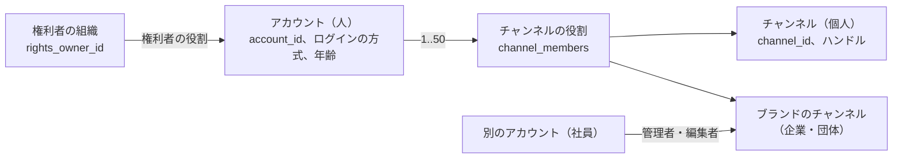
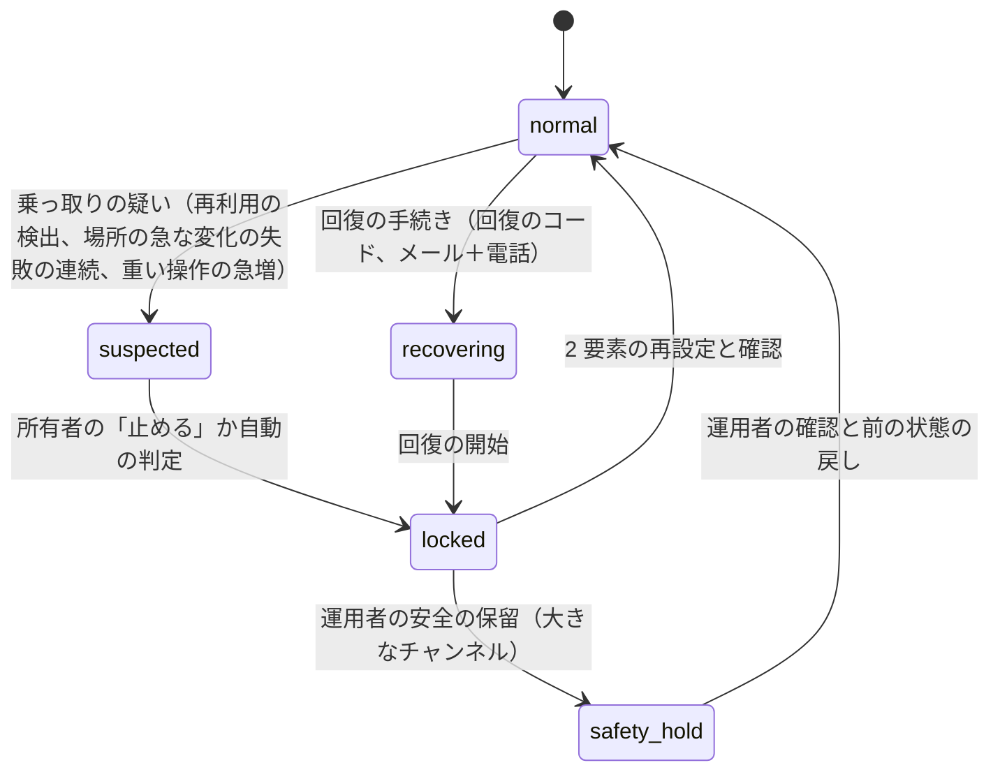
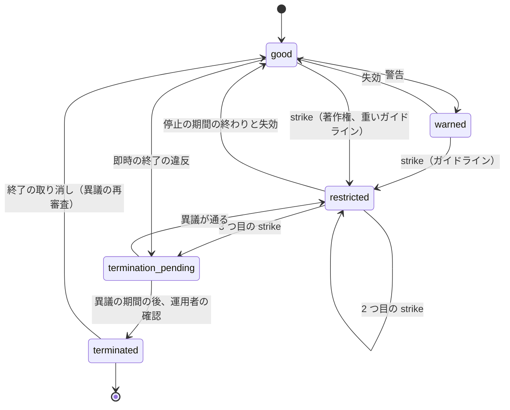

# Accounts and safety: YouTube

アカウントとチャンネル（1 つのアカウントに複数のチャンネル、ブランドのチャンネルと管理の役割）、認証と 2 要素、創作者のセッションの守り（セッションの盗み出し、ストリームキー）、年齢と見守りの体験（**法務の確認待ち：L3**）、創作者の確認の段、権利者の審査、違反の警告と strike とアカウントの状態、既知の違法なメディアに一致したときのアカウントの扱いを決める。

前提となる決定は次のとおり。

- テナントは 1 つ。チャンネルの管理の表は `channel_id` の FORCE RLS、本人だけの表は `owner_id` の FORCE RLS（[ADR-0009](../decisions/0009-single-tenant-and-playable.md)）
- 見える範囲は `playable()`（同じ ADR）。年齢・子ども向け・チャンネルの停止は `playable()` の入力
- ストリームキーの形と保存（[ADR-0028](../decisions/0028-live-ingest-keys-backup-and-source-recording.md)）、配信の停止（[ADR-0027](../decisions/0027-takedown-deny-list-within-60s.md)）
- 監査、保持、運用者のアクセス（[security.md](security.md)、[ADR-0063](../decisions/0063-operator-access-audit-retention-and-legal-hold.md)）

この文書で決めたことは次の ADR にある。

| ADR | 決定 |
| --- | --- |
| [0059](../decisions/0059-accounts-channels-and-roles.md) | アカウント（人）とチャンネル（公開の主体）を分け、1 つのアカウントは 50 までのチャンネルを持てる。チャンネルの権限は 7 つの役割（所有者、管理者、編集者、編集者（限定）、字幕の編集者、閲覧者、閲覧者（限定））の決定表 `can(actor, channel, action)` で決め、所有者は 1 人で移せない |
| [0060](../decisions/0060-authentication-2fa-and-creator-sessions.md) | 認証はパスキーを主にし、TOTP を代わりにする。SMS は回復だけ。登録者 1 万以上か収益化か配信の権限のあるチャンネルの所有者・管理者は 2 要素を必須にする。アクセスのトークン 15 分、更新のトークンは回転と再利用の検出。重い操作は直近 10 分の 2 要素の再確認と、新しい端末から 24 時間の待ちを要る。回復と乗っ取りの疑いでセッションとストリームキーをすべて失効する |
| [0061](../decisions/0061-creator-tiers-strikes-and-account-standing.md) | 創作者の機能を 3 つの段（標準・中間・上級）に分け、中間は電話の確認、上級はチャンネルの履歴か身元の確認で開く。違反は最初は警告、その後は strike（90 日で失効、1 回目 7 日・2 回目 14 日の停止、90 日に 3 つで終了）にし、ガイドラインと著作権で別に数える。アカウントの状態は `account_standing` の状態の機械にし、効き目は `can()` と `playable()` に渡す |

## 1. 範囲

- 扱う：
  - アカウント、ログインの方式、2 要素、セッション、回復
  - チャンネル、ハンドル（一意の名前の規則は channels-subscriptions-and-notifications の領域）、役割と権限
  - 年齢の帯、年齢の確かめの状態、見守りのアカウント（枠だけ）
  - 創作者の確認の段（電話、チャンネルの履歴、身元）
  - 権利者の組織の審査
  - 違反の警告、strike、アカウントの状態、異議（アカウントの措置への）
  - 乗っ取りの検出と回復、ストリームキーの守り（アカウントの側）
- 扱わない：
  - 動画・コメント・チャットの措置の判断（[comments-and-moderation.md](comments-and-moderation.md) の領域、[live-chat.md](live-chat.md)）
  - 著作権の削除の申出と反論の手続き（[copyright-claims-and-disputes.md](copyright-claims-and-disputes.md) の領域）
  - 登録と通知（[channels-subscriptions-and-notifications.md](channels-subscriptions-and-notifications.md) の領域）
  - 収益化の条件と支払いの本人の確認（[monetization-and-payouts.md](monetization-and-payouts.md) の領域）
  - 鍵と監査の基盤（[security.md](security.md)）

## 2. 要件

| 要件 | 目標 | NFR・根拠 |
| --- | --- | --- |
| ログイン | ログインの API p99 500 ms（パスキーの確かめを含む）。管理の画面の月間 99.9% | NFR-010 |
| 役割の漏れ | 役割のない利用者が、チャンネルの未公開の動画・収益・分析・ストリームキーを読めない（0 件） | [quality.md](../quality.md) の 2.2.1 節 G、[ADR-0009](../decisions/0009-single-tenant-and-playable.md) |
| 乗っ取りの止め | 所有者が「止める」を押してから、全セッションの失効・ストリームキーの失効・配信の切断まで 10 秒以内 | 本システムの値 |
| 措置の効き | アカウントの終了の決定から、チャンネルの全動画の新しい配信の停止まで 60 秒以内 | NFR-014 |
| strike の正しさ | 90 日の窓・失効・停止の期間を決定表のとおりに当てる | 9 節 |
| 年齢 | 年齢の制限の動画を、年齢の条件を満たさない閲覧者に出さない（0 件） | [quality.md](../quality.md) の 2.2.1 節 G |

## 3. 本家の形（確かめたこと）

いずれも 2026-10-10 に確認。

| 項目 | 本家 | 出典 |
| --- | --- | --- |
| チャンネルの役割 | 所有者、管理者、編集者、編集者（限定）、字幕の編集者、閲覧者、閲覧者（限定）。所有者は所有を他の利用者に移せない。編集者はストリームキーを消せず再設定できない。閲覧者はストリームキーを見られない | [Manage channel permissions](https://support.google.com/youtube/answer/9481328) |
| 機能の段 | 標準（チャンネルを作る、ガイドラインの strike がない）、中間（電話の確認：15 分を超える動画、PC からのライブ、独自のサムネイル）、上級（十分なチャンネルの履歴か、身元・動画での確認：Content ID の異議、ライブの埋め込み、収益化の申し込み、説明のリンク、チャプター、チャンネルの追加など） | [Access features on YouTube](https://support.google.com/youtube/answer/9890437) |
| ガイドラインの strike | 最初の違反は通常は警告（任意の研修の後 90 日で失効）。1 回目の strike は 1 週間の投稿の停止、同じ 90 日の中の 2 回目は 2 週間、3 回目はチャンネルの削除がありうる。各 strike は 90 日で失効。重い違反は警告なしで終了がある | [Community Guidelines strike basics](https://support.google.com/youtube/answer/2802032) |
| 著作権の strike | 90 日に 3 つで終了の対象。Copyright School を終えれば 90 日で失効。申立人の取り下げか反論の通知で解ける。予約の削除の申出は 7 日の中で動画を消せば strike にならない | [Copyright strike basics](https://support.google.com/youtube/answer/2814000) |
| 見守りのアカウント | 13 歳未満（国による）の子どもに、保護者が内容の設定を選ぶ。設定の段の名前と止まる機能はこのページになかった（**未検証**） | [Supervised experiences](https://support.google.com/youtube/answer/10314074) |
| 1 つのアカウントのチャンネルの数の上限、電話番号 1 つで確認できるチャンネルの数、異議の期限 | 公式の資料で確かめられなかった（**未検証**） | — |

- 本システムは本家の役割と段と strike の形に寄せる。本家に明記のない値（4.2 節の支払いの口座、4.3 節の所有者の不在、9.2 節の著作権の strike の停止の範囲）は、各節に「本システムの値」と書いた。

## 4. アカウントとチャンネル（ADR-0059）

### 4.1 形

- **アカウント**は人（ログインする主体）。本人だけの表（視聴の履歴、登録、設定、通知）はアカウントに付く。
- **チャンネル**は公開の主体（動画、コメントの名前、ライブ、収益）。チャンネルには所有者がちょうど 1 人いる。アカウントは自分が所有者のチャンネルを 50 まで持てる（本システムの値。本家は**未検証**）。役割を持つチャンネルの数（他人のチャンネル）に上限は置かない。
- **ブランドのチャンネル**は、別のアカウントの社員に役割を配って運用する。チャンネルにパスワードはない（共有のアカウントを作らせない）。
- コメントとライブチャットは、アカウントではなく、選んだチャンネルの名で書く（本家の形。名前の出方は [comments-and-moderation.md](comments-and-moderation.md) の領域）。
- **権利者**は別の主体（`rights_owners`）で、アカウントに権利者の役割（`ro_admin`・`ro_analyst`）を配る（[ADR-0009](../decisions/0009-single-tenant-and-playable.md) の権利者の RLS）。

### 4.2 役割と権限

`can(actor, channel, action)` は `packages/visibility` の隣の `packages/authz` の 1 か所に置き、Studio・管理の API・`live-ingest`（キーの発行）・`license-proxy`（所有者のプレビュー）はすべてこれを通す。RLS（`app.channel_ids`）は「役割を持つチャンネル」の境界で、役割ごとの細かい可否は `can()` が決める。

| 操作 | 所有者 | 管理者 | 編集者 | 編集者（限定） | 字幕の編集者 | 閲覧者 | 閲覧者（限定） |
| --- | --- | --- | --- | --- | --- | --- | --- |
| チャンネルの削除 | ○（再確認） | — | — | — | — | — | — |
| 役割の付与・外し | ○（再確認） | ○（再確認、所有者を除く） | — | — | — | — | — |
| チャンネルの名前・ハンドル | ○（再確認） | ○（再確認） | — | — | — | — | — |
| 動画のアップロード・公開 | ○ | ○ | ○ | ○ | — | — | — |
| 公開した動画の削除 | ○（再確認） | ○（再確認） | — | — | — | — | — |
| 下書きの削除 | ○ | ○ | ○ | ○ | — | — | — |
| ライブの管理（開始・終了・設定） | ○ | ○ | ○ | ○ | — | — | — |
| ストリームキーの表示 | ○（再確認） | ○（再確認） | ○（再確認） | ○（再確認） | — | — | — |
| ストリームキーの再発行・失効 | ○（再確認） | ○（再確認） | — | — | — | — | — |
| 字幕の追加・編集 | ○ | ○ | ○ | ○ | ○ | — | — |
| 分析 | ○ | ○ | ○ | ○ | — | ○ | ○ |
| 収益の数 | ○ | ○ | ○ | — | — | ○ | — |
| 支払いの口座・契約 | ○（再確認） | — | — | — | — | — | — |
| コメント・チャットのモデレーション | ○ | ○ | ○ | ○ | — | — | — |
| 照合の一致の異議 | ○ | ○ | ○ | ○ | — | — | — |

- 「再確認」は 5.3 節の直近 10 分の 2 要素。
- 支払いの口座と契約を所有者だけにするのは、収益の送り先の書き換えが乗っ取りの主な目的になるため（本家は管理者も広告の連携ができる。支払いの口座の扱いは本家で**未検証**）。

### 4.3 所有者の不在の扱い

- 所有者は移せない（本家に寄せる）。所有者のアカウントが削除・終了したチャンネルは、管理者がいれば「所有者なし」の状態で 90 日続け、その間に運用者のサポートの手続き（本人の確認と組織の確認）で管理者の 1 人を所有者にできる（本システムの値。本家は**未検証**）。90 日の後はチャンネルの削除の経路へ。
- この扱いは本家と違う可能性がある。統合の工程で [README.md](README.md) の 1.4 節に行を足した。

## 5. 認証とセッション（ADR-0060）

### 5.1 方式

| 方式 | 使い道 | 備考 |
| --- | --- | --- |
| パスキー（WebAuthn） | 主のログインと 2 要素の再確認 | [Web Authentication Level 3](https://www.w3.org/TR/webauthn-3/)（2026-08-25 の W3C 勧告）。同期するパスキーと端末に縛るものの両方を受ける |
| メールとパスワード | ログイン（2 要素と組む） | パスワードは Argon2id、漏えいした一覧との照合 |
| 外部の IdP（OIDC） | ログイン | 主な OS とメールの事業者。2 要素は IdP の側に任せず、本システムの 2 要素の必須の条件は同じに当てる |
| TOTP | 2 要素 | 秘密は `kms-secrets` で包む（[security.md](security.md) の 4.2 節） |
| SMS・音声の番号 | 回復と電話の確認（7 節）だけ | SIM の乗り換えの攻撃のため 2 要素に使わない |
| 回復のコード | 回復 | 10 個、1 回だけ |

### 5.2 2 要素の必須の条件

次のどれかに当たるチャンネルの所有者と管理者は、2 要素（パスキーか TOTP）がないと Studio の重い操作ができない。当たってから 14 日の猶予の後に必須にする。

| 条件 | 理由 |
| --- | --- |
| 登録者 1 万以上 | 乗っ取りの価値が高い |
| 収益化している | 支払いの口座がある |
| ライブの権限（中間の段）を使ったことがある | ストリームキーの乗っ取り |
| 権利者の役割を持つ | 偽りの申し立ての悪用（[security.md](security.md) の 3.6 節） |

### 5.3 セッション

| 項目 | 値 |
| --- | --- |
| アクセスのトークン | 15 分。不透明な値（サーバーで引く）。`api` は Valkey の写しで引く |
| 更新のトークン | 30 日（使わなければ 14 日で切れる）。使うたびに回す。回した後の古いトークンの再利用を検出したら、その系列のすべてを失効し、利用者に知らせる |
| 端末に結び付け | アプリは OS の鍵の保管で作った鍵の署名を更新の要求に付ける。Web は cookie（`Secure`・`HttpOnly`・`SameSite=Lax`、`__Host-` の接頭辞） |
| 場所の急な変化 | 更新の要求の ASN・国が、その系列の直近と違い、かつ 2 時間で物理的に動けない距離なら、2 要素の再確認を要る |
| 再確認（step-up） | 重い操作（4.2 節の「再確認」）は直近 10 分の 2 要素 |
| 新しい端末の待ち | 新しい端末（その系列で初めての端末の鍵か cookie）から、支払いの口座、役割の付与、ストリームキーの表示、メールの変更は 24 時間できない。所有者に通知する |
| セッションの一覧 | 利用者は端末ごとのセッションを見て、個別に失効できる |

- セッションの盗み出し（マルウェアによる cookie の持ち出し）は、15 分のアクセスのトークンと更新の回転だけでは防げない。端末に結び付けた更新（アプリ）と、場所の急な変化の再確認と、重い操作の再確認と待ちの 3 つで被害を絞る。Web で cookie を端末の鍵に結び付ける仕組み（ブラウザーの提供するもの）の採用は、ブラウザーの対応を確かめてから決める（**未検証**）。

### 5.4 回復と乗っ取り

- **locked に入るとき**、同時に次を行う：全セッションと更新のトークンの失効、所有するチャンネルと管理者のチャンネルのすべてのストリームキーの失効（配信の切断を含む）、支払いの口座の変更の 7 日の凍結、パスワードの再設定の要求。
- **安全の保留**（登録者 1 万以上）：公開・名前の変更・削除・配信・役割の変更を止める。運用者は監査の記録から前の状態（名前、ハンドル、説明のリンク、公開の範囲、役割）を戻し、削除された動画を 30 日の猶予の中で戻す（[ADR-0013](../decisions/0013-original-retention-and-deletion-paths.md)）。手順は `channel-takeover.md`（[security.md](security.md) の 14 節）。
- 回復の手続きで、電話番号を変えた直後の回復は 72 時間の待ちを置く（SIM の乗り換えの攻撃）。

### 5.5 ストリームキーの守り（アカウントの側）

[live-streaming.md](live-streaming.md) の 4.2 節と [security.md](security.md) の 3.1 節に加え、アカウントの側で次を持つ。

- キーの表示は再確認の後。表示した操作は監査に残し、所有者と管理者に通知する。
- 予約の配信ごとのキーを既定に勧める。チャンネルの既定のキー（使い回す）は、90 日使われなければ Studio で失効を勧める。
- 配信の開始の場所（ASN・国）が直近 30 日と違えば通知（[security.md](security.md) の 3.1 節）。
- 中間の段（電話の確認）のないチャンネルは、キーを作れない。

## 6. 年齢と見守り（**法務の確認待ち：L3**）

### 6.1 年齢の帯と確かめの状態

| 項目 | 値 |
| --- | --- |
| `age_band` | `unknown`（匿名・未入力）、`u13`、`13_17`、`18_plus` |
| `age_assurance` | `none`、`self_declared`（生年月日の入力）、`estimated`（外部の推定）、`verified`（外部の確認：身元の書類、クレジットカードなど） |
| 13 歳未満の扱い | 見守りのアカウント（6.2 節）だけ。見守りでない 13 歳未満のアカウントは作れない |

- `playable()` は `viewer.age_band` と `viewer.age_assurance` を入力に持つ（[ADR-0009](../decisions/0009-single-tenant-and-playable.md)）。年齢の制限の動画の既定の条件は「ログインし、`18_plus` で、`age_assurance` が `self_declared` 以上」にし、`verified` を要るかは L3 の結論で決める。どちらの結論でも、`playable()` の決定表の 1 行の条件を変えるだけにする。
- 年齢の確かめの事業者（身元の書類、推定）は口 `AgeAssuranceProvider` の後ろに置く。本システムは結果（帯、方法、時刻）だけを持ち、書類の画像を持たない（[security.md](security.md) の 6.1 節）。

### 6.2 見守りのアカウント

| 項目 | 13 歳未満（見守り） | 13〜17 歳 |
| --- | --- | --- |
| 作り方 | 保護者のアカウントが作り、`supervision_links` で結ぶ | 本人が作れる。保護者の結び付けは任意 |
| 内容の設定 | 保護者が 3 つの段（本システムの名前：`level_1`・`level_2`・`level_3`）から選ぶ。段ごとの対象の動画の決め方は L3 の後（本家の段の名前は**未検証**） | — |
| アップロード・ライブ・コメント・チャットの送信 | できない | アップロードの既定の公開の範囲は L3 の後（本システムの既定の案：限定公開） |
| おすすめ | 個人化しない並び（[ADR-0010](../decisions/0010-recommendation-boundary.md)） | 個人化するが、繰り返しの注意の仕組みは [recommendations.md](recommendations.md) の領域 |
| 個人に合わせた広告 | なし（`playable()` の `allow_with: no_personalized_ads`） | L3・L5 の後 |
| 視聴の履歴 | 保護者が見られ、消せる | 本人だけ |

- 子ども向けの動画の印（創作者の申告）は [comments-and-moderation.md](comments-and-moderation.md) の領域。見守りのアカウントとは別の軸で、両方が `playable()` と `recommendations` に効く。
- 子ども向けの別のアプリは MVP の後（[intent.md](../intent.md)）。

## 7. 創作者の確認の段（ADR-0061）

| 段 | 開く条件 | 開く機能 |
| --- | --- | --- |
| 標準 | チャンネルを作る。有効なガイドラインの strike がない | 15 分までのアップロード、再生リスト |
| 中間 | 電話の確認（SMS か音声のコード） | 15 分を超えるアップロード（12 時間まで。[upload-and-ingest.md](upload-and-ingest.md) の 5.2 節）、ライブ、ストリームキー、独自のサムネイル |
| 上級 | (a) チャンネルの履歴：中間を開いて 60 日、有効な strike がなく、直近 90 日の確定の視聴が 1 以上、または (b) 身元の確認（外部の事業者、書類と顔の照合） | 照合の一致の異議の再審査への上げ、ライブの埋め込み、収益化の申し込み、説明のリンク、チャンネルの追加（2 つ目から）、チャプター |

- **電話の確認**：番号は HMAC（照合用）と暗号文（`kms-pii`）で持つ。1 つの番号で確認できるチャンネルは 1 年に 2 つまで（本システムの値。本家は**未検証**）。使い捨ての番号の一覧の照合は口の後ろ。
- **段の取り消し**：ガイドラインの strike が有効な間は、中間と上級の機能を止める（ライブとストリームキーを含む）。著作権の strike は、本家と同じく停止の対象をライブと公開に絞る（9.2 節）。
- 段は `creator_tiers` に持ち、`can()` が読む。

## 8. 権利者の審査

照合と方針の扱いは [copyright-matching.md](copyright-matching.md)・[copyright-claims-and-disputes.md](copyright-claims-and-disputes.md) の領域。この節は、組織を権利者として迎えるまでと、アカウントの状態の扱いを決める。

| 段 | 中身 |
| --- | --- |
| 申し込み | 組織の名前、法人の番号などの組織の確認の情報、扱う権利の種類（音楽の原盤・著作、映像、放送、ゲーム）、権利の根拠の資料、参照の量の見込み |
| 審査（運営の担当） | 組織の実在、権利の独占の根拠、過去の偽りの申し立ての有無。エージェントは承認しない（[roadmap.md](../roadmap.md)） |
| 見習い（90 日） | 参照の登録は 1,000 時間まで。ブロックの方針は人の確認の後にだけ効く。収益化・追跡はすぐ効く |
| 本承認 | 見習いの間の異議で取り消された一致の割合が 2% 以下 |
| 停止 | 誤りの多い権利者の方針の一時の停止（運営の担当と法務の判断。[runbooks](../runbooks/README.md) の 4 節の `claims-anomaly.md`） |

- 権利者の管理者は 2 要素を必須にする（5.2 節）。
- 審査の基準と、偽りの申し立てへの措置の公表は**法務の確認待ち：L1・L2**。

## 9. アカウントの状態と strike（ADR-0061）

### 9.1 種類と数え方

| 種類 | 出す側 | 数え方 |
| --- | --- | --- |
| ガイドラインの警告 | 動画・コメント・チャット・チャンネルの措置（[comments-and-moderation.md](comments-and-moderation.md)） | チャンネルに最初の 1 回。研修の完了から 90 日で失効。失効の前に同じ方針で再び違反すれば strike |
| ガイドラインの strike | 同上 | 発行から 90 日で失効。有効な数で停止の段を決める |
| 著作権の strike | 削除の申出に基づく削除（[copyright-claims-and-disputes.md](copyright-claims-and-disputes.md)）。照合の一致（ブロック・収益化・追跡）は strike にしない | 発行から 90 日。研修（本システムの著作権の研修）を終えていれば失効。取り下げ・反論の通知で解ける（手続きは**法務の確認待ち：L1・L2**） |
| 即時の終了 | 重い違反（児童の性的な搾取、暴力の扇動などの規則の一覧は [comments-and-moderation.md](comments-and-moderation.md)） | 警告と strike を経ない |

- 入力は outbox の出来事で受ける：`guideline_violation`（[comments-and-moderation.md](comments-and-moderation.md)）、`copyright_strike_requested`・`copyright_strike_retracted`（[copyright-claims-and-disputes.md](copyright-claims-and-disputes.md) の 8.3 節）。この領域が `strikes` と `account_standing` に書き、出来事の ID で重複を捨てる。

### 9.2 効き目の決定表

| 有効な strike（同じ種類の 90 日の中） | ガイドライン | 著作権 |
| --- | --- | --- |
| 警告だけ | 制限なし | — |
| 1 | 7 日：アップロード、ライブ、予約の公開、プレミア公開、独自のサムネイル、投稿、再生リストの編集を止める。予約の公開の動画は非公開に戻す | 収益化の申し込みを止める。ライブは止めない（本家の明記がないため本システムの値） |
| 2 | 14 日：同上 | 同上 |
| 3 | チャンネルの終了の候補（運用者の確認の後に終了。異議の期間を置く） | 同上 |

- 停止の期間は発行の時刻から数える。期間の後は自動で戻す。
- 本家の値（[Community Guidelines strike basics](https://support.google.com/youtube/answer/2802032)、[Copyright strike basics](https://support.google.com/youtube/answer/2814000)、2026-10-10 に確認）に寄せた。終了の前の異議の期間（本システムの案：30 日）と通知の文言は**法務の確認待ち：L1**。

### 9.3 アカウントの状態

- `account_standing` はチャンネルごとに持つ（ガイドラインと著作権の両方の有効な数、停止の期限）。
- **終了したチャンネル**：`playable()` が全動画に `deny`（`channel_terminated`）を返し、`delivery-blocker` がチャンネルの全動画の配信の停止を出す（[ADR-0027](../decisions/0027-takedown-deny-list-within-60s.md)。1 日の措置の数の上限に注意。チャンネルの動画が 5,000 本を超えるときは、拒否の鍵を動画ごとに置かず、`playable()` の写しと `origin-cache` の拒否で止め、拒否の鍵はチャンネルの直近 30 日に再生のあった動画だけに置く）。
- **関連するチャンネル**：終了したチャンネルの所有者のアカウントは、新しいチャンネルを作れない。同じ電話番号・支払いの口座で確認した他のチャンネルの扱い（本家は著作権で関連するチャンネルにも効く）は**法務の確認待ち：L1**。
- **異議**：アカウントの措置への異議は、終了と strike の各 1 回。審査は運営の担当（エージェントは草案まで）。

## 10. 既知の違法なメディアに一致したとき（**法務の確認待ち：L3・L10**）

[upload-and-ingest.md](upload-and-ingest.md) の 5.3 節で、動画が `quarantined` になった後のアカウントの扱い。

1. アップロードしたチャンネルを `termination_pending` にし、所有者のアカウントを `locked` にする（創作者には一般の失敗だけを見せる）。
2. 隔離のファイル、チャンネルの動画、アカウントの記録（ログインの記録、投稿の記録）に法的な保全を付ける（[security.md](security.md) の 6.4 節）。
3. 安全の審査の役割（2 人）が確認する（[security.md](security.md) の 8 節）。
4. 報告の先、報告の期限、保全の期間、利用者へ知らせるかは L3・L10 の結論で決める。結論までは「保全して止める」までを自動で行い、報告は法務の判断で行う。

## 11. 失敗と回復

| 失敗 | 起きること | 回復 |
| --- | --- | --- |
| セッションの写し（Valkey）の消失 | アクセスのトークンが引けない | Aurora の `sessions` から引き直す（遅くなる）。Valkey は失ってよい |
| SMS の事業者の停止 | 電話の確認と回復ができない | 音声の事業者へ切り替える。電話の確認の待ちを Studio に出す |
| 身元の確認の事業者の停止 | 上級の段の身元の道が止まる | チャンネルの履歴の道は使える |
| `can()` の写しの遅れ | 役割の外しが遅れて効く | 役割の外しは `channel_members` の行の削除と同じトランザクションで、全セッションのチャンネルの一覧の写しを無効にする（60 秒以内） |
| アカウントの終了の配信の停止の量 | 拒否の鍵の置き場が溢れる | 9.3 節の動画の数の上限の扱い |
| 誤った自動の判定（乗っ取りの疑い） | 所有者がログインできない | 2 要素の再設定で `normal` へ。誤りの率を見て判定の値を直す |

## 12. 上限

| 対象 | 値 |
| --- | --- |
| 1 アカウントの所有のチャンネル | 50 |
| 1 チャンネルの役割を持つアカウント | 100 |
| 1 つの電話番号の確認 | 1 年に 2 チャンネル |
| パスキー | 1 アカウント 20 |
| ログインの失敗 | アカウントあたり 15 分に 10 回で、再確認の段を上げる。IP あたり 1 分 20 回 |
| 回復のコード | 10 個 |
| アクセスのトークン | 15 分 |
| 更新のトークン | 30 日（未使用 14 日） |
| 再確認の有効 | 10 分 |
| 新しい端末の待ち | 24 時間 |
| strike の失効 | 90 日 |
| 所有者なしの期間 | 90 日 |

## 13. data-model への項目

列・キー・索引の正本は [data-model.md](data-model.md) と [data-model/](data-model/) の各ファイルである。この節は提案の記録として残す（2026-10-10 のデータモデルの工程）。

| 表・置き場 | 中身 | 主キー・索引 | 節 |
| --- | --- | --- | --- |
| `accounts`（本人だけの表） | `account_id`（UUIDv7）、`email_hmac`、`email_enc`、`password_hash`、`age_band`、`age_assurance`、`state`（`normal`・`suspected`・`locked`・`recovering`・`deleted`）、`mfa_required`、`created_at` | `(account_id)`、一意 `(email_hmac)` | 5、6 |
| `passkeys` | `account_id`、`credential_id`、`public_key`、`sign_count`、`transports`、`created_at`、`last_used_at` | `(credential_id)` | 5.1 |
| `totp_secrets` | `account_id`、`secret_wrapped`、`created_at` | `(account_id)` | 5.1 |
| `sessions` | `session_id`、`account_id`、`family_id`、`device_key_thumbprint`、`asn`、`country`、`created_at`、`last_seen_at`、`revoked_at`、`step_up_at` | `(session_id)`、`(account_id) WHERE revoked_at IS NULL` | 5.3 |
| `refresh_tokens` | `token_hash`、`family_id`、`rotated_at`、`used_at` | `(token_hash)`、`(family_id)` | 5.3 |
| `channels`（公開の情報は RLS の外） | `channel_id`、`owner_account_id`、`kind`（`personal`・`brand`）、`state`、`created_at` | `(channel_id)`、`(owner_account_id)` | 4 |
| `channel_members`（チャンネルの表） | `channel_id`、`account_id`、`role`、`granted_by`、`granted_at` | `(channel_id, account_id)` | 4.2 |
| `creator_tiers`（チャンネルの表） | `channel_id`、`tier`、`phone_verified_at`、`history_eligible_at`、`id_verified_at` | `(channel_id)` | 7 |
| `phone_verifications` | `phone_hmac`、`phone_enc`、`channel_id`、`verified_at` | `(phone_hmac, verified_at)` | 7 |
| `id_verifications` | `account_id`、`provider`、`result`、`method`、`verified_at`（書類は持たない） | `(account_id)` | 6、7 |
| `supervision_links` | `parent_account_id`、`child_account_id`、`level`、`created_at` | `(child_account_id)` | 6.2 |
| `strikes`（チャンネルの表） | `strike_id`、`channel_id`、`kind`（`guidelines_warning`・`guidelines`・`copyright`）、`policy`、`source_action_id`、`issued_at`、`expires_at`、`resolved`（`expired`・`retracted`・`appeal_won`・`counter_notice`） | `(channel_id, kind, issued_at)` | 9 |
| `account_standing`（チャンネルの表） | `channel_id`、`state`、`active_guidelines`、`active_copyright`、`restricted_until`、`termination_due_at` | `(channel_id)` | 9.3 |
| `standing_appeals` | `appeal_id`、`channel_id`、`target`（`strike_id` か終了）、`state`、`decided_by`、`decided_at` | `(appeal_id)` | 9.3 |
| `rights_owner_applications` | `application_id`、`org_name`、`org_verification`、`rights_kinds[]`、`state`（`submitted`・`probation`・`approved`・`suspended`・`rejected`）、`reviewed_by`、`probation_until` | `(application_id)` | 8 |
| `rights_owners`・`rights_owner_members` | 権利者の組織（`public_name`、`state`、見習いの上限）と、アカウントに配る権利者の役割（`ro_admin`・`ro_analyst`）。`app.rights_owner_ids` の元 | `(rights_owner_id)`・`(rights_owner_id, account_id)` | 4.1、8 |
| `external_identities` | 外部の IdP（OIDC）の結び付け：`issuer`、`subject`、`account_id` | `(issuer, subject)` | 5.1 |
| `security_events`（本人だけの表） | `account_id`、`kind`（新しい端末、再確認、キーの表示、乗っ取りの疑い）、`at`、`asn` | `(account_id, at)` | 5 |
| `safety_holds` | `channel_id`、`reason`、`opened_by`、`opened_at`、`closed_at` | `(channel_id) WHERE closed_at IS NULL` | 5.4 |
| Valkey | `sess:{session_id}`（15 分）、`chm:{account_id}`（役割を持つチャンネルの一覧、60 秒） | — | 5.3、4.2 |
| outbox | 出す：`channel_terminated`、`account_locked`、`role_changed`、`stream_keys_revoked`。受ける：`guideline_violation`、`copyright_strike_requested`、`copyright_strike_retracted` | — | 5.4、9.1、9.3 |

- 電話番号・メールは照合用の HMAC と暗号文に分け、平文を持たない。ログに出さない（AGENTS.md）。

## 14. テストと性質

| ID | 性質・試験 |
| --- | --- |
| PROP-ACC-001 | 任意の役割の付与と外しの列と操作で、`can()` が許すのは 4.2 節の表の ○ だけで、「再確認」の操作は直近 10 分の 2 要素がなければ拒む |
| PROP-ACC-002 | 任意の更新のトークンの使用の列で、回した後の古いトークンが 1 回でも使われたら、その系列のすべてのトークンが失効する |
| PROP-ACC-003 | 任意の strike の発行・失効・取り下げの列で、`account_standing` の有効な数と停止の期限は 9.2 節の決定表と、90 日の窓の再計算に一致する |
| PROP-ACC-004 | `locked` に入ったとき、そのアカウントが所有者か管理者のチャンネルのストリームキーはすべて失効している |
| PROP-ACC-005 | 任意の年齢の帯と確かめの状態で、年齢の制限の動画を許すのは 6.1 節の条件を満たすときだけ（`playable()` の決定表の行と一致） |
| DT-ACC-001 | 役割 × 操作の決定表（4.2 節）の全行 |
| DT-ACC-002 | strike の効き目の決定表（9.2 節）、警告と失効の境（89・90・91 日） |
| DT-ACC-003 | 機能の段（7 節）× 機能 × strike の有無 |
| 漏れの経路 | 別のチャンネルの役割のない利用者・閲覧者（限定）で、収益・ストリームキー・未公開の動画が出ない（[quality.md](../quality.md) の 2.2.1 節 G） |
| E2E | 乗っ取りの模型：盗んだ cookie で別の ASN から重い操作 → 再確認で止まる。所有者の「止める」から 10 秒でキーが失効し配信が切れる |

## 15. Story の候補

| Epic | Story | 中身 |
| --- | --- | --- |
| E6 | `accounts-and-auth` | 5 節（ADR-0060、PROP-ACC-002）。記録の保持は法務：L10 |
| E6 | `channels-and-roles` | 4 節（ADR-0059、PROP-ACC-001、DT-ACC-001） |
| E6 | `creator-verification` | 7 節（ADR-0061、DT-ACC-003） |
| E6 | `account-recovery-and-takeover` | 5.4 節（PROP-ACC-004） |
| E8 | `rights-owner-onboarding` | 8 節。法務：L1・L2 |
| E9 | `strikes-and-standing` | 9 節（ADR-0061、PROP-ACC-003、DT-ACC-002）。法務：L1 |
| E9 | `age-and-supervision` | 6 節（PROP-ACC-005）。法務：L3 |
| E9 | `quarantine-account-handling` | 10 節。法務：L3・L10 |

## 16. 未解決の問い

### 決定（2026-10-10、既定案）

- **アカウントとチャンネル**：分ける。所有のチャンネル 50 まで。所有者は 1 人で移せない（ADR-0059）。
- **役割**：本家の 7 つ。支払いの口座は所有者だけ（ADR-0059）。
- **認証**：パスキーを主、TOTP を代わり、SMS は回復だけ（ADR-0060）。
- **2 要素の必須**：登録者 1 万以上・収益化・ライブ・権利者（ADR-0060）。
- **段と strike**：本家の 3 つの段と strike の形（ADR-0061）。

### 持ち越し

| 問い | いつ・どう決めるか |
| --- | --- |
| 年齢の確かめの方法と、年齢の制限の動画の条件（`self_declared` か `verified` か） | **法務の確認待ち：L3** |
| 見守りのアカウントの内容の段の決め方、13〜17 歳の既定 | **法務の確認待ち：L3** |
| 終了の前の異議の期間、strike の通知の文言、関連するチャンネルへの効き | **法務の確認待ち：L1** |
| 繰り返しの侵害の扱い（著作権の strike の形を日本で持つか） | **法務の確認待ち：L1・L2**（[copyright-claims-and-disputes.md](copyright-claims-and-disputes.md) と合わせる） |
| 既知の違法なメディアの報告の先と期限 | **法務の確認待ち：L3・L10** |
| ログインの記録の保持の期間 | **法務の確認待ち：L10**（[security.md](security.md) の 6.1 節） |
| Web の cookie を端末の鍵に結び付けるブラウザーの仕組みの採否 | ブラウザーの対応を確かめる（**未検証**） |
| 1 アカウントのチャンネルの数、1 つの電話番号のチャンネルの数の本家の値 | **未検証**。本システムの値を使う |

## 出典

いずれも 2026-10-10 に確認。

- YouTube Help, [Manage channel permissions](https://support.google.com/youtube/answer/9481328)
- YouTube Help, [Access features on YouTube](https://support.google.com/youtube/answer/9890437)
- YouTube Help, [Community Guidelines strike basics](https://support.google.com/youtube/answer/2802032)
- YouTube Help, [Copyright strike basics](https://support.google.com/youtube/answer/2814000)
- YouTube Help, [Supervised experiences on YouTube](https://support.google.com/youtube/answer/10314074)
- W3C, [Web Authentication: An API for accessing Public Key Credentials, Level 3](https://www.w3.org/TR/webauthn-3/)
