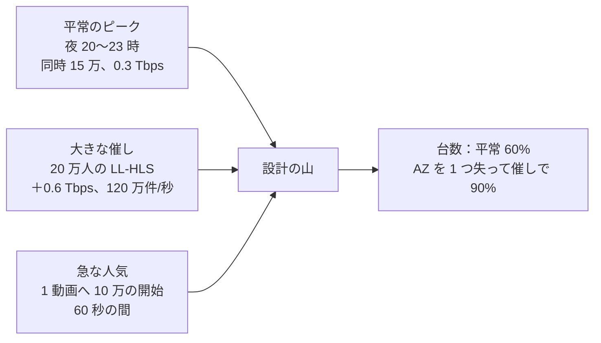

# Capacity: YouTube

負荷のモデル（アップロード、変換の時間、同時の視聴、ライブの山、急な人気、出来事、チャット、照合）、部品ごとの必要量（S1・S2・S3）、月の費用、容量の余裕の方針、負荷試験の場面を決める。群れの型と置き方は [infrastructure.md](infrastructure.md) の 4 節、単位あたりの原価は同じく 11 節にある。

この文書で決めたことは次の ADR にある。

| ADR | 決定 |
| --- | --- |
| [0069](../decisions/0069-load-model-headroom-and-load-tests.md) | 負荷のモデルは「平常のピーク」と「大きな催し」と「急な人気」の 3 つの重ねで作り、部品は平常のピークを 60% の使用で受け、AZ を 1 つ失っても催しのピークを受ける台数にする。負荷試験は S1 の平常のピークの 2 倍と催しの模型で行い、CDN を通す試験は 10% の規模、`live-origin`・`origin-cache` は直接の模型で全規模にする |

数値は [README.md](README.md) の 2 節の S1 の想定から作った「初期見積もり」で、PoC と E15 の負荷試験で置き換える。

## 1. 要件

| 要件 | 目標 | NFR |
| --- | --- | --- |
| 余裕 | 平常のピークで各部品の使用 60% 以下。AZ を 1 つ失っても、催しのピークで 90% 以下 | NFR-009、NFR-010 |
| 急な人気 | 公開の直後に 1 つの動画へ 10 万の同時の開始で、開始の時間 p95 2.5 秒、S3 の GET は 1 セグメントあたり 3 回以下 | NFR-003、[quality.md](../quality.md) の 2.2.1 節 H |
| アップロードの急増 | S1 の 3 倍のアップロードを 1 時間。急ぎの組の段が NFR-002 に入る | NFR-002 |
| 大きなライブ | 20 万人の LL-HLS の配信で遅延 p95 6 秒、チャット p95 2 秒 | NFR-005、NFR-013 |
| 出来事 | S1 のピークの 2 倍で仮の数の遅れ p95 60 秒 | NFR-006 |

## 2. 負荷のモデル（S1）

### 2.1 3 つの重ね

- **平常のピーク**：[README.md](README.md) の 2 節の S1（同時の視聴 15 万、配信 0.3 Tbps、出来事 5,000 件/秒）。
- **大きな催し**：S1 の「1 配信の最大 20 万人」を、平常のピークに上乗せする山とみなす。20 万 × 3 Mbps ＝ 0.6 Tbps で、平常のピーク 0.3 Tbps より大きい（[infrastructure.md](infrastructure.md) の 3.3 節の注）。催しの日の全体の山を 0.9 Tbps とする。
- **急な人気**：公開の直後の 1 つの動画への集中。量は平常のピークの中に入る（10 万 × 2 Mbps ＝ 0.2 Tbps）が、エッジにないセグメントへの同時の外れが要求の合流の試験になる。

### 2.2 量

| 量 | 平均 | 平常のピーク | 催し・急増 | 根拠 |
| --- | --- | --- | --- | --- |
| アップロード | 1 時間/分（1 本 12 分で 5 本/分） | 3 時間/分（夜の 3 倍） | 3 時間/分 × 1 時間（試験） | [README.md](README.md) の 2 節 |
| アップロードの受け取り | 0.4 Gbps（1 時間 3 GB） | 1.2 Gbps | 1.2 Gbps | 元のファイル 3 GB/時間 |
| 変換（H.264、vCPU） | 594 vCPU（9.9 vCPU 時間 × 60 時間/時間） | 急ぎ 200 vCPU、通常 1,580 vCPU（待ちを 30 分まで許す） | 急ぎ 600 vCPU | [transcoding-pipeline.md](transcoding-pipeline.md) の 12 節 |
| 変換（AV1、vCPU） | 240 vCPU（時間の 10% × 40 vCPU 時間） | 後ろの組で平らにする | 急な人気の AV1 は急ぎへ | [ADR-0016](../decisions/0016-av1-promotion-rule-and-cost.md) |
| 同時の視聴 | 4.3 万（100 万時間/日 ÷ 24） | 15 万 | 15 万 ＋ 催し 20 万 | — |
| 配信 | 0.086 Tbps | 0.3 Tbps | 0.9 Tbps | 2 Mbps（ライブは 3 Mbps） |
| CDN の要求（VOD） | 約 2.5 万件/秒 | 約 9 万件/秒 | — | 1 視聴 0.5 件/秒 ＋ マニフェスト |
| CDN の要求（ライブの LL-HLS） | — | 数万件/秒 | 120 万件/秒 | [live-streaming.md](live-streaming.md) の 6.5 節 |
| オリジンへ来るバイト | 9 Gbps | 30 Gbps | 30 Gbps ＋ ライブ 40 Gbps | エッジのヒット 90%（[cdn-and-delivery.md](cdn-and-delivery.md) の 7.3 節） |
| ライブの配信 | 400 配信（ピークの 20%） | 2,000 配信 | 2,000 配信 | [README.md](README.md) の 2 節。平均は本システムの仮定 |
| ライブの入力 | 2.4 Gbps | 12 Gbps（平均 6 Mbps） | 12 Gbps | — |
| 視聴の出来事 | 1,400 件/秒 | 5,000 件/秒 | 1 万件/秒（試験） | 1 視聴時間 約 120 件 |
| チャット | — | 1 配信 2,000 件/秒（20 万人） | 受け付けの上限 5,000 件/秒 | [live-chat.md](live-chat.md) |
| チャットの接続 | — | 20 万 ＋ 他の配信 | 100 万（設計） | [live-chat.md](live-chat.md) の 5.4 節 |
| 照合（VOD） | 60 動画時間/時間 | 180 動画時間/時間 | 180 | 指紋 0.5 vCPU 時間/動画時間 |
| 照合（ライブ） | 400 配信 × 30 秒の窓 | 2,000 配信 → 約 67 窓/秒 | 同じ | [ADR-0008](../decisions/0008-fingerprinting-and-match-engine.md) |
| 再生の API | 約 900 件/秒（1 日 750 万の再生 × 再取得） | 約 3,000 件/秒 | 急な人気で 1,700 件/秒の上乗せ（10 万 ÷ 60 秒） | トークンの取り直しを含む |

### 2.3 保存の伸び

| 対象 | 1 年目の終わり | 根拠 |
| --- | --- | --- |
| アップロードの動画 | 52.6 万時間 × 6.5 GB ≈ 3.4 PB | [README.md](README.md) の 2 節 |
| ライブのアーカイブ（下の注） | 400 配信 × 24 時間 × 365 日 ≈ 350 万時間。全部を作り直すと約 21 PB（6 GB/時間）。統合の決定の後は約 7 PB | 平均 400 配信の仮定、元の流れ 2.7 GB ＋ VOD のラダー 3.2 GB。決定の後の内訳は下の注 |
| 指紋・字幕・縮小の画像 | 約 0.2 PB | — |
| 出来事の Parquet | 約 0.1 PB（13 か月） | 1 件 約 50 バイト（圧縮） |

- **ライブのアーカイブが保存を支配する。** 平均 400 配信を仮定すると、ライブの時間はアップロードの約 6.7 倍になり、最初の [README.md](README.md) の 2 節の保存（3.4 PB）は、ライブのアーカイブを含んでいなかった（統合の工程で足した）。最初の [ADR-0031](../decisions/0031-dvr-storage-and-live-to-vod.md) はすべてのアーカイブで元の流れから VOD のラダーを作り直すので、変換も 1 日 約 9,600 時間 × 8 vCPU 時間 ≈ 77,000 vCPU 時間（Spot で約 1,500 USD/日）が加わる。
- **決定（2026-10-10、統合。仮、PM と Dev の判断待ち）**：[ADR-0031](../decisions/0031-dvr-storage-and-live-to-vod.md) の注記のとおり、(a) 平均 400 配信を [README.md](README.md) の 2 節に明記した。(b) VOD のラダーの作り直しは、7 日で確定の視聴が 100 回を超えたアーカイブ、登録者 10 万以上のチャンネル、AV1 の条件に当たったものだけにする（約 10% と仮定）。(c) 作り直さないアーカイブは世代 1（ライブのラダー）を VOD にし、30 日の後に 720p・360p と音声だけに間引き、元の流れを「保持の期限」の経路で消す。
  - 作り直す 10%：35 万時間 ×（元の流れ 2.7 ＋ VOD のラダー 3.2 GB）≈ 2.1 PB。
  - 作り直さない 90%：315 万時間 × 間引いた後の 1.5 GB（720p 2.5 Mbps ＋ 360p 0.7 Mbps ＋ 音声、約 3.3 Mbps）≈ 4.7 PB。最初の 30 日は全段（約 4.2 GB/時間）で、常に約 1 PB を上乗せで持つ。
  - 合計 約 7 PB。間引かないと約 15 PB、全部を作り直すと約 21 PB。変換は 1 日 約 960 時間 × 8 vCPU 時間 ≈ 約 150 USD/日（全部なら約 1,500 USD/日）。

## 3. 急増の形

### 3.1 急な人気（VOD）

| 時刻 | 起きること | 守り |
| --- | --- | --- |
| 公開の直後 0〜60 秒 | 10 万の開始。最初の 3 セグメントへの外れが集中 | `origin-cache` は最初の 3 セグメントを 1 回目から入れる（[ADR-0026](../decisions/0026-origin-cache-routing-admission-and-coalescing.md)）。Origin Shield と要求の合流で S3 の GET は AZ ごとに 1 |
| 予約の公開（登録者 10 万以上） | 5 分前の事前の配置 | [cdn-and-delivery.md](cdn-and-delivery.md) の 8 節 |
| 1 時間に 200 回を超える視聴 | AV1 を急ぎの組へ、上位 4 段を 3 つの輪へ | [ADR-0016](../decisions/0016-av1-promotion-rule-and-cost.md) |
| 再生の API | 1 分で 10 万のトークン | `api` の自動の拡大は 1 分では間に合わないので、平常のピークの 2 倍を常に持つ（4 節） |
| 出来事 | 10 万 × 0.1 件/秒 ＝ 1 万件/秒の心拍が 1 つのパーティションへ | 1 つの分割で 3 MB/秒に入る（[view-counting-and-analytics.md](view-counting-and-analytics.md) の 4.3 節） |

### 3.2 大きなライブ

| 部品 | 20 万人の配信で |
| --- | --- |
| CloudFront `live` | 120 万件/秒、0.6 Tbps。申請した上限（250 万件/秒・1.2 Tbps）の 48%・50%（[infrastructure.md](infrastructure.md) の 3.3 節） |
| `live-origin` | 要求は配信の数 × 段の数に比例（合流）。1 配信 6 段 × 3 種（プレイリスト・映像・音声）× 2 回/秒 × エッジの拠点の数（Origin Shield の後ろは 1）。視聴の数によらない |
| `live-transcoder` | 予想 1 万を超えるので同時に動く予備（[ADR-0029](../decisions/0029-live-transcoder-placement-and-standby.md)） |
| チャット | Gateway 4 ノード ＋ 余裕。1 秒のまとめ（[live-chat.md](live-chat.md) の 5.3 節） |
| 出来事 | 20 万 × 0.1 件/秒 ＝ 2 万件/秒。S1 のピークの 4 倍。熱い動画の桶（S2 の仕組み）を、大きな催しの配信では S1 から使う |
| ライブの照合 | 1 配信の窓。量は小さい |

- **出来事の熱い桶を S1 で使う**（統合の工程で採った。[ADR-0034](../decisions/0034-watch-event-envelope-and-ingest.md) の注記）：20 万人の配信の心拍（2 万件/秒 × 300 バイト ＝ 6 MB/秒）は 1 パーティションの上限 15 MB/秒に入るが、`view-validator` の 1 つの消費者のスレッドの処理の速さが**未検証**である。桶の仕組みを E7 で作り、予想の視聴が 5 万を超える予定の配信は 8 節の準備で始めから桶にする。処理の速さは `chat-load-tests` と同じ催しの模型で測る。

### 3.3 アップロードの急増

- 3 時間/分を 1 時間：急ぎの組は 600 vCPU（`c7i.4xlarge` 約 38 台）。On-Demand の下限 8 台と Spot の追加で受ける。Spot の起動は数分かかるので、待ちの最初の 5 分は On-Demand で受ける。
- 通常の組は待ってよい（NFR-002 の全段の p95 10 分は平常の値。急増の間は外れてよいとする本システムの判断。QA と合意が要る）。

## 4. 部品ごとの必要量（S1、初期見積もり）

| 部品 | 必要量の計算 | S1 の台数 | 余裕の確かめ |
| --- | --- | --- | --- |
| `origin-cache` | 外れ 30 Gbps（平常）。1 ノード 25 Gbps の 60% ＝ 15 Gbps | 9（AZ ごとに 3） | AZ を失って 6 ノード × 5 Gbps。NVMe 1 つの輪 22.5 TB |
| `live-origin` | 2,000 配信 × 2 写し × 75 MB ＝ 300 GB。CDN へ約 40 Gbps（2,000 × 10 Mbps × 2） | 12（`r7g.4xlarge`） | 1 ノード 約 3.3 Gbps、メモリー 25 GB |
| `live-transcoder` | 2,000 ÷ 6 ＝ 334 GPU ＋ 空き（AZ ごとに 10%）＋ 予備（大きな配信 約 50） | ピーク約 420、下限 60（ODCR） | `ll-hls-poc` で 1 GPU 6 配信を確かめる |
| `live-ingest` | 2,000 配信、1 タスク 100 配信 | 24 タスク（4 vCPU） | AZ を失って 16 で 1,600 配信 → 30 タスクに上げる |
| 符号化（急ぎ） | 200 vCPU（平常）、600 vCPU（急増） | On-Demand 8 台 ＋ Spot | 4.1 節 |
| 符号化（通常・後ろ） | 1,580 vCPU（ピーク）、平均 600 | Spot 0〜120 台・0〜80 台 | 在庫は型 6 つ以上 |
| `asr-worker` | 1 動画時間 約 0.025 GPU 時間 × 180 動画時間/時間 ＝ 4.5 GPU | 2〜6 台 | 失っても公開を止めない |
| `match-engine` | 索引 約 93 GB（音声 約 86 GB ＋ 映像 約 7 GB。[copyright-matching.md](copyright-matching.md) の 7.1 節）を 8 つの論理の分片に分け（[ADR-0044](../decisions/0044-reference-index-shards-and-generations.md)）、1 台に 4 分片（約 47 GB）＋ 照合の作業のメモリー | 2 台 × 2 つの AZ ＝ 4 ＋ 予備 1 | 1 年目の参照の伸びで 1 シャード 150 GiB まで（[infrastructure.md](infrastructure.md) の 9 節） |
| `fingerprinter` | 0.5 vCPU 時間 × 180 動画時間/時間 ＝ 90 vCPU | 急ぎの組の中 | — |
| `event-collector` | 5,000 件/秒（束で約 100 要求/秒） | 4 タスク（1 vCPU） | 2 倍で 8 |
| `view-validator` | 5,000 件/秒 | 4 タスク | 消費の遅れで拡大 |
| `live-chat-gateway` | 20 万接続 ÷ 5 万 | 4 ＋ 2 | 催しの前に 26 まで |
| `chat-sequencer` | 配信ごとに 1 つの持ち主。`chat-in` 48 パーティション | 6 タスク | — |
| MSK | 9.3 MB/秒（複製の後） | `express.m7g.large` × 3 | 1 ブローカー 3.1 MB/秒、目安 15.6 の 20% |
| Aurora | 管理の面、パイプラインの状態（`pipeline_tasks` の書き込み：区切り 30 × 5 本/分 × 段 5 ≈ 13 件/秒、心拍 30 秒ごと）、確定の数 | `db.r7g.4xlarge` の writer ＋ reader 2（I/O 最適化） | `pipeline_tasks` の心拍が支配的。ピークで作業 2,000 × 1/30 秒 ＝ 67 件/秒 |
| Valkey（一般） | `playable()` の写し、仮の数、セッション | `cache.r7g.xlarge` × 3 シャード × 2 | — |
| Valkey（チャット） | sharded pub/sub、Stream | `cache.r7g.xlarge` × 3 シャード × 2 | [live-chat.md](live-chat.md) の 5.4 節 |
| OpenSearch | 索引と検索（[search.md](search.md) の領域） | データ 3 ノード（型は search の領域） | — |
| `api`（再生の API を含む） | 3,000 件/秒（平常）、急な人気で ＋1,700 | 平常のピークの 2 倍を常に持つ（約 24 タスク、1 vCPU） | 1 タスク 250 件/秒と仮定（**未検証**。E4 で測る） |
| `license-proxy` | メンバー限定の動画の再生の開始 × 6 時間ごとの更新。S1 で 50 件/秒以下と見込む | 3 タスク | — |
| `delivery-blocker` | 1 日の措置 5,000 件以下 | 2 タスク | — |

### 4.1 符号化の群れの組み方

- 急ぎの組：On-Demand 8 台（`c7i.4xlarge`、128 vCPU）は平常のピーク 200 vCPU の 64%。残りと急増は Spot。On-Demand の下限が平常のピークの 30% という [ADR-0018](../decisions/0018-encode-worker-pools-and-spot-interruption.md) の値より多いのは、急増の最初の 5 分（Spot の起動の待ち）を受けるため。
- `match-engine` の索引の読み込みの時間：S3 から 1 台の 4 分片（約 47 GB）を読む。1 ノード 15 Gbps で約 31 秒＋索引の組み立て。約 15 分と置き（**未検証**）、`fingerprint-poc` で測る。

## 5. S2・S3（目安）

| 部品 | S2 | S3 |
| --- | --- | --- |
| 配信 | 8 Tbps。CDN 2〜3 社。CloudFront の分の上限は約定の交渉 | 250 Tbps。ISP の中のキャッシュ（[cdn-and-delivery.md](cdn-and-delivery.md) の 13 節） |
| `origin-cache` | 外れ 400 Gbps（5%）→ AZ ごとに 20 前後 | 地域ごと |
| 符号化 | アップロード 30 時間/分 → 平均 約 1.8 万 vCPU（H.264）。AZ ごとのプール | 500 時間/分 → 約 30 万 vCPU。専用の符号化器の検討（[intent.md](../intent.md) の Non-goals の見直し） |
| ライブ | 3 万配信 → GPU 約 5,000 | 30 万配信。GPU の AV1 の検討 |
| 出来事 | 15 万件/秒 → 約 45 MB/秒。`express.m7g.4xlarge` × 6 | 500 万件/秒 → 1.5 GB/秒。複数のクラスタ（1 クラスタ 60 ブローカーの上限） |
| チャット | 200 万人の配信 → Gateway 52 | 1,000 万人 → 地域ごとの Gateway |
| 照合 | 参照 200 万時間 → 索引 約 2.3 TB → シャード 16 | 2,000 万時間 → 学習した埋め込み（`fp_version` 2）と別の索引 |
| 保存 | 年に約 100 PB 増える | 年に約 1.7 EB |
| Aurora | 分析の切り口を別の置き場へ | 管理の面を機能ごとに分ける |

- S2 の表の値は [README.md](README.md) の 2 節の想定を、S1 の比で伸ばしたもの。S2 の前に作り直す。

## 6. 月の費用（S1、本番、初期見積もり）

単価は [infrastructure.md](infrastructure.md) の 11 節と同じ公開の価格（On-Demand、東京）。Spot は約 0.02 USD/vCPU 時間（**未検証**）。

| 項目 | 月 USD | 計算 |
| --- | --- | --- |
| CDN の転送（予算の単価） | 540,000 | 27 PB × 0.02（約定の値引きの前提。公開の価格なら約 1,680,000） |
| CDN の要求・エッジの関数・KeyValueStore | 37,000 | 270 億件 × (0.012 ＋ 0.001 ＋ 0.0003) ÷ 1 万（公開の価格） |
| LL-HLS の要求の上乗せ | 78,000 | ライブの視聴を 1 日 10 万時間と仮定 × 0.026 × 30（**仮定**） |
| 保存（アップロードの動画、1 年目の終わり） | 60,000 | 3.4 PB を層の割合で（[infrastructure.md](infrastructure.md) の 11.1 節） |
| 保存（ライブのアーカイブ、2.3 節の決定の後） | 70,000 | 約 7 PB。全部を作り直せば約 21 PB で約 21 万 |
| 変換（アップロード） | 12,000 | 4.3 万時間 × 0.27 ＋ AV1 4,300 時間 × 0.80 |
| 変換（ライブのアーカイブの作り直し） | 4,600 | 2.3 節の決定（10%）。全部なら約 46,000 |
| `live-transcoder` | 128,000 | 平均 400 配信 ÷ 6 × 1.418 × 730 ＋ ODCR の下限 60 台の空きの分 ＋ 予備 |
| `origin-cache` | 15,000 | 12 台（予備を含む）× 1.707 × 730 |
| `live-origin` | 9,000 | 12 × 1.034 × 730 |
| `match-engine` | 7,500 | 5 × 2.067 × 730 |
| Fargate（管理の面、受け口、チャットの順番付け など） | 25,000 | 約 400 vCPU（ARM 0.04045）と 800 GB（0.00442） |
| `live-chat-gateway` | 2,800 | 6 × 0.630 × 730 |
| Aurora（東京 3、大阪 1） | 10,000 | `db.r7g.4xlarge` I/O 最適化 3.461 × 4 × 730 |
| Valkey | 3,700 | `cache.r7g.xlarge` 0.4192 × 12 × 730 |
| MSK（東京・大阪） | 2,400 | 0.527 × 6 × 730 ＋ 書き込み |
| 大阪への写し | 3,000 | 元のファイル 130 TB × 0.015 ＋ 熱い集まり |
| 自己監視、ログ、NAT、その他 | 20,000 | 他の題材の比から（**仮定**） |
| 合計 | **約 103 万 USD**（±50%） | CDN の約定が届かなければ約 230 万（配信の費用の選択肢は [README.md](README.md) の 2.1 節） |

- 統合の工程で、[README.md](README.md) の 2.1 節の月の原価をこの表に揃えた。ライブの変換（GPU）とライブのアーカイブは、S1 のライブの平均の配信の数の仮定（400）に比例する。

## 7. 容量の余裕の方針

- **平常のピークで 60%**：CPU、メモリー、ネットワーク、MSK の書き込み、CDN の上限。
- **AZ を 1 つ失って催しのピークで 90%**：`origin-cache`、`live-origin`、Gateway、MSK、`match-engine`。
- **自動の拡大で間に合わないもの**は常に持つ：再生の API（平常のピークの 2 倍）、急ぎの組の On-Demand の下限、GPU の ODCR の下限、`origin-cache`（キャッシュの温まりに時間がかかる）。
- **拡大の上限**を置く：Spot の群れの台数の上限（費用の暴走を防ぐ。[runbooks](../runbooks/README.md) の 2 節の「組ごとの台数の上限」）。上限の到達はチケット。

## 8. キャパシティの運用

- 月次のレビュー（Ops と PM）：[infrastructure.md](infrastructure.md) の 9 節の基準、上限の使用の割合、単位あたりの原価（[runbooks](../runbooks/README.md) の 6 節の費用の見直し）。
- 大きな催しの 2 週間前：予想の視聴から 3.2 節の表を埋め、CloudFront の上限・GPU の予約・Gateway の台数を確かめる。
- 費用の急増（予算の 1.5 倍）は `cost-anomaly.md`。

## 9. 負荷試験

ADR-0069。E15 の `load-tests` と `viral-spike-tests`、段階を上げる前に行う。staging のアカウントで、本番と同じ型の群れを試験の間だけ起こす。

| 場面 | 規模 | 合否 | 道具 |
| --- | --- | --- | --- |
| VOD の配信（CDN を通す） | 平常のピークの 10%（同時 1.5 万、0.03 Tbps）を CloudFront の staging のディストリビューションで | 開始の時間・再バッファが NFR-003・004 の中。エッジのヒットの率 | 自前の負荷の生成器（Rust。プレイヤーの ABR の取得の型を真似る）を複数のリージョンの EC2 から |
| `origin-cache` の直接の模型 | 平常のピークの 2 倍の外れ（60 Gbps）を NLB へ直接 | p95 50 ms（NVMe）・200 ms（S3）。AZ を 1 つ止めて 30 Gbps を受ける | 同上 |
| 急な人気 | 1 動画へ 10 万の開始を 60 秒で（エッジの外れの模型を含む） | S3 の GET が 1 セグメントあたり 3 回以下、開始 p95 2.5 秒 | 同上 |
| 大きなライブの `live-origin` | 20 万人を Origin Shield の後ろの要求の量（合流の後）で模型にし、全規模で | 保留の応答の遅れ、遅延の予算（[live-streaming.md](live-streaming.md) の 6.4 節） | 自前の LL-HLS の取得の生成器 |
| 大きなライブの CDN | 2 万人（10%）を `live` の staging で | 要求の量と費用の実測（`ll-hls-poc` の値の確かめ） | 同上 |
| アップロードの急増 | 3 時間/分 × 1 時間 | 急ぎの組の段が NFR-002 の中 | 生成した動画（[quality.md](../quality.md) の 2.4 節）のアップロード |
| 出来事 | 1 万件/秒 × 1 時間、1 動画へ 2 万件/秒 | 仮の数の遅れ p95 60 秒 | `view-fraud-sim` の正しい視聴の生成器 |
| チャット | 20 万人・1 秒 2,000 件・3 時間、100 万接続の模型 | p95 2 秒 | [live-chat.md](live-chat.md) の 12 節 |
| 照合 | 180 動画時間/時間、S1 の索引の量の模型 | p95 5 分（NFR-007） | `fp-bench` |
| 再生の API | 平常 3,000 件/秒 ＋ 急な人気 1,700 件/秒を 1 分 | p99 の遅れ、5xx 0.05% 以下 | k6 |

- **CDN を通す試験を 10% にする理由**：0.3 Tbps を CDN に流す試験は、転送の費用だけで 1 時間 約 8,000 USD（公開の価格）かかり、事業者への事前の連絡も要る（**未検証**）。オリジンの側の部品は直接の模型で全規模を確かめ、CDN は 10% で振る舞いと単価を確かめる。
- 試験は利用者の識別子を持たない生成したデータだけを使う（[quality.md](../quality.md) の 2.4 節）。

## 10. Story の候補

| Epic | Story | 中身 |
| --- | --- | --- |
| E1 | `cost-metering` | 6 節の項目ごとの原価の計測と、[infrastructure.md](infrastructure.md) の 11 節の単位の原価 |
| E15 | `load-tests` | 9 節（ADR-0069） |
| E15 | `viral-spike-tests` | 3.1・3.2 節 |
| E15 | `event-capacity-plan` | 8 節の催しの前の確認の手順 |

## 11. 未解決の問い

### 決定（2026-10-10、既定案）

- **負荷のモデル**：平常・催し・急な人気の 3 つの重ね（ADR-0069）。
- **余裕**：平常 60%、AZ を失って催しで 90%（ADR-0069）。
- **負荷試験**：CDN を通すのは 10%、オリジンは直接の模型で全規模（ADR-0069）。

### 持ち越し

| 問い | いつ・どう決めるか |
| --- | --- |
| アーカイブの作り直しの条件と間引き（2.3 節の仮の決定） | PM と Dev（ADR-0031 の注記）。6 節は決定の後の値と全部を作り直す値の両方を持つ |
| 1 タスクの再生の API の処理の速さ | E4 の `playback-api-and-token` |
| `view-validator` の 1 パーティションの処理の速さ（大きな催しの心拍。桶は S1 から使う） | `chat-load-tests` と同じ催しの模型 |
| `match-engine` の索引の読み込みの時間 | `fingerprint-poc` |
| 急増の間の全段の NFR-002 の扱い | QA と合意 |
| CDN を通す全規模の試験の要否と事業者への連絡 | E15 の前に Ops が事業者と相談 |

## 12. quality.md・runbooks・data-model への項目

### quality.md

- 2.2.1 節 H に、大きなライブの `live-origin` の全規模の模型と、CDN の 10% の試験を足す。
- E15 の合否基準に、7 節の余裕（AZ を 1 つ止めた状態）を足す。

### runbooks

- `event-capacity-plan.md`：8 節の催しの前の確認。
- `cost-anomaly.md`：6 節の項目ごとの原価と予算の比。

### data-model への項目

| 表・置き場 | 中身 | 節 |
| --- | --- | --- |
| `cost_daily`（運用の表） | 日付、項目（6 節）、量、原価、単位の原価 | 6 |
| `capacity_reviews`（運用の表） | 月、指標、値、基準、判断 | 8 |

## 出典

いずれも 2026-10-10 に確認。

- 量の前提：[README.md](README.md) の 2 節（本システムの想定）
- 単価：[infrastructure.md](infrastructure.md) の 11 節と出典（AWS の公開の価格表）
- AWS, [Amazon MSK quota](https://docs.aws.amazon.com/msk/latest/developerguide/limits.html)
- AWS, [CloudFront Quotas](https://docs.aws.amazon.com/AmazonCloudFront/latest/DeveloperGuide/cloudfront-limits.html)
