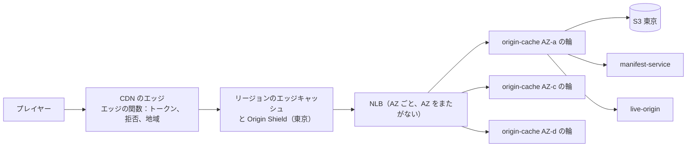
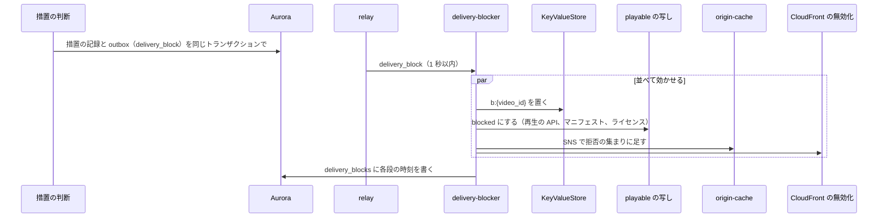

# CDN and delivery: YouTube

セグメントとマニフェストを視聴者へ届けるところを決める。CDN の層（エッジ、Origin Shield、自前の中間のキャッシュ `origin-cache`、S3）、エッジのトークンと署名の確かめ、キャッシュの鍵と期限、`origin-cache` の振り分けと入れる規則と要求の合流、ロングテールのヒットの率の計算、急な人気への事前の配置、措置での配信の停止（60 秒以内の拒否の一覧）、地域の制限、S2 の複数の CDN、費用を扱う。

前提となる決定は次のとおり。

- S1 は CloudFront と Origin Shield と自前の中間のキャッシュ。S2 から複数の CDN。署名つきの URL（6 時間、ライブは配信の間）。措置は拒否の一覧で 60 秒以内（[ADR-0005](../decisions/0005-cdn-and-origin-strategy.md)）
- セグメントの URL は中身が変わらない。索引で範囲の読み出しに直す（[ADR-0004](../decisions/0004-cmaf-packaging-and-drm-scope.md)、[ADR-0019](../decisions/0019-cmaf-files-segment-index-and-url-layout.md)）
- マニフェストは能力の組ごとに共有する（[ADR-0020](../decisions/0020-manifest-generation-and-capability-classes.md)）
- 措置は記録してから効かせる。`playable()` の写しは 60 秒以内（[ADR-0009](../decisions/0009-single-tenant-and-playable.md)）
- X の題材の拒否の一覧の形（[X の ADR-0033](../../../x/docs/decisions/0033-media-delivery-and-takedown.md)）

この文書で決めたことは次の ADR にある。

| ADR | 決定 |
| --- | --- |
| [0025](../decisions/0025-edge-token-signing-and-cache-keys.md) | エッジのトークンをパスの頭（`/t/{kid}.{exp}.{caps}.{rg}.{sig}/`）に置き、エッジの関数が確かめてから取り除いてキャッシュの鍵にする。HMAC の鍵は KeyValueStore に 2 つ並べて置く。セグメントは 1 年、VOD のマニフェストは 1 時間 |
| [0026](../decisions/0026-origin-cache-routing-admission-and-coalescing.md) | `origin-cache` は AZ ごとの輪（rendezvous のハッシュ）にし、AZ をまたがない。NVMe に入れるのは 24 時間に 2 回目の要求と、動画の最初の 3 セグメントとライブ。同じ鍵の同時の外れは 1 つの S3 の読み出しにまとめる |
| [0027](../decisions/0027-takedown-deny-list-within-60s.md) | 措置は outbox から `delivery-blocker` が、KeyValueStore の拒否の鍵、`playable()` の写し、`origin-cache` の拒否の集まり、cache tag の無効化の 4 つを並べて効かせる。拒否の鍵は 7 日で外す。決定から新しい配信の 403 まで p99 30 秒、上限 60 秒 |

## 1. 範囲

- 扱う：
  - 層の構成と要求の流れ、VOD とライブのパスの振り分け
  - エッジのトークン、署名の鍵の回し、キャッシュの鍵と期限
  - `origin-cache`：振り分け、NVMe のキャッシュ、入れる規則、索引の引き、要求の合流
  - ヒットの率の計算（ロングテール）
  - 急な人気への事前の配置
  - 措置での配信の停止と、その取り消し
  - 地域の制限のエッジでの判定
  - S2 の複数の CDN と振り分け、S3 の ISP の中のキャッシュの判断の基準
  - 配信の費用の内訳
- 扱わない：
  - マニフェストとセグメントの中身（[packaging-and-drm.md](packaging-and-drm.md)）
  - ライブのオリジン（部分セグメントと要求の保留）の中身（[live-streaming.md](live-streaming.md)）。この文書はパスの振り分けだけ
  - 措置の判断（comments-and-moderation、copyright-claims-and-disputes の領域）
  - CloudFront と WAF の全体の構成、ネットワーク（infrastructure の領域、security の領域）
  - 単価の確定（capacity の領域）

## 2. 要件

| 要件 | 目標 | NFR |
| --- | --- | --- |
| 配信の成功 | セグメントの要求の成功 月間 99.99%（エッジ） | NFR-008、K9 |
| キャッシュの外れ | バイトで 5% 以下（CDN から本システムのオリジンへ） | NFR-008 |
| 開始の速さ | セグメントの外れでも開始 p95 2.5 秒に入る。`origin-cache` の応答 p95 50 ms（NVMe）・200 ms（S3） | NFR-003 |
| 措置 | 決定から新しい再生とセグメントの配信が止まるまで 60 秒以内 | NFR-014、K10 |
| 急な人気 | 1 つの動画へ同時に 10 万の再生を始めても、S3 の GET を 1 セグメントあたり数回に抑える | [quality.md](../quality.md) の 2.2.1 節 H |
| CDN の障害（S2） | 1 つの CDN の障害で 5 分以内に他へ移す | NFR-008 |
| 費用 | 配信 1 GB あたり 0.02 USD（S1 の予算） | [architecture/README.md](README.md) の 2.1 節 |

## 3. AWS と本家（確かめたこと）

いずれも 2026-10-10 に確認。

| 項目 | 内容 | 出典 |
| --- | --- | --- |
| Origin Shield | エッジとリージョンのエッジキャッシュの外れを 1 つの層にまとめ、同じオブジェクトの要求を合わせて、オリジンへの要求を 1 つにまで減らす。東京（ap-northeast-1）で使える。オリジンと同じリージョンのリージョンのエッジキャッシュからの要求は Origin Shield を通らない | [Use Amazon CloudFront Origin Shield](https://docs.aws.amazon.com/AmazonCloudFront/latest/DeveloperGuide/origin-shield.html) |
| KeyValueStore | エッジの関数から読める鍵と値の置き場。鍵 512 バイト、値 1 KB、1 つの置き場 5 MB、1 回の更新 50 鍵か 3 MB、関数あたり置き場 1 つ | [Quotas](https://docs.aws.amazon.com/AmazonCloudFront/latest/DeveloperGuide/cloudfront-limits.html)、[KeyValueStore](https://docs.aws.amazon.com/AmazonCloudFront/latest/DeveloperGuide/kvs-with-functions.html) |
| KeyValueStore の伝わる速さ | 公式の文書に数値はない。AWS のブログは数秒で全エッジに広がると書く（数値は**未検証**。`delivery-block-list` で測る） | [AWS のブログ](https://aws.amazon.com/blogs/aws/introducing-amazon-cloudfront-keyvaluestore-a-low-latency-datastore-for-cloudfront-functions/) |
| CloudFront Functions | 関数の大きさ 10 KB、メモリー 2 MB | [Quotas](https://docs.aws.amazon.com/AmazonCloudFront/latest/DeveloperGuide/cloudfront-limits.html) |
| 無効化 | パスか cache tag で 1 秒に 150 件、ワイルドカードは 1 秒に 1 件。cache tag はオリジンの応答の見出しで付け、1 オブジェクト 50 個まで、`#` の頭で無効化する。完了までの時間は書かれていない（**未検証**） | [Quotas](https://docs.aws.amazon.com/AmazonCloudFront/latest/DeveloperGuide/cloudfront-limits.html)、[Invalidating content by cache tags](https://docs.aws.amazon.com/AmazonCloudFront/latest/DeveloperGuide/invalidation-by-tags.html) |
| ディストリビューションの既定の上限 | 転送 150 Gbps、要求 25 万件/秒（引き上げを申請できる）。キャッシュできる最大 50 GB。オリジンの応答の待ち 1〜120 秒 | [Quotas](https://docs.aws.amazon.com/AmazonCloudFront/latest/DeveloperGuide/cloudfront-limits.html) |
| S3 の要求の速さ | 分けた接頭辞ごとに GET・HEAD 5,500 件/秒以上。急に上げると 503 が出ることがある。小さなオブジェクトの最初のバイトまで 100〜200 ms | [Optimizing Amazon S3 performance](https://docs.aws.amazon.com/AmazonS3/latest/userguide/optimizing-performance.html) |
| 本家の CDN の構成、ISP の中のキャッシュ | 本家の公式の資料で、本システムに使える数値は確かめられなかった（**未検証**） | — |

- S1 のピーク 0.3 Tbps と、ライブの LL-HLS の要求（[live-streaming.md](live-streaming.md) の 6.5 節）は、既定の上限を超える。E5 の前に引き上げを申請する（`cdn-cost-poc`）。

## 4. 層と流れ



| パス | `origin-cache` の扱い |
| --- | --- |
| `/v/...`（VOD のセグメント、`init`、字幕、縮小の画像） | 索引で範囲の GET に直す。NVMe に入れる |
| `/m/...`（マニフェスト） | `manifest-service` へ。1 分だけメモリーに持つ |
| `/l/...`（ライブのプレイリストと部分） | `live-origin` へそのまま渡す。要求の保留を切らない（[live-streaming.md](live-streaming.md)） |
| `/v/...` のライブの DVR の古いセグメント | VOD と同じ（S3 から） |

## 5. エッジのトークン（ADR-0025）

### 5.1 形

```
https://<brand>video.<domain>/t/{kid}.{exp}.{caps}.{rg}.{sig}/v/{video_id}/{gen}/{rendition}/{seq}.m4s
  kid  = 鍵の番号（1 文字）
  exp  = 期限（UNIX 秒、36 進）
  caps = 能力の組（ADR-0020）
  rg   = 許す地域（`jp`、`*` など。S1 は日本だけ）
  sig  = base64url(HMAC-SHA256(key[kid], video_id | caps | rg | exp)) の先頭 22 文字（128 ビット）
```

- トークンは `video_id` に結び付く。パスの `video_id` と組み合わせて確かめるので、別の動画には使えない。
- 視聴者ごとの値を持たない（視聴者は再生のトークンで識別する。ADR-0023）。同じ動画・同じ組・同じ時間帯の視聴者は同じ形のトークンを持ちうるが、キャッシュの鍵から外すので関係しない。
- マニフェストの中のセグメントの URI は相対のパスで、プレイヤーが `/t/...` を含めて解決する（[packaging-and-drm.md](packaging-and-drm.md) の 5.3 節）。

### 5.2 エッジの関数（視聴者の要求の時）

1. パスの頭の `/t/...` を分け、`exp` が今より後か確かめる。
2. KeyValueStore の `k:{kid}` から HMAC の鍵を読み、`sig` を確かめる。違えば 403。
3. `b:{video_id}` が KeyValueStore にあれば 403（措置。10 節）。
4. 視聴者の国（`CloudFront-Viewer-Country`）が `rg` に含まれなければ 403（地域。11 節）。
5. `/m/` のパスなら、パスの `caps` とトークンの `caps` が同じか確かめる。
6. URI から `/t/...` を取り除き、キャッシュの鍵にする。問い合わせの文字列も鍵に入れない（ライブの `_HLS_msn`・`_HLS_part` だけを残す）。

- 鍵は KeyValueStore に 2 つ（今と次）を置き、30 日ごとに回す。再生の API は新しい鍵で署名し、エッジは両方で確かめる。
- 公開鍵の署名（Ed25519）をエッジの関数で確かめられるかは**未検証**。できれば再生のトークンと 1 つにまとめる（[ADR-0023](../decisions/0023-playback-token-and-qoe-metrics.md)）。

### 5.3 キャッシュの期限

| 対象 | エッジ | 端末 | 備考 |
| --- | --- | --- | --- |
| VOD のセグメント・`init` | 1 年 | 1 日 | URL は中身が変わらない |
| VOD のマニフェスト | 1 時間 | 1 分 | 世代の切り替えで cache tag を無効化 |
| ライブのプレイリスト | 部分の長さ（0.5 秒） | なし | 要求の保留の URL は `_HLS_msn`・`_HLS_part` ごと |
| ライブの部分・セグメント | 1 日（DVR の間） | 1 日 | — |
| 字幕・縮小の画像 | 1 日 | 1 日 | `rev` で変わる |
| エッジの関数の 403 | キャッシュしない | — | 取り消しをすぐ効かせるため |

- `origin-cache` は応答に cache tag の見出し（`v:{video_id}`）を付ける。措置と世代の切り替えは、この tag で無効にする。

## 6. `origin-cache`（ADR-0026）

### 6.1 振り分け

- CloudFront のオリジンは NLB。AZ ごとの IP を持ち、AZ をまたぐ振り分けを切る。
- 各 AZ の中で、ノードは rendezvous のハッシュの輪を作る。鍵は `video_id / gen / rendition / seq`。要求を受けたノードは、持ち主のノードへ 1 回だけ渡す（AZ の中）。
- AZ をまたがないので、AZ の間の転送の費用がかからず、1 つの AZ の障害が他の輪に広がらない。代わりに、同じセグメントを 3 つの AZ がそれぞれ S3 から読む（最大 3 回）。

### 6.2 NVMe のキャッシュと入れる規則

| 規則 | 中身 |
| --- | --- |
| 入れる | 24 時間に 2 回目の要求（数え上げの略図で覚える）。動画の最初の 3 セグメント（開始の速さ）とライブの DVR は 1 回目から |
| 追い出し | 区画つきの LRU（見習いの区画 20%、保護の区画 80%） |
| 索引 | `SIX1` をメモリーに 8 GB まで（12 時間の動画でも 1 本 173 KB） |
| 確かめ | 返す前に範囲の先頭が `styp` か確かめる（[packaging-and-drm.md](packaging-and-drm.md) の 9 節） |
| 拒否の集まり | 措置の `video_id` の集まり（10 節）と、`drm_required` の動画のクリアのパス（[packaging-and-drm.md](packaging-and-drm.md) の 8.6 節） |

- 1 回しか見られないロングテールのセグメントで、NVMe が埋まって人気の中程度のセグメントが追い出されるのを、入れる規則で防ぐ。

### 6.3 要求の合流

- 持ち主のノードは、同じ鍵の外れが同時に来たら、1 つの S3 の範囲の GET だけを出し、残りは結果を待つ（同じ飛行）。
- Origin Shield も同じオブジェクトの要求を合わせる（3 節）。急な人気では、S3 の GET は 1 セグメントあたり最大で「AZ の数（3）」になる。

### 6.4 S1 の大きさ

| 項目 | 値 | 根拠 |
| --- | --- | --- |
| ピークの外れの転送 | 30 Gbps（0.3 Tbps × 10%） | エッジとリージョンのキャッシュのヒットを 90% と見込む（7 節） |
| ノード | AZ ごとに 3（計 9）。NVMe 約 7.5 TB・ネットワーク 25 Gbps 以上の型（型と単価は capacity の領域。**未検証**） | 1 つの AZ の輪 約 22 TB。AZ を 1 つ失っても残りで 30 Gbps |
| 外れの応答 | p95 50 ms（NVMe）、200 ms（S3） | S3 の最初のバイトまで 100〜200 ms（3 節） |

## 7. ヒットの率の計算（ロングテール）

### 7.1 模型

- S1 の 1 年目の終わり：動画 約 260 万本（1,440 時間/日 × 365 日 ÷ 平均 12 分）、視聴 約 750 万回/日（100 万時間/日 ÷ 平均 8 分）、配信 約 900 TB/日。
- 動画の人気は Zipf の分布（順位 `i` の動画の視聴の速さ ∝ `1 / i^α`）と仮定し、`α` を 0.8〜1.0 で見る（本システムの仮定。`cdn-cost-poc` で自前の分布に置き換える）。
- LRU のキャッシュのヒットの率は、Che の近似で求める：特性の時間 `T` を `Σ_i size × (1 − e^(−λ_i T)) = C` で決め、ヒットの率 = `Σ_i λ_i (1 − e^(−λ_i T)) / Σ_i λ_i`。動画 1 本のキャッシュの大きさは 0.18 GB（12 分 × 2 Mbps の 1 段ぶん）と置く。

### 7.2 結果

要求のヒットの率に要るキャッシュの大きさ（実効）：

| `α` | 上位 1% の動画の視聴の割合 | 80% に要る大きさ | 90% | 95% |
| --- | --- | --- | --- | --- |
| 0.8 | 37% | 223 TB | 326 TB | 390 TB |
| 0.9 | — | 142 TB | 264 TB | 351 TB |
| 1.0 | 70% | 51 TB | 160 TB | 273 TB |

- 尾が重い（`α` 0.8）と、95% のヒットに約 390 TB の実効のキャッシュが要る。CloudFront のリージョンのエッジキャッシュの容量は公開されていない（**未検証**）。NFR-008 の 5% を満たすかは、`cdn-cost-poc` で実測する。
- 動画の中の人気の偏り（最初の数セグメントが多く見られる）は、この模型より有利に働く。

### 7.3 層ごとの割合（S1 の見込み）

| 層 | ヒット | その層まで来るバイト（1 日） |
| --- | --- | --- |
| エッジとリージョンのキャッシュ | 90%（目標 95%） | 900 TB |
| `origin-cache`（AZ ごとの輪、入れる規則） | 外れの流れの 50% | 90 TB |
| S3 | — | 45 TB（約 4,500 万 GET、1 セグメント 1 MB） |

- S3 の GET の費用は、東京の公開の価格の概算（1,000 件あたり約 0.00037 USD。**未検証**）で 1 日約 17 USD。小さい。
- `origin-cache` の価値は費用より、外れの応答の速さ（NVMe と S3 の最初のバイトの差）、要求の合流、S3 の接頭辞ごとの要求の速さの上限（5,500 GET/秒）の手前で受けることにある。
- CDN の外れの割合（10%）を 5% に近づけるのが、費用の主な手段ではない。配信の費用はエッジの転送（ヒットでも外れでも同じ量）で決まる。外れは開始の速さと、Origin Shield の要求の費用に効く。

## 8. 急な人気への事前の配置

| きっかけ | 配置 |
| --- | --- |
| 仮の視聴が 1 時間に 200 回を超えた（AV1 の条件と同じ。[ADR-0016](../decisions/0016-av1-promotion-rule-and-cost.md)） | 3 つの AZ の輪に、H.264 の上位 4 段と音声の最初の 8 セグメント（32 秒）を読み込む |
| 登録者 10 万以上のチャンネルの予約の公開の 5 分前 | 同上。加えて、東京と大阪の EC2 の `warmer` が CloudFront を通して同じ URL を取り、リージョンのエッジキャッシュを温める |
| プレミア公開・ライブの開始 | ライブは事前の配置をしない（まだない）。`live-origin` の要求の保留と Origin Shield の合流で受ける |

- `warmer` の取得は CDN の転送の費用がかかるが、数十 MB/動画で小さい。
- 急な人気の試験：公開の直後に同時に 10 万の再生を始め、S3 の GET が 1 セグメントあたり 3 回以下、開始の時間が NFR-003 に入ることを確かめる（[quality.md](../quality.md) の 2.2.1 節 H）。

## 9. 費用（S1、月）

| 項目 | 見込み | 前提 |
| --- | --- | --- |
| CDN の転送 | 約 54 万 USD | 27 PB × 0.02 USD（[architecture/README.md](README.md) の 2.1 節。約定の値引きは**未検証**） |
| エッジの関数の実行 | 約 3,000 USD | セグメントの要求 約 270 億件/月 × 100 万件あたり約 0.1 USD（価格は**未検証**） |
| Origin Shield の要求 | 小さい（東京のリージョンのエッジキャッシュからの要求は通らない。3 節） | — |
| `origin-cache` | 9 ノード（単価は capacity の領域） | 6.4 節 |
| S3 の GET | 約 500 USD | 7.3 節 |

- 配信の費用の制御の手段は、平均のビットレート（ラダー、`mobile_top`、AV1）と、CDN の単価（約定、S2 の複数の CDN）である。

## 10. 措置での配信の停止（ADR-0027）

### 10.1 流れ



| 段 | 効く範囲 | 時間の見込み |
| --- | --- | --- |
| `playable()` の写し | 新しい再生の API、マニフェストの生成、ライセンス | 2 秒 |
| KeyValueStore の `b:` | エッジでキャッシュにあるセグメントとマニフェスト（トークンを持つ視聴者を含む） | 置く API 2 秒＋全エッジへの伝わり（数秒と見込む。**未検証**） |
| `origin-cache` の拒否 | エッジの外れ | 2 秒 |
| cache tag の無効化 | エッジのキャッシュの中身そのもの | 完了の時間は**未検証**。拒否の鍵が先に効くので、60 秒の目標はこれに頼らない |
| ライブ | 配信の差し替えの画面（[live-streaming.md](live-streaming.md) の 8 節） | 10 秒 |

- 目標：決定から新しい配信の 403 まで p99 30 秒、上限 60 秒（NFR-014）。見張りの措置（毎日）で測る（[quality.md](../quality.md) の 2.2.1 節 I）。
- 記録してから効かせる（AGENTS.md）。outbox の行がない措置は、配信を止めない。

### 10.2 拒否の鍵の寿命と容量

- `b:{video_id}` は 7 日で外す。それまでに、エッジのトークン（最長 6 時間）はすべて切れ、新しいトークンは `playable()` が出さず、キャッシュは無効化され、`origin-cache` は拒否を続ける。
- 1 つの鍵は約 100 バイト（鍵 34 バイト＋値＋管理の分）と見込み、5 MB の置き場に約 5 万件。HMAC の鍵（`k:`）と同じ置き場（関数あたり 1 つ）。
- 1 日の措置が 5,000 件を超えて置き場の 80% に達したら、寿命を 24 時間に縮める（トークンの 6 時間より長いので安全）。それでも足りなければ Ops を呼ぶ。

### 10.3 取り消し

- 異議・再審査で措置を取り消したら、`b:` を消し、写しと `origin-cache` の拒否を外す。エッジの 403 はキャッシュしないので、すぐに再生できる。無効化は要らない。

## 11. 地域の制限

- 照合の方針の地域（copyright-claims-and-disputes の領域）と、措置の地域での非表示は、`playable(viewer, video, region)` が判定し、再生の API がエッジのトークンの `rg` に許す地域を入れる。
- エッジは視聴者の国の見出しと `rg` を比べる。S1 は日本だけを対象にし（[intent.md](../intent.md)）、`rg` は `jp` か、地域の制限のない `*`。
- 再生の途中で地域の方針が変わった動画は、措置と同じ経路で止める（`rg` の狭まりは新しいトークンから効く。古いトークンは 6 時間で切れる）。即時に止めるときは 10 節の拒否を使う。

## 12. 複数の CDN（S2）

- 2 つ目の CDN を足し、再生の API が CDN のホストを返す形で振り分ける（DNS の振り分けではない。ADR-0005）。
- 重み：プレイヤーの QoE（開始の時間、再バッファ、速さ）を CDN ごと・ISP（ASN）ごとに 5 分ごとに集め、良い CDN の重みを上げる。約定の量の上限で頭を抑える。
- プレイヤーは、セグメントの失敗が 3 回続いたら、再生の API が返した予備のホストへ移る。1 つの CDN の障害で 5 分以内に移る（NFR-008）。
- エッジのトークン・拒否の一覧・cache tag の無効化は、CDN ごとの差を口 `EdgeAdapter` の後ろに隠す。どの CDN でも 10 節の 60 秒を満たせることを、2 つ目の CDN を選ぶ条件にする。
- 2 つ目の CDN のオリジンは、CloudFront の Origin Shield を通す形（AWS の文書の複数の CDN の例。3 節）と、`origin-cache` を直接見せる形を `multi-cdn-poc` で比べる。

## 13. ISP の中のキャッシュ（S3 の規模）

- 判断の基準：1 つの ISP への配信のピークが 100 Gbps を超え、その ISP の中に置く機器の費用（機器、運用、回線）が、その ISP への CDN の転送の費用の 30% 未満になるとき。S2 の計測（CDN の ISP ごとの転送）から毎四半期に計算する。
- 置く中身は人気の動画の夜間の事前の配置と、ライブの中継。拒否の一覧と署名の確かめを機器の中でも行えることを条件にする。

## 14. 失敗と回復

| 失敗 | 起きること | 回復 |
| --- | --- | --- |
| `origin-cache` のノードの停止 | 輪の一部の鍵が外れる | rendezvous のハッシュで、そのノードの鍵だけが他へ移る。NLB のヘルスチェックで外す |
| 1 つの AZ の停止 | その AZ の輪が使えない | CloudFront は残りの AZ の IP へ。残り 2 つの輪で 30 Gbps を受けられる大きさにする |
| S3 の 503（急な要求） | 外れの応答が遅れる | 要求の合流と、指数の後退。急な人気は事前の配置で避ける |
| KeyValueStore の更新の失敗 | 拒否がエッジに効かない | `delivery-blocker` がやり直す（10 秒ごと、5 回）。`playable()` と `origin-cache` の拒否は効いている。60 秒を超えたら Ops を呼び、パスの無効化を足す |
| エッジの関数の誤り（デプロイ） | 全部の要求が 403 か、全部を通す | 関数は段階のデプロイ（ステージングのディストリビューション）にし、見張りの動画と見張りの措置の両方が通ってから出す |
| HMAC の鍵の漏れ | 期限内のトークンを作られる | 鍵を外し（`k:` を消す）、新しい鍵で再生の API を出し直す。プレイヤーは 403 で再生の API を呼び直す |
| CloudFront の障害（S1） | 再生が止まる | S1 は 1 つの CDN（ADR-0005）。S2 で複数の CDN |

## 15. 上限

| 対象 | 値 |
| --- | --- |
| エッジのトークン | 6 時間（ライブは配信の間、6 時間ごとに取り直す） |
| HMAC の鍵 | 2 つ、30 日で回す |
| 拒否の鍵 | 7 日（置き場の 80% で 24 時間） |
| KeyValueStore | 5 MB、1 回の更新 50 鍵 |
| 無効化 | 1 秒に 150 件（パスか tag） |
| ディストリビューション | 既定 150 Gbps・25 万件/秒（引き上げの申請が要る） |
| `origin-cache` の索引のメモリー | ノードあたり 8 GB |

## 16. data-model への項目

| 表・置き場 | 中身 | 主キー・索引 | 節 |
| --- | --- | --- | --- |
| `delivery_blocks` | `video_id`、`action_id`、`kind`（`takedown`・`claim_block`・`region`）、`decided_at`、`kvs_put_at`、`replica_at`、`origin_at`、`invalidation_id`、`invalidated_at`、`kvs_removed_at`、`lifted_at` | `(video_id, action_id)`、`(kvs_removed_at) WHERE kvs_removed_at IS NULL` | 10 |
| KeyValueStore `edge-kv` | `k:{kid}` → HMAC の鍵、`b:{video_id}` → `{"a":"<action_kind>","t":<epoch>}` | — | 5、10 |
| Valkey | `blocked:{video_id}`（`playable()` の写しの一部） | outbox で更新 | 10 |
| SNS | `origin-deny`（`origin-cache` の拒否の集まりの更新） | — | 10 |
| `cdn_weights`（S2） | CDN、ASN、重み、計算の時刻 | `(asn, cdn)` | 12 |

## 17. テストと性質

| ID | 性質・試験 |
| --- | --- |
| PROP-CDN-001 | 任意のトークン（期限切れ、別の `video_id`、別の `caps`、改ざん、外した鍵）で、エッジの関数が通すのは正しいものだけ |
| PROP-CDN-002 | エッジの関数は、通した要求のキャッシュの鍵からトークンを取り除く。同じセグメントの 2 つの違うトークンの要求は同じ鍵になる |
| PROP-CDN-003 | 任意の措置・取り消しの列で、`delivery_blocks` の未解除の `video_id` は、KeyValueStore の `b:` か、7 日を過ぎて `origin-cache` と `playable()` の拒否の両方にある（どちらかが常に成り立つ） |
| PROP-CDN-004 | 任意のノードの増減で、rendezvous のハッシュで持ち主が変わる鍵は、増減したノードの鍵だけ |
| PROP-CDN-005 | 同じ鍵の同時の外れ N 件で、S3 の GET は AZ ごとに 1 件 |
| 結合 | 見張りの措置：措置から 60 秒でエッジが 403（毎日。[quality.md](../quality.md) の 2.2.1 節 G・I） |
| 負荷 | 急な人気（10 万の同時の開始）で S3 の GET が 1 セグメントあたり 3 回以下 |
| 計測 | エッジとリージョンのキャッシュのヒットの率、`origin-cache` のヒットの率、外れのバイトの割合（NFR-008） |

## 18. Story の候補

| Epic | Story | 中身 |
| --- | --- | --- |
| E5 | `cdn-cost-poc` | 7 節の分布と実測、上限の引き上げ、エッジの関数の Ed25519、関数の費用 |
| E5 | `cloudfront-and-shield` | 4・5.3 節 |
| E5 | `signed-delivery` | 5 節（ADR-0025、PROP-CDN-001・002） |
| E5 | `origin-cache` | 6 節（ADR-0026、PROP-CDN-004・005） |
| E5 | `delivery-block-list` | 10 節（ADR-0027、PROP-CDN-003） |
| E5 | `viral-prewarm` | 8 節 |
| S2 の前 | `multi-cdn-poc` | 12 節 |

## 19. 未解決の問い

### 決定（2026-10-10、既定案）

- **トークンの置き場**：パスの頭（ADR-0025）。
- **`origin-cache` の振り分け**：AZ ごとの輪、AZ をまたがない（ADR-0026）。
- **入れる規則**：24 時間に 2 回目、最初の 3 セグメントとライブは 1 回目から（ADR-0026）。
- **拒否の鍵**：7 日、置き場の 80% で 24 時間（ADR-0027）。
- **ISP の中のキャッシュの基準**：1 ISP のピーク 100 Gbps と費用の比（13 節）。

### 持ち越し

| 問い | いつ・どう決めるか |
| --- | --- |
| 人気の分布（`α`）と CloudFront の実効のキャッシュ、NFR-008 の 5% に届くか | `cdn-cost-poc` |
| KeyValueStore の伝わる速さ、無効化の完了の時間（**未検証**） | `delivery-block-list` で測る |
| エッジの関数で Ed25519 を確かめられるか（**未検証**） | `cdn-cost-poc` |
| 配信 1 GB の実効の単価、エッジの関数の価格（**未検証**） | 見積もりと capacity の領域 |
| 2 つ目の CDN の選定 | `multi-cdn-poc`（S2 の前） |
| 日本の外の地域の扱い | S3 の段階（海外の地域） |

## 出典

いずれも 2026-10-10 に確認。

- AWS, [Use Amazon CloudFront Origin Shield](https://docs.aws.amazon.com/AmazonCloudFront/latest/DeveloperGuide/origin-shield.html)
- AWS, [Amazon CloudFront KeyValueStore](https://docs.aws.amazon.com/AmazonCloudFront/latest/DeveloperGuide/kvs-with-functions.html)
- AWS, [CloudFront Quotas](https://docs.aws.amazon.com/AmazonCloudFront/latest/DeveloperGuide/cloudfront-limits.html)
- AWS, [Invalidating content by cache tags](https://docs.aws.amazon.com/AmazonCloudFront/latest/DeveloperGuide/invalidation-by-tags.html)
- AWS, [Optimizing Amazon S3 performance](https://docs.aws.amazon.com/AmazonS3/latest/userguide/optimizing-performance.html)
- AWS News Blog, [Introducing Amazon CloudFront KeyValueStore](https://aws.amazon.com/blogs/aws/introducing-amazon-cloudfront-keyvaluestore-a-low-latency-datastore-for-cloudfront-functions/)
- H. Che, Y. Tung, Z. Wang, Hierarchical Web caching systems: modeling, design and experimental results, IEEE JSAC 2002（Che の近似。本文の確認は**未検証**）
