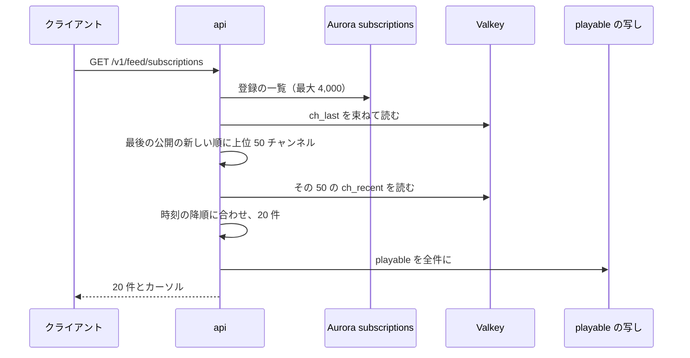
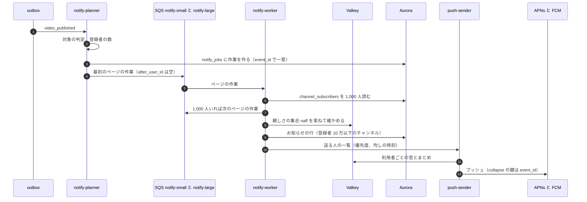

# Channels, subscriptions and notifications: YouTube

チャンネルの公開の情報、ハンドル、登録、登録のフィード、新しい動画とライブの通知、再生リストを決める。数百万の登録者を持つチャンネルの通知の扇形の配り（ページの作業、待ち行列の分け、個人化の絞り、送る速さの均し、まとめ）を中心に扱う。

前提となる決定は次のとおり。

- 登録・通知・設定は本人の表（FORCE RLS）、チャンネルの管理は持ち主の RLS（[ADR-0009](../decisions/0009-single-tenant-and-playable.md)）
- 通知の送信の前に `playable()` を通す（[ADR-0009](../decisions/0009-single-tenant-and-playable.md)）
- 非同期は outbox → SNS・SQS（[ADR-0001](../decisions/0001-platform-and-stack.md)）
- 扇形の配りの形は X の題材（ページの作業、作者の大きさでの待ち行列の分け、プッシュとプルの組み合わせ。[timeline-fanout.md](../../../x/docs/architecture/timeline-fanout.md)、[X の ADR-0003](../../../x/docs/decisions/0003-timeline-fanout-hybrid.md)、2 つの隣接の表は [X の ADR-0007](../../../x/docs/decisions/0007-follow-graph-storage.md)）に寄せる
- 子ども向けの動画は通知を送らない（[comments-and-moderation.md](comments-and-moderation.md) の 8.2 節）

この文書で決めたことは次の ADR にある。

| ADR | 決定 |
| --- | --- |
| [0053](../decisions/0053-handles-and-subscription-tables.md) | ハンドルは ASCII の 3〜30 文字で、正規化した値に一意の索引を置き、14 日に 2 回まで変えられ、古いハンドルを 14 日取り置く（チャンネルの形と役割は accounts-and-safety の領域）。登録は本人の表 `subscriptions` と、扇形の配りの専用の表 `channel_subscribers`（通知の段階の写しを持つ）の 2 つに同じトランザクションで書く。登録のフィードは読み出しの時にチャンネルの最近の動画の写しを合わせる |
| [0054](../decisions/0054-notification-fanout-pacing-and-coalescing.md) | 通知は 1,000 人のページの作業に分け、登録者 1 万未満と以上で待ち行列を分ける。「おすすめ」の段階は前もって作った親しさの集合で絞る。プッシュは利用者ごとに 10 分に 1 回までにし、超えた分は窓の終わりのまとめの 1 通にする。大きなチャンネルのプッシュは 1 秒 2,000 人（ライブは 5,000 人）に均して送る。登録者 10 万を超えるチャンネルのお知らせの一覧は、読み出しの時に合わせる |

## 1. 範囲

- 扱う：
  - チャンネルの公開の情報、ハンドル
  - 登録、通知の段階（すべて・おすすめ・なし）、登録者の数
  - 登録のフィード
  - 新しい動画・ライブ・プレミア公開の通知（プッシュ、アプリの中のお知らせ、メール）
  - 再生リストと「後で見る」
- 扱わない：
  - アカウント、チャンネルの所有者と役割、認証、創作者の確認（[accounts-and-safety.md](accounts-and-safety.md)）
  - おすすめ（[recommendations.md](recommendations.md)。登録の新着の源として 5 節の写しを使う）
  - 申し立て・措置の通知の中身（[copyright-claims-and-disputes.md](copyright-claims-and-disputes.md)、[comments-and-moderation.md](comments-and-moderation.md)。送る口は 6.6 節を使う）
  - プレミア公開の配信の側（[live-streaming.md](live-streaming.md) の 9 節）

## 2. 要件

| 要件 | 目標 | 根拠 |
| --- | --- | --- |
| 登録・解除 | p99 300 ms | — |
| 登録のフィード | 最初のページ p99 300 ms | — |
| 新しい動画の通知 | 登録者 1 万未満のチャンネル：公開から p95 60 秒で全員に送り終える。300 万のチャンネル：15 分以内に送り終える（均すため） | 本システムの値 |
| ライブの開始の通知 | 1 万未満：p95 30 秒。300 万：5 分以内 | 本システムの値 |
| 重複 | 同じ出来事のプッシュを、同じ端末に 2 回出さない | — |
| 見える範囲 | 通知の時点で `playable()` が `deny` の利用者に送らない。子ども向けの動画は 0 件 | [ADR-0009](../decisions/0009-single-tenant-and-playable.md)、[quality.md](../quality.md) の 2.2.1 節 G |

## 3. チャンネルとハンドル（ADR-0053）

### 3.1 チャンネル

- アカウントとチャンネルの形、所有者、役割と権限（`channel_members`、`can()`）は [accounts-and-safety.md](accounts-and-safety.md) の 4 節にある。この文書はチャンネルの公開の情報とハンドルの規則を決める。
- 公開の情報：表示の名前（1〜100 文字）、ハンドル、説明（5,000 文字）、アイコンとバナー、国、既定の言語、既定の子ども向けの印、作成日、登録者の数（4.2 節）。

### 3.2 ハンドル

- 形：`@` と 3〜30 文字の `[a-z0-9._-]`。先頭と末尾は英数字（本システムの値。本家は多くの言語の文字を受けるとされるが**未検証**。MVP は ASCII にして、なりすましの文字の検査を省く）。
- 一意：小文字にした値に一意の索引。予約の一覧（運営の語、`<brand>` を含む語）。
- 変更：14 日に 2 回まで。古いハンドルを 14 日取り置き、その間は新しいハンドルへ転送する。変更の権限と再確認は [accounts-and-safety.md](accounts-and-safety.md) の 4.2 節。

## 4. 登録（ADR-0053）

### 4.1 2 つの表

| 表 | 主キー | 中身 | 読む側 |
| --- | --- | --- | --- |
| `subscriptions`（本人の表、FORCE RLS） | `(user_id, channel_id)` | `level`（`all`・`personalized`・`none`）、`created_at` | 本人の登録の一覧、登録のフィード |
| `channel_subscribers`（扇形の配りの専用の表） | `(channel_id, user_id)` | `level` の写し、`created_at` | `notify-worker` だけ（API から読まない） |

- 登録・解除・段階の変更は、2 つの表と outbox（`subscription_changed`）を同じトランザクションで書く。
- `channel_subscribers` は本人の表の写しで、RLS を通らない専用の DB の役割（`fanout_reader`）だけが読める。登録者の一覧を創作者に見せる経路は作らない（公開を選んだ登録者だけを別の経路で見せるのは S2）。
- 既定の段階は `personalized`（本家と同じ。[Manage YouTube notifications](https://support.google.com/youtube/answer/3382248)、2026-10-10 に確認）。登録し直すと既定に戻る。

### 4.2 登録者の数

- Valkey の `subc:{channel_id}` に増減を積み、1 分ごとに `channels.subscriber_count` へ書き戻す。毎日、`channel_subscribers` の数と突き合わせる。
- 表示は 3 桁の有効数字に丸める（例：1,234,567 → 123 万）。丸めの形は本システムの値（本家の丸めの規則は**未検証**）。
- 確かめ：毎日、停止・スパムと判定されたアカウント（accounts-and-safety の領域）の登録を外し、数を直す。収益化の条件の登録者の数（[monetization-and-payouts.md](monetization-and-payouts.md) の 3 節）は、確かめの後の数を使う。
- 創作者の分析の登録者の増減は、`subscription_changed` から日ごとに集計する（[view-counting-and-analytics.md](view-counting-and-analytics.md) の 7.1 節）。

### 4.3 上限

- 利用者あたり 4,000 チャンネル（登録のフィードの合わせの費用のため。本システムの値）。1 時間に 100 回、1 日 1,000 回の登録の操作。

## 5. 登録のフィード（ADR-0053）

- `ch_last:{channel_id}`：最後の公開の時刻。`ch_recent:{channel_id}`：直近 30 本の公開の動画（`video_id`、公開の時刻、種類）。どちらも `video_state_changed` で更新し、Aurora から作り直せる。
- 続きのページは、カーソル（時刻と `video_id`）より古いものを同じ方法で読む。50 チャンネルで 20 件に足りなければ次の 50 を読む。
- メンバー限定の動画は、その利用者が会員のチャンネルのものだけを出す（`playable()`）。
- `ch_recent:` はおすすめの `subs_new` の源も使う（[recommendations.md](recommendations.md) の 5 節）。

## 6. 通知（ADR-0054）

### 6.1 きっかけと対象

| きっかけ | 対象 | 送らない |
| --- | --- | --- |
| 動画の公開（`published` で公開の範囲が公開・メンバー限定） | 登録者（メンバー限定は会員だけ） | 子ども向けの動画、限定公開・非公開、ブロック、チャンネルの制限 |
| ライブの開始 | 登録者 | 同上 |
| プレミア公開の開始 | 「通知を受け取る」を押した人と登録者 | 同上 |
| 同じチャンネルの 24 時間の 4 本目以降の公開 | お知らせの一覧だけ（プッシュしない） | — |

- 年齢の制限の動画は、年齢を確かめた利用者にだけ送る。
- 対象の判定（`playable()`）は、出来事ごとに「日本の匿名の閲覧者」の組で 1 回行い、年齢・会員の違いだけを利用者ごとに見る。

### 6.2 流れ

- ページは `channel_subscribers` の主キーの順に、前のページの最後の `user_id` の次から 1,000 人ずつ読む。次のページの作業は、ページを読んだ作業者が作る（大きなチャンネルのページが並べて進む）。
- ページの作業は `(event_id, after_user_id)` で冪等。同じページを 2 回処理しても、プッシュの `collapse` の鍵（APNs の `apns-collapse-id`、FCM の `collapse_key`）を `event_id` にするので端末には 1 つだけ出る。
- 待ち行列：登録者 1 万未満のチャンネルは `notify-small`（先に取る）、それ以上は `notify-large`（`notify-small` が空か、4 回に 1 回）。小さなチャンネルの通知が大きなチャンネルの後ろで待たない（X の題材と同じ）。

### 6.3 段階と絞り込み

| `level` | プッシュ | お知らせの一覧 |
| --- | --- | --- |
| `all` | 送る | 入れる |
| `personalized` | 親しさの集合にいれば送る | 入れる |
| `none` | 送らない | 入れない |

- 親しさの集合 `naff:{channel_id}`：毎日、次のどれかを満たす登録者の ID の集合を作る（S1 の規則）。
  - 直近 60 日に、そのチャンネルの通知を開いた
  - 直近 30 日に、そのチャンネルのエンゲージ ビューが 2 回以上（履歴を止めた利用者は使わない）
  - 登録から 30 日以内で、チャンネルの公開が週 1 本以下
- `notify-worker` は 1,000 人を `SMISMEMBER` で 1 回で確かめる。
- 子ども向けのチャンネルは段階によらず送らない（本家と同じ）。

### 6.4 均しとまとめ

- **利用者ごとの窓**：新しい動画のプッシュは利用者ごとに 10 分に 1 回まで、1 日 10 回まで。窓の中の 2 つ目以降は `npq:{user_id}` に貯め、窓の終わりに「ほかに 3 本の新しい動画」のまとめを 1 通送る。ライブの開始は窓の外（ただし 10 分に 1 回）。
- **大きなチャンネルの均し**：送る人の数 `N` に対し、`T = min(15 分, N ÷ 2,000 人/秒)`（ライブは `N ÷ 5,000 人/秒`、最大 5 分）の間に均して送る。親しさの高い人（`all` と、直近 7 日に通知を開いた人）を先にする。
- 均す理由：一斉の通知で再生の API とオリジンに同時に人が来る（急な人気。[cdn-and-delivery.md](cdn-and-delivery.md) の 8 節の事前の配置と合わせる）。
- 利用者の静かな時間（設定）の間は、ライブ以外をお知らせの一覧だけにする。

### 6.5 例：登録者 300 万のチャンネルの新しい動画

| 段 | 数 | 時間 |
| --- | --- | --- |
| 登録者 | 300 万（`all` 10%、`personalized` 80%、`none` 10%） | — |
| ページの作業 | 3,000 | 作業者 20 台、1 ページ 0.5 秒で約 75 秒 |
| プッシュの対象 | `all` 30 万 ＋ `personalized` のうち親しさの集合 25% の 60 万 ＝ 90 万人 | — |
| 端末 | 平均 1.6 台で 144 万の送信 | — |
| 均し | 90 万 ÷ 2,000 人/秒 ＝ 450 秒 | 約 7.5 分で送り終える |
| お知らせの一覧 | 登録者 10 万を超えるので行を書かない（6.6 節） | 1 回の書き込み |

### 6.6 お知らせの一覧と送り口

- 登録者 10 万以下のチャンネル：`notifications`（本人の表、月ごとの分割、90 日）に行を書く（プッシュ）。
- 10 万を超えるチャンネル：`ch_notif:{channel_id}`（直近 50 件、30 日）に 1 件書くだけ。利用者の一覧を読むとき、`ulc:{user_id}`（その利用者が登録している大きなチャンネルの集合）の `ch_notif:` を合わせる（プル）。登録より前の出来事と、`none` のチャンネルは除く。
- 他の領域の通知（申し立て、措置、収益）は同じ `notifications` と `push-sender` を使う（1 人に送るので扇形の配りを通らない）。
- メール：既定は日ごと・週ごとのまとめ。動画ごとのメールは利用者が選んだときだけ。解除の 1 回の操作のリンクを付ける。

### 6.7 端末

- `push_devices`（本人の表）：`user_id`、`device_id`、`platform`（`apns`・`fcm`・`web`）、トークン（暗号化）、`last_seen_at`。利用者あたり 10 台。
- APNs・FCM が無効と返したトークンは消す。90 日使われていない端末は消す。

## 7. 再生リスト

- `playlists`：`playlist_id`、持ち主（チャンネルか利用者）、題、説明、公開の範囲、`item_count`。「後で見る」は利用者ごとの決まった再生リスト（本人の表）。
- `playlist_items`：`playlist_id`、`position_key`（分数の順序の文字列。並べ替えで他の行を書き換えない）、`video_id`、`added_at`。1 つの再生リストに 5,000 本まで（本システムの値。本家の上限は**未検証**）。
- 表示の時に、各動画に `playable()` を通し、見られない動画は「見られない動画」として数だけ示す。
- 再生リストの次の動画は、おすすめの `continue` の源と次の動画の 1 件目に使う（[recommendations.md](recommendations.md) の 4.2 節）。

## 8. 失敗と回復

| 失敗 | 起きること | 回復 |
| --- | --- | --- |
| `notify-planner` の失敗 | 作業が作られない | outbox の再配信。`notify_jobs` の一意で 2 つ作らない |
| ページの作業の失敗 | 一部の人に届かない | 5 回のやり直し、DLQ。DLQ は Ops が再投入（`collapse` の鍵で端末の重複は出ない） |
| APNs・FCM の 429・5xx | 送れない | 指数の後退。15 分を超えたプッシュは捨て、お知らせの一覧だけにする（古い通知を後から出さない） |
| `naff:` の作成の失敗 | 親しさが古い | 前の日の集合を使う。3 日を超えたら `personalized` を `all` の 50% の見本で送る |
| Valkey の喪失 | `ch_recent:`・`ch_notif:`・窓が消える | Aurora から作り直す。窓が消えた間は、1 日の上限だけを Aurora の送信の記録で守る |
| `channel_subscribers` と `subscriptions` のずれ | 通知の漏れ・余計な通知 | 毎日の突き合わせで直す（同じトランザクションで書くので、ずれは不具合として扱う） |

## 9. 上限

| 対象 | 値 |
| --- | --- |
| 利用者あたりの登録 | 4,000 |
| 登録の操作 | 1 時間に 100、1 日 1,000 |
| プッシュ | 利用者あたり 10 分に 1 回、1 日 10 回（ライブを除く） |
| チャンネルの 1 日の通知のプッシュ | 3 本まで（4 本目からお知らせの一覧だけ） |
| お知らせの一覧の保持 | 90 日 |
| 再生リスト | 5,000 本、利用者あたり 1,000 の再生リスト |
| ハンドルの変更 | 14 日に 2 回 |

## 10. data-model への項目

列・キー・索引の正本は [data-model.md](data-model.md) と [data-model/](data-model/) の各ファイルである。この節は提案の記録として残す（2026-10-10 のデータモデルの工程）。

| 表・置き場 | 中身 | 主キー・索引 | 節 |
| --- | --- | --- | --- |
| `channels` に足す列（表は [accounts-and-safety.md](accounts-and-safety.md) の 13 節） | `handle`、`handle_norm`、`subscriber_count`、`made_for_kids_default` | 一意 `(handle_norm)` | 3 |
| `handle_history` | `channel_id`、`old_handle_norm`、`released_at` | `(old_handle_norm)` | 3.2 |
| `subscriptions`（本人の表、FORCE RLS） | 4.1 節 | `(user_id, channel_id)` | 4.1 |
| `channel_subscribers`（専用の役割だけ） | 4.1 節 | `(channel_id, user_id)` | 4.1 |
| `notify_jobs` | `event_id`、`channel_id`、`kind`、`total`、`pages_done`、`state`、`created_at` | `(event_id)` | 6.2 |
| `notifications`（本人の表、月ごとの分割） | `user_id`、`notification_id`、`kind`、`subject_id`、`read_at`、`created_at` | `(user_id, notification_id, created_at)`（月の分割の鍵を含む。読み出しは `notification_id` の降順） | 6.6 |
| `push_devices`（本人の表） | 6.7 節 | `(user_id, device_id)` | 6.7 |
| `notification_settings`（本人の表） | 静かな時間、メールの頻度、種類ごとの有効 | `(user_id)` | 6.4 |
| `playlists`・`playlist_items` | 7 節 | `(playlist_id)`・`(playlist_id, position_key)` | 7 |
| Valkey | `subc:`、`ch_last:`、`ch_recent:`、`ch_notif:`、`ulc:`、`naff:`、`npw:`、`npq:` | — | 4〜6 |
| SQS | `notify-small`、`notify-large`、`push-send`（と DLQ） | — | 6.2 |
| outbox | `subscription_changed`、`video_state_changed`（読む）、`live_started`（読む） | — | 4、6 |

## 11. テストと性質

| ID | 性質・試験 |
| --- | --- |
| PROP-SUB-001 | 任意の登録・解除・段階の変更の列で、`subscriptions` と `channel_subscribers` の集合と段階が一致する |
| PROP-SUB-002 | 任意のページの作業の重複・順の入れ替え・失敗とやり直しで、対象の各人に、同じ出来事の通知（お知らせの行）が 1 つだけで、端末への送信の `collapse` の鍵は `event_id` |
| PROP-SUB-003 | 任意の列で、`none` の登録者・子ども向けの動画・`playable()` が `deny` の利用者に通知が出ない |
| PROP-SUB-004 | 任意の出来事の到着の列で、1 人への新しい動画のプッシュは 10 分に 1 回以下、1 日 10 回以下で、貯めた分はまとめの 1 通で必ず出る |
| PROP-SUB-005 | 登録のフィード：任意の公開の列で、フィードは登録したチャンネルの見られる公開の動画を、時刻の降順に重複なく返す |
| DT-SUB-001 | 通知の対象の決定表：段階 × 親しさ × 動画の種類（子ども向け、年齢、メンバー限定）× チャンネルの大きさ × 1 日の本数 |
| 負荷 | 登録者 300 万のチャンネルの公開で、15 分以内に送り終え、同時に 1 万未満のチャンネルの通知が p95 60 秒に入る |
| 決定的な模擬 | 仮想の時計とメモリーの待ち行列で、PROP-SUB-002・004 を 10 万の列で確かめる |

## 12. Story の候補

| Epic | Story | 中身 |
| --- | --- | --- |
| E6 | `channel-handles` | 3 節（ADR-0053。チャンネルと役割は accounts-and-safety の `channels-and-roles`） |
| E6 | `subscriptions` | 4 節（ADR-0053、PROP-SUB-001） |
| E6 | `subscription-feed` | 5 節（PROP-SUB-005） |
| E6 | `notifications` | 6 節（ADR-0054、PROP-SUB-002〜004、DT-SUB-001） |
| E6 | `push-devices` | 6.7 節 |
| E6 | `playlists` | 7 節 |

## 13. 未解決の問い

### 決定（2026-10-10、既定案）

- **ハンドル**：ASCII の 3〜30 文字、14 日に 2 回（ADR-0053）。
- **登録の表**：2 つの表を同じトランザクションで（ADR-0053）。
- **フィード**：読み出しの時の合わせ（ADR-0053）。
- **通知**：1,000 人のページ、2 つの待ち行列、親しさの集合、10 分の窓、1 秒 2,000 人の均し、10 万を超えるチャンネルのお知らせはプル（ADR-0054）。

### 持ち越し

| 問い | いつ・どう決めるか |
| --- | --- |
| 日本語のハンドル | S2。なりすましの文字の検査と合わせて決める |
| 「おすすめ」の段階の親しさの規則を学習したモデルにするか | S2 |
| 均しの速さ（1 秒 2,000 人）と再生の API の余裕 | E15 の急な人気の試験 |
| 登録者の一覧を創作者に見せるか（公開を選んだ登録者） | PM（**法務の確認待ち：L5** と合わせる） |
| タイアップの申告の欄（法務の L4）をチャンネルの既定に持つか | [comments-and-moderation.md](comments-and-moderation.md) の 8.3 節と合わせる |

## 出典

いずれも 2026-10-10 に確認。

- YouTube Help, [Manage YouTube notifications](https://support.google.com/youtube/answer/3382248)
