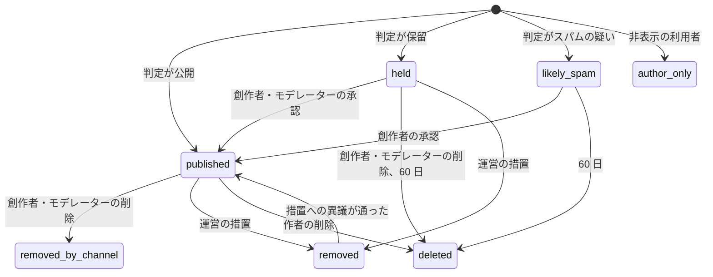
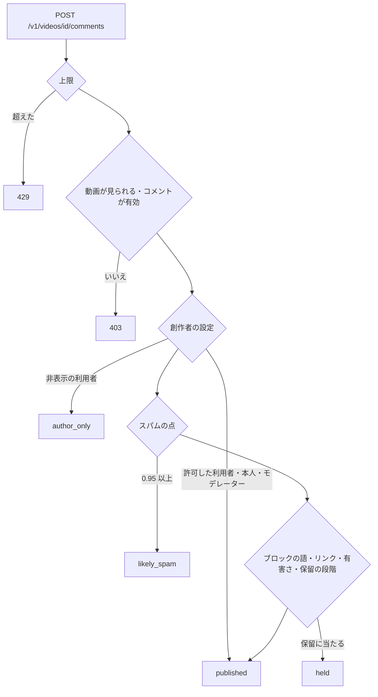
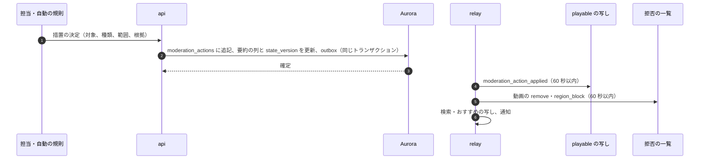

# Comments and moderation: YouTube

動画のコメントと、動画・コメント・チャンネルのモデレーションを決める。コメントの形と返信の木、並べ方、投稿の流れ（上限、スパムの判定、保留）、創作者のモデレーションの道具、通報と待ち行列、措置の種類と効かせ方、年齢の制限、子ども向けの印、タイアップの表示を扱う。**法務の確認待ち：L1（削除の申出と削除の基準の公表）・L3（未成年）・L4（ステルスマーケティング）・L6（機械の読み取りと通信の秘密）**。

前提となる決定は次のとおり。

- 見える範囲は `playable()`。コメントの表示も、動画が見られない閲覧者には出さない（[ADR-0009](../decisions/0009-single-tenant-and-playable.md)、[quality.md](../quality.md) の 2.2.1 節 G）
- 措置は記録してから効かせ、配信の停止は 60 秒以内（[ADR-0005](../decisions/0005-cdn-and-origin-strategy.md)、[cdn-and-delivery.md](cdn-and-delivery.md) の 10 節）
- コメントの保留はチャンネルの表（FORCE RLS）（[ADR-0009](../decisions/0009-single-tenant-and-playable.md)）
- ML の点で年齢の制限・子ども向けの印・措置を変えない（[ADR-0010](../decisions/0010-recommendation-boundary.md)）
- 措置・通報・異議の形は X の題材（[trust-and-safety.md](../../../x/docs/architecture/trust-and-safety.md)）に寄せる
- コメントの本文をログに出さない（AGENTS.md）

この文書で決めたことは次の ADR にある。

| ADR | 決定 |
| --- | --- |
| [0050](../decisions/0050-comment-threads-storage-and-ranking.md) | コメントは最上位と返信の 2 段の木にし、返信への返信は最上位の下に並べて返信先の利用者を持つ。Aurora の `comments` を `video_id` のハッシュで 16 に分ける。「評価順」は（高評価 ＋ 2 × 返信した人 ＋ 10 × 創作者のハート ＋ 1）÷（経過時間 ＋ 2）^0.8 で、上位 2,000 の候補を Valkey に持つ |
| [0051](../decisions/0051-comment-posting-pipeline-spam-and-hold.md) | 投稿は、上限 → 創作者の設定（許可・非表示の利用者、ブロックの語、リンク）→ スパムの点 → 有害さの点 → 保留の段階の順に判定し、結果を「公開・保留・スパムの疑い・作者だけに見える」の 4 つにする。判定は同期で 60 ms 以内。保留は 60 日で消す |
| [0052](../decisions/0052-moderation-actions-age-kids-and-promotion.md) | 措置は追記だけの `moderation_actions` に書いてから、動画・コメント・チャンネルの措置の要約を同じトランザクションで変え、outbox で配る。動画の措置は警告の画面・年齢の制限・おすすめの制限・検索の制限・地域の非表示・削除。年齢の制限は `playable()` の `allow_with: age_check`、子ども向けの印はコメント・通知・個人化・広告・ライブチャットを止める |

## 1. 範囲

- 扱う：
  - コメントと返信、高評価、ピン留め、ハート、編集と削除
  - 並べ方（評価順、新しい順）
  - 投稿の上限、スパムと有害さの判定、保留、作者だけに見える状態
  - 創作者の道具（保留の段階、ブロックの語、リンク、許可・非表示の利用者、モデレーター、コメントの停止）
  - 動画・コメント・チャンネルの通報、待ち行列、措置、措置への異議
  - 年齢の制限、子ども向けの印、タイアップの表示
- 扱わない：
  - ライブチャット（[live-chat.md](live-chat.md)）
  - 著作権の申し立てと削除の申出（[copyright-claims-and-disputes.md](copyright-claims-and-disputes.md)）
  - 権利の侵害の削除の申出（名誉・プライバシー）の案件、年齢の確かめ方、警告と strike、アカウントの停止（[accounts-and-safety.md](accounts-and-safety.md)。**法務の確認待ち：L1・L3・L10**）
  - 既知の違法なメディアの照合（[upload-and-ingest.md](upload-and-ingest.md) の 5.3 節）

## 2. 要件

| 要件 | 目標 | NFR・根拠 |
| --- | --- | --- |
| 投稿 | コメントの投稿 p99 500 ms（判定を含む） | NFR-013 |
| 一覧 | 最初のページ（20 件）p99 300 ms | — |
| 措置の効き | 措置の決定から、再生とセグメントの配信の停止まで 60 秒。コメントの非表示も 60 秒 | NFR-014 |
| 見える範囲 | 措置した動画・見られない動画のコメントを出さない | [quality.md](../quality.md) の 2.2.1 節 G |
| 子ども向け | 子ども向けの動画でコメント 0 件、通知 0 件、個人化 0 件 | **法務の確認待ち：L3** |
| 待ち行列の期限 | 命に関わる区分 1 時間、他は 7.1 節の段 | — |
| 中身をログに出さない | コメントの本文・ブロックの語をログに出さない | AGENTS.md |

## 3. 本家の形（確かめたこと）

| 項目 | 本家 | 出典 |
| --- | --- | --- |
| 保留の段階 | なし・基本・厳しい・すべて保留の 4 つ。基本はスパム・自分の宣伝・意味のない文などを保留 | [Review comments on your channel](https://support.google.com/youtube/answer/9483359) |
| 保留の保持 | 保留したコメントは最長 60 日、管理の画面に残り、承認しなければ公開されない | 同上 |
| ブロックの語・リンク | ブロックの語に一致・近いコメントを保留（許可した利用者を除く）。ライブチャットでも止める。リンクを含むコメントを保留できる（本人・モデレーター・許可した利用者を除く） | 同上 |
| 許可・非表示の利用者 | 許可した利用者のコメントは判定を通らずに公開。非表示の利用者のコメントはチャンネルの全部の動画で隠れる | 同上 |
| 子ども向けのチャンネル | 子ども向けのチャンネルは通知を送らず、変えられない | [Manage YouTube notifications](https://support.google.com/youtube/answer/3382248) |
| 返信の木の深さ、コメントの文字の上限、評価順の信号 | 公式の資料で確かめられなかった（**未検証**） | — |

いずれも 2026-10-10 に確認。

## 4. コメントの形と保存（ADR-0050）

### 4.1 木

- 最上位のコメント（`parent_id = null`）と、その返信の 2 段。返信への返信は、最上位の下に並べ、`reply_to_user_id` を持つ（画面に「@ハンドル」を出す）。
- 返信は古い順に並べる。最上位の下に返信が 500 件を超えたら、それ以上の返信を受けない。
- 本文：1〜2,000 文字（本システムの値）。URL、ハンドルのメンション（`@handle` を利用者の ID に解いて持つ）、時刻（`12:34` を動画の位置へのリンクにする）。

### 4.2 状態



- `author_only` は作者にだけ普通のコメントとして見える（非表示の利用者の扱い。スパムの送り手に判定の結果を推測させない。本システムの値）。
- `held`・`likely_spam` も作者には普通のコメントとして見える（同上）。
- 削除は行を消さず状態を変える。本文は 30 日の後に消し、ID と状態と理由のコードだけを残す（措置の監査のため）。

### 4.3 保存

- Aurora `comments`：`video_id` のハッシュで 16 の分割。主キー `(video_id, comment_id)`。`comment_id` は UUIDv7。
- 索引：`(video_id, comment_id DESC) WHERE parent_id IS NULL AND state = 'published'`（新しい順）、`(video_id, parent_id, comment_id)`（返信）、`(author_id, comment_id DESC)`（自分のコメント、措置）。
- 保留の一覧はチャンネルの表 `comment_reviews`（FORCE RLS、`channel_id`）に写す。創作者の画面はここを読む。
- 数：高評価の数・返信の数は Valkey の `cc:{comment_id}` に積み、1 分ごとに Aurora へ書き戻す（X の題材の数の写しの形。[engagement-and-counters.md](../../../x/docs/architecture/engagement-and-counters.md) の 4 節）。高評価の関係は `comment_likes(comment_id, user_id)`。低評価は数を見せず、評価順の負の信号にも S1 では使わない。
- 量（S1）：視聴 1,000 回に 1 件として、1 日 約 30 万件（視聴 1 日 約 3 億回の見込みは本システムの値。capacity の領域で確かめる）。

## 5. 並べ方（ADR-0050）

### 5.1 評価順

```
top = (likes + 2 · distinct_repliers + 10 · creator_heart + 1) / (age_hours + 2)^0.8
```

- ピン留めは先頭（1 動画に 1 件）。
- 作者のスパムの点（6.3 節）が 0.5〜0.95 のコメントは点を 0.3 倍。
- 候補：Valkey の `ct:{video_id}`（ソート済みの集合、上位 2,000）。高評価・返信の出来事で点を更新し、1 時間ごとに経過の分を全体で計算し直す。続きのページは `ct:` の位置で読む。
- 2,000 件より後は新しい順で返す。

### 5.2 例

| コメント | 高評価 | 返信した人 | ハート | 経過 | 分母 `(age + 2)^0.8` | `top` |
| --- | --- | --- | --- | --- | --- | --- |
| C1 | 120 | 10 | なし | 20 時間 | 11.86 | 11.89 |
| C2 | 15 | 2 | あり | 2 時間 | 3.03 | 9.90 |
| C3 | 300 | 40 | なし | 72 時間 | 31.29 | 12.18 |

- 並びは C3、C1、C2。C2 は新しく創作者のハートがあるが、高評価の多い C1・C3 に届かない。数時間の後、C2 に高評価が 30 増えれば `(45 + 4 + 10 + 1) / (4 + 2)^0.8 = 60 / 4.19 = 14.3` で先頭に上がる。

### 5.3 新しい順

- 4.3 節の索引で `comment_id` の降順。返信は最上位の下に古い順。

### 5.4 表示の判定

コメントを返す前に、次をすべて満たすか確かめる。

1. 動画が閲覧者に `playable()` で `allow`（または満たす `allow_with`）。
2. 動画のコメントが有効（創作者の設定、子ども向けでない）。
3. コメントの状態が `published`。または閲覧者が作者で、状態が `held`・`likely_spam`・`author_only`。
4. 作者が停止されていない、閲覧者が作者をブロックしていない。

## 6. 投稿の流れ（ADR-0051）

### 6.1 流れ



- 判定は同期で 60 ms 以内（NFR-013 の 500 ms の中）。重い分類は後ろで回し、後から `held` に移せる（6.5 節）。
- 結果は同じトランザクションで `comments` と outbox（`comment_created`）に書く。

### 6.2 上限

| 対象 | 値 |
| --- | --- |
| 利用者 | 5 秒に 1 件、10 分に 30 件、1 日 200 件 |
| 作成から 24 時間のアカウント | 1 日 10 件 |
| 1 つの動画への 1 人 | 1 時間に 20 件 |
| 同じ本文（正規化の後の SimHash の距離 3 以下） | 1 人で 1 時間に 3 件 |

### 6.3 スパムの点

- `comment-classifier` が、決まった特徴の線形の点（S1）を出す。特徴：リンクの数とドメインの評判、同じ本文の近いもの（SimHash）が 1 時間に別のチャンネルに出た数（Valkey の `cs:{simhash}`）、アカウントの経過日、直近 30 日の削除された数、絵文字・記号の割合、連絡先へ誘う語の型、メンションの数。
- 重みは規則のバージョンに含め、フラグにしない。誤った判定は、創作者の承認（`likely_spam → published`）と運営の抜き取りの監査から学習のデータにする（学習の範囲は**法務の確認待ち：L6・L8**）。
- 有害さの点（嫌がらせ、差別の語など）は S1 は語の辞書と小さな分類器（ONNX Runtime）。
- 本文を機械で読むことの通信の秘密との関係は**法務の確認待ち：L6**。

### 6.4 判定の決定表（DT-CMT-001）

上から最初に当たった行を使う。

| # | 条件 | 結果 |
| --- | --- | --- |
| 1 | 作者がチャンネルの非表示の利用者 | `author_only` |
| 2 | 作者が本人（チャンネルの持ち主）・モデレーター・許可した利用者 | `published` |
| 3 | スパムの点 ≥ 0.95 | `likely_spam` |
| 4 | 保留の段階が「すべて保留」 | `held` |
| 5 | ブロックの語に当たる（正規化の後の部分一致） | `held` |
| 6 | 「リンクを保留」が有効で、URL を含む | `held` |
| 7 | 保留の段階が「厳しい」で、スパムの点 ≥ 0.5 か有害さの点 ≥ 0.5 | `held` |
| 8 | 保留の段階が「基本」で、スパムの点 ≥ 0.7 か有害さの点 ≥ 0.8 | `held` |
| 9 | それ以外 | `published` |

- ブロックの語の一致は `normalizeForSearch`（[search.md](search.md) の 5.1 節）を語と本文の両方にかけてから行う（全角・半角、大文字・小文字の違いを吸収する）。
- 既定の保留の段階は「基本」。

### 6.5 後からの判定

- 投稿の後 5 分以内に、重い分類（S2 で学習したモデル）と、同じ本文の広がり（同じ SimHash が 10 チャンネル以上）を後ろで確かめ、当たれば `published → held` に移す。この移しは措置ではなく判定の続きとして `comment_moderation_log` に書く。

### 6.6 創作者の道具

| 道具 | 中身 | 上限 |
| --- | --- | --- |
| コメントの設定 | チャンネルの既定と動画ごと：有効・停止・すべて保留 | — |
| 保留の段階 | なし・基本・厳しい・すべて | — |
| ブロックの語 | 語と語句。ライブチャットにも効く（[live-chat.md](live-chat.md)） | 500 語、1 語 50 文字 |
| リンクを保留 | 有効・無効 | — |
| 許可した利用者 | 判定を通らずに公開 | 1 万人 |
| 非表示の利用者 | チャンネルの全部の動画で `author_only` | 1 万人 |
| モデレーター | チャンネルのコメントのモデレーターの一覧（`channel_user_lists` の `moderator`。チャンネルの役割 `can()` とは別。[accounts-and-safety.md](accounts-and-safety.md) の 4.2 節の役割を持つ人は、役割の表どおりにモデレーションできる）。保留の承認・削除、非表示の利用者の追加。設定は変えられない | 50 人 |
| ピン留め・ハート | 1 動画に 1 件のピン留め | — |
| 保留の一覧 | 承認・削除・通報。60 日で自動に消える（本家と同じ） | — |

## 7. 通報と措置（ADR-0052）

### 7.1 通報と待ち行列

- 通報の対象：動画、コメント、チャンネル、再生リスト、ライブチャットの発言（[live-chat.md](live-chat.md) から同じ口へ）。
- 区分：児童の安全、暴力・命の危険、嫌がらせ、差別、性的な中身、危険な行為、スパム・詐欺、誤った情報、タイアップの未表示（8.3 節）、権利の侵害（名誉・プライバシー。accounts-and-safety の法令の案件へ回す）、著作権（[copyright-claims-and-disputes.md](copyright-claims-and-disputes.md) の 8 節へ回す）。
- 対象と区分の組ごとに 1 つの案件にまとめ、優先度 = 重さ × 広がり（直近 1 時間の視聴の数）× 通報者の信頼 × 速さで付ける（X の題材の [ADR-0039](../../../x/docs/decisions/0039-reports-queues-and-appeals.md) と同じ形）。

| 段 | 区分の例 | 初動の期限 |
| --- | --- | --- |
| P0 | 児童の安全、命の危険（ライブを含む） | 1 時間（当番を呼ぶ） |
| P1 | 暴力、危険な行為、広がりの大きい嫌がらせ | 24 時間 |
| P2 | 嫌がらせ、差別、性的な中身 | 72 時間 |
| P3 | スパム、タイアップの未表示、その他 | 7 日 |

- 作業の画面は通報の時に写した証拠（動画の区間、コメントの本文の写し）だけを見せ、読み出しの理由を記録する。
- 削除の基準の公表と、運用の状況の公表は**法務の確認待ち：L1**。

### 7.2 措置の種類と効果

| 対象 | 措置 | 効果 | 経路 |
| --- | --- | --- | --- |
| 動画 | `interstitial` | 再生の前に警告の画面 | `playable()` の `allow_with: interstitial` |
| 動画 | `age_restrict` | 8.1 節 | `playable()` |
| 動画 | `limited` | おすすめの登録の源の外から落とす（境界の動画） | [recommendations.md](recommendations.md) の 8 節 |
| 動画 | `limited_search` | `limited` に加え、検索から落とす | [search.md](search.md) の 6.2 節 |
| 動画 | `region_block` | その地域で `deny` | `playable()`、拒否の一覧 |
| 動画 | `remove` | 全部で `deny`、配信の停止 | `playable()`、拒否の一覧（[cdn-and-delivery.md](cdn-and-delivery.md) の 10 節） |
| コメント | `remove` | 状態 `removed` | 5.4 節 |
| チャンネル | `comment_restrict`・`upload_restrict`・`live_restrict` | 機能の停止（期限つき） | 各領域の入口 |
| チャンネル | `suspend` | [accounts-and-safety.md](accounts-and-safety.md) の 9.3 節へ頼む | — |

### 7.3 記録と効かせ方



- `moderation_actions` は追記だけ：`action_id`、対象、種類、範囲（地域）、根拠（規約の条項か法令の案件）、判断した主体（人か規則とバージョン）、期限、`supersedes`。取り消しも新しい行で書く（X の題材の [ADR-0038](../../../x/docs/decisions/0038-moderation-action-model.md) と同じ形）。
- 要約：`videos.mod_flags`（`interstitial`・`age_restricted`・`limited`・`limited_search`・`removed`）、`videos.mod_blocked_regions`、`comments.state`、`channels.mod_restrictions`。
- 創作者への通知：措置の種類、根拠の条項、対象、異議の方法。
- ガイドラインの警告と strike：規約の違反を根拠にした動画・コメント・チャンネルの措置は、同じトランザクションで outbox に `guideline_violation`（チャンネル、方針、`action_id`）を書き、[accounts-and-safety.md](accounts-and-safety.md) の 9 節が警告か strike にする。スパムの自動の判定（6 節）は strike にしない。
- 即時の終了の区分（警告と strike を経ない）：児童の性的な搾取、暴力の扇動・テロの賛美、なりすましの詐欺のチャンネル。一覧は規約の改定とともに PM が持ち、基準の公表は**法務の確認待ち：L1**。
- 措置への異議：30 日以内に出せる。最初の判断と別の担当が 7 日以内に見る。永久の停止と法令の判断は 2 人の承認。

## 8. 年齢の制限・子ども向け・タイアップ（ADR-0052）

### 8.1 年齢の制限

- 付け方：創作者の申告（アップロードと動画の編集）、運営の措置（`age_restrict`）。
- `playable()`：ログインして年齢を確かめた 18 歳以上の閲覧者には `allow`、それ以外は `allow_with: age_check`（年齢の確かめへ誘う画面）。埋め込みでは再生しない。
- 年齢の確かめ方は accounts-and-safety の領域（**法務の確認待ち：L3**）。
- おすすめは、年齢を確かめていない利用者に出さない（[recommendations.md](recommendations.md) の 8 節）。広告の要求に年齢の制限の印を渡す（[monetization-and-payouts.md](monetization-and-payouts.md) の 4.2 節）。

### 8.2 子ども向けの印

- 付け方：チャンネルの既定と動画ごと。アップロードのときに「子ども向けか」の答えを必ず求める。分類器が食い違いを見つけたら審査の待ち行列へ入れる（自動で印を変えない）。運営は審査の後に印を付けられ、創作者に知らせる。
- 効果（DT-CMT-003）：

| 機能 | 子ども向けの動画 |
| --- | --- |
| コメント | 無効（投稿も表示もしない） |
| 登録者への通知 | 送らない（本家の子ども向けのチャンネルと同じ。[channels-subscriptions-and-notifications.md](channels-subscriptions-and-notifications.md) の 6 節） |
| おすすめ | 視聴中は個人化しない並び。視聴を履歴に入れない（[recommendations.md](recommendations.md) の 11.3 節） |
| 広告 | `playable()` の `allow_with: no_ads`（[ADR-0009](../decisions/0009-single-tenant-and-playable.md)） |
| ライブチャット | 無効 |
| メンバー限定 | 選べない |

- 範囲（年齢の線、海外の視聴者に当てる規制）は**法務の確認待ち：L3**。

### 8.3 タイアップの表示（**法務の確認待ち：L4**）

- 動画の欄 `paid_promotion`（有料の宣伝・提供を含むか）を、アップロードと編集で創作者が申告する。
- 視聴の画面：申告のある動画は、再生の最初の 10 秒にプレイヤーの上に「プロモーションを含みます」に当たる表示を出し、説明の欄にも出す。API の応答に印を含める（埋め込み・テレビでも出す）。
- 通報の区分「タイアップの未表示」で P3 の待ち行列に入れる。担当は創作者に確かめ、印を付けられる（創作者に知らせる）。
- 表示の文言、表示の時間、表示のない動画の扱い、本システムの責任の範囲は**法務の確認待ち：L4**。確認が済むまで E9 の `paid-promotion-disclosure` の spec を承認しない。

## 9. 失敗と回復

| 失敗 | 起きること | 回復 |
| --- | --- | --- |
| `comment-classifier` の停止・遅れ | 判定ができない | 60 ms で打ち切り、点なしで 6.4 節の 1・2・4・5・6 の行だけで判定し、`pending_reclassify` の印を付けて後から判定する |
| Valkey の喪失 | 評価順の候補と数が消える | `ct:` は Aurora の上位から作り直す。数は Aurora の書き戻した値から |
| outbox の遅れ | 措置の効きが遅れる | 60 秒の監視。拒否の一覧の遅れは SEV2 |
| スパムの波（同じ本文の大量の投稿） | 保留の一覧が溢れる | SimHash の広がりで `likely_spam` にまとめる。上限を一時的に絞る（`ops.comments.*`） |
| 保留の一覧の 60 日の消去の作業の失敗 | 消えない | 翌日にやり直す |

## 10. 上限

| 対象 | 値 |
| --- | --- |
| 本文 | 2,000 文字 |
| 最上位の下の返信 | 500 件 |
| 1 ページ | 20 件（返信は 10 件ずつ） |
| ピン留め | 1 動画に 1 件 |
| ブロックの語 | 500 語、1 語 50 文字 |
| 許可・非表示の利用者 | 各 1 万人 |
| モデレーター | 50 人 |
| 通報 | 利用者あたり 1 日 100 件 |
| 保留の保持 | 60 日 |

## 11. data-model への項目

列・キー・索引の正本は [data-model.md](data-model.md) と [data-model/](data-model/) の各ファイルである。この節は提案の記録として残す（2026-10-10 のデータモデルの工程）。

| 表・置き場 | 中身 | 主キー・索引 | 節 |
| --- | --- | --- | --- |
| `comments` | `video_id`、`comment_id`、`channel_id`、`author_id`、`parent_id`、`reply_to_user_id`、`body`、`state`、`spam_score`、`tox_score`、`classifier_version`、`pinned`、`hearted`、`like_count`、`reply_count`、`edited_at`、`created_at` | `(video_id, comment_id)`。16 の分割。4.3 節の索引 | 4 |
| `comment_likes` | `comment_id`、`user_id`、`created_at` | `(comment_id, user_id)` | 4.3 |
| `comment_reviews`（チャンネルの表、FORCE RLS） | `channel_id`、`video_id`、`comment_id`、`state`、`reason`、`expires_at` | `(channel_id, state, comment_id)` | 6.6 |
| `channel_comment_settings`（チャンネルの表） | 既定の有効、保留の段階、リンクを保留（ブロックの語は `channel_blocked_terms`（暗号文と HMAC）。ライブチャットと共有の 1 つの一覧） | `(channel_id)` | 6.6 |
| `video_comment_settings` | 動画ごとの上書き | `(video_id)` | 6.6 |
| `channel_user_lists`（チャンネルの表） | `channel_id`、`user_id`、`kind`（`approved`・`hidden`・`moderator`） | `(channel_id, kind, user_id)` | 6.6 |
| `comment_moderation_log` | 判定の変化（後からの判定、承認、削除）、主体、理由のコード | `(comment_id, at)` | 6.5 |
| `reports`・`report_cases` | 通報と案件、区分、優先度、期限、担当 | `(case_id)`。`(queue, priority, due_at)` | 7.1 |
| `moderation_actions`（追記だけ） | 7.3 節 | `(action_id)`。`(target_kind, target_id, created_at)` | 7.3 |
| `moderation_appeals` | 措置への異議 | `(action_id)` | 7.3 |
| `videos` に足す列 | `mod_flags`、`mod_blocked_regions`、`age_restricted`、`made_for_kids`、`mfk_source`、`paid_promotion`、`comments_enabled`、`state_version` | — | 7・8 |
| Valkey | `ct:{video_id}`、`cc:{comment_id}`、`cs:{simhash}` | — | 5・6 |
| outbox | `comment_created`、`comment_state_changed`、`moderation_action_applied`、`guideline_violation` | — | 6・7 |

## 12. テストと性質

| ID | 性質・試験 |
| --- | --- |
| PROP-CMT-001 | 任意のコメント・措置・設定・`playable()` の状態で、5.4 節の判定に通らないコメントを返さない（措置した動画のコメントが出ない） |
| PROP-CMT-002 | 任意の投稿で、作者が許可した利用者なら結果は `published`、非表示の利用者なら `author_only`（設定の順序によらない） |
| PROP-CMT-003 | 任意の列で、`held`・`likely_spam` のコメントは 60 日 ＋ 1 日の後に残らない |
| PROP-CMT-004 | 評価順の点：他を同じにして高評価を増やすと点は下がらない。経過を増やすと点は上がらない |
| PROP-CMT-005 | 子ども向けの動画で、コメントの投稿は 403、一覧は空 |
| PROP-MOD-001 | 任意の措置・取り消し・期限の列で、要約の列は `moderation_actions` の有効な行から作り直したものと一致する |
| DT-CMT-001 | 投稿の判定（6.4 節）の全行 |
| DT-CMT-002 | 措置の種類 × 経路（再生、マニフェスト、検索、おすすめ、通知、埋め込み、コメント）の効果（7.2 節） |
| DT-CMT-003 | 子ども向けの効果（8.2 節） |
| 評価の集まり | 生成したスパムと普通のコメント（日本語）の集まりで、`likely_spam` の誤り（普通のコメントを入れる）1% 以下、スパムの再現率 90% 以上 |
| 結合 | 措置 → outbox → `playable()` の写しと拒否の一覧で 60 秒（[quality.md](../quality.md) の 2.2.1 節 G の該当行） |
| 負荷 | 1 つの動画に 1 秒 500 件の投稿で p99 500 ms |

## 13. Story の候補

| Epic | Story | 中身 |
| --- | --- | --- |
| E9 | `comments` | 4・5 節（ADR-0050、PROP-CMT-001・004） |
| E9 | `comment-posting-and-hold` | 6.1〜6.5 節（ADR-0051、DT-CMT-001、PROP-CMT-002・003）。機械の読み取りは**法務の確認待ち：L6** |
| E9 | `creator-comment-tools` | 6.6 節 |
| E9 | `reports-and-moderation-queue` | 7.1 節。削除の基準の公表は**法務の確認待ち：L1** |
| E9 | `moderation-actions` | 7.2・7.3 節（ADR-0052、PROP-MOD-001、DT-CMT-002） |
| E9 | `age-restriction` | 8.1 節。年齢の確かめは**法務の確認待ち：L3** |
| E9 | `made-for-kids-flag` | 8.2 節（DT-CMT-003、PROP-CMT-005）。**法務の確認待ち：L3** |
| E9 | `paid-promotion-disclosure` | 8.3 節。**法務の確認待ち：L4** |

## 14. 未解決の問い

### 決定（2026-10-10、既定案）

- **木**：2 段、返信への返信は最上位の下（ADR-0050）。
- **評価順**：5.1 節の式、上位 2,000 の候補（ADR-0050）。
- **投稿の判定**：DT-CMT-001、同期 60 ms、後からの判定 5 分（ADR-0051）。
- **作者に判定を見せない**：保留・スパムの疑い・非表示の利用者のコメントも作者には普通に見える。
- **措置**：追記だけの記録、7.2 節の種類（ADR-0052）。
- **子ども向け**：8.2 節の効果（ADR-0052）。

### 持ち越し

| 問い | いつ・どう決めるか |
| --- | --- |
| 削除の基準と運用の状況の公表、権利の侵害の申出 | **法務の確認待ち：L1** |
| 年齢の確かめ方、子ども向けの範囲、子ども向けでの広告 | **法務の確認待ち：L3** |
| タイアップの表示の文言と責任の範囲 | **法務の確認待ち：L4** |
| コメントの機械の読み取りと通信の秘密 | **法務の確認待ち：L6** |
| 作者に判定を見せないことの是非（利用者への説明） | PM（E9 の spec の前） |
| 低評価をコメントの評価順に使うか | E9 の後の A/B |

## 出典

いずれも 2026-10-10 に確認。

- YouTube Help, [Review comments on your channel](https://support.google.com/youtube/answer/9483359)
- YouTube Help, [Manage YouTube notifications](https://support.google.com/youtube/answer/3382248)
