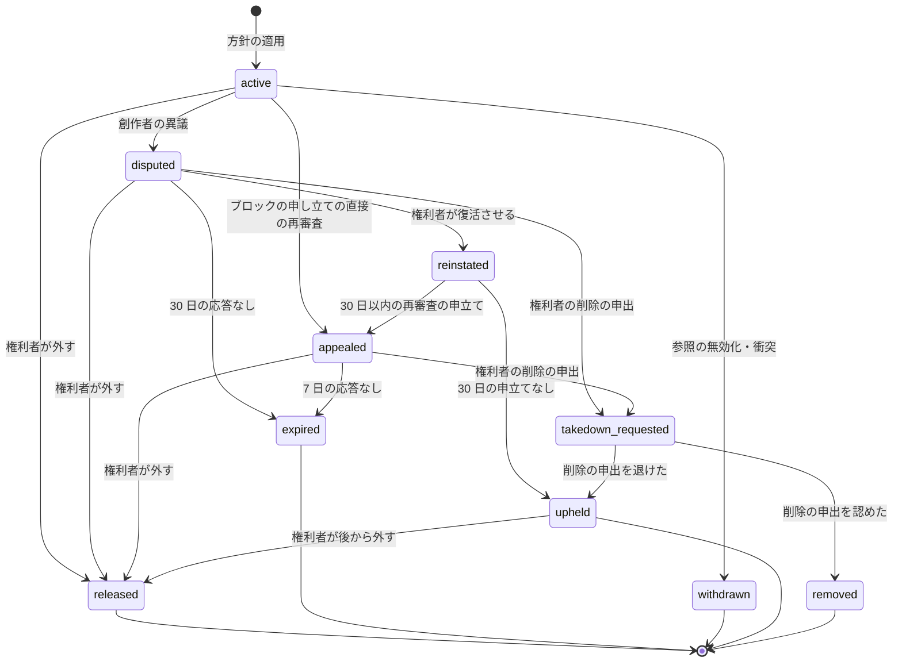

# Copyright claims and disputes: YouTube

照合の一致に権利者の方針を当ててから、申し立てが終わるまでを決める。方針の形（ブロック・収益化・追跡、地域ごと）、重なりの決定表、公開の判定と公開の後の申し立て、収益の分け方、申し立て・異議・再審査のステートマシンと期限、異議の間の収益の預かり、削除の申出と反論の通知と著作権の strike の時機（**法務の確認待ち：L1・L2**）、権利者の誤りの監視を扱う。

前提となる決定は次のとおり。

- 照合の結果が出るまで公開しない。一致ごとに参照の方針を当てる。所有の衝突の区間は追跡だけ（[ADR-0008](../decisions/0008-fingerprinting-and-match-engine.md)、[copyright-matching.md](copyright-matching.md)）
- 方針の重なりはブロック ＞ 収益化 ＞ 追跡。収益化の一致が複数あれば区間の長さで分ける。権利者は 30 日で異議に応え、応えなければ一致を外す（[architecture/README.md](README.md) の 6 節の決定）
- 見える範囲は `playable()`。創作者には権利者の表から写した通知の表で見せる（[ADR-0009](../decisions/0009-single-tenant-and-playable.md)）
- 措置は記録してから効かせ、60 秒以内に配信を止める（[ADR-0005](../decisions/0005-cdn-and-origin-strategy.md)、[cdn-and-delivery.md](cdn-and-delivery.md) の 10 節）
- 法令の判断は書かない。枠組みと問いだけ（AGENTS.md）

この文書で決めたことは次の ADR にある。

| ADR | 決定 |
| --- | --- |
| [0047](../decisions/0047-claim-policies-territory-overlap-and-per-second-split.md) | 方針は「条件（地域、一致の種類、一致の長さ・割合）→ 動作」の規則の列で、地域ごとに最初に当たった規則を使う。動画の地域ごとの結果は決定表（衝突 → 許可 → ブロック → 収益化 → 追跡）で 1 つにする。収益化の一致の分け方は、動画の 1 秒ごとに覆う権利者で等しく分ける。異議の間の分け前は預かりの勘定に入れる |
| [0048](../decisions/0048-claim-dispute-appeal-state-machine-and-deadlines.md) | 申し立ては `active → disputed → reinstated → appealed` のステートマシンで持つ。権利者の応答は異議 30 日・再審査 7 日、創作者の再審査の申立ては復活から 30 日。ブロックの申し立ては異議を飛ばして再審査に進める。期限は遷移の時刻に絶対の時刻で書き、1 分ごとの期限の作業が `SKIP LOCKED` で進める |
| [0049](../decisions/0049-takedown-cases-counter-notice-and-strikes.md) | 削除の申出は通報と別の `copyright_cases` で受け、期限・基準・通知の文は AppConfig の `legal.copyright.*` に置く（法務の確認の後に値を入れる）。反論の通知と復元は設定で切り替えられる形で作り、既定は無効。著作権の strike は削除の申出で動画を削除したときに動画ごとに 1 つ出すよう accounts-and-safety の領域に頼み、取り下げ・復元で外すよう頼む（記録と効き目はその領域） |

## 1. 範囲

- 扱う：
  - 方針の形と評価、地域
  - 申し立て（claim）の作り方とまとめ方
  - 重なりの決定表、公開の判定の答え、公開の後の申し立て
  - 収益の分け方と預かり（台帳の書き方は [monetization-and-payouts.md](monetization-and-payouts.md)）
  - 申し立て・異議・再審査のステートマシン、期限
  - 削除の申出、反論の通知、著作権の strike を出す時機の枠組み（**法務の確認待ち：L1・L2**）
  - 権利者と創作者の濫用の監視
  - 創作者と権利者への通知と画面の項目
- 扱わない：
  - 指紋と照合（[copyright-matching.md](copyright-matching.md)）
  - 動画の削除・措置の記録の仕組み（[comments-and-moderation.md](comments-and-moderation.md) の 7 節）
  - strike の記録と効き目、チャンネルの停止の実行、権利者の審査（[accounts-and-safety.md](accounts-and-safety.md)）
  - 発信者情報の開示（security の領域。**法務の確認待ち：L2・L10**）

## 2. 要件

| 要件 | 目標 | NFR・根拠 |
| --- | --- | --- |
| 公開の前の方針 | 照合の結果に方針を当ててから `publish_gate` の答えを出す。照合の後の方針の評価 p95 5 秒 | NFR-007 |
| 公開の後の効き | 遡りの一致・方針の変更・異議の結果の効果（ブロック、ブロックの解除）を 60 秒以内に配信へ反映する | NFR-014 |
| 誤った申し立て | 異議で取り消された一致 0.5% 以下（権利者ごとにも見る） | NFR-007、K7 |
| 期限 | 期限の作業の遅れ p99 5 分。期限を過ぎた申し立てを放っておかない | — |
| 収益 | 分け方の参照の実装との差 0 円 | NFR-015 |
| 秘密 | 創作者に権利者の参照・方針の中身を見せない。権利者に他の権利者の申し立てを見せない | [ADR-0009](../decisions/0009-single-tenant-and-playable.md) |

## 3. 本家の形（確かめたこと）

| 項目 | 本家 | 出典 |
| --- | --- | --- |
| 方針 | ブロック・収益化・追跡。国・地域ごとに変えられる | [How Content ID works](https://support.google.com/youtube/answer/2797370) |
| 異議 | 申し立てた側は 30 日で応える。応えなければ申し立ては期限切れで外れる。申し立てた側は外す・復活させる・削除の申出に進むを選ぶ | [Dispute a Content ID claim](https://support.google.com/youtube/answer/2797454) |
| 再審査 | 異議が退けられたら再審査を申し立てられる。申し立てた側は 7 日で応える。ブロックの申し立ては異議を飛ばして再審査に進める（7 日） | 同上 |
| 異議の濫用 | 異議は取り消せない。繰り返しの濫用は動画やチャンネルへの罰になりうる | 同上 |
| 違反の記録 | 削除した動画ごとに 1 つ。学びの課程（4 問）を済ませると 90 日で消える。90 日に 3 つでチャンネルが停止されうる。予定の削除は 7 日の間に自分で消せば記録が付かない。取り下げ・反論の通知で解ける | [Copyright strike basics](https://support.google.com/youtube/answer/2814000) |
| 反論の通知 | 申し立てた側は 10 営業日（米国）で応える。法的な措置の証拠がなければ戻す | [Submit a copyright counter notification](https://support.google.com/youtube/answer/2807684) |
| 収益化の重なりの分け方、異議の間の収益の扱い | 公式の資料で確かめられなかった（**未検証**） | — |

いずれも 2026-10-10 に確認。米国の DMCA に基づく手続きを、日本でどの形で持つかは**法務の確認待ち：L1・L2**。

## 4. 方針と適用（ADR-0047）

### 4.1 方針の形

権利者は資産（`asset`）ごとに方針を持つ。方針は規則の列で、地域ごとに上から最初に当たった規則の動作を使う。

```json
{
  "policy_id": "pol_...",
  "rules": [
    { "territories": ["JP"], "kinds": ["audio", "both"], "min_match_s": 10, "action": "monetize" },
    { "territories": ["JP"], "kinds": ["video"], "min_share": 0.5, "action": "block" },
    { "territories": "*", "action": "track" }
  ]
}
```

| 条件 | 意味 |
| --- | --- |
| `territories` | ISO の国の一覧か `*` |
| `kinds` | 一致の種類（`audio`・`video`・`both`） |
| `min_match_s` | 動画の中の一致の区間の和の下限（秒） |
| `min_share` | 動画の長さに対する一致の割合の下限 |

- どの規則にも当たらない地域は `track`。
- 権利者は、許可するチャンネルの一覧（`allowlist`）を持てる。一覧のチャンネルには申し立ての効果を当てない（記録だけ）。
- 方針の変更は、その資産の有効な申し立てを全部評価し直す。ブロックへの変更は 1 つの資産で 1 時間に 1 回まで（ブロックの付け外しの往復を防ぐ）。

### 4.2 申し立ての作り方

- 照合の一致（[copyright-matching.md](copyright-matching.md) の 8.2 節）を、`(video_id, asset_id)` ごとに 1 つの申し立てにまとめる。同じ資産の複数の参照（重複の登録、別のミックス）の一致は区間の和にする。
- 申し立ての区間 = 一致の区間の和集合。一致の種類は区間ごとに持つ。
- 衝突の区間（[copyright-matching.md](copyright-matching.md) の 9.3 節）の一致は `conflict` の印を付ける。

### 4.3 評価の時機

| きっかけ | 流れ | 効き |
| --- | --- | --- |
| アップロードの `match` の完了 | 申し立てを作り、地域ごとの結果を決め、`publish_gate` に答える | 公開の前 |
| 遡り（新しい参照）・ライブのアーカイブ | 公開の後の申し立てを作る | `claim_policy_changed` を outbox に書き、`playable()` の写しと拒否の一覧を 60 秒以内に更新 |
| 方針の変更、異議の結果、衝突の解決、参照の無効化 | 申し立ての地域ごとの結果を作り直す | 同上 |

- `publish_gate` の答え：配信する地域（S1 は `JP`）の全部で `block` なら `block`（動画の状態は `blocked`。[upload-and-ingest.md](upload-and-ingest.md) の 6.1 節）。一部の地域だけの `block` は `publish` にし、地域の制限を `playable()` の入力にする。照合の結果がなければ `hold`。
- 公開の後のブロックは、動画の状態を変えず、`playable()` の入力（地域ごとの照合の結果）で止める。

### 4.4 重なりの決定表（DT-CLM-001）

地域ごとに、動画の全部の申し立てから 1 つの結果を出す。上から最初に当たった行を使う。

| # | 条件 | 結果 |
| --- | --- | --- |
| 1 | 有効な申し立てがない | `none` |
| 2 | 申し立ての動作が `block` で、`conflict` の印がなく、チャンネルが許可の一覧にない、が 1 つ以上 | `block` |
| 3 | 2 に当たらず、動作が `monetize` で、`conflict` の印がなく、許可の一覧にない、が 1 つ以上 | `monetize`（6 節で分ける） |
| 4 | それ以外（`track`、`conflict`、許可の一覧） | `track` |

- 「有効な申し立て」は状態が 7.2 節の表で効果を持つもの。
- 子ども向けの動画など広告のない動画（`playable()` の `allow_with: no_ads`）で `monetize` の結果は、広告の収益がないので実の分配は 0（メンバー限定の動画は 6.3 節）。

## 5. 申し立ての画面と通知

- 創作者には、権利者の表から写した `claim_notices`（チャンネルの RLS）で見せる：資産の名前、権利者の公開の名前、区間、地域ごとの効果、状態、期限、取れる操作。参照の ID と方針の規則は見せない。
- 権利者には、自分の申し立てだけ（権利者の RLS）：動画の ID、区間、一致の点、異議の理由と説明。
- 通知：申し立ての作成、異議、権利者の応答、期限の 3 日前（権利者へ）、期限切れ、削除の申出の結果。プッシュとメール（[channels-subscriptions-and-notifications.md](channels-subscriptions-and-notifications.md) の 6 節の送り口を使う）。

## 6. 収益の分け方（ADR-0047）

### 6.1 規則

- 動画の収益のうち創作者の側の取り分（[monetization-and-payouts.md](monetization-and-payouts.md) の 7.2 節）を、動画の 1 秒ごとに分ける。
- 秒 `t` を覆う `monetize` の申し立ての集合を `C(t)` とする。`C(t)` が空なら、その秒の分は創作者。空でなければ `C(t)` の権利者で等しく分ける。
- 権利者 `i` の重み `w_i = Σ_t [i ∈ C(t)] / |C(t)|`、創作者の重み `w_c = |{t : C(t) = ∅}|`。`Σ w = 動画の秒の数`。
- 日ごとに、その日の有効な申し立てで重みを作る（月の途中で申し立てが外れても、その日から分け方が変わる）。
- 分配の値は整数（マイクロ円）で、端数は最大剰余で配る（[monetization-and-payouts.md](monetization-and-payouts.md) の 7.3 節）。

### 6.2 例

600 秒の動画。申し立て A（レコード会社、0〜180 秒）、B（音楽の出版社、120〜240 秒）。どちらも `monetize`。

| 秒 | `C(t)` | A | B | 創作者 |
| --- | --- | --- | --- | --- |
| 0〜120 | {A} | 120 | — | — |
| 120〜180 | {A, B} | 30 | 30 | — |
| 180〜240 | {B} | — | 60 | — |
| 240〜600 | ∅ | — | — | 360 |
| 計 | | 150 | 90 | 360 |

- 創作者の側の取り分がその日 6,790,123,395 マイクロ円なら、A ＝ 150/600 で 1,697,530,848.75、B ＝ 90/600 で 1,018,518,509.25、創作者 ＝ 360/600 で 4,074,074,037。切り捨ての和は 6,790,123,394 で、残りの 1 マイクロ円は剰余の最も大きい A に配る（A 1,697,530,849）。和は元の値と一致する。

### 6.3 預かり

- 異議・再審査・削除の申出の審査の間（7.2 節の表で「預かり」の状態）、その申し立ての権利者の分け前を `claim_escrow:{claim_id}` の勘定に入れる。
- 結末が権利者の勝ち（`upheld`・`removed`）なら権利者へ、外れ（`released`・`expired`・`withdrawn`）なら創作者へ、預かりを移す。
- メンバー限定の動画の申し立ては、MVP では収益化の分配をせず、`block` か `track` だけを当てる（メンバーシップの代金は動画ごとの収益でないため。**法務の確認待ち：L7** と合わせて S2 で決める）。

## 7. 申し立て・異議・再審査（ADR-0048）

### 7.1 ステートマシン



- `upheld` は「申し立てが残った」状態で、方針の効果を持ち続ける。創作者の側の手続きは終わっているが、権利者は後からでも外せる（`upheld → released`）。
- `removed` は動画の削除で、措置の記録（[comments-and-moderation.md](comments-and-moderation.md) の 7 節）と著作権の strike（8.3 節）を伴う。

### 7.2 状態ごとの効果（DT-CLM-002）

| 状態 | `block` の方針 | `monetize` の方針 | `track` の方針 |
| --- | --- | --- | --- |
| `active`・`upheld` | ブロック | 分配 | 記録 |
| `disputed`・`reinstated`・`appealed`・`takedown_requested` | ブロック（続ける） | 預かり（6.3 節。`reinstated` は創作者の再審査の申立ての期限まで預かる） | 記録 |
| `released`・`expired`・`withdrawn` | 効果なし | 効果なし（預かりを創作者へ） | 効果なし |
| `removed` | 動画の削除 | 預かりを権利者へ | — |

### 7.3 期限

| 遷移 | 期限 | 値の根拠 |
| --- | --- | --- |
| `disputed` の権利者の応答 | 30 日 | 本家と同じ（3 節） |
| `appealed` の権利者の応答 | 7 日 | 本家と同じ（3 節） |
| `reinstated` の後の再審査の申立て | 30 日 | 本システムの値 |
| ブロックの申し立ての直接の再審査 | 7 日 | 本家と同じ（3 節） |
| `takedown_requested` の審査 | `legal.copyright.review_days`（法務の確認の後） | **法務の確認待ち：L1** |

- 期限は遷移の時刻に `respond_by`（UTC の絶対の時刻、`遷移の時刻 + N × 24 時間`）として書く。暦日で数え、営業日で数える期限（法令の手続き）は 8 節の営業日の暦を使う。
- `claim-deadline-worker` が 1 分ごとに `respond_by <= now()` の行を `FOR UPDATE SKIP LOCKED` で 500 行ずつ取り、遷移と outbox を同じトランザクションで書く。
- 期限の 3 日前に権利者へ知らせる。

### 7.4 異議と再審査の条件

- 異議の理由：自分の作品、許諾がある、権利の切れた作品、引用などの例外（日本の著作権法の引用の扱いの判断は**法務の確認待ち：L1**）、誤った一致。理由と説明（2,000 文字まで）と、正しいことの申告を求める。
- 1 つの申し立てに異議は 1 回。取り消せない（本家と同じ）。
- 再審査の条件：チャンネルが上級の機能の段にあること（[accounts-and-safety.md](accounts-and-safety.md) の 7 節）、開いている再審査が 3 件以下（本システムの値）。条件を満たさない創作者は、削除の申出の手続き（8 節）を待つ。
- 創作者の異議の濫用：30 日に 10 件以上の異議で、90% 以上が `reinstated`・`upheld` で終わったチャンネルは、異議を 1 日 1 件に絞る（9 節）。

## 8. 削除の申出・反論の通知・strike（ADR-0049、**法務の確認待ち：L1・L2**）

この節は枠組みだけを決める。期限・基準・通知の文・手続きの有無は、法務の確認の後に AppConfig の `legal.copyright.*` に入れる。確認が済むまで、E8 の `takedown-requests` の spec を承認しない（[intent.md](../intent.md) の L1・L2）。

### 8.1 削除の申出

- 入口：権利者の画面（照合の権利者）と、誰でも使える申出の窓口（照合を使わない権利者）。どちらも `copyright_cases` に案件を作る。
- 申出の項目（案）：申出者の名前と連絡先、権利の内容、侵害とする動画と区間、侵害の理由、正しいことの申告、署名。項目の必要と文言は**法務の確認待ち：L1**。
- 案件の状態：`received → validating → reviewing → decided（removed・rejected）`、`withdrawn`。受け付けの時刻から期限（`legal.copyright.review_days`）を計算して持ち、48 時間前・24 時間前に担当へ知らせる（X の題材の法令の案件と同じ形。[trust-and-safety.md](../../../x/docs/architecture/trust-and-safety.md) の 10.1 節）。
- 審査は侵害情報調査専門員の役割を持つ担当が行う。削除の決定は措置の記録（[comments-and-moderation.md](comments-and-moderation.md) の 7 節）として書いてから効かせる（60 秒、NFR-014）。
- 申出者と発信者（創作者）への通知、運用の状況の公表の集計は、案件の表から作る。通知の文と公表の項目は**法務の確認待ち：L1**。
- 照合での自動のブロックが、削除の申出の対応とどう関わるか（自動のブロックを削除の申出の対応として数えるか）は**法務の確認待ち：L1**。

### 8.2 反論の通知と復元

- 削除された動画の創作者が反論の通知を出せる形を作る。`counter_notices` に案件を作り、`legal.copyright.counter.enabled`（既定 `false`）で窓口の有無を切り替える。
- 復元の規則（案）：申出者が `legal.copyright.counter.wait_business_days`（米国の本家は 10 営業日）の間に法的な措置の証拠を出さなければ、動画を戻し、著作権の strike を外すよう頼む。日本でこの手続きを持つか、どの形で持つかは**法務の確認待ち：L2**。
- 開示の請求に備えた記録の保持は security の領域（**法務の確認待ち：L2・L10**）。

### 8.3 違反の記録（strike）

strike の記録・数え方・効き目・アカウントの状態は [accounts-and-safety.md](accounts-and-safety.md) の 9 節（`strikes` の `kind = copyright`、`account_standing`）にある。この文書は、著作権の strike を出す・外す時機だけを決める。

| 項目 | 既定 | 根拠 |
| --- | --- | --- |
| 出す時 | 削除の申出で動画を削除したとき、動画ごとに 1 つ。照合の申し立て（ブロック・収益化・追跡）では出さない | 本家と同じ（3 節） |
| 予定の削除 | 申出者が選んだとき、7 日の間に創作者が自分で消せば出さない | 本家と同じ |
| 外す時 | 申出の取り下げ、反論の通知での復元（8.2 節） | 本家と同じ |

- 失効（研修と 90 日）、数え方、効き目、3 つの扱いは [accounts-and-safety.md](accounts-and-safety.md) の 9 節だけに書く（ADR-0061）。この文書には重ねて書かない。

- 削除の決定のトランザクションで outbox に `copyright_strike_requested`（`video_id`、`case_id`、予定の削除か）を書き、accounts-and-safety の領域が `strikes` に書く。取り下げ・復元は `copyright_strike_retracted` を書く。
- 繰り返しの侵害の措置の基準をどう定め公表するかは**法務の確認待ち：L1**。

## 9. 濫用の監視

| 対象 | 指標（30 日） | しきい値 | 対応 |
| --- | --- | --- | --- |
| 権利者 | 取り消しの割合 =（異議・再審査の後に `released`・`expired` で終わった申し立て）÷ 申し立て | 2% 以上 | 運用の審査 |
| 権利者 | 同上 | 5% 以上 | 自動のブロックを止め、`track` に下げる（審査まで） |
| 権利者 | 異議に応えない割合（`expired` ÷ 異議） | 異議 50 件以上で 50% 以上 | 運用の審査 |
| 創作者 | 異議の数と退けられた割合 | 10 件以上で 90% 以上 | 異議を 1 日 1 件 |
| 全体 | 異議で取り消された一致 | 0.5% 以上（K7） | 照合と方針のリリースを止める（[quality.md](../quality.md) の 4.1 節） |

- 指標は毎日、申し立ての表から作る。権利者の誤りの繰り返しへの措置の基準は**法務の確認待ち：L2**。
- 取り消しの理由の内訳（誤った一致、許諾、例外）を照合の改善（`fp-bench` の否の集まり）に返す。

## 10. 失敗と回復

| 失敗 | 起きること | 回復 |
| --- | --- | --- |
| 方針の評価の失敗 | `publish_gate` の答えがない | `hold`。作業をやり直す。時間で公開に倒さない |
| 期限の作業の停止 | 期限を過ぎた申し立てが残る | 再起動で `respond_by <= now()` を全部取る。遅れが 5 分を超えたら Ops |
| outbox の遅れ | 公開の後のブロックが遅れる | 遅れの監視（60 秒）。拒否の一覧（[cdn-and-delivery.md](cdn-and-delivery.md) の 10 節）は同じ outbox を使うので、relay の遅れは SEV2 |
| 預かりの移しの失敗 | 結末の後も預かりに残る | 結末の行から冪等に移し直す（鍵は `claim_id` と結末） |
| 権利者の大量の方針の変更 | 評価の作業が溜まる | 資産ごとの 1 時間の上限、作業の優先度を下げる |

## 11. 上限

| 対象 | 値 |
| --- | --- |
| 方針の規則 | 1 つの方針に 50 |
| 許可の一覧 | 1 つの権利者に 1 万チャンネル |
| 1 つの動画の申し立て | 100（超えたら区間の長い順） |
| 異議の説明 | 2,000 文字 |
| 開いている再審査 | チャンネルに 3 |
| ブロックへの方針の変更 | 資産ごとに 1 時間に 1 回 |

## 12. data-model への項目

列・キー・索引の正本は [data-model.md](data-model.md) と [data-model/](data-model/) の各ファイルである。この節は提案の記録として残す（2026-10-10 のデータモデルの工程）。

| 表・置き場 | 中身 | 主キー・索引 | 節 |
| --- | --- | --- | --- |
| `assets`（権利者の表、FORCE RLS） | `asset_id`、`rights_owner_id`、`type`、`title`、`policy_id` | `(asset_id)` | 4.1 |
| `claim_policies`（権利者の表） | `policy_id`、`rights_owner_id`、`rules`（JSON）、`version`、`updated_at` | `(policy_id, version)` | 4.1 |
| `owner_allowlists`（権利者の表） | `rights_owner_id`、`channel_id` | `(rights_owner_id, channel_id)` | 4.1 |
| `claims`（権利者の表） | `claim_id`、`video_id`、`asset_id`、`rights_owner_id`、`segments`（JSON）、`state`、`respond_by`、`conflict`、`source`、`created_at` | `(claim_id)`。`(video_id)`。部分索引 `(respond_by) WHERE state IN ('disputed','appealed','reinstated')` | 4.2、7 |
| `claim_effects` | `video_id`、`territory`、`result`（`none`・`track`・`monetize`・`block`）、`computed_at`、`claims_version` | `(video_id, territory)` | 4.4 |
| `claim_transitions`（追記だけ） | `claim_id`、`from_state`、`to_state`、`actor_kind`（`creator`・`owner`・`system`・`staff`）、`reason_code`、`at` | `(claim_id, at)` | 7.1 |
| `claim_disputes` | `claim_id`、`kind`（`dispute`・`appeal`）、`reason`、`statement`、`filed_by`、`filed_at` | `(claim_id, kind)` | 7.4 |
| `claim_notices`（チャンネルの表） | 5 節の写し | `(channel_id, video_id, claim_id)` | 5 |
| `revenue_split_daily` | `video_id`、`day`、`party`（`creator`・`owner:{id}`・`escrow:{claim_id}`）、`weight_units`（1 秒 ＝ 27,720 単位の整数） | `(video_id, day, party)` | 6 |
| `copyright_cases` | `case_id`、`intake`（`owner_portal`・`public_form`）、`video_id`、`requester_enc`（暗号化）、`state`、`received_at`、`due_at`、`decided_at`、`decision` | `(case_id)`。`(state, due_at)` | 8 |
| `counter_notices` | 反論の通知（ADR-0049。既定で無効）：`counter_id`、`case_id`、`statement_enc`、`state`、`wait_until` | `(counter_id)`。一意 `(case_id)` | 8.2 |
| AppConfig | `legal.copyright.*`（期限、通知の文、反論の通知の有効と待ち） | — | 8 |
| outbox | `claim_created`、`claim_policy_changed`、`claim_resolved`、`copyright_strike_requested`、`copyright_strike_retracted` | — | 4.3、8.3 |

## 13. テストと性質

| ID | 性質・試験 |
| --- | --- |
| PROP-CLM-001 | 任意の申し立ての集合で、DT-CLM-001 の結果は申し立ての順序によらない |
| PROP-CLM-002 | 任意の区間の集合で、6.1 節の重みの和は動画の秒の数に等しく、分配の和は分ける前の値にマイクロ円まで一致する |
| PROP-CLM-003 | 任意の操作と時刻の列で、申し立ての状態の遷移は 7.1 節の図の矢印だけ。`released`・`expired`・`withdrawn`・`removed` から出ない |
| PROP-CLM-004 | 任意の時刻の列で、`disputed` の申し立ては 30 日 ＋ 5 分の後に `disputed` のまま残らない。`appealed` は 7 日 ＋ 5 分 |
| PROP-CLM-005 | 任意の列で、預かりに入った金額は、終わりの後にちょうど 1 回だけ権利者か創作者に移る（二重の移しと残りがない） |
| PROP-CLM-006 | 任意の削除・予定の削除・取り下げ・復元の列で、`copyright_strike_requested` は削除された動画ごとにちょうど 1 回、予定の削除で 7 日の間に創作者が消した動画には 0 回。取り下げ・復元には `copyright_strike_retracted` がちょうど 1 回 |
| DT-CLM-001 | 重なりの決定表（4.4 節）の全行 |
| DT-CLM-002 | 状態ごとの効果（7.2 節）の全行 |
| DT-CLM-003 | `publish_gate` の答え：地域ごとの結果 × 配信する地域 × 照合の結果の有無 |
| 表駆動 | 6.2 節の例を試験のベクトルにする（[monetization-and-payouts.md](monetization-and-payouts.md) の参照の実装と同じ値） |
| E2E | 創作者の異議 → 権利者の応答なし → 30 日で外れ、預かりが創作者へ移る（時計を進める） |

## 14. Story の候補

| Epic | Story | 中身 |
| --- | --- | --- |
| E8 | `match-policies` | 4 節（ADR-0047、DT-CLM-001・003、PROP-CLM-001） |
| E8 | `claims-and-disputes` | 5・7 節（ADR-0048、DT-CLM-002、PROP-CLM-003・004）。手続きの文言は**法務の確認待ち：L2** |
| E8 | `claim-revenue-split` | 6 節（PROP-CLM-002・005）。E14 の `revenue-ledger` と合わせる |
| E8 | `takedown-requests` | 8.1 節（ADR-0049）。**法務の確認待ち：L1** |
| E8 | `counter-notices-and-strikes` | 8.2・8.3 節（PROP-CLM-006）。**法務の確認待ち：L1・L2** |
| E8 | `rights-abuse-monitoring` | 9 節 |

## 15. 未解決の問い

### 決定（2026-10-10、既定案）

- **方針の形**：地域ごとの規則の列、既定は `track`（ADR-0047）。
- **重なり**：衝突 → 許可 → ブロック → 収益化 → 追跡（ADR-0047）。
- **分け方**：1 秒ごとに覆う権利者で等しく分ける。異議の間は預かり（ADR-0047）。
- **期限**：異議 30 日・再審査 7 日（本家と同じ）、再審査の申立て 30 日（ADR-0048）。
- **著作権の strike**：出す・外す時機だけをこの領域で決め、記録と効き目は accounts-and-safety の領域（ADR-0049）。

### 持ち越し

| 問い | いつ・どう決めるか |
| --- | --- |
| 削除の申出の受け付け・審査の期限・通知・公表、照合の自動のブロックとの関係 | **法務の確認待ち：L1** |
| 反論の通知と復元を持つか、その形。権利者の誤りの繰り返しへの措置 | **法務の確認待ち：L2** |
| 引用などの例外の異議の扱い | **法務の確認待ち：L1** |
| メンバー限定の動画の申し立ての収益 | **法務の確認待ち：L7** と S2 |
| 照合を使わない権利者の申出の窓口の本人の確かめ | accounts-and-safety の領域 |

## 出典

いずれも 2026-10-10 に確認。

- YouTube Help, [How Content ID works](https://support.google.com/youtube/answer/2797370)
- YouTube Help, [Dispute a Content ID claim](https://support.google.com/youtube/answer/2797454)
- YouTube Help, [Copyright strike basics](https://support.google.com/youtube/answer/2814000)
- YouTube Help, [Submit a copyright counter notification](https://support.google.com/youtube/answer/2807684)
