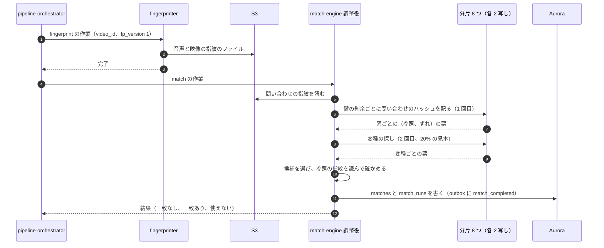
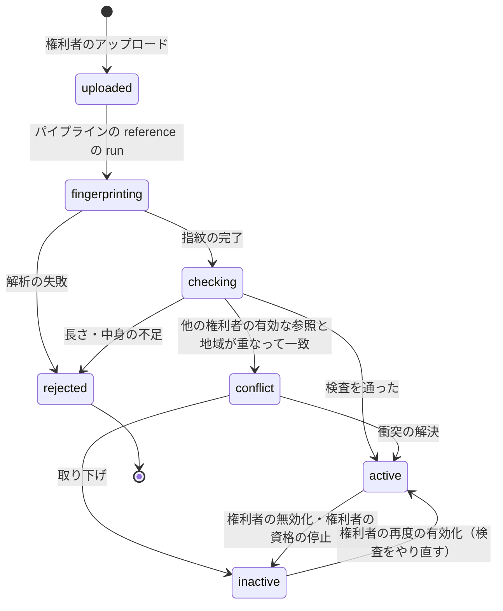

# Copyright matching: YouTube

著作権の照合のエンジンを決める。音声と映像の指紋（`fp_version` 1）の母数とハッシュの形、参照の索引の形とメモリー、時刻のずれの投票と確かめの段、ピッチ・速さ・切り抜き・重ねへの強さ、権利者からの参照の取り込みと所有の衝突、新しい参照の遡り、公開の判定との関係（照合が終わるまで公開しない）、ライブの照合のエンジンの側、歪めた参照での評価を扱う。一致に方針を当てて申し立てにするところは [copyright-claims-and-disputes.md](copyright-claims-and-disputes.md) にある。

前提となる決定は次のとおり。

- 指紋は自前。音声は対数周波数の山の組のハッシュ（1 秒あたり約 10 の山、約 30 のハッシュ）、映像は 1 秒 2 枚のフレームの 64 ビットの知覚ハッシュ。転置の索引と時刻のずれの投票で照合する。照合の結果が出るまで公開しない。時間で公開に倒さない（[ADR-0008](../decisions/0008-fingerprinting-and-match-engine.md)）
- 本家の指紋の方式・データ・判定の結果を使わない。テストに実在の作品を使わない（[リポジトリ共通の ADR-0007](../../../../docs/decisions/0007-no-reuse-of-original-implementation.md)、AGENTS.md）
- パイプラインの `fingerprint` と `match` は急ぎの段で、`publish_gate` が `match` の結果を待つ（[transcoding-pipeline.md](transcoding-pipeline.md) の 3 節、[upload-and-ingest.md](upload-and-ingest.md) の 6.1 節）
- ライブは 30 秒の窓で照合し、ブロックが 2 つの窓で続いたら差し替える（[live-streaming.md](live-streaming.md) の 8 節）
- `fp_version` はコードのバージョンとして出し、フラグで切り替えない（AGENTS.md）

この文書で決めたことは次の ADR にある。

| ADR | 決定 |
| --- | --- |
| [0043](../decisions/0043-fingerprint-v1-hash-formats.md) | `fp_version` 1 の音声のハッシュは、400〜5,000 Hz の 1/4 半音の帯で、（錨の帯 8 ビット、帯の差 7 ビット、時刻の差 6 ビット）を 32 ビットの語の上位 21 ビットに詰める（下位 11 ビットは 0 で予約）。問い合わせの側は山を 1.5 倍に取る。映像は黒い縁を切った 32×32 の濃淡の DCT から 64 ビットを作り、情報の少ないフレームを捨て、参照は続く似たフレームを 1 つにまとめる |
| [0044](../decisions/0044-reference-index-shards-and-generations.md) | 参照の索引は、ハッシュの鍵の剰余で 8 つの分片に分け、各分片を 2 つの AZ に写す。音声は鍵で直接引く表と 8 バイトの項目の列、映像は 16 ビットの 4 つのブロックの表。正本は S3 の世代の写しで、追加は差分の索引に入れて 6 時間ごとにまとめる。全分片の答えがそろわない照合は結果を出さない |
| [0045](../decisions/0045-offset-voting-verification-and-distortion-variants.md) | 投票は 10 秒の窓（5 秒ずらし）で、（参照、時刻のずれ）の組の票を数え、音声 12 票・映像 6 票を超えた組を確かめる。確かめは 1 秒ごとの一致の割合で区間を作り、10 秒以上かつ平均の割合が音声 0.07・映像 0.6 以上なら一致にする。ピッチ・速さの歪みは、問い合わせのハッシュの 20% で 22 の変種を引く 2 回目の探しで受ける |
| [0046](../decisions/0046-reference-ingestion-ownership-conflicts-and-backscan.md) | 参照は同じパイプラインで指紋を作り、長さと中身の検査、他の参照との重なりの検査（所有の衝突は地域が重なるときだけ）、汎用の素材との重なりの除外を経て有効にする。新しい参照の遡りは 1 時間ごとにまとめ、公開から 90 日の動画と、30 日の確定の視聴が 1 万以上の動画に当てる |

## 1. 範囲

- 扱う：
  - 音声と映像の指紋の作り方、`fp_version`
  - 参照の索引（形、分片、写し、世代、メモリー）
  - 照合の流れ（投票、確かめ、変種の探し）と一致の区間
  - 歪み（再符号化、切り出し、音量、雑音と声の重ね、ピッチ・速さ、拡大・切り抜き・黒い縁・反転・文字の重ね）への強さ
  - 参照の取り込み、検査、所有の衝突、除外、有効と無効
  - 新しい参照の遡り
  - 公開の判定と照合の関係、照合の停止
  - ライブの照合のエンジンの側（窓の照合と、ライブの照合の対象の索引）
  - 歪めた参照の集まり（`fp-bench`）
- 扱わない：
  - 方針（ブロック・収益化・追跡）、重なりの決定表、申し立て・異議・削除の申出（[copyright-claims-and-disputes.md](copyright-claims-and-disputes.md)）
  - ライブの差し替えの画面と配信の側（[live-streaming.md](live-streaming.md) の 8 節）
  - 既知の違法なメディアのハッシュの照合（[upload-and-ingest.md](upload-and-ingest.md) の 5.3 節。別の口）
  - 権利者の審査（accounts-and-safety の領域）
  - `fp_version` の更新の順序（delivery の領域）

## 2. 要件

| 要件 | 目標 | NFR・根拠 |
| --- | --- | --- |
| VOD の照合の時間 | 1 時間以下の動画で、アップロードの完了から照合の結果まで p95 5 分。12 時間の動画で p95 30 分。10 分の動画の `fingerprint` → `match` は p50 30 秒（[transcoding-pipeline.md](transcoding-pipeline.md) の 11 節） | NFR-007、K8 |
| ライブ | 一致の始まりから検出まで p95 90 秒 | NFR-007 |
| 再現率 | 歪めた参照（10 秒以上の切り出し）で 95% 以上（`fp_version` 1 の対象の歪みで） | NFR-007、K7 |
| 誤った一致 | 否の集まりで 0.1% 以下。本番で異議で取り消された一致 0.5% 以下 | [ADR-0008](../decisions/0008-fingerprinting-and-match-engine.md)、K7 |
| 区間の精度 | 一致の区間の端の誤差 1 秒以内 | [quality.md](../quality.md) の 2.2.1 節 D |
| 公開 | 照合の結果がない動画を公開しない。照合が止まっても時間で公開に倒さない | [ADR-0008](../decisions/0008-fingerprinting-and-match-engine.md) |
| 参照の秘密 | 権利者の参照と方針を、他の権利者と創作者に見せない | [ADR-0009](../decisions/0009-single-tenant-and-playable.md)、**法務の確認待ち：L8** |

## 3. 本家の形（確かめたこと）

| 項目 | 本家 | 出典 |
| --- | --- | --- |
| 走査 | アップロードした動画を自動で走査し、権利者が出した音声・映像のファイルのデータベースと比べる | [How Content ID works](https://support.google.com/youtube/answer/2797370) |
| 方針 | ブロック・収益化・追跡。国・地域ごとに変えられる | 同上 |
| 権利者 | 審査で承認され、頻繁に上がる素材の独占的な権利を持つ必要がある。誤った申し立てを繰り返すと使えなくなる | 同上 |
| 指紋の方式、参照の規模、照合の後に公開するか、ライブの照合の方式 | 公開されていない（**未検証**） | — |

いずれも 2026-10-10 に確認。方式は公開の論文の考え方（山の組のハッシュ、知覚ハッシュ、複数の索引のハッシュ）に基づく自前の設計で、本家の内部の形式を写していない。

## 4. 全体の流れ



- `match` の結果は 3 つ：`no_match`、`matched`（一致の一覧）、`unavailable`（分片がそろわない、時間切れ）。`unavailable` は作業の失敗として、やり直しの規則（[transcoding-pipeline.md](transcoding-pipeline.md) の 3.3 節）で再び回す。
- 一致に方針を当てて `publish_gate` の答え（`publish`・`block`・`hold`）を出すのは [copyright-claims-and-disputes.md](copyright-claims-and-disputes.md) の 4 節。
- 限定公開・非公開の動画も照合する（ADR-0008）。

## 5. 音声の指紋（`fp_version` 1、ADR-0043）

### 5.1 手順

1. 音声を単一のチャンネル・11,025 Hz に直す（ADR-0008）。
2. 短時間フーリエ変換：Hann の窓 1,024（92.9 ms）、ずらし 256（23.2 ms、1 秒 43.07 の時刻の枠）。
3. 帯：400〜5,000 Hz を 1/4 半音（1 オクターブ 48 の帯）に分ける。`band(f) = floor(48 · log2(f / 400))`、0〜174 の 175 の帯。山の周波数は隣の 2 つのビンとの放物線の当てはめで細かく求めてから帯にする（400 Hz の 1/4 半音は約 5.8 Hz、ビンの幅は 10.8 Hz のため）。
4. 山：対数の振幅で、時刻 ±7 枠（±163 ms）・帯 ±6 の近傍の最大で、近傍の平均より 6 dB 以上大きい点。1 秒ごとに大きい順に選び、参照は 1 秒 10 個、問い合わせは 1 秒 15 個にする（問い合わせの側の山を多くとり、雑音で参照の山が埋もれても組が残るようにする）。
5. 組：各山（錨）に、後ろの範囲（時刻の差 4〜64 枠 ＝ 0.09〜1.49 秒、帯の差 ±48 ＝ ±1 オクターブ）の山から、時刻の近い順に 3 つを選ぶ。参照は 1 秒約 30、問い合わせは約 45 のハッシュになる。
6. ハッシュ（32 ビットの語）：

```
 31        24 23       17 16      11 10          0
 ┌──────────┬──────────┬──────────┬─────────────┐
 │ b_a (8)  │ Δb+48 (7)│ Δt−4 (6) │ 0（予約 11） │
 └──────────┴──────────┴──────────┴─────────────┘
 b_a：錨の帯（0〜174）  Δb：相手の帯 − 錨の帯（−48〜48）  Δt：時刻の差（4〜64 枠）
 値として、錨の時刻（枠の番号、u32）を持つ
```

- 鍵の実の情報は上位 21 ビット（使う鍵の数 175 × 97 × 61 ≒ 104 万）。下位 11 ビットは `fp_version` 2 の細かい情報のために 0 で予約する。ADR-0008 の「32 ビットのハッシュ」は語の大きさで、実の情報は 21 ビットである。
- 帯の差を使うのは、ピッチの変化（対数の周波数の平行移動）で帯の差が変わらないためである。錨の帯だけがずれる（8 節）。

### 5.2 量

- 参照 1 時間：3,600 × 30 ≒ 10.8 万ハッシュ。S1 の参照 10 万時間で約 108 億（ADR-0008 の見込みと同じ）。
- 1 つの鍵の項目の数の平均：108 億 ÷ 104 万 ≒ 1 万。多すぎる鍵（20 万を超える。持続する音、決まった音）は止めの鍵の一覧に入れ、問い合わせで引かない。

## 6. 映像の指紋（`fp_version` 1、ADR-0043）

### 6.1 手順

1. 1 秒 2 枚のフレームを抜く（ADR-0008）。
2. 黒い縁：動画の 10 か所の見本のフレームで、行・列の平均の明るさが 16 未満の割合が 98% 以上の端の行・列を切る。縁の幅は動画で 1 つに決める。
3. 32×32 の濃淡に縮め（面積の平均）、2 次元の DCT をかける。
4. 低い 8×8 の 64 個の係数を、直流を除く 63 個の中央値と比べ、大きければ 1 にする（64 ビット）。
5. 情報の少ないフレーム（32×32 の濃淡の標準偏差が 4 未満：黒、白、単色）はハッシュを作らない（黒い画面どうしの誤った一致を防ぐ）。
6. 参照の側は、続くフレームでハミング距離 4 以下のものを 1 つにまとめ（区間の始まりと終わりの時刻を持つ）、索引の項目を減らす。止まった画面の多い動画で 3〜5 分の 1 になる。
7. 問い合わせの側は、左右の反転のハッシュも作る（DCT の奇数の列の符号を反転すれば作れる）。索引は反転を持たない。

### 6.2 量

- 参照 10 万時間 × 1 秒 2 枚 ＝ 7.2 億フレーム（ADR-0008 の 7 億と同じ）。まとめの後を 1.8 億と見込む。
- ハミング距離の目安：同じ場面の再符号化で 2〜6、10% の切り抜き・文字の重ねで 6〜10、関係のないフレームで平均 32（標準偏差 約 4）。

## 7. 索引（ADR-0044）

### 7.1 形

| 部分 | 形 | S1 の大きさ（写し 1 つ） |
| --- | --- | --- |
| 音声の鍵の表 | 21 ビットの鍵で直接引く配列（項目の列の始まりの位置、8 バイト × 2^21） | 16 MB |
| 音声の項目 | `(ref_seq: u32, t_anchor: u32)` の 8 バイト。鍵ごとに `ref_seq` の順 | 約 86 GB |
| 映像のブロックの表 | 64 ビットを 16 ビットの 4 つに分け、ブロックごとに 2^16 の表 | 4 × 0.5 MB |
| 映像の項目 | `(ref_seq: u32, frame_no: u32)` の 8 バイト × 4 つのブロック | 1.8 億 × 32 B ≒ 5.8 GB |
| 映像の全体のハッシュ | 参照ごとのフレームの 64 ビットの列（確かめに使う） | 約 1.4 GB |
| 参照の表 | `ref_seq` → `reference_id`、`fp_version`、長さ、有効の印 | 数十 MB |

- ADR-0008 の映像の見込み（約 25 GB）は、まとめの前の上限である。

### 7.2 分片と写し

- 音声の鍵、映像のブロックの値の剰余（`key mod 8`）で 8 つの分片に分ける。1 つの分片は音声 約 11 GB ＋ 映像 約 1 GB。
- 各分片を 2 つの AZ に置く（ADR-0008）。8 つは論理の分片で、S1 は `r7g.8xlarge`（256 GiB）1 台に 4 つの分片を載せ、2 台 × 2 つの AZ ＋ 予備 1 にする（[capacity.md](capacity.md) の 4 節、[ADR-0044](../decisions/0044-reference-index-shards-and-generations.md) の注記）。参照が増えたら 1 台あたりの分片を減らして台数を増やす（S2 で 1 台 1 分片）。
- 調整役（`match-engine` のタスク）が、問い合わせのハッシュを分片ごとに分けて配り、票を集める。

### 7.3 世代と追加

- 正本は S3：参照ごとの指紋のファイル（`fp/ref/{reference_id}/v1.fpa`・`.fpv`）と、分片ごとの世代の写し（`index/v1/{shard}/{generation}/`）。
- 参照が有効になると、outbox の `reference_activated` を受けて、各分片が差分の索引（メモリーの小さな表）に足す。問い合わせは本体と差分の両方を引く。
- 6 時間ごとに、本体と差分をまとめた新しい世代を作り S3 に置き、分片を 1 つずつ入れ替える（もう 1 つの AZ の写しが答える間に）。
- 無効にした参照は墓石の集合に入れ、票から除く。次の世代で消す。
- 起動のとき：最新の世代を読み、その世代の後の `reference_activated`・`reference_deactivated` を Aurora から読み直す。

### 7.4 S2 の見込み

- 参照 200 万時間で、音声の項目は約 1.7 TB、鍵あたり平均 20 万になり、問い合わせの費用が 20 倍になる。S2 の前に、予約の 11 ビットを使う細かい鍵（相手の 2 つ目の山の帯など）を `fp_version` 2 として足すかを `fingerprint-poc` の続きで決める（16 節）。

## 8. 照合（ADR-0045）

### 8.1 投票（1 回目）

1. 問い合わせのハッシュを 10 秒の窓（5 秒ずらし）に分ける。
2. 各ハッシュで鍵を引き、項目ごとに `δ = t_ref − t_query`（枠）を作り、`(ref_seq, floor(δ / 8))` の票を 1 つ足す（8 枠 ＝ 186 ms の箱）。
3. 窓ごとに、隣の ±2 の箱の票を合わせた値が **12 票以上**の `(ref_seq, δ)` を候補にする。速さ ±5% のずれ（10 秒で最大 0.5 秒）は ±2 の箱で受ける。
4. 映像も同じに、フレームのハッシュのブロックの値で引き（各ブロックで半径 2 までのビットの違い：1 ＋ 16 ＋ 120 ＝ 137 回 × 4 ブロック）、`δ`（フレーム）の箱で数え、**6 票以上**を候補にする。各ブロックで半径 2 まで引くので、ハミング距離 11 以下のフレームの組を必ず拾う（ADR-0008 の「8 以下を漏らさない」を満たす）。問い合わせのフレームも、続く似たフレームを 1 つにまとめてから引く。

### 8.2 確かめ

1. 候補ごとに、参照の指紋のファイルを読み、`t_ref = a · t_query + c` を当てはめる（票の入ったハッシュの組の最小二乗。`a` は 0.95〜1.05 に限る）。
2. 音声：1 秒ごとに、問い合わせのハッシュのうち、当てはめた位置の ±3 枠に同じ鍵の参照のハッシュがあるものの割合 `s_i` を出す。`s_i ≥ 0.04` の秒を正にする。
3. 映像：0.5 秒ごとに、当てはめた位置の参照のフレームとのハミング距離が 10 以下なら正にする。
4. 正の秒の続き（2 秒以下の欠けは埋める）を区間にし、**10 秒以上**で、平均の `s_i` が音声 **0.07 以上**、映像の正の割合 **0.6 以上**の区間を一致にする。
5. 一致：`(reference_id, q_start, q_end, r_start, r_end, kind, score, a, fp_version)`。`kind` は `audio`・`video`・`both`（音声と映像の区間が 50% 以上重なるとき）。

- 値はどれも `fp-bench` で決める初期の値で、`fp_version` に結び付ける。

### 8.3 例：雑音と声を重ねた歌

4 分のゲームの実況。0:30〜1:10 に、参照 R（3 分 30 秒の歌）の 1:00〜1:40 が流れ、実況の声（S/N 5 dB）が重なり、AAC 96 kbps で符号化し直されている。

| 窓（問い合わせの秒） | R・δ ＝ ＋30.0 秒の票 | 2 番目の組の票 |
| --- | --- | --- |
| 25〜35 | 21 | 2 |
| 30〜40 | 44 | 3 |
| 35〜45 | 41 | 2 |
| 40〜50 | 47 | 3 |
| 45〜55 | 39 | 2 |
| 50〜60 | 52 | 3 |
| 55〜65 | 45 | 2 |
| 60〜70 | 38 | 3 |
| 65〜75 | 20 | 2 |
| 70〜80 | 2 | 2 |

- 問い合わせの 1 つの窓は約 450 のハッシュで、雑音の中で残る組は 8〜12%。偶然の組は 3 票を超えない。
- 確かめ：`a = 1.000`、`c = +30.0 秒`。30〜69 秒の `s_i` の平均 0.10（最小 0.05）、他の秒は 0.002。一致は「問い合わせ 30.0〜70.0 秒 ↔ 参照 60.0〜100.0 秒、`audio`、点 0.10」。

### 8.4 変種の探し（2 回目）

ピッチと速さを変えた動画では、錨の帯と時刻の差がずれ、1 回目の鍵が当たらない。

| 歪み | 問い合わせと参照の関係 | 変種 |
| --- | --- | --- |
| 再生の速さを変える（ピッチと速さが一緒に変わる。速めた歌、遅めた歌） | 帯が `k = round(48 · log2 s)` ずれ、時刻の差が `1/s` 倍 | `s` ＝ 0.95、0.96、0.97、0.98、0.99、1.01、1.02、1.03、1.04、1.05（10） |
| ピッチだけ（キーの変更） | 帯が `k` ずれる | `k` ＝ ±1〜±4（8） |
| 速さだけ（時間の伸び縮み） | 時刻の差が `1/s_t` 倍 | `s_t` ＝ 0.95、0.97、1.03、1.05（4） |

- 問い合わせのハッシュの 20% の見本で、22 の変種に直した鍵を引く（`b_a − k`、`round(Δt · s)`）。1 回目の約 4.4 倍の費用。
- 見本で 6 票以上の窓が出た変種は、その窓の ±20 秒の全部のハッシュで引き直し、8.2 節で確かめる（当てはめの `a` は変種の `s` の周り ±0.01）。
- ±5% を超えるピッチ・速さは `fp_version` 1 では受けない（[ADR-0008](../decisions/0008-fingerprinting-and-match-engine.md)）。

**例**：同じ歌を 1.04 倍の速さで流した動画。帯のずれは `48 · log2 1.04 = 2.72` で `k = 3`。1 回目は 4 票以下。2 回目の見本で `s = 1.04` の変種が 9 票、引き直しで 37 票、確かめで `a = 1.040`、平均の `s_i` 0.09 で一致になる。

### 8.5 歪みへの強さ（`fp_version` 1 の見込み）

| 歪み | 強さの仕組み | 見込み |
| --- | --- | --- |
| 再符号化（低いビットレート） | 強い山は残る | 受ける |
| 音量の変化 | 山は相対の振幅で選ぶ | 受ける |
| 雑音・声の重ね（S/N 0 dB まで） | 問い合わせの山を 1.5 倍に取る。8% の組で票が立つ | 5 dB 以上で受ける。0 dB は `fp-bench` で測る |
| ピッチ・速さ ±5% | 8.4 節の変種 | 受ける |
| 切り出し（10 秒以上） | 窓 10 秒、区間 10 秒以上 | 受ける。10 秒未満は出さない（ADR-0008） |
| 拡大・切り抜き 10% | 黒い縁の切り、低い周波数の DCT | 受ける |
| 切り抜き 20% | DCT の構図が変わる | 部分に受ける（`fp-bench` で別に数える） |
| 黒い縁・レターボックス | 6.1 節の 2 | 受ける |
| 左右の反転 | 問い合わせの反転のハッシュ | 受ける |
| 明るさ・コントラスト | 中央値との比べ | 受ける |
| 小さな文字・ロゴの重ね | 距離 6〜10 で半径 2 の引きと 10 の確かめ | 受ける。画面の 20% を超える重ねは部分に受ける |
| 画面の中の画面、大きな加工 | 構図が変わる | 受けない（`fp_version` 2、ADR-0008） |

## 9. 参照の取り込み（ADR-0046）

### 9.1 状態



### 9.2 検査

| 検査 | 規則 | 落ちたとき |
| --- | --- | --- |
| 長さ | 無音でない音声か、情報のある映像が 30 秒以上。1 ファイル 6 時間まで | `rejected` |
| 汎用の素材 | 試験のパターン、無音、決まった音、本システムが持つ汎用の素材の集まり（許諾の確かな公開の素材）との一致の区間を「除外の区間」にする | 区間を除いて続ける。全体の 80% 以上なら `rejected` |
| 同じ権利者の重複 | 同じ権利者の有効な参照と一致 | 警告を出して続ける（重複の申し立ては [copyright-claims-and-disputes.md](copyright-claims-and-disputes.md) の 5 節で 1 つにまとめる） |
| 所有の衝突 | 他の権利者の有効な参照と一致し、権利の地域が重なる | `conflict`。地域が重ならなければ衝突にしない（地域ごとの権利者） |

- 参照の取り込みは、動画と同じアップロードのセッションとパイプラインを使う（run の種類 `reference`。`probe` → `fingerprint` だけで、符号化も公開もしない）。
- 権利者は参照ごとに、資産の種類（録音、楽曲、映像、放送）、地域ごとの権利、照合の種類（音声・映像・両方）、ライブの照合の対象にするか、除外の区間を決める。
- 参照のファイルと指紋は、照合のほかに使わない（**法務の確認待ち：L8**）。

### 9.3 所有の衝突

- 衝突の区間に当たる一致は、解決まで追跡だけにする（ブロックを効かせない。ADR-0008）。
- 両方の権利者に、衝突の区間と相手の名前（権利者の公開の名前だけ）を知らせる。30 日で解決しなければ運用の担当が仲立ちする。
- 解決の形：片方の取り下げ、地域で分ける、区間を除外にする。

### 9.4 新しい参照の遡り

- 1 時間ごとに、その時間に有効になった参照で小さな索引を作り、対象の動画の指紋を S3 から流して照合する（ADR-0008 の「公開から 90 日の動画と、視聴の多い動画」）。
- 対象：公開から 90 日以内の動画と、30 日の確定の視聴が 1 万以上の動画（[view-counting-and-analytics.md](view-counting-and-analytics.md) の 5.2 節）。
- 費用の見込み（S1）：90 日のアップロード 約 13 万時間の指紋 約 140 億ハッシュを、小さな索引に対して流す。1 コアで 1 秒 5,000 万の引きとして約 280 コア秒。1 時間に 1 回でも小さい。
- 遡りで見つけた一致は、公開の後の申し立てとして方針を当てる（[copyright-claims-and-disputes.md](copyright-claims-and-disputes.md) の 4.3 節）。ブロックは `playable()` を通して 60 秒以内に効く（NFR-014）。
- 全部の動画への遡りは S2 で検討する（ADR-0008）。

## 10. 公開の判定との関係

- `publish_gate` は `match` の結果がない動画を公開にしない（PROP-PIPE-003、[transcoding-pipeline.md](transcoding-pipeline.md) の 16 節）。予約の公開の時刻を過ぎても待つ（[upload-and-ingest.md](upload-and-ingest.md) の 6.2 節）。
- `match-engine` が `unavailable` を返す間、動画は「照合待ち」のまま溜まる。待ちが 30 分を超えたら Ops を呼ぶ（ADR-0008）。
- **部分の結果で公開しない**：8 つの分片のどれかが答えない照合は、結果を出さない（`unavailable`）。分片が欠けたまま「一致なし」にすると、その分片の参照の一致を見逃して公開する。
- 1 つの動画の照合の時間の上限（10 分の動画で 5 分）を超えたら `unavailable` にしてやり直す。時間切れでも公開に倒さない。
- 照合の待ちの溜まりを減らすため、照合の作業は動画の短い順に取る（短い動画の公開を先にする）。12 時間の動画は窓の単位で分けて並べる。

## 11. ライブの照合（エンジンの側）

- ライブの照合の対象の参照（権利者が選んだもの）だけの別の索引を、`match-engine-live` のタスクに持つ（S1 で全体の参照の 10% 以下と見込む）。
- `live-transcoder` が 30 秒の窓ごとに音声と映像の指紋を作って送る。窓の照合は 1 回目の投票と確かめだけ（変種の探しは後ろで行う）。窓の結果を `live_match_windows` に書く（[live-streaming.md](live-streaming.md) の 12 節）。
- 検出の時間：窓 30 秒 ＋ 照合 5 秒 ＋ 2 つの窓の確かめで、一致の始まりから p95 約 70 秒（NFR-007 の 90 秒に入る）。
- 配信の窓の指紋は、全体の索引でも後ろで照合し、アーカイブの公開の判定に使う（[live-streaming.md](live-streaming.md) の 7.2 節）。

## 12. 失敗と回復

| 失敗 | 起きること | 回復 |
| --- | --- | --- |
| 分片の写しの 1 つが落ちる | もう 1 つの写しが答える | 世代の写しから立ち上げ直す（1 分片 約 12 GB、1 台 4 分片で約 47 GB。読み込みの時間は `fingerprint-poc` で測る） |
| 分片の 2 つの写しが落ちる | 照合が `unavailable` | 動画は照合待ち。30 分で Ops。公開に倒さない |
| 世代の入れ替えの失敗 | 新しい世代を読めない | 前の世代と差分のまま続ける。差分が 2 世代分を超えたら Ops |
| `fingerprinter` の失敗 | 指紋がない | 段のやり直し（5 回）、`dead` で run を `stalled`（[transcoding-pipeline.md](transcoding-pipeline.md) の 3.3 節） |
| 照合の誤り（誤った一致の急増） | 誤った申し立て | `fp_version` の新しいバージョンを止め、前のバージョンに戻す。異議の率の監視（[copyright-claims-and-disputes.md](copyright-claims-and-disputes.md) の 9 節）で気づく |
| 止めの鍵の一覧の膨らみ | 再現率の低下 | 止めの鍵の割合を毎日見る。1% を超えたら調べる |
| 遡りの遅れ | 新しい参照の効きが遅れる | 次の時間にまとめて回す。6 時間を超えたら Ops |

## 13. 上限

| 対象 | 値 |
| --- | --- |
| 照合する動画の長さ | 12 時間（アップロードの上限と同じ） |
| 参照の 1 ファイル | 30 秒〜6 時間 |
| 権利者あたりの参照 | S1 は 10 万時間まで（審査で引き上げる） |
| 一致の最短 | 10 秒（ADR-0008） |
| 1 つの動画の一致 | 500 まで（超えたら長い順に残し、`truncated` を記録） |
| 照合の時間の上限 | 1 時間の動画で 5 分。超えたら `unavailable` |
| ピッチ・速さ | ±5% |

## 14. data-model への項目

| 表・置き場 | 中身 | 主キー・索引 | 節 |
| --- | --- | --- | --- |
| `references`（権利者の表、FORCE RLS） | `reference_id`、`rights_owner_id`、`asset_id`、`asset_type`、`match_kinds`、`live_match`、`state`、`fp_version`、`duration_ms`、`territories`（ISO の国の一覧） | `(reference_id)`。`(rights_owner_id, state)` | 9 |
| `reference_exclusions`（権利者の表） | `reference_id`、`r_start_ms`、`r_end_ms`、`reason`（`generic`・`owner`） | `(reference_id, r_start_ms)` | 9.2 |
| `ownership_conflicts`（権利者の表。両方の権利者が読める） | `conflict_id`、`reference_a`、`reference_b`、区間、重なる地域、`state`、`opened_at`、`resolved_at`、`resolution` | `(conflict_id)` | 9.3 |
| `fingerprints` | `subject_kind`（`video`・`reference`・`live_window`）、`subject_id`、`fp_version`、`audio_key`、`video_key`、`hash_count` | `(subject_kind, subject_id, fp_version)` | 5・6 |
| `match_runs` | `video_id`、`fp_version`、`index_generation`、`state`（`done`・`unavailable`）、`started_at`、`finished_at`、`variant_hits` | `(video_id, fp_version, started_at)` | 4 |
| `matches`（権利者の表。創作者には [copyright-claims-and-disputes.md](copyright-claims-and-disputes.md) の通知の表で見せる） | `match_id`、`video_id`、`reference_id`、`rights_owner_id`、`q_start_ms`、`q_end_ms`、`r_start_ms`、`r_end_ms`、`kind`、`score`、`stretch`、`fp_version`、`source`（`upload`・`backscan`・`live`） | `(video_id, reference_id, q_start_ms)` | 8.2 |
| S3 | `fp/video/{video_id}/v1.fpa`・`.fpv`、`fp/ref/{reference_id}/v1.fpa`・`.fpv`、`index/v1/{shard}/{generation}/` | — | 7.3 |
| outbox | `reference_activated`、`reference_deactivated`、`match_completed` | — | 4、7.3 |

- 指紋のファイルの形（頭、ハッシュの列、時刻）は試験のベクトルで固定する。

## 15. テストと性質

| ID | 性質・試験 |
| --- | --- |
| PROP-FP-001 | 同じ入力の音声・映像と同じ `fp_version` から、同じハッシュの列ができる（決定的） |
| PROP-FP-002 | 問い合わせの時刻を一定の値 `c` だけずらしても、一致の `δ` が `c` だけ変わり、一致の区間の長さと点は変わらない |
| PROP-FP-003 | 音声の帯を一様に `k`（|k| ≤ 4）だけずらした問い合わせで、錨の帯を `−k` した変種の鍵が、元の鍵と一致する（帯の差は変わらない） |
| PROP-FP-004 | 任意の分片の答えの欠けで、照合の結果は `unavailable` で、`no_match` にならない |
| PROP-FP-005 | 映像のブロックの引き：任意の 64 ビットの組でハミング距離 11 以下なら、4 つのブロックの半径 2 の引きで必ず候補になる |
| PROP-FP-006 | 任意の参照の追加・無効化と世代のまとめの列で、まとめの前後の照合の結果が同じ |
| DT-FP-001 | 参照の検査の決定表（9.2 節）：長さ × 汎用の素材の割合 × 同じ権利者 × 他の権利者と地域の重なり |
| `fp-bench` | [quality.md](../quality.md) の 2.2.1 節 D。生成した音楽と許諾を確かめた試験の映像の参照に、歪みの組み合わせ（再符号化、切り出し 10・30・60 秒、音量、雑音と声 0〜20 dB、ピッチと速さ ±5%、拡大と切り抜き 10・20%、黒い縁、反転、明るさ、文字の重ね）をかけた問い合わせで、歪みごとに再現率・誤った一致の率・区間の端の誤差を記録する。合否：10 秒以上の切り出しで再現率 95% 以上、否の集まりで誤った一致 0.1% 以下、端の誤差 1 秒以内。画面の中の画面は対象外として別に数える |
| 否の集まり | 似た曲調の生成した音楽、同じ場所の別の撮影、同じゲームの別の場面、無音、黒い画面、試験のパターン |
| 時間の試験 | S1 の索引の量（参照 10 万時間の生成した指紋）で、10 分の動画の照合 p50 30 秒、1 時間の動画 p95 5 分 |
| 障害の注入 | 分片の写しの停止、世代の入れ替えの途中の停止、2 つの写しの停止（`unavailable` で公開されない） |

テストに実在の作品を使わない（AGENTS.md）。

## 16. Story の候補

| Epic | Story | 中身 |
| --- | --- | --- |
| E8 | `fingerprint-poc` | 山の密度、1/4 半音の帯の誤り、索引のメモリー、問い合わせの費用、変種の探しの費用、歪めた参照での再現率 |
| E8 | `audio-fingerprint-v1` | 5 節（ADR-0043、PROP-FP-001・003） |
| E8 | `video-fingerprint-v1` | 6 節（ADR-0043、PROP-FP-005） |
| E8 | `match-engine` | 7・8 節（ADR-0044・0045、PROP-FP-002・004・006） |
| E8 | `reference-ingest` | 9.1〜9.3 節（ADR-0046、DT-FP-001） |
| E8 | `reference-backscan` | 9.4 節 |
| E8 | `publish-gate` | 10 節（PROP-PIPE-003 と合わせる） |
| E8 | `fp-bench` | 15 節 |
| E12 | `live-matching` | 11 節（[live-streaming.md](live-streaming.md) と合わせる） |

## 17. 未解決の問い

### 決定（2026-10-10、既定案）

- **音声のハッシュ**：1/4 半音の帯、21 ビットの実の情報、問い合わせの山 1.5 倍（ADR-0043）。
- **映像のハッシュ**：情報の少ないフレームを捨てる、参照のフレームのまとめ（ADR-0043）。
- **索引**：8 分片 × 2 写し、6 時間の世代（ADR-0044）。
- **照合**：12 票・6 票、確かめの 0.07・0.6、10 秒、変種 22（ADR-0045）。
- **参照**：地域の重なりだけを衝突にする。遡りは 1 時間ごと（ADR-0046）。
- **部分の結果で公開しない**（10 節）。

### 持ち越し

| 問い | いつ・どう決めるか |
| --- | --- |
| 山の密度、票と確かめのしきい値、変種の数 | `fingerprint-poc` と `fp-bench` |
| S2 の鍵の細かさ（予約の 11 ビット）と学習した埋め込み（`fp_version` 2） | S2 の前に ADR を書く |
| 参照のファイルを照合のほかに使わない約束と、指紋の学習への利用 | **法務の確認待ち：L8** |
| 照合での自動のブロックが削除の申出の対応とどう関わるか | **法務の確認待ち：L1**（[copyright-claims-and-disputes.md](copyright-claims-and-disputes.md) の 8 節） |
| 汎用の素材の集まりの持ち方 | E8 の `reference-ingest` で、許諾の確かな公開の素材から作る |
| 全部の動画への遡り | S2 |

## 出典

いずれも 2026-10-10 に確認。

- YouTube Help, [How Content ID works](https://support.google.com/youtube/answer/2797370)
- A. Wang, An Industrial-Strength Audio Search Algorithm, ISMIR 2003（山の組のハッシュの考え方。論文の値は使わない。本文の確認は**未検証**）
- M. Norouzi ほか, Fast Search in Hamming Space with Multi-Index Hashing, CVPR 2012（ブロックに分けた索引の考え方。本文の確認は**未検証**）
