# Data model: YouTube

データモデルの正本。規約、置き場所、全体の ER 図、アップロードから収益までの道筋、横断の不変条件、決めたことを、ここに置く。領域ごとの表の目録（列・キー・索引・CHECK・RLS・分割・保持・量）と、Aurora の外の置き場所と形式は [data-model/](data-model/) に置く。

- **列・制約・索引・置き場所・形式の正本は、このファイルと `data-model/` の各ファイル**である。領域の文書は振る舞いの正本で、各文書の「data-model への項目」の節は提案の記録として残す。両者が食い違ったら、このデータモデルに合わせて領域の文書を直す。
- 実装の変更（開発リポジトリの `changes/`）でマイグレーションや形を変えるときは、同じ PR でここを更新する。移行の順は [delivery.md](delivery.md) の 7 節（広げる → コード → 書き戻し → 縮める）、形式の番号の順は同 6.5 節（読む側を先に）。
- 方針の元は [ADR-0009](../decisions/0009-single-tenant-and-playable.md)（テナントは 1 つ、持ち主の RLS、`playable()`）、[ADR-0002](../decisions/0002-upload-and-pipeline-orchestration.md)（アップロードとパイプライン）、[ADR-0007](../decisions/0007-two-phase-view-counting.md)（2 段の数）、[ADR-0008](../decisions/0008-fingerprinting-and-match-engine.md)（指紋と照合）、[ADR-0057](../decisions/0057-revenue-ledger-share-calculation-and-rounding.md)（台帳）、[ADR-0062](../decisions/0062-threat-mitigations-and-key-layout.md)（鍵）、[ADR-0063](../decisions/0063-operator-access-audit-retention-and-legal-hold.md)（監査・保持・保全）。
- 「S1 の量」は S1（月の視聴者 1,000 万、ログインする利用者 約 600 万、チャンネル 約 30 万、アップロード 1 日 約 7,200 本、視聴 1 日 約 1,000 万回、視聴の時間 1 日 100 万時間、ライブ 平均 400 配信）の**初期見積もり**である。元は [README.md](README.md) の 2 節と [capacity.md](capacity.md)。E15 の負荷試験で置き換える。
- 保持の期間の多くは**法務の確認待ち（L1・L2・L3・L5・L7・L10）**である。結論まで、表の「保持」は既定の値を書き、[security.md](security.md) の 6.1 節と `retention_policies` を正本にする。

2026-10-10 のデータモデルの工程で、索引だった文書を、表の目録と ER 図を持つ正本に書き直した（7 節）。

## 1. ファイルの構成

| ファイル | 領域 | 表の数 |
| --- | --- | --- |
| [data-model/accounts-and-channels.md](data-model/accounts-and-channels.md) | アカウント、認証とセッション、年齢と見守り、チャンネルと役割、創作者の段、strike とアカウントの状態、ハンドルの取り置き、安全の保留、権利者の組織と役割と審査 | 21 |
| [data-model/videos-and-uploads.md](data-model/videos-and-uploads.md) | 動画（多くの領域が列を持つ）、カテゴリ、アップロードのセッションと部分、検査の結果、元のファイルの消去 | 6 |
| [data-model/transcoding-and-renditions.md](data-model/transcoding-and-renditions.md) | パイプラインの run・作業・依存、ラダー、レンディション、AV1 への上げ、ラウドネス、字幕、サムネイル、シークの縮小の画像、チャプター、`enc_build`、作り直し | 14 |
| [data-model/packaging-drm-and-playback.md](data-model/packaging-drm-and-playback.md) | DRM の内容の鍵、ライセンスの集計、機種の上書き、クライアントのバージョン、再生の API が読む写し | 4 |
| [data-model/delivery-and-takedowns.md](data-model/delivery-and-takedowns.md) | 配信の止め（措置の段の時刻）、CDN の重みと上限、DR の熱い集まりと切り替え | 5 |
| [data-model/live-and-chat.md](data-model/live-and-chat.md) | 配信、ストリームキー、GPU の割り当て、ライブの照合の窓、チャットの設定・モデレーター・締め出し | 7 |
| [data-model/views-and-analytics.md](data-model/views-and-analytics.md) | 1 時間と 1 日の確定の数、層の差、公開の数の累計、動画とチャンネルの分析、ボットの一覧 | 9 |
| [data-model/recommendations-and-search.md](data-model/recommendations-and-search.md) | 視聴の履歴と設定と消去、「興味なし」、検索の履歴、補完の拒否の一覧 | 6 |
| [data-model/fingerprints-and-references.md](data-model/fingerprints-and-references.md) | 参照、除外の区間、所有の衝突、指紋、照合の run、一致、索引の世代 | 7 |
| [data-model/claims-disputes-and-takedowns.md](data-model/claims-disputes-and-takedowns.md) | 資産、方針、許可の一覧、申し立て、地域ごとの結果、遷移、異議、創作者への写し、分け方の重み、削除の申出、反論の通知 | 11 |
| [data-model/comments-and-moderation.md](data-model/comments-and-moderation.md) | コメント、高評価、判定の記録、保留、設定、利用者の一覧、ブロックの語、通報と案件、措置、措置への異議 | 13 |
| [data-model/subscriptions-and-notifications.md](data-model/subscriptions-and-notifications.md) | 登録の 2 つの表、通知の作業、お知らせの一覧、端末、通知の設定、再生リスト | 8 |
| [data-model/monetization-ledger-and-payouts.md](data-model/monetization-ledger-and-payouts.md) | 収益化の状態と条件、広告の表示と報告、メンバーシップ、事業者の出来事、台帳、締め、支払いの口座、支払い、明細、税、源泉徴収 | 15 |
| [data-model/security-audit-and-lifecycle.md](data-model/security-audit-and-lifecycle.md) | 監査、ログインと投稿の記録、開示の請求、運用者の権限、保持・保全・消去、outbox と inbox、営業日、見張り・SLI・費用・容量 | 15 |
| [data-model/stores.md](data-model/stores.md) | Aurora の外：Valkey、KeyValueStore、S3、outbox の話題・MSK・SNS と SQS・Kinesis、Iceberg、秘密の置き場所、OpenSearch の写像、AppConfig | — |
| [data-model/formats.md](data-model/formats.md) | `SIX1`、指紋（`FPA1`・`FPV1`）、索引の世代（`FIX1`）、トークン、マニフェストのひな形、視聴の出来事と QoE、チャットのメッセージ | — |

合計：Aurora の 141 表（12 のスキーマ。3.1 節）。ER 図は 16 個（領域ごとに 14 個、4 節の全体図 1 個、5 節の道筋 1 個）。バイナリの形式とファイルの構造の図は [formats.md](data-model/formats.md) に 3 個（`SIX1`、`FPA1`、`FIX1`。`FPV1` は表だけ）。

## 2. 置き場所

| 置き場所 | 中身 | 守り方 | 詳細 |
| --- | --- | --- | --- |
| Aurora PostgreSQL 18（東京、大阪へ Global Database） | 管理の正本、パイプラインの状態、照合の方針と申し立て、確定の数、台帳、outbox、監査の写し | 持ち主の FORCE RLS（本人・チャンネル・権利者）とシステムのロールの明示のポリシー（3.3 節）。`kms-aurora`。列の暗号（3.9 節） | 各 `data-model/` |
| S3 `<media-bucket>` | 元のファイル、レンディションと `SIX1`、字幕、画像、チャットのリプレイ、中間の出力、DVR、ライブの元の流れ | `kms-media`。`orig/` の消去は `original-deleter` だけ（IAM と SCP）。バージョンの管理 30 日 | [stores.md](data-model/stores.md) の 3 節 |
| S3 `<quarantine-bucket>`（別のアカウント） | 既知の違法なメディアに一致した元のファイル | `kms-quarantine`、`safety-review` の 2 人の承認 | 同上 |
| S3 `<fp-bucket>` | 指紋、参照のファイル、参照の索引の世代 | `kms-fp`、`svc_match` だけ | 同上、[formats.md](data-model/formats.md) の 2〜4 節 |
| S3 `<events-bucket>`（Iceberg） | 視聴の出来事とセッション、QoE の桶、チャットの記録、表示の記録、おすすめの写しの元 | `kms-events`。生の IP は書かない | [stores.md](data-model/stores.md) の 5 節 |
| S3 `<logs-bucket>`（log-archive） | CDN・ALB・NLB のログ、監査の記録の正本 | `kms-audit`、監査は Object Lock 3 年 | 同上 |
| S3 `<records-bucket>` | 明細、台帳の写し、権利者の申し込みの資料、通報の証拠、法的な書き出し | `kms-pii`、台帳は Object Lock | 同上（D-25） |
| MSK | `watch-events`、`watch-events-rejected`、`chat-in`、`chat-log`、`rec-events`、`search-events` | `kms-events`、TLS。正本は Iceberg | [stores.md](data-model/stores.md) の 4.2 節 |
| SNS・SQS | outbox の話題（`domain-events`）、`origin-deny`、作業の合図 | ID と数だけ | 同 4.1・4.3 節 |
| Kinesis | `cdn-rt-vod`・`cdn-rt-live`（CloudFront のリアルタイムのログだけ） | IP・cookie・見出しを選ばない。24 時間 | 同 4.4 節 |
| Valkey（一般・チャット） | `playable()` の写し、仮の数、セッション、おすすめ・コメント・登録の写し、チャット | 失ってよい。鍵は ID だけ。`kms-cache` | 同 1 節 |
| CloudFront KeyValueStore `edge-kv` | `k:`（HMAC の鍵）、`b:`（措置の拒否）、`t:`（悪用のトークン） | 5 MB。拒否は 7 日 | 同 2 節 |
| OpenSearch | `videos-v{n}`、`captions-v{n}`、`channels-v{n}`、`suggest-v{n}` | 正本ではない。返す前に `playable()` | 同 7 節 |
| `match-engine` のメモリー | 参照の索引（8 つの分片 × 2 つの AZ） | 正本は S3 の世代 | [formats.md](data-model/formats.md) の 4 節 |
| AppConfig | `release.*`、`ops.*`、`experiment.*`、`legal.copyright.*`、`player_cfg` | 形式・ラダー・規則はフラグにしない | [stores.md](data-model/stores.md) の 8 節 |

## 3. 規約

### 3.1 DB・スキーマ・ロール

Aurora のクラスタは 1 つ（東京の writer、reader 2、大阪の二次）、DB は `app`。スキーマを領域で分け、ロールの権限をスキーマと表で絞る（D-1）。

| スキーマ | 表の数 | 中身 | 主に書くロール |
| --- | --- | --- | --- |
| `identity` | 21 | アカウント、認証、チャンネル、役割、段、strike、権利者の組織 | `svc_identity`、`svc_api` |
| `media` | 24 | 動画、アップロード、パイプライン、ラダー、レンディション、字幕と画像、DRM の鍵、`enc_build`、作り直し、機種とクライアント | `svc_upload`、`svc_pipeline`、`svc_packager` |
| `delivery` | 5 | 配信の止め、CDN の重みと上限、DR | `svc_blocker`、運用 |
| `live` | 7 | 配信、ストリームキー、割り当て、ライブの照合の窓、チャットの設定 | `svc_live`、`svc_api` |
| `analytics` | 9 | 確定の数、層の差、分析 | `svc_views` |
| `discovery` | 6 | 視聴と検索の履歴、「興味なし」、補完の拒否 | `svc_recs`、`svc_search` |
| `rights` | 18 | 参照、指紋、照合、資産と方針、申し立て、削除の申出 | `svc_match`、`svc_claims`、`svc_api` |
| `social` | 17 | コメント、ブロックの語、登録、通知、再生リスト | `svc_api`、`svc_notify` |
| `trust` | 4 | 通報、案件、措置、措置への異議 | `svc_api`（審査の画面） |
| `money` | 15 | 収益化、広告、メンバーシップ、台帳、支払い、税 | `svc_ledger`、`svc_ads` |
| `sec` | 8 | 監査、ログインと投稿の記録、開示、運用者の権限、保持と保全、消去の記録 | 各サービス（INSERT だけ）、`legal_response` |
| `ops` | 7 | outbox、inbox、営業日、運用の表 | 全サービス、`svc_relay` |

**ロール**（アプリのロールは表の持ち主でなく、`BYPASSRLS` を持たない。表の持ち主はマイグレーションの `migrator` だけ。D-4）：

| ロール | 部品 | 文脈 |
| --- | --- | --- |
| `svc_api` | `api`・`web-bff`（利用者の要求） | `SET LOCAL app.actor_id`・`app.channel_ids`・`app.rights_owner_ids`。持ち主の RLS が効く |
| `svc_identity` | 認証、strike とアカウントの状態 | `identity` の全行。strike を書く唯一のロール |
| `svc_upload` | `upload-service` | `upload_sessions`・`upload_parts`・`videos` の作成 |
| `svc_pipeline` | `pipeline-orchestrator`・作業者 | パイプラインの表、`videos` の状態の列 |
| `svc_packager`・`svc_license` | `packager`・`license-proxy` | `renditions`、`drm_keys`（復号は IAM の KMS の権限も要る） |
| `svc_live`・`svc_chat` | `live-ingest`・`live-transcoder`、`live-chat-gateway` | `live` の表 |
| `svc_views`・`svc_recs`・`svc_search` | `view-verifier`、`history-writer`・`recommender`、`search-indexer` | 各スキーマ |
| `svc_match`・`svc_claims` | `fingerprinter`・`match-engine`、`claim-deadline-worker`・分け方の作業 | `rights` |
| `svc_notify`・`fanout_reader` | `notify-planner`・`notify-worker` | `fanout_reader` だけが `channel_subscribers` を読む |
| `svc_ads`・`svc_ledger` | `ad-decision`、台帳・締め・支払い | `money` |
| `svc_blocker`・`svc_relay` | `delivery-blocker`、`relay` | `delivery_blocks`、`outbox` の送り |
| `svc_retention`・`original_deleter` | `retention-sweeper`、`original-deleter` | 消去の作業（`legal_holds` を先に読む） |
| `legal_response` | 法務の書き出し（2 人の承認の JIT） | `login_records`・`post_records`・`legal_requests` を読む唯一のロール |

- CI のスキーマの検査（[delivery.md](delivery.md) の 7 節）は、全表が下の 3.3 節の区分のどれかに載り、FORCE RLS の表にポリシーがあり、RLS の外の表がこの文書の許可リストと一致し、全表が保持の目録（`retention_policies` の `data_kind`）に載ることを確かめる。

### 3.2 ID

| 種類 | 型・形 | 作り方 | 対象 |
| --- | --- | --- | --- |
| 行の ID | `uuid` | PostgreSQL 18 の `uuidv7()` | ほぼすべての ID（`video_id`、`channel_id`、`account_id`、`claim_id` …）。時刻の順に並び、索引の局所性がよい |
| 経路の形 | 32 文字の小文字の 16 進（ハイフンなし） | UUID の 16 バイト | S3 のキー、CDN のパス、KeyValueStore・Valkey の鍵、MSK の鍵、トークンの `v`（D-3） |
| 公開の形 | 22 文字の base64url | UUID の 16 バイト | 画面と API の URL：`https://<brand>.<domain>/w/{vid}`（動画）、`/c/{cid}`（チャンネル）、埋め込み `https://<brand>.<domain>/embed/{vid}`。DB に持たない（D-3） |
| ハンドル | `text` | `[a-z0-9._-]` の 3〜30 文字、先頭と末尾は英数字 | チャンネルの URL `https://<brand>.<domain>/@{handle}`（ADR-0053） |
| レンディションの名前 | `text` | 段の中身から：`h1080-c24`、`a1440-c30`、`a-aac128`、暗号化は `-cbcs` | `renditions.name`、URL（ADR-0019） |
| `ref_seq` | `integer`（u32） | 最初に有効になった時に順に振る。再利用しない | 参照の索引の中の参照の番号 |
| `viewer_key` | 16 バイトのハッシュ | ログインなら利用者の ID、なければ端末の識別子を日の塩でハッシュ | 視聴の出来事、Iceberg、`adcap:`。Aurora に持たない |
| 相手（`party`） | `text` | `creator:{channel_id}`・`owner:{rights_owner_id}`（分け方の重みは `escrow:{claim_id}` も） | 台帳・支払い・明細（3.5 節） |
| 秘密のハッシュ | `bytea`（32） | SHA-256（256 ビット級の乱数なので塩なし） | ストリームキー、更新のトークン、アクセストークンの秘密 |
| HMAC の索引 | `bytea`（32） | HMAC-SHA256（`hmac-email-v1` など） | `email_hmac`、`phone_hmac`、`term_hmac` |
| 接頭辞つきの秘密 | `<brand>_sk_`・`<brand>_at_`・`<brand>_rt_` | [formats.md](data-model/formats.md) の 5 節 | シークレットスキャン（リポジトリ共通の ADR-0006） |

- 公開の形の ID からチャンネル・持ち主を決めない。持ち主の範囲は認証の文脈（セッション → `channel_members`）だけから決める。

### 3.3 テナント・RLS・`playable()`

テナントは 1 つ（[ADR-0009](../decisions/0009-single-tenant-and-playable.md)）。管理の権限の単位ごとに持ち主の RLS を置き、公開の読み出しは `playable()` で決める。

| 区分 | 列と設定 | ポリシー | 表の例 |
| --- | --- | --- | --- |
| 本人の表 | `user_id`（identity の表は `account_id`）＝ `app.actor_id` | `USING (user_id = current_setting('app.actor_id')::uuid)` と同じ `WITH CHECK` | `watch_history`、`subscriptions`、`notifications`、`sessions`、`comment_likes` |
| チャンネルの表 | `channel_id` ∈ `app.channel_ids` | `USING (channel_id = ANY (current_setting('app.channel_ids')::uuid[]))` | `upload_sessions`、`live_streams`、`claim_notices`、`video_stats_daily`、`strikes` |
| 権利者の表 | `rights_owner_id` ∈ `app.rights_owner_ids` | 同じ形 | `content_references`、`matches`、`claims`、`assets` |
| 公開の行と持ち主（D-5） | 公開の条件 ＋ チャンネル・本人 | SELECT は公開の条件か持ち主、書き込みは持ち主 | `videos`、`playlists`、`playlist_items` |
| 両側（D-39） | 2 つの持ち主 | `OR` の 2 つの条件 | `claim_disputes`、`ownership_conflicts`、`memberships`、`channel_members` |
| RLS の外（許可リスト） | — | ロールの権限だけ | 公開の情報（`channels`、`rights_owners`、`comments`、`membership_tiers`、`handle_history`、`video_categories`）、システムの表（パイプライン、レンディション、照合の run、確定の数、配信の止め、台帳）、運用の表、`sec`・`ops` |

```sql
ALTER TABLE <t> ENABLE ROW LEVEL SECURITY;
ALTER TABLE <t> FORCE ROW LEVEL SECURITY;
-- 利用者の文脈（svc_api）
CREATE POLICY ch_rw ON <t> FOR ALL TO svc_api
  USING      (channel_id = ANY (current_setting('app.channel_ids')::uuid[]))
  WITH CHECK (channel_id = ANY (current_setting('app.channel_ids')::uuid[]));
-- システムのロール（表ごとに明示する。D-4）
CREATE POLICY sys_pipeline ON <t> FOR ALL TO svc_pipeline USING (true) WITH CHECK (true);
```

- `current_setting` の `missing_ok` を使わない（設定がなければ失敗する）。`app.*` は認証のセッションとジョブのメッセージの ID からだけ決め、要求の本文・引数から取らない。
- **システムのロールは `BYPASSRLS` を持たず、表ごとの `TO svc_x USING (true)` のポリシーで全行を読む**（D-4）。どのロールがどの表の全行を読めるかは、各 `data-model/` の「RLS」の行が正本で、CI はポリシーの一覧とこの記述を照らす。運用者が RLS を外す役割は作らない（[ADR-0063](../decisions/0063-operator-access-audit-retention-and-legal-hold.md)）。
- 創作者に見せる照合の情報は、権利者の表から写した `claim_notices`（チャンネルの表）だけ。創作者の要求で権利者の表を読む経路を作らない（ADR-0009）。
- `login_records`・`post_records`・`legal_requests` は FORCE RLS で、SELECT のポリシーを `legal_response` にだけ置く。`channel_subscribers` は SELECT を `fanout_reader` にだけ与える。

**`playable(viewer, video, region)` の入力**（判定は `packages/visibility` の決定表。RLS は粗い門で、見える範囲はこの関数が決める）：

| 入力 | 元の列 | 写し |
| --- | --- | --- |
| 動画の状態と公開の範囲、予約、削除の依頼 | `videos.state`・`visibility`・`publish_at`・`delete_requested_at` | `pv:{video_id}` |
| 年齢・子ども向け・措置 | `videos.age_restricted`・`made_for_kids`・`mod_flags`・`mod_blocked_regions` | 同上 |
| 照合の地域ごとの結果 | `claim_effects.result` | 同上（`claim_block`・`claim_monetize`） |
| チャンネルの状態 | `account_standing.state`、`channels.state` | 同上（`channel_state`） |
| 配信の止め | `delivery_blocks` | `blocked:{video_id}` |
| 会員 | `memberships` | `mem:{user_id}:{channel_id}` |
| 閲覧者の年齢・見守り・役割 | `accounts.age_band`・`age_assurance`、`supervision_links`、`channel_members` | セッション（`sess:`・`chm:`） |

- 写しは outbox から 60 秒以内（`videos.state_version` の大きい値だけを当てる）。配信の止めは写しを待たず `b:`・`origin-cache` の拒否でも止める（ADR-0027）。

### 3.4 Aurora の外のデータと守り方

| データ | 置き場所 | 守り方 |
| --- | --- | --- |
| メディア（元のファイル、レンディション、DVR） | S3 `<media-bucket>` | 署名つきの URL（アップロード）とエッジのトークン（配信）。`playable()` と拒否の一覧。`orig/` の消去は 1 つの役割だけ |
| 指紋と参照 | S3 `<fp-bucket>`、`match-engine` のメモリー | `svc_match` の IAM の役割だけ。照合のほかに使わない（L8） |
| 視聴の出来事・セッション | MSK、Iceberg | `viewer_key` はハッシュ。生の IP は 1 時間の鍵の暗号文で流れの中だけ。Aurora には集計だけ |
| チャットの本文 | MSK、Valkey の Stream、Iceberg、S3 のリプレイ | ログ・指標に出さない。保持 90 日（L10・L6） |
| 写しとキャッシュ | Valkey、KeyValueStore、OpenSearch | 失ってよい。鍵は ID だけ。返す前に `playable()` |
| 秘密 | Secrets Manager、KMS、KeyValueStore の `k:` | 2 つを並べ 30 日で回す（[stores.md](data-model/stores.md) の 6 節） |

### 3.5 金額

- 積み上げの金額は**マイクロ円の整数**（`bigint`、列の名前は `*_micro_jpy`、1 円 ＝ 1,000,000）。支払い・明細・価格は円の整数（`*_jpy`）。浮動小数点を使わない（ADR-0057。D-17）。
- 率は基本点の整数（`*_bps`。5,500 ＝ 55%）。取り分は `pool = floor(R × share_bps / 10,000)`、`platform = R − pool`。
- 分け方は重み（`revenue_split_daily.weight_units`、1 秒 ＝ 27,720 単位）で `pool` を分け、切り捨ての残りを**最大剰余**（剰余の大きい順、同じなら `party` の順）に 1 マイクロ円ずつ配る。和は元の値と一致する（D-28）。
- 円への丸めは月の締めで相手ごとに 1 回だけ切り捨て、端数は相手の積み上げに残して翌月に足す。
- 通貨は円だけ（S1）。費用の集計（`cost_daily`・`reencode_campaigns`）は USD の `numeric` で、台帳の金額ではない。

### 3.6 時刻と単位

- 時刻は `timestamptz`（UTC で保存）。日の列は JST の暦（`day`。`date` を列の名前に使わない。D-20）、月は `yyyymm`（`integer`）。
- 期限は DB の `now()` で決める（貸し出し、申し立ての `respond_by`、セッション）。追記の表の時刻は `clock_timestamp()`。
- 単位を名前に付ける：`_ms`・`_s`・`_bytes`・`_bps`（ビット毎秒は `peak_bps` など、率の基本点は `share_bps`。文脈で分かれる）。速さの倍率は千分率の整数（`rate_milli`）。
- 長さ（`duration_ms`）は `bigint`。映像の時間の尺は 90,000、音声は 48,000（`SIX1`）。

### 3.7 バージョンと形式の番号

どれもコードのバージョンとして出し、`release.*` のフラグで切り替えない（[AGENTS.md](../../AGENTS.md)）。

| 値 | 置き場所 | 進め方 | 使い方 |
| --- | --- | --- | --- |
| `ladder_version` | `ladders`、`renditions`、`pipeline_runs`、段の `cfg_hash` | 新しい番号を足す。古い番号のレンディションは読める | ラダーの規則（[ADR-0003](../decisions/0003-codecs-and-per-title-ladder.md)、[ADR-0015](../decisions/0015-per-title-ladder-convex-hull.md)） |
| `live_ladder_version` | `live_streams`、`renditions` | 同上 | ライブのラダー |
| `enc_build` | `enc_builds`、`renditions`、`pipeline_tasks`、`cfg_hash` | QA の承認で上げる。既存は作り直さない | 符号化器の組み立て（[ADR-0071](../decisions/0071-encoder-pinning-reencode-and-manifest-format-versions.md)） |
| `probe_version` | `probe_results`、`inp_hash` | 検査の規則を変えたら上げる | 検査 |
| `fp_version` | `fingerprints`、`matches`、`content_references`、`FPA1`・`FPV1`・`FIX1` の頭 | 新しい番号を並べて作り、索引を作り直してから切り替える | 指紋（[ADR-0043](../decisions/0043-fingerprint-v1-hash-formats.md)） |
| `ruleset_version` | `view_counts_*`、`view_adjustments`、`watch_sessions` | 過去 30 日を影の表で作り直して入れ替える | `view-rules`（[ADR-0035](../decisions/0035-view-rules-catalog-and-public-count-composition.md)） |
| `classifier_version` | `comments`、`comment_moderation_log` | — | コメントの判定 |
| `mf` | マニフェストの URL | 今と 2 つ前まで作れる | マニフェストの出力のバイト（ADR-0071） |
| `SIX1` の `version` | 索引の頭 | 読む側を先に | [formats.md](data-model/formats.md) の 1 節 |
| `gen` | `renditions`、`videos.active_gen`、URL | 作り直しで上げる。古い世代は 24 時間の後に消す | URL の中身を変えない（ADR-0019） |
| `generation` | `index_generations`、`FIX1` | 6 時間ごと | 参照の索引 |
| `state_version` | `videos`、`live_streams` | 状態・措置・照合の結果の変化で 1 上げる（下げない） | `pv:` の写しの順 |
| `search_version` | `videos` | 索引に効く列の変化で 1 上げる | OpenSearch の外部のバージョン |
| `norm_version` | OpenSearch の文書 | 正規化を変えたら作り直す | 検索 |
| `claims_version`・`claims.version` | `claim_effects`、`revenue_split_daily`、`claims`、`claim_notices` | 作り直しで上げる | 地域ごとの結果と写しの順 |
| `version`（行） | `account_standing`、`memberships` | 遷移で上げる | 写しの順 |
| `contract_version` | `monetization_status` | 契約の改定 | 取り分の値 |
| 封筒の `v` | outbox の SNS の本文、`WatchEvent`、`/v1/events`、トークンの `v1` | 欄は足すだけ。意味を変えたら上げ、読む側を先に出す | [stores.md](data-model/stores.md) の 4.1 節、[formats.md](data-model/formats.md) の 5・7 節 |

### 3.8 分割・保持・削除

| 表 | 分割（S1） | DB に置く期間 | その後 |
| --- | --- | --- | --- |
| `view_counts_hourly` | `hour` の月 | 90 日 | `DROP` |
| `view_counts_daily` | `day` の月 | 25 か月 | `video_view_totals` に足し込み `DROP` |
| `view_adjustments`、`video_stats_daily` | `period`・`day` の月 | 13 か月 | `DROP` |
| `video_stats_hourly` | `hour` の日 | 3 日 | `DROP` |
| `channel_stats_daily_dim` | `day` の月 | 90 日 | S3 の Parquet へ（13 か月） |
| `eligibility_daily` | `day` の月 | 13 か月 | `DROP` |
| `ad_impressions` | `day` の日 | 13 か月（L7） | `DROP` |
| `ad_server_reports` | `report_date` の月 | 13 か月 | `DROP` |
| `ledger_entries`・`ledger_lines` | `yyyymm` | 25 か月 | `<records-bucket>` の Parquet（Object Lock、L7） |
| `revenue_split_daily` | `day` の月 | 25 か月 | `DROP` |
| `claim_transitions`、`comment_moderation_log` | 時刻の月 | 3 年・1 年 | `DROP` |
| `drm_license_log` | `hour` の月 | 90 日 | `DROP` |
| `notifications` | `created_at` の月 | 90 日 | `DROP` |
| `audit_events` | `at` の月 | 180 日（S3 は 3 年、L10） | `DROP` |
| `login_records`・`post_records` | `at` の月 | 180 日（L10） | `DROP` |
| `deletion_records`、`canary_results` | 時刻の月 | 3 年・90 日 | `DROP` |
| `outbox` | `created_at` の日 | 全部送って 7 日 | `DROP` |
| `comments` | `video_id` のハッシュ 16 | 状態で消す（本文 30 日、保留 60 日） | — |
| `watch_history`・`search_history`・`channel_subscribers` | `user_id`・`channel_id` のハッシュ 32・16・16 | 利用者の操作と自動の消去 | — |
| 分割しない表 | — | 各表の「保持」 | 毎日の作業（`retention_policies` を読み、`legal_holds` の対象を飛ばす） |

- 分割した表の主キーと一意の制約は分割の鍵を含める。分割した表へは外部キーを張らない（論理の参照）。分割は `pg_partman` で先に作る（日 14 個、月 3 個）。
- 重複を除く一意の制約が要る表（`provider_events`、`inbox_events`、`payouts`、`strikes`）は分割しない。
- **論理の削除の列を持たない**。例外は状態で表すもの：`videos.delete_requested_at`（創作者の削除の 30 日の猶予。D-22）、`comments.state`（本文を消して行を残す）、`accounts.state = 'deleted'`（個人の列を消して ID を残す）、`channels.state = 'deleting'`。
- **追記だけの表**：`moderation_actions`、`claim_transitions`、`claim_policies`、`ledger_entries`、`ledger_lines`、`audit_events`、`comment_moderation_log`、`original_deletions`（実行の列を除く）、`login_records`、`post_records`、`deletion_records`。ロールに UPDATE・DELETE を与えないか、トリガーで拒む。
- **保全は全部の消去より先**：消去の作業（`retention-sweeper`、`original-deleter`、履歴の消去、分割の `DROP` の前の写し）は `legal_holds` を先に読み、対象を消さない。分割の `DROP` では、保全の対象の行を保全の写し（`<records-bucket>` `legal/`）に先に移す。
- **アカウントの削除**：30 日の猶予の後に、本人の表を消し、チャンネルの動画は動画の削除の経路で消し、コメントを `deleted` にし、`accounts` を ID だけ残す。確定の数と集計は変えない（L5）。台帳・支払い・税の記録は法令の期間で残す（L7）。

### 3.9 暗号化

[ADR-0062](../decisions/0062-threat-mitigations-and-key-layout.md)、[security.md](security.md) の 4 節。東京と大阪で別の鍵、人のロールに復号の権限を与えない。

| 鍵 | 使う場所 |
| --- | --- |
| `kms-aurora`・`kms-cache` | Aurora・Valkey の保存時 |
| `kms-media`・`kms-quarantine`・`kms-fp`・`kms-events`・`kms-audit` | 各 S3 バケット、MSK |
| `drm-content` | `drm_keys.wrapped_key`（復号は `packager`・`license-proxy` の IAM の役割だけ） |
| `kms-secrets` | `totp_secrets.secret_wrapped`、`stream_keys.srt_passphrase_wrapped`、`push_devices.token_enc`、署名の鍵の包み |
| `kms-pii` | 下の列の暗号、HMAC の索引の鍵、`<records-bucket>` |
| 1 時間ごとのデータの鍵（`kms-events` で作る） | `WatchEvent.ip_raw_enc`（1 時間で捨てる） |

**列の暗号**（`*_enc`。`v1|<key_id>|<nonce>|<ciphertext>` を `bytea` に、AES-256-GCM、AAD はスキーマ・表・列・行の ID）：`accounts.email_enc`、`phone_verifications.phone_enc`、`standing_appeals.statement_enc`、`claim_disputes.statement_enc`、`copyright_cases.requester_enc`・`details_enc`、`counter_notices.statement_enc`、`moderation_appeals.statement_enc`、`channel_blocked_terms.term_enc`、`tax_profiles.registration_no_enc`・`address_enc`、`login_records.ip_enc`、`post_records.ip_enc`、`push_devices.token_enc`（`kms-secrets`）。

- **包んだ鍵**（`*_wrapped`、KMS の暗号文）：`drm_keys.wrapped_key`、`totp_secrets.secret_wrapped`、`stream_keys.srt_passphrase_wrapped`。
- **HMAC の索引**（`*_hmac`）：`accounts.email_hmac`、`phone_verifications.phone_hmac`、`channel_blocked_terms.term_hmac`。完全一致の照合だけに使う。
- **ハッシュだけを持つ秘密**：`stream_keys.sha256`、`refresh_tokens.token_hash`、アクセストークンの `at_hash`（Valkey）。パスワードは Argon2id。
- **持たないもの**：カード番号・口座の番号（事業者の ID だけ）、本人の確認の書類の画像、ストリームキーと秘密の平文、生の IP（流れの 1 時間を除く）。

### 3.10 命名と型

- 表は英語の複数形の `snake_case`、列は `snake_case`、参照は `<単数形>_id`。SQL の予約語を表と列の名前に使わない（`references` → `content_references`、`group` → `key_group`、`from`・`to` → `from_state`・`to_state`、`date` → `day`。D-7、D-20）。
- 状態の列は `state`、値は小文字の `snake_case`。列挙は `text` と `CHECK (… IN (…))`（PostgreSQL の enum を使わない。値を足すマイグレーションを広げる段だけにするため）。
- 形の決まった入れ子で検索しないもの（`rules`、`rungs`、`segments`、`criteria`、`detail`）は `jsonb`。形は開発リポジトリの Zod（管理の面）と serde（メディアの面）で検証してから書く。
- 配列は上限の小さい集合（地域、タグ、措置の要約、役割）だけ。
- 主体の列は `actor_kind`・`actor_id`、作った人は `created_by`・`approved_by`。

## 4. 全体の ER 図

領域をまたぐ主な関係だけを描く。列は主キーと主な列だけで、詳細は各領域の図にある。

- 子の側の参照の列が NULL を許すもの（任意の参照）も、描き方を 5 つの形に限るため `||--o{` で描き、各領域の図の注記で「任意」と書く。
- 多態の参照（`moderation_actions.target_id`、`fingerprints.subject_id`、`legal_holds.target_id`）と、分割した表への参照は外部キーを張らない論理の参照。

```mermaid
erDiagram
    accounts ||--o{ channel_members : "holds role"
    channels ||--|{ channel_members : "has owner and staff"
    channels ||--o| account_standing : "standing"
    channels ||--o{ strikes : "receives"
    rights_owners ||--|{ rights_owner_members : "has members"
    accounts ||--o{ rights_owner_members : "acts for"
    channels ||--o{ videos : "publishes"
    videos ||--o| upload_sessions : "uploaded via"
    videos ||--o| live_streams : "live origin"
    videos ||--o| pipeline_runs : "processed by"
    pipeline_runs ||--|{ pipeline_tasks : "stage tasks"
    videos ||--o{ renditions : "renditions per gen"
    videos ||--o{ match_runs : "matched"
    match_runs ||--o{ matches : "found"
    rights_owners ||--o{ content_references : "registers"
    content_references ||--o{ matches : "matched against"
    rights_owners ||--o{ assets : "owns"
    assets ||--o{ claims : "claims"
    videos ||--o{ claims : "claimed"
    videos ||--o{ claim_effects : "effect per territory"
    videos ||--o{ delivery_blocks : "blocked"
    moderation_actions ||--o{ delivery_blocks : "source"
    videos ||--o{ comments : "has"
    accounts ||--o{ subscriptions : "subscribes"
    channels ||--o{ subscriptions : "subscribed"
    accounts ||--o{ watch_history : "watched"
    videos ||--o{ view_counts_daily : "daily verified"
    videos ||--o{ revenue_split_daily : "split weights"
    channels ||--o{ memberships : "members"
    accounts ||--o{ memberships : "member of"
    ledger_entries ||--|{ ledger_lines : "balanced"
    payouts ||--o{ ledger_entries : "posted"
    channels ||--o{ payouts : "paid (creator party)"
    outbox ||--o{ inbox_events : "consumed"

    accounts {
        uuid account_id PK
        text state
    }
    channels {
        uuid channel_id PK
        text handle_norm UK
        text state
    }
    channel_members {
        uuid channel_id PK
        uuid account_id PK
        text role
    }
    account_standing {
        uuid channel_id PK
        text state
    }
    strikes {
        uuid strike_id PK
        uuid channel_id FK
        text kind
    }
    rights_owners {
        uuid rights_owner_id PK
    }
    rights_owner_members {
        uuid rights_owner_id PK
        uuid account_id PK
    }
    videos {
        uuid video_id PK
        uuid channel_id FK
        text state
        text visibility
        integer active_gen
        bigint state_version
    }
    upload_sessions {
        uuid upload_id PK
        uuid video_id UK
    }
    live_streams {
        uuid stream_id PK
        uuid video_id UK
    }
    pipeline_runs {
        uuid run_id PK
        uuid video_id UK
        text gate_result
    }
    pipeline_tasks {
        uuid task_id PK
        uuid run_id FK
        text stage
    }
    renditions {
        uuid video_id PK
        integer gen PK
        text name PK
    }
    match_runs {
        uuid match_run_id PK
        uuid video_id FK
        text state
    }
    matches {
        uuid match_id PK
        uuid reference_id FK
    }
    content_references {
        uuid reference_id PK
        uuid rights_owner_id FK
    }
    assets {
        uuid asset_id PK
        uuid rights_owner_id FK
    }
    claims {
        uuid claim_id PK
        uuid video_id FK
        uuid asset_id FK
        text state
    }
    claim_effects {
        uuid video_id PK
        text territory PK
        text result
    }
    delivery_blocks {
        uuid block_id PK
        uuid video_id FK
        text kind
    }
    moderation_actions {
        uuid action_id PK
        text target_kind
        uuid target_id
    }
    comments {
        uuid video_id PK
        uuid comment_id PK
    }
    subscriptions {
        uuid user_id PK
        uuid channel_id PK
    }
    watch_history {
        uuid user_id PK
        uuid video_id PK
    }
    view_counts_daily {
        uuid video_id PK
        date day PK
        bigint engaged_views
    }
    revenue_split_daily {
        uuid video_id PK
        date day PK
        text party PK
    }
    memberships {
        uuid membership_id PK
        uuid user_id FK
        uuid channel_id FK
    }
    ledger_entries {
        integer yyyymm PK
        uuid entry_id PK
    }
    ledger_lines {
        integer yyyymm PK
        uuid entry_id PK
        smallint line_no PK
    }
    payouts {
        uuid payout_id PK
        text party
        integer yyyymm
    }
    outbox {
        timestamptz created_at PK
        uuid event_id PK
    }
    inbox_events {
        text consumer PK
        uuid event_id PK
    }
```



- `channels ||--o{ payouts`：`payouts.channel_id`（創作者の相手）の参照。権利者の相手は `rights_owner_id`（図は省いた）。
- `outbox ||--o{ inbox_events`：outbox は日で消えるので論理の参照。

## 5. アップロードから収益までの道筋

1 本のアップロードが、パイプライン、レンディション、パッケージ、CDN、視聴、照合、収益の順に、どの表・置き場所のどの行を書くかを概念の図にする。表でないもの（S3 のファイル、生成するマニフェスト、Iceberg）も箱にした（注釈に置き場所を書く）。線の名前の `P` の番号は下の表の段。

```mermaid
erDiagram
    upload_sessions ||--|{ upload_parts : "P1 parts with md5 and crc64nvme"
    videos ||--o| upload_sessions : "P1 completed then uploaded"
    videos ||--o| original_file : "P1 orig source in S3"
    videos ||--o| pipeline_runs : "P2 video_upload_completed"
    pipeline_runs ||--|{ pipeline_tasks : "P2 leased tasks"
    pipeline_tasks ||--o| stage_output : "P2 If-None-Match put"
    videos ||--o{ match_runs : "P3 fingerprint then match"
    match_runs ||--o{ matches : "P3 all 8 shards answered"
    claims ||--|{ matches : "P4 merged per asset"
    videos ||--o{ claim_effects : "P4 DT-CLM-001 per territory"
    pipeline_runs ||--o{ renditions : "P5 gate publish then package"
    renditions ||--o| six_index : "P5 file then index"
    videos ||--o{ manifest : "P6 generated per mf and caps"
    videos ||--o{ playback_token : "P6 playable then tokens"
    videos ||--o{ delivery_blocks : "P6 takedown deny within 60s"
    playback_token ||--o{ watch_event : "P7 signed beacons"
    watch_session ||--|{ watch_event : "P8 sessionized"
    videos ||--o{ view_counts_daily : "P8 daily verified only"
    videos ||--o{ ad_impressions : "P9 imp_id per slot"
    videos ||--o{ revenue_split_daily : "P10 weights per second"
    view_counts_daily ||--o{ ledger_entries : "P10 accrual from confirmed"
    ledger_entries ||--|{ ledger_lines : "P10 largest remainder lines"
    closed_months ||--o{ ledger_entries : "P11 month close floor to yen"
    payouts ||--o{ ledger_entries : "P12 payout posted"

    upload_sessions {
        uuid upload_id PK
        text state "created to completed"
        bytea crc64nvme
    }
    upload_parts {
        uuid upload_id PK
        integer part_no PK
    }
    videos {
        uuid video_id PK
        text state "draft to published"
        integer active_gen
        bigint state_version
    }
    original_file {
        text s3_key PK "orig video_id source"
        text tier "Glacier IR then Deep Archive"
    }
    pipeline_runs {
        uuid run_id PK
        text gate_result "publish block hold"
    }
    pipeline_tasks {
        uuid task_id PK
        text cfg_hash
        text inp_hash
        uuid lease_token
    }
    stage_output {
        text s3_key PK "r video stage cfg inp chunk"
        bytea crc64nvme
    }
    match_runs {
        uuid match_run_id PK
        text state "done or unavailable"
    }
    matches {
        uuid match_id PK
        bigint q_start_ms
        bigint q_end_ms
    }
    claims {
        uuid claim_id PK
        text state
    }
    claim_effects {
        uuid video_id PK
        text territory PK
        text result
    }
    renditions {
        uuid video_id PK
        integer gen PK
        text name PK
    }
    six_index {
        text s3_key PK "p video gen name six"
        integer seg_count
    }
    manifest {
        text path PK "m mf video caps"
        text etag "not stored"
    }
    playback_token {
        text kid PK "Ed25519 10h"
        text sid
    }
    delivery_blocks {
        uuid block_id PK
        timestamptz kvs_put_at
    }
    watch_event {
        bytes sid PK "Iceberg watch_events"
        integer seq PK
    }
    watch_session {
        bytes sid PK "Iceberg watch_sessions"
        boolean engaged
    }
    view_counts_daily {
        uuid video_id PK
        date day PK
        text ruleset_version
    }
    ad_impressions {
        date day PK
        uuid imp_id PK
        boolean valid
    }
    revenue_split_daily {
        uuid video_id PK
        date day PK
        text party PK
        bigint weight_units
    }
    ledger_entries {
        integer yyyymm PK
        uuid entry_id PK
        text idempotency_key UK
    }
    ledger_lines {
        integer yyyymm PK
        uuid entry_id PK
        smallint line_no PK
        bigint debit_micro_jpy
        bigint credit_micro_jpy
    }
    closed_months {
        integer yyyymm PK
    }
    payouts {
        uuid payout_id PK
        text idempotency_key UK
    }
```



| 段 | トランザクション・書き手 | 書く行 | 守るもの |
| --- | --- | --- | --- |
| P1 アップロード | `upload-service` の 1 つのトランザクション（S3 の完了の後） | `upload_parts`（確定）→ `upload_sessions.state = completed` → `videos.state = uploaded` → `outbox`（`video_upload_completed`） | 部分の番号・大きさ・チェックサムと全体の CRC64NVME が合ってから完了（ADR-0011） |
| P2 パイプライン | `pipeline-orchestrator`、作業ごとの確定 | `pipeline_runs`、`pipeline_tasks`（貸し出し・心拍・確定）、`pipeline_task_deps`、S3 `r/` | 1 つのキーに 1 つの出力（`If-None-Match: *`）、確定は 1 回（`lease_token`）（ADR-0014） |
| P3 照合 | `match-engine` の 1 つのトランザクション | `fingerprints`、`match_runs`（`done`・`unavailable`）、`matches`、`outbox`（`match_completed`） | 8 つの分片の全部の答え（ADR-0044） |
| P4 方針 | `svc_claims` の 1 つのトランザクション | `claims`、`claim_transitions`、`claim_notices`、`claim_effects`、`videos.state_version`、`outbox` | 申し立ては `(video_id, asset_id)` で 1 つ、決定表 DT-CLM-001（ADR-0047） |
| P5 公開の門とパッケージ | `publish_gate` の 1 つのトランザクション、パッケージの確定 | `pipeline_runs.gate_result`、`videos.state`（`ready`・`blocked`・`scheduled`・`published`）、`outbox`（`video_state_changed`）。`renditions`（`ready`）と `videos.active_gen` | 照合が終わるまで公開しない（ADR-0008）。ファイルの後に索引（ADR-0019） |
| P6 再生と配信 | `api`（要求ごと）、`delivery-blocker` | 写し（`pv:`・`rend:`）の読み出し、トークンの発行。措置は `moderation_actions` と `outbox`（`delivery_block`）→ `delivery_blocks` と `b:` | `playable()` の 1 か所（ADR-0009）、60 秒以内の停止（ADR-0027） |
| P7 出来事 | `event-collector` | MSK `watch-events`（Iceberg `watch_events` へ 5 分ごと） | 署名とトークンの `v`・`sid` の一致、IP を粗くする（ADR-0034） |
| P8 確定 | `view-verifier`（1 時間・1 日） | `view_counts_hourly`・`view_counts_daily`・`view_adjustments`・`video_view_totals`・`video_stats_*`、Iceberg `watch_sessions` | 同じ `view-rules`、収益は 1 日の確定だけ（ADR-0007、ADR-0035） |
| P9 広告 | `ad-decision`、`view-verifier`、報告の取り込み | `ad_impressions`（`valid`、`billed_micro_jpy`、`reconciled`）、`ad_server_reports` | 有効かつ請求ありだけを収益に（ADR-0055） |
| P10 積み上げ | `svc_ledger` の動画・日ごとの 1 つのトランザクション | `ledger_entries`（`accrual:{video_id}:{day}:{kind}`）・`ledger_lines`。重みは `revenue_split_daily` | 借方 ＝ 貸方、最大剰余、冪等の鍵（ADR-0057） |
| P11 月の締め | 翌月の 4 営業日 | `month_close` の仕訳（`payable:{party}` へ円で）、`closed_months` | 円への丸めは相手ごとに月 1 回、締めた月に書かない |
| P12 支払い | 25 日 | `payouts`、`payout` の仕訳、事業者への送金 | `payout:{party}:{yyyymm}` で 1 回（ADR-0058） |

## 6. 横断の不変条件

| 不変条件 | 守り方（DB・形式・試験） | 根拠 |
| --- | --- | --- |
| **照合が終わるまで公開しない**。照合が使えない間は時間で公開に倒さない | `videos.state` を `ready`・`scheduled`・`published` にする更新のトリガーが、`pipeline_runs.gate_result = 'publish'` とその動画の最新の `match_runs.state = 'done'`（ライブは窓の判定）を確かめる。`unavailable` は `done` にならない。予約の公開も同じ門を通る。PROP-PIPE-003 | [ADR-0008](../decisions/0008-fingerprinting-and-match-engine.md)、[ADR-0044](../decisions/0044-reference-index-shards-and-generations.md) |
| **アップロードの完了は全体のチェックサムの後** | `upload_sessions` の遷移は条件つきの `UPDATE`、`completed` の CHECK（`crc64nvme`）、`videos.state = uploaded` と outbox は同じトランザクション。PROP-UPL-001 | [ADR-0011](../decisions/0011-upload-session-protocol-and-checksums.md) |
| **元のファイルは 3 つの経路でだけ消える** | `original_deletions` を先に書く（追記だけ）、`orig/` の削除は `original-deleter` の IAM だけ、`legal_holds` を先に読む、毎週の S3 Inventory との突き合わせ | [ADR-0013](../decisions/0013-original-retention-and-deletion-paths.md)、[ADR-0063](../decisions/0063-operator-access-audit-retention-and-legal-hold.md) |
| **1 つのキーに 1 つの出力、確定は 1 回** | 出力のキーは `(video_id, stage, cfg_hash, inp_hash, chunk)` から決まり `If-None-Match: *` で書く。412 は置かれたものを採る。確定は `WHERE lease_token = $mine`。`pipeline_tasks` の UK `(run_id, stage, chunk, cfg_hash)`。PROP-PIPE-001 | [ADR-0014](../decisions/0014-pipeline-task-leases-and-idempotent-outputs.md) |
| **URL の中身は変わらない** | `renditions` の PK `(video_id, gen, name)` と `ready` の行の不変（トリガー）。作り直しは `gen` を上げる。`.cmfv` の後に `.six`。マニフェストの出力のバイトを変える変更は `mf` を上げる | [ADR-0019](../decisions/0019-cmaf-files-segment-index-and-url-layout.md)、[ADR-0071](../decisions/0071-encoder-pinning-reencode-and-manifest-format-versions.md) |
| **形式・ラダー・規則はコードのバージョン** | `ladder_version`・`enc_build`・`fp_version`・`ruleset_version`・`mf`・`SIX1` を行とファイルの頭に持つ。AppConfig に置かない（3.7 節）。古い番号を読めるまま残す | [ADR-0003](../decisions/0003-codecs-and-per-title-ladder.md)、[ADR-0071](../decisions/0071-encoder-pinning-reencode-and-manifest-format-versions.md) |
| **措置は記録してから効かせ、配信は 60 秒以内に止まる** | `moderation_actions`（追記だけ）・要約の列・`state_version`・outbox の `delivery_block` を同じトランザクション。outbox のない措置は止めない。`delivery_blocks` の段の時刻で p99 30 秒・上限 60 秒を測る。`b:` は 7 日、エッジの 403 はキャッシュしない。見張りの措置（毎日） | [ADR-0027](../decisions/0027-takedown-deny-list-within-60s.md)、[ADR-0052](../decisions/0052-moderation-actions-age-kids-and-promotion.md) |
| **見える範囲は `playable()` の 1 か所** | 再生の API・マニフェスト・ライセンス・検索・おすすめ・通知・再生リスト・コメントの表示が同じ関数を呼ぶ（lint）。写しは `state_version` の大きい値だけを当てる。漏れの経路の表の全行の試験 | [ADR-0009](../decisions/0009-single-tenant-and-playable.md) |
| **持ち主の範囲を DB で守る** | FORCE RLS（本人・チャンネル・権利者）、システムのロールは表ごとの明示のポリシー、`BYPASSRLS` なし、創作者は `claim_notices` だけ、性質ベーステストで他の持ち主の行が読めない | [ADR-0009](../decisions/0009-single-tenant-and-playable.md)（D-4） |
| **ML は順位だけ** | おすすめと検索は前後で `playable()` を通す。子ども向けの視聴・履歴を止めた利用者の視聴を `watch_history`・共起・学習のデータに入れない（`history-writer` の条件と `hs:`） | [ADR-0010](../decisions/0010-recommendation-boundary.md)、[ADR-0039](../decisions/0039-diversity-mixer-history-controls-and-non-personalized-feed.md) |
| **確定の視聴だけが収益に入る** | 台帳の積み上げは `view_counts_daily`（1 日の確定）と `ad_impressions.valid` だけを読む（`svc_ledger` に `view_counts_hourly` と Valkey の権限を与えない）。確定の行は `ruleset_version` を持つ | [ADR-0007](../decisions/0007-two-phase-view-counting.md)、[ADR-0035](../decisions/0035-view-rules-catalog-and-public-count-composition.md) |
| **公開の数の 3 つの層は時間で重ならない** | `video_view_totals.through_day` と 1 時間の確定と仮の数を時間で分けて足す。層の差は `view_adjustments` に規則の ID で書く | [ADR-0035](../decisions/0035-view-rules-catalog-and-public-count-composition.md) |
| **台帳はマイクロ円で、和が合い、端数は最大剰余** | `ledger_lines` の片側だけ正の CHECK、仕訳ごとの借方 ＝ 貸方（遅延の制約のトリガー）、冪等の鍵の一意、`revenue_split_daily` の重みの和 ＝ 秒 × 27,720、参照の実装との差 0 円（NFR-015）。締めた月に書かない（トリガー） | [ADR-0057](../decisions/0057-revenue-ledger-share-calculation-and-rounding.md)、[ADR-0047](../decisions/0047-claim-policies-territory-overlap-and-per-second-split.md) |
| **支払いは相手と月で 1 回** | `payouts` の UK `(party, yyyymm)` と `idempotency_key`。応答が欠けたら同じ鍵で問い合わせ直す。台帳・事業者の送金・入金の 3 つの照合 | [ADR-0058](../decisions/0058-payouts-via-provider-and-tax-profile.md) |
| **strike は accounts-and-safety の領域だけが持つ** | `strikes`・`account_standing` の書き込みは `svc_identity` だけ。他の領域は outbox（`guideline_violation`・`copyright_strike_*`）で頼み、`strikes.source_event_id` と `inbox_events` で重複を除く。照合の申し立てから著作権の strike を出さない（CHECK） | [ADR-0061](../decisions/0061-creator-tiers-strikes-and-account-standing.md)、[ADR-0049](../decisions/0049-takedown-cases-counter-notice-and-strikes.md) |
| **申し立ての期限は絶対の時刻、遷移は記録に残る** | `claims.respond_by`（UTC）、1 分ごとの `FOR UPDATE SKIP LOCKED`、`claim_transitions` は追記だけ、遷移と `claim_notices` と outbox は同じトランザクション | [ADR-0048](../decisions/0048-claim-dispute-appeal-state-machine-and-deadlines.md) |
| **ストリームキー・秘密の平文を持たない** | `stream_keys.sha256`、`refresh_tokens.token_hash`、`*_wrapped`。キーをログに出さない | [ADR-0028](../decisions/0028-live-ingest-keys-backup-and-source-recording.md)、[ADR-0060](../decisions/0060-authentication-2fa-and-creator-sessions.md) |
| **登録の 2 つの表は揃う** | `subscriptions` と `channel_subscribers` と outbox を同じトランザクション。毎日の突き合わせ | [ADR-0053](../decisions/0053-handles-and-subscription-tables.md) |
| **監査は欠けず、書き換えられない** | 変更と同じトランザクションで `audit_events`（INSERT だけ）と outbox。S3 の Object Lock が正本。S3 との欠けの突き合わせ | [ADR-0063](../decisions/0063-operator-access-audit-retention-and-legal-hold.md) |
| **保全は全部の消去より先** | 消去の作業は `legal_holds` を先に読む。S3 のタグ `hold=1` でライフサイクルの消去から外す | [ADR-0063](../decisions/0063-operator-access-audit-retention-and-legal-hold.md) |
| **利用者の中身を鍵・ログ・出来事に入れない** | 鍵・MSK の鍵・outbox の `payload` は ID と数と理由のコードだけ（[stores.md](data-model/stores.md) の冒頭）。QoE に題・URL・IP を入れない | [AGENTS.md](../../AGENTS.md)、[ADR-0068](../decisions/0068-qoe-privacy-limits-cdn-logs-and-selfmon.md) |
| **チャットの番号は戻らない** | `seq = max(前 + 1, 今のミリ秒 × 1024)`、1 つの配信は 1 つの持ち主 | [ADR-0032](../decisions/0032-chat-sequencer-and-batched-fanout.md) |
| **DRM の鍵は 2 つの役割だけが開ける** | `drm_keys` の権限は `svc_packager`・`svc_license` だけ、`drm-content` の復号も同じ 2 つの IAM の役割だけ | [ADR-0021](../decisions/0021-drm-key-hierarchy-and-license-proxy.md) |
| **履歴の消去は 24 時間以内** | `history_deletions` の `parts_done` と `done_at`、24 時間を超えたら Ops | [ADR-0039](../decisions/0039-diversity-mixer-history-controls-and-non-personalized-feed.md) |

## 7. この工程で決めたこと（2026-10-10）

領域の文書と ADR の間で、名前・列・置き場所・形式が決まっていなかったところを、推奨の案で決めた。ADR の決定は変えていない。アーキテクチャに関わるもの（D-1、D-3、D-4、D-5、D-11、D-12、D-13、D-15、D-25、D-30）は [README.md](README.md) の 6 節の「決定（2026-10-10、データモデル）」にも書いた。

| # | 決めたこと | 理由 |
| --- | --- | --- |
| D-1 | Aurora の DB は 1 つ（`app`）で、領域ごとの 12 のスキーマとサービスごとのロールにする（3.1 節） | 権限をスキーマで分け、CI でロールと表の組を照らせるようにする |
| D-2 | 本人の表の持ち主の列は `user_id`（identity の表は `account_id`）で、どちらも `accounts.account_id`。ADR-0009 の `owner_id` はこの列 | ADR-0053 と領域の文書が `user_id` を使い、identity の表は `account_id` を使っていた。名前を変えずに意味を 1 つにする |
| D-3 | ID の 3 つの形：DB の `uuid`、経路の形（32 文字の 16 進）、公開の形（22 文字の base64url）。公開の URL は `/w/{vid}`・`/c/{cid}`・`/@{handle}`・`/embed/{vid}` | KeyValueStore の鍵の大きさ（`b:` ＋ 32 文字 ＝ 34 バイト。cdn-and-delivery の見積もり）と URL の短さを両立する |
| D-4 | システムのロールは `BYPASSRLS` を持たず、表ごとの `TO svc_x USING (true)` のポリシーで全行を読む。どのロールがどの表の全行を読むかを各表の「RLS」に書く | ADR-0009 は持ち主の RLS を決めたが、パイプラインや台帳の作業の読み方を決めていなかった。外す役割を作らずに作業を通す |
| D-5 | `videos`・`playlists` は「公開の行」と「持ち主」の 2 つのポリシーにする | ADR-0009 の「公開の動画の情報は RLS の外、未公開の動画の情報はチャンネルの表」を 1 つの表で満たす |
| D-6 | `renditions` の主キーは `(video_id, gen, name)`。列は `gen`（`generation` でない）、目標のビットレートは `target_bps` | transcoding-pipeline（`rendition_id`・`generation`・`bitrate`）と packaging-and-drm（`gen`・`name`）が食い違っていた。URL と 1 対 1 にする |
| D-7 | 参照の表の名前を `content_references` にした | `references` は SQL の予約語 |
| D-8 | ブロックの語はチャンネルの `channel_blocked_terms`（暗号文と HMAC）と本システムの `system_blocked_terms` の 2 つにし、コメントとライブチャットが共有する | comments-and-moderation（設定の表の暗号化した列）と live-chat（`chat_blocked_terms`）が別に持っていた。コメントの文書は「ライブチャットにも効く」と書いていた |
| D-9 | `pipeline_runs` に `kind`（`video`・`reference`）と `reference_id` を足し、`upload_sessions` に `purpose`・`rights_owner_id`・`reference_id` を足した | 参照の取り込みが同じセッションとパイプラインを使う（ADR-0046）が、表が動画だけを指していた |
| D-10 | `delivery_blocks` の主キーを `block_id` にし、元を `source_kind`・`source_id`（措置・削除の申出・申し立ての評価・アカウントの状態）で持つ | 照合のブロックとチャンネルの終了の止めに措置の行がない |
| D-11 | 指紋のファイルの形 `FPA1`・`FPV1`（64 バイトの頭、リトルエンディアン、[formats.md](data-model/formats.md) の 2・3 節） | ADR-0043 はハッシュの語を決めたが、ファイルの頭と並びが「試験のベクトルで固定する」のままだった |
| D-12 | 参照の索引の世代のファイル `FIX1` と `manifest.json`、表 `index_generations`（[formats.md](data-model/formats.md) の 4 節） | 起動の時に「最新の世代とその後の出来事」を知る記録がなかった |
| D-13 | 再生のトークンの文字列 `v1.{kid}.{payload}.{sig}`（JSON、Ed25519）、アクセストークン `<brand>_at_{session}.{secret}`、更新のトークン `<brand>_rt_{secret}`、外への通知の署名の見出し | ADR-0023・ADR-0060 は欄と期限だけを決めていた |
| D-14 | `strikes` に `source_kind`・`source_id`・`source_event_id`（一意）を置き、書くのは `svc_identity` だけ。消費者の重複の除きは `inbox_events` | strike の持ち主を DB の権限で守る |
| D-15 | outbox は 1 つの表（`ops.outbox`、日の分割）。`relay` は SNS の `domain-events` に話題の属性つきで送る。封筒は `v` 1 | 全領域が「outbox に書く」と書いていたが、表と封筒がなかった |
| D-16 | `playable()` の写しの鍵を `pv:{video_id}`（HASH）にした。`blocked:` は配信の止めの印として別に残す | 「`playable()` の写し」の鍵の名前がなかった |
| D-17 | 金額の列は `*_micro_jpy`（積み上げ）と `*_jpy`（支払い・価格）、率は `*_bps` | 3.5 節。浮動小数点を使わない規則を列の形にする |
| D-18 | 分割する表と期間（3.8 節） | 大きな表の保持を `DROP` で行う |
| D-19 | 置き場所のなかった表を最小の形で足した：`external_identities`、`rights_owners`、`rights_owner_members`、`video_categories`、`pipeline_task_deps`、`storyboards`、`video_view_totals`、`history_deletions`、`counter_notices`、`business_days`、`deletion_records`、`inbox_events` | 領域の文書の振る舞い（外部の IdP、権利者の役割、カテゴリの源、依存の解放、縮小の画像の `rev`、公開の数の和、消去の完了の見張り、反論の通知、営業日、消去の記録、重複の除き）が参照するが、表がなかった |
| D-20 | 予約語と紛らわしい名前を直した：`claim_transitions` の `from`・`to`・`actor` → `from_state`・`to_state`・`actor_kind`、`drm_keys.group` → `key_group`、`chat_bans.until`・`by` → `expires_at`・`banned_by`、`ad_impressions.break` → `ad_break`、日の列 `date` → `day` | SQL の予約語・型の名前を列に使わない |
| D-21 | `upload_sessions.size`・`part_size` → `size_bytes`・`part_size_bytes` | 単位を名前に付ける（3.6 節） |
| D-22 | 創作者の削除の 30 日の猶予は `videos.delete_requested_at` で表し、状態を足さない。NULL でなければ `playable()` は `deny` | upload-and-ingest の状態の図に猶予の状態がなかった。ステートマシンを変えずに戻せるようにする |
| D-23 | `videos.kind`（`upload`・`live`）と `videos.premiere` を足した | ライブとプレミア公開の動画を同じ表で見分ける |
| D-24 | 名前のなかった Valkey の鍵を決め、チャットの速さの鍵を `chat:rl:`・`chat:slow:`・`chat:dup:` に改めた（[stores.md](data-model/stores.md) の 1 節） | チャットの鍵をチャットのクラスタに寄せる |
| D-25 | `<records-bucket>`（`kms-pii`）を足し、明細・台帳の写し・申し込みの資料・通報の証拠・法的な書き出しを置く。字幕・サムネイル・縮小の画像・場面の点・参照のファイル・ライブの窓の指紋の S3 のキーを決めた | 置き場所のないファイルがあった |
| D-26 | MSK の分割の数と保持、名前のなかった SQS、Iceberg の `rec_impressions`・`search_events` を決めた | 同上 |
| D-27 | `drm_license_log` は 1 時間ごとの集計にし、利用者の識別子を持たない | 「集計だけ」と「利用者の ID はハッシュ」が食い違っていた。集計なら利用者の値は要らない |
| D-28 | 分け方の重みは `weight_units`（1 秒 ＝ 27,720 単位）の整数。1 秒を覆う収益化の申し立ては 12 まで数える | `1/n(t)` を丸めずに持ち、重みの和を CHECK できるようにする |
| D-29 | `audit_events` は Aurora に 180 日置く | security.md の「Aurora 90 日」と「Studio で 180 日見せる」が食い違っていた |
| D-30 | ライブの配信の URL の ID を `stream_id` から `video_id` にした（`/l/{video_id}/…`） | エッジのトークンの署名と拒否の鍵 `b:` は `video_id` を使う。`stream_id` のパスでは措置が効かなかった |
| D-31 | 視聴の出来事の `rate` は千分率の整数（1,000 が等速）、`vis`・`muted` はミリ秒の整数（名前は ADR-0034 のまま。Protobuf は `rate_milli`・`vis_ms`・`muted_ms`） | 浮動小数点を使わず、他の時間の欄と単位を揃える |
| D-32 | `pipeline_tasks` の一意の制約に `cfg_hash` を足した（`(run_id, stage, chunk, cfg_hash)`） | `done` の後に同じ run へ作り直しの作業を足すと、`(run_id, stage, chunk)` が重なる |
| D-33 | `copyright_cases` は削除の申出だけにし、`kind` を窓口の `intake` にした。反論の通知は ADR-0049 のとおり `counter_notices` | 領域の文書の `kind`（`takedown`・`counter`）と ADR-0049 の `counter_notices` が食い違っていた |
| D-34 | `fingerprints.subject_kind` のライブは配信ごとの 1 行（`live`。窓のファイルは接頭辞の下） | 窓ごとの行は S1 で 1 時間 24 万行になり、索引に使わない |
| D-35 | `match_runs` の主キーを `match_run_id` にし、`matches.match_run_id` で結ぶ | 一致がどの照合の run から出たかを列で持つ |
| D-36 | `notifications` の主キーに分割の鍵 `created_at` を足した | 月の分割の表の主キーは分割の鍵を含める |
| D-37 | `ad_impressions` の主キーを `(day, imp_id)` にし、日で分割した | 1 日 約 1,000 万行を日で `DROP` する |
| D-38 | `payout_accounts`・`payouts`・`statements`・`tax_profiles` に `channel_id`・`rights_owner_id`（どちらか 1 つ）を足した | `party` の文字列では RLS を書けない |
| D-39 | 両側の持ち主が読む表（`claim_disputes`・`ownership_conflicts`・`memberships`・`channel_members`）は `OR` の 2 つの条件のポリシー | 創作者と権利者、会員とチャンネルの両方が同じ行を見る |

領域の文書の直し（この工程）：

| 文書 | 直したこと |
| --- | --- |
| [upload-and-ingest.md](upload-and-ingest.md) | 10 節の `upload_sessions` の列（`size_bytes`・`part_size_bytes`、参照の取り込み）と `videos` の列（`kind`・`premiere`・`delete_requested_at`）（D-9・D-21・D-22・D-23） |
| [transcoding-pipeline.md](transcoding-pipeline.md) | 15 節の `pipeline_runs`（`kind`・`reference_id`）、`pipeline_tasks` の一意の制約と `pipeline_task_deps`、`renditions` の主キーと列（D-6・D-9・D-32） |
| [packaging-and-drm.md](packaging-and-drm.md) | 11 節の `drm_keys.key_group`、`drm_license_log` の集計（D-20・D-27） |
| [cdn-and-delivery.md](cdn-and-delivery.md) | 16 節の `delivery_blocks` の主キーと元の列（D-10） |
| [live-streaming.md](live-streaming.md) | 6.7 節のパスの ID を `video_id` に（D-30） |
| [live-chat.md](live-chat.md) | 6.1 節と 11 節の Valkey の鍵（`chat:rl:` など）、`chat_bans` の列、ブロックの語の表（D-8・D-20・D-24） |
| [view-counting-and-analytics.md](view-counting-and-analytics.md) | 4.1 節の `rate`・`vis`・`muted` の表し方、11 節の日の列 `day` と `video_view_totals`（D-19・D-20・D-31） |
| [copyright-matching.md](copyright-matching.md) | 14 節の表の名前 `content_references`、`fingerprints` の `live`、`match_runs` の主キー、`index_generations`（D-7・D-12・D-34・D-35） |
| [copyright-claims-and-disputes.md](copyright-claims-and-disputes.md) | 12 節の `claim_transitions` の列、`revenue_split_daily` の `day`・`weight_units`、`copyright_cases` の `intake` と `counter_notices`（D-20・D-28・D-33） |
| [comments-and-moderation.md](comments-and-moderation.md) | 11 節の `channel_comment_settings` のブロックの語を `channel_blocked_terms` に（D-8） |
| [channels-subscriptions-and-notifications.md](channels-subscriptions-and-notifications.md) | 10 節の `notifications` の主キー（D-36） |
| [monetization-and-payouts.md](monetization-and-payouts.md) | 12 節の `ad_impressions`（`ad_break`、主キー）、`eligibility_daily` の `day` と `public_watch_ms_12m`、`membership_tiers` を公開の情報に、`memberships` を両側のポリシーの 1 つの表に、台帳の主キー、相手の表の RLS の列（D-20・D-37・D-38・D-39） |
| [accounts-and-safety.md](accounts-and-safety.md) | 13 節に `rights_owners`・`rights_owner_members`・`external_identities` の行（D-19） |
| [security.md](security.md) | 5 節と 14 節の `audit_events` の Aurora の期間を 180 日に（D-29） |
| [infrastructure.md](infrastructure.md) | 6.1 節に `<records-bucket>` の行（D-25） |
| 21 本の領域の文書 | 「data-model への項目」の節の頭に、正本はこのデータモデルで、節は提案の記録として残す、の 1 行 |
| [README.md](README.md) | 冒頭と 6・7 節の data-model の行。6 節に「決定（2026-10-10、データモデル）」 |
| [../README.md](../README.md) | 文書の一覧の data-model の行と、「これから作る文書」の ER の行 |

## 8. 段階ごとの変化

| 段階 | 変化 |
| --- | --- |
| S1 | Aurora 1 クラスタ（`db.r7g.4xlarge` の writer ＋ reader 2、大阪の二次）。最大の表は `ad_impressions`・`notifications`・`view_counts_*`・`ledger_lines`・`watch_history`・`audit_events`。Valkey は一般とチャットの 2 つのクラスタ。参照の索引は 8 つの論理の分片を 1 台に 4 つ |
| S2 | 分析の切り口と `ad_impressions` を Aurora の外（Iceberg と DataFusion）へ移すかを決める（[capacity.md](capacity.md) の 5 節）。`cdn_weights` を使う（複数の CDN）。`fp_version` 2（予約の 11 ビット、学習した映像の埋め込み）で `FPA1`・`FPV1` の頭の番号を上げる。参照の索引は 1 台 1 分片。日本語のハンドル |
| S3 | 管理の面を機能ごとの DB に分ける（台帳、分析、照合）。海外の地域の動画の置き場所と、地域ごとの `claim_effects` の行の増加。ISP の中のキャッシュの配信の止めの写し |

## 9. 持ち越し

| 項目 | いつ・どう決めるか |
| --- | --- |
| 保持の期間（視聴の出来事、履歴、ログインと投稿の記録、チャット、監査、台帳と支払い、措置と申し立て） | 法務の L1・L2・L5・L7・L10。結論まで既定の値（3.8 節、`retention_policies`） |
| コメントの量（領域の文書の 1 日 約 30 万件は視聴 1 日 3 億回から作った値で、2 節の 100 万時間/日（約 1,000 万回）と合わない） | E9 の前に capacity の領域で見直す。表の量は大きいほうで見積もった |
| `ad_impressions` の量（1 日 約 1,000 万行、13 か月で約 40 億行）を Aurora に置く期間 | E14 の前に量を測る。重ければ Aurora は 35 日にし、それより前は Iceberg で引く |
| `watch_history` の量（約 9 億行/年）と分割の数（32） | E11 で測る |
| `notifications` の量（1 日 約 2,000 万行） | E6 で測る。大きいチャンネルのしきい値（10 万）を下げる |
| 1 秒を覆う収益化の申し立てが 12 を超える場合の扱い（D-28） | E8 の `claim-revenue-split` の試験で頻度を測る |
| 再生のトークンとエッジのトークンを 1 つにまとめられるか（エッジの関数の Ed25519） | `cdn-cost-poc`（**未検証**） |
| LL-HLS の `EXT-X-VERSION` | `ll-hls-poc`（**未検証**） |
| 部分の署名つきの URL に部分のチェックサムを含める形 | `presigned-part-checksum-poc`（**未検証**） |
| MSK の分割の数（`watch-events` 64）と、熱い動画の桶の消費者の速さ | E7 の負荷試験 |
| N-gram の索引の大きさ | `search-poc`（**未検証**） |
| 指紋の母数と索引の大きさ（`audio.postings` 約 86 GB） | `fingerprint-poc` |
