# Data model: アカウントとチャンネル

[data-model.md](../data-model.md) の一部。規約はそちらの 3 節に従う。振る舞いは [accounts-and-safety.md](../accounts-and-safety.md)（4〜10 節）と [channels-subscriptions-and-notifications.md](../channels-subscriptions-and-notifications.md)（3 節）を正とする。決定は [ADR-0059](../../decisions/0059-accounts-channels-and-roles.md)（アカウントとチャンネル、役割）、[ADR-0060](../../decisions/0060-authentication-2fa-and-creator-sessions.md)（認証とセッション）、[ADR-0061](../../decisions/0061-creator-tiers-strikes-and-account-standing.md)（段、strike、状態）、[ADR-0053](../../decisions/0053-handles-and-subscription-tables.md)（ハンドル）。

| 表 | スキーマ | 書く |
| --- | --- | --- |
| `accounts`、`passkeys`、`totp_secrets`、`external_identities`、`sessions`、`refresh_tokens`、`security_events`、`supervision_links` | `identity` | `svc_identity`（`api` の認証の部分） |
| `phone_verifications`、`id_verifications`、`creator_tiers` | `identity` | `svc_identity` |
| `channels`、`channel_members`、`handle_history` | `identity` | `svc_api`（`can()` を通した後）、`svc_identity` |
| `strikes`、`account_standing`、`standing_appeals` | `identity` | `svc_identity` だけ（他の領域は outbox の出来事で頼む。D-14） |
| `rights_owners`、`rights_owner_members`、`rights_owner_applications` | `identity` | `svc_identity`、運用の審査の画面 |
| `safety_holds` | `identity` | 運用の画面（`ops-jit-admin` の監査つきの API） |

- **アカウントは人、チャンネルは公開の主体**（ADR-0059）。本人の表の `user_id` と、この文書の `account_id` は同じ値（`accounts.account_id`）を指す（D-2）。
- `strikes`・`account_standing` の持ち主はこの領域だけ。照合の領域・モデレーションの領域は `copyright_strike_requested`・`copyright_strike_retracted`・`guideline_violation` を outbox に書き、この領域が `inbox_events` で重複を除いてから書く（[security-audit-and-lifecycle.md](security-audit-and-lifecycle.md) の 4.2 節）。
- 電話番号・メールは照合用の HMAC（`*_hmac`）と暗号文（`*_enc`）に分け、平文を持たない（[AGENTS.md](../../../AGENTS.md)）。

## 1. ER 図

```mermaid
erDiagram
    accounts ||--o{ passkeys : "authenticates with"
    accounts ||--o| totp_secrets : "has second factor"
    accounts ||--o{ external_identities : "links IdP"
    accounts ||--o{ sessions : "signs in"
    sessions ||--o{ refresh_tokens : "rotates"
    accounts ||--o{ security_events : "notified of"
    accounts ||--o{ supervision_links : "supervises (parent)"
    accounts ||--o| id_verifications : "verified"
    accounts ||--o{ channel_members : "holds role"
    channels ||--|{ channel_members : "has exactly one owner"
    accounts ||--o{ channels : "owns (up to 50)"
    channels ||--o| creator_tiers : "unlocks features"
    channels ||--o{ phone_verifications : "phone checked"
    channels ||--o{ strikes : "receives"
    channels ||--o| account_standing : "has standing"
    channels ||--o{ standing_appeals : "appeals"
    strikes ||--o| standing_appeals : "appealed by"
    channels ||--o{ handle_history : "released handles"
    channels ||--o{ safety_holds : "held"
    rights_owner_applications ||--o| rights_owners : "approved into"
    rights_owners ||--|{ rights_owner_members : "has members"
    accounts ||--o{ rights_owner_members : "acts for"

    accounts {
        uuid account_id PK
        bytea email_hmac UK
        bytea email_enc
        text password_hash "argon2id or null"
        text age_band "unknown u13 13_17 18_plus"
        text age_assurance "none self_declared estimated verified"
        text state "normal suspected locked recovering deleted"
        boolean mfa_required
    }
    passkeys {
        bytea credential_id PK
        uuid account_id FK
        bytea public_key
        bigint sign_count
    }
    totp_secrets {
        uuid account_id PK
        bytea secret_wrapped
    }
    external_identities {
        text issuer PK
        text subject PK
        uuid account_id FK
    }
    sessions {
        uuid session_id PK
        uuid account_id FK
        uuid family_id
        timestamptz step_up_at
        timestamptz revoked_at
    }
    refresh_tokens {
        bytea token_hash PK
        uuid family_id
        uuid session_id FK
        timestamptz used_at
    }
    security_events {
        uuid event_id PK
        uuid account_id FK
        text kind
    }
    supervision_links {
        uuid child_account_id PK
        uuid parent_account_id FK
        text level
    }
    id_verifications {
        uuid account_id PK
        text result
        text method
    }
    phone_verifications {
        bytea phone_hmac PK
        timestamptz verified_at PK
        uuid channel_id FK
        bytea phone_enc
    }
    channels {
        uuid channel_id PK
        uuid owner_account_id FK "null while ownerless"
        text kind "personal brand"
        text state
        text handle_norm UK
        bigint subscriber_count
    }
    channel_members {
        uuid channel_id PK
        uuid account_id PK
        text role "7 roles"
    }
    creator_tiers {
        uuid channel_id PK
        text tier "standard intermediate advanced"
    }
    strikes {
        uuid strike_id PK
        uuid channel_id FK
        text kind "guidelines_warning guidelines copyright"
        uuid source_event_id UK
        timestamptz expires_at
    }
    account_standing {
        uuid channel_id PK
        text state "good warned restricted termination_pending terminated"
        smallint active_guidelines
        smallint active_copyright
    }
    standing_appeals {
        uuid appeal_id PK
        uuid channel_id FK
        uuid strike_id UK
        text state
    }
    handle_history {
        text old_handle_norm PK
        uuid channel_id FK
        timestamptz reserved_until
    }
    safety_holds {
        uuid hold_id PK
        uuid channel_id FK
        timestamptz closed_at
    }
    rights_owners {
        uuid rights_owner_id PK
        text public_name
        text state "probation active suspended terminated"
    }
    rights_owner_members {
        uuid rights_owner_id PK
        uuid account_id PK
        text role "ro_admin ro_analyst"
    }
    rights_owner_applications {
        uuid application_id PK
        uuid applicant_account_id FK
        text state
    }
```

- `accounts ||--o{ channels`：`channels.owner_account_id` は「所有者なし」の 90 日の間だけ NULL（任意の参照。ADR-0059）。所有者は `channel_members` の `role = 'owner'` の行と同じ値で、2 か所はトリガーで揃える。
- `channels ||--|{ channel_members`：チャンネルは所有者の行を必ず 1 つ持つ（所有者なしの間は `owner` の行がなく、`channels.state = 'ownerless'`。CHECK はトリガー）。
- `strikes ||--o| standing_appeals`：strike ごとに異議は 1 回（`standing_appeals.strike_id` の一意）。終了への異議は `strike_id` が NULL の行。
- `rights_owner_applications ||--o| rights_owners`：本承認か見習いで `rights_owners` の行ができる（申し込みの却下では作らない）。

## 2. 表

### 2.1 `accounts`

人のアカウント（ログインの主体）。本人だけの表（[accounts-and-safety.md](../accounts-and-safety.md) の 5・6 節）。

| 列 | 型 | NULL | 既定 | 説明 |
| --- | --- | --- | --- | --- |
| `account_id` | `uuid` | NOT NULL | `uuidv7()` | 本人の表の `user_id` と同じ値 |
| `email_hmac` | `bytea` | NULL | — | 正規化したメールの HMAC-SHA256（`hmac-email-v1`）。削除の後は NULL |
| `email_enc` | `bytea` | NULL | — | メールの暗号文（`kms-pii`、3.9 節の形） |
| `password_hash` | `text` | NULL | — | Argon2id の PHC 文字列。パスキーだけ・外部の IdP だけなら NULL |
| `age_band` | `text` | NOT NULL | `'unknown'` | `unknown`・`u13`・`13_17`・`18_plus` |
| `age_assurance` | `text` | NOT NULL | `'none'` | `none`・`self_declared`・`estimated`・`verified` |
| `age_checked_at` | `timestamptz` | NULL | — | 年齢の確かめの時刻 |
| `state` | `text` | NOT NULL | `'normal'` | `normal`・`suspected`・`locked`・`recovering`・`deleted` |
| `mfa_required` | `boolean` | NOT NULL | `false` | 2 要素の必須（ADR-0060 の条件） |
| `mfa_required_since` | `timestamptz` | NULL | — | 必須になった時刻（14 日の猶予の起点） |
| `payout_frozen_until` | `timestamptz` | NULL | — | 乗っ取りの疑いで支払いの口座の変更を止める期限（7 日） |
| `locale` | `text` | NOT NULL | `'ja'` | BCP 47 |
| `delete_requested_at` | `timestamptz` | NULL | — | 削除の依頼（30 日の猶予の起点） |
| `created_at`・`updated_at` | `timestamptz` | NOT NULL | `now()` | |

- キー：PK `(account_id)`。UK `(email_hmac)`（NULL は重複を許す）。
- 索引：`(delete_requested_at) WHERE delete_requested_at IS NOT NULL` — 削除の猶予の作業（1 時間ごと）。
- CHECK：`state = 'deleted' OR (email_hmac IS NOT NULL AND email_enc IS NOT NULL)`。`age_band <> 'u13' OR state = 'deleted' OR EXISTS (supervision_links)` はトリガー（見守りでない 13 歳未満を作らない）。
- RLS：本人だけ（`account_id = app.actor_id`）。`svc_identity` に全行のポリシー。
- 削除：依頼から 30 日の後に `state = 'deleted'` にし、`email_*`・`password_hash` を NULL にする。行は ID として残す（コメントの作者などが指す）。期間は法務の確認待ち（L5）。
- S1 の量：約 600 万行（ログインする利用者。月の視聴者 1,000 万の 6 割と見込む）。

### 2.2 `passkeys`・`totp_secrets`・`external_identities`

| 表 | 列（型、NULL） | キー | 説明 |
| --- | --- | --- | --- |
| `passkeys` | `credential_id bytea`、`account_id uuid`、`public_key bytea`（COSE）、`sign_count bigint`（既定 0）、`transports text[]`、`backup_eligible boolean`、`created_at timestamptz`、`last_used_at timestamptz NULL` | PK `(credential_id)`、索引 `(account_id)` | WebAuthn の資格。1 アカウント 20 まで（トリガー） |
| `totp_secrets` | `account_id uuid`、`secret_wrapped bytea`（`kms-secrets`）、`confirmed_at timestamptz NULL`、`created_at` | PK `(account_id)` | TOTP の秘密。`confirmed_at` が NULL の間は使えない |
| `external_identities` | `issuer text`、`subject text`、`account_id uuid`、`created_at` | PK `(issuer, subject)`、索引 `(account_id)` | 外部の IdP（OIDC）の結び付け（D-19 で足した表） |

- RLS：3 つとも本人だけ（`account_id = app.actor_id`）。`svc_identity` に全行。
- 削除：アカウントの削除の時に消す。S1 の量：`passkeys` 約 300 万、`totp_secrets` 約 20 万、`external_identities` 約 200 万。

### 2.3 `sessions`・`refresh_tokens`

| 列 | 型 | NULL | 既定 | 説明 |
| --- | --- | --- | --- | --- |
| `sessions.session_id` | `uuid` | NOT NULL | `uuidv7()` | アクセストークンに埋める（[formats.md](formats.md) の 5.4 節） |
| `sessions.account_id` | `uuid` | NOT NULL | — | |
| `sessions.family_id` | `uuid` | NOT NULL | — | 更新のトークンの系列 |
| `sessions.client_kind` | `text` | NOT NULL | — | `web`・`android`・`ios`・`tv` |
| `sessions.device_key_thumbprint` | `bytea` | NULL | — | アプリの端末の鍵（JWK の thumbprint） |
| `sessions.asn`・`country` | `integer`・`text` | NULL | — | 場所の急な変化の判定。IP アドレスは持たない（`login_records` に分ける） |
| `sessions.created_at`・`last_seen_at` | `timestamptz` | NOT NULL | `now()` | |
| `sessions.step_up_at` | `timestamptz` | NULL | — | 直近の 2 要素の再確認（重い操作は 10 分以内） |
| `sessions.revoked_at`・`revoke_reason` | `timestamptz`・`text` | NULL | — | `logout`・`reuse_detected`・`locked`・`password_changed` |
| `refresh_tokens.token_hash` | `bytea` | NOT NULL | — | SHA-256（32 バイト） |
| `refresh_tokens.family_id`・`session_id` | `uuid` | NOT NULL | — | |
| `refresh_tokens.issued_at`・`expires_at` | `timestamptz` | NOT NULL | — | 30 日（未使用 14 日） |
| `refresh_tokens.used_at` | `timestamptz` | NULL | — | 使った時刻。使い済みの再利用で系列の全部を失効する |

- キー：`sessions` PK `(session_id)`。`refresh_tokens` PK `(token_hash)`、FK `session_id → sessions`。
- 索引：`sessions (account_id) WHERE revoked_at IS NULL` — 全セッションの失効、端末の一覧。`sessions (family_id)`、`refresh_tokens (family_id)` — 再利用の検出で系列を失効する。
- RLS：本人だけ（`account_id = app.actor_id`。`refresh_tokens` は `sessions` の結合のポリシー）。`svc_identity` に全行。
- 保持：失効か期限から 30 日で消す。Valkey の写し `sess:{session_id}`（15 分。[stores.md](stores.md) の 1 節）。
- S1 の量：`sessions` 約 1,500 万、`refresh_tokens` 約 3,000 万（回すたびに 1 行、30 日で消す）。

### 2.4 `security_events`

本人に知らせる安全の出来事（新しい端末、再確認、キーの表示、乗っ取りの疑い）。

| 列 | 型 | NULL | 既定 | 説明 |
| --- | --- | --- | --- | --- |
| `event_id` | `uuid` | NOT NULL | `uuidv7()` | |
| `account_id` | `uuid` | NOT NULL | — | |
| `kind` | `text` | NOT NULL | — | `new_device`・`step_up`・`stream_key_viewed`・`takeover_suspected`・`password_changed`・`mfa_changed`・`recovery` |
| `asn` | `integer` | NULL | — | |
| `at` | `timestamptz` | NOT NULL | `now()` | |

- キー：PK `(event_id)`。索引 `(account_id, at DESC)` — 本人の安全の画面。
- RLS：本人だけ。保持：1 年（L10 で見直す）。S1 の量：約 3,000 万行/年。

### 2.5 `supervision_links`・`id_verifications`・`phone_verifications`

| 表 | 列 | キー・索引 | 説明 |
| --- | --- | --- | --- |
| `supervision_links` | `child_account_id uuid`、`parent_account_id uuid`、`level text`（`level_1`・`level_2`・`level_3`）、`created_at` | PK `(child_account_id)`、索引 `(parent_account_id)` | 見守りのアカウント（13 歳未満）。段ごとの対象は L3 の後 |
| `id_verifications` | `account_id uuid`、`provider text`、`result text`（`passed`・`failed`・`pending`）、`method text`（`document_face`・`estimation`・`credit_card`）、`verified_at timestamptz` | PK `(account_id)` | 最新の結果だけ。書類の画像は持たない（事業者の側で消す） |
| `phone_verifications` | `phone_hmac bytea`、`verified_at timestamptz`、`phone_enc bytea`（`kms-pii`）、`channel_id uuid`、`account_id uuid` | PK `(phone_hmac, verified_at)`、索引 `(channel_id)` | 1 つの番号で 1 年に 2 チャンネルまで（`phone_hmac` で 1 年の行を数える） |

- RLS：`supervision_links` は親と子の本人（`parent_account_id = app.actor_id OR child_account_id = app.actor_id`）。`id_verifications` は本人だけ。`phone_verifications` はチャンネルの表（`channel_id`）。どれも `svc_identity` に全行。
- 保持：`phone_verifications` は 1 年（数え方に要る期間）、`id_verifications` は結果だけをアカウントの間（L3・L5）。
- S1 の量：`supervision_links` 約 10 万、`id_verifications` 約 5 万、`phone_verifications` 約 20 万。

### 2.6 `channels`

公開の主体。公開の情報だけを持ち、RLS の外（許可リスト。[data-model.md](../data-model.md) の 3.3 節）。非公開の値（収益化、段、状態の細部）は別の表に置く。

| 列 | 型 | NULL | 既定 | 説明 |
| --- | --- | --- | --- | --- |
| `channel_id` | `uuid` | NOT NULL | `uuidv7()` | 公開の形は 22 文字（3.2 節） |
| `owner_account_id` | `uuid` | NULL | — | 所有者。所有者なしの 90 日だけ NULL |
| `kind` | `text` | NOT NULL | `'personal'` | `personal`・`brand` |
| `state` | `text` | NOT NULL | `'active'` | `active`・`ownerless`・`suspended`・`terminated`・`deleting` |
| `display_name` | `text` | NOT NULL | — | 1〜100 文字 |
| `handle`・`handle_norm` | `text` | NOT NULL | — | `@` を除いた表示の値と、小文字にした値 |
| `description` | `text` | NOT NULL | `''` | 5,000 文字まで |
| `country`・`default_language` | `text` | NOT NULL | `'JP'`・`'ja'` | |
| `made_for_kids_default` | `boolean` | NOT NULL | `false` | 動画の既定の子ども向けの印 |
| `avatar_key`・`banner_key` | `text` | NULL | — | 画像の S3 のキー |
| `subscriber_count` | `bigint` | NOT NULL | `0` | Valkey `subc:` から 1 分ごとに書き戻す。確かめの後の値 |
| `mod_restrictions` | `text[]` | NOT NULL | `'{}'` | 措置の要約：`comment_restrict`・`upload_restrict`・`live_restrict`（[comments-and-moderation.md](../comments-and-moderation.md) の 7.3 節） |
| `mod_restricted_until` | `timestamptz` | NULL | — | 機能の制限の期限 |
| `ownerless_since` | `timestamptz` | NULL | — | 所有者なしの起点（90 日） |
| `created_at`・`updated_at` | `timestamptz` | NOT NULL | `now()` | |

- キー：PK `(channel_id)`。UK `(handle_norm)`。FK `owner_account_id → accounts`。
- 索引：`(owner_account_id)` — 所有するチャンネルの一覧と 50 の上限（トリガー）。`(ownerless_since) WHERE state = 'ownerless'` — 90 日の作業。
- CHECK：`handle_norm ~ '^[a-z0-9][a-z0-9._-]{1,28}[a-z0-9]$'`、`handle_norm = lower(handle)`、`(state = 'ownerless') = (owner_account_id IS NULL)`。予約の語（`<brand>` を含む語）はトリガーで拒む。
- RLS：なし（公開の情報。許可リスト）。書き込みは `svc_api`（`can()` の後）と `svc_identity`。
- 削除：チャンネルの削除は `deleting` にし、動画の削除の経路（[videos-and-uploads.md](videos-and-uploads.md) の 2.1 節）を全動画に出してから行を消す。`handle_history` に 14 日の取り置きを書く。
- S1 の量：約 30 万行。

### 2.7 `channel_members`

チャンネルの役割（ADR-0059 の 7 つ）。`app.channel_ids` の元。

| 列 | 型 | NULL | 既定 | 説明 |
| --- | --- | --- | --- | --- |
| `channel_id`・`account_id` | `uuid` | NOT NULL | — | |
| `role` | `text` | NOT NULL | — | `owner`・`manager`・`editor`・`editor_limited`・`subtitle_editor`・`viewer`・`viewer_limited` |
| `granted_by` | `uuid` | NULL | — | 付けたアカウント（作成の時の所有者は NULL） |
| `granted_at` | `timestamptz` | NOT NULL | `now()` | |

- キー：PK `(channel_id, account_id)`。UK `(channel_id) WHERE role = 'owner'`（所有者は 1 人）。
- 索引：`(account_id)` — ログインの時の `app.channel_ids` の組み立てと Valkey `chm:{account_id}`（60 秒）。
- CHECK：1 チャンネル 100 アカウントまで（トリガー）。`owner` の行の追加と削除は所有者なしの手続きと作成だけ（所有者は移せない）。
- RLS：チャンネルの表（`channel_id = ANY(app.channel_ids)`）に加え、本人の行（`account_id = app.actor_id`）を読める。
- S1 の量：約 45 万行。

### 2.8 `creator_tiers`

創作者の機能の段（ADR-0061）。`can()` が読む。

| 列 | 型 | NULL | 既定 | 説明 |
| --- | --- | --- | --- | --- |
| `channel_id` | `uuid` | NOT NULL | — | |
| `tier` | `text` | NOT NULL | `'standard'` | `standard`・`intermediate`・`advanced` |
| `phone_verified_at` | `timestamptz` | NULL | — | 中間を開いた時刻 |
| `history_eligible_at` | `timestamptz` | NULL | — | 上級の (a)（中間の後 60 日、strike なし、90 日の確定の視聴 1 以上）を満たした時刻 |
| `id_verified_at` | `timestamptz` | NULL | — | 上級の (b) |
| `updated_at` | `timestamptz` | NOT NULL | `now()` | |

- キー：PK `(channel_id)`、FK `channels`。CHECK：`tier = 'standard' OR phone_verified_at IS NOT NULL OR id_verified_at IS NOT NULL`。
- 段の停止（ガイドラインの strike の間）は `account_standing` から `can()` が判定し、この表を書き換えない。
- RLS：チャンネルの表。S1 の量：約 30 万行。

### 2.9 `strikes`

違反の記録（警告と strike）。持ち主はこの領域だけ（[README.md](../README.md) の 6 節の「strike と役割の持ち主」）。

| 列 | 型 | NULL | 既定 | 説明 |
| --- | --- | --- | --- | --- |
| `strike_id` | `uuid` | NOT NULL | `uuidv7()` | |
| `channel_id` | `uuid` | NOT NULL | — | |
| `kind` | `text` | NOT NULL | — | `guidelines_warning`・`guidelines`・`copyright` |
| `policy` | `text` | NOT NULL | — | 規約の方針のコード（著作権は `copyright`） |
| `source_kind` | `text` | NOT NULL | — | `moderation_action`・`copyright_case` |
| `source_id` | `uuid` | NOT NULL | — | `moderation_actions.action_id` か `copyright_cases.case_id` |
| `source_event_id` | `uuid` | NOT NULL | — | 元の outbox の出来事の ID（重複を除く） |
| `issued_at` | `timestamptz` | NOT NULL | `now()` | |
| `training_completed_at` | `timestamptz` | NULL | — | 研修の完了（警告と著作権の失効の条件） |
| `expires_at` | `timestamptz` | NULL | — | 発行か研修の完了から 90 日。警告は研修の完了まで NULL |
| `resolved` | `text` | NULL | — | `expired`・`retracted`・`appeal_won`・`counter_notice` |
| `resolved_at` | `timestamptz` | NULL | — | |

- キー：PK `(strike_id)`。UK `(source_event_id)`。UK `(channel_id, source_kind, source_id)`（著作権は動画ごとに 1 つ。同じ措置から 2 つ出さない）。
- 索引：`(channel_id, kind, issued_at)` — 有効な数の数え。`(expires_at) WHERE resolved IS NULL` — 失効の作業（1 時間ごと）。
- CHECK：`(resolved IS NULL) = (resolved_at IS NULL)`。`kind <> 'copyright' OR source_kind = 'copyright_case'`（照合の申し立てから出さない。ADR-0049）。
- RLS：チャンネルの表（読む）。書くのは `svc_identity` だけ（ポリシーの `WITH CHECK` を他のロールに置かない）。
- 保持：失効の後 3 年（繰り返しの判断と異議の記録。L1 で見直す）。S1 の量：約 5 万行/年。

### 2.10 `account_standing`

チャンネルごとのアカウントの状態（ADR-0061 の状態の機械）。`can()` と `playable()`（`channel_terminated`）が読む。

| 列 | 型 | NULL | 既定 | 説明 |
| --- | --- | --- | --- | --- |
| `channel_id` | `uuid` | NOT NULL | — | |
| `state` | `text` | NOT NULL | `'good'` | `good`・`warned`・`restricted`・`termination_pending`・`terminated` |
| `active_guidelines` | `smallint` | NOT NULL | `0` | 90 日の中の有効なガイドラインの strike |
| `active_copyright` | `smallint` | NOT NULL | `0` | 同じく著作権 |
| `restricted_until` | `timestamptz` | NULL | — | 投稿の停止の期限（7 日・14 日） |
| `termination_due_at` | `timestamptz` | NULL | — | 異議の期間の終わり（案 30 日、L1） |
| `version` | `bigint` | NOT NULL | `0` | 遷移ごとに 1 上げる（outbox の写しの順） |
| `updated_at` | `timestamptz` | NOT NULL | `now()` | |

- キー：PK `(channel_id)`。CHECK：`active_guidelines BETWEEN 0 AND 3`、`active_copyright BETWEEN 0 AND 3`、`state <> 'termination_pending' OR termination_due_at IS NOT NULL`。
- 遷移は `strikes` の行と同じトランザクションで、条件つきの `UPDATE ... WHERE version = $v`。outbox に `channel_standing_changed`（`playable()` の写し、`delivery-blocker`）。
- RLS：チャンネルの表。書くのは `svc_identity` だけ。S1 の量：約 30 万行（チャンネルの作成で `good` の行を作る）。

### 2.11 `standing_appeals`

| 列 | 型 | NULL | 既定 | 説明 |
| --- | --- | --- | --- | --- |
| `appeal_id` | `uuid` | NOT NULL | `uuidv7()` | |
| `channel_id` | `uuid` | NOT NULL | — | |
| `target_kind` | `text` | NOT NULL | — | `strike`・`termination` |
| `strike_id` | `uuid` | NULL | — | `target_kind = 'strike'` のとき |
| `state` | `text` | NOT NULL | `'open'` | `open`・`upheld`・`overturned` |
| `statement_enc` | `bytea` | NULL | — | 創作者の説明（`kms-pii`） |
| `filed_at` | `timestamptz` | NOT NULL | `now()` | |
| `decided_by`・`decided_at` | `uuid`・`timestamptz` | NULL | — | 運用の担当（エージェントは草案まで） |

- キー：PK `(appeal_id)`。UK `(strike_id)`。UK `(channel_id) WHERE target_kind = 'termination' AND state = 'open'`。
- CHECK：`(target_kind = 'strike') = (strike_id IS NOT NULL)`。RLS：チャンネルの表。保持：決定から 3 年。S1 の量：約 5,000 行/年。

### 2.12 `handle_history`

| 列 | 型 | NULL | 既定 | 説明 |
| --- | --- | --- | --- | --- |
| `old_handle_norm` | `text` | NOT NULL | — | 手放したハンドル |
| `channel_id` | `uuid` | NOT NULL | — | 転送先 |
| `released_at` | `timestamptz` | NOT NULL | `now()` | |
| `reserved_until` | `timestamptz` | NOT NULL | — | `released_at + 14 日`。この間は他のチャンネルが取れず、新しいハンドルへ転送する |

- キー：PK `(old_handle_norm)`。索引 `(channel_id, released_at)` — 14 日に 2 回の変更の数え。
- ハンドルを取る時は `channels.handle_norm` と、この表の `reserved_until > now()` の行の両方を確かめる（同じトランザクション）。
- RLS：なし（公開の転送）。保持：`reserved_until` の後に消す（同じハンドルを次に手放したら行を置き換える）。S1 の量：数千行。

### 2.13 `safety_holds`

大きなチャンネルの乗っ取りの疑いの安全の保留（[accounts-and-safety.md](../accounts-and-safety.md) の 5.4 節）。

| 列 | 型 | NULL | 既定 | 説明 |
| --- | --- | --- | --- | --- |
| `hold_id` | `uuid` | NOT NULL | `uuidv7()` | |
| `channel_id` | `uuid` | NOT NULL | — | |
| `reason` | `text` | NOT NULL | — | 理由のコード |
| `restore_snapshot` | `jsonb` | NOT NULL | `'{}'` | 戻すための前の状態（名前、ハンドル、役割、公開の範囲の変更の ID の一覧） |
| `opened_by`・`opened_at` | `uuid`・`timestamptz` | NOT NULL | — | |
| `closed_at` | `timestamptz` | NULL | — | |

- キー：PK `(hold_id)`。UK `(channel_id) WHERE closed_at IS NULL`。
- RLS：なし（運用の表。`svc_identity` と監査つきの運用の API だけ）。保持：閉じてから 3 年（監査）。S1 の量：数百行/年。

### 2.14 `rights_owners`・`rights_owner_members`

権利者の組織と、アカウントに配る権利者の役割（[accounts-and-safety.md](../accounts-and-safety.md) の 4.1・8 節。D-19 で足した表）。`app.rights_owner_ids` の元。

| 表 | 列 | キー・索引 | 説明 |
| --- | --- | --- | --- |
| `rights_owners` | `rights_owner_id uuid`、`public_name text`、`state text`（`probation`・`active`・`suspended`・`terminated`）、`application_id uuid`、`probation_until timestamptz NULL`、`ref_hours_limit integer`（見習い 1,000、本承認 10 万）、`block_requires_review boolean`（見習いは `true`）、`created_at`・`updated_at` | PK `(rights_owner_id)`、UK `(application_id)` | 権利者の公開の名前は所有の衝突と申し立ての画面に出す |
| `rights_owner_members` | `rights_owner_id uuid`、`account_id uuid`、`role text`（`ro_admin`・`ro_analyst`）、`granted_by uuid NULL`、`granted_at` | PK `(rights_owner_id, account_id)`、索引 `(account_id)` | 権利者の管理者は 2 要素を必須（`accounts.mfa_required`） |

- RLS：`rights_owners` はなし（公開の名前と状態だけ。許可リスト）。`rights_owner_members` は権利者の表（`rights_owner_id = ANY(app.rights_owner_ids)`）と本人の行。
- S1 の量：`rights_owners` 約 500、`rights_owner_members` 約 3,000。

### 2.15 `rights_owner_applications`

| 列 | 型 | NULL | 既定 | 説明 |
| --- | --- | --- | --- | --- |
| `application_id` | `uuid` | NOT NULL | `uuidv7()` | |
| `applicant_account_id` | `uuid` | NOT NULL | — | |
| `org_name` | `text` | NOT NULL | — | |
| `org_verification` | `jsonb` | NOT NULL | — | 法人の番号などの確認の情報の要約（資料の本体は S3 `<records-bucket>` `applications/{application_id}/`） |
| `rights_kinds` | `text[]` | NOT NULL | — | `sound_recording`・`composition`・`film`・`broadcast`・`game` |
| `state` | `text` | NOT NULL | `'submitted'` | `submitted`・`probation`・`approved`・`suspended`・`rejected` |
| `reviewed_by`・`reviewed_at` | `uuid`・`timestamptz` | NULL | — | 運用の担当（エージェントは承認しない） |
| `probation_until` | `timestamptz` | NULL | — | 見習いの 90 日 |
| `created_at`・`updated_at` | `timestamptz` | NOT NULL | `now()` | |

- キー：PK `(application_id)`。索引 `(state, created_at)` — 審査の待ち行列。
- RLS：申し込んだ本人（`applicant_account_id = app.actor_id`）と運用の審査の API。保持：却下から 3 年。S1 の量：約 1,000 行。
