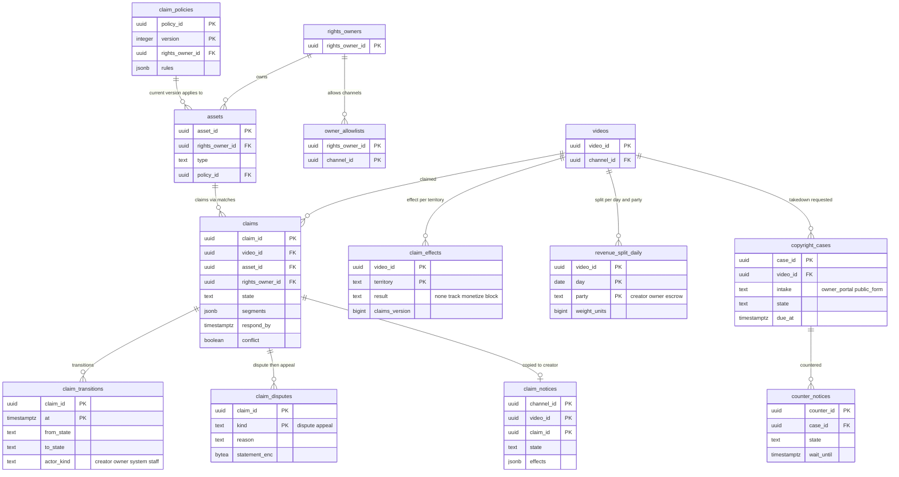

# Data model: 申し立て・異議・削除の申出

[data-model.md](../data-model.md) の一部。規約はそちらの 3 節に従う。振る舞いは [copyright-claims-and-disputes.md](../copyright-claims-and-disputes.md)（4〜9 節）を正とする。決定は [ADR-0047](../../decisions/0047-claim-policies-territory-overlap-and-per-second-split.md)（方針、重なり、秒ごとの分け方）、[ADR-0048](../../decisions/0048-claim-dispute-appeal-state-machine-and-deadlines.md)（ステートマシンと期限）、[ADR-0049](../../decisions/0049-takedown-cases-counter-notice-and-strikes.md)（削除の申出、反論の通知、strike）。削除の申出・反論の通知・strike の手続きは**法務の確認待ち（L1・L2）**で、この文書は枠組みの形だけを決める。

| 表 | スキーマ | 書く |
| --- | --- | --- |
| `assets`、`claim_policies`、`owner_allowlists` | `rights` | `svc_api`（権利者の画面） |
| `claims`、`claim_effects`、`claim_transitions`、`claim_notices` | `rights` | `svc_claims`（方針の適用、`claim-deadline-worker`）、`svc_api`（異議・応答の操作） |
| `claim_disputes` | `rights` | `svc_api`（創作者の異議・再審査の申立て） |
| `revenue_split_daily` | `rights` | `svc_claims`（日ごとの重みの作業） |
| `copyright_cases`、`counter_notices` | `rights` | `svc_api`（権利者の画面と誰でも使える窓口）、侵害情報調査専門員の画面 |

- **申し立ては `(video_id, asset_id)` ごとに 1 つ**（ADR-0047）。一致は [fingerprints-and-references.md](fingerprints-and-references.md) の `matches`、申し立ての区間はその和集合。
- **期限は絶対の時刻**。遷移の時刻に `respond_by` を書き、`claim-deadline-worker` が 1 分ごとに進める（ADR-0048）。
- **strike はここで書かない**。削除の決定のトランザクションで outbox に `copyright_strike_requested` を書き、[accounts-and-channels.md](accounts-and-channels.md) の `strikes` が持つ（ADR-0049、ADR-0061。D-14）。
- 創作者は権利者の表を読まない。見せる値は `claim_notices`（チャンネルの表）に写す（ADR-0009）。

## 1. ER 図

- `claim_policies ||--o{ assets`：資産は今の方針をちょうど 1 つ指す（`assets.policy_id` と `claim_policies.current`）。1 つの方針を権利者の複数の資産で使える。方針の古いバージョンは同じ `policy_id` の別の行で、図は今の行だけを描いた。
- `assets ||--o{ claims`：申し立ては資産の一致から作る。`claims.rights_owner_id` は資産から写す（RLS の列）。
- `claims ||--o{ claim_disputes`：異議（`dispute`）と再審査（`appeal`）の各 1 回（PK `(claim_id, kind)`）。
- `revenue_split_daily.party` の `owner:{id}`・`escrow:{claim_id}` は文字列の中の論理の参照。

## 2. 表

### 2.1 `assets`

| 列 | 型 | NULL | 既定 | 説明 |
| --- | --- | --- | --- | --- |
| `asset_id` | `uuid` | NOT NULL | `uuidv7()` | |
| `rights_owner_id` | `uuid` | NOT NULL | — | |
| `type` | `text` | NOT NULL | — | `sound_recording`・`composition`・`film`・`broadcast` |
| `title` | `text` | NOT NULL | — | 作品の名前（創作者の通知に出す） |
| `policy_id` | `uuid` | NOT NULL | — | 今の方針 |
| `last_block_change_at` | `timestamptz` | NULL | — | ブロックへの変更は 1 時間に 1 回まで |
| `created_at`・`updated_at` | `timestamptz` | NOT NULL | `now()` | |

- キー：PK `(asset_id)`。索引 `(rights_owner_id)`。RLS（FORCE）：権利者の表。`svc_claims` に全行。S1 の量：約 100 万行。

### 2.2 `claim_policies`

| 列 | 型 | NULL | 既定 | 説明 |
| --- | --- | --- | --- | --- |
| `policy_id` | `uuid` | NOT NULL | — | |
| `version` | `integer` | NOT NULL | — | 1 から。変更のたびに新しい行 |
| `rights_owner_id` | `uuid` | NOT NULL | — | |
| `rules` | `jsonb` | NOT NULL | — | `[{"territories":["JP"],"kinds":["audio"],"min_match_s":10,"min_share":0.5,"action":"monetize"}]`（[copyright-claims-and-disputes.md](../copyright-claims-and-disputes.md) の 4.1 節） |
| `current` | `boolean` | NOT NULL | `true` | |
| `created_by` | `uuid` | NOT NULL | — | |
| `created_at` | `timestamptz` | NOT NULL | `now()` | |

- キー：PK `(policy_id, version)`。UK `(policy_id) WHERE current`。
- 追記だけ（古いバージョンを書き換えない）。新しいバージョンの作成で、その資産の有効な申し立てを全部評価し直す（outbox の `claim_policy_changed`）。
- 見習いの権利者のブロックの規則は、人の確認の後にだけ `current` にする（`rights_owners.block_requires_review`）。
- RLS（FORCE）：権利者の表。保持：資産と同じ。S1 の量：約 300 万行。

### 2.3 `owner_allowlists`

| 列 | 型 | NULL | 既定 | 説明 |
| --- | --- | --- | --- | --- |
| `rights_owner_id`・`channel_id` | `uuid` | NOT NULL | — | |
| `added_by`・`added_at` | `uuid`・`timestamptz` | NOT NULL | — | |

- キー：PK `(rights_owner_id, channel_id)`。一覧のチャンネルの申し立ては効果を当てない（記録だけ。DT-CLM-001 の行 4）。RLS（FORCE）：権利者の表。S1 の量：約 10 万行。

### 2.4 `claims`

| 列 | 型 | NULL | 既定 | 説明 |
| --- | --- | --- | --- | --- |
| `claim_id` | `uuid` | NOT NULL | `uuidv7()` | |
| `video_id` | `uuid` | NOT NULL | — | |
| `channel_id` | `uuid` | NOT NULL | — | 動画から写す（通知と許可の一覧の判定） |
| `asset_id` | `uuid` | NOT NULL | — | |
| `rights_owner_id` | `uuid` | NOT NULL | — | 資産から写す（RLS の列） |
| `segments` | `jsonb` | NOT NULL | — | `[{"q_start_ms":…,"q_end_ms":…,"kind":"audio"}]`（一致の区間の和集合） |
| `match_seconds` | `integer` | NOT NULL | — | 区間の和の秒（`min_match_s` の判定） |
| `policy_id`・`policy_version` | `uuid`・`integer` | NOT NULL | — | 評価に使った方針 |
| `actions` | `jsonb` | NOT NULL | — | 地域ごとの動作 `{"JP":"monetize","*":"track"}` |
| `state` | `text` | NOT NULL | `'active'` | `active`・`disputed`・`reinstated`・`appealed`・`takedown_requested`・`upheld`・`released`・`expired`・`withdrawn`・`removed` |
| `respond_by` | `timestamptz` | NULL | — | 期限（UTC の絶対の時刻） |
| `conflict` | `boolean` | NOT NULL | `false` | 所有の衝突の区間を含む |
| `source` | `text` | NOT NULL | — | `upload`・`backscan`・`live` |
| `version` | `bigint` | NOT NULL | `0` | 遷移ごとに 1 上げる |
| `created_at`・`updated_at` | `timestamptz` | NOT NULL | `now()` | |

- キー：PK `(claim_id)`。UK `(video_id, asset_id)`。
- 索引：`(video_id)` — 地域ごとの結果の作り直し。`(respond_by) WHERE state IN ('disputed','appealed','reinstated')` — `claim-deadline-worker`（1 分ごと、`FOR UPDATE SKIP LOCKED`、500 行）。`(rights_owner_id, state, created_at DESC)` — 権利者の一覧と濫用の監視の日の集計。`(asset_id) WHERE state IN ('active','upheld','disputed','reinstated','appealed','takedown_requested')` — 方針の変更での評価し直し。
- CHECK：`state NOT IN ('disputed','appealed','reinstated') OR respond_by IS NOT NULL`、`match_seconds >= 10`。
- 遷移は条件つきの `UPDATE ... WHERE state = $prev AND version = $v` と `claim_transitions`・`claim_notices`・outbox（`claim_resolved` など）を 1 つのトランザクション。
- RLS（FORCE）：権利者の表。`svc_claims` に全行。保持：終わりの状態から 3 年。S1 の量：約 300 万行/年。

### 2.5 `claim_effects`

動画 × 地域の結果（DT-CLM-001）。`playable()` の写しの元。

| 列 | 型 | NULL | 既定 | 説明 |
| --- | --- | --- | --- | --- |
| `video_id` | `uuid` | NOT NULL | — | |
| `territory` | `text` | NOT NULL | — | ISO 3166-1 alpha-2 か `*`（S1 は `JP` と `*`） |
| `result` | `text` | NOT NULL | — | `none`・`track`・`monetize`・`block` |
| `claims_version` | `bigint` | NOT NULL | — | 動画の申し立ての集まりのバージョン（作り直しで 1 上げる） |
| `computed_at` | `timestamptz` | NOT NULL | `now()` | |

- キー：PK `(video_id, territory)`。CHECK：`result IN ('none','track','monetize','block')`。
- 書き換えは `videos.state_version` を上げ、outbox の `claim_policy_changed`（`playable()` の写しと拒否の一覧を 60 秒以内に。`block` は `delivery_block` も）を同じトランザクションで書く。
- RLS：なし（システムの表。権利者の名前を持たない）。保持：動画と同じ。S1 の量：申し立てのある動画 × 2 で約 200 万行。

### 2.6 `claim_transitions`

| 列 | 型 | NULL | 既定 | 説明 |
| --- | --- | --- | --- | --- |
| `claim_id` | `uuid` | NOT NULL | — | |
| `at` | `timestamptz` | NOT NULL | `clock_timestamp()` | |
| `from_state`・`to_state` | `text` | NULL・NOT NULL | — | 作成は `from_state` が NULL |
| `actor_kind` | `text` | NOT NULL | — | `creator`・`owner`・`system`・`staff` |
| `actor_id` | `uuid` | NULL | — | |
| `reason_code` | `text` | NULL | — | `deadline_expired`・`owner_released`・`reference_deactivated` など |
| `rights_owner_id` | `uuid` | NOT NULL | — | RLS の列 |

- キー：PK `(claim_id, at)`。追記だけ（UPDATE・DELETE をロールに与えない）。
- 分割：`at` の月。保持：3 年。RLS（FORCE）：権利者の表（創作者は `claim_notices` の状態だけを見る）。S1 の量：約 400 万行/年。

### 2.7 `claim_disputes`

| 列 | 型 | NULL | 既定 | 説明 |
| --- | --- | --- | --- | --- |
| `claim_id` | `uuid` | NOT NULL | — | |
| `kind` | `text` | NOT NULL | — | `dispute`・`appeal` |
| `reason` | `text` | NOT NULL | — | `own_work`・`licensed`・`public_domain`・`exception`・`misidentified` |
| `statement_enc` | `bytea` | NOT NULL | — | 説明（2,000 文字まで。`kms-pii`） |
| `attested` | `boolean` | NOT NULL | — | 正しいことの申告（`true` でなければ受けない） |
| `filed_by` | `uuid` | NOT NULL | — | |
| `channel_id`・`rights_owner_id` | `uuid` | NOT NULL | — | 両側の RLS の列 |
| `filed_at` | `timestamptz` | NOT NULL | `now()` | |

- キー：PK `(claim_id, kind)`（取り消せない。各 1 回）。CHECK：`attested`。
- 再審査（`appeal`）の条件（上級の機能の段、開いている再審査 3 件以下）は `svc_api` が `creator_tiers` と `claims` を読んで確かめる。
- RLS（FORCE）：`channel_id = ANY(app.channel_ids) OR rights_owner_id = ANY(app.rights_owner_ids)`。保持：申し立てと同じ。S1 の量：約 10 万行/年。

### 2.8 `claim_notices`

創作者に見せる申し立ての写し（[copyright-claims-and-disputes.md](../copyright-claims-and-disputes.md) の 5 節）。チャンネルの表。

| 列 | 型 | NULL | 既定 | 説明 |
| --- | --- | --- | --- | --- |
| `channel_id`・`video_id`・`claim_id` | `uuid` | NOT NULL | — | |
| `asset_title` | `text` | NOT NULL | — | |
| `owner_public_name` | `text` | NOT NULL | — | 権利者の公開の名前 |
| `segments` | `jsonb` | NOT NULL | — | 区間と種類（参照の ID・参照の中の区間・方針の規則を含めない） |
| `effects` | `jsonb` | NOT NULL | — | 地域ごとの効果 `{"JP":"block"}` |
| `state` | `text` | NOT NULL | — | `claims.state` の写し |
| `respond_by` | `timestamptz` | NULL | — | |
| `actions_allowed` | `text[]` | NOT NULL | — | `dispute`・`appeal`・`trim`・`mute` など |
| `source_version` | `bigint` | NOT NULL | — | `claims.version`（古い値で上書きしない） |
| `updated_at` | `timestamptz` | NOT NULL | `now()` | |

- キー：PK `(channel_id, video_id, claim_id)`。UK `(claim_id)`。`claims` の遷移と同じトランザクションで書く（写しの遅れを作らない）。
- RLS（FORCE）：チャンネルの表。保持：申し立てと同じ。S1 の量：約 300 万行/年。

### 2.9 `revenue_split_daily`

動画 × 日 × 相手の分け方の重み（ADR-0047。D-28）。

| 列 | 型 | NULL | 既定 | 説明 |
| --- | --- | --- | --- | --- |
| `video_id` | `uuid` | NOT NULL | — | |
| `day` | `date` | NOT NULL | — | JST |
| `party` | `text` | NOT NULL | — | `creator`・`owner:{rights_owner_id}`・`escrow:{claim_id}` |
| `weight_units` | `bigint` | NOT NULL | — | 重み。1 秒を 27,720 単位（1〜12 の最小公倍数）で表し、秒 `t` を覆う収益化の申し立ての数 `n(t)` での等分 `1/n(t)` を整数で持つ |
| `claims_version` | `bigint` | NOT NULL | — | 使った申し立ての集まり |
| `computed_at` | `timestamptz` | NOT NULL | `now()` | |

- キー：PK `(video_id, day, party)`。CHECK：`party ~ '^(creator|owner:[0-9a-f-]{36}|escrow:[0-9a-f-]{36})$'`、`weight_units > 0`。
- **重みの和は動画の秒の数**：同じ `(video_id, day)` の `Σ weight_units = 動画の秒の数 × 27,720`。日ごとの作業が 1 つのトランザクションで全行を置き換え、終わりに和を確かめる（違えば書かない）。`n(t)` が 12 を超える秒は、12 を超えた分を一致の点の低い順に外して数える（[data-model.md](../data-model.md) の 9 節の持ち越し）。
- 分配の計算（台帳）はこの重みで `pool` を分け、端数を最大剰余で配る（[monetization-ledger-and-payouts.md](monetization-ledger-and-payouts.md) の 2.8 節）。
- 分割：`day` の月。保持：25 か月。RLS：なし（システムの表。権利者・創作者は明細で見る）。S1 の量：1 日 約 30 万行（収益のある申し立ての動画）。

### 2.10 `copyright_cases`

削除の申出（ADR-0049。手続きの値は AppConfig の `legal.copyright.*`）。

| 列 | 型 | NULL | 既定 | 説明 |
| --- | --- | --- | --- | --- |
| `case_id` | `uuid` | NOT NULL | `uuidv7()` | |
| `intake` | `text` | NOT NULL | — | `owner_portal`（照合の権利者の画面）・`public_form`（誰でも使える窓口） |
| `rights_owner_id` | `uuid` | NULL | — | `owner_portal` のとき |
| `video_id` | `uuid` | NOT NULL | — | |
| `channel_id` | `uuid` | NOT NULL | — | 動画から写す |
| `claim_id` | `uuid` | NULL | — | 申し立ての異議から進んだとき（`takedown_requested`） |
| `segments` | `jsonb` | NOT NULL | — | 侵害とする区間 |
| `requester_enc` | `bytea` | NOT NULL | — | 申出者の名前・連絡先・署名（`kms-pii`） |
| `details_enc` | `bytea` | NOT NULL | — | 権利の内容と侵害の理由（`kms-pii`） |
| `scheduled_removal` | `boolean` | NOT NULL | `false` | 予定の削除（7 日の間に創作者が消せば strike を出さない） |
| `state` | `text` | NOT NULL | `'received'` | `received`・`validating`・`reviewing`・`decided`・`withdrawn` |
| `decision` | `text` | NULL | — | `removed`・`rejected` |
| `received_at` | `timestamptz` | NOT NULL | `now()` | |
| `due_at` | `timestamptz` | NOT NULL | — | `received_at` と `legal.copyright.review_days`（営業日の暦）から |
| `warned_48h_at`・`warned_24h_at` | `timestamptz` | NULL | — | 担当への警告 |
| `decided_at`・`decided_by` | `timestamptz`・`uuid` | NULL | — | 侵害情報調査専門員の役割 |

- キー：PK `(case_id)`。索引 `(state, due_at) WHERE state IN ('received','validating','reviewing')` — 期限の警告。`(video_id)`。
- CHECK：`(state = 'decided') = (decision IS NOT NULL)`、`(intake = 'owner_portal') = (rights_owner_id IS NOT NULL)`。
- `removed` の決定は `moderation_actions`（`remove`）と outbox の `copyright_strike_requested`・`delivery_block` を同じトランザクションで書く（措置を記録してから効かせる）。
- RLS（FORCE）：`rights_owner_id = ANY(app.rights_owner_ids)`（権利者の画面）と運用の審査の API。創作者には通知の文で知らせ、表を読ませない。
- 保持：決定から 3 年（L1・L2・L10 で見直す）。S1 の量：約 1 万行/年。

### 2.11 `counter_notices`

反論の通知（ADR-0049。`legal.copyright.counter.enabled` が `false` の間は行を作らない）。

| 列 | 型 | NULL | 既定 | 説明 |
| --- | --- | --- | --- | --- |
| `counter_id` | `uuid` | NOT NULL | `uuidv7()` | |
| `case_id` | `uuid` | NOT NULL | — | |
| `video_id`・`channel_id` | `uuid` | NOT NULL | — | |
| `statement_enc` | `bytea` | NOT NULL | — | 反論の内容と連絡先（`kms-pii`） |
| `state` | `text` | NOT NULL | `'received'` | `received`・`waiting`・`restored`・`rejected`・`withdrawn` |
| `received_at` | `timestamptz` | NOT NULL | `now()` | |
| `wait_until` | `timestamptz` | NULL | — | `legal.copyright.counter.wait_business_days` の営業日の後 |
| `decided_at` | `timestamptz` | NULL | — | |

- キー：PK `(counter_id)`。UK `(case_id)`（1 つの申出に 1 回）。索引 `(wait_until) WHERE state = 'waiting'`。
- `restored` で動画を戻すトランザクションに outbox の `copyright_strike_retracted` を書く。
- RLS（FORCE）：チャンネルの表と運用の審査の API。保持：3 年（L2）。S1 の量：0（既定で無効）。D-19 で足した表。
