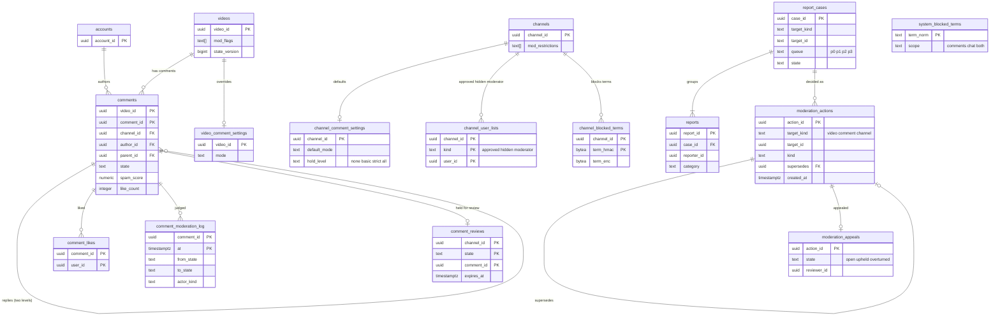

# Data model: コメントとモデレーション

[data-model.md](../data-model.md) の一部。規約はそちらの 3 節に従う。振る舞いは [comments-and-moderation.md](../comments-and-moderation.md)（4〜8 節）と [live-chat.md](../live-chat.md)（6.3 節のブロックの語）を正とする。決定は [ADR-0050](../../decisions/0050-comment-threads-storage-and-ranking.md)（木と保存）、[ADR-0051](../../decisions/0051-comment-posting-pipeline-spam-and-hold.md)（投稿の判定）、[ADR-0052](../../decisions/0052-moderation-actions-age-kids-and-promotion.md)（措置、年齢、子ども向け）。

| 表 | スキーマ | 書く |
| --- | --- | --- |
| `comments`、`comment_likes`、`comment_moderation_log` | `social` | `svc_api`（投稿と判定。分類器は同期で呼ぶ）、後からの判定の作業 |
| `comment_reviews`、`channel_comment_settings`、`video_comment_settings`、`channel_user_lists`、`channel_blocked_terms` | `social` | `svc_api`（創作者・モデレーター。`can()` を通す） |
| `system_blocked_terms` | `social` | T&S の担当 |
| `reports`、`report_cases`、`moderation_actions`、`moderation_appeals` | `trust` | `svc_api`（通報）、審査の画面（担当）、自動の規則 |

- **措置は追記だけの `moderation_actions` に書いてから効かせる**。同じトランザクションで対象の要約（`videos.mod_flags`・`mod_blocked_regions`・`state_version`、`comments.state`、`channels.mod_restrictions`）と outbox（`moderation_action_applied`、動画の `remove`・`region_block` は `delivery_block`）を書く（ADR-0052、ADR-0027）。
- 規約の違反を根拠にした措置は、同じトランザクションで outbox に `guideline_violation` を書く。strike にするのは [accounts-and-channels.md](accounts-and-channels.md) の領域（D-14）。
- **ブロックの語は 1 つの表**：チャンネルの一覧 `channel_blocked_terms` をコメントとライブチャットの両方が使い、本システムの一覧は `system_blocked_terms`（D-8）。
- コメントの本文は Aurora にだけ置き、ログ・MSK の鍵・Valkey の鍵に入れない（Valkey `cc:` は数だけ）。

## 1. ER 図

- `comments ||--o{ comments`：`parent_id` は最上位のコメントだけを指す（2 段の木。返信への返信は `reply_to_user_id` で表す）。`comments` は分割した表なので、外部キーは同じ分割の中の `(video_id, parent_id)` の複合の参照（同じ `video_id` は同じ分割に入る）。
- `moderation_actions ||--o| moderation_actions`：取り消しや置き換えは新しい行で、`supersedes` が前の行を指す。
- `moderation_actions.target_id` は `target_kind` によって動画・コメント・チャンネルを指す多態の参照（外部キーを張らない）。
- `system_blocked_terms` は運用の一覧で、他の表と結ばない。

## 2. 表

### 2.1 `comments`

| 列 | 型 | NULL | 既定 | 説明 |
| --- | --- | --- | --- | --- |
| `video_id` | `uuid` | NOT NULL | — | 分割の鍵 |
| `comment_id` | `uuid` | NOT NULL | `uuidv7()` | |
| `channel_id` | `uuid` | NOT NULL | — | 動画のチャンネル（保留の写しと設定の判定） |
| `author_id` | `uuid` | NOT NULL | — | 書いたアカウント |
| `author_channel_id` | `uuid` | NULL | — | 名前として選んだチャンネル（チャンネルの名で書く） |
| `parent_id` | `uuid` | NULL | — | 最上位なら NULL |
| `reply_to_user_id` | `uuid` | NULL | — | 返信への返信の相手 |
| `body` | `text` | NULL | — | 1〜2,000 文字。削除の 30 日の後に NULL |
| `mention_ids` | `uuid[]` | NOT NULL | `'{}'` | `@handle` を解いた ID |
| `state` | `text` | NOT NULL | — | `published`・`held`・`likely_spam`・`author_only`・`removed_by_channel`・`removed`・`deleted` |
| `reason_code` | `text` | NULL | — | 判定・削除の理由のコード |
| `spam_score`・`tox_score` | `numeric(4,3)` | NULL | — | 0〜1 |
| `classifier_version` | `text` | NULL | — | 判定の規則と分類器のバージョン |
| `simhash` | `bigint` | NOT NULL | — | 本文の SimHash（同じ本文の広がりの判定） |
| `pinned`・`hearted` | `boolean` | NOT NULL | `false` | |
| `like_count`・`reply_count` | `integer` | NOT NULL | `0` | Valkey `cc:` から 1 分ごとに書き戻す |
| `edited_at` | `timestamptz` | NULL | — | |
| `state_changed_at` | `timestamptz` | NOT NULL | `now()` | |
| `created_at` | `timestamptz` | NOT NULL | `now()` | |

- キー：PK `(video_id, comment_id)`。UK `(video_id) WHERE pinned`（1 動画 1 件）。
- 索引（[comments-and-moderation.md](../comments-and-moderation.md) の 4.3 節）：
  - `(video_id, comment_id DESC) WHERE parent_id IS NULL AND state = 'published'` — 新しい順。
  - `(video_id, parent_id, comment_id)` — 返信（古い順）。
  - `(author_id, comment_id DESC)` — 自分のコメント、措置、アカウントの削除。
  - `(state_changed_at) WHERE state IN ('held','likely_spam')` — 60 日の自動の削除。
  - `(state_changed_at) WHERE state IN ('deleted','removed_by_channel','removed') AND body IS NOT NULL` — 30 日の本文の消去。
- CHECK：`body IS NULL OR char_length(body) BETWEEN 1 AND 2000`、`parent_id IS NULL OR NOT pinned`、`reply_to_user_id IS NULL OR parent_id IS NOT NULL`、`state IN (…)`。最上位の下の返信 500 の上限はトリガー（`reply_count`）。
- 分割：`video_id` のハッシュで 16（ADR-0050）。分割の中で月ごとに分けない（保持は行の状態で消す）。
- RLS：なし（公開のコメント。許可リスト）。保留・スパムの疑い・作者だけのコメントの見せ方（作者には普通に見せる）は `api` の表示の判定（5.4 節）で決め、`playable()` を通した動画のコメントだけを返す。
- 削除：行を消さず状態を変える。本文は 30 日の後に NULL にし、ID・状態・理由のコードを残す。アカウントの削除では作者のコメントを `deleted` にする。
- S1 の量：[comments-and-moderation.md](../comments-and-moderation.md) の 1 日 約 30 万件（上限の見積もり。[data-model.md](../data-model.md) の 9 節）で、約 1.1 億行/年。

### 2.2 `comment_likes`

| 列 | 型 | NULL | 既定 | 説明 |
| --- | --- | --- | --- | --- |
| `comment_id` | `uuid` | NOT NULL | — | |
| `user_id` | `uuid` | NOT NULL | — | |
| `created_at` | `timestamptz` | NOT NULL | `now()` | |

- キー：PK `(comment_id, user_id)`。索引 `(user_id, created_at DESC)` — 本人の高評価の一覧とアカウントの削除。
- 数は Valkey `cc:{comment_id}` に積み、1 分ごとに `comments.like_count` へ書き戻す。低評価は持たない（S1）。
- RLS（FORCE）：本人の表。`svc_api` の数え直しの作業に全行。保持：コメントの本文の消去と一緒に消す。S1 の量：約 3 億行/年。

### 2.3 `comment_moderation_log`

| 列 | 型 | NULL | 既定 | 説明 |
| --- | --- | --- | --- | --- |
| `comment_id` | `uuid` | NOT NULL | — | |
| `at` | `timestamptz` | NOT NULL | `clock_timestamp()` | |
| `video_id`・`channel_id` | `uuid` | NOT NULL | — | |
| `from_state`・`to_state` | `text` | NULL・NOT NULL | — | 投稿の時は `from_state` が NULL |
| `actor_kind` | `text` | NOT NULL | — | `classifier`・`late_check`・`author`・`creator`・`moderator`・`staff` |
| `actor_id` | `uuid` | NULL | — | |
| `reason_code` | `text` | NULL | — | DT-CMT-001 の行、`spread`（同じ本文の広がり） |
| `classifier_version` | `text` | NULL | — | |

- キー：PK `(comment_id, at)`。追記だけ。運営の措置は `moderation_actions` にも書く（この表は判定の続きの記録）。
- 分割：`at` の月。保持：1 年。RLS（FORCE）：チャンネルの表。S1 の量：約 1.5 億行/年。

### 2.4 `comment_reviews`

保留の一覧の写し（創作者の画面が読む。60 日で自動に消える）。

| 列 | 型 | NULL | 既定 | 説明 |
| --- | --- | --- | --- | --- |
| `channel_id` | `uuid` | NOT NULL | — | |
| `state` | `text` | NOT NULL | — | `held`・`likely_spam` |
| `comment_id` | `uuid` | NOT NULL | — | |
| `video_id` | `uuid` | NOT NULL | — | |
| `reason` | `text` | NOT NULL | — | 保留の理由のコード |
| `expires_at` | `timestamptz` | NOT NULL | — | `created_at + 60 日` |
| `created_at` | `timestamptz` | NOT NULL | `now()` | |

- キー：PK `(channel_id, state, comment_id)`。索引 `(expires_at)`。`comments.state` の変化と同じトランザクションで足す・消す。
- RLS（FORCE）：チャンネルの表。S1 の量：約 300 万行（60 日）。

### 2.5 `channel_comment_settings`・`video_comment_settings`・`channel_user_lists`

| 表 | 列 | キー | 説明 |
| --- | --- | --- | --- |
| `channel_comment_settings` | `channel_id uuid`、`default_mode text`（`enabled`・`disabled`・`hold_all`）、`hold_level text`（`none`・`basic`・`strict`・`all`、既定 `basic`）、`links_held boolean`、`updated_by uuid`、`updated_at` | PK `(channel_id)` | 行がなければ既定。ブロックの語は `channel_blocked_terms`（D-8） |
| `video_comment_settings` | `video_id uuid`、`channel_id uuid`、`mode text NULL`、`hold_level text NULL`、`updated_at` | PK `(video_id)` | NULL はチャンネルの既定に従う。子ども向けの動画は `disabled` を強制（トリガー） |
| `channel_user_lists` | `channel_id uuid`、`kind text`（`approved`・`hidden`・`moderator`）、`user_id uuid`、`added_by uuid`、`added_at` | PK `(channel_id, kind, user_id)`、索引 `(user_id)` | 上限：`approved`・`hidden` 1 万人、`moderator` 50 人（トリガー） |

- RLS（FORCE）：3 つともチャンネルの表。投稿の判定は Valkey の写し（`cset:{channel_id}`。[stores.md](stores.md) の 1 節）を読む。
- S1 の量：`channel_comment_settings` 約 30 万、`video_comment_settings` 約 50 万、`channel_user_lists` 約 500 万。

### 2.6 `channel_blocked_terms`・`system_blocked_terms`

| 列 | 型 | NULL | 既定 | 説明 |
| --- | --- | --- | --- | --- |
| `channel_blocked_terms.channel_id` | `uuid` | NOT NULL | — | |
| `term_hmac` | `bytea` | NOT NULL | — | 正規化した語の HMAC（重複を除く） |
| `term_enc` | `bytea` | NOT NULL | — | 語の暗号文（`kms-pii`。人の名前が入りうる） |
| `created_by`・`created_at` | `uuid`・`timestamptz` | NOT NULL | — | |
| `system_blocked_terms.term_norm` | `text` | NOT NULL | — | 正規化した語 |
| `scope` | `text` | NOT NULL | `'both'` | `comments`・`chat`・`both` |
| `reason_code` | `text` | NOT NULL | — | |
| `added_by`・`added_at` | `uuid`・`timestamptz` | NOT NULL | — | |

- キー：`channel_blocked_terms` PK `(channel_id, term_hmac)`（1 チャンネル 500 語・1 語 50 文字。トリガー）。`system_blocked_terms` PK `(term_norm)`。
- コメントの判定と `live-chat-gateway` は、チャンネルの一覧を復号してプロセスのメモリーに 60 秒持つ（Valkey に平文を置かない）。変更は outbox の `blocked_terms_changed` で知らせる。
- RLS：`channel_blocked_terms` はチャンネルの表（FORCE）。`svc_api`・`svc_chat` に全行。`system_blocked_terms` はなし。
- S1 の量：`channel_blocked_terms` 約 300 万、`system_blocked_terms` 数千。

### 2.7 `reports`・`report_cases`

| 表 | 列 | キー・索引 | 説明 |
| --- | --- | --- | --- |
| `reports` | `report_id uuid`、`case_id uuid`、`reporter_id uuid`、`target_kind text`（`video`・`comment`・`channel`・`playlist`・`chat_message`）、`target_id text`（UUID の文字列、チャットは `{stream_id}:{seq}`）、`category text`、`reporter_trust numeric(4,3)`、`evidence_key text`（通報の時の証拠の写しの S3 のキー）、`created_at` | PK `(report_id)`、索引 `(case_id)`、`(reporter_id, created_at)` | 1 人 1 対象 1 区分に 1 件（UK `(reporter_id, target_kind, target_id, category)`） |
| `report_cases` | `case_id uuid`、`target_kind text`、`target_id text`、`category text`、`queue text`（`p0`〜`p3`）、`priority integer`（重さ × 広がり × 信頼 × 速さの整数の点）、`due_at timestamptz`、`state text`（`open`・`in_review`・`actioned`・`dismissed`）、`assignee_id uuid NULL`、`report_count integer`、`action_id uuid NULL`、`opened_at`、`closed_at NULL` | PK `(case_id)`、UK `(target_kind, target_id, category) WHERE state IN ('open','in_review')`、索引 `(queue, priority DESC, due_at) WHERE state IN ('open','in_review')` | 対象と区分の組の案件。初動の期限は P0 1 時間〜P3 7 日 |

- 著作権・名誉とプライバシーの区分は、案件を作らず該当の窓口（`copyright_cases`、法令の案件）へ回す。
- RLS：なし（運用の表。審査の画面は `moderation-review` の役割と監査）。通報者には自分の通報の状態だけを `api` が返す。
- 保持：閉じてから 1 年（`reports.evidence_key` の写しは 90 日）。L1 で見直す。S1 の量：`reports` 約 500 万行/年、`report_cases` 約 200 万行/年。

### 2.8 `moderation_actions`

| 列 | 型 | NULL | 既定 | 説明 |
| --- | --- | --- | --- | --- |
| `action_id` | `uuid` | NOT NULL | `uuidv7()` | |
| `target_kind` | `text` | NOT NULL | — | `video`・`comment`・`channel` |
| `target_id` | `uuid` | NOT NULL | — | |
| `video_id` | `uuid` | NULL | — | コメントの措置の動画（分割の鍵の引き） |
| `kind` | `text` | NOT NULL | — | 動画：`interstitial`・`age_restrict`・`limited`・`limited_search`・`region_block`・`remove`。コメント：`remove`。チャンネル：`comment_restrict`・`upload_restrict`・`live_restrict`・`suspend_request`。共通：`revoke`（取り消し） |
| `regions` | `text[]` | NOT NULL | `'{}'` | `region_block` の地域 |
| `basis_kind` | `text` | NOT NULL | — | `policy`（規約の条項）・`legal_case`（法令の案件）・`copyright_case` |
| `basis_ref` | `text` | NOT NULL | — | 条項のコードか案件の ID |
| `actor_kind` | `text` | NOT NULL | — | `staff`・`rule` |
| `actor_id` | `uuid` | NULL | — | 担当（`staff`） |
| `rule_id`・`rule_version` | `text` | NULL | — | 自動の規則（`rule`） |
| `report_case_id` | `uuid` | NULL | — | 元の案件 |
| `expires_at` | `timestamptz` | NULL | — | 期限つきの措置 |
| `supersedes` | `uuid` | NULL | — | 置き換え・取り消す前の行 |
| `approved_by` | `uuid` | NULL | — | 2 人の承認（永久の停止、法令の判断） |
| `created_at` | `timestamptz` | NOT NULL | `clock_timestamp()` | |

- キー：PK `(action_id)`。索引 `(target_kind, target_id, created_at)` — 対象の措置の履歴と、今の要約の作り直し。`(expires_at) WHERE expires_at IS NOT NULL` — 期限の終わりの作業。`(created_at)` — 毎日の公表の集計。
- CHECK：`(actor_kind = 'staff') = (actor_id IS NOT NULL)`、`(actor_kind = 'rule') = (rule_id IS NOT NULL)`、`kind <> 'region_block' OR regions <> '{}'`、`kind <> 'revoke' OR supersedes IS NOT NULL`。
- **追記だけ**：UPDATE・DELETE をどのロールにも与えない。要約の列と `state_version` と outbox を同じトランザクションで書く。
- RLS：なし（運用の表）。創作者には通知（種類、根拠の条項、対象、異議の方法）で知らせる。保持：3 年（L1）。S1 の量：約 300 万行/年（コメントの削除を含む）。

### 2.9 `moderation_appeals`

| 列 | 型 | NULL | 既定 | 説明 |
| --- | --- | --- | --- | --- |
| `action_id` | `uuid` | NOT NULL | — | 措置ごとに 1 回 |
| `appellant_id` | `uuid` | NOT NULL | — | |
| `channel_id` | `uuid` | NULL | — | RLS の列（動画・チャンネルの措置） |
| `statement_enc` | `bytea` | NOT NULL | — | 説明（`kms-pii`） |
| `state` | `text` | NOT NULL | `'open'` | `open`・`upheld`・`overturned` |
| `filed_at` | `timestamptz` | NOT NULL | `now()` | 措置から 30 日以内 |
| `due_at` | `timestamptz` | NOT NULL | — | `filed_at + 7 日` |
| `reviewer_id` | `uuid` | NULL | — | 最初の判断と別の担当（トリガーで確かめる） |
| `decided_at` | `timestamptz` | NULL | — | `overturned` は `revoke` の措置の行を同じトランザクションで書く |

- キー：PK `(action_id)`。索引 `(state, due_at) WHERE state = 'open'`。
- RLS（FORCE）：申し立てた本人（`appellant_id = app.actor_id`）か、チャンネルの表。保持：決定から 3 年。S1 の量：約 5 万行/年。
