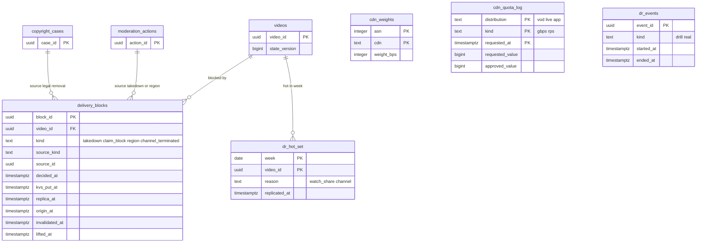

# Data model: 配信と措置での停止

[data-model.md](../data-model.md) の一部。規約はそちらの 3 節に従う。振る舞いは [cdn-and-delivery.md](../cdn-and-delivery.md)（5・6・10〜12 節）と [infrastructure.md](../infrastructure.md)（3.3・6・7 節）を正とする。決定は [ADR-0005](../../decisions/0005-cdn-and-origin-strategy.md)（CDN とオリジン）、[ADR-0025](../../decisions/0025-edge-token-signing-and-cache-keys.md)（エッジのトークン）、[ADR-0026](../../decisions/0026-origin-cache-routing-admission-and-coalescing.md)（`origin-cache`）、[ADR-0027](../../decisions/0027-takedown-deny-list-within-60s.md)（拒否の一覧）、[ADR-0064](../../decisions/0064-accounts-network-and-edge-distributions.md)（ディストリビューション）、[ADR-0066](../../decisions/0066-osaka-dr-stage-up-and-multi-cdn-timing.md)（大阪と DR）。

| 表・置き場所 | スキーマ | 書く |
| --- | --- | --- |
| `delivery_blocks` | `delivery` | `svc_blocker`（`delivery-blocker`） |
| `cdn_weights`（S2） | `delivery` | CDN の振り分けの計算の作業（5 分ごと） |
| `cdn_quota_log` | `delivery` | 運用（上限の申請と承認） |
| `dr_hot_set`、`dr_events` | `delivery` | `dr-hot-set` の作業（毎週）、DR のワークフロー |
| KeyValueStore `edge-kv`（`k:`・`b:`・`t:`） | CloudFront | `svc_blocker`、鍵の回しの作業、トークンの悪用の検出（[stores.md](stores.md) の 2 節） |
| Valkey `blocked:{video_id}`、SNS `origin-deny` | — | `svc_blocker`（[stores.md](stores.md) の 1・4 節） |

- **記録してから効かせる**。措置の行（`moderation_actions` など）と outbox の `delivery_block` を同じトランザクションで書き、`delivery-blocker` がこの表に段ごとの時刻を残す。outbox の行がない措置は配信を止めない（ADR-0027）。
- 決定から新しい配信の 403 まで p99 30 秒、上限 60 秒（NFR-014）。この表の `decided_at` と各段の時刻の差が SLI の元（[ADR-0067](../../decisions/0067-sli-sources-and-computation.md)）。

## 1. ER 図

- `delivery_blocks` の元は `source_kind`・`source_id` の論理の参照（D-10）：`moderation_action`（`moderation_actions.action_id`）、`copyright_case`（`copyright_cases.case_id`）、`claim_effect`（申し立ての評価の outbox の `event_id`）、`account_standing`（終了の遷移の outbox の `event_id`）。図は前の 2 つだけを描いた。
- `cdn_weights`・`cdn_quota_log`・`dr_events` は運用の表で、他の表への外部キーを持たない（図では線のない箱）。

## 2. 表

### 2.1 `delivery_blocks`

| 列 | 型 | NULL | 既定 | 説明 |
| --- | --- | --- | --- | --- |
| `block_id` | `uuid` | NOT NULL | `uuidv7()` | |
| `video_id` | `uuid` | NOT NULL | — | |
| `kind` | `text` | NOT NULL | — | `takedown`・`claim_block`・`region`・`channel_terminated` |
| `regions` | `text[]` | NOT NULL | `'{}'` | 地域の止め（空は全部の地域） |
| `source_kind` | `text` | NOT NULL | — | `moderation_action`・`copyright_case`・`claim_effect`・`account_standing` |
| `source_id` | `uuid` | NOT NULL | — | 元の記録か outbox の出来事の ID |
| `decided_at` | `timestamptz` | NOT NULL | — | 元の記録の時刻（outbox の `created_at`） |
| `kvs_put_at` | `timestamptz` | NULL | — | KeyValueStore の `b:` を置いた時刻（地域だけの止めは置かない） |
| `kvs_ttl_s` | `integer` | NULL | — | `b:` の寿命（604,800。置き場の 80% で 86,400） |
| `replica_at` | `timestamptz` | NULL | — | `playable()` の写し（`blocked:`・`pv:`）を書いた時刻 |
| `origin_at` | `timestamptz` | NULL | — | SNS `origin-deny` を送った時刻 |
| `invalidation_id` | `text` | NULL | — | CloudFront の無効化（`#v:{video_id}`） |
| `invalidated_at` | `timestamptz` | NULL | — | 無効化の完了 |
| `kvs_removed_at` | `timestamptz` | NULL | — | `b:` を外した時刻（7 日の後か取り消し） |
| `lifted_at` | `timestamptz` | NULL | — | 取り消しで止めを外した時刻 |
| `lift_source_id` | `uuid` | NULL | — | 取り消しの元（措置の取り消しの行など） |
| `canary` | `boolean` | NOT NULL | `false` | 見張りの措置（毎日、SLO の計測） |
| `retry_count` | `smallint` | NOT NULL | `0` | KeyValueStore の更新のやり直し（10 秒ごと 5 回） |

- キー：PK `(block_id)`。UK `(source_kind, source_id, video_id)`（同じ出来事を 2 回受けても 1 行。`delivery-blocker` の冪等）。
- 索引：
  - `(video_id, decided_at DESC)` — 動画の止めの履歴、取り消しの対象。
  - `(kvs_put_at) WHERE kvs_removed_at IS NULL AND kvs_put_at IS NOT NULL` — 7 日の外しの作業と、置き場の使用の割合。
  - `(decided_at) WHERE replica_at IS NULL OR (kvs_put_at IS NULL AND regions = '{}')` — 60 秒を超えた止めの見張り（Ops を呼ぶ）。
- CHECK：`kind <> 'region' OR regions <> '{}'`、`kvs_removed_at IS NULL OR kvs_put_at IS NOT NULL`、`retry_count BETWEEN 0 AND 5`。
- 終了したチャンネル（`channel_terminated`）の動画が 5,000 本を超えるときは、直近 30 日に再生のあった動画にだけ `b:` を置き、他は `kvs_put_at` を NULL のまま写しと `origin-cache` の拒否で止める（[accounts-and-safety.md](../accounts-and-safety.md) の 9.3 節）。
- RLS：なし（運用の表）。保持：1 年（措置の証跡は `moderation_actions` と監査の記録）。
- S1 の量：1 日 数百〜5,000 行、約 50 万行/年。

### 2.2 `cdn_weights`（S2）

| 列 | 型 | NULL | 既定 | 説明 |
| --- | --- | --- | --- | --- |
| `asn` | `integer` | NOT NULL | — | `0` はその他の ASN |
| `cdn` | `text` | NOT NULL | — | `cloudfront`・2 つ目の CDN の名前 |
| `weight_bps` | `integer` | NOT NULL | — | 振り分けの重み（基本点。同じ `asn` の和は 10,000） |
| `samples` | `integer` | NOT NULL | — | 計算に使った QoE のセッションの数 |
| `computed_at` | `timestamptz` | NOT NULL | — | 5 分ごと |

- キー：PK `(asn, cdn)`。CHECK：`weight_bps BETWEEN 0 AND 10000`。同じ `asn` の和が 10,000 であることは計算の作業が 1 つのトランザクションで全行を置き換えて守る。
- 再生の API がメモリーに読み、CDN のホストを選ぶ。RLS：なし。S1 は空。S2 の量：約 100 行。

### 2.3 `cdn_quota_log`

| 列 | 型 | NULL | 既定 | 説明 |
| --- | --- | --- | --- | --- |
| `distribution` | `text` | NOT NULL | — | `vod`・`live`・`app` |
| `kind` | `text` | NOT NULL | — | `gbps`・`rps` |
| `requested_at` | `timestamptz` | NOT NULL | — | |
| `requested_value` | `bigint` | NOT NULL | — | |
| `approved_value` | `bigint` | NULL | — | |
| `approved_at` | `timestamptz` | NULL | — | |
| `ticket_ref` | `text` | NOT NULL | — | 申請の番号 |

- キー：PK `(distribution, kind, requested_at)`。使用の割合の警報（60% でチケット、80% で呼び出し）の分母は最新の `approved_value`。RLS：なし。S1 の量：数十行。

### 2.4 `dr_hot_set`

| 列 | 型 | NULL | 既定 | 説明 |
| --- | --- | --- | --- | --- |
| `week` | `date` | NOT NULL | — | 週の頭（月曜、JST） |
| `video_id` | `uuid` | NOT NULL | — | |
| `reason` | `text` | NOT NULL | — | `watch_share`（直近 7 日の確定の総再生時間の 90% の内）・`channel`（登録者 10 万以上の公開から 30 日） |
| `bytes` | `bigint` | NOT NULL | — | 写す H.264 のレンディションの大きさ |
| `replicated_at` | `timestamptz` | NULL | — | 大阪への写しの完了（S3 Batch Operations か `dr=hot` の CRR） |

- キー：PK `(week, video_id)`。索引 `(video_id)`。RLS：なし。保持：8 週。S1 の量：週 約 10 万行（約 80 TB）。

### 2.5 `dr_events`

| 列 | 型 | NULL | 既定 | 説明 |
| --- | --- | --- | --- | --- |
| `event_id` | `uuid` | NOT NULL | `uuidv7()` | |
| `kind` | `text` | NOT NULL | — | `drill`・`real` |
| `scope` | `text` | NOT NULL | — | `control_plane`・`playback`・`full` |
| `started_at`・`ended_at` | `timestamptz` | NOT NULL・NULL | — | |
| `aurora_last_commit_at` | `timestamptz` | NULL | — | 大阪へ届いた最後のコミットの時刻（失った範囲） |
| `rtc_last_replicated_at` | `timestamptz` | NULL | — | 元のファイルの写しの届いた時刻 |
| `rebuilt_videos` | `integer` | NOT NULL | `0` | 熱い集まりの外で作り直した動画の数 |
| `notes` | `text` | NOT NULL | `''` | 振り返りへのリンク |

- キー：PK `(event_id)`。RLS：なし。保持：消さない。S1 の量：年に数行。
