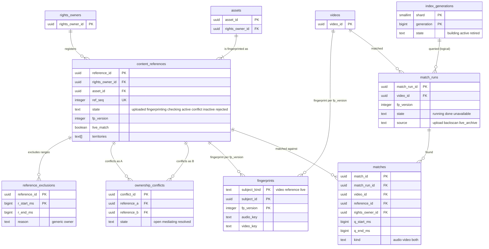

# Data model: 指紋・参照・照合

[data-model.md](../data-model.md) の一部。規約はそちらの 3 節に従う。振る舞いは [copyright-matching.md](../copyright-matching.md)（4〜11 節）を正とする。決定は [ADR-0008](../../decisions/0008-fingerprinting-and-match-engine.md)（指紋と照合）、[ADR-0043](../../decisions/0043-fingerprint-v1-hash-formats.md)（`fp_version` 1 のハッシュ）、[ADR-0044](../../decisions/0044-reference-index-shards-and-generations.md)（分片と世代）、[ADR-0045](../../decisions/0045-offset-voting-verification-and-distortion-variants.md)（投票と確かめ）、[ADR-0046](../../decisions/0046-reference-ingestion-ownership-conflicts-and-backscan.md)（参照の取り込みと衝突）。

| 表・置き場所 | スキーマ | 書く |
| --- | --- | --- |
| `content_references`、`reference_exclusions` | `rights` | `svc_api`（権利者の画面）、`svc_pipeline`（`reference` の run の状態）、`svc_match`（検査の結果） |
| `ownership_conflicts` | `rights` | `svc_match`（検査）、運用の仲立ち |
| `fingerprints` | `rights` | `svc_match`（`fingerprinter`） |
| `match_runs`、`matches` | `rights` | `svc_match`（`match-engine`） |
| `index_generations` | `rights` | `svc_match`（世代のまとめの作業） |
| 指紋のファイル | S3 `<fp-bucket>` `fp/video/`・`fp/ref/`・`fp/live/` | `fingerprinter`（形は [formats.md](formats.md) の 2・3 節） |
| 参照の索引 | S3 `<fp-bucket>` `index/v1/{shard}/{generation}/`、`match-engine` のメモリー | 世代のまとめの作業（形は [formats.md](formats.md) の 4 節） |

- **表の名前は `content_references`**（`references` は SQL の予約語。D-7）。
- **全部の分片の答えがないと結果を出さない**。8 つの分片のどれかが答えない照合は `match_runs.state = 'unavailable'` にし、`no_match` にしない。公開の門は `done` の行だけを見る（ADR-0044。[data-model.md](../data-model.md) の 6 節）。
- 参照のファイルと指紋は照合のほかに使わない（**法務の確認待ち：L8**）。指紋のファイルは `kms-fp` の鍵で暗号化し、`svc_match` の IAM の役割だけが読める。

## 1. ER 図

- `fingerprints` の `subject_id` は `subject_kind` によって `videos.video_id`・`content_references.reference_id`・`live_streams.stream_id` を指す多態の参照（外部キーを張らない）。図は前の 2 つを描いた。
- `index_generations ||--o{ match_runs`：照合はその時に有効だった 8 つの分片の世代を引く。`match_runs.index_generations` に 8 つの番号を値で持つ（外部キーではない）。
- `assets ||--|{ content_references`：資産は参照を 1 つ以上持つ（重複の登録、別のミックス。[copyright-claims-and-disputes.md](../copyright-claims-and-disputes.md) の 4.2 節）。資産の作成と最初の参照は同じトランザクション。

## 2. 表

### 2.1 `content_references`

権利者の参照のファイル（ADR-0046 の状態の機械）。権利者の表。

| 列 | 型 | NULL | 既定 | 説明 |
| --- | --- | --- | --- | --- |
| `reference_id` | `uuid` | NOT NULL | `uuidv7()` | |
| `rights_owner_id` | `uuid` | NOT NULL | — | |
| `asset_id` | `uuid` | NOT NULL | — | |
| `asset_type` | `text` | NOT NULL | — | `sound_recording`・`composition`・`film`・`broadcast` |
| `match_kinds` | `text[]` | NOT NULL | — | `audio`・`video`（両方なら 2 つ） |
| `live_match` | `boolean` | NOT NULL | `false` | ライブの照合の対象（`match-engine-live` の索引に入れる） |
| `territories` | `text[]` | NOT NULL | — | 権利の地域（ISO 3166-1 alpha-2 か `*`） |
| `state` | `text` | NOT NULL | `'uploaded'` | `uploaded`・`fingerprinting`・`checking`・`active`・`conflict`・`inactive`・`rejected` |
| `reject_reason` | `text` | NULL | — | `too_short`・`too_long`・`generic_content`・`decode_failed` |
| `fp_version` | `integer` | NULL | — | 指紋を作った後 |
| `ref_seq` | `integer` | NULL | — | 索引の中の参照の番号（u32。最初に `active` になった時に順に振る。再利用しない） |
| `duration_ms` | `bigint` | NULL | — | |
| `excluded_share_bps` | `integer` | NOT NULL | `0` | 除外の区間の割合（8,000 以上で `rejected`） |
| `source_s3_key` | `text` | NULL | — | 参照のファイル（`<fp-bucket>` `refsrc/{reference_id}/source`） |
| `created_at`・`updated_at` | `timestamptz` | NOT NULL | `now()` | |
| `activated_at`・`deactivated_at` | `timestamptz` | NULL | — | outbox の `reference_activated`・`reference_deactivated` と同じトランザクション |

- キー：PK `(reference_id)`。UK `(ref_seq)`。FK `rights_owner_id → rights_owners`、`asset_id → assets`。
- 索引：`(rights_owner_id, state)` — 権利者の画面。`(asset_id)` — 申し立ての資産ごとのまとめ。`(state, updated_at) WHERE state IN ('fingerprinting','checking')` — 滞りの見張り。`(live_match) WHERE live_match AND state = 'active'` — ライブの索引の作成。
- CHECK：`state NOT IN ('active','conflict','inactive') OR (fp_version IS NOT NULL AND ref_seq IS NOT NULL AND duration_ms BETWEEN 30000 AND 21600000)`、`excluded_share_bps BETWEEN 0 AND 10000`、`cardinality(match_kinds) BETWEEN 1 AND 2`。
- 見習いの権利者（`rights_owners.state = 'probation'`）の参照の時間の合計は 1,000 時間まで（トリガー）。
- RLS（FORCE）：権利者の表（`rights_owner_id = ANY(app.rights_owner_ids)`）。`svc_match`・`svc_pipeline`・`svc_claims` に全行。
- 保持：権利者が消すまで。消すときは `inactive` にして次の世代で索引から外し、指紋のファイルと参照のファイルを 30 日の後に消す。
- S1 の量：参照 10 万時間、平均 4 分として約 150 万行。

### 2.2 `reference_exclusions`

| 列 | 型 | NULL | 既定 | 説明 |
| --- | --- | --- | --- | --- |
| `reference_id` | `uuid` | NOT NULL | — | |
| `rights_owner_id` | `uuid` | NOT NULL | — | RLS の列（参照から写す） |
| `r_start_ms`・`r_end_ms` | `bigint` | NOT NULL | — | 参照の中の区間 |
| `reason` | `text` | NOT NULL | — | `generic`（汎用の素材との一致）・`owner`（権利者が指定） |
| `created_at` | `timestamptz` | NOT NULL | `now()` | |

- キー：PK `(reference_id, r_start_ms)`。CHECK：`r_end_ms > r_start_ms`。同じ参照の区間は重ならない（排他の制約 `EXCLUDE USING gist (reference_id WITH =, int8range(r_start_ms, r_end_ms) WITH &&)`）。
- 除外は索引の作成の時に項目から落とす（照合の時に引かない）。RLS（FORCE）：権利者の表。S1 の量：約 50 万行。

### 2.3 `ownership_conflicts`

| 列 | 型 | NULL | 既定 | 説明 |
| --- | --- | --- | --- | --- |
| `conflict_id` | `uuid` | NOT NULL | `uuidv7()` | |
| `reference_a`・`reference_b` | `uuid` | NOT NULL | — | 新しい参照が `a`、既存の有効な参照が `b` |
| `owner_a`・`owner_b` | `uuid` | NOT NULL | — | 両方の権利者（RLS の列） |
| `a_start_ms`・`a_end_ms`・`b_start_ms`・`b_end_ms` | `bigint` | NOT NULL | — | 重なる区間 |
| `territories` | `text[]` | NOT NULL | — | 重なる地域 |
| `state` | `text` | NOT NULL | `'open'` | `open`・`mediating`（30 日で運用の担当）・`resolved` |
| `resolution` | `text` | NULL | — | `withdrawn_a`・`withdrawn_b`・`split_territory`・`excluded` |
| `opened_at` | `timestamptz` | NOT NULL | `now()` | |
| `resolved_at` | `timestamptz` | NULL | — | |
| `mediator_id` | `uuid` | NULL | — | 仲立ちの担当 |

- キー：PK `(conflict_id)`。UK `(reference_a, reference_b, a_start_ms)`。索引 `(state, opened_at) WHERE state <> 'resolved'` — 30 日の仲立ちの作業。
- CHECK：`owner_a <> owner_b`、`(state = 'resolved') = (resolution IS NOT NULL AND resolved_at IS NOT NULL)`。
- 衝突の区間の一致は解決まで追跡だけ（`matches.conflict = true`、DT-CLM-001 の行 4）。
- RLS（FORCE）：`owner_a = ANY(app.rights_owner_ids) OR owner_b = ANY(app.rights_owner_ids)`（両方の権利者が読める。相手の名前は `rights_owners.public_name` だけ）。保持：解決から 3 年。S1 の量：数千行。

### 2.4 `fingerprints`

| 列 | 型 | NULL | 既定 | 説明 |
| --- | --- | --- | --- | --- |
| `subject_kind` | `text` | NOT NULL | — | `video`・`reference`・`live`（ライブの配信の窓の指紋をまとめた 1 行） |
| `subject_id` | `uuid` | NOT NULL | — | `video_id`・`reference_id`・`stream_id` |
| `fp_version` | `integer` | NOT NULL | — | |
| `audio_key` | `text` | NULL | — | `fp/video/{video_id}/v1.fpa`、`fp/ref/{reference_id}/v1.fpa`、ライブは接頭辞 `fp/live/{stream_id}/` |
| `video_key` | `text` | NULL | — | 同じく `.fpv` |
| `audio_hash_count`・`video_record_count` | `bigint` | NOT NULL | `0` | ファイルの頭の値の写し |
| `window_count` | `integer` | NULL | — | ライブだけ（30 秒の窓の数） |
| `duration_ms` | `bigint` | NOT NULL | — | |
| `created_at` | `timestamptz` | NOT NULL | `now()` | |

- キー：PK `(subject_kind, subject_id, fp_version)`。CHECK：`audio_key IS NOT NULL OR video_key IS NOT NULL`、`(subject_kind = 'live') = (window_count IS NOT NULL)`。
- RLS：なし（システムの表。ファイルの中身は IAM で守る）。保持：アップロードの指紋は動画が残る間（遡りに使う）、参照は参照と同じ、ライブはアーカイブと同じ（アーカイブなしは 90 日）。
- S1 の量：約 300 万行/年。

### 2.5 `match_runs`

| 列 | 型 | NULL | 既定 | 説明 |
| --- | --- | --- | --- | --- |
| `match_run_id` | `uuid` | NOT NULL | `uuidv7()` | |
| `video_id` | `uuid` | NOT NULL | — | |
| `fp_version` | `integer` | NOT NULL | — | |
| `source` | `text` | NOT NULL | — | `upload`・`backscan`（新しい参照の遡り）・`live_archive` |
| `index_generations` | `bigint[]` | NOT NULL | — | 引いた 8 つの分片の世代（分片の番号の順） |
| `state` | `text` | NOT NULL | `'running'` | `running`・`done`・`unavailable` |
| `match_count` | `integer` | NOT NULL | `0` | |
| `truncated` | `boolean` | NOT NULL | `false` | 一致が 500 を超えて長い順に残した |
| `variant_hits` | `integer` | NOT NULL | `0` | 2 回目（変種）の探しで見つけた一致の数 |
| `started_at` | `timestamptz` | NOT NULL | `now()` | |
| `finished_at` | `timestamptz` | NULL | — | |

- キー：PK `(match_run_id)`。UK `(video_id, fp_version, started_at)`。索引 `(video_id, started_at DESC)` — 公開の門は動画の最新の `upload` の run が `done` かを見る。
- CHECK：`cardinality(index_generations) = 8`、`state = 'running' OR finished_at IS NOT NULL`、`match_count BETWEEN 0 AND 500`。
- `done` の書き込みと `matches` の行と outbox の `match_completed` は 1 つのトランザクション。
- RLS：なし（システムの表）。保持：動画と同じ（遡りの run は 1 年）。S1 の量：約 300 万行/年（遡りを含めて約 1,000 万）。

### 2.6 `matches`

一致の区間（ADR-0045 の確かめの出力）。権利者の表。創作者には [claims-disputes-and-takedowns.md](claims-disputes-and-takedowns.md) の `claim_notices` で見せる（ADR-0009）。

| 列 | 型 | NULL | 既定 | 説明 |
| --- | --- | --- | --- | --- |
| `match_id` | `uuid` | NOT NULL | `uuidv7()` | |
| `match_run_id` | `uuid` | NULL | — | ライブの窓の一致は NULL（`live_match_windows` から） |
| `video_id` | `uuid` | NOT NULL | — | |
| `reference_id` | `uuid` | NOT NULL | — | |
| `rights_owner_id` | `uuid` | NOT NULL | — | RLS の列（参照から写す） |
| `q_start_ms`・`q_end_ms` | `bigint` | NOT NULL | — | 動画の中の区間 |
| `r_start_ms`・`r_end_ms` | `bigint` | NOT NULL | — | 参照の中の区間 |
| `kind` | `text` | NOT NULL | — | `audio`・`video`・`both` |
| `score` | `numeric(6,4)` | NOT NULL | — | 音声は平均の `s_i`、映像は正の割合 |
| `stretch` | `numeric(6,4)` | NOT NULL | `1` | 当てはめの `a`（0.95〜1.05） |
| `fp_version` | `integer` | NOT NULL | — | |
| `source` | `text` | NOT NULL | — | `upload`・`backscan`・`live` |
| `conflict` | `boolean` | NOT NULL | `false` | 所有の衝突の区間（解決まで追跡だけ） |
| `created_at` | `timestamptz` | NOT NULL | `now()` | |

- キー：PK `(match_id)`。UK `(video_id, reference_id, q_start_ms, fp_version)`。FK `match_run_id → match_runs`、`reference_id → content_references`。
- 索引：`(video_id)` — 申し立ての作り方（資産ごとのまとめ）。`(rights_owner_id, created_at DESC)` — 権利者の一致の一覧。`(reference_id)` — 参照の無効化で申し立てを `withdrawn` にする。
- CHECK：`q_end_ms - q_start_ms >= 10000`（10 秒未満の一致を出さない）、`r_end_ms > r_start_ms`、`stretch BETWEEN 0.95 AND 1.05`。
- RLS（FORCE）：権利者の表。`svc_match`・`svc_claims` に全行。保持：申し立てが終わってから 3 年（異議の記録）。S1 の量：約 500 万行/年。

### 2.7 `index_generations`

参照の索引の世代（ADR-0044。D-12 で足した表）。

| 列 | 型 | NULL | 既定 | 説明 |
| --- | --- | --- | --- | --- |
| `shard` | `smallint` | NOT NULL | — | 0〜7（`key mod 8`） |
| `generation` | `bigint` | NOT NULL | — | 単調に増える |
| `fp_version` | `integer` | NOT NULL | — | |
| `s3_prefix` | `text` | NOT NULL | — | `index/v1/{shard}/{generation}/` |
| `ref_count` | `integer` | NOT NULL | — | 含む有効な参照の数 |
| `audio_postings`・`video_postings` | `bigint` | NOT NULL | — | 項目の数 |
| `last_event_id` | `uuid` | NOT NULL | — | 含めた最後の `reference_activated`・`reference_deactivated` の outbox の ID。起動の時はこの後の出来事を読み直す |
| `state` | `text` | NOT NULL | `'building'` | `building`・`active`・`retired` |
| `created_at` | `timestamptz` | NOT NULL | `now()` | |
| `activated_at` | `timestamptz` | NULL | — | 分片を 1 つずつ入れ替えた時刻 |

- キー：PK `(shard, generation)`。UK `(shard) WHERE state = 'active'`。CHECK：`shard BETWEEN 0 AND 7`。
- 6 時間ごとにまとめる。差分が 2 世代を超えたら Ops を呼ぶ（[copyright-matching.md](../copyright-matching.md) の 12 節）。
- RLS：なし。保持：`retired` の行と S3 の世代は 7 日で消す（直前の 2 世代は残す）。S1 の量：数十行。
