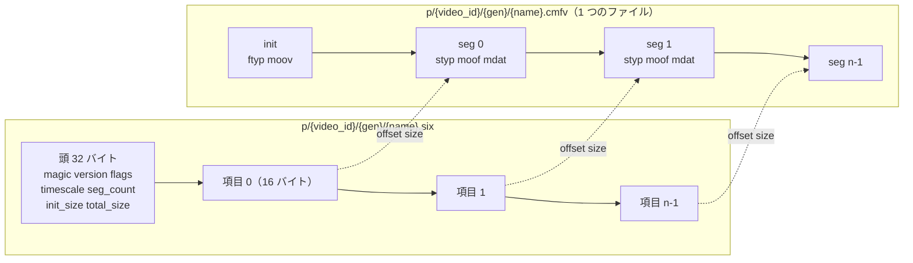
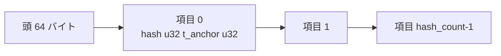
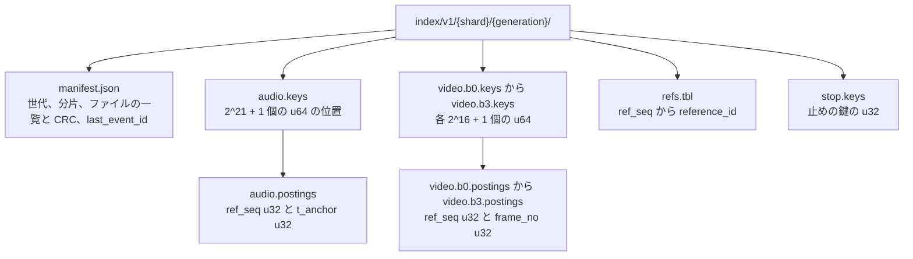

# Data model: ファイルの形式・トークン・マニフェスト・出来事

[data-model.md](../data-model.md) の一部。バイナリの形式（`SIX1`、指紋のファイル、参照の索引）、トークンの形、マニフェストのひな形、視聴の出来事（QoE を含む）とチャットのメッセージの形を、バイトと欄の単位で決める。表ではないので ER 図の代わりに構造の図とバイトの配置の表を置く。

- 形式は番号で区別し、フラグにしない（[AGENTS.md](../../../AGENTS.md)）。読む側を先に出し、2 つ前まで読めるままにする（[delivery.md](../delivery.md) の 6.5 節）。
- 各形式は試験のベクトル（黄金のファイル）で固定する（[quality.md](../../quality.md)）。この文書の配置を変えるときは番号を上げる。
- バイトの順：`SIX1` は ADR-0019 のとおりビッグエンディアン。指紋と索引のファイル（`FPA1`・`FPV1`・`FIX1`）は、メモリーに写して配列として読むため、リトルエンディアンにした（D-11、D-12）。

| 形式 | 番号 | 置き場所 | 決定 |
| --- | --- | --- | --- |
| セグメントの索引 | `SIX1`（`version` 1） | S3 `p/…/{name}.six`、`l/…/{rendition}.six` | [ADR-0019](../../decisions/0019-cmaf-files-segment-index-and-url-layout.md) |
| 音声の指紋 | `FPA1`（`fp_version` 1） | S3 `fp/…/v1.fpa` | [ADR-0043](../../decisions/0043-fingerprint-v1-hash-formats.md)（ファイルの配置はこの文書。D-11） |
| 映像の指紋 | `FPV1`（`fp_version` 1） | S3 `fp/…/v1.fpv` | 同上 |
| 参照の索引の世代 | `FIX1`（`fp_version` 1） | S3 `index/v1/{shard}/{generation}/` | [ADR-0044](../../decisions/0044-reference-index-shards-and-generations.md)（配置はこの文書。D-12） |
| 再生のトークン | `v1` | ヘッダー `<Brand>-Playback-Token` | [ADR-0023](../../decisions/0023-playback-token-and-qoe-metrics.md)（文字列の形はこの文書。D-13） |
| エッジのトークン | パスの 5 つの欄 | URL `/t/…/` | [ADR-0025](../../decisions/0025-edge-token-signing-and-cache-keys.md) |
| マニフェスト | `mf`（S1 は `1`） | 要求の時に作る | [ADR-0020](../../decisions/0020-manifest-generation-and-capability-classes.md)、[ADR-0071](../../decisions/0071-encoder-pinning-reencode-and-manifest-format-versions.md) |
| 視聴の出来事 | 封筒 `v` 1、Protobuf `WatchEvent` | HTTP `POST /v1/events`、MSK `watch-events` | [ADR-0034](../../decisions/0034-watch-event-envelope-and-ingest.md) |

## 1. レンディションのファイルと `SIX1`



**頭（32 バイト、ビッグエンディアン）**

| 位置 | 大きさ | 欄 | 値 |
| --- | --- | --- | --- |
| 0 | 4 | `magic` | `"SIX1"`（0x53 0x49 0x58 0x31） |
| 4 | 2 | `version` | 1 |
| 6 | 2 | `flags` | bit0 暗号化（`cbcs`）、bit1 ライブ（追記中。項目の `offset` は 10 秒のまとめのオブジェクトの中の位置）、他は 0 |
| 8 | 4 | `timescale` | 映像 90,000、音声 48,000 |
| 12 | 4 | `seg_count` | 項目の数 |
| 16 | 4 | `init_size` | ファイルの先頭からの `init` の大きさ（ライブは `init.mp4` を別に置き 0） |
| 20 | 8 | `total_size` | ファイルの大きさ（ライブは 0） |
| 28 | 4 | `reserved` | 0 |

**項目（1 セグメント 16 バイト）**

| 位置 | 大きさ | 欄 | 値 |
| --- | --- | --- | --- |
| 0 | 6 | `offset` | ファイルの中の位置（48 ビット、最大 256 TiB）。ライブはオブジェクト `{chunk}.cmfv`（`chunk = seq / 5`）の中の位置 |
| 6 | 4 | `size` | セグメントのバイト |
| 10 | 4 | `duration` | `timescale` の単位 |
| 14 | 2 | `flags` | bit0 先頭が IDR、bit1 埋めた区間（壊れた区間の黒と無音）、他は 0 |

- 読む側の確かめ：`magic`・`version` の一致、ファイルの大きさ ＝ 32 ＋ 16 × `seg_count`、`offset` の単調な増加（VOD）。どれかが違えば 502 にし、そのレンディションを `manifest-service` が載せない。
- 書く側は `.cmfv` を置いてから `.six` を置く（索引がファイルより先に見えない。ADR-0019）。DVR の `.six` は 60 秒ごとに書き直し、終わりに `flags` の bit1 を 0 にして閉じる。
- 大きさ：10 分の 1080p は 2,432 バイト、12 時間は約 173 KB。`origin-cache` は 8 GB まで持つ（ADR-0026）。

## 2. 音声の指紋 `FPA1`



**頭（64 バイト、リトルエンディアン）**

| 位置 | 大きさ | 欄 | 値 |
| --- | --- | --- | --- |
| 0 | 4 | `magic` | `"FPA1"` |
| 4 | 2 | `fp_version` | 1 |
| 6 | 2 | `flags` | bit0 問い合わせの側（山 1 秒 15 個。0 は参照の側の 10 個） |
| 8 | 1 | `subject_kind` | 1 動画、2 参照、3 ライブの窓 |
| 9 | 3 | `reserved` | 0 |
| 12 | 16 | `subject_id` | UUID の 16 バイト（RFC 9562 のバイトの順） |
| 28 | 4 | `sample_rate` | 11,025 |
| 32 | 2 | `window` | 1,024 |
| 34 | 2 | `hop` | 256（1 秒 43.07 枠） |
| 36 | 4 | `frame_count` | 時刻の枠の数 |
| 40 | 4 | `hash_count` | 項目の数 |
| 44 | 4 | `duration_ms` | |
| 48 | 4 | `window_no` | ライブの窓の番号（他は 0xFFFFFFFF） |
| 52 | 4 | `body_crc32c` | 項目の列の CRC32C |
| 56 | 8 | `reserved` | 0 |

**項目（8 バイト）**

| 位置 | 大きさ | 欄 | 値 |
| --- | --- | --- | --- |
| 0 | 4 | `hash` | bit31〜24 `b_a`（錨の帯 0〜174）、bit23〜17 `Δb + 48`、bit16〜11 `Δt − 4`、bit10〜0 は 0（`fp_version` 2 の予約。[copyright-matching.md](../copyright-matching.md) の 5.1 節） |
| 4 | 4 | `t_anchor` | 錨の時刻（枠の番号） |

- 並び：`(t_anchor, hash)` の昇順（窓ごとの投票で先頭から読む）。
- 大きさ：参照 1 時間 約 10.8 万項目 ≒ 0.86 MB。問い合わせ（1 秒 45）は 1 時間 約 1.3 MB。

## 3. 映像の指紋 `FPV1`

**頭（64 バイト、リトルエンディアン）**

| 位置 | 大きさ | 欄 | 値 |
| --- | --- | --- | --- |
| 0 | 4 | `magic` | `"FPV1"` |
| 4 | 2 | `fp_version` | 1 |
| 6 | 2 | `flags` | bit0 問い合わせの側（反転のハッシュを持つ）、bit1 続く似たフレームをまとめた（参照の側） |
| 8 | 1 | `subject_kind` | 1 動画、2 参照、3 ライブの窓 |
| 9 | 1 | `record_size` | 参照 16、問い合わせ 24 |
| 10 | 2 | `reserved` | 0 |
| 12 | 16 | `subject_id` | UUID |
| 28 | 2 | `sample_interval_ms` | 500（1 秒 2 枚） |
| 30 | 8 | `crop` | 上・下・左・右の黒い縁の画素（各 u16。動画で 1 つ） |
| 38 | 2 | `reserved` | 0 |
| 40 | 4 | `frame_count` | 抜いたフレームの数（情報の少ないフレームを含む） |
| 44 | 4 | `record_count` | 項目の数 |
| 48 | 4 | `duration_ms` | |
| 52 | 4 | `window_no` | ライブの窓の番号（他は 0xFFFFFFFF） |
| 56 | 4 | `body_crc32c` | |
| 60 | 4 | `reserved` | 0 |

**項目**

| 側 | 配置 | 説明 |
| --- | --- | --- |
| 参照（16 バイト） | `hash u64`、`start_frame u32`、`end_frame u32` | ハミング距離 4 以下の続くフレームを 1 つにまとめた区間 |
| 問い合わせ（24 バイト） | `hash u64`、`mirror_hash u64`、`frame_no u32`、`reserved u32` | 左右の反転のハッシュを持つ |

- 標準偏差 4 未満のフレーム（黒、白、単色）は項目を作らない。`hash` の 64 ビットは DCT の低い 8×8 の符号（直流を除く 63 個の中央値との比べ、bit0 は常に 0）。
- 並び：`start_frame`（問い合わせは `frame_no`）の昇順。

## 4. 参照の索引の世代 `FIX1`



**共通の頭（32 バイト、リトルエンディアン）**

| 位置 | 大きさ | 欄 | 値 |
| --- | --- | --- | --- |
| 0 | 4 | `magic` | `"FIX1"` |
| 4 | 2 | `kind` | 1 `audio.keys`、2 `audio.postings`、3 `video.keys`、4 `video.postings`、5 `refs.tbl`、6 `stop.keys` |
| 6 | 1 | `shard` | 0〜7 |
| 7 | 1 | `block` | 映像のブロック 0〜3（他は 0xFF） |
| 8 | 8 | `generation` | |
| 16 | 8 | `count` | 項目の数 |
| 24 | 4 | `body_crc32c` | |
| 28 | 4 | `reserved` | 0 |

| ファイル | 本体 | 大きさ（S1、1 分片） |
| --- | --- | --- |
| `audio.keys` | 鍵 `k`（21 ビット）の項目の列の始まりの位置 `u64`（項目の番号）。`k mod 8 ≠ shard` の鍵は空（前の値と同じ）。末尾に番兵 | 16 MB |
| `audio.postings` | `(ref_seq u32, t_anchor u32)`。鍵の順、鍵の中は `ref_seq` の順 | 約 11 GB |
| `video.b{n}.keys` | ブロック `n`（16 ビット）の値ごとの位置。`値 mod 8 ≠ shard` は空 | 各 0.5 MB |
| `video.b{n}.postings` | `(ref_seq u32, frame_no u32)` | 計 約 1 GB |
| `refs.tbl` | 32 バイトの行：`ref_seq u32`、`fp_version u16`、`flags u16`（bit0 有効、bit1 ライブの照合）、`reference_id` 16 バイト、`duration_ms u32`、`reserved u32` | 数十 MB（全分片で同じ） |
| `stop.keys` | 止めの鍵（項目 20 万を超える鍵）の `u32` の昇順 | 数 KB |

- `manifest.json`：`{"fix":1,"fp_version":1,"shard":3,"generation":1712,"files":[{"name":"audio.keys","bytes":…,"crc32c":"…"}],"ref_count":…,"last_event_id":"…","created_at":"…"}`。`index_generations` の行と同じ値。
- 読み込み：`manifest.json` の CRC で全ファイルを確かめ、`mmap` で読む。読み込みの後、`last_event_id` より後の `reference_activated`・`reference_deactivated` を差分の索引に当ててから問い合わせを受ける（[copyright-matching.md](../copyright-matching.md) の 7.3 節）。
- 除外の区間（`reference_exclusions`）の項目と、無効の参照は書かない。

## 5. トークンと秘密の形

### 5.1 再生のトークン（`<Brand>-Playback-Token`）

```
v1.{kid}.{payload}.{sig}
  kid     = 鍵の番号（英小文字と数字、1〜4 文字）
  payload = base64url(JSON。下の欄、キーの順は固定)
  sig     = base64url(Ed25519(秘密鍵[kid], "v1." + kid + "." + payload))（86 文字）
```

| 欄 | 型 | 中身 |
| --- | --- | --- |
| `v` | 文字列 | `video_id`（経路の形、32 文字） |
| `u` | 文字列 | 利用者の ID のハッシュ（匿名は端末の識別子のハッシュ）。base64url 16 バイト |
| `d` | 文字列 | 端末の識別子のハッシュ。base64url 16 バイト |
| `caps` | 文字列 | 能力の組（`h-m`、`a-2160`、`a-1080-d`） |
| `rg` | 文字列 | 許す地域（`jp`・`*`） |
| `drm` | 文字列か `null` | `wv-sw`・`wv-hw`・`pr-hw`・`fp` |
| `sid` | 文字列 | 再生のセッション（UUIDv7、32 文字） |
| `iat`・`exp` | 整数 | UNIX 秒。`exp = iat + 36,000`（10 時間） |
| `cn` | 整数 | 見張りの印（1 は `canary`。B08） |

- 確かめる側：`event-collector`（`v` と `sid` を出来事と照らす）、`license-proxy`、`api`。大きさは約 330 バイト。
- 鍵は 2 つを並べ 30 日で回す（Secrets Manager `playback-token/{kid}`）。

### 5.2 エッジのトークン（パスの頭）

```
/t/{kid}.{exp}.{caps}.{rg}.{sig}/v/{video_id}/{gen}/{rendition}/{seq}.m4s
/t/{kid}.{exp}.{caps}.{rg}.{sig}/m/{mf}/{video_id}/{caps}/master.m3u8
/t/{kid}.{exp}.{caps}.{rg}.{sig}/l/{video_id}/{caps}/{rendition}/index.m3u8
  kid  = 1 文字（[0-9a-z]）
  exp  = 期限の UNIX 秒の 36 進（小文字）
  caps = 能力の組
  rg   = jp・*
  sig  = base64url(HMAC-SHA256(key[kid], video_id + "|" + caps + "|" + rg + "|" + exp)) の先頭 22 文字（128 ビット）
         exp はパスと同じ 36 進の文字列
```

- 期限は 6 時間。`video_id` はパスの `/v/`・`/m/{mf}/`・`/l/` の後の 32 文字から取る（ライブのパスも `video_id` にした。D-30）。
- エッジの関数の順：`exp` → `k:{kid}` で `sig` → `b:{video_id}` → `t:{sig の先頭 16 文字}` → 視聴者の国と `rg` → `/m/`・`/l/` は `caps` の一致 → `/t/…` を外してキャッシュの鍵にする。
- 1 つの欄に `.` と `/` を使わない（`caps` の区切りは `-`）。

### 5.3 ストリームキーと SRT

| 値 | 形 | 持つもの |
| --- | --- | --- |
| ストリームキー | `<brand>_sk_` ＋ base62 の乱数 32 文字（約 190 ビット）＋ base62 の 6 文字（`<brand>_sk_` と乱数の CRC32） | `stream_keys.sha256`（全体の SHA-256）だけ |
| RTMPS | `rtmps://ingest.<brand>.<domain>:443/live/{stream_key}`（予備は `?backup=1`） | — |
| SRT | `srt://ingest.<brand>.<domain>:9000?streamid=#!::r={stream_key},m=publish[,b=1]&passphrase={passphrase}` | パスフレーズ（32 文字）を `stream_keys.srt_passphrase_wrapped` |

- チェックサムでシークレットスキャンと打ち間違いを早く見分ける（リポジトリ共通の ADR-0006）。キーをログに出さない。

### 5.4 アクセストークンと更新のトークン

| トークン | 形 | 持つもの | 期限 |
| --- | --- | --- | --- |
| アクセス | `<brand>_at_{session}.{secret}`（`session` は `session_id` の 22 文字、`secret` は 32 バイトの乱数の base64url） | Valkey `sess:{session_id}` の `at_hash`（SHA-256） | 15 分 |
| 更新 | `<brand>_rt_{secret}`（32 バイトの乱数の base64url） | `refresh_tokens.token_hash`（SHA-256） | 30 日（未使用 14 日） |

- 両方とも不透明な値で、中身を利用者に読ませない。接頭辞はシークレットスキャンのため（D-13）。

### 5.5 外への通知の署名

```
<Brand>-Signature: t={unix},k={kid},v1={hex(HMAC-SHA256(key[kid], t + "." + 本文))}
```

- 鍵は 2 つ（Secrets Manager `outbound-signing/{kid}`）。受け手は 5 分より古い `t` を拒む。

## 6. マニフェスト（`mf` 1）

URL は [packaging-and-drm.md](../packaging-and-drm.md) の 4.4 節。本文に利用者ごとの値を入れない（CDN で共有する）。下は値の入る位置を `{…}` で示したひな形で、例は同 5.3・5.4 節。

**HLS のマスター（`/m/1/{video_id}/{caps}/master.m3u8`）**

```
#EXTM3U
#EXT-X-VERSION:7
#EXT-X-INDEPENDENT-SEGMENTS
#EXT-X-MEDIA:TYPE=AUDIO,GROUP-ID="aac",NAME="main",LANGUAGE="{lang}",DEFAULT=YES,AUTOSELECT=YES,CHANNELS="2",URI="a-aac128/index.m3u8"
#EXT-X-MEDIA:TYPE=AUDIO,GROUP-ID="he",NAME="main",LANGUAGE="{lang}",DEFAULT=YES,AUTOSELECT=YES,CHANNELS="2",URI="a-heaac48/index.m3u8"
#EXT-X-MEDIA:TYPE=SUBTITLES,GROUP-ID="sub",NAME="{lang} {kind}",LANGUAGE="{lang}",AUTOSELECT=YES,URI="cap-{lang}-{kind}/index.m3u8"
#EXT-X-STREAM-INF:BANDWIDTH={peak_bps+audio},AVERAGE-BANDWIDTH={avg_bps+audio},CODECS="{video_codec},{audio_codec}",RESOLUTION={w}x{h},FRAME-RATE={fps},AUDIO="{aac|he}",SUBTITLES="sub"
{name}/index.m3u8
```

- 段は `renditions` の `active_gen` の `ready` の行から、`caps` で絞る（[packaging-and-drm.md](../packaging-and-drm.md) の 5.2 節）。DRM の組（`-d`）は `EXT-X-SESSION-KEY` を足し、`-cbcs` の段だけを載せる。

**HLS のメディア（VOD、`/m/1/{video_id}/{caps}/{name}/index.m3u8`）**

```
#EXTM3U
#EXT-X-VERSION:7
#EXT-X-TARGETDURATION:{ceil(最大の duration)}
#EXT-X-PLAYLIST-TYPE:VOD
#EXT-X-MEDIA-SEQUENCE:0
#EXT-X-INDEPENDENT-SEGMENTS
#EXT-X-MAP:URI="../../../../../v/{video_id}/{gen}/{name}/init.mp4"
#EXTINF:{duration / timescale},
../../../../../v/{video_id}/{gen}/{name}/{seq}.m4s
…
#EXT-X-ENDLIST
```

**DASH（`/m/1/{video_id}/{caps}/manifest.mpd`）**：`type="static"`、`profiles="urn:mpeg:dash:profile:isoff-live:2011"`、映像・音声・字幕の `AdaptationSet`、`SegmentTemplate`（`initialization` と `media` は `../../../../v/{video_id}/{gen}/$RepresentationID$/…`、`startNumber="0"`）と `SegmentTimeline`（`SIX1` の `duration` を `S@d` に、同じ長さの続きは `r`）。

**LL-HLS のメディア（`/l/{video_id}/{caps}/{rendition}/index.m3u8`）**

```
#EXTM3U
#EXT-X-VERSION:{ll_hls_version}
#EXT-X-TARGETDURATION:2
#EXT-X-SERVER-CONTROL:CAN-BLOCK-RELOAD=YES,PART-HOLD-BACK={1.5|1.503},HOLD-BACK=6,CAN-SKIP-UNTIL=12
#EXT-X-PART-INF:PART-TARGET={0.5|0.501}
#EXT-X-MEDIA-SEQUENCE:{最初の msn}
#EXT-X-MAP:URI="init.mp4"
#EXT-X-PROGRAM-DATE-TIME:{start_ts + msn × 2 秒}
#EXTINF:{秒},
{msn}.m4s
#EXT-X-PART:DURATION={秒},URI="{msn}.{part}.m4s"[,INDEPENDENT=YES]
#EXT-X-PRELOAD-HINT:TYPE=PART,URI="{msn}.{next_part}.m4s"
```

- `{ll_hls_version}` は `ll-hls-poc` で決める（仮 9。**未検証**）。`EXT-X-PROGRAM-DATE-TIME` の追加は `mf` を上げる変更として出した（[ADR-0030](../../decisions/0030-ll-hls-parameters-and-live-origin.md) の注記）。
- プレミア公開は VOD の索引から壁の時計に合わせた滑る窓（4 秒のセグメント、`HOLD-BACK` 12 秒、`EXT-X-PROGRAM-DATE-TIME`）を作る。

## 7. 視聴の出来事（QoE を含む）

### 7.1 端末から `event-collector` へ（HTTP）

`POST /v1/events`、ヘッダー `<Brand>-Playback-Token`、本文は JSON（最大 50 件・64 KB）。

```json
{
  "v": 1,
  "events": [
    {"sid": "0192…", "seq": 0, "type": "play_intent", "t_client": 1760083200000,
     "pos_ms": 0, "src": "home", "auto": false, "request_id": "0193…"},
    {"sid": "0192…", "seq": 1, "type": "first_frame", "t_client": 1760083200950,
     "pos_ms": 0, "start_ms": 950, "rung": "h720-c24"},
    {"sid": "0192…", "seq": 2, "type": "hb", "t_client": 1760083210950, "pos_ms": 10000,
     "iv": [[0, 10000]], "rate": 1000, "vis": 10000, "muted": 0,
     "rung_ms": {"h720-c24": 4000, "h1080-c24": 6000}, "dropped_bytes": 0, "est_bps": 8200000}
  ]
}
```

| `type` | 型ごとの欄 | 出典 |
| --- | --- | --- |
| `play_intent` | `src`（`home`・`next`・`search`・`subs`・`notif`・`channel`・`playlist`・`embed`・`external`・`other`）、`auto`、`request_id` | [ADR-0034](../../decisions/0034-watch-event-envelope-and-ingest.md) |
| `first_frame` | `start_ms`（再生の前の広告を除く）、`rung`。ADR-0007 の `play_start` を兼ねる | [ADR-0023](../../decisions/0023-playback-token-and-qoe-metrics.md) |
| `start_failure` | `error_code` | 同上 |
| `hb`（心拍） | `iv`（最大 8 区間）、`rate`（千分率。1,000 が等速）、`vis`・`muted`（ミリ秒）、`rung_ms`（段ごとのミリ秒）、`dropped_bytes`、`est_bps`、`lat_ms`（ライブだけ） | 同上、[ADR-0067](../../decisions/0067-sli-sources-and-computation.md) |
| `seek` | `from_ms`・`to_ms` | — |
| `quality_change` | `from_rung`・`to_rung`・`reason`（`abr`・`manual`） | — |
| `rebuffer` | `stall_ms`・`rung`・`buffer_ms` | [ADR-0023](../../decisions/0023-playback-token-and-qoe-metrics.md) |
| `ad_impression`・`ad_quartile`・`ad_complete`・`ad_click` | `ad`（`{"imp_id":…,"break":"pre"}`。Protobuf は `Ad.ad_break`）、`quartile`、`vis`（ミリ秒） | [ADR-0055](../../decisions/0055-ad-decision-vmap-and-server-side-ad-request.md) |
| `end` | `iv`、`reason`（`completed`・`user_stop`・`navigate`） | — |

- 題・URL の全体・検索の語・IP・広告の ID・端末の固有の識別子を入れない（[ADR-0068](../../decisions/0068-qoe-privacy-limits-cdn-logs-and-selfmon.md)）。欄の名前は ADR-0034 のまま（`rate`・`vis`・`muted`）で、速さは浮動小数点を避けて千分率の整数、`vis`・`muted` はミリ秒の整数にした（D-31）。Protobuf では単位を名前に付ける（`rate_milli`・`vis_ms`・`muted_ms`）。

### 7.2 MSK `watch-events`（Protobuf）

`event-collector` がトークンを確かめ、IP を粗くし、ASN と都道府県を足して 1 件ずつ書く。

```protobuf
syntax = "proto3";
package brand.watch.v1;

message WatchEvent {
  uint32 v = 1;                 // 1
  bytes video_id = 2;           // 16 bytes
  bytes sid = 3;                // 16 bytes
  uint32 seq = 4;
  Type type = 5;
  int64 t_client_ms = 6;
  int64 recv_at_ms = 7;
  int64 pos_ms = 8;
  repeated Interval iv = 9;     // max 8
  uint32 rate_milli = 10;
  uint32 vis_ms = 11;
  uint32 muted_ms = 12;
  Source src = 13;
  bool auto_play = 14;
  bytes request_id = 15;
  Ad ad = 16;
  Qoe qoe = 17;
  bytes viewer_key = 18;        // user hash or re-hashed device hash
  bytes user_hash = 19;
  bytes device_hash = 20;       // re-hashed with the daily salt
  string ip_prefix = 21;        // /24 or /48
  uint32 asn = 22;
  string pref = 23;             // prefecture code
  string ua_class = 24;
  string device_model = 25;
  string device_class = 26;
  string player_version = 27;
  string cdn = 28;
  string caps = 29;
  bool canary = 30;
  bytes ip_raw_enc = 31;        // hourly data key, dropped after 1 hour
  uint32 ip_key_id = 32;
  Mode mode = 33;               // VOD, LOW_LATENCY, NORMAL
  Codec codec = 34;             // H264, AV1
}

message Interval { int64 from_ms = 1; int64 to_ms = 2; }
message Ad { bytes imp_id = 1; string ad_break = 2; uint32 quartile = 3; }
message Qoe {
  uint32 start_ms = 1; string rung = 2; uint32 stall_ms = 3; uint32 buffer_ms = 4;
  map<string, uint32> rung_ms = 5; uint64 dropped_bytes = 6; uint64 est_bps = 7;
  sint32 lat_ms = 8; string error_code = 9; string from_rung = 10; string to_rung = 11;
}
```

- 欄は足すだけ（番号を再利用しない）。`ip_raw_enc` は流れの判定の間（1 時間）だけで、Iceberg に書かない。
- `watch-events-rejected` は `{v, reason_code, video_id, recv_at_ms}` だけ（中身を捨てる）。

## 8. チャットのメッセージ

| 置き場所 | 形 | 欄 |
| --- | --- | --- |
| WebSocket の送信 | JSON `{"op":"send","client_msg_id":"…","text":"…","lag_ms":4000}` | `lag_ms` は送り手のライブの端からの遅れ（0〜30 秒に丸める） |
| MSK `chat-in` | Protobuf `ChatIn` | `stream_id`、`client_msg_id`、`user_id`、`author_channel_id`、`text`、`received_at_ms`、`lag_ms`、`held`（ブロックの語・リンク）、`member_tier` |
| MSK `chat-log`、Valkey `chat:{stream_id}` | Protobuf `ChatLog` | `ChatIn` の欄に `seq`、`kind`（`message`・`delete`・`timeout`・`ban`・`hold`・`release`）、`target_seq`、`video_offset_ms`、`top_score` |
| まとめの送信 | 1 フレームの JSON（圧縮）`{"s":[seq…],"m":[{"q":seq,"c":channel,"n":"表示名","t":"本文","b":[badges]}],"d":[削除の seq]}` | 1 秒（1,000 人未満は 250 ms）ごと |
| S3 のリプレイ `p/{video_id}/chat/{n}.json.gz` | `{"v":1,"from_ms":…,"to_ms":…,"items":[{"o":video_offset_ms,"c":channel,"n":"表示名","t":"本文"}]}` | 30 秒ごと。削除・保留のまま・締め出しで消したメッセージを除く |

- `seq = max(前の seq + 1, 今のミリ秒 × 1024)`（[ADR-0032](../../decisions/0032-chat-sequencer-and-batched-fanout.md)）。`video_offset_ms = 受けた時刻 − 配信の開始 − lag_ms`（[ADR-0033](../../decisions/0033-chat-rate-limits-slow-mode-and-moderation.md)）。
