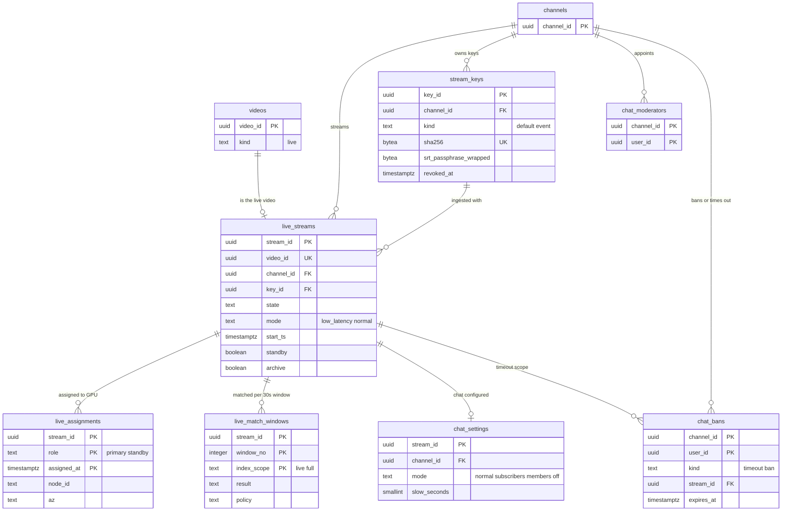

# Data model: ライブとライブチャット

[data-model.md](../data-model.md) の一部。規約はそちらの 3 節に従う。振る舞いは [live-streaming.md](../live-streaming.md)（4〜9 節）と [live-chat.md](../live-chat.md)（5〜8 節）を正とする。決定は [ADR-0006](../../decisions/0006-live-ingest-and-latency.md)（取り込みと遅延）、[ADR-0028](../../decisions/0028-live-ingest-keys-backup-and-source-recording.md)（ストリームキーと元の流れ）、[ADR-0029](../../decisions/0029-live-transcoder-placement-and-standby.md)（変換器の置き方）、[ADR-0030](../../decisions/0030-ll-hls-parameters-and-live-origin.md)（LL-HLS）、[ADR-0031](../../decisions/0031-dvr-storage-and-live-to-vod.md)（DVR と VOD）、[ADR-0032](../../decisions/0032-chat-sequencer-and-batched-fanout.md)（チャットの順番付け）、[ADR-0033](../../decisions/0033-chat-rate-limits-slow-mode-and-moderation.md)（上限とモデレーション）。

| 表・置き場所 | スキーマ | 書く |
| --- | --- | --- |
| `live_streams`、`stream_keys` | `live` | `svc_api`（作成・設定・キー。`can()` を通す）、`svc_live`（状態の遷移） |
| `live_assignments` | `live` | `svc_live`（`live-ingest` の割り当て） |
| `live_match_windows` | `live` | `svc_match`（`match-engine-live`） |
| `chat_settings`、`chat_moderators`、`chat_bans` | `live` | `svc_api`（配信者・モデレーター）、`svc_chat`（自動の低速モード） |
| ブロックの語 | `social` | `channel_blocked_terms`・`system_blocked_terms`（[comments-and-moderation.md](comments-and-moderation.md) の 2.6 節。D-8） |
| チャットのメッセージ | Aurora に置かない | MSK `chat-in`・`chat-log`、Valkey `chat:`、Iceberg `chat_log`、S3 のリプレイ（[stores.md](stores.md) の 1・3・4・5 節） |
| DVR、元の流れ | S3 `l/`・`live-src/` | `live-transcoder`・`live-ingest`（[stores.md](stores.md) の 3 節） |

- ライブの配信は `videos` の行（`kind = 'live'`）を 1 つ持ち、配信の終わりにその行がアーカイブの VOD になる。`playable()` は配信中もアーカイブも同じ `video_id` で判定する。
- ストリームキーは SHA-256 だけを持ち、平文を持たない。SRT のパスフレーズは `kms-secrets` で包む（ADR-0028）。
- チャットの本文は MSK・Valkey・Iceberg・リプレイのファイルにだけ置き、Aurora・ログ・指標に入れない（[AGENTS.md](../../../AGENTS.md)）。

## 1. ER 図

- `stream_keys ||--o{ live_streams`：配信は接続に使ったキーを持つ。予約の配信のキー（`kind = 'event'`）は 1 つの配信だけに使う。
- `live_streams ||--o{ chat_bans`：タイムアウトはその配信だけ（`stream_id` を持つ）、締め出しはチャンネルの全部の配信（`stream_id` が NULL。任意の参照）。

## 2. 表

### 2.1 `live_streams`

配信（[live-streaming.md](../live-streaming.md) の 5 節の状態の機械）。チャンネルの表。

| 列 | 型 | NULL | 既定 | 説明 |
| --- | --- | --- | --- | --- |
| `stream_id` | `uuid` | NOT NULL | `uuidv7()` | |
| `video_id` | `uuid` | NOT NULL | — | 同じトランザクションで `videos`（`kind = 'live'`）を作る |
| `channel_id` | `uuid` | NOT NULL | — | |
| `key_id` | `uuid` | NULL | — | 接続に使ったストリームキー |
| `state` | `text` | NOT NULL | `'created'` | `created`・`ready`・`connecting`・`live`・`interrupted`・`ending`・`ended`・`archiving`・`archived`・`blocked`・`terminated` |
| `mode` | `text` | NOT NULL | `'low_latency'` | `low_latency`・`normal`（4K は `normal` だけ） |
| `live_ladder_version` | `integer` | NOT NULL | `1` | |
| `scheduled_at` | `timestamptz` | NULL | — | 予約の開始 |
| `start_ts` | `timestamptz` | NULL | — | 入力の時刻の原点（`msn = floor((入力の時刻 − start_ts) / 2 秒)`） |
| `started_at`・`ended_at` | `timestamptz` | NULL | — | |
| `interrupted_at` | `timestamptz` | NULL | — | 180 秒の判定の起点 |
| `expected_viewers` | `integer` | NULL | — | 予想の視聴（同時に動く予備と桶の判定。催しの準備で入れる） |
| `standby` | `boolean` | NOT NULL | `false` | 別の AZ で同時に動く予備があるか |
| `hot_bucketed` | `boolean` | NOT NULL | `false` | 視聴の出来事を始めから `video_id#bucket` にする（ADR-0034 の注記） |
| `dvr_window_s` | `integer` | NOT NULL | `43200` | DVR の窓（配信者が切れる） |
| `block_count` | `smallint` | NOT NULL | `0` | 照合のブロックでの差し替えの回数（3 回目で `blocked`） |
| `replacing_since` | `timestamptz` | NULL | — | 差し替えの画面を流している起点 |
| `archive` | `boolean` | NOT NULL | `true` | 配信の終わりにアーカイブにするか |
| `archive_regen` | `text` | NULL | — | VOD のラダーを作り直す理由：`views_7d`・`channel`・`av1`（作らないアーカイブは NULL。ADR-0031 の注記） |
| `archive_from_ms` | `bigint` | NULL | — | 12 時間を超えた配信のアーカイブの始まりの位置 |
| `state_version` | `bigint` | NOT NULL | `0` | |
| `created_at`・`updated_at` | `timestamptz` | NOT NULL | `now()` | |

- キー：PK `(stream_id)`。UK `(video_id)`。FK `channel_id → channels`、`key_id → stream_keys`、`video_id → videos`。
- 索引：`(channel_id, state)` — Studio と同時の配信の数。`(state) WHERE state IN ('connecting','live','interrupted','ending','archiving')` — 進行中の配信の監視。`(scheduled_at) WHERE state = 'ready'` — 予約の通知。
- CHECK：
  - UK `(channel_id) WHERE state IN ('connecting','live','interrupted','ending')`（チャンネルあたり同時に 1 つ）。
  - `state NOT IN ('live','interrupted','ending','ended') OR start_ts IS NOT NULL`。
  - `dvr_window_s BETWEEN 0 AND 43200`、`block_count BETWEEN 0 AND 3`。
- 遷移は条件つきの `UPDATE ... WHERE state = $prev` と outbox の `live_state_changed`（通知、チャット、`playable()` の写し）を同じトランザクションで書く。
- RLS（FORCE）：チャンネルの表。`svc_live`・`svc_match`・`svc_chat`・`svc_relay` に全行。
- 保持：アーカイブの動画と同じ。アーカイブのない配信は終わりから 90 日。S1 の量：平均 400 配信 × 1 配信 2 時間と見込み、約 175 万行/年。

### 2.2 `stream_keys`

| 列 | 型 | NULL | 既定 | 説明 |
| --- | --- | --- | --- | --- |
| `key_id` | `uuid` | NOT NULL | `uuidv7()` | |
| `channel_id` | `uuid` | NOT NULL | — | |
| `kind` | `text` | NOT NULL | — | `default`（使い回す）・`event`（予約の配信ごと） |
| `stream_id` | `uuid` | NULL | — | `kind = 'event'` のとき |
| `sha256` | `bytea` | NOT NULL | — | `<brand>_sk_…` の全体の SHA-256（[formats.md](formats.md) の 5.3 節） |
| `srt_passphrase_wrapped` | `bytea` | NOT NULL | — | SRT のパスフレーズ（32 文字）を `kms-secrets` で包んだ値 |
| `created_by` | `uuid` | NOT NULL | — | |
| `created_at` | `timestamptz` | NOT NULL | `now()` | |
| `revoked_at` | `timestamptz` | NULL | — | 失効から 5 秒で接続を切る |
| `revoke_reason` | `text` | NULL | — | `rotated`・`leak_report`・`account_locked`・`channel_terminated` |

- キー：PK `(key_id)`。UK `(sha256)`。UK `(channel_id) WHERE kind = 'default' AND revoked_at IS NULL`。
- 索引：`(channel_id) WHERE revoked_at IS NULL` — アカウントの `locked` で全キーを失効する（`stream_keys_revoked`）。
- CHECK：`octet_length(sha256) = 32`、`(kind = 'event') = (stream_id IS NOT NULL)`。
- `live-ingest` はキーの SHA-256 で引く（`svc_live` の SELECT は `sha256` の一致だけを許す関数を通す）。キーの表示は作成の時の 1 回で、再表示は再発行と同じ。
- RLS（FORCE）：チャンネルの表。保持：失効から 1 年（漏えいの調べ）。S1 の量：約 10 万行。

### 2.3 `live_assignments`

| 列 | 型 | NULL | 既定 | 説明 |
| --- | --- | --- | --- | --- |
| `stream_id` | `uuid` | NOT NULL | — | |
| `role` | `text` | NOT NULL | — | `primary`・`standby` |
| `assigned_at` | `timestamptz` | NOT NULL | `now()` | |
| `node_id` | `text` | NOT NULL | — | GPU のインスタンスの ID |
| `gpu_slot` | `smallint` | NOT NULL | — | 1 枚の GPU の中の位置（0〜5） |
| `az` | `text` | NOT NULL | — | `apne1-az1`・`az2`・`az4` |
| `released_at` | `timestamptz` | NULL | — | |
| `release_reason` | `text` | NULL | — | `ended`・`node_failed`・`spot_drain`・`rebalanced` |

- キー：PK `(stream_id, role, assigned_at)`。索引 `(node_id) WHERE released_at IS NULL` — ノードの詰め具合と停止の時の付け替え。UK `(stream_id, role) WHERE released_at IS NULL`。
- CHECK：同じ配信の主と予備は別の AZ（トリガー）。RLS：なし。保持：90 日。S1 の量：約 50 万行（90 日）。

### 2.4 `live_match_windows`

| 列 | 型 | NULL | 既定 | 説明 |
| --- | --- | --- | --- | --- |
| `stream_id` | `uuid` | NOT NULL | — | |
| `window_no` | `integer` | NOT NULL | — | 30 秒の窓の番号（`start_ts` から） |
| `index_scope` | `text` | NOT NULL | — | `live`（ライブの照合の参照だけ）・`full`（アーカイブの判定の後ろの照合） |
| `result` | `text` | NOT NULL | — | `no_match`・`matched`・`unavailable` |
| `policy` | `text` | NULL | — | 当たった方針の最も強い動作：`track`・`monetize`・`block` |
| `match_count` | `smallint` | NOT NULL | `0` | 一致の数（一致の行は `matches` に `source = 'live'` で書く） |
| `checked_at` | `timestamptz` | NOT NULL | `now()` | |

- キー：PK `(stream_id, window_no, index_scope)`。索引 `(stream_id, index_scope, window_no DESC)` — 2 つの窓の続きの判定。
- RLS：なし（システムの表）。保持：配信の終わりから 90 日。S1 の量：1 時間 120 窓 × 2、約 4,000 万行（90 日）。

### 2.5 `chat_settings`

| 列 | 型 | NULL | 既定 | 説明 |
| --- | --- | --- | --- | --- |
| `stream_id` | `uuid` | NOT NULL | — | |
| `channel_id` | `uuid` | NOT NULL | — | RLS の列 |
| `mode` | `text` | NOT NULL | `'normal'` | `normal`・`subscribers`・`members`・`off` |
| `subscribers_min_minutes` | `integer` | NOT NULL | `10` | 登録者だけのモードの登録からの時間 |
| `slow_seconds` | `smallint` | NOT NULL | `0` | 0 は低速モードなし。1〜300 |
| `auto_slow` | `boolean` | NOT NULL | `true` | 自動の低速モードを許す |
| `auto_slow_until` | `timestamptz` | NULL | — | 自動の低速モード（5 秒）を入れている間 |
| `links_held` | `boolean` | NOT NULL | `true` | リンクを保留 |
| `updated_by`・`updated_at` | `uuid`・`timestamptz` | NULL・NOT NULL | — | |

- キー：PK `(stream_id)`。CHECK：`slow_seconds BETWEEN 0 AND 300`。子ども向けの動画の配信は `mode = 'off'`（トリガー）。
- Gateway は Valkey `chat:{stream_id}:cfg`（[stores.md](stores.md) の 1 節）の写しを読む。RLS（FORCE）：チャンネルの表。保持：配信と同じ。S1 の量：配信と同じ。

### 2.6 `chat_moderators`・`chat_bans`

| 表 | 列 | キー・索引 | 説明 |
| --- | --- | --- | --- |
| `chat_moderators` | `channel_id uuid`、`user_id uuid`、`granted_by uuid`、`granted_at timestamptz` | PK `(channel_id, user_id)` | 所有者が指名する。コメントのモデレーター（`channel_user_lists` の `moderator`）とは別の一覧 |
| `chat_bans` | `channel_id uuid`、`user_id uuid`、`kind text`（`timeout`・`ban`）、`stream_id uuid NULL`、`expires_at timestamptz NULL`、`banned_by uuid`、`purge_messages boolean`、`created_at` | PK `(channel_id, user_id)`、索引 `(expires_at) WHERE expires_at IS NOT NULL` | 1 人につき今の止めを 1 行（新しい止めで置き換える）。タイムアウトの長さは 10 秒〜24 時間 |

- CHECK（`chat_bans`）：`(kind = 'timeout') = (stream_id IS NOT NULL AND expires_at IS NOT NULL)`。
- Gateway は Valkey `chat:{stream_id}:ban:{user_id}` の写しで判定する（期限つき）。
- RLS（FORCE）：チャンネルの表。保持：`chat_bans` は期限の後 30 日で消す（締め出しは解くまで）。S1 の量：`chat_moderators` 約 10 万、`chat_bans` 約 50 万。
