# Data model: 収益化・台帳・支払い

[data-model.md](../data-model.md) の一部。規約はそちらの 3 節（金額は 3.5 節）に従う。振る舞いは [monetization-and-payouts.md](../monetization-and-payouts.md)（3〜9 節）を正とする。決定は [ADR-0055](../../decisions/0055-ad-decision-vmap-and-server-side-ad-request.md)（広告の判断）、[ADR-0056](../../decisions/0056-channel-memberships-via-payment-provider.md)（メンバーシップ）、[ADR-0057](../../decisions/0057-revenue-ledger-share-calculation-and-rounding.md)（台帳と丸め）、[ADR-0058](../../decisions/0058-payouts-via-provider-and-tax-profile.md)（支払いと税）。税と分配の法的な扱いは**法務の確認待ち（L7）**。

| 表 | スキーマ | 書く |
| --- | --- | --- |
| `monetization_status`、`eligibility_daily` | `money` | `svc_ledger`（毎日 JST 8:00 の判定）、運用の審査 |
| `ad_impressions`、`ad_server_reports` | `money` | `ad-decision`（`svc_ads`。表示の ID の作成）、`svc_views`（有効の判定）、`svc_ledger`（報告の取り込み） |
| `membership_tiers`、`memberships`、`provider_events` | `money` | `svc_api`（段の設定、購入の開始）、`svc_ledger`（事業者の webhook と 1 時間ごとの突き合わせ） |
| `ledger_entries`、`ledger_lines`、`closed_months` | `money` | `svc_ledger` だけ（追記だけ） |
| `payout_accounts`、`payouts`、`statements`、`tax_profiles`、`withholding_rules` | `money` | `svc_ledger`、`svc_api`（所有者の操作。`can()` と再確認） |

- **積み上げは確定の数だけから作る**。広告の分配は `view_counts_daily`（1 日の確定）と有効な表示（B07 の後）と広告サーバーの確定の報告（D＋3）が揃った動画・日だけを積む（ADR-0007、[data-model.md](../data-model.md) の 6 節）。
- 金額はマイクロ円の整数（`*_micro_jpy`、1 円 ＝ 1,000,000）。支払いと明細だけ円の整数（`*_jpy`）。率は基本点（`*_bps`）。浮動小数点を使わない（3.5 節）。
- 締めた月の仕訳は書き換えない。直しは知った日の調整の仕訳にする（ADR-0057）。
- カードの情報・口座の番号は持たない。事業者の ID と状態だけ（ADR-0056、ADR-0058）。

## 1. ER 図

```mermaid
erDiagram
    channels ||--o| monetization_status : "monetization state"
    channels ||--o{ eligibility_daily : "eligibility per day"
    videos ||--o{ ad_impressions : "ad slots shown"
    ad_impressions ||--o| ad_server_reports : "billed as"
    channels ||--o{ membership_tiers : "offers"
    membership_tiers ||--o{ memberships : "subscribed at"
    accounts ||--o{ memberships : "member of"
    provider_events ||--o{ memberships : "advances (logical)"
    ledger_entries ||--|{ ledger_lines : "balanced lines"
    closed_months ||--o{ ledger_entries : "closes month"
    payout_accounts ||--o{ payouts : "paid to"
    payouts ||--o{ ledger_entries : "posted as"
    payout_accounts ||--o{ statements : "monthly statement"
    payout_accounts ||--o| tax_profiles : "tax profile"
    withholding_rules ||--o{ payouts : "applied"

    channels {
        uuid channel_id PK
    }
    videos {
        uuid video_id PK
    }
    accounts {
        uuid account_id PK
    }
    monetization_status {
        uuid channel_id PK
        text state "ineligible eligible reviewing active suspended"
        integer share_bps_ads
        integer share_bps_commerce
        integer contract_version
    }
    eligibility_daily {
        uuid channel_id PK
        date day PK
        bigint subscribers_verified
        bigint public_watch_ms_12m
    }
    ad_impressions {
        uuid imp_id PK
        uuid video_id FK
        date day
        text ad_break "pre mid post"
        boolean valid
        bigint billed_micro_jpy
    }
    ad_server_reports {
        date report_date PK
        uuid imp_id PK
        bigint billed_micro_jpy
        boolean final
    }
    membership_tiers {
        uuid tier_id PK
        uuid channel_id FK
        integer price_jpy
    }
    memberships {
        uuid membership_id PK
        uuid user_id FK
        uuid channel_id FK
        uuid tier_id FK
        text state
        timestamptz valid_until
        text provider_subscription_id UK
    }
    provider_events {
        text provider_event_id PK
        text type
        text result
    }
    ledger_entries {
        integer yyyymm PK
        uuid entry_id PK
        text idempotency_key UK
        text kind
        date day
    }
    ledger_lines {
        integer yyyymm PK
        uuid entry_id PK
        smallint line_no PK
        text account
        bigint debit_micro_jpy
        bigint credit_micro_jpy
    }
    closed_months {
        integer yyyymm PK
        timestamptz closed_at
    }
    payout_accounts {
        text party PK
        text provider_account_id UK
        text state
    }
    payouts {
        uuid payout_id PK
        text party FK
        integer yyyymm
        bigint gross_jpy
        bigint withholding_jpy
        bigint net_jpy
        text state "scheduled submitted paid failed returned"
    }
    statements {
        text party PK
        integer yyyymm PK
        timestamptz published_at
    }
    tax_profiles {
        text party PK
        text entity_kind "individual corporation"
        text withholding_category
    }
    withholding_rules {
        text category PK
        date valid_from PK
        integer rate_bps
    }
```

- `party` は相手の文字列：`creator:{channel_id}`・`owner:{rights_owner_id}`（3.5 節）。`payout_accounts`・`payouts`・`statements`・`tax_profiles` は RLS のために `channel_id`・`rights_owner_id` のどちらか 1 つも持つ。
- `provider_events ||--o{ memberships` は「事業者の出来事が会員の状態を進める」の論理の関係（出来事の本文の参照の ID で結ぶ。外部キーを張らない）。
- `payouts ||--o{ ledger_entries`：支払いの仕訳（送金、入金の完了、組戻し）の `source_ref` が `payout_id` を持つ論理の参照。
- `ledger_entries`・`ledger_lines` は `yyyymm` で分割し、外部キーは同じ分割の中の `(yyyymm, entry_id)` の複合。

## 2. 表

### 2.1 `monetization_status`

| 列 | 型 | NULL | 既定 | 説明 |
| --- | --- | --- | --- | --- |
| `channel_id` | `uuid` | NOT NULL | — | |
| `state` | `text` | NOT NULL | `'ineligible'` | `ineligible`・`eligible`・`reviewing`・`active`・`suspended` |
| `share_bps_ads` | `integer` | NOT NULL | `5500` | 広告の創作者の取り分（契約の値） |
| `share_bps_commerce` | `integer` | NOT NULL | `7000` | メンバーシップ |
| `contract_version` | `integer` | NOT NULL | `1` | 契約の文のバージョン |
| `applied_at`・`activated_at` | `timestamptz` | NULL | — | |
| `suspended_reason` | `text` | NULL | — | `policy`・`standing`・`creator_left` |
| `updated_at` | `timestamptz` | NOT NULL | `now()` | |

- キー：PK `(channel_id)`。CHECK：`share_bps_ads BETWEEN 0 AND 10000`、`share_bps_commerce BETWEEN 0 AND 10000`、`state <> 'active' OR activated_at IS NOT NULL`。
- 取り分を変える契約の改定は `contract_version` を上げ、変更の時刻より後の日の積み上げから使う（過去の日を作り直さない）。
- RLS（FORCE）：チャンネルの表。`svc_ledger`・`svc_ads` に全行。S1 の量：約 30 万行。

### 2.2 `eligibility_daily`

| 列 | 型 | NULL | 既定 | 説明 |
| --- | --- | --- | --- | --- |
| `channel_id` | `uuid` | NOT NULL | — | |
| `day` | `date` | NOT NULL | — | |
| `subscribers_verified` | `bigint` | NOT NULL | — | 確かめの後の登録者の数 |
| `public_watch_ms_12m` | `bigint` | NOT NULL | — | 直近 12 か月の公開の動画の 1 日の確定の総再生時間 |
| `meets` | `boolean` | NOT NULL | — | 登録者 1,000 と 4,000 時間の両方 |

- キー：PK `(channel_id, day)`。分割：`day` の月。保持：13 か月。RLS（FORCE）：チャンネルの表。S1 の量：1 日 約 30 万行。

### 2.3 `ad_impressions`

| 列 | 型 | NULL | 既定 | 説明 |
| --- | --- | --- | --- | --- |
| `imp_id` | `uuid` | NOT NULL | — | `ad-decision` が VAST の要求の時に作る（UUIDv7） |
| `day` | `date` | NOT NULL | — | 要求の JST の日（分割の鍵） |
| `video_id` | `uuid` | NOT NULL | — | |
| `channel_id` | `uuid` | NOT NULL | — | |
| `sid` | `uuid` | NOT NULL | — | 再生のセッション（`view-verifier` が視聴の有効と結ぶ） |
| `ad_break` | `text` | NOT NULL | — | `pre`・`mid`・`post` |
| `position_ms` | `bigint` | NOT NULL | `0` | 途中の枠の位置 |
| `requested_at` | `timestamptz` | NOT NULL | `now()` | |
| `valid` | `boolean` | NULL | — | 1 日の確定で決める（B07 と視聴の規則） |
| `billed_micro_jpy` | `bigint` | NULL | — | 広告サーバーの確定の請求 |
| `reconciled` | `text` | NULL | — | `revenue`（請求あり・有効）・`ivt`（請求あり・無効）・`unbilled`（請求なし・有効） |

- キー：PK `(day, imp_id)`（分割の鍵を含む）。索引 `(video_id, day)` — 動画・日の積み上げ。`(day) WHERE reconciled IS NULL` — 突き合わせの残り。
- CHECK：`billed_micro_jpy IS NULL OR billed_micro_jpy >= 0`、`reconciled IS NULL OR valid IS NOT NULL`。
- 分割：`day` の日。保持：13 か月（調整の窓。L7 で見直す）。RLS：なし（システムの表。利用者の識別子を持たない）。
- S1 の量：1 日 約 1,000 万行（再生 1 回に約 1 枠）、13 か月で約 40 億行。E14 の前に量を測り、Aurora に置く期間を縮めるかを決める（[data-model.md](../data-model.md) の 9 節）。

### 2.4 `ad_server_reports`

| 列 | 型 | NULL | 既定 | 説明 |
| --- | --- | --- | --- | --- |
| `report_date` | `date` | NOT NULL | — | |
| `imp_id` | `uuid` | NOT NULL | — | |
| `billed_micro_jpy` | `bigint` | NOT NULL | — | |
| `final` | `boolean` | NOT NULL | `false` | D＋1 は仮、D＋3 で確定 |
| `received_at` | `timestamptz` | NOT NULL | `now()` | |

- キー：PK `(report_date, imp_id)`。確定の行が来たら仮の行を上書きする（同じ鍵）。
- 分割：`report_date` の月。保持：13 か月。RLS：なし。S1 の量：1 日 約 1,000 万行。

### 2.5 `membership_tiers`

| 列 | 型 | NULL | 既定 | 説明 |
| --- | --- | --- | --- | --- |
| `tier_id` | `uuid` | NOT NULL | `uuidv7()` | |
| `channel_id` | `uuid` | NOT NULL | — | |
| `name` | `text` | NOT NULL | — | |
| `price_jpy` | `integer` | NOT NULL | — | 月額（税込み）。決まった一覧の値（90〜12,000 円） |
| `perks` | `text[]` | NOT NULL | `'{}'` | `badge`・`members_videos`・`emoji`（MVP の後） |
| `position` | `smallint` | NOT NULL | — | 段の順 |
| `state` | `text` | NOT NULL | `'active'` | `active`・`archived`（会員が残る間は消さない） |
| `provider_price_id` | `text` | NOT NULL | — | 事業者の価格の ID |
| `created_at` | `timestamptz` | NOT NULL | `now()` | |

- キー：PK `(tier_id)`。UK `(channel_id, position) WHERE state = 'active'`。CHECK：`price_jpy BETWEEN 90 AND 12000`、有効な段は 5 つまで（トリガー）。子ども向けのチャンネルでは作れない（トリガー）。
- RLS：なし（公開の情報。段の名前と価格は視聴の画面に出す）。書き込みは `svc_api`（`can()`）。S1 の量：約 5 万行。

### 2.6 `memberships`

| 列 | 型 | NULL | 既定 | 説明 |
| --- | --- | --- | --- | --- |
| `membership_id` | `uuid` | NOT NULL | `uuidv7()` | |
| `user_id`・`channel_id`・`tier_id` | `uuid` | NOT NULL | — | |
| `state` | `text` | NOT NULL | `'pending'` | `pending`・`active`・`past_due`・`canceling`・`expired`・`refunded`・`abandoned` |
| `valid_until` | `timestamptz` | NULL | — | 会員とみなす期限（`past_due` は 3 日の猶予を含む） |
| `provider_subscription_id` | `text` | NULL | — | 事業者の定期の契約の ID |
| `started_at`・`canceled_at` | `timestamptz` | NULL | — | |
| `version` | `bigint` | NOT NULL | `0` | 遷移ごとに 1 上げる（`mem:` の写しの順） |
| `created_at`・`updated_at` | `timestamptz` | NOT NULL | `now()` | |

- キー：PK `(membership_id)`。UK `(provider_subscription_id)`。UK `(user_id, channel_id) WHERE state IN ('pending','active','past_due','canceling')`。
- 索引：`(channel_id, state)` — チャンネルの会員の数と一覧。`(state, updated_at) WHERE state IN ('pending','past_due','canceling')` — 1 時間ごとの事業者との突き合わせ。
- 会員の判定：`state IN ('active','past_due','canceling') AND valid_until > now()`。遷移と outbox の `membership_changed`（`mem:` を 60 秒以内）を同じトランザクションで書く。
- RLS（FORCE）：本人の行（`user_id = app.actor_id`）か、チャンネルの表（会員の一覧。ADR-0009）。`svc_ledger`・`svc_license` に全行。
- 保持：終わりの状態から 7 年（取引の記録。L7）。S1 の量：約 50 万行。

### 2.7 `provider_events`

決済の事業者の webhook の受け取り（重複を除く）。

| 列 | 型 | NULL | 既定 | 説明 |
| --- | --- | --- | --- | --- |
| `provider_event_id` | `text` | NOT NULL | — | 事業者の出来事の ID |
| `provider` | `text` | NOT NULL | — | |
| `type` | `text` | NOT NULL | — | 支払いの成功・失敗・定期の契約の終わり・返金・送金の結果など |
| `object_ref` | `text` | NOT NULL | — | 事業者の対象の ID（定期の契約・請求・送金） |
| `payload_digest` | `bytea` | NOT NULL | — | 本文の SHA-256（本文は保存しない。カードの情報が入りうるため） |
| `received_at` | `timestamptz` | NOT NULL | `now()` | |
| `processed_at` | `timestamptz` | NULL | — | |
| `result` | `text` | NULL | — | `applied`・`ignored`・`failed` |

- キー：PK `(provider_event_id)`。索引 `(received_at) WHERE processed_at IS NULL` — 処理の残り（2 分で警報）。
- RLS：なし。保持：13 か月。S1 の量：約 1,500 万行/年。

### 2.8 `ledger_entries`・`ledger_lines`

複式の台帳（ADR-0057）。勘定は [monetization-and-payouts.md](../monetization-and-payouts.md) の 6 節。

| 列 | 型 | NULL | 既定 | 説明 |
| --- | --- | --- | --- | --- |
| `ledger_entries.yyyymm` | `integer` | NOT NULL | — | 仕訳の月（`day` の年月。分割の鍵） |
| `entry_id` | `uuid` | NOT NULL | `uuidv7()` | |
| `idempotency_key` | `text` | NOT NULL | — | `accrual:{video_id}:{day}:{kind}`、`membership:{provider_invoice_id}`、`close:{party}:{yyyymm}`、`payout:{party}:{yyyymm}:{step}`、`escrow:{claim_id}:{outcome}`、`adjust:{source}:{id}` |
| `kind` | `text` | NOT NULL | — | `ad_accrual`・`membership_accrual`・`escrow_release`・`month_close`・`payout`・`payout_return`・`withholding`・`adjustment` |
| `day` | `date` | NOT NULL | — | 計上の日（JST） |
| `video_id` | `uuid` | NULL | — | 広告の積み上げ |
| `source_ref` | `text` | NULL | — | 元（`payout_id`、`claim_id`、規則の作り直しの ID など） |
| `created_at` | `timestamptz` | NOT NULL | `clock_timestamp()` | |
| `ledger_lines.yyyymm`・`entry_id` | `integer`・`uuid` | NOT NULL | — | |
| `line_no` | `smallint` | NOT NULL | — | |
| `account` | `text` | NOT NULL | — | `ad_revenue_clearing`・`membership_clearing`・`platform_revenue`・`creator_accrued:{channel_id}`・`owner_accrued:{rights_owner_id}`・`claim_escrow:{claim_id}`・`ivt_reserve`・`payable:{party}`・`withholding_payable`・`payout_in_transit` |
| `party` | `text` | NULL | — | 相手の勘定の `party`（締めの集計の索引） |
| `debit_micro_jpy`・`credit_micro_jpy` | `bigint` | NOT NULL | `0` | 片方だけが正 |

- キー：`ledger_entries` PK `(yyyymm, entry_id)`、UK `(idempotency_key, yyyymm)`（同じ鍵の仕訳は 1 つ。月をまたぐ鍵は鍵に月を含めて作る）。`ledger_lines` PK `(yyyymm, entry_id, line_no)`、FK `(yyyymm, entry_id) → ledger_entries`。
- 索引：`ledger_lines (yyyymm, party) WHERE party IS NOT NULL` — 月の締めの相手ごとの和。`ledger_lines (account, yyyymm)` — 勘定の残高と日次の照合。`ledger_entries (video_id, day)` — 動画の明細。
- CHECK：`debit_micro_jpy >= 0 AND credit_micro_jpy >= 0 AND (debit_micro_jpy = 0) <> (credit_micro_jpy = 0)`、`account ~ '^(ad_revenue_clearing|membership_clearing|platform_revenue|ivt_reserve|withholding_payable|payout_in_transit|(creator_accrued|owner_accrued|claim_escrow|payable):[0-9a-z:-]+)$'`。
- **借方と貸方の和が一致**：遅延の制約のトリガー（`DEFERRABLE INITIALLY DEFERRED`）がコミットの時に仕訳ごとに `Σ debit = Σ credit` を確かめる。
- **締めた月に書かない**：`closed_months` にある `yyyymm` への INSERT をトリガーで拒む。追記だけ（UPDATE・DELETE をどのロールにも与えない）。
- 分割：`yyyymm` の月。保持：Aurora に 25 か月、その後は S3 の Parquet（`<records-bucket>` `ledger/`、Object Lock）に法令の保存の期間（L7）。
- RLS：なし（`svc_ledger` だけ。創作者と権利者は `statements` と集計の API で見る）。
- S1 の量：`ledger_entries` 1 日 約 50 万行（収益のある動画・日と会員の支払い）、`ledger_lines` 1 日 約 200 万行、25 か月で約 15 億行。

### 2.9 `closed_months`

| 列 | 型 | NULL | 既定 | 説明 |
| --- | --- | --- | --- | --- |
| `yyyymm` | `integer` | NOT NULL | — | |
| `closed_at` | `timestamptz` | NOT NULL | `now()` | 翌月の 4 営業日 |
| `closed_by` | `uuid` | NOT NULL | — | |
| `statements_published_at` | `timestamptz` | NULL | — | 5 営業日（NFR-015） |

- キー：PK `(yyyymm)`。CHECK：`yyyymm BETWEEN 202601 AND 299912 AND yyyymm % 100 BETWEEN 1 AND 12`。締めのトランザクションで outbox の `month_closed`。RLS：なし。

### 2.10 `payout_accounts`・`tax_profiles`

| 表 | 列 | キー | 説明 |
| --- | --- | --- | --- |
| `payout_accounts` | `party text`、`channel_id uuid NULL`、`rights_owner_id uuid NULL`、`provider_account_id text`、`state text`（`pending_verification`・`verified`・`restricted`・`disabled`）、`updated_at` | PK `(party)`、UK `(provider_account_id)` | 事業者の接続アカウントの ID と状態だけ。口座の番号は持たない |
| `tax_profiles` | `party text`、`channel_id uuid NULL`、`rights_owner_id uuid NULL`、`entity_kind text`（`individual`・`corporation`）、`residency text`（`resident`・`non_resident`）、`country text`、`registration_no_enc bytea NULL`（`T` と 13 桁。`kms-pii`）、`address_enc bytea`（`kms-pii`）、`withholding_category text`、`treaty_filed boolean`、`verified_at timestamptz NULL`、`updated_at` | PK `(party)` | 値の意味と率は L7 の後 |

- CHECK（両方）：`(channel_id IS NULL) <> (rights_owner_id IS NULL)`、`party = CASE WHEN channel_id IS NOT NULL THEN 'creator:' || channel_id ELSE 'owner:' || rights_owner_id END`。
- 変更は所有者だけ（`can()` と 10 分の再確認。新しい端末から 24 時間できない。`accounts.payout_frozen_until` の間は止める）。監査の記録に残す。
- RLS（FORCE）：チャンネルの表か権利者の表（`channel_id` か `rights_owner_id`）。`svc_ledger` に全行。S1 の量：各 約 3 万行。

### 2.11 `payouts`

| 列 | 型 | NULL | 既定 | 説明 |
| --- | --- | --- | --- | --- |
| `payout_id` | `uuid` | NOT NULL | `uuidv7()` | |
| `party` | `text` | NOT NULL | — | |
| `channel_id`・`rights_owner_id` | `uuid` | NULL | — | RLS の列（どちらか 1 つ） |
| `yyyymm` | `integer` | NOT NULL | — | 締めた月 |
| `gross_jpy` | `bigint` | NOT NULL | — | `payable:{party}` の額 |
| `withholding_jpy` | `bigint` | NOT NULL | `0` | 円未満を切り捨て |
| `net_jpy` | `bigint` | NOT NULL | — | |
| `idempotency_key` | `text` | NOT NULL | — | `payout:{party}:{yyyymm}` |
| `state` | `text` | NOT NULL | `'scheduled'` | `scheduled`・`submitted`・`paid`・`failed`・`returned` |
| `scheduled_for` | `date` | NOT NULL | — | 25 日（休業日なら前の営業日） |
| `provider_transfer_id` | `text` | NULL | — | |
| `submitted_at`・`paid_at` | `timestamptz` | NULL | — | |
| `failed_reason` | `text` | NULL | — | |

- キー：PK `(payout_id)`。UK `(party, yyyymm)`、UK `(idempotency_key)`。索引 `(state, scheduled_for)` — 送金の作業と照合。
- CHECK：`net_jpy = gross_jpy - withholding_jpy`、`gross_jpy >= 1000`（1,000 円未満は行を作らず繰り越す）、`withholding_jpy >= 0`、`state = 'scheduled' OR provider_transfer_id IS NOT NULL OR state = 'failed'`。
- 状態の遷移ごとに台帳の仕訳（`payout:{party}:{yyyymm}:{step}`）を同じトランザクションで書く。
- RLS（FORCE）：チャンネルの表か権利者の表。保持：7 年（L7）。S1 の量：約 3 万行/月。

### 2.12 `statements`・`withholding_rules`

| 表 | 列 | キー | 説明 |
| --- | --- | --- | --- |
| `statements` | `party text`、`yyyymm integer`、`channel_id uuid NULL`、`rights_owner_id uuid NULL`、`pdf_key text`、`csv_key text`（`<records-bucket>` `statements/{party}/{yyyymm}.pdf`・`.csv`）、`published_at timestamptz` | PK `(party, yyyymm)` | 月ごとの明細（書式は L7） |
| `withholding_rules` | `category text`、`valid_from date`、`valid_to date NULL`、`rate_bps integer`、`conditions jsonb`、`approved_by uuid` | PK `(category, valid_from)` | 法務の確認まで空（率 0、国外の相手への支払いを止める） |

- RLS：`statements` はチャンネルの表か権利者の表。`withholding_rules` はなし（設定の表）。
- 保持：`statements` 7 年（L7）。S1 の量：`statements` 約 3 万行/月、`withholding_rules` 数行。
