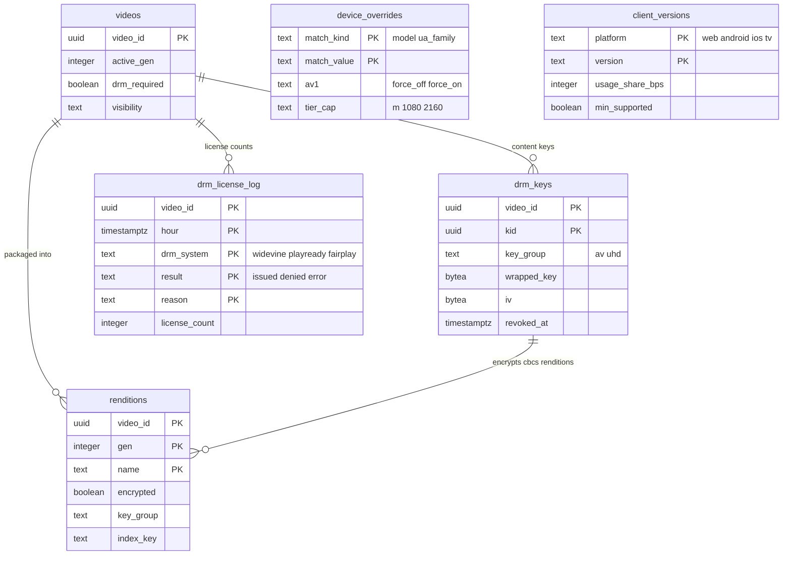

# Data model: パッケージ・DRM・再生

[data-model.md](../data-model.md) の一部。規約はそちらの 3 節に従う。振る舞いは [packaging-and-drm.md](../packaging-and-drm.md)（4〜8 節）、[playback-and-abr.md](../playback-and-abr.md)（4・7 節）、[delivery.md](../delivery.md)（4・6 節）を正とする。決定は [ADR-0019](../../decisions/0019-cmaf-files-segment-index-and-url-layout.md)（ファイルと `SIX1`）、[ADR-0020](../../decisions/0020-manifest-generation-and-capability-classes.md)（マニフェストと能力の組）、[ADR-0021](../../decisions/0021-drm-key-hierarchy-and-license-proxy.md)（DRM の鍵）、[ADR-0023](../../decisions/0023-playback-token-and-qoe-metrics.md)（再生のトークン）、[ADR-0070](../../decisions/0070-ci-cd-golden-media-gates-and-player-rollout.md)（プレイヤーの配布）、[ADR-0071](../../decisions/0071-encoder-pinning-reencode-and-manifest-format-versions.md)（`mf`）。

| 表・置き場所 | スキーマ | 書く |
| --- | --- | --- |
| `drm_keys` | `media` | `svc_packager`（作成）、`svc_license`（読むだけ） |
| `drm_license_log` | `media` | `svc_license`（1 時間ごとの集計） |
| `device_overrides`、`client_versions` | `media` | 運用（Terraform の外の管理の API。監査つき） |
| `renditions` のパッケージの列、`videos.active_gen`・`drm_required` | `media` | [transcoding-and-renditions.md](transcoding-and-renditions.md) の 2.5 節、[videos-and-uploads.md](videos-and-uploads.md) の 2.1 節 |
| CMAF のファイルと `SIX1` | S3 `p/{video_id}/{gen}/` | `svc_packager`（[formats.md](formats.md) の 1 節） |
| マニフェスト | 作らない（要求の時に作る） | `manifest-service`（[formats.md](formats.md) の 6 節） |
| 再生のトークン・エッジのトークン | 持たない（署名だけ） | `api`（[formats.md](formats.md) の 5 節） |

- マニフェストは保存しない。`manifest-service` は `renditions`・`videos` の写し（Valkey `rend:{video_id}`）と `SIX1`（`origin-cache` 経由）から作る（[packaging-and-drm.md](../packaging-and-drm.md) の 5.5 節）。
- 内容の鍵は `drm-content` で包んだ形だけを持つ。復号を許すのは `packager` と `license-proxy` の IAM の役割だけ（ADR-0021）。

## 1. ER 図

- `drm_keys ||--o{ renditions`：`renditions.key_group` と `drm_keys.key_group`（失効していない鍵）で結ぶ論理の参照。鍵を新しい KID で作り直すときは世代を上げる（ADR-0021）。
- `device_overrides`・`client_versions` は運用の表で、他の表への外部キーを持たない（図では線のない箱）。

## 2. 表

### 2.1 `drm_keys`

メンバー限定の動画の内容の鍵（ADR-0021。`K_av` と `K_uhd`）。

| 列 | 型 | NULL | 既定 | 説明 |
| --- | --- | --- | --- | --- |
| `video_id` | `uuid` | NOT NULL | — | |
| `kid` | `uuid` | NOT NULL | — | 16 バイトの乱数（KID） |
| `key_group` | `text` | NOT NULL | — | `av`（音声と 1080p まで）・`uhd`（1440p 以上） |
| `wrapped_key` | `bytea` | NOT NULL | — | 16 バイトの内容の鍵を `drm-content` で包んだ値（KMS の暗号文） |
| `iv` | `bytea` | NOT NULL | — | `cbcs` の固定の IV（KID ごと 16 バイト） |
| `kms_key_id` | `text` | NOT NULL | — | 包んだ KMS の鍵（東京・大阪で別） |
| `gen` | `integer` | NOT NULL | — | この鍵で暗号化した世代 |
| `created_at` | `timestamptz` | NOT NULL | `now()` | |
| `revoked_at` | `timestamptz` | NULL | — | 漏えいで止めた時刻。ライセンスを出さない |

- キー：PK `(video_id, kid)`。UK `(video_id, key_group) WHERE revoked_at IS NULL`。
- CHECK：`octet_length(iv) = 16`、`key_group IN ('av','uhd')`。
- RLS：なし。テーブルの権限を `svc_packager`（INSERT・SELECT）と `svc_license`（SELECT）だけに与える。運用者のロールに SELECT を与えない。
- 保持：動画と同じ。動画の削除で行を消す（鍵の消去で暗号化したレンディションを読めなくする）。
- S1 の量：メンバー限定の動画を全体の 2% と見込み、約 10 万行/年。

### 2.2 `drm_license_log`

ライセンスの発行の集計（[packaging-and-drm.md](../packaging-and-drm.md) の 11 節）。利用者の識別子を持たない（D-27）。

| 列 | 型 | NULL | 既定 | 説明 |
| --- | --- | --- | --- | --- |
| `video_id` | `uuid` | NOT NULL | — | |
| `hour` | `timestamptz` | NOT NULL | — | 時間の頭 |
| `drm_system` | `text` | NOT NULL | — | `widevine`・`playready`・`fairplay` |
| `result` | `text` | NOT NULL | — | `issued`・`denied`・`error` |
| `reason` | `text` | NOT NULL | `''` | `not_member`・`token_expired`・`playable_deny`・`hdcp`・`provider_error` など |
| `security_level` | `text` | NOT NULL | — | `sw`・`hw`（`K_uhd` の可否） |
| `license_count` | `integer` | NOT NULL | — | |

- キー：PK `(video_id, hour, drm_system, result, reason, security_level)`。
- 分割：`hour` の月。保持：90 日（[security.md](../security.md) の 6.1 節）。古い分割を `DROP`。
- RLS：なし（運用の表）。S1 の量：約 300 万行（90 日）。

### 2.3 `device_overrides`

申告と実際が違う機種の上書き（[playback-and-abr.md](../playback-and-abr.md) の 4.3 節）。

| 列 | 型 | NULL | 既定 | 説明 |
| --- | --- | --- | --- | --- |
| `match_kind` | `text` | NOT NULL | — | `model`・`ua_family`・`os_version` |
| `match_value` | `text` | NOT NULL | — | 機種の識別子（正規化した文字列） |
| `av1` | `text` | NULL | — | `force_off`・`force_on` |
| `tier_cap` | `text` | NULL | — | `m`・`1080`・`2160` |
| `drm_level` | `text` | NULL | — | `sw`・`hw` |
| `note` | `text` | NOT NULL | `''` | 理由（症状の要約） |
| `updated_by`・`updated_at` | `uuid`・`timestamptz` | NOT NULL | — | |

- キー：PK `(match_kind, match_value)`。CHECK：`av1 IS NOT NULL OR tier_cap IS NOT NULL OR drm_level IS NOT NULL`。
- 再生の API はこの表を 5 分ごとにメモリーへ読む。RLS：なし。S1 の量：数百行。

### 2.4 `client_versions`

アプリとプレイヤーのバージョン（[delivery.md](../delivery.md) の 4.2 節、ADR-0070）。

| 列 | 型 | NULL | 既定 | 説明 |
| --- | --- | --- | --- | --- |
| `platform` | `text` | NOT NULL | — | `web`・`android`・`ios`・`tv` |
| `version` | `text` | NOT NULL | — | セマンティック バージョン |
| `released_at` | `timestamptz` | NOT NULL | — | |
| `usage_share_bps` | `integer` | NOT NULL | `0` | 直近 7 日の再生の割合（基本点。`min_supported` は 100 未満のバージョンだけ上げる） |
| `min_supported` | `boolean` | NOT NULL | `false` | プラットフォームの最低のバージョンの印 |
| `blocked` | `boolean` | NOT NULL | `false` | 脆弱性で利用の割合によらず止める |
| `updated_at` | `timestamptz` | NOT NULL | `now()` | |

- キー：PK `(platform, version)`。UK `(platform) WHERE min_supported`。
- 再生の API は `X-<Brand>-Client` のバージョンが `min_supported` より古ければ `upgrade_required` を返す。Web のプレイヤーの割合（1%・10%・50%・100%）は AppConfig の `player_cfg`（[stores.md](stores.md) の 9 節）。
- RLS：なし。S1 の量：数百行。

## 3. 再生の API の応答と写し

表ではないが、再生の経路が読む値をまとめる。

| 値 | 元 | 置き場所 |
| --- | --- | --- |
| `playable()` の入力（動画の状態、措置、照合の地域の結果、チャンネルの状態） | `videos`、`claim_effects`、`account_standing` | Valkey `pv:{video_id}`（[stores.md](stores.md) の 1 節） |
| 配信の止め | `delivery_blocks` | Valkey `blocked:{video_id}`、KeyValueStore `b:{video_id}` |
| 会員 | `memberships` | Valkey `mem:{user_id}:{channel_id}` |
| 段の一覧と世代 | `renditions`、`videos.active_gen`・`drm_required` | Valkey `rend:{video_id}` |
| 開始の段の目安、字幕・縮小の画像・チャプターの URL、ラウドネス | `renditions`、`captions`、`storyboards`、`chapters`、`audio_loudness` | 応答の時に `rend:` と Aurora の読み出しの写しから |
| 再生のトークン・エッジのトークン | 署名の鍵 | [formats.md](formats.md) の 5 節 |
| マニフェストの URL | `mf`（デプロイのバージョンの既定）、`caps` | `/t/{token}/m/{mf}/{video_id}/{caps}/master.m3u8` |
