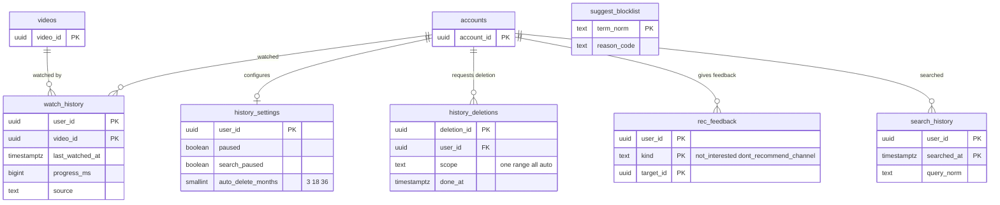

# Data model: おすすめと検索

[data-model.md](../data-model.md) の一部。規約はそちらの 3 節に従う。振る舞いは [recommendations.md](../recommendations.md)（5・6・10・11 節）と [search.md](../search.md)（5・8・9 節）を正とする。決定は [ADR-0010](../../decisions/0010-recommendation-boundary.md)（おすすめの境界）、[ADR-0038](../../decisions/0038-candidate-sources-covisitation-and-two-stage-ranking.md)（候補と共起）、[ADR-0039](../../decisions/0039-diversity-mixer-history-controls-and-non-personalized-feed.md)（履歴の操作）、[ADR-0041](../../decisions/0041-search-index-layout-and-caption-chunks.md)（索引）、[ADR-0042](../../decisions/0042-search-query-builder-ranking-and-suggest.md)（問い合わせと補完）。

| 表・置き場所 | スキーマ | 書く |
| --- | --- | --- |
| `watch_history`、`history_settings`、`history_deletions`、`rec_feedback` | `discovery` | `svc_recs`（`history-writer`）、`svc_api`（本人の操作） |
| `search_history` | `discovery` | `svc_search`（ログインした本人の検索） |
| `suggest_blocklist` | `discovery` | T&S の担当（監査つきの API） |
| おすすめの写し | Valkey `uh:`・`ua:`・`cv:`・`vf:`・`chf:`・`pop:`・`sq:`、S3 `recs/` | `recommender` の作業（[stores.md](stores.md) の 1・3 節） |
| 表示と理由の記録 | MSK `rec-events`、`search-events` | `recommender`、`api`（[stores.md](stores.md) の 4 節） |
| 検索の索引 | OpenSearch `videos-v{n}`・`captions-v{n}`・`channels-v{n}`・`suggest-v{n}` | `search-indexer`、`suggest-builder`（[stores.md](stores.md) の 7 節） |

- 視聴の履歴は本人の表で、子ども向けの動画の視聴と、履歴を止めた利用者の視聴を入れない（ADR-0039）。
- OpenSearch とおすすめの写しは正本ではない。Aurora と S3 から作り直せる。返す前に必ず `playable()` を通す（ADR-0009、ADR-0010）。

## 1. ER 図

- 本人の表の `user_id` は `accounts.account_id`（D-2）。`watch_history → videos` は論理の参照（動画が消えても履歴の行は利用者が消すまで残し、表示の時に `playable()` で落とす）。
- `suggest_blocklist` は運用の一覧で、他の表と結ばない。

## 2. 表

### 2.1 `watch_history`

| 列 | 型 | NULL | 既定 | 説明 |
| --- | --- | --- | --- | --- |
| `user_id` | `uuid` | NOT NULL | — | |
| `video_id` | `uuid` | NOT NULL | — | |
| `last_watched_at` | `timestamptz` | NOT NULL | — | |
| `progress_ms` | `bigint` | NOT NULL | `0` | 続きの位置（`continue` の源） |
| `source` | `text` | NOT NULL | — | 流入の元（`home`・`next`・`search`・`subs`・`notif`・`channel`・`playlist`・`embed`・`external`・`other`） |
| `watch_count` | `integer` | NOT NULL | `1` | |

- キー：PK `(user_id, video_id)`。索引 `(user_id, last_watched_at DESC)` — 履歴の画面、`uh:` の作り直し、自動の消去。
- 書き込み：`history-writer` が `watch-events` の `first_frame` と心拍から UPSERT する（ログインした利用者、`history_settings.paused = false`、子ども向けの動画でないとき）。
- 分割：`user_id` のハッシュで 32。RLS（FORCE）：本人の表。`svc_recs` に全行（書き込みと消去の作業）。
- 保持：利用者が消すか、`auto_delete_months` まで。アカウントの削除で全部消す。
- S1 の量：約 9 億行/年（600 万人 × 1 年に約 150 本の別の動画）。E11 で量を測る。

### 2.2 `history_settings`

| 列 | 型 | NULL | 既定 | 説明 |
| --- | --- | --- | --- | --- |
| `user_id` | `uuid` | NOT NULL | — | |
| `paused` | `boolean` | NOT NULL | `false` | 視聴の履歴を止める（ホームは個人化しない並び） |
| `search_paused` | `boolean` | NOT NULL | `false` | 検索の履歴を止める |
| `auto_delete_months` | `smallint` | NULL | — | `3`・`18`・`36`（NULL は自動で消さない） |
| `updated_at` | `timestamptz` | NOT NULL | `now()` | |

- キー：PK `(user_id)`。CHECK：`auto_delete_months IN (3, 18, 36)`。行がなければ既定の値。
- 変更は outbox の `history_paused` で `recommender` と `history-writer` の写し（Valkey `hs:{user_id}`）に配る。RLS（FORCE）：本人の表。S1 の量：約 100 万行。

### 2.3 `history_deletions`

履歴の消去の作業（24 時間以内の完了を見張る。D-19 で足した表）。

| 列 | 型 | NULL | 既定 | 説明 |
| --- | --- | --- | --- | --- |
| `deletion_id` | `uuid` | NOT NULL | `uuidv7()` | outbox の `history_deleted` の ID と同じ |
| `user_id` | `uuid` | NOT NULL | — | |
| `scope` | `text` | NOT NULL | — | `one`・`range`・`all`・`auto` |
| `video_id` | `uuid` | NULL | — | `scope = 'one'` のとき |
| `range_from`・`range_to` | `timestamptz` | NULL | — | `scope = 'range'` のとき |
| `include_search` | `boolean` | NOT NULL | `false` | 検索の履歴も消す |
| `parts_done` | `text[]` | NOT NULL | `'{}'` | 済んだ消し先：`aurora`・`valkey_uh`・`valkey_ua`・`training_data` |
| `requested_at` | `timestamptz` | NOT NULL | `now()` | |
| `done_at` | `timestamptz` | NULL | — | 全部の消し先が済んだ時刻 |

- キー：PK `(deletion_id)`。索引 `(requested_at) WHERE done_at IS NULL` — 24 時間を超えたら Ops を呼ぶ。
- CHECK：`(scope = 'one') = (video_id IS NOT NULL)`、`(scope = 'range') = (range_from IS NOT NULL AND range_to IS NOT NULL)`。
- RLS（FORCE）：本人の表。`svc_recs` に全行。保持：完了から 30 日（消した中身は持たない）。S1 の量：約 10 万行（30 日）。

### 2.4 `rec_feedback`

| 列 | 型 | NULL | 既定 | 説明 |
| --- | --- | --- | --- | --- |
| `user_id` | `uuid` | NOT NULL | — | |
| `kind` | `text` | NOT NULL | — | `not_interested`（`target_id` は動画）・`dont_recommend_channel`（`target_id` はチャンネル） |
| `target_id` | `uuid` | NOT NULL | — | |
| `created_at` | `timestamptz` | NOT NULL | `now()` | |

- キー：PK `(user_id, kind, target_id)`。前の絞り込みの写し `rf:{user_id}`（[stores.md](stores.md) の 1 節）。
- RLS（FORCE）：本人の表。保持：視聴の履歴の全消去で消す。S1 の量：約 5,000 万行。

### 2.5 `search_history`

| 列 | 型 | NULL | 既定 | 説明 |
| --- | --- | --- | --- | --- |
| `user_id` | `uuid` | NOT NULL | — | |
| `searched_at` | `timestamptz` | NOT NULL | `now()` | |
| `query_norm` | `text` | NOT NULL | — | `normalizeForSearch` の後の語（200 文字まで）。ログに出さない |

- キー：PK `(user_id, searched_at)`。補完の上に出すのは直近 50 件（`ORDER BY searched_at DESC LIMIT 50`）。
- 書き込みは `history_settings.search_paused = false` のときだけ。分割：`user_id` のハッシュで 16。
- RLS（FORCE）：本人の表。保持：視聴の履歴と同じ操作と自動の消去（L5）。S1 の量：約 3 億行/年。

### 2.6 `suggest_blocklist`

| 列 | 型 | NULL | 既定 | 説明 |
| --- | --- | --- | --- | --- |
| `term_norm` | `text` | NOT NULL | — | 正規化した語 |
| `reason_code` | `text` | NOT NULL | — | `harmful`・`personal_name`・`legal`・`spam` |
| `added_by` | `uuid` | NOT NULL | — | |
| `added_at` | `timestamptz` | NOT NULL | `now()` | |

- キー：PK `(term_norm)`。追加は outbox の `suggest_blocked` で `suggest-v{n}` から 60 秒以内に消す。RLS：なし（運用の表）。S1 の量：数千行。
