# Data model: 監査・保持・運用の表

[data-model.md](../data-model.md) の一部。規約はそちらの 3 節に従う。振る舞いは [security.md](../security.md)（4〜9 節）、[observability.md](../observability.md)（2・6 節）、[capacity.md](../capacity.md)（6・8 節）を正とする。決定は [ADR-0062](../../decisions/0062-threat-mitigations-and-key-layout.md)（鍵）、[ADR-0063](../../decisions/0063-operator-access-audit-retention-and-legal-hold.md)（運用者のアクセス、監査、保持、保全）、[ADR-0067](../../decisions/0067-sli-sources-and-computation.md)（SLI）。開示の請求と保持の期間の多くは**法務の確認待ち（L5・L10）**。

| 表 | スキーマ | 書く |
| --- | --- | --- |
| `audit_events` | `sec` | 各サービス（変更と同じトランザクション）。ロールは INSERT だけ |
| `retention_policies`、`legal_holds` | `sec` | 法務の承認つきの管理の API（監査つき） |
| `login_records`、`post_records` | `sec` | `svc_identity`・`svc_api`・`svc_chat`（INSERT だけ）。読むのは `legal_response` だけ |
| `legal_requests` | `sec` | 法務の窓口（`legal_response`） |
| `operator_access_grants` | `sec` | JIT の権限の発行の作業 |
| `deletion_records` | `sec` | `svc_retention`（`retention-sweeper`）、`original_deleter` |
| `outbox`、`inbox_events` | `ops` | 全サービス（outbox は INSERT だけ）、`svc_relay`、各消費者 |
| `business_days` | `ops` | 運用（営業日の暦。期限・締め・支払いの日が読む） |
| `canary_results`、`sli_monthly`、`cost_daily`、`capacity_reviews` | `ops` | 見張りの作業、SLI と費用の集計の作業、運用 |

- 監査の正本は log-archive の S3（Object Lock のコンプライアンスのモード、3 年。L10）。Aurora の `audit_events` は Studio と調べもののための写しで、180 日で消す（D-29）。
- 保持の期間は `retention_policies` の 1 つの表に持ち、消去の作業はこの表だけを読む。`legal_holds` はすべての消去の経路（元のファイルの消去を含む）より先に効く（ADR-0063）。
- IP アドレスは監査の本文に入れず、`login_records`・`post_records` に暗号文で分ける（`kms-pii`）。

## 1. ER 図

```mermaid
erDiagram
    accounts ||--o{ audit_events : "acts (user)"
    accounts ||--o{ login_records : "signs in"
    accounts ||--o{ post_records : "posts"
    retention_policies ||--o{ deletion_records : "drives"
    legal_requests ||--o{ legal_holds : "preserves"
    operator_access_grants ||--o{ audit_events : "used in"
    outbox ||--o{ inbox_events : "consumed once per consumer"

    accounts {
        uuid account_id PK
    }
    audit_events {
        timestamptz at PK
        uuid event_id PK
        text actor_kind "user operator system"
        uuid actor_id
        text action
        text target_kind
        text target_id
        uuid channel_id
    }
    retention_policies {
        text data_kind PK
        integer retain_days
        text rule
        text[] legal_refs
    }
    legal_holds {
        uuid hold_id PK
        text target_kind
        uuid target_id
        text[] scope
        timestamptz released_at
    }
    login_records {
        uuid account_id PK
        timestamptz at PK
        bytea ip_enc
        integer asn
    }
    post_records {
        text object_kind PK
        text object_id PK
        timestamptz at PK
        uuid account_id FK
        bytea ip_enc
    }
    legal_requests {
        uuid request_id PK
        text kind
        text state
        timestamptz deadline
    }
    operator_access_grants {
        uuid grant_id PK
        uuid operator_id
        text role
        timestamptz expires_at
    }
    deletion_records {
        timestamptz executed_at PK
        uuid record_id PK
        text data_kind FK
        bigint row_count
    }
    outbox {
        timestamptz created_at PK
        uuid event_id PK
        text topic
        timestamptz relayed_at
    }
    inbox_events {
        text consumer PK
        uuid event_id PK
        timestamptz processed_at
    }
    business_days {
        date day PK
        boolean is_business_day
    }
    canary_results {
        text probe PK
        text site PK
        timestamptz at PK
        boolean ok
    }
    sli_monthly {
        date month PK
        text sli PK
        bigint good
        bigint total
    }
    cost_daily {
        date day PK
        text item PK
        numeric cost_usd
    }
    capacity_reviews {
        date month PK
        text metric PK
        text decision
    }
```

- `legal_holds.target_id` は `target_kind` によって動画・チャンネル・アカウント・配信・権利者を指す多態の参照。`audit_events.target_id` も同じ（文字列）。
- `operator_access_grants ||--o{ audit_events`：運用者の操作の監査は `actor_id` と `grant_id`（`detail` の中）で結ぶ論理の関係。
- `outbox ||--o{ inbox_events`：消費者ごとに出来事を 1 回だけ処理する記録（論理の参照。outbox は日で消える）。
- 運用の 4 表（`canary_results`・`sli_monthly`・`cost_daily`・`capacity_reviews`）と `business_days` は他の表と結ばない。

## 2. 監査とアクセス

### 2.1 `audit_events`

| 列 | 型 | NULL | 既定 | 説明 |
| --- | --- | --- | --- | --- |
| `at` | `timestamptz` | NOT NULL | `clock_timestamp()` | 分割の鍵 |
| `event_id` | `uuid` | NOT NULL | `uuidv7()` | |
| `actor_kind` | `text` | NOT NULL | — | `user`・`operator`・`system` |
| `actor_id` | `uuid` | NULL | — | アカウント・運用者・サービスの ID |
| `action` | `text` | NOT NULL | — | `role_granted`・`stream_key_viewed`・`visibility_changed`・`video_deleted`・`moderation_action`・`policy_override`・`legal_hold_added`・`original_viewed` など（[security.md](../security.md) の 5 節の表） |
| `target_kind` | `text` | NOT NULL | — | `video`・`channel`・`account`・`stream_key`・`claim`・`reference`・`payout_account`・`original`・`legal_hold` など |
| `target_id` | `text` | NOT NULL | — | |
| `channel_id` | `uuid` | NULL | — | 創作者の Studio に見せる行（チャンネルの操作と自動の措置） |
| `reason_code` | `text` | NULL | — | |
| `asn` | `integer` | NULL | — | 送り元の ASN（IP は入れない） |
| `detail` | `jsonb` | NOT NULL | `'{}'` | ID と数と理由のコードだけ（`grant_id`、前後の値の要約）。本文・題・IP を入れない |

- キー：PK `(at, event_id)`。索引：`(target_kind, target_id, at)` — 対象の履歴。`(channel_id, at DESC) WHERE channel_id IS NOT NULL` — Studio の操作の記録（180 日）。`(actor_kind, actor_id, at)` — 運用者の操作の見直し。
- 追記だけ（INSERT だけをロールに与える）。同じトランザクションの outbox（`audit_appended`）から log-archive の S3 へ写す。S3 の欠けを毎日突き合わせる。
- 分割：`at` の月。保持：Aurora に 180 日（分割を `DROP`）、S3 に 3 年（L10）。
- RLS（FORCE）：チャンネルの行は `channel_id = ANY(app.channel_ids)` で読める。他は運用の監査つきの API だけ。S1 の量：約 300 万行/日（自動の措置と配信の止めを含む）、180 日で約 5 億行。

### 2.2 `login_records`・`post_records`

開示の請求に備える記録（[security.md](../security.md) の 6.1 節。期間は **L10**）。

| 表 | 列 | キー・索引 | 説明 |
| --- | --- | --- | --- |
| `login_records` | `account_id uuid`、`at timestamptz`、`ip_enc bytea`（`kms-pii`）、`asn integer`、`device_class text`、`session_id uuid` | PK `(account_id, at)` | ログインの成功の時 |
| `post_records` | `object_kind text`（`upload`・`comment`・`chat`・`live`）、`object_id text`、`at timestamptz`、`account_id uuid`、`ip_enc bytea`（`kms-pii`） | PK `(object_kind, object_id, at)`、索引 `(account_id, at)` | 投稿の時の IP。チャットは `{stream_id}:{seq}` |

- 分割：`at` の月。保持：180 日（分割を `DROP`。`legal_holds` の対象は保全の写しを先に作る）。
- RLS（FORCE）：ポリシーは `legal_response` のロールにだけ `USING (true)`。書く側のロールは INSERT だけで、`WITH CHECK (true)` のポリシーを持ち SELECT のポリシーを持たない。
- S1 の量：`login_records` 約 1 億行（180 日）、`post_records` 約 5 億行（180 日。チャットが大半）。

### 2.3 `legal_requests`

| 列 | 型 | NULL | 既定 | 説明 |
| --- | --- | --- | --- | --- |
| `request_id` | `uuid` | NOT NULL | `uuidv7()` | |
| `kind` | `text` | NOT NULL | — | `disclosure_request`・`disclosure_order`・`police_inquiry`・`seizure`・`emergency`・`preservation` |
| `state` | `text` | NOT NULL | `'received'` | `received`・`reviewing`・`approved`・`responded`・`rejected`・`closed` |
| `deadline` | `timestamptz` | NULL | — | |
| `targets` | `jsonb` | NOT NULL | — | 対象の種類と ID の一覧 |
| `approved_by` | `uuid[]` | NOT NULL | `'{}'` | 2 人の承認 |
| `handled_by` | `uuid` | NOT NULL | — | 法務の担当（エージェントと一般の運用者は扱わない） |
| `responded_at` | `timestamptz` | NULL | — | |
| `created_at` | `timestamptz` | NOT NULL | `now()` | |

- キー：PK `(request_id)`。索引 `(state, deadline)`。CHECK：`state NOT IN ('approved','responded') OR cardinality(approved_by) >= 2`。
- RLS（FORCE）：`legal_response` のロールだけ。保持：L10 の後に決める（既定 5 年）。S1 の量：数百行/年。

### 2.4 `operator_access_grants`

| 列 | 型 | NULL | 既定 | 説明 |
| --- | --- | --- | --- | --- |
| `grant_id` | `uuid` | NOT NULL | `uuidv7()` | |
| `operator_id` | `uuid` | NOT NULL | — | 運用者（社内の IdP の ID） |
| `role` | `text` | NOT NULL | — | `ops-jit-admin`・`moderation-review`・`safety-review`・`legal-response`・`break-glass` |
| `target` | `text` | NOT NULL | — | 対象（`video:{id}`、`quarantine:{id}`、`*`） |
| `reason` | `text` | NOT NULL | — | 理由のコードとチケット |
| `approvers` | `uuid[]` | NOT NULL | `'{}'` | |
| `requested_at`・`granted_at` | `timestamptz` | NOT NULL・NULL | — | |
| `expires_at` | `timestamptz` | NOT NULL | — | |
| `revoked_at` | `timestamptz` | NULL | — | |

- キー：PK `(grant_id)`。索引 `(operator_id, expires_at)`。CHECK：`role NOT IN ('safety-review','legal-response') OR cardinality(approvers) >= 2`、`expires_at > requested_at`。
- どの役割も RLS を外さない（ADR-0009）。発行と使用は監査に残る。RLS：なし（`sec` のスキーマの権限で運用の発行の作業だけ）。保持：3 年。S1 の量：数千行/年。

## 3. 保持・保全・消去

### 3.1 `retention_policies`

| 列 | 型 | NULL | 既定 | 説明 |
| --- | --- | --- | --- | --- |
| `data_kind` | `text` | NOT NULL | — | 下の目録の名前 |
| `retain_days` | `integer` | NULL | — | 日の数。NULL は `rule` で決まる |
| `rule` | `text` | NOT NULL | — | `fixed`（日の数）・`while_video_exists`・`while_account_exists`・`until_user_deletes`・`legal_hold_only` |
| `legal_refs` | `text[]` | NOT NULL | `'{}'` | 法務の確認待ちの番号（`L5`・`L10` など） |
| `updated_by`・`updated_at` | `uuid`・`timestamptz` | NOT NULL | — | 法務の承認つき（監査） |

- キー：PK `(data_kind)`。法務の結論の反映は行の変更だけにする（コードを変えない）。
- 既定の行（[security.md](../security.md) の 6.1 節。各表の「保持」と同じ値）：

| `data_kind` | 既定 | 法務 |
| --- | --- | --- |
| `original` | 動画が残る間（消去の 3 つの経路） | L1・L10 |
| `deleted_video` | 30 日の猶予の後に全部 | — |
| `raw_ip_view` | 1 時間 | L5 |
| `watch_events` | 13 か月 | L5 |
| `login_records`・`post_records` | 180 日 | L10 |
| `chat_log` | 90 日（アーカイブのある配信はリプレイの間） | L10・L6 |
| `cdn_logs_ip` | 7 日（その後は IP を落とした形で 13 か月） | L5 |
| `account` | 削除の後 30 日 | L5 |
| `audit` | 3 年（S3）、Aurora は 180 日 | L10 |
| `quarantine` | 保全の期限まで | L3・L10 |
| `drm_license_log` | 90 日 | — |
| `watch_history`・`search_history` | 利用者が消すか自動の消去まで | L5 |
| `ledger`・`payouts`・`memberships` | 7 年（既定の案） | L7 |
| `moderation_actions`・`claims`・`copyright_cases` | 3 年 | L1・L2 |

- RLS：なし。S1 の量：約 40 行。

### 3.2 `legal_holds`

| 列 | 型 | NULL | 既定 | 説明 |
| --- | --- | --- | --- | --- |
| `hold_id` | `uuid` | NOT NULL | `uuidv7()` | |
| `target_kind` | `text` | NOT NULL | — | `video`・`channel`・`account`・`stream`・`rights_owner` |
| `target_id` | `uuid` | NOT NULL | — | |
| `scope` | `text[]` | NOT NULL | — | `original`・`renditions`・`chat`・`login_records`・`post_records`・`audit`・`comments`・`quarantine` |
| `reason` | `text` | NOT NULL | — | 理由のコード（`legal_request:{id}`、`csam_review` など） |
| `request_id` | `uuid` | NULL | — | 元の `legal_requests` |
| `approved_by` | `uuid` | NOT NULL | — | 法務の承認 |
| `created_at` | `timestamptz` | NOT NULL | `now()` | |
| `released_at`・`released_by` | `timestamptz`・`uuid` | NULL | — | |

- キー：PK `(hold_id)`。索引 `(target_kind, target_id) WHERE released_at IS NULL` — 全部の消去の作業が消す前に引く。
- 保全は消さないだけで、通常の機能（再生・検索）に戻さない。付与と外しは監査に残す。Valkey・S3 のタグ（`hold=1`）に写し、ライフサイクルの規則の消去も止める。
- RLS：なし（`sec` のスキーマ。読むのは消去の作業と法務の API）。保持：外してから 3 年。S1 の量：数千行。

### 3.3 `deletion_records`

消したことの記録（中身を持たない。[security.md](../security.md) の 6.2 節。D-19 で足した表）。

| 列 | 型 | NULL | 既定 | 説明 |
| --- | --- | --- | --- | --- |
| `executed_at` | `timestamptz` | NOT NULL | `now()` | 分割の鍵 |
| `record_id` | `uuid` | NOT NULL | `uuidv7()` | |
| `data_kind` | `text` | NOT NULL | — | `retention_policies.data_kind` |
| `target_kind`・`target_id` | `text` | NULL | — | 個別の消去（動画、アカウント）。分割の `DROP` は NULL |
| `row_count` | `bigint` | NOT NULL | — | |
| `executor` | `text` | NOT NULL | — | `retention-sweeper`・`original-deleter`・`history-deleter` |
| `skipped_held` | `bigint` | NOT NULL | `0` | 保全で飛ばした数 |

- キー：PK `(executed_at, record_id)`。分割：`executed_at` の月。保持：3 年。RLS：なし。S1 の量：約 100 万行/年。

## 4. 出来事の受け渡し

### 4.1 `outbox`

全部の領域が使う 1 つの outbox（D-15）。行の形と話題の一覧は [stores.md](stores.md) の 4.1 節。

| 列 | 型 | NULL | 既定 | 説明 |
| --- | --- | --- | --- | --- |
| `created_at` | `timestamptz` | NOT NULL | `clock_timestamp()` | 分割の鍵 |
| `event_id` | `uuid` | NOT NULL | `uuidv7()` | 消費者の重複を除く鍵 |
| `topic` | `text` | NOT NULL | — | `video_state_changed`・`delivery_block` など |
| `aggregate_kind`・`aggregate_id` | `text`・`uuid` | NOT NULL | — | 順を守る単位（同じ集まりの出来事は `created_at` の順に送る） |
| `payload` | `jsonb` | NOT NULL | — | ID・数・理由のコード・バージョンだけ（題・本文・IP を入れない） |
| `relayed_at` | `timestamptz` | NULL | — | `relay` が SNS・SQS に送った時刻 |
| `attempts` | `smallint` | NOT NULL | `0` | |

- キー：PK `(created_at, event_id)`。索引 `(created_at) WHERE relayed_at IS NULL` — `relay` の読み出し（1 秒以内に送る。措置は 60 秒の予算の一部）。
- 書くのは業務の変更と同じトランザクションだけ（全ロールに INSERT）。`svc_relay` だけが SELECT と `UPDATE (relayed_at, attempts)`。
- 分割：`created_at` の日。保持：全部送って 7 日（分割を `DROP`）。RLS：なし。S1 の量：1 日 約 500 万行。

### 4.2 `inbox_events`

消費者の側の重複の除き（strike の書き込み、通知の計画、索引、配信の止めなど）。

| 列 | 型 | NULL | 既定 | 説明 |
| --- | --- | --- | --- | --- |
| `consumer` | `text` | NOT NULL | — | `strikes`・`notify-planner`・`delivery-blocker`・`search-indexer` など |
| `event_id` | `uuid` | NOT NULL | — | outbox の `event_id` |
| `processed_at` | `timestamptz` | NOT NULL | `now()` | |

- キー：PK `(consumer, event_id)`。処理の書き込みと同じトランザクションで INSERT し、一意の違反は「処理済み」として捨てる。
- 保持：14 日（SQS の保持より長く）。RLS：なし。S1 の量：約 3,000 万行（14 日）。

## 5. 運用の表

### 5.1 `business_days`

| 列 | 型 | NULL | 既定 | 説明 |
| --- | --- | --- | --- | --- |
| `day` | `date` | NOT NULL | — | |
| `is_business_day` | `boolean` | NOT NULL | — | 土日・祝日・年末年始は `false` |
| `note` | `text` | NOT NULL | `''` | |

- キー：PK `(day)`。削除の申出の期限（営業日）、月の締め（4 営業日）、明細（5 営業日）、支払いの日（25 日の前の営業日）が読む。翌年の分を毎年 12 月に入れる。RLS：なし。S1 の量：約 3,650 行（10 年）。D-19 で足した表。

### 5.2 `canary_results`・`sli_monthly`・`cost_daily`・`capacity_reviews`

| 表 | 列 | キー | 説明 |
| --- | --- | --- | --- |
| `canary_results` | `probe text`（`playback`・`upload`・`live_latency`・`takedown`・`chat`・`view_count`）、`site text`（拠点）、`at timestamptz`、`value_ms bigint NULL`、`ok boolean` | PK `(probe, site, at)` | 見張りの結果。分割 `at` の月、保持 90 日 |
| `sli_monthly` | `month date`、`sli text`、`good bigint`、`total bigint`、`value numeric(9,6)`、`alert_source_value numeric(9,6)`、`diff numeric(9,6)` | PK `(month, sli)` | 月の SLO の報告（全数の源）と警報の源の差 |
| `cost_daily` | `day date`、`item text`（[capacity.md](../capacity.md) の 6 節の項目）、`quantity numeric(18,3)`、`unit text`、`cost_usd numeric(14,2)`、`unit_cost_usd numeric(14,6)` | PK `(day, item)` | 原価（台帳の金額ではないので USD の 10 進） |
| `capacity_reviews` | `month date`、`metric text`、`value numeric(18,3)`、`threshold numeric(18,3)`、`decision text`、`decided_by uuid` | PK `(month, metric)` | 段階を上げる基準の 60% の見直し |

- RLS：なし（運用の表。本番のアカウントの Aurora に置き、自己監視の `selfmon` へは集計だけを送る）。保持：`canary_results` 90 日、他は 3 年。S1 の量：`canary_results` 約 1,500 万行（90 日）、他は数千行。
