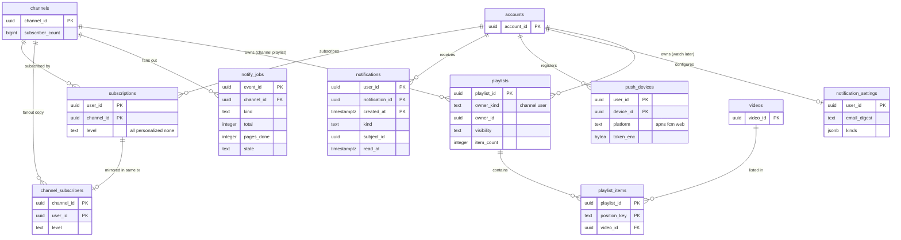

# Data model: 登録・通知・再生リスト

[data-model.md](../data-model.md) の一部。規約はそちらの 3 節に従う。振る舞いは [channels-subscriptions-and-notifications.md](../channels-subscriptions-and-notifications.md)（4〜7 節）を正とする。チャンネルとハンドルの表は [accounts-and-channels.md](accounts-and-channels.md)。決定は [ADR-0053](../../decisions/0053-handles-and-subscription-tables.md)（登録の 2 つの表）、[ADR-0054](../../decisions/0054-notification-fanout-pacing-and-coalescing.md)（通知の扇形の配り）。

| 表・置き場所 | スキーマ | 書く |
| --- | --- | --- |
| `subscriptions`、`channel_subscribers` | `social` | `svc_api`（登録の操作。2 つの表と outbox を同じトランザクション） |
| `notify_jobs` | `social` | `svc_notify`（`notify-planner`・`notify-worker`） |
| `notifications`、`push_devices`、`notification_settings` | `social` | `svc_notify`（行の作成）、`svc_api`（本人の操作） |
| `playlists`、`playlist_items` | `social` | `svc_api` |
| 写し | Valkey `subc:`・`ch_last:`・`ch_recent:`・`ch_notif:`・`ulc:`・`naff:`・`npw:`・`npq:` | [stores.md](stores.md) の 1 節 |
| 待ち行列 | SQS `notify-small`・`notify-large`・`push-send`（と DLQ） | [stores.md](stores.md) の 4 節 |

- **登録は 2 つの表**：本人の表 `subscriptions`（FORCE RLS）と、扇形の配りの専用の表 `channel_subscribers`（専用の DB の役割 `fanout_reader` だけが読む）。登録者の一覧を創作者に見せる経路は作らない（ADR-0053）。
- 通知の本文（動画の題）は送る時に読み、`notifications` には ID と種類だけを持つ。

## 1. ER 図

- `subscriptions ||--o| channel_subscribers`：同じ組の行を同じトランザクションで書き消しする写し。コミットの後は必ず 1 対 1（0 はトランザクションの中だけ。毎日の突き合わせで差を 0 にする）。
- `playlists.owner_id` は `owner_kind` によってチャンネルか利用者を指す多態の参照（外部キーを張らない）。図は 2 本の線で描いた。
- `notifications.subject_id` は種類によって動画・申し立て・措置などを指す（外部キーを張らない）。

## 2. 表

### 2.1 `subscriptions`

| 列 | 型 | NULL | 既定 | 説明 |
| --- | --- | --- | --- | --- |
| `user_id`・`channel_id` | `uuid` | NOT NULL | — | |
| `level` | `text` | NOT NULL | `'personalized'` | `all`・`personalized`・`none` |
| `created_at` | `timestamptz` | NOT NULL | `now()` | 登録者だけのチャットの「10 分以上前から」の判定 |

- キー：PK `(user_id, channel_id)`。索引 `(user_id, created_at DESC)` — 本人の一覧。
- CHECK：1 人 4,000 チャンネルまで（トリガー）。
- 登録・解除・段階の変更は `channel_subscribers` と outbox の `subscription_changed` を同じトランザクションで書く。Valkey `subc:{channel_id}` に増減を積む。
- RLS（FORCE）：本人の表。保持：解除で消す。アカウントの削除で全部消す。S1 の量：約 1.5 億行（600 万人 × 平均 25）。

### 2.2 `channel_subscribers`

| 列 | 型 | NULL | 既定 | 説明 |
| --- | --- | --- | --- | --- |
| `channel_id`・`user_id` | `uuid` | NOT NULL | — | |
| `level` | `text` | NOT NULL | — | `subscriptions.level` の写し |
| `created_at` | `timestamptz` | NOT NULL | — | |

- キー：PK `(channel_id, user_id)`（主キーの順に 1,000 人ずつ読む。作業の冪等の鍵 `(event_id, after_user_id)`）。
- 分割：`channel_id` のハッシュで 16。RLS：なし。テーブルの権限で `fanout_reader`（SELECT）と `svc_api` の書き込みの役割（INSERT・UPDATE・DELETE）だけに与え、API の読み出しの役割に SELECT を与えない（ADR-0053）。
- 毎日、`subscriptions` と数を突き合わせ、停止・スパムと判定されたアカウントの登録を外す。S1 の量：約 1.5 億行。

### 2.3 `notify_jobs`

| 列 | 型 | NULL | 既定 | 説明 |
| --- | --- | --- | --- | --- |
| `event_id` | `uuid` | NOT NULL | — | 元の outbox の出来事（`video_state_changed`・`live_started`） |
| `channel_id` | `uuid` | NOT NULL | — | |
| `kind` | `text` | NOT NULL | — | `new_video`・`live_started`・`premiere` |
| `video_id` | `uuid` | NOT NULL | — | |
| `queue` | `text` | NOT NULL | — | `small`（登録者 1 万未満）・`large` |
| `total` | `integer` | NOT NULL | — | ページの数（1,000 人ずつ） |
| `pages_done` | `integer` | NOT NULL | `0` | |
| `pace_until` | `timestamptz` | NOT NULL | — | 均しの終わり（`min(15 分, N ÷ 2,000 人/秒)`、ライブは最大 5 分） |
| `state` | `text` | NOT NULL | `'planned'` | `planned`・`running`・`done`・`skipped`（子ども向けなど） |
| `created_at` | `timestamptz` | NOT NULL | `now()` | |

- キー：PK `(event_id)`。CHECK：`pages_done BETWEEN 0 AND total`。索引 `(state, created_at) WHERE state IN ('planned','running')`。
- RLS：なし。保持：30 日。S1 の量：1 日 約 7,000 行。

### 2.4 `notifications`

お知らせの一覧（登録者 10 万以下のチャンネルの新しい動画と、申し立て・措置・収益など 1 人への通知）。10 万を超えるチャンネルは Valkey `ch_notif:` から読み出しの時に合わせる（ADR-0054）。

| 列 | 型 | NULL | 既定 | 説明 |
| --- | --- | --- | --- | --- |
| `user_id` | `uuid` | NOT NULL | — | |
| `notification_id` | `uuid` | NOT NULL | `uuidv7()` | |
| `kind` | `text` | NOT NULL | — | `new_video`・`live_started`・`claim_created`・`claim_updated`・`moderation_action`・`strike`・`payout`・`comment_reply`・`mention` |
| `subject_id` | `uuid` | NOT NULL | — | 動画・申し立て・措置などの ID |
| `actor_channel_id` | `uuid` | NULL | — | 出したチャンネル |
| `read_at` | `timestamptz` | NULL | — | |
| `created_at` | `timestamptz` | NOT NULL | `now()` | |

- キー：PK `(user_id, notification_id, created_at)`（分割の鍵を含める。`created_at` は `notification_id` の UUIDv7 の時刻と同じ値）。一覧は PK の逆順で読む（`ORDER BY notification_id DESC`）。
- 分割：`created_at` の月。
- RLS（FORCE）：本人の表。保持：90 日（分割を `DROP`）。S1 の量：1 日 約 2,000 万行、90 日で約 18 億行（E6 で量を測る）。

### 2.5 `push_devices`

| 列 | 型 | NULL | 既定 | 説明 |
| --- | --- | --- | --- | --- |
| `user_id` | `uuid` | NOT NULL | — | |
| `device_id` | `uuid` | NOT NULL | — | アプリが作る端末の ID |
| `platform` | `text` | NOT NULL | — | `apns`・`fcm`・`web` |
| `token_enc` | `bytea` | NOT NULL | — | プッシュのトークン（`kms-secrets`） |
| `app_version` | `text` | NULL | — | |
| `last_seen_at` | `timestamptz` | NOT NULL | `now()` | |
| `created_at` | `timestamptz` | NOT NULL | `now()` | |

- キー：PK `(user_id, device_id)`。索引 `(last_seen_at)` — 90 日使われていない端末の消去。CHECK：1 人 10 台（トリガー）。
- RLS（FORCE）：本人の表。`svc_notify` に全行。保持：無効の応答か 90 日の不使用で消す。S1 の量：約 1,000 万行。

### 2.6 `notification_settings`

| 列 | 型 | NULL | 既定 | 説明 |
| --- | --- | --- | --- | --- |
| `user_id` | `uuid` | NOT NULL | — | |
| `quiet_start`・`quiet_end` | `time` | NULL | — | 静かな時間（JST） |
| `email_digest` | `text` | NOT NULL | `'daily'` | `off`・`daily`・`weekly`・`per_video` |
| `kinds` | `jsonb` | NOT NULL | `'{}'` | 種類ごとの有効 `{"comment_reply":false}` |
| `updated_at` | `timestamptz` | NOT NULL | `now()` | |

- キー：PK `(user_id)`。行がなければ既定。RLS（FORCE）：本人の表。S1 の量：約 200 万行。

### 2.7 `playlists`・`playlist_items`

| 列 | 型 | NULL | 既定 | 説明 |
| --- | --- | --- | --- | --- |
| `playlists.playlist_id` | `uuid` | NOT NULL | `uuidv7()` | |
| `owner_kind` | `text` | NOT NULL | — | `channel`・`user`（「後で見る」は利用者ごとの決まった再生リスト） |
| `owner_id` | `uuid` | NOT NULL | — | |
| `system_kind` | `text` | NULL | — | `watch_later`（決まった再生リスト） |
| `title`・`description` | `text` | NOT NULL | — | |
| `visibility` | `text` | NOT NULL | `'private'` | `public`・`unlisted`・`private` |
| `item_count` | `integer` | NOT NULL | `0` | 5,000 まで |
| `created_at`・`updated_at` | `timestamptz` | NOT NULL | `now()` | |
| `playlist_items.playlist_id` | `uuid` | NOT NULL | — | |
| `position_key` | `text` | NOT NULL | — | 分数の順序の文字列（並べ替えで他の行を書き換えない） |
| `video_id` | `uuid` | NOT NULL | — | |
| `added_at` | `timestamptz` | NOT NULL | `now()` | |

- キー：`playlists` PK `(playlist_id)`、UK `(owner_kind, owner_id, system_kind) WHERE system_kind IS NOT NULL`、索引 `(owner_kind, owner_id)`。`playlist_items` PK `(playlist_id, position_key)`、UK `(playlist_id, video_id)`。
- CHECK：`item_count BETWEEN 0 AND 5000`、`system_kind IS NULL OR owner_kind = 'user'`。
- 表示の時に各動画に `playable()` を通し、見られない動画は数だけ示す。
- RLS（FORCE）：`visibility IN ('public','unlisted')` の行は読める。持ち主の行は `owner_kind = 'user' AND owner_id = app.actor_id` か `owner_kind = 'channel' AND owner_id = ANY(app.channel_ids)`。`playlist_items` は `playlists` の結合のポリシー（D-5 と同じ「公開の行と持ち主」の形）。
- 保持：持ち主が消すまで。S1 の量：`playlists` 約 1,000 万、`playlist_items` 約 3 億。
