# Data model: 変換とレンディション

[data-model.md](../data-model.md) の一部。規約はそちらの 3 節に従う。振る舞いは [transcoding-pipeline.md](../transcoding-pipeline.md)（3〜10 節）、[packaging-and-drm.md](../packaging-and-drm.md)（4 節）、[delivery.md](../delivery.md)（6 節）を正とする。決定は [ADR-0002](../../decisions/0002-upload-and-pipeline-orchestration.md)（段のステートマシン）、[ADR-0014](../../decisions/0014-pipeline-task-leases-and-idempotent-outputs.md)（貸し出しと冪等の出力）、[ADR-0015](../../decisions/0015-per-title-ladder-convex-hull.md)（ラダー）、[ADR-0016](../../decisions/0016-av1-promotion-rule-and-cost.md)（AV1）、[ADR-0017](../../decisions/0017-audio-loudness-and-asr-adapter.md)（音声と字幕）、[ADR-0018](../../decisions/0018-encode-worker-pools-and-spot-interruption.md)（作業者のプール）、[ADR-0019](../../decisions/0019-cmaf-files-segment-index-and-url-layout.md)（世代）、[ADR-0071](../../decisions/0071-encoder-pinning-reencode-and-manifest-format-versions.md)（`enc_build` と作り直し）。

| 表 | スキーマ | 書く |
| --- | --- | --- |
| `pipeline_runs`、`pipeline_tasks`、`pipeline_task_deps` | `media` | `svc_pipeline`（`pipeline-orchestrator` と作業者） |
| `ladders`、`audio_loudness`、`captions`、`thumbnails`、`storyboards`、`chapters` | `media` | `svc_pipeline`。手動の字幕・サムネイル・チャプターは `svc_api` |
| `renditions` | `media` | `svc_pipeline`（符号化の段が行を作る）、`svc_packager`（パッケージの列と `ready`） |
| `av1_promotions` | `media` | `svc_pipeline`（`view-verifier` の確定と急な人気の検知から） |
| `enc_builds`、`reencode_campaigns`、`reencode_targets` | `media` | CI のリリースの作業、運用（作り直しの計画） |

- **正本は行**。SQS の `pipe-urgent`・`pipe-normal`・`pipe-back` は「この作業を見よ」の合図だけで、作業の状態は `pipeline_tasks` にある（ADR-0014）。
- 段の出力は S3 `r/{video_id}/{stage}/{cfg}/{inp}/{chunk:05}.{ext}`（7 日）に `If-None-Match: *` で書く。パッケージした CMAF のファイル `p/{video_id}/{gen}/…` が正本になる（[stores.md](stores.md) の 3 節）。
- `ladder_version`・`enc_build`・`probe_version`・`fp_version` はコードのバージョンで、フラグにしない（[AGENTS.md](../../../AGENTS.md)）。

## 1. ER 図

```mermaid
erDiagram
    videos ||--o| pipeline_runs : "processed by"
    content_references ||--o| pipeline_runs : "fingerprinted by"
    pipeline_runs ||--|{ pipeline_tasks : "has stage tasks"
    pipeline_tasks ||--o{ pipeline_task_deps : "waits on"
    pipeline_tasks ||--o{ pipeline_task_deps : "is dependency of"
    videos ||--o{ ladders : "ladder per codec and version"
    videos ||--o{ renditions : "renditions per gen"
    enc_builds ||--o{ renditions : "encoded by"
    enc_builds ||--o{ pipeline_tasks : "pinned in cfg"
    videos ||--o| av1_promotions : "promoted"
    videos ||--o| audio_loudness : "measured"
    videos ||--o{ captions : "captions per lang and kind"
    videos ||--o{ thumbnails : "thumbnail candidates"
    videos ||--o{ storyboards : "seek sprites per rev"
    videos ||--o{ chapters : "chapters"
    reencode_campaigns ||--|{ reencode_targets : "targets"
    videos ||--o{ reencode_targets : "re-encoded in"

    videos {
        uuid video_id PK
        integer active_gen
    }
    content_references {
        uuid reference_id PK
    }
    pipeline_runs {
        uuid run_id PK
        text kind "video reference"
        uuid video_id UK
        uuid reference_id UK
        text state "queued running gated finishing done failed stalled"
        text gate_result "publish block hold"
    }
    pipeline_tasks {
        uuid task_id PK
        uuid run_id FK
        text stage
        integer chunk "minus one is whole"
        text cfg_hash
        text inp_hash
        text state "blocked ready leased succeeded retry_wait dead"
        uuid lease_token
        timestamptz lease_until
        text output_key
    }
    pipeline_task_deps {
        uuid task_id PK
        uuid depends_on PK
    }
    ladders {
        uuid video_id PK
        text codec PK
        integer ladder_version PK
        jsonb rungs
        text mobile_top
    }
    renditions {
        uuid video_id PK
        integer gen PK
        text name PK "h1080-c24 a-aac128"
        text codec
        integer target_bps
        integer enc_build FK
        boolean encrypted
        text state "building ready deleting deleted"
    }
    enc_builds {
        integer enc_build PK
        jsonb components
        text isa
    }
    av1_promotions {
        uuid video_id PK
        text reason "views_7d spike channel hires"
        text triggered_by "confirmed provisional"
    }
    audio_loudness {
        uuid video_id PK
        numeric integrated_lufs
        numeric true_peak_dbtp
    }
    captions {
        uuid video_id PK
        text lang PK
        text kind PK "manual auto"
        integer rev
    }
    thumbnails {
        uuid video_id PK
        text slot PK "auto_1 auto_2 auto_3 custom"
        boolean selected
    }
    storyboards {
        uuid video_id PK
        integer rev PK
        smallint interval_s
    }
    chapters {
        uuid video_id PK
        bigint start_ms PK
        text title
    }
    reencode_campaigns {
        uuid campaign_id PK
        text reason "defect ladder_gain codec"
        text state
    }
    reencode_targets {
        uuid campaign_id PK
        uuid video_id PK
        integer priority
        text state
    }
```

- `pipeline_runs` は `video_id` か `reference_id` のどちらか 1 つを持つ（D-9）。どちらの側から見ても run は 0 か 1。
- `pipeline_tasks ||--o{ pipeline_task_deps` の 2 本の線は、同じ表の 2 つの列（`task_id` と `depends_on`）。依存の辺は同じ run の中だけ（トリガーで確かめる）。
- `renditions` の `(video_id, gen, name)` は URL `/v/{video_id}/{gen}/{rendition}/…` と 1 対 1（ADR-0019。D-6）。`enc_builds → renditions` は音声・映像の符号化の行だけ（字幕の行はない）。
- `reencode_targets → videos` は論理の参照（動画の削除で対象を `skipped` にする。外部キーで消さない）。

## 2. 表

### 2.1 `pipeline_runs`

| 列 | 型 | NULL | 既定 | 説明 |
| --- | --- | --- | --- | --- |
| `run_id` | `uuid` | NOT NULL | `uuidv7()` | |
| `kind` | `text` | NOT NULL | `'video'` | `video`・`reference`（`probe` → `fingerprint` だけ。ADR-0046） |
| `source_kind` | `text` | NOT NULL | `'upload'` | `upload`（`orig/`）・`live_source`（`live-src/`。アーカイブの作り直し） |
| `video_id` | `uuid` | NULL | — | `kind = 'video'` のとき |
| `reference_id` | `uuid` | NULL | — | `kind = 'reference'` のとき |
| `channel_id` | `uuid` | NULL | — | 急ぎの組の 1 チャンネル 200 の上限の数え（`kind = 'video'`） |
| `state` | `text` | NOT NULL | `'queued'` | `queued`・`running`・`gated`・`finishing`・`done`・`failed`・`stalled` |
| `gate_result` | `text` | NULL | — | `publish`・`block`・`hold`（`publish_gate` の結論） |
| `ladder_version` | `integer` | NULL | — | 今のラダーのバージョン（`complexity` の後） |
| `created_at` | `timestamptz` | NOT NULL | `now()` | `video_upload_completed` を受けた時刻 |
| `gated_at`・`done_at`・`stalled_at` | `timestamptz` | NULL | — | 段の時刻（再生できるまでの SLI の元。[ADR-0067](../../decisions/0067-sli-sources-and-computation.md)） |

- キー：PK `(run_id)`。UK `(video_id)`、UK `(reference_id)`。
- CHECK：`(kind = 'video') = (video_id IS NOT NULL)`、`(kind = 'reference') = (reference_id IS NOT NULL)`、`kind = 'video' OR gate_result IS NULL`、`state <> 'gated' OR gate_result IS NOT NULL`。
- 索引：`(state, created_at) WHERE state IN ('queued','running','stalled')` — 照合待ち・止まりの見張り。
- `gate_result` を書くトランザクションで `videos.state`（`ready`・`blocked`）と outbox を書く（[upload-and-ingest.md](../upload-and-ingest.md) の 6.1 節）。`done` の後に段を足すときは同じ行を `finishing` に戻す。
- RLS：なし（システムの表。創作者には `api` が状態の要約を返す）。保持：動画・参照と同じ。S1 の量：約 270 万行/年。

### 2.2 `pipeline_tasks`

段・区切りごとの作業（ADR-0014）。

| 列 | 型 | NULL | 既定 | 説明 |
| --- | --- | --- | --- | --- |
| `task_id` | `uuid` | NOT NULL | `uuidv7()` | |
| `run_id` | `uuid` | NOT NULL | — | |
| `stage` | `text` | NOT NULL | — | `probe`・`segment_plan`・`fingerprint`・`match`・`fast_encode`・`audio_encode`・`complexity`・`fast_package`・`publish_gate`・`full_encode`・`stitch_check`・`full_package`・`captions`・`thumbnails`・`storyboard`・`av1_encode`・`av1_package`・`cbcs_package` |
| `chunk` | `integer` | NOT NULL | `-1` | 区切りの番号（0 から）。区切らない段は `-1` |
| `priority` | `text` | NOT NULL | — | `urgent`・`normal`・`back`（SQS の組） |
| `channel_id` | `uuid` | NULL | — | 急ぎの組の上限の数え（run から写す） |
| `state` | `text` | NOT NULL | `'blocked'` | `blocked`・`ready`・`leased`・`succeeded`・`retry_wait`・`dead` |
| `deps_left` | `smallint` | NOT NULL | `0` | 未完了の依存の数 |
| `attempt` | `smallint` | NOT NULL | `0` | 貸し出しの回数（6 回目の失敗で `dead`） |
| `lease_token` | `uuid` | NULL | — | 貸し出しの印 |
| `lease_until` | `timestamptz` | NULL | — | `now() + 120 秒`、心拍で延ばす |
| `not_before` | `timestamptz` | NULL | — | `retry_wait` の待ちの終わり（10 秒 × 2^n、上限 10 分） |
| `cfg_hash` | `text` | NOT NULL | — | 設定の要約（`ladder_version`、`enc_build`、段の設定）の SHA-256 の先頭 16 文字 |
| `inp_hash` | `text` | NOT NULL | — | 入力の要約（元のファイルの CRC64NVME、`probe_version`、区切りの範囲）の先頭 16 文字 |
| `enc_build` | `integer` | NULL | — | 符号化の段だけ。作業者は自分の `enc_build` の作業だけを取る |
| `output_key` | `text` | NULL | — | 確定した出力の S3 のキー |
| `output_crc` | `bytea` | NULL | — | 出力の CRC64NVME（412 のときは置かれたものの値） |
| `error_code` | `text` | NULL | — | 最後の失敗の理由のコード |
| `stage_times` | `jsonb` | NOT NULL | `'{}'` | `{"ready_at":…,"leased_at":…,"succeeded_at":…}` |
| `created_at`・`updated_at` | `timestamptz` | NOT NULL | `now()` | |

- キー：PK `(task_id)`。UK `(run_id, stage, chunk, cfg_hash)`（D-32。作り直しは `cfg_hash` が違うので同じ run に足せる）。FK `run_id → pipeline_runs`、`enc_build → enc_builds`。
- 索引：
  - `(lease_until) WHERE state = 'leased'` — 期限の切れた貸し出しの取り直し。
  - `(not_before) WHERE state = 'retry_wait'` — 待ちの後の `ready` への戻し（10 秒ごと）。
  - `(channel_id) WHERE state = 'leased' AND priority = 'urgent'` — 1 チャンネル 200 の上限。
  - `(run_id, state)` — run の終わりの判定。
  - `(stage, state, updated_at) WHERE stage IN ('fingerprint','match') AND state <> 'succeeded'` — 照合待ちの数の見張り（SLI）。
- CHECK：`state <> 'leased' OR (lease_token IS NOT NULL AND lease_until IS NOT NULL)`、`state <> 'succeeded' OR (output_key IS NOT NULL AND output_crc IS NOT NULL)`、`state <> 'blocked' OR deps_left > 0`、`attempt BETWEEN 0 AND 6`、`chunk >= -1`。
- 遷移（[transcoding-pipeline.md](../transcoding-pipeline.md) の 3.3 節）：貸し出しは `WHERE state = 'ready' OR (state = 'leased' AND lease_until < now())`、確定は `WHERE lease_token = $mine`。確定と依存先の `deps_left - 1`・`ready` と outbox（SQS の合図）は 1 つのトランザクション。
- RLS：なし（システムの表）。保持：run の `done` から 30 日で消す（`dead` は 90 日）。
- S1 の量：1 本あたり約 100 行（12 分の動画、区切り 36 × 符号化の段＋他）、1 日 約 72 万行、30 日で約 2,200 万行。

### 2.3 `pipeline_task_deps`

| 列 | 型 | NULL | 既定 | 説明 |
| --- | --- | --- | --- | --- |
| `task_id` | `uuid` | NOT NULL | — | 待つ側 |
| `depends_on` | `uuid` | NOT NULL | — | 待たれる側 |

- キー：PK `(task_id, depends_on)`。索引 `(depends_on)` — 確定の時に依存先を引く。FK は両方 `pipeline_tasks`（`ON DELETE CASCADE`）。
- D-19 で足した表（`deps_left` を減らす相手を引くため）。保持・RLS は `pipeline_tasks` と同じ。S1 の量：約 3,000 万行（30 日）。

### 2.4 `ladders`

動画ごとのラダー（ADR-0015）。試しの全点を残す。

| 列 | 型 | NULL | 既定 | 説明 |
| --- | --- | --- | --- | --- |
| `video_id` | `uuid` | NOT NULL | — | |
| `codec` | `text` | NOT NULL | — | `h264`・`av1` |
| `ladder_version` | `integer` | NOT NULL | — | |
| `rungs` | `jsonb` | NOT NULL | — | `[{"name":"h1080-c24","height":1080,"crf":24,"maxrate_bps":…,"bufsize_bits":…,"vmaf":95.4,"vmaf_phone":96.1}]` |
| `mobile_top` | `text` | NOT NULL | — | スマートフォンのモデルで VMAF 93 を最初に満たす段の名前 |
| `trial_points_key` | `text` | NOT NULL | — | 試しの全点の S3 のキー（`ladder/{video_id}/trial/{codec}-{ladder_version}.json`） |
| `fallback` | `boolean` | NOT NULL | `false` | 試しに失敗して既定の段を使った |
| `created_at` | `timestamptz` | NOT NULL | `now()` | |

- キー：PK `(video_id, codec, ladder_version)`。RLS：なし。保持：動画と同じ。S1 の量：約 300 万行/年（AV1 は 10%）。

### 2.5 `renditions`

レンディション（段・音声・字幕のトラックのファイル）。符号化の段が行を作り、パッケージが CMAF のファイルと索引を置いて `ready` にする（D-6）。

| 列 | 型 | NULL | 既定 | 説明 |
| --- | --- | --- | --- | --- |
| `video_id` | `uuid` | NOT NULL | — | |
| `gen` | `integer` | NOT NULL | — | 世代（`fast_package` 1、全段 2、作り直しで上げる。ライブの DVR の VOD は 1） |
| `name` | `text` | NOT NULL | — | 段の中身から決まる名前。`h1080-c24`、`a1440-c30`、`a-aac128`、`a-heaac48`、暗号化は末尾 `-cbcs` |
| `kind` | `text` | NOT NULL | — | `video`・`audio` |
| `codec` | `text` | NOT NULL | — | `h264`・`av1`・`aac_lc`・`he_aac` |
| `width`・`height` | `integer` | NULL | — | 映像だけ |
| `fps_num`・`fps_den` | `integer` | NULL | — | 映像だけ |
| `target_bps` | `integer` | NOT NULL | — | 段の目標（`maxrate`）。音声は 128,000・48,000 |
| `peak_bps`・`avg_bps` | `integer` | NULL | — | 索引から求めた `BANDWIDTH`・`AVERAGE-BANDWIDTH` の元 |
| `vmaf` | `numeric(5,2)` | NULL | — | 段の VMAF（QoE の平均の VMAF の元） |
| `ladder_version` | `integer` | NULL | — | VOD のラダー |
| `live_ladder_version` | `integer` | NULL | — | ライブの DVR の VOD（世代 1）のとき |
| `enc_build` | `integer` | NULL | — | 符号化器の組み立て（[delivery.md](../delivery.md) の 6.2 節） |
| `encrypted` | `boolean` | NOT NULL | `false` | `cbcs` |
| `key_group` | `text` | NULL | — | `av`・`uhd`（`drm_keys.key_group`） |
| `s3_key` | `text` | NULL | — | `p/{video_id}/{gen}/{name}.cmfv`・`.cmfa`（DVR は `l/…` の接頭辞） |
| `index_key` | `text` | NULL | — | `p/{video_id}/{gen}/{name}.six` |
| `seg_count` | `integer` | NULL | — | |
| `total_bytes` | `bigint` | NULL | — | |
| `state` | `text` | NOT NULL | `'building'` | `building`・`ready`・`deleting`・`deleted` |
| `delete_after` | `timestamptz` | NULL | — | 古い世代の 24 時間の猶予の終わり、間引き（アーカイブの 30 日） |
| `created_at` | `timestamptz` | NOT NULL | `now()` | |
| `ready_at` | `timestamptz` | NULL | — | |

- キー：PK `(video_id, gen, name)`。FK `enc_build → enc_builds`。
- 索引：`(video_id, gen) WHERE state = 'ready'` — マニフェストの段の選び方と `rend:` の写し。`(enc_build, ladder_version)` — 欠陥の作り直しの対象の引き。`(delete_after) WHERE state = 'ready' AND delete_after IS NOT NULL` — 古い世代の消去（1 時間ごと）。
- CHECK：`(kind = 'video') = (height IS NOT NULL)`、`encrypted = (name LIKE '%-cbcs')`、`encrypted = (key_group IS NOT NULL)`、`state <> 'ready' OR (s3_key IS NOT NULL AND index_key IS NOT NULL AND seg_count > 0)`、`NOT (codec = 'h264' AND height > 1080 AND live_ladder_version IS NULL)`（VOD の H.264 は 1080p まで。ライブの 4K の通常のモードだけ例外）。
- **中身を変えない**：`ready` の行の `s3_key`・`index_key`・`seg_count` の UPDATE はトリガーで拒む。作り直しは `gen` を上げた新しい行（ADR-0019）。
- 世代の切り替えは `renditions` の行と `videos.active_gen` を同じトランザクションで変え、outbox で `rend:` とマニフェストの cache tag を無効にする。
- RLS：なし（システムの表。配信は `playable()` を通した後）。保持：`deleted` の行は 30 日で消す。
- S1 の量：1 本あたり約 12 行（映像 7〜8 段、音声 2、世代 2 の後）、約 3,200 万行/年。

### 2.6 `av1_promotions`

| 列 | 型 | NULL | 既定 | 説明 |
| --- | --- | --- | --- | --- |
| `video_id` | `uuid` | NOT NULL | — | |
| `reason` | `text` | NOT NULL | — | `views_7d`・`spike`・`channel`・`hires` |
| `triggered_by` | `text` | NOT NULL | — | `confirmed`・`provisional`（急な人気だけ仮の数） |
| `watch_hours_7d` | `bigint` | NULL | — | 1 時間を超える動画の条件の判定の値（確定） |
| `requested_at` | `timestamptz` | NOT NULL | `now()` | |
| `restore_started_at`・`restore_done_at` | `timestamptz` | NULL | — | Deep Archive の戻し（6 時間の目標は戻しの後から） |
| `done_at` | `timestamptz` | NULL | — | |

- キー：PK `(video_id)`。CHECK：`(reason = 'spike') = (triggered_by = 'provisional')`（仮の数で始めるのは急な人気だけ）。
- RLS：なし。保持：動画と同じ。S1 の量：約 3 万行/年。

### 2.7 `audio_loudness`

| 列 | 型 | NULL | 既定 | 説明 |
| --- | --- | --- | --- | --- |
| `video_id` | `uuid` | NOT NULL | — | |
| `integrated_lufs` | `numeric(5,2)` | NOT NULL | — | ITU-R BS.1770 |
| `true_peak_dbtp` | `numeric(5,2)` | NOT NULL | — | |
| `measured_at` | `timestamptz` | NOT NULL | `now()` | |

- キー：PK `(video_id)`。再生の API が応答に入れ、プレイヤーは -14 LUFS より大きい動画だけを下げる。RLS：なし。S1 の量：約 270 万行/年。

### 2.8 `captions`

| 列 | 型 | NULL | 既定 | 説明 |
| --- | --- | --- | --- | --- |
| `video_id` | `uuid` | NOT NULL | — | |
| `lang` | `text` | NOT NULL | — | BCP 47 |
| `kind` | `text` | NOT NULL | — | `manual`・`auto` |
| `rev` | `integer` | NOT NULL | `1` | 書き直すたびに上げる（URL `/v/{video_id}/cap/{lang}-{kind}-{rev}/…`） |
| `engine` | `text` | NULL | — | 自動の字幕のエンジンとバージョン（`AsrEngine` の実装の名前） |
| `s3_key` | `text` | NOT NULL | — | 正規化した WebVTT（`p/{video_id}/cap/{lang}-{kind}-{rev}.vtt`） |
| `cue_count` | `integer` | NOT NULL | — | 5 万まで |
| `state` | `text` | NOT NULL | `'ready'` | `processing`・`ready`・`failed` |
| `created_at`・`updated_at` | `timestamptz` | NOT NULL | `now()` | |

- キー：PK `(video_id, lang, kind)`（1 動画 1 言語 1 種類 1 本）。CHECK：`(kind = 'auto') = (engine IS NOT NULL)`、`cue_count BETWEEN 0 AND 50000`。
- 本文は S3 だけに置き、DB とログに入れない。outbox の `captions_ready`・`captions_updated` で検索の区切りを作り直す。
- RLS：なし（動画の `playable()` を通して配る）。保持：動画と同じ。S1 の量：約 300 万行/年。

### 2.9 `thumbnails`・`storyboards`・`chapters`

| 表 | 列 | キー | 説明 |
| --- | --- | --- | --- |
| `thumbnails` | `video_id uuid`、`slot text`（`auto_1`・`auto_2`・`auto_3`・`custom`）、`s3_prefix text`（`p/{video_id}/thumb/{slot}-{rev}/`）、`rev integer`、`selected boolean`、`frame_ms bigint NULL`、`created_at` | PK `(video_id, slot)`、UK `(video_id) WHERE selected` | 1280×720 と 320・480・640 の幅、JPEG と WebP。手動は `HashMatcher` を通した後 |
| `storyboards` | `video_id uuid`、`rev integer`、`interval_s smallint`（2・5・10）、`frame_count integer`、`sprite_count integer`、`s3_prefix text`（`p/{video_id}/sb/{rev}/`）、`created_at` | PK `(video_id, rev)` | シークの縮小の画像（10×10 のスプライトと `#xywh` の WebVTT）。D-19 で足した表 |
| `chapters` | `video_id uuid`、`start_ms bigint`、`title text`（100 文字）、`source text`（`description`） | PK `(video_id, start_ms)` | 説明の時刻の行から作る。0:00 から、3 つ以上、各 10 秒以上のときだけ |

- RLS：3 つともなし（システムの表。配りは動画と同じ拒否の一覧で止まる）。保持：動画と同じ。
- S1 の量：`thumbnails` 約 1,100 万行/年、`storyboards` 約 270 万、`chapters` 約 500 万。

### 2.10 `enc_builds`

| 列 | 型 | NULL | 既定 | 説明 |
| --- | --- | --- | --- | --- |
| `enc_build` | `integer` | NOT NULL | — | 単調に増える番号 |
| `components` | `jsonb` | NOT NULL | — | FFmpeg のライブラリのバージョンとコミットと組み立ての旗（許す復号器の一覧）、x264 のコミット、SVT-AV1、libvmaf と VMAF のモデル、作業者の殻のバージョン |
| `isa` | `text` | NOT NULL | — | 命令セットの組（`x86-64-v3` など） |
| `test_vector_hash` | `bytea` | NOT NULL | — | 黄金の動画の試験のベクトルの SHA-256 |
| `state` | `text` | NOT NULL | `'active'` | `active`・`retired`・`defective` |
| `approved_by` | `uuid` | NOT NULL | — | QA の承認者 |
| `created_at` | `timestamptz` | NOT NULL | `now()` | |

- キー：PK `(enc_build)`。RLS：なし（運用の表）。保持：消さない。S1 の量：数十行。

### 2.11 `reencode_campaigns`・`reencode_targets`

| 列 | 型 | NULL | 既定 | 説明 |
| --- | --- | --- | --- | --- |
| `reencode_campaigns.campaign_id` | `uuid` | NOT NULL | `uuidv7()` | |
| `reason` | `text` | NOT NULL | — | `defect`・`ladder_gain`・`codec` |
| `criteria` | `jsonb` | NOT NULL | — | 対象の条件（`enc_build`、`ladder_version`、欠陥の条件、損益の式の値） |
| `target_count`・`done_count` | `integer` | NOT NULL | `0` | |
| `cost_estimate_usd`・`cost_actual_usd` | `numeric(12,2)` | NULL | — | 費用の見込みと実績（台帳の金額ではない） |
| `restore_daily_cap_bytes` | `bigint` | NOT NULL | — | Deep Archive の 1 日の戻しの上限（アカウントの上限の 30%） |
| `state` | `text` | NOT NULL | `'planned'` | `planned`・`running`・`paused`・`done`・`cancelled` |
| `created_by`・`created_at` | `uuid`・`timestamptz` | NOT NULL | — | |
| `reencode_targets.campaign_id`・`video_id` | `uuid` | NOT NULL | — | |
| `priority` | `integer` | NOT NULL | — | 直近 30 日の確定の視聴の順など |
| `state` | `text` | NOT NULL | `'queued'` | `queued`・`restoring`・`encoding`・`done`・`skipped`・`failed` |
| `restore_requested_at`・`done_at` | `timestamptz` | NULL | — | |

- キー：`reencode_campaigns` PK `(campaign_id)`。`reencode_targets` PK `(campaign_id, video_id)`、索引 `(campaign_id, state, priority)` — 次に出す対象の取り出し。
- RLS：なし（運用の表）。保持：終わってから 1 年。S1 の量：対象は 1 回の作り直しで数万〜数十万行。
