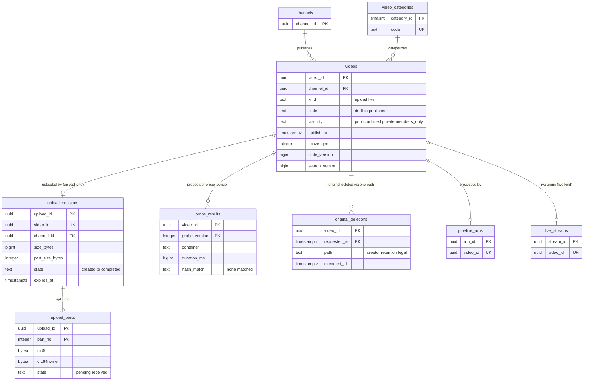

# Data model: 動画とアップロード

[data-model.md](../data-model.md) の一部。規約はそちらの 3 節に従う。振る舞いは [upload-and-ingest.md](../upload-and-ingest.md)（4〜7 節）を正とする。決定は [ADR-0002](../../decisions/0002-upload-and-pipeline-orchestration.md)（セッションとパイプライン）、[ADR-0011](../../decisions/0011-upload-session-protocol-and-checksums.md)（部分とチェックサム）、[ADR-0012](../../decisions/0012-media-probe-and-admission-checks.md)（検査）、[ADR-0013](../../decisions/0013-original-retention-and-deletion-paths.md)（元のファイルの消去）、[ADR-0009](../../decisions/0009-single-tenant-and-playable.md)（`playable()`）。

| 表 | スキーマ | 書く |
| --- | --- | --- |
| `videos` | `media` | 作成と情報の編集は `svc_upload`・`svc_api`。状態は `svc_pipeline`（`publish_gate`）・予約の公開の作業・`svc_api`（措置の要約）。列ごとの持ち主は 2.1 節 |
| `video_categories` | `media` | 運用（参照のデータ） |
| `upload_sessions`、`upload_parts` | `media` | `svc_upload` |
| `probe_results` | `media` | `svc_pipeline`（`probe` の段） |
| `original_deletions` | `media` | `svc_api`（創作者の削除）、`svc_retention`、法務の承認の API。実行の列は `original_deleter` |

- **`videos` は多くの領域が列を持つ 1 つの表**である。持ち主（書く領域）を列ごとに決め、他の領域は読むだけにする（2.1 節の表）。
- 動画の題・説明は `videos` にだけあり、ログ・MSK・Valkey の鍵に入れない（[AGENTS.md](../../../AGENTS.md)）。
- 元のファイルは S3 `orig/{video_id}/source`（[stores.md](stores.md) の 3 節）。この文書の表は、その記録と消去の経路だけを持つ。

## 1. ER 図

- `videos ||--o| upload_sessions`：`kind = 'upload'` の動画はセッションを 1 つ持つ。`kind = 'live'` の動画（ライブとそのアーカイブ）は持たない（任意の参照）。
- `videos ||--o| pipeline_runs`：動画ごとに run は 1 つ（`pipeline_runs.video_id` の一意）。AV1 や作り直しは同じ run に作業を足す（[transcoding-and-renditions.md](transcoding-and-renditions.md)）。
- `probe_results` は `probe_version` ごとの行で、検査の規則のバージョンを上げて調べ直したときに行が増える。
- `original_deletions` は 3 つの経路（`creator`・`retention`・`legal`）の記録で、消去の前に書く（ADR-0013）。

## 2. 表

### 2.1 `videos`

動画の正本。RLS は「公開の行」と「持ち主のチャンネル」の 2 つのポリシーにする（D-5）。

| 列 | 型 | NULL | 既定 | 説明 | 書く領域 |
| --- | --- | --- | --- | --- | --- |
| `video_id` | `uuid` | NOT NULL | `uuidv7()` | 公開の形は 22 文字（3.2 節） | upload |
| `channel_id` | `uuid` | NOT NULL | — | | upload |
| `kind` | `text` | NOT NULL | `'upload'` | `upload`・`live`（ライブの配信とそのアーカイブ） | upload・live |
| `premiere` | `boolean` | NOT NULL | `false` | プレミア公開（[live-streaming.md](../live-streaming.md) の 9 節） | upload |
| `state` | `text` | NOT NULL | `'draft'` | `draft`・`uploaded`・`processing`・`failed`・`quarantined`・`ready`・`blocked`・`scheduled`・`published`・`removed`・`abandoned`（[upload-and-ingest.md](../upload-and-ingest.md) の 6.1 節） | upload・pipeline |
| `fail_reason` | `text` | NULL | — | `corrupt_media`・`duration_exceeded`・`resolution_exceeded`・`probe_timeout`・`probe_oom`・`unsupported_format` | pipeline |
| `visibility` | `text` | NOT NULL | `'private'` | `public`・`unlisted`・`private`・`members_only` | upload |
| `publish_at` | `timestamptz` | NULL | — | 予約の公開 | upload |
| `published_at` | `timestamptz` | NULL | — | 最初に `published` になった時刻（層の移しのタグ `published_at` の元） | upload |
| `title` | `text` | NOT NULL | `''` | 100 文字まで。ログに出さない | upload |
| `description` | `text` | NOT NULL | `''` | 5,000 文字まで | upload |
| `category_id` | `smallint` | NULL | — | `video_categories` | upload |
| `tags` | `text[]` | NOT NULL | `'{}'` | 500 文字まで | upload |
| `default_language` | `text` | NULL | — | BCP 47。ASR の言語 | upload |
| `duration_ms` | `bigint` | NULL | — | `probe` の後に書く | pipeline |
| `source_size` | `bigint` | NULL | — | 元のファイルのバイト | upload |
| `source_s3_key` | `text` | NULL | — | `orig/{video_id}/source` | upload |
| `source_crc64nvme` | `bytea` | NULL | — | 全体のチェックサム（段の入力のハッシュの元） | upload |
| `max_height`・`fps_num`・`fps_den` | `integer` | NULL | — | 元のファイルの解像度とフレームレート（AV1 の条件、ラダーの上限） | pipeline |
| `active_gen` | `integer` | NULL | — | マニフェストに出す世代（[packaging-and-drm.md](../packaging-and-drm.md) の 4.5 節） | packaging |
| `drm_required` | `boolean` | NOT NULL | `false` | メンバー限定の間 `true`。`origin-cache` がクリアのパスに 403 | packaging |
| `ads_enabled` | `boolean` | NOT NULL | `true` | 創作者の動画の広告の設定 | monetization |
| `age_restricted` | `boolean` | NOT NULL | `false` | 創作者の申告か措置 `age_restrict` | moderation |
| `made_for_kids` | `boolean` | NULL | — | 子ども向けの印。アップロードで必ず答える（`draft` の間だけ NULL） | moderation |
| `mfk_source` | `text` | NULL | — | `creator`・`channel_default`・`staff` | moderation |
| `paid_promotion` | `boolean` | NOT NULL | `false` | タイアップの申告（L4） | moderation |
| `comments_enabled` | `boolean` | NOT NULL | `true` | 動画の既定（`video_comment_settings` が上書き） | moderation |
| `mod_flags` | `text[]` | NOT NULL | `'{}'` | 措置の要約：`interstitial`・`age_restricted`・`limited`・`limited_search`・`removed` | moderation |
| `mod_blocked_regions` | `text[]` | NOT NULL | `'{}'` | 措置の地域での非表示（ISO 3166-1 alpha-2） | moderation |
| `state_version` | `bigint` | NOT NULL | `0` | 状態・公開の範囲・措置・照合の結果が変わるたびに 1 上げる。`playable()` の写し（`pv:`）は大きい値だけを当てる | 書く全領域（トリガー） |
| `search_version` | `bigint` | NOT NULL | `0` | 検索の文書の外部のバージョン。索引に効く列が変わるたびに 1 上げる（トリガー） | search |
| `delete_requested_at` | `timestamptz` | NULL | — | 創作者の削除の依頼（30 日の猶予。戻せる）。NULL でなければ `playable()` は `deny`（D-22） | upload |
| `created_at`・`updated_at` | `timestamptz` | NOT NULL | `now()` | | — |

- キー：PK `(video_id)`。FK `channel_id → channels`、`category_id → video_categories`。
- 索引：
  - `(channel_id, created_at DESC)` — Studio の動画の一覧。
  - `(publish_at) WHERE state = 'scheduled'` — 予約の公開の作業（10 秒ごと、`FOR UPDATE SKIP LOCKED`、500 行）。
  - `(channel_id, published_at DESC) WHERE state = 'published' AND visibility = 'public'` — チャンネルのページ、`ch_recent:` の作り直し。
  - `(delete_requested_at) WHERE delete_requested_at IS NOT NULL` — 猶予の後の削除の作業。
  - `(state, updated_at) WHERE state IN ('processing','uploaded')` — 照合待ち・処理の滞りの見張り（30 分で Ops）。
- CHECK：
  - `state IN (…)`、`visibility IN (…)`、`kind IN ('upload','live')`。
  - `state <> 'scheduled' OR publish_at IS NOT NULL`。
  - `state NOT IN ('published','scheduled','ready') OR duration_ms IS NOT NULL`。
  - `NOT (visibility = 'members_only' AND made_for_kids)`（子ども向けはメンバー限定を選べない）。
  - `state_version >= 0`。`state_version` と `search_version` を下げる更新はトリガーで拒む。
- **公開の門**：`state` を `ready`・`scheduled`・`published` に変える更新は、トリガーで `pipeline_runs.gate_result = 'publish'` と、その run の `match_runs.state = 'done'` を確かめる（`kind = 'live'` は `live_streams` の照合の窓の判定。[data-model.md](../data-model.md) の 6 節の 1 行目）。
- RLS（FORCE）：
  - `video_public`（SELECT）：`state = 'published' AND delete_requested_at IS NULL`。見える範囲の細部は `playable()` が決める（RLS は粗い門）。
  - `video_owner`（ALL）：`channel_id = ANY(app.channel_ids)`。
  - システムのロール（`svc_pipeline`・`svc_packager`・`svc_relay`・`svc_search`・`svc_views`・`svc_match`・`svc_claims`・`svc_retention`・`svc_blocker`）には全行のポリシー（3.3 節の表）。
- 状態の遷移は条件つきの `UPDATE ... WHERE state = $prev` と outbox の `video_state_changed` を同じトランザクションで書く。
- 削除：創作者の削除は `delete_requested_at` から 30 日の後に、レンディション・指紋・字幕・大阪の写しを消し（[security.md](../security.md) の 6.1 節）、行を `removed` のまま題・説明・タグを空にして残す（措置と台帳の参照のため）。`failed`・`abandoned` は 30 日の後に同じ。
- S1 の量：1 日 約 7,200 本、1 年 約 260 万行（ライブのアーカイブを含めて約 270 万）。

**`videos` を読む領域**（列の写し）：

| 写し | 列 | 更新 |
| --- | --- | --- |
| Valkey `pv:{video_id}`（`playable()`） | `state`、`visibility`、`channel_id`、`publish_at`、`age_restricted`、`made_for_kids`、`mod_flags`、`mod_blocked_regions`、`drm_required`、`delete_requested_at`、`state_version`、`claim_effects` の地域ごとの結果、`account_standing.state` | outbox から 60 秒以内（ADR-0009） |
| Valkey `rend:{video_id}` | `active_gen`、`drm_required`、`renditions` の `ready` の段 | outbox |
| OpenSearch `videos-v{n}` | 題・説明・タグ・チャプター、絞り込みの印、`search_version` | outbox（[search.md](../search.md) の 9 節） |

### 2.2 `video_categories`

| 列 | 型 | NULL | 既定 | 説明 |
| --- | --- | --- | --- | --- |
| `category_id` | `smallint` | NOT NULL | — | |
| `code` | `text` | NOT NULL | — | `music`・`gaming`・`education` など |
| `name_ja`・`name_en` | `text` | NOT NULL | — | |
| `kids_ok` | `boolean` | NOT NULL | `true` | 子ども向けの並びの `category` の源に使えるか |

- キー：PK `(category_id)`、UK `(code)`。RLS：なし（参照のデータ）。S1 の量：約 30 行。D-19 で足した表（おすすめの `category` の源と検索の絞り込みが参照する）。

### 2.3 `upload_sessions`

再開できるアップロードのセッション（ADR-0011）。チャンネルの表。

| 列 | 型 | NULL | 既定 | 説明 |
| --- | --- | --- | --- | --- |
| `upload_id` | `uuid` | NOT NULL | `uuidv7()` | |
| `video_id` | `uuid` | NULL | — | `purpose = 'video'` のとき。同じトランザクションで `videos`（`draft`）を作る |
| `channel_id` | `uuid` | NULL | — | `purpose = 'video'` のとき |
| `rights_owner_id` | `uuid` | NULL | — | `purpose = 'reference'` のとき |
| `actor_id` | `uuid` | NOT NULL | — | 上げたアカウント |
| `purpose` | `text` | NOT NULL | `'video'` | `video`・`reference`（権利者の参照のファイル。`reference_id` を持つ） |
| `reference_id` | `uuid` | NULL | — | `purpose = 'reference'` のとき |
| `filename_ext` | `text` | NOT NULL | — | 拡張子だけ（ファイルの名前を持たない） |
| `mime` | `text` | NOT NULL | — | 申告の値（信じない。検査で中身を判定） |
| `size_bytes` | `bigint` | NOT NULL | — | 256 GB まで |
| `part_size_bytes` | `integer` | NOT NULL | — | 8・16・32・64 MiB |
| `part_count` | `integer` | NOT NULL | — | `ceil(size_bytes / part_size_bytes)`、10,000 まで |
| `s3_upload_id` | `text` | NOT NULL | — | S3 のマルチパートの ID |
| `crc64nvme` | `bytea` | NULL | — | 完了の時にクライアントが出す全体の値（8 バイト） |
| `sha256` | `bytea` | NULL | — | 任意の全体の SHA-256（32 バイト） |
| `state` | `text` | NOT NULL | `'created'` | `created`・`uploading`・`completing`・`verifying`・`completed`・`rejected`・`expired`・`aborted` |
| `reject_count` | `smallint` | NOT NULL | `0` | `BadDigest` の回数（3 回で `rejected`） |
| `created_at` | `timestamptz` | NOT NULL | `now()` | |
| `expires_at` | `timestamptz` | NOT NULL | — | `created_at + 7 日` |
| `completed_at` | `timestamptz` | NULL | — | |

- キー：PK `(upload_id)`。UK `(video_id)`、UK `(reference_id)`。FK `video_id → videos`、`channel_id → channels`、`rights_owner_id → rights_owners`、`reference_id → content_references`。
- 索引：`(state, expires_at) WHERE state IN ('created','uploading')` — 期限の掃除（1 時間ごと）。`(state, created_at) WHERE state IN ('completing','verifying')` — 止まった完了の見直し（5 分ごと）。`(channel_id) WHERE state IN ('created','uploading','completing','verifying')` — 同時のセッション 10 の上限。
- CHECK：`size_bytes BETWEEN 1 AND 256000000000`、`part_size_bytes IN (8388608, 16777216, 33554432, 67108864)`、`part_count BETWEEN 1 AND 10000`、`part_count = ceil(size_bytes::numeric / part_size_bytes)`、`(purpose = 'video') = (video_id IS NOT NULL AND channel_id IS NOT NULL)`、`(purpose = 'reference') = (reference_id IS NOT NULL AND rights_owner_id IS NOT NULL)`、`state <> 'completed' OR (crc64nvme IS NOT NULL AND completed_at IS NOT NULL)`。
- RLS（FORCE）：チャンネルの表（`channel_id`）か権利者の表（`rights_owner_id`）の 2 つのポリシー。`svc_upload` に全行（見直しの作業）。
- 保持：終わりの状態から 30 日で消す。S1 の量：約 1 万行（30 日）。

### 2.4 `upload_parts`

| 列 | 型 | NULL | 既定 | 説明 |
| --- | --- | --- | --- | --- |
| `upload_id` | `uuid` | NOT NULL | — | |
| `part_no` | `integer` | NOT NULL | — | 1..`part_count` |
| `md5` | `bytea` | NOT NULL | — | 部分の MD5（URL を出す前にクライアントが出す。署名に含める） |
| `crc64nvme` | `bytea` | NOT NULL | — | 部分の CRC64NVME |
| `etag` | `text` | NULL | — | S3 の ETag（確定の時） |
| `state` | `text` | NOT NULL | `'pending'` | `pending`・`received` |
| `received_at` | `timestamptz` | NULL | — | |

- キー：PK `(upload_id, part_no)`。FK `upload_id → upload_sessions`（`ON DELETE CASCADE`）。
- CHECK：`part_no >= 1`、`(state = 'received') = (etag IS NOT NULL AND received_at IS NOT NULL)`。
- 完了の確かめ：`count(*) FILTER (WHERE state = 'received') = part_count` と、S3 の `ListParts` の番号・大きさ・チェックサムの一致（ADR-0011）。
- RLS：`upload_sessions` の結合のポリシー（チャンネルの表）。保持：セッションと一緒に消す。S1 の量：約 100 万行（30 日。平均 100 部分）。

### 2.5 `probe_results`

| 列 | 型 | NULL | 既定 | 説明 |
| --- | --- | --- | --- | --- |
| `video_id` | `uuid` | NOT NULL | — | |
| `probe_version` | `integer` | NOT NULL | — | 検査の規則のバージョン（コードで出す） |
| `container` | `text` | NOT NULL | — | `mp4`・`mov`・`matroska`・`webm`・`mpegts`・`avi`・`flv` |
| `tracks` | `jsonb` | NOT NULL | — | トラックの一覧（種類、符号、言語、チャンネル数）。ファイルの名前・メタデータの文字列は入れない |
| `duration_ms` | `bigint` | NOT NULL | — | |
| `width`・`height` | `integer` | NOT NULL | — | 回転を当てた後 |
| `fps_num`・`fps_den` | `integer` | NOT NULL | — | 標準の値に直した後 |
| `hdr` | `boolean` | NOT NULL | `false` | |
| `corrupt_ranges` | `jsonb` | NOT NULL | `'[]'` | `[{"from_ms":…,"to_ms":…}]`（埋めた区間） |
| `scene_cuts_key` | `text` | NULL | — | 場面の切り替えの点の S3 のキー（`orig/{video_id}/scene_cuts.bin`） |
| `hash_match` | `text` | NOT NULL | — | `none`・`matched`（既知の違法なメディア） |
| `result` | `text` | NOT NULL | — | `ok`・`failed` |
| `fail_reason` | `text` | NULL | — | `videos.fail_reason` と同じ値 |
| `created_at` | `timestamptz` | NOT NULL | `now()` | |

- キー：PK `(video_id, probe_version)`。CHECK：`duration_ms <= 43200000`（12 時間）、`(result = 'failed') = (fail_reason IS NOT NULL)`、`hash_match <> 'matched' OR result = 'failed'`。
- RLS：なし（システムの表。`svc_pipeline` が書き、`svc_api` が要約だけを創作者に返す。`hash_match` は創作者に見せない）。
- 保持：動画と同じ。S1 の量：約 270 万行/年。

### 2.6 `original_deletions`

元のファイルの消去の記録（ADR-0013）。`original-deleter` はこの行を読み、保全を確かめてから消す。

| 列 | 型 | NULL | 既定 | 説明 |
| --- | --- | --- | --- | --- |
| `video_id` | `uuid` | NOT NULL | — | ライブの元の流れは `live_streams.video_id` |
| `requested_at` | `timestamptz` | NOT NULL | `now()` | |
| `object_kind` | `text` | NOT NULL | `'source'` | `source`（`orig/`）・`live_source`（`live-src/`） |
| `path` | `text` | NOT NULL | — | `creator`・`retention`・`legal` |
| `approved_by` | `uuid` | NULL | — | 法的な削除の承認者（`path = 'legal'` は必須） |
| `not_before` | `timestamptz` | NOT NULL | — | 猶予の終わり（創作者 30 日、保持の期限 30 日、法的 承認から 24 時間以内） |
| `executed_at` | `timestamptz` | NULL | — | |
| `s3_versions` | `jsonb` | NULL | — | 消した東京と大阪の全バージョンの ID |
| `skipped_reason` | `text` | NULL | — | `legal_hold`・`restored`（創作者が戻した） |

- キー：PK `(video_id, requested_at)`。索引 `(not_before) WHERE executed_at IS NULL AND skipped_reason IS NULL` — `original-deleter` の作業。
- CHECK：`path IN ('creator','retention','legal')`、`path <> 'legal' OR approved_by IS NOT NULL`、`NOT (executed_at IS NOT NULL AND skipped_reason IS NOT NULL)`。
- `executed_at`・`s3_versions` の UPDATE は `original_deleter` のロールだけ（列の権限）。行の DELETE は誰にも与えない（追記だけ。取り消しは `skipped_reason`）。
- RLS：なし（システムの表）。保持：消さない（消去の証跡。件数は動画の数以下）。S1 の量：約 10 万行/年。
