# Data model: 視聴の計測と分析

[data-model.md](../data-model.md) の一部。規約はそちらの 3 節に従う。振る舞いは [view-counting-and-analytics.md](../view-counting-and-analytics.md)（4〜8 節）を正とする。決定は [ADR-0007](../../decisions/0007-two-phase-view-counting.md)（2 段の数）、[ADR-0034](../../decisions/0034-watch-event-envelope-and-ingest.md)（封筒と受け口）、[ADR-0035](../../decisions/0035-view-rules-catalog-and-public-count-composition.md)（規則と 3 つの層）、[ADR-0036](../../decisions/0036-watch-time-retention-and-analytics-store.md)（総再生時間と分析の置き場所）。

| 表・置き場所 | スキーマ | 書く |
| --- | --- | --- |
| `view_counts_hourly`、`view_counts_daily`、`view_adjustments`、`video_view_totals` | `analytics` | `svc_views`（`view-verifier` の 1 時間と 1 日の確定） |
| `video_stats_daily`、`video_stats_hourly`、`channel_stats_daily_dim` | `analytics` | `svc_views` |
| `datacenter_asns`、`bot_ua_classes` | `analytics` | 運用（`view-rules` の S06・S07 の一覧） |
| 出来事 | MSK `watch-events`・`watch-events-rejected` → Iceberg `watch_events`、`watch_sessions` | `event-collector`、`view-verifier`（[stores.md](stores.md) の 4・5 節、封筒は [formats.md](formats.md) の 7 節） |
| 仮の数 | Valkey `vc:p:`・`vc:pub:`・`vd:`・`vh:` | `view-validator`、`api`（[stores.md](stores.md) の 1 節） |

- **確定の数だけが収益に入る**。収益、収益化の条件、AV1 の時機、おすすめと検索の人気は `view_counts_daily`（1 日の確定）だけを読む。仮の数と 1 時間の確定は公開の数の表示と分析の速報だけ（ADR-0007、ADR-0035。[data-model.md](../data-model.md) の 6 節）。
- 確定の行は使った `ruleset_version` を持つ。規則を変えた作り直しは影の表に書き、差を QA が確かめてから入れ替える（[view-counting-and-analytics.md](../view-counting-and-analytics.md) の 5.5 節）。
- 視聴者ごとの値（`viewer_key`、IP の粗い値）は Iceberg にだけあり、Aurora の表は動画・チャンネルの集計だけを持つ。

## 1. ER 図

```mermaid
erDiagram
    videos ||--o{ view_counts_hourly : "hourly verified"
    videos ||--o{ view_counts_daily : "daily verified"
    videos ||--o{ view_adjustments : "layer deltas"
    videos ||--o| video_view_totals : "cumulative daily total"
    videos ||--o{ video_stats_daily : "daily analytics"
    videos ||--o{ video_stats_hourly : "recent 72h"
    channels ||--o{ channel_stats_daily_dim : "daily by dimension"
    channels ||--o{ video_stats_daily : "owns stats"

    videos {
        uuid video_id PK
        uuid channel_id FK
    }
    channels {
        uuid channel_id PK
    }
    view_counts_hourly {
        uuid video_id PK
        timestamptz hour PK
        bigint views
        bigint engaged_views
        bigint watch_ms
        text ruleset_version
    }
    view_counts_daily {
        uuid video_id PK
        date day PK
        bigint views
        bigint engaged_views
        bigint watch_ms
        text ruleset_version
    }
    view_adjustments {
        uuid video_id PK
        timestamptz period PK
        text stage PK "provisional_to_hourly hourly_to_daily recompute"
        text rule_id PK
        bigint delta
    }
    video_view_totals {
        uuid video_id PK
        bigint views_total
        date through_day
    }
    video_stats_daily {
        uuid video_id PK
        date day PK
        uuid channel_id FK
        integer[] retention_cover
    }
    video_stats_hourly {
        uuid video_id PK
        timestamptz hour PK
        uuid channel_id FK
    }
    channel_stats_daily_dim {
        uuid channel_id PK
        date day PK
        text dim PK
        text value PK
        bigint views
    }
    datacenter_asns {
        integer asn PK
        text source
    }
    bot_ua_classes {
        text ua_class PK
        text description
    }
```

- 分割した表（`view_counts_hourly`・`view_counts_daily`・`view_adjustments`・`video_stats_daily`・`video_stats_hourly`・`channel_stats_daily_dim`）へは外部キーを張らない。図の線は論理の参照（3.8 節）。
- `datacenter_asns`・`bot_ua_classes` は規則の一覧で、他の表と結ばない。

## 2. 表

### 2.1 `view_counts_hourly`

1 時間の確定（時間 `H` の終わりから 70 分の後。S 系と B01・B03・B04・B08）。

| 列 | 型 | NULL | 既定 | 説明 |
| --- | --- | --- | --- | --- |
| `video_id` | `uuid` | NOT NULL | — | |
| `hour` | `timestamptz` | NOT NULL | — | 時間の頭（UTC で保存、表示は JST） |
| `views` | `bigint` | NOT NULL | — | 有効な視聴 |
| `engaged_views` | `bigint` | NOT NULL | — | 30 秒以上（30 秒未満の動画は 90%） |
| `watch_ms` | `bigint` | NOT NULL | — | 総再生時間（区間の和集合の長さ） |
| `ruleset_version` | `text` | NOT NULL | — | `view-rules` の規則の組（例：`1.0`） |
| `computed_at` | `timestamptz` | NOT NULL | `now()` | |

- キー：PK `(video_id, hour)`。CHECK：`views >= 0`、`engaged_views <= views`、`watch_ms >= 0`、`extract(minute from hour) = 0`。
- 分割：`hour` の月。保持：90 日（公開の数の組み立ては 1 日の確定までの間だけ使う）。
- RLS：なし（集計。チャンネルの分析は `video_stats_hourly` を読む）。S1 の量：見られた動画 × 時間で 1 日 約 1,500 万行、90 日で約 13.5 億行（分割ごとに約 4.5 億）。E7 の `view-verifier` で量を測り、見られた時間だけ行を書く。

### 2.2 `view_counts_daily`

1 日の確定（翌日 JST 6:00。S 系と B01〜B08、遅れた出来事を含む）。収益の元。

| 列 | 型 | NULL | 既定 | 説明 |
| --- | --- | --- | --- | --- |
| `video_id` | `uuid` | NOT NULL | — | |
| `day` | `date` | NOT NULL | — | JST の暦の日 |
| `views`・`engaged_views`・`watch_ms` | `bigint` | NOT NULL | — | 2.1 節と同じ定義 |
| `ruleset_version` | `text` | NOT NULL | — | |
| `computed_at` | `timestamptz` | NOT NULL | `now()` | |
| `recomputed_from` | `text` | NULL | — | 作り直しの前の `ruleset_version`（作り直した行だけ） |

- キー：PK `(video_id, day)`。CHECK：2.1 節と同じ。
- 索引：`(day) INCLUDE (video_id, engaged_views)` — 収益の日ごとの積み上げ（[monetization-ledger-and-payouts.md](monetization-ledger-and-payouts.md) の 2.8 節）、人気の写しの作成。
- 分割：`day` の月。保持：25 か月（それより前は `video_view_totals` に足し込む）。締めた収益の月の行は書き換えない（作り直しの差は `view_adjustments` と調整の仕訳）。
- RLS：なし。S1 の量：1 日 約 100 万行（見られた動画）、25 か月で約 7.5 億行。

### 2.3 `view_adjustments`

層の移りで変わった数の記録（[view-counting-and-analytics.md](../view-counting-and-analytics.md) の 5.5 節）。

| 列 | 型 | NULL | 既定 | 説明 |
| --- | --- | --- | --- | --- |
| `video_id` | `uuid` | NOT NULL | — | |
| `period` | `timestamptz` | NOT NULL | — | 時間の頭か、日の頭（JST の 0:00） |
| `stage` | `text` | NOT NULL | — | `provisional_to_hourly`・`hourly_to_daily`・`recompute` |
| `rule_id` | `text` | NOT NULL | — | `S01`〜`S08`・`B01`〜`B08`・`LATE`（遅れた出来事で増えた分） |
| `delta` | `bigint` | NOT NULL | — | 視聴の増減（負は除いた数） |
| `ruleset_version` | `text` | NOT NULL | — | |
| `created_at` | `timestamptz` | NOT NULL | `now()` | |

- キー：PK `(video_id, period, stage, rule_id)`。CHECK：`delta <> 0`、`rule_id ~ '^(S0[1-8]|B0[1-8]|LATE)$'`。
- 創作者の分析は規則の ID と理由のコードを見せ、しきい値を見せない。
- 分割：`period` の月。保持：13 か月。RLS：なし（分析の API がチャンネルの動画に絞って読む）。S1 の量：1 日 約 30 万行。

### 2.4 `video_view_totals`

公開の数の「締めた日までの 1 日の確定」の和（D-19 で足した表）。`api` が 30 秒ごとに `vc:pub:` を作るときに、日ごとの行を足し直さないため。

| 列 | 型 | NULL | 既定 | 説明 |
| --- | --- | --- | --- | --- |
| `video_id` | `uuid` | NOT NULL | — | |
| `views_total`・`engaged_total`・`watch_ms_total` | `bigint` | NOT NULL | `0` | `through_day` までの 1 日の確定の和 |
| `through_day` | `date` | NOT NULL | — | 最後に締めた日 |
| `updated_at` | `timestamptz` | NOT NULL | `now()` | |

- キー：PK `(video_id)`。1 日の確定と同じトランザクションで足す（`through_day` が進むときだけ）。作り直しでは全期間を足し直す。
- 公開の数 ＝ `views_total` ＋ `through_day` より後の 1 時間の確定 ＋ それより後の仮の数（[view-counting-and-analytics.md](../view-counting-and-analytics.md) の 5.3 節）。
- RLS：なし。保持：動画と同じ。S1 の量：約 300 万行。

### 2.5 `video_stats_daily`

動画 × 日の分析の合計（ADR-0036）。チャンネルの表。

| 列 | 型 | NULL | 既定 | 説明 |
| --- | --- | --- | --- | --- |
| `video_id` | `uuid` | NOT NULL | — | |
| `day` | `date` | NOT NULL | — | |
| `channel_id` | `uuid` | NOT NULL | — | RLS の列 |
| `views`・`engaged_views`・`watch_ms` | `bigint` | NOT NULL | — | 1 日の確定と同じ値 |
| `retention_buckets` | `smallint` | NOT NULL | — | `min(200, ceil(長さ / 1 秒))` |
| `retention_cover` | `integer[]` | NOT NULL | — | 桶ごとの覆いの数（長さは `retention_buckets`） |
| `impressions`・`impression_plays` | `bigint` | NOT NULL | `0` | 表示と表示からの再生（`rec-events`・`search-events` から） |
| `excluded_views` | `bigint` | NOT NULL | `0` | 確かめで除いた視聴（`view_adjustments` の和） |

- キー：PK `(video_id, day)`。索引 `(channel_id, day)` — チャンネルの動画の一覧の分析。
- CHECK：`cardinality(retention_cover) = retention_buckets`。
- 分割：`day` の月。保持：13 か月。RLS（FORCE）：チャンネルの表。`svc_views`・`svc_recs`（特徴の写し `vf:`）・`svc_search`（`engaged_30d`）に全行。
- S1 の量：1 日 約 100 万行、13 か月で約 4 億行。

### 2.6 `video_stats_hourly`

直近 72 時間の 1 時間の確定（分析の速報）。

| 列 | 型 | NULL | 既定 | 説明 |
| --- | --- | --- | --- | --- |
| `video_id` | `uuid` | NOT NULL | — | |
| `hour` | `timestamptz` | NOT NULL | — | |
| `channel_id` | `uuid` | NOT NULL | — | |
| `views`・`engaged_views`・`watch_ms` | `bigint` | NOT NULL | — | |

- キー：PK `(video_id, hour)`。索引 `(channel_id, hour)`。分割：`hour` の日。保持：3 日（分割を `DROP`）。RLS（FORCE）：チャンネルの表。S1 の量：約 4,500 万行。

### 2.7 `channel_stats_daily_dim`

チャンネル × 日 × 1 つの切り口（ADR-0036）。

| 列 | 型 | NULL | 既定 | 説明 |
| --- | --- | --- | --- | --- |
| `channel_id` | `uuid` | NOT NULL | — | |
| `day` | `date` | NOT NULL | — | |
| `dim` | `text` | NOT NULL | — | `src`・`device_class`・`pref`・`captions`・`subscribed`・`total` |
| `value` | `text` | NOT NULL | — | 切り口の値。視聴が 50 未満の値は `other` にまとめる |
| `views`・`engaged_views`・`watch_ms` | `bigint` | NOT NULL | — | |
| `subscribers_net` | `integer` | NULL | — | `dim = 'total'` の行だけ（`subscription_changed` の日の和） |

- キー：PK `(channel_id, day, dim, value)`。CHECK：`dim = 'total' OR subscribers_net IS NULL`。
- 分割：`day` の月。保持：Aurora に 90 日、その後は S3 の Parquet（`analytics/channel_dim/`）で 13 か月（L5）。
- RLS（FORCE）：チャンネルの表。S1 の量：1 日 約 300 万行、90 日で約 2.7 億行。

### 2.8 `datacenter_asns`・`bot_ua_classes`

| 表 | 列 | キー | 説明 |
| --- | --- | --- | --- |
| `datacenter_asns` | `asn integer`、`source text`（`manual`・`feed`）、`note text`、`added_at timestamptz`、`removed_at timestamptz NULL` | PK `(asn)` | S06 の一覧 |
| `bot_ua_classes` | `ua_class text`、`description text`、`added_at timestamptz` | PK `(ua_class)` | S07 の既知のボットの型 |

- 一覧の変更は `ruleset_version` を上げない（値の一覧で、規則の式ではない）。変更の時刻を確定の行と突き合わせられるよう、監査の記録に残す。
- `view-validator`・`view-verifier` は起動の時と 10 分ごとに読む。RLS：なし。S1 の量：数千行。
