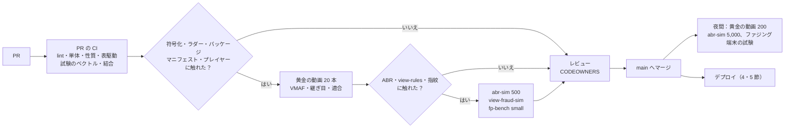
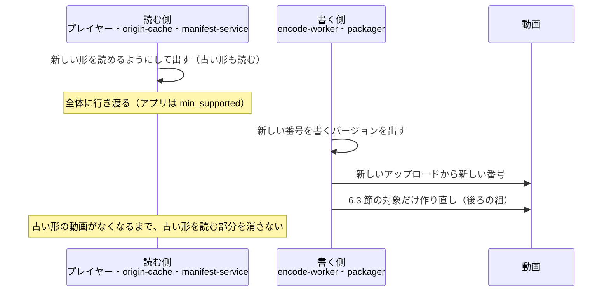

# Delivery: YouTube

変更からマージまでの CI、黄金の動画の適合の関門、成果物とフラグ、デプロイの順序（管理の面、メディアの面の作業者のプール、ライブ、`match-engine`、`origin-cache`、エッジの関数、AMI）、プレイヤー（Web）とアプリの配布、形式のバージョン（`ladder_version`、符号化器の組み立て、`fp_version`、マニフェストの形式、索引、トークン、出来事）の更新の順序、符号化器の固定と作り直しの方針、スキーマの変更を決める。リリースとロールバックの運用の規則（時間帯、凍結、自動のロールバックの条件）の正本は [runbooks/](../runbooks/README.md) の 3 節で、この文書は仕組みを書く。

この文書で決めたことは次の ADR にある。

| ADR | 決定 |
| --- | --- |
| [0070](../decisions/0070-ci-cd-golden-media-gates-and-player-rollout.md) | PR の CI に黄金の動画の小さな集まり（20 本）の関門を置き、符号化・ラダー・パッケージ・マニフェスト・プレイヤーに触れる変更は通らなければマージしない。全集まり（200 本）は夜間とリリースの前。メディアの面のデプロイは「足してから抜く」（作業者のプールの入れ替え、`match-engine` は AZ ごと、`live-transcoder` は配信中を止めない）。Web のプレイヤーは 1%・10%・50%・100% の段で、プレイヤーのバージョンごとの QoE で自動に止める。アプリは最低のバージョンを再生の API で強制できる |
| [0071](../decisions/0071-encoder-pinning-reencode-and-manifest-format-versions.md) | 符号化器の組み立て（FFmpeg のライブラリ、x264、SVT-AV1、libvmaf とモデル、組み立ての旗、命令セット）を `enc_build` の番号に固定し、段の出力のキーの設定のハッシュに入れる。`enc_build` を上げても既存の動画は作り直さない。作り直しは、欠陥の修正（影響した `enc_build` の動画だけ）と、新しい `ladder_version` の損益が合う動画（視聴の多い順）だけに限る。マニフェストの出力のバイトを変える変更は、URL の `mf` の番号を上げ、読む側（プレイヤー）は 2 つ前の `mf` まで読めるままにする |

前提：トランクベースの開発とフラグ（リポジトリ共通の決定）、段の出力のキーと冪等（[ADR-0014](../decisions/0014-pipeline-task-leases-and-idempotent-outputs.md)）、`ladder_version`（[ADR-0003](../decisions/0003-codecs-and-per-title-ladder.md)、[ADR-0015](../decisions/0015-per-title-ladder-convex-hull.md)）、URL の世代（[ADR-0019](../decisions/0019-cmaf-files-segment-index-and-url-layout.md)）、マニフェストの能力の組（[ADR-0020](../decisions/0020-manifest-generation-and-capability-classes.md)）、品質の確認ループ（[quality.md](../quality.md) の 2.3 節）。

## 1. 範囲と要件

| 要件 | 目標 | 根拠 |
| --- | --- | --- |
| 静かな画質の誤りを出さない | 符号化・ラダーの変更で、黄金の動画の平均の VMAF が 1 以上下がる、平均のビットレートが 5% 以上上がる、継ぎ目の不一致が 1 件でもある変更をマージしない | [quality.md](../quality.md) の 2.2.1 節 A |
| 配ったものを壊さない | 配っている URL の中身が変わらない。プレイヤーが読めない形式を配らない | [ADR-0019](../decisions/0019-cmaf-files-segment-index-and-url-layout.md) |
| 配信を止めない | デプロイで配信中のライブを切らない。VOD の作業を失わない | [runbooks](../runbooks/README.md) の 3 節 |
| 戻せる | まずフラグ、次に 1 つ前のイメージで戻る。新しい形式で作ったものを、前のコードでも読める | 同上 |
| 速さ | PR の CI p95 25 分（黄金の動画の小さな集まりを含む） | 本システムの値 |

## 2. 変更からマージまで

### 2.1 PR の CI（必須）

| 関門 | 中身 | 当てる変更 |
| --- | --- | --- |
| 形 | `cargo fmt`・`clippy -D warnings`、`pnpm lint`・`typecheck` | すべて |
| 単体・表駆動・試験のベクトル | `cargo test`、`pnpm test --changed`。決定表は spec の表を読み込む | すべて |
| 性質 | proptest・fast-check 2,000 試行 | すべて |
| 結合 | Testcontainers（PostgreSQL 18、Valkey、Kafka）、LocalStack | 触れた部品 |
| 黄金の動画（小） | 3 節 | `crates/ladder`、`crates/cmaf`、`encode-worker`、`packager`、`manifest-service`、プレイヤー、`enc_build` |
| ABR の模擬 | `abr-sim --traces 500` | ABR |
| 不正の場面 | `view-fraud-sim --scale small` | `crates/view-rules` |
| 歪めた参照 | `fp-bench --set small` | `crates/fingerprint`、`crates/match` |
| 依存の検査 | 禁止の一覧（本家の実装、MediaConvert などの SDK）、FFmpeg の LGPL の組み立て、GPL の部品が配布物に入らない（[ADR-0001](../decisions/0001-platform-and-stack.md)） | 依存の変更 |
| テストの緩和の検出 | テストの削除・skip・期待値の緩和、VMAF の下限・不正の場面の合否・指紋の合否の値の変更は QA の承認を要る（CODEOWNERS） | すべて |
| 要件 ID | テストの名前の `REQ-…`・`PROP-…`・`DT-…` と spec の対応 | すべて |
| タスクの定義の検査 | 信頼しないメディアの実行の形（[security.md](security.md) の 3.2 節） | ECS のタスクの定義 |
| アラートの検査 | すべてのアラートに手順の URL（[observability.md](observability.md) の 8 節） | 監視の定義 |

- 黄金の動画の小さな集まりは、20 本 × 段の全部を符号化して VMAF を測る。符号化の作業者のイメージと同じ `enc_build` で、CI の専用の群れ（`c7i.8xlarge` の Spot × 8）で並べて約 12 分。

### 2.2 夜間の CI

| 項目 | 中身 |
| --- | --- |
| 黄金の動画（全） | 200 本、全段、AV1 を含む。前の夜との差を記録 |
| ABR の模擬 | 5,000 本の回線の記録 |
| ファジング | コンテナ、RTMP・SRT、字幕、出来事。各 1 時間 |
| 性質 | 各 200,000 試行 |
| 端末の試験 | Web（Chrome・Safari・Firefox・Edge）、Android、iOS、テレビの代表の機種での再生・DRM・LL-HLS |
| 障害の注入 | 作業者の停止、Spot の中断、S3 の 503、MSK のブローカーの停止、取り込みの切断、GPU の停止 |
| 決定性 | 黄金の動画 20 本を、群れの全部の型（[infrastructure.md](infrastructure.md) の 4.2 節の 6 つ以上）で符号化し、出力のバイトが同じこと（6.2 節） |

## 3. 黄金の動画の適合の関門

ADR-0070。集まりの中身は [quality.md](../quality.md) の 2.2.1 節 A。

| 検査 | 合否（小さな集まりと全集まり） |
| --- | --- |
| ラダーの下限 | 各動画の各段で、VMAF が `ladder_version` の下限以上、ビットレートが上限以下 |
| 前との比べ | 平均の VMAF が 1 以上下がらない。平均のビットレートが 5% 以上上がらない（同じ `ladder_version` の中の変更） |
| 決定性 | 同じ入力・同じ `ladder_version`・同じ `enc_build` で、段と目標のビットレートが同じ。出力のバイトの SHA-256 が試験のベクトルと同じ（`enc_build` を上げる変更のときは新しいベクトルを QA が承認する） |
| 継ぎ目 | 区切りの数を変えても、フレームの数・表示の時刻・音声のサンプルの数が同じ。区切りの境で VMAF の落ち込みがない |
| 音声と映像のずれ | 全段で 20 ms 以内 |
| パッケージの適合 | CMAF・HLS・DASH の検査の道具（[packaging-and-drm.md](packaging-and-drm.md) の 7 節）。全段でキーフレームの時刻が揃う |
| マニフェスト | 黄金の出力（試験のベクトル）と一致。`mf` を上げる変更は新しいベクトルを QA が承認する（6.4 節） |
| 再生 | 小さな集まりのうち 5 本を、ヘッドレスのブラウザー（MSE）で最初から最後まで再生し、復号のエラー 0 |

- 合否の値の変更は QA が判断する（[roadmap.md](../roadmap.md) の「エージェントに任せないこと」）。落ちる動画を集まりから外さない（[quality.md](../quality.md) の 3 節）。

## 4. プレイヤーとアプリの配布

ADR-0070。

### 4.1 Web のプレイヤー

| 項目 | 中身 |
| --- | --- |
| 成果物 | プレイヤーの JS（バージョンごとの不変の URL、`app` のディストリビューションの静的の資産） |
| 段 | 1% → 10% → 50% → 100%、各段 24 時間以上（[runbooks](../runbooks/README.md) の 3 節） |
| 振り分け | 再生の API の応答の `player_cfg` が、端末の識別子のハッシュでバージョンを選ぶ（同じ端末は同じバージョン） |
| 自動で止める | 新しいバージョンの開始の時間 p95・開始の失敗・再バッファの割合が、同じ時間の前のバージョンの 1.2 倍を超えた（[observability.md](observability.md) の 2.2 節の `player_version` の切り口） |
| 戻す | `player_cfg` のバージョンを前に戻す（数分。CDN のキャッシュの期限はバージョンの URL が不変なので関係しない） |

- プレイヤーのバージョンの振り分けは `release.*` のフラグではなく、プレイヤーの成果物のデプロイの段とする（形式とラダーと規則をフラグにしない規則。AGENTS.md）。プレイヤーの中の未完成の機能は `release.*` のフラグの裏に置き、`player_cfg` に入れて渡す。

### 4.2 アプリ（Android・iOS）

| 項目 | 中身 |
| --- | --- |
| 段 | OS のストアの段階の配布に合わせる（Android の段階の配布、iOS の段階のリリース。割合と日数の仕様は**未検証**） |
| 最低のバージョン | 再生の API は `X-<Brand>-Client` のバージョンを見て、`min_supported` より古いバージョンに `upgrade_required` を返す。形式の変更で古いバージョンが読めなくなる前に上げる（6.5 節） |
| 止める | ストアの段階の配布を止め、`player_cfg` でアプリの中の新しい機能を切る |
| 署名 | ストアの署名の鍵は OS の事業者の仕組みに置き、アップロードの鍵は 2 人の承認の CI のジョブだけが使う |

- `min_supported` を上げるのは、利用の割合が 1% 未満のバージョンだけにする（例外は脆弱性の修正）。

## 5. デプロイ

ADR-0070。時間帯と凍結は [runbooks](../runbooks/README.md) の 3.1 節。

### 5.1 順序

1. スキーマの広げる段（7 節）。
2. 読む側（プレイヤー、`manifest-service`、`origin-cache`、`match-engine` の索引の読み込み、`view-validator`）。
3. 書く側（`encode-worker`、`packager`、`fingerprinter`、`live-transcoder`、`event-collector`）。
4. 新しい形式の書き込みを始める（6.5 節）。

### 5.2 管理の面（Fargate）

- ECS のローリングのデプロイ。新しいタスクの健康の確かめが通ってから古いタスクを止める。自動のロールバックは [runbooks](../runbooks/README.md) の 3 節の条件（再生の API の 5xx など）。
- `license-proxy`・`delivery-blocker` は 1 タスクずつ。`delivery-blocker` は見張りの措置の結合の試験を通ってから次へ。

### 5.3 メディアの面

| 部品 | 入れ替え方 |
| --- | --- |
| 符号化の作業者のプール | 新しいイメージの作業者を足す → 古い作業者に新しい作業を渡さない（作業の取得を止める）→ 手持ちの作業（最長 1 区切り）が終わったら止める。`enc_build` が変わるときは 6.2 節 |
| `live-transcoder` | 配信中の作業者を止めない。新しい配信だけを新しい作業者へ。古い作業者は配信が終わったら止める（最長 12 時間）。GPU のドライバーを変えるときは、同じ配信の主と予備が同じドライバーになるよう、配信ごとに主と予備を同時に新しい群れに置く |
| `live-origin` | 新しい配信を新しいノードへ。配信中の配信の写しは、配信の終わりまで古いノードに残す |
| `live-ingest` | 新しい接続を新しいタスクへ（NLB の登録の解除の待ち 300 秒）。配信のソフトは切れたら再接続する（猶予 180 秒。[live-streaming.md](live-streaming.md) の 11 節）。予備の取り込みのある配信は欠けない |
| `match-engine` | AZ ごと。1 つの写しを外す → 新しいイメージで索引を読み込む → 照合の結果がもう一方の写しと一致すること（抜き取り 100 件）を確かめる → 戻す → 次の AZ |
| `origin-cache` | 1 ノードずつ。止める前に NLB から外し、輪から抜く。新しいノードは NVMe が空なので、輪に入れた後、AZ のヒットの率が前の 95% に戻るまで次を待つ（最長 30 分） |
| `manifest-service` | ローリング。出力のバイトが変わるなら `mf` を上げる（6.4 節） |

### 5.4 エッジの関数と CDN の設定

- CloudFront の継続のデプロイ（ステージングのディストリビューション。アカウントに 20 まで。[CloudFront Quotas](https://docs.aws.amazon.com/AmazonCloudFront/latest/DeveloperGuide/cloudfront-limits.html)、2026-10-10 に確認）で、見出しの印をつけた見張りの要求だけを先に新しい設定に通す。
- 見張りの動画の再生と、見張りの措置（拒否の一覧）の両方が通ってから本番へ昇格する（[cdn-and-delivery.md](cdn-and-delivery.md) の 14 節）。
- エッジの関数の誤りは「全部 403」か「全部通す」になるので、関数の単体の試験に、トークンの全種類（PROP-CDN-001）と `b:`・`t:` の行（[security.md](security.md) の PROP-SEC-002）を入れる。

### 5.5 AMI

- 月ごとに更新する。GPU の群れは NVIDIA のドライバーのバージョンを AMI に固定し、ドライバーを変える AMI は `live-transcoder` の 5.3 節の手順で入れる。
- 符号化の群れの AMI の更新は、作業者のイメージ（`enc_build`）と独立。カーネルと CPU のマイクロコードの更新で出力が変わらないことを、夜間の決定性の検査で確かめる。

## 6. 形式のバージョン

ADR-0071。

### 6.1 一覧

| バージョン | 何を固定するか | 正本 | 変えるとき |
| --- | --- | --- | --- |
| `ladder_version` | ラダーの決め方、段、ビットレートの上限、符号化の設定（CRF、preset、GOP） | [ADR-0015](../decisions/0015-per-title-ladder-convex-hull.md) | 新しい番号を足す。古い番号のレンディションを読めるまま |
| `enc_build` | 符号化器の組み立て（6.2 節） | この文書 | 6.2 節 |
| `live_ladder_version` | ライブのラダー | [live-streaming.md](live-streaming.md) の 6.1 節 | 新しい配信から |
| `fp_version` | 指紋の方式 | [ADR-0008](../decisions/0008-fingerprinting-and-match-engine.md) | 索引を作り直してから照合を切り替える（[copyright-matching.md](copyright-matching.md) の領域） |
| `view-rules` の `ruleset_version` | 視聴の検証の規則 | [ADR-0035](../decisions/0035-view-rules-catalog-and-public-count-composition.md) | 流れとバッチの両方を同じコードで |
| `SIX1`（索引の形） | セグメントの索引のバイトの形 | [ADR-0019](../decisions/0019-cmaf-files-segment-index-and-url-layout.md) | 新しい形は `SIX2` とし、`origin-cache` が両方を読めてから書く |
| `mf`（マニフェストの形式） | マニフェストの出力のバイト | 6.4 節 | 6.4 節 |
| 再生のトークンの形 | 欄と署名 | [ADR-0023](../decisions/0023-playback-token-and-qoe-metrics.md) | 確かめる側（`event-collector`、`license-proxy`）が両方を受けてから出す |
| 出来事の封筒 | 欄 | [ADR-0034](../decisions/0034-watch-event-envelope-and-ingest.md) | 欄を足すだけ。消すのは使う側がなくなってから |

- どれも `release.*` のフラグで切り替えない（AGENTS.md）。新しい番号は「新しく作るもの」から使い、作ったものに番号を記録する。

### 6.2 符号化器の固定（`enc_build`）

| 含めるもの | 例 |
| --- | --- |
| FFmpeg のライブラリのバージョンとコミット、組み立ての旗（許す復号器の一覧を含む） | — |
| x264 のコミット、SVT-AV1 のバージョン、libvmaf のバージョンと VMAF のモデル | — |
| 命令セットの組 | `x86-64-v3`（AVX2）。AVX-512 の使用の有無 |
| 作業者の殻のバージョン（`crates/ladder` を除く符号化の呼び出しの部分） | — |

- `enc_build` は段の出力のキーの設定のハッシュ（`cfg_hash`。[ADR-0014](../decisions/0014-pipeline-task-leases-and-idempotent-outputs.md)）に入る。同じキーに違う `enc_build` の出力が混ざらない。
- **上げるとき**：黄金の動画の全集まりで、前の `enc_build` との差（平均の VMAF の差 ±0.5 以内、平均のビットレートの差 ±2% 以内、継ぎ目と決定性の検査が全部通る）を確かめ、QA が新しい試験のベクトルを承認する。
- **復号の側だけの修正**（脆弱性の修正で出力が変わらないもの）：黄金の動画の全集まりで出力のバイトが前と同じなら、`enc_build` を上げずに出してよい（[security.md](security.md) の 3.2 節）。バイトが変わるなら、上げる。
- 群れは 1 つの命令セットにそろえる（[infrastructure.md](infrastructure.md) の 4.2 節）。命令セットを足すときは `enc_build` を分け、作業者は自分の `enc_build` の作業だけを取る。

### 6.3 作り直しの方針

`enc_build` や `ladder_version` を上げても、既存の動画は自動で作り直さない。作り直すのは次の 3 つだけ。

| きっかけ | 対象 | 優先度 |
| --- | --- | --- |
| 欠陥の修正（出力を誤らせる欠陥：継ぎ目、音声のずれ、色の範囲） | 欠陥のある `enc_build`・`ladder_version` で作ったレンディションのうち、欠陥の条件に当たるもの（`renditions` と `ladders` の記録から引く） | 直近 30 日の確定の視聴の多い順。後ろの組。視聴が上位 1% の動画は急ぎの組 |
| 新しい `ladder_version` の損益 | 新しいラダーの配信の節約（1 時間の視聴あたりの GB の差 × 配信の単価 × 見込みの視聴）が作り直しの費用（[infrastructure.md](infrastructure.md) の 11.3 節）を 90 日で上回る動画 | 損益の大きい順。後ろの組 |
| 新しいコーデック・形式の追加（AV1 の人気の条件など） | 各 ADR の条件（[ADR-0016](../decisions/0016-av1-promotion-rule-and-cost.md)） | 各 ADR |

- 作り直しは元のファイルから行い、URL の世代を上げる（[ADR-0019](../decisions/0019-cmaf-files-segment-index-and-url-layout.md)）。元のファイルが Deep Archive にあれば、大量の戻し（48 時間以内）にし、1 日の戻しの量をアカウントの上限（1 日 1〜2 PB。[infrastructure.md](infrastructure.md) の 6.2 節）の 30% までにする。
- 作り直しの量と費用は `reencode_campaigns` に記録し、毎月の費用の見直しで見る（[runbooks](../runbooks/README.md) の 6 節）。
- 古い世代のレンディションは、新しい世代のマニフェストに切り替えて 24 時間の後に消す（[packaging-and-drm.md](packaging-and-drm.md) の 4.5 節）。

### 6.4 マニフェストの形式（`mf`）

- マニフェストの URL に `mf` の番号を入れる（`/t/{token}/m/{mf}/{video_id}/{caps}/...`）。マニフェストは能力の組ごとに CDN で共有され 1 時間キャッシュされる（[ADR-0020](../decisions/0020-manifest-generation-and-capability-classes.md)）ので、出力のバイトを変える変更で同じ URL に違う中身が混ざらないようにする。
- `manifest-service` は今の `mf` と 2 つ前までを作れる。再生の API は、デプロイされたバージョンの既定の `mf` を返す（フラグではない）。
- `mf` を上げる変更：`EXT-X-VERSION` を上げる、タグを足す（`EXT-X-PROGRAM-DATE-TIME` など。[observability.md](observability.md) の 2.3 節）、段の並びの規則を変える、DASH の profile を変える。
- 読む側（プレイヤー、テレビ、アプリ）が新しい `mf` を読めることを端末の試験で確かめてから、`manifest-service` を出す。アプリの古いバージョンが読めない変更は、`min_supported` を先に上げる（4.2 節）。
- HLS の `EXT-X-VERSION`（VOD 7、LL-HLS 9。[packaging-and-drm.md](packaging-and-drm.md) の 5.3 節、[live-streaming.md](live-streaming.md) の 6.3 節）は `mf` の中の値として固定する。

### 6.5 更新の順序

## 7. スキーマの変更の順序

- **Aurora**：広げる → コードを出す → 書き戻し（後ろの作業、`FOR UPDATE SKIP LOCKED` で小分け）→ 縮める。縮める段は別のリリースで、ロールバックの窓（1 つ前のイメージ）を過ぎてから。
- **S3 のキーと接頭辞**：新しい接頭辞は読む側を先に出す。ライフサイクルの規則とタグの変更は Terraform で、`orig/` の規則は SCP の承認（[infrastructure.md](infrastructure.md) の 2 節）。
- **MSK のトピック**：Protobuf の欄は足すだけ。トピックの分割の数を増やすときは、`video_id` の分割の鍵の写像が変わるので、`view-validator` の状態（`vd:` の Valkey）を作り直す手順を先に出す（[view-counting-and-analytics.md](view-counting-and-analytics.md) の 9 節の Valkey の喪失と同じ）。
- **Iceberg**：列は足すだけ。分割の変更は Iceberg の分割の進化で行う。

## 8. フラグ

| 種類 | 名前 | 使い道 | 消す |
| --- | --- | --- | --- |
| `release.*`（kebab-case） | `release.live-dvr` など | 未完成の振る舞い（機能） | 100% の後 30 日 |
| `ops.*`（snake_case） | `ops.upload_enabled`、`ops.live_ingest_enabled`、`ops.publish_gate_enabled`、`ops.retention_delete_enabled`、`ops.av1_encode_enabled` | 止めるだけのスイッチ（[runbooks](../runbooks/README.md) の 2 節） | 持ち続ける |

- AppConfig に置き、クライアントへは `player_cfg` で渡す。
- 形式・ラダー・規則・`enc_build`・`mf` はフラグにしない（6.1 節）。
- `ops.publish_gate_enabled` は止めるだけで、公開に倒すスイッチを持たない（[ADR-0008](../decisions/0008-fingerprinting-and-match-engine.md)）。

## 9. 指標

| 指標 | 目標 |
| --- | --- |
| PR の CI の時間 | p95 25 分 |
| 夜間の黄金の動画の失敗 | 0（失敗は翌日の最初の作業） |
| デプロイの頻度（管理の面） | 平日 1 日 1 回以上 |
| 自動のロールバックの数 | 記録し、月ごとに原因を見る |
| プレイヤーの段の止まり | 記録し、止まった理由（指標）を見る |
| 作り直しの量と費用 | 月ごと（6.3 節） |

## 10. 失敗と回復

| 失敗 | 起きること | 回復 |
| --- | --- | --- |
| 新しい `enc_build` で静かな画質の誤り（関門をすり抜けた） | 配信の平均の VMAF が下がる | 本番の平均の VMAF（[quality.md](../quality.md) の 4.1 節）で止め、前のイメージに戻す。影響した動画を 6.3 節の欠陥の修正で作り直す |
| 新しい `mf` をプレイヤーが読めない | 開始の失敗の増加 | 再生の API の既定の `mf` を前に戻す（前の `manifest-service` のイメージ）。`mf` は 2 つ前まで作れるので、戻しは数分 |
| `origin-cache` の入れ替えでヒットの率が戻らない | 外れの増加 | 次のノードの入れ替えを止める。急な人気の最中なら凍結（[runbooks](../runbooks/README.md) の 3.1 節） |
| `match-engine` の新しいイメージで照合の結果が違う | AZ の写しの間の不一致 | その写しを戻す。照合の結果の差を `fp-bench` に足す |
| エッジの関数の誤り | 全部 403 か全部通す | ステージングで止まるはず。本番に出たら前の関数のバージョンへ（数分） |
| アプリの古いバージョンの大量の残り | `min_supported` を上げられない | 形式の変更を遅らせる。古い形を読む部分を残す |

## 11. テストと性質

| ID | 性質・試験 |
| --- | --- |
| PROP-DLV-001 | 任意の `enc_build` の組と段の作業で、`cfg_hash` が違えば出力のキーが違う（違う組み立ての出力が同じキーに混ざらない） |
| PROP-DLV-002 | 任意の `mf` の列で、同じ URL（`mf` を含む）の応答のバイトは、`manifest-service` のどのバージョンでも同じ |
| PROP-DLV-003 | 作り直しの対象の選び方：欠陥の条件と `enc_build` の組で、選ばれる動画は条件に当たるものだけで、視聴の順に並ぶ |
| DT-DLV-001 | 変更の種類 × CI の関門の決定表（2.1 節） |
| 試験のベクトル | 黄金の動画の出力のハッシュ（`enc_build` ごと）、マニフェストの黄金の出力（`mf` ごと） |
| 決定性 | 2.2 節の型ごとの出力の一致 |

## 12. Story の候補

| Epic | Story | 中身 |
| --- | --- | --- |
| E1 | `ci-pipeline-baseline` | 2 節（ADR-0070、DT-DLV-001） |
| E1 | `flags-appconfig` | 8 節 |
| E1 | `deploy-and-rollback` | 5.1・5.2 節、自動のロールバック |
| E3 | `golden-media-suite` | 3 節（ADR-0070） |
| E3 | `enc-build-pinning` | 6.2 節（ADR-0071、PROP-DLV-001） |
| E3 | `reencode-campaigns` | 6.3 節（PROP-DLV-003） |
| E4 | `manifest-format-versions` | 6.4 節（PROP-DLV-002） |
| E4 | `player-rollout` | 4 節 |
| E5 | `edge-function-staging` | 5.4 節 |
| E12 | `live-deploy-without-interruption` | 5.3 節の `live-transcoder`・`live-origin`・`live-ingest` |

## 13. 未解決の問い

### 決定（2026-10-10、既定案）

- **黄金の動画の関門**：PR で 20 本、夜間 200 本（ADR-0070）。
- **プレイヤーの段**：1%・10%・50%・100%、バージョンごとの QoE で自動に止める（ADR-0070）。
- **`enc_build`**：設定のハッシュに入れる。上げても作り直さない（ADR-0071）。
- **作り直し**：欠陥・損益・各 ADR の条件の 3 つだけ（ADR-0071）。
- **`mf`**：URL に入れ、2 つ前まで作れる（ADR-0071）。

### 持ち越し

| 問い | いつ・どう決めるか |
| --- | --- |
| マニフェストの URL に `mf` を入れる形 | 統合の工程で採り、[packaging-and-drm.md](packaging-and-drm.md) の 4.4 節に反映した（閉じた） |
| x264・SVT-AV1 の出力が型の間で同じバイトになるか | 夜間の決定性の検査と `encoder-arch-poc`（**未検証**） |
| OS のストアの段階の配布の割合と日数 | E4 の `player-rollout`（**未検証**） |
| `enc_build` を上げるときの VMAF・ビットレートの許す差（±0.5、±2%） | QA が `golden-media-suite` で決める |
| 損益の作り直しの 90 日の回収の条件 | 最初の `ladder_version` 2 の時に PM と Dev で見直す |

## 14. quality.md・runbooks・data-model への項目

### quality.md

- 2.2 節の黄金の動画の行に、型ごとの決定性の検査（夜間）を足す。
- E3 の合否基準に `enc_build` の差の許す範囲を足す。

### runbooks

- `deploy-and-rollback.md`：5 節の部品ごとの入れ替えと止め方、`mf` の戻し。
- `reencode-campaign.md`：6.3 節の作り直しの始め方、Deep Archive の戻しの量の制御。

### data-model への項目

| 表・置き場 | 中身 | 主キー・索引 | 節 |
| --- | --- | --- | --- |
| `enc_builds` | `enc_build`、構成（バージョンとコミットの JSON）、命令セット、試験のベクトルのハッシュ、承認者、`created_at` | `(enc_build)` | 6.2 |
| `renditions` に足す列 | `enc_build` | — | 6.2 |
| `reencode_campaigns` | `campaign_id`、理由（`defect`・`ladder_gain`・`codec`）、条件、対象の数、済みの数、費用の見込みと実績、状態 | `(campaign_id)` | 6.3 |
| `reencode_targets` | `campaign_id`、`video_id`、優先度、状態、`restore_requested_at`、`done_at` | `(campaign_id, video_id)`、`(campaign_id, state, priority)` | 6.3 |
| `client_versions`（運用の表） | プラットフォーム、バージョン、利用の割合、`min_supported` | `(platform, version)` | 4.2 |
| AppConfig | `player_cfg`（Web のプレイヤーのバージョンの割合、`release.*` の値） | — | 4.1 |

## 出典

いずれも 2026-10-10 に確認。

- AWS, [CloudFront Quotas](https://docs.aws.amazon.com/AmazonCloudFront/latest/DeveloperGuide/cloudfront-limits.html)（ステージングのディストリビューションの数）
- 品質の関門の値：[quality.md](../quality.md) の 2.2.1 節 A（本システムの値）
