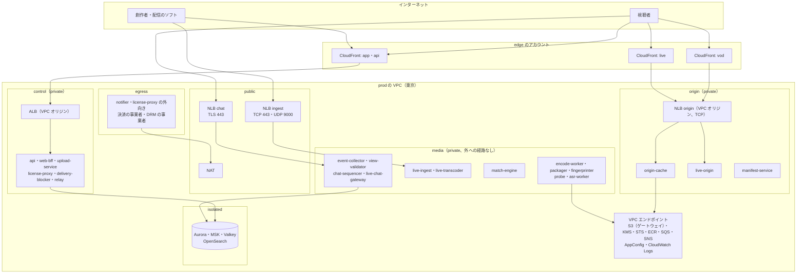
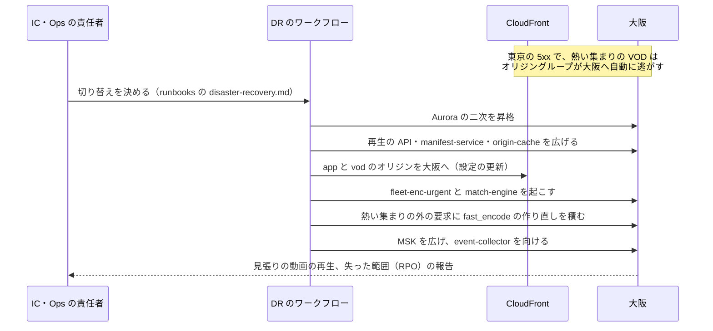

# Infrastructure: YouTube

AWS のアカウントとネットワーク、エッジ（CloudFront のディストリビューションの分け方、上限の引き上げ、取り込みの NLB）、メディアの面の群れ（CPU の Spot、GPU、NVMe、メモリー）、MSK、S3 のバケットと層（元のファイルの Deep Archive を含む）、大阪への写しと DR、段階を上げる基準、S2 の複数の CDN、1 時間の保存・1 GB の配信・1 時間の変換の原価を決める。管理の面は他の題材（[Datadog の infrastructure.md](../../../datadog/docs/architecture/infrastructure.md)）の形を引き継ぎ、メディアの面と配信の事情だけを足す（[ADR-0001](../decisions/0001-platform-and-stack.md)）。

この文書で決めたことは次の ADR にある。

| ADR | 決定 |
| --- | --- |
| [0064](../decisions/0064-accounts-network-and-edge-distributions.md) | アカウントは他の題材の形に、自己監視の `selfmon`（大阪）と、メディアの隔離の `media-quarantine` を足す。メディアの面のサブネットはインターネットへの経路を持たない。CloudFront は用途ごとに 3 つのディストリビューション（VOD、ライブ、画面と API）に分け、上限はディストリビューションごとに引き上げを申請する。オリジンは VPC オリジンの NLB（TLS のリスナーなし）にし、`apne1-az3` を使わない |
| [0065](../decisions/0065-media-fleets-msk-and-storage-tiers.md) | メディアの面は用途ごとの EC2 のキャパシティープロバイダーに置く：符号化は x86 の CPU の Spot（型を 6 つ以上）、ライブは `g6.2xlarge` を On-Demand のキャパシティの予約で下限を持つ、`origin-cache` は `im4gn.4xlarge`、`match-engine` は `r7g.8xlarge`、`live-origin` は `r7g.4xlarge`。MSK は Express の `express.m7g.large` × 3 から始める。元のファイルは公開の後 90 日で Deep Archive、レンディションは Intelligent-Tiering にする |
| [0066](../decisions/0066-osaka-dr-stage-up-and-multi-cdn-timing.md) | 大阪は管理の面のウォームスタンバイと、元のファイルの写しと、「熱い集まり」の H.264 のレンディションの写しを持ち、CloudFront のオリジングループで VOD の外れを大阪へ逃がす。段階を上げる準備は上限の 60% で始める。2 つ目の CDN は、月の配信 100 PB か配信のピーク 1 Tbps の早いほうの前に入れる |

負荷と台数の根拠は [capacity.md](capacity.md)、CI とデプロイは [delivery.md](delivery.md)、自己監視は [observability.md](observability.md)、暗号化と統制は [security.md](security.md) にある。数値のうち「初期見積もり」と書いたものは、PoC（`cdn-cost-poc`、`ll-hls-poc`、`fingerprint-poc`）と E15 の負荷試験の前の仮の値である。

## 1. 範囲と要件

- 扱う：アカウント、ネットワーク、入口、群れの型と置き方、MSK、S3 の置き場と層、大阪、段階、単位あたりの原価。
- 扱わない：CDN のキャッシュの規則とトークン（[cdn-and-delivery.md](cdn-and-delivery.md)）、台数の計算（[capacity.md](capacity.md)）、鍵（[security.md](security.md)）。

| 要件 | 目標 | NFR |
| --- | --- | --- |
| AZ の障害 | RPO 0・RTO 5 分。1 つの AZ を失っても、残りで S1 のピークを受ける | NFR-009、[runbooks](../runbooks/README.md) の 1 節 |
| リージョンの障害 | 管理の面 RPO 1 分・RTO 1 時間。元のファイルの写し RPO 15 分。再生の再開 RTO 2 時間（AV1 なしの段） | NFR-009 |
| 配信の上限 | S1 のピーク（0.3 Tbps）と大きなライブ（20 万人の LL-HLS）を、CDN の上限の 60% 以下で受ける | NFR-008、NFR-005 |
| 可用性 | 再生の API 99.95%、アップロード 99.9%、ライブの取り込み 99.95% | NFR-010 |
| 費用 | 1 GB の配信 0.02 USD（予算、仮）、1 時間の変換 約 0.27 USD、1 時間の保存 約 0.11 USD（最初の 30 日）。11 節の値を統合の工程で [README.md](README.md) の 2.1 節に揃えた | [README.md](README.md) の 2.1 節 |

## 2. AWS アカウントの構成

ADR-0064。

| アカウント | OU | 中身 |
| --- | --- | --- |
| management | Root | Organizations、SCP、IAM Identity Center、請求 |
| security | Security | GuardDuty・Security Hub・Inspector の委任管理者 |
| log-archive | Security | 組織の CloudTrail、Config、VPC フローログ、CDN の標準のログ、本システムの監査の記録（Object Lock。[security.md](security.md) の 7 節）。大阪へ写す |
| shared | Infrastructure | ECR（東京・大阪へ写す）、Route 53（`<brand>.<domain>`、`<brand>video.<domain>`）、Terraform の状態 |
| edge | Infrastructure | CloudFront のディストリビューション、WAF、ACM（us-east-1）、エッジの関数と KeyValueStore |
| selfmon | Infrastructure | 自己監視（AMP、CloudWatch、Grafana、`canary`）。**大阪**に置き、本番のどの部品にも依存しない（[observability.md](observability.md) の 6 節） |
| media-quarantine | Security | 既知の違法なメディアに一致した元のファイルの隔離の置き場（別の KMS の鍵。[upload-and-ingest.md](upload-and-ingest.md) の 5.3 節）。安全の審査の役割だけが入れる（[security.md](security.md) の 8 節） |
| dev、staging | Workloads/NonProd | 開発・検証。staging は本番の形を縮めた台数で持ち、負荷試験と DR の訓練のときだけ広げる |
| prod | Workloads/Prod | 本番（東京と大阪） |

- **SCP**（Workloads の OU）：東京・大阪以外のリージョンを禁止する（CloudFront・WAF・ACM・IAM の us-east-1 を除く）。CloudTrail・Config・GuardDuty の停止、KMS の鍵の削除の予約、Object Lock の解除、メディアのバケットのバージョニングの停止、`orig/` の接頭辞のライフサイクルの規則の変更を、break-glass 以外に禁止する（[ADR-0013](../decisions/0013-original-retention-and-deletion-paths.md) を組織の層でも守る）。
- 隔離のアカウントを分けるのは、既知の違法なメディアの写しを本番の運用者の役割から物理に遠ざけるためである。本番の `probe` の作業者は、隔離のバケットへの `PutObject` だけを持ち、読めない。

## 3. ネットワーク

ADR-0064。

### 3.1 prod の VPC（東京・大阪で同じ形）

東京は `apne1-az1`・`apne1-az2`・`apne1-az4` の 3 つの AZ を使う。CloudFront の VPC オリジンが `apne1-az3` に対応しないため（[Restrict access with VPC origins](https://docs.aws.amazon.com/AmazonCloudFront/latest/DeveloperGuide/private-content-vpc-origins.html)、2026-10-10 に確認）。AZ の名前（`ap-northeast-1a` など）と ID の対応はアカウントごとに違うので、Terraform は AZ の ID で書く。

| サブネット | 置くもの | 外への経路 |
| --- | --- | --- |
| public | `nlb-ingest`、`nlb-chat`、NAT ゲートウェイ | Internet Gateway |
| origin | `nlb-origin`（VPC オリジン）、`origin-cache`、`live-origin`、`manifest-service` | なし。S3 のゲートウェイのエンドポイント |
| control | `alb-app`（VPC オリジン）、`api`、`web-bff`、`upload-service`、`relay`、`delivery-blocker`、`pipeline-orchestrator` | なし（VPC エンドポイントだけ） |
| media | `encode-worker`、`packager`、`fingerprinter`、`probe`、`asr-worker`、`live-ingest`、`live-transcoder`、`match-engine`、`event-collector`、`view-validator`、`view-verifier`、`chat-sequencer`、`live-chat-gateway`、`recommender` | **なし。** VPC エンドポイントだけ。`probe` のタスクはさらにネットワークを持たない（[ADR-0012](../decisions/0012-media-probe-and-admission-checks.md)） |
| egress | `notifier`（プッシュ、メール以外の外向き）、`license-proxy` の外向きの口、決済の事業者の呼び出し、既知の違法なメディアの照合の提供者の口 | 専用の NAT。宛先は Network Firewall の許可リスト（事業者のホスト名だけ） |
| isolated | Aurora、MSK、Valkey、OpenSearch | なし |

- **`live-ingest` と `live-chat-gateway` は media のサブネットに置き、public の NLB の後ろにする。** NLB は AZ をまたがない（クロスゾーンを切る）。配信のソフトは DNS で 3 つの AZ のアドレスを受ける。
- **`license-proxy` は control のサブネットに置き、DRM の事業者への呼び出しだけを egress の NAT 経由にする**（[packaging-and-drm.md](packaging-and-drm.md) の 8.4 節）。
- **`delivery-blocker` は control のサブネット**。CloudFront の KeyValueStore と無効化の API は、edge のアカウントのロールを引き受けて、STS と CloudFront の API のエンドポイントへ NAT で出る（CloudFront の API の VPC エンドポイントの有無は**未検証**。E1 の `edge-and-domains` で確かめ、なければ egress に置く）。
- セキュリティグループはサービスごとに入る側と出る側を明示する。`nlb-origin` のセキュリティグループは CloudFront の管理するセキュリティグループ（`CloudFront-VPCOrigins-Service-SG`）からだけ受ける（同じ出典）。

### 3.2 入口とホスト名

| ホスト名 | 入口 | オリジン | 中身 |
| --- | --- | --- | --- |
| `<brand>video.<domain>` | CloudFront `vod` | `nlb-origin` → `origin-cache` | VOD のセグメント、マニフェスト、字幕、縮小の画像、DVR の古いセグメント（`/t/.../v/`、`/t/.../m/`） |
| `live.<brand>video.<domain>` | CloudFront `live` | `nlb-origin` → `live-origin`（`origin-cache` を通す） | ライブのプレイリストと部分（`/t/.../l/`） |
| `<brand>.<domain>`、`api.<brand>.<domain>` | CloudFront `app`＋WAF | `alb-app` | 画面、再生の API、Studio、管理の API、出来事の受け口（`/v1/events`）、ライセンス |
| `upload.<brand>.<domain>` | なし（S3 の署名つきの URL へ直接） | S3 | アップロードの部分（[ADR-0011](../decisions/0011-upload-session-protocol-and-checksums.md)） |
| `ingest.<brand>.<domain>` | `nlb-ingest`（TCP 443、UDP 9000） | `live-ingest` | RTMPS・SRT |
| `chat.<brand>.<domain>` | `nlb-chat`（TLS のリスナー） | `live-chat-gateway` | WebSocket |

- **ライブを別のディストリビューションにする。** CloudFront の上限（転送 150 Gbps、要求 25 万件/秒）はディストリビューションごとにかかる（3.3 節）。LL-HLS の要求の量（20 万人で 120 万件/秒。[live-streaming.md](live-streaming.md) の 6.5 節）を VOD と分けて申請し、片方の急増がもう片方を絞らないようにする。パスの形（`/t/.../l/`）は [cdn-and-delivery.md](cdn-and-delivery.md) の 4 節のまま、ホスト名だけを再生の API が分けて返す。
- **出来事の受け口は `app` のディストリビューションを通す。** 1 件 4 KB 以下の POST で量が小さく（S1 のピーク 5,000 件/秒を束で約 100 要求/秒）、WAF のレート制限を当てたい。
- **チャットは CloudFront を通さない。** 100 万の WebSocket を長くつなぐ（[live-chat.md](live-chat.md)）。NLB の TLS のリスナーで終端し、Gateway まで VPC の中で TLS を張り直す。
- **アップロードの本体は CloudFront を通さない。** 部分は S3 の署名つきの URL へ直接 PUT する（[ADR-0002](../decisions/0002-upload-and-pipeline-orchestration.md)）。S3 の Transfer Acceleration は使わない（日本の中の創作者が主。費用の加算を避ける）。

### 3.3 CloudFront の上限と引き上げの計画

既定の上限（[CloudFront Quotas](https://docs.aws.amazon.com/AmazonCloudFront/latest/DeveloperGuide/cloudfront-limits.html)、2026-10-10 に確認）：ディストリビューションごとに転送 150 Gbps、要求 25 万件/秒。どちらも引き上げを申請できる。定額の料金の計画に入ったディストリビューションには、この上限がかからない（同じ出典。定額の計画の規模の上限と単価は**未検証**。この量で使える形かを `cdn-cost-poc` で事業者に確かめる）。

| ディストリビューション | S1 の必要（ピーク） | 申請する値（必要の約 2 倍） | 根拠 |
| --- | --- | --- | --- |
| `vod` | 0.3 Tbps、約 9 万件/秒 | **0.6 Tbps、50 万件/秒** | 同時 15 万 × 2 Mbps。セグメント 4 秒で映像と音声の 2 要求 → 15 万 × 0.5 件/秒、マニフェストと心拍の再取得を足す |
| `live` | 0.6 Tbps、120 万件/秒（20 万人の LL-HLS） | **1.2 Tbps、250 万件/秒** | 20 万 × 3 Mbps、1 人 6 件/秒（[live-streaming.md](live-streaming.md) の 6.5 節）。グループ A の 200 万件/秒に余裕を足した |
| `app` | 約 1 万件/秒 | 既定のまま | 再生の API、画面、出来事の束 |

- **S1 の配信のピーク**：[README.md](README.md) の 2 節の 0.3 Tbps は平常のピーク。20 万人の配信（LL-HLS で 0.6 Tbps）は上乗せの「大きな催し」として扱い、催しの日の全体のピークを 0.9 Tbps と見込む（統合の工程で README の 2 節に書いた。[capacity.md](capacity.md) の 2 節）。
- **申請の時機**：`vod` は E5 の前（`cdn-cost-poc`）、`live` は E12 の前。承認は数日かかり、部分の承認もありうる（MSK の例：[Amazon MSK quota](https://docs.aws.amazon.com/msk/latest/developerguide/limits.html)。CloudFront の承認の時間は**未検証**）。申請の結果を `cdn-quota-log`（運用の記録）に残す。
- **承認が足りないとき**：`live` を 2 つのディストリビューション（`live-a`・`live-b`）に分け、再生の API が配信の ID のハッシュで振る。1 つの配信の 20 万人が 1 つのディストリビューションに乗るので、1 配信の上限は分けても上がらない。そのときは、大きな配信だけ通常のモード（要求 1.5 件/秒）へ切り替える運用の手順を `live-incident.md` に足す。
- その他の上限（同じ出典）：ディストリビューションごとのオリジン 100、キャッシュの振る舞い 75、ステージングのディストリビューションはアカウントに 20（[delivery.md](delivery.md) の 5.4 節で使う）、CloudFront Functions はアカウントに 100・関数 10 KB、KeyValueStore は関数に 1 つ・5 MB。
- 上限の使用の割合（転送、要求）を CloudWatch の `BytesDownloaded`・`Requests` から 1 分ごとに計算し、60% で Ops にチケット、80% で呼び出す（[observability.md](observability.md) の 4 節）。

## 4. 群れ（キャパシティープロバイダー）

ADR-0065。台数は [capacity.md](capacity.md) の 4 節（S1、初期見積もり）。単価は AWS の公開の価格表（`AmazonEC2`、ap-northeast-1、2026-10-09 の公開分を 2026-10-10 に取得）の On-Demand の Linux の値。Spot の価格は変動し、公開の価格表にないので**未検証**。

### 4.1 Fargate（状態を持たない部品）

| サービス | 役割 | スケールの指標 |
| --- | --- | --- |
| `api`、`web-bff`、`upload-service`、`relay`、`notifier` | 管理の面 | CPU、outbox の最古の年齢 |
| `license-proxy` | DRM のライセンス（[ADR-0021](../decisions/0021-drm-key-hierarchy-and-license-proxy.md)） | 要求の数、p95 |
| `delivery-blocker` | 措置の配信の停止（[ADR-0027](../decisions/0027-takedown-deny-list-within-60s.md)）。2 タスク（AZ を分ける） | — |
| `pipeline-orchestrator`、`manifest-service` | メディアの面の状態なし | CPU |
| `live-ingest` | RTMPS・SRT の受け口（NLB の後ろ） | 接続の数（1 タスク 100 配信） |
| `event-collector`、`view-validator` | 視聴の出来事 | CPU、消費の遅れ |
| `chat-sequencer` | チャットの順番付け（[ADR-0032](../decisions/0032-chat-sequencer-and-batched-fanout.md)） | 消費の遅れ |

- 管理の面は ARM64（Graviton）。メディアの面の Rust の部品も ARM64 にするが、符号化の作業者は 4.2 節の理由で x86-64 にする。

### 4.2 EC2 の群れ

| 群れ | 部品 | 型（S1） | 台数（S1） | 置き方・購入 |
| --- | --- | --- | --- | --- |
| `fleet-enc-urgent` | 急ぎの組（`fast_encode`、`fingerprint`、`probe`） | `c7i.4xlarge` ほか x86 の計算に強い型 6 つ以上（`c7i`、`c7a`、`c6i`、`c6a`、`m7i`、`m6i` の 4xlarge・8xlarge） | On-Demand 8 台（128 vCPU）＋ Spot 0〜40 台 | 3 AZ。On-Demand の下限は平常のピークの 30%（[ADR-0018](../decisions/0018-encode-worker-pools-and-spot-interruption.md)） |
| `fleet-enc-normal` | 通常の組（`full_encode`、`complexity`、`audio_encode`、`packager`、`captions` の前処理） | 同上 | Spot 0〜120 台（平常 40） | 容量を優先する配分 |
| `fleet-enc-back` | 後ろの組（`av1_encode`、作り直し、ライブからの VOD の作り直し） | 同上と 16xlarge | Spot 0〜80 台 | 待ちが 24 時間を超えたら通常の空きも使う |
| `fleet-gpu-live` | `live-transcoder` | `g6.2xlarge`（L4 × 1、8 vCPU、32 GiB）1.418 USD/時間 | 下限 60 台をキャパシティの予約、ピーク 400 台 | AZ ごとに空き「2 枚か 10%」（[ADR-0029](../decisions/0029-live-transcoder-placement-and-standby.md)）。予約で足りない分は On-Demand |
| `fleet-gpu-asr` | `asr-worker` | `g6.xlarge`（L4 × 1）1.167 USD/時間 | Spot 2〜6 台 | 失っても公開を止めない（[transcoding-pipeline.md](transcoding-pipeline.md) の 13 節） |
| `fleet-origin` | `origin-cache` | `im4gn.4xlarge`（16 vCPU、64 GiB、NVMe 7.5 TB、25 Gbps）1.707 USD/時間 | 9（AZ ごとに 3）＋予備 3 | On-Demand。AZ ごとの輪（[ADR-0026](../decisions/0026-origin-cache-routing-admission-and-coalescing.md)） |
| `fleet-live-origin` | `live-origin` | `r7g.4xlarge`（16 vCPU、128 GiB、最大 15 Gbps）1.034 USD/時間 | 12（AZ ごとに 4） | 配信ごとに 2 つの AZ（[ADR-0030](../decisions/0030-ll-hls-parameters-and-live-origin.md)） |
| `fleet-match` | `match-engine` | `r7g.8xlarge`（32 vCPU、256 GiB）2.067 USD/時間 | 4（8 つの論理の分片を 1 台に 4 つ、2 台 × 2 つの AZ）＋予備 1（[ADR-0044](../decisions/0044-reference-index-shards-and-generations.md) の注記） | 写しは別の AZ（[ADR-0008](../decisions/0008-fingerprinting-and-match-engine.md)） |
| `fleet-chat` | `live-chat-gateway` | `c7gn.2xlarge`（8 vCPU、16 GiB、最大 50 Gbps）0.630 USD/時間 | 6（20 万人の配信を 1 ノード 5 万接続で 4 ＋ 余裕） | 3 AZ。大きな催しの前に 26 台まで（[live-chat.md](live-chat.md) の 5.4 節） |
| `fleet-batch` | `view-verifier`、`fp-backscan`、分析の作り直し | `r7i.4xlarge` の Spot | 0〜20 台 | 時間の区切りで起こす |

- **提供の確かめ（2026-10-10）**：`g6`（L4）は東京で提供されている（AWS の 2024-09 の発表）。`g6.2xlarge` は L4 × 1、8 vCPU、32 GiB（[Amazon EC2 G6 instances](https://aws.amazon.com/ec2/instance-types/g6/)）。`im4gn.4xlarge` は 16 vCPU、64 GiB、NVMe 7,500 GB、ネットワーク 25 Gbps（「最大」の付かない値）で、東京の公開の価格表に行がある。AZ ごとの提供と在庫は**未検証**で、E1 の `ecs-fargate-and-ec2-pools` で `describe-instance-type-offerings` を確かめる。
- **`origin-cache` の型**：[cdn-and-delivery.md](cdn-and-delivery.md) の 6.4 節は「NVMe 約 7.5 TB・ネットワーク 25 Gbps 以上」を求めた。`im4gn.4xlarge` はどちらも満たし、`i4i.8xlarge`（7.5 TB、18.75 Gbps、3.221 USD/時間）の約半分の単価である。索引のメモリー 8 GB はメモリー 64 GiB に入る。1 ノードのピークの外れの転送は、AZ を 1 つ失っても 30 Gbps ÷ 6 = 5 Gbps で、帯域に余裕がある。Graviton2 の世代で、Rust の ARM64 の組み立てを使う。
- **符号化を x86-64 にそろえる理由**：x264 と SVT-AV1 の出力は、命令セット（AVX2・AVX-512 と NEON）の経路で同じバイトになる保証を確かめていない（**未検証**）。同じ入力・同じ設定から同じラダーが出ること（[intent.md](../intent.md) の守るべき振る舞い）と、黄金の動画の VMAF の下限を、1 つの命令セットの群れで守る。命令セットは符号化の設定の一部として固定する（[delivery.md](delivery.md) の 6 節、[ADR-0071](../decisions/0071-encoder-pinning-reencode-and-manifest-format-versions.md)）。Graviton の Spot（`c8g` は `c7i` より約 11% 安い）は、`encoder-arch-poc` で VMAF と決定性を確かめた後に `enc_build` を分けて足す。
- **GPU の確保**：`g6` の Spot は中断でライブが切れるので使わない。下限 60 台は、平常の夜のピークの配信（約 360 配信）を詰めて置ける数で、On-Demand のキャパシティの予約（ODCR）で東京の 3 AZ に 20 台ずつ持つ。予約の外の台数を起こせるか（AZ ごとの在庫）は**未検証**。大きな催しの 2 週間前に、催しの分を期間つきの予約で足す（[runbooks](../runbooks/README.md) の 6 節）。
- **`live-origin` の型**：配信 1 つ・写し 1 つで直近 60 秒の全段（約 10 Mbps × 60 秒 ≈ 75 MB）。2,000 配信 × 2 つの写し = 300 GB をメモリーに持つ。CDN へ出す量は配信の数 × 段の数に比例し（[live-streaming.md](live-streaming.md) の 6.5 節）、約 40 Gbps と見込む（[capacity.md](capacity.md) の 4 節）。メモリーで 3 台、帯域で 12 台が要るので、帯域で決める。
- **AMI**：ECS に最適化した Amazon Linux 2023。GPU の群れは NVIDIA のドライバーのバージョンを AMI に固定する（変換器の出力の SPS・PPS の一致のため。[live-streaming.md](live-streaming.md) の 6.2 節）。AMI の入れ替えは [delivery.md](delivery.md) の 5 節。
- **IMDS**：すべての群れで IMDSv2 を必須にし、応答のホップの上限を 1 にする（コンテナからインスタンスのロールを読ませない。[security.md](security.md) の 3.2 節）。

### 4.3 AZ の障害への備え

| 部品 | 1 つの AZ を失ったとき |
| --- | --- |
| 符号化の群れ | 残る 2 AZ で起こす。Spot の型を 6 つ以上にして、AZ ごとの在庫の偏りを吸う。急ぎの組の On-Demand の下限は AZ ごとに均等 |
| `fleet-gpu-live` | 予備のない配信は他の AZ の空きで作り直す（[live-streaming.md](live-streaming.md) の 10 節）。空き「2 枚か 10%」は AZ 1 つ分に足りないので、On-Demand で足す。足りなければ小さな配信を通常のモードの CPU の変換へ逃がさず、順に戻す（予備のある大きな配信を先に守る） |
| `origin-cache` | 残り 2 つの輪で受ける（6 ノードで 30 Gbps）。CloudFront は NLB の健康の確かめで、その AZ のアドレスを外す |
| `live-origin` | 写しのノードが返す |
| `match-engine` | もう一方の写しが照合を続ける。予備から失った写しを作る（索引の読み込み 約 15 分。[capacity.md](capacity.md) の 4 節） |
| MSK（3 AZ、Express） | 複製 3、`min.insync.replicas=2` で書き込みを続ける |
| Aurora | 別の AZ の reader へ自動で切り替え |
| Valkey | 複製から切り替え。チャットの扇形の配りは張り直し（[live-chat.md](live-chat.md) の 9 節） |

## 5. MSK

ADR-0065。

| 項目 | S1 | 根拠 |
| --- | --- | --- |
| ブローカー | `express.m7g.large` × 3（3 AZ）0.527 USD/時間 | 書き込み：視聴の出来事のピーク 5,000 件/秒 × 300 バイト ≈ 1.5 MB/秒、チャットのピーク 2,000 件/秒 × 400 バイト × 2 トピック ≈ 1.6 MB/秒。複製 3 で計約 9.3 MB/秒。1 ブローカーの持続の書き込みの目安 15.6 MB/秒（[Amazon MSK quota](https://docs.aws.amazon.com/msk/latest/developerguide/limits.html)、2026-10-10 に確認） |
| パーティション（写しを含む） | 約 600（`watch-events` 96、`watch-events-rejected` 6、`chat-in` 48、`chat-log` 48 の 3 倍） | `express.m7g.large` の勧めは 1 ブローカー 1,000（同じ出典） |
| 保持 | `watch-events` 7 日、`chat-in` 1 日、`chat-log` 3 日（S3 の Parquet が正本） | [view-counting-and-analytics.md](view-counting-and-analytics.md) の 9 節、[live-chat.md](live-chat.md) の 11 節 |
| 認証 | IAM。書き込みは `event-collector`、`live-chat-gateway`、`chat-sequencer` だけ | [security.md](security.md) |
| 大阪 | `express.m7g.large` × 3（空、トピックの定義だけ） | 7 節 |

- 1 パーティションの上限は 15 MB/秒（同じ出典）。急な人気の動画の心拍（10 万の同時の視聴で約 3 MB/秒。[view-counting-and-analytics.md](view-counting-and-analytics.md) の 4.3 節）は入る。
- 書き込みの課金は 1 GB 0.015 USD（Express、東京。AWS の公開の価格表 `AmazonMSK`、2026-09-11 の公開分）。S1 の月 約 8 TB（複製の前）で約 120 USD。
- `express.m7g.xlarge` へ上げる基準：持続の書き込みが 1 ブローカーの目安の 60%（9.4 MB/秒）を 1 週間超えた、または写しを含むパーティションが 1 ブローカー 600 を超えた（9 節）。

## 6. データの置き場所（S1）

ADR-0065。

### 6.1 S3 のバケット

| バケット | 中身 | 鍵 | 層 |
| --- | --- | --- | --- |
| `<media-bucket>` | `orig/`（元のファイル）、`p/`（レンディション、索引、字幕、縮小の画像）、`r/`（段の中間の出力、7 日）、`l/`（DVR）、`live-src/`（ライブの元の流れ） | `kms-media`（バケットキー） | 6.2 節 |
| `<quarantine-bucket>`（media-quarantine のアカウント） | 既知の違法なメディアに一致した元のファイル | `kms-quarantine` | Standard。保全の期限まで |
| `<fp-bucket>` | 指紋（アップロードと参照）、参照の索引のファイル | `kms-fp` | Standard（参照）、Intelligent-Tiering（アップロード） |
| `<events-bucket>` | Iceberg の `watch_events`・`watch_sessions`、`chat-log` の Parquet | `kms-events` | Standard。保持は [security.md](security.md) の 6 節 |
| `<logs-bucket>`（log-archive） | CDN の標準のログ、ALB・NLB のログ、監査の記録 | `kms-audit` | Object Lock（監査の記録だけ） |

### 6.2 層の移し

保存の単価は AWS の公開の価格表（`AmazonS3`、ap-northeast-1、2026-09-28 の公開分を 2026-10-10 に取得）。最小の保存の期間と最小の課金の大きさは [Amazon S3 storage classes](https://docs.aws.amazon.com/AmazonS3/latest/userguide/storage-class-intro.html)（2026-10-10 に確認）。

| 対象 | 公開から 30 日 | 30〜90 日 | 90 日の後 | 理由 |
| --- | --- | --- | --- | --- |
| 元のファイル（`orig/`） | Glacier Instant Retrieval（0.005 USD/GB・月） | 同じ | **Glacier Deep Archive**（約 0.002 USD/GB・月。下の注） | 作り直しにしか使わない。Deep Archive の最小の保存は 180 日、戻しは標準で 12 時間以内・大量で 48 時間以内（[Archive retrieval options](https://docs.aws.amazon.com/AmazonS3/latest/userguide/restoring-objects-retrieval-options.html)、2026-10-10 に確認） |
| レンディション（`p/`） | Intelligent-Tiering（Frequent 0.025 → 30 日見られなければ Infrequent 0.0138 → 90 日で Archive Instant Access 0.005） | 自動 | 自動 | 見られたら自動で戻り、取り出しの料金がない。Deep Archive の層は有効にしない（再生が止まるため） |
| 中間の出力（`r/`） | Standard、7 日で消す | — | — | [transcoding-pipeline.md](transcoding-pipeline.md) の 14 節 |
| DVR（`l/`） | Standard。VOD の世代 2 ができて 24 時間の後に消す | — | — | [ADR-0031](../decisions/0031-dvr-storage-and-live-to-vod.md) |
| ライブの元の流れ（`live-src/`） | Standard。VOD の作り直しの後は元のファイルとして `orig/` と同じ規則 | — | — | [ADR-0028](../decisions/0028-live-ingest-keys-backup-and-source-recording.md) |

- **Deep Archive の保存の単価の注**：取得した東京の価格表には、Glacier Deep Archive の保存の行が見つからなかった。Intelligent-Tiering の Deep Archive Access の層は 0.002 USD/GB・月、Deep Archive の標準の取り出しは 0.022 USD/GB、大量は 0.005 USD/GB（同じ価格表）。Deep Archive の保存の単価は約 0.002 USD/GB・月と置き、**未検証**とする。
- **Intelligent-Tiering の 128 KB 未満は監視されず Frequent に残る**（同じ出典）。レンディションは 1 つのファイルに連ねる（[ADR-0019](../decisions/0019-cmaf-files-segment-index-and-url-layout.md)）ので大きい。索引（`.six`）と字幕は小さく Frequent に残るが、量は小さい。
- 元のファイルの層の移しは、S3 のライフサイクルの規則で `published_at` のタグの日付で振る（[upload-and-ingest.md](upload-and-ingest.md) の 7.1 節）。ライフサイクルの規則の変更は SCP と IAM で `original-deleter` の流れと同じ承認にする。
- Deep Archive からの戻しは、作り直しのバッチは大量（48 時間以内、0.005 USD/GB）、急な人気の AV1 と DR は標準（12 時間以内）にする。戻しの要求はアカウントに 1 秒 1,000 件、1 日 1〜2 PB まで（同じ出典）。大きな作り直し（[delivery.md](delivery.md) の 6.3 節）はこの範囲で日割りにする。

## 7. 大阪と DR

ADR-0066。

### 7.1 平常の構成

| 部品 | 大阪の平常 |
| --- | --- |
| 管理の面 | ウォームスタンバイ（各サービス 1〜2 タスク）、Aurora Global Database の二次（reader 1 台） |
| 再生の経路 | `origin-cache` 3 台（AZ ごとに 1）、`manifest-service` 2 タスク、再生の API 2 タスク（読み出しだけ） |
| MSK | `express.m7g.large` × 3（空） |
| メディアの面の群れ | 符号化・GPU・`match-engine` は 0 台（起動の設定だけ） |
| S3 | 元のファイルの写し、熱い集まりのレンディションの写し、指紋の参照の索引の写し |
| ECR、Secrets Manager、AppConfig、KMS | 写し・大阪の鍵 |

### 7.2 S3 の写し

| 写すもの | 規則 | 大阪の層 | 目標 |
| --- | --- | --- | --- |
| 元のファイル（`orig/`） | CRR、Replication Time Control（RTC） | 90 日まで Glacier Instant Retrieval、その後 Deep Archive（大阪のライフサイクル） | RPO 15 分（NFR-009）。RTC はほとんどを数秒で、99.9% を 15 分以内に写す（[S3 Replication Time Control](https://docs.aws.amazon.com/AmazonS3/latest/userguide/replication-time-control.html)、2026-10-10 に確認） |
| 熱い集まりの H.264 のレンディション | タグ `dr=hot` の CRR（新しい書き込み）と、週ごとの S3 Batch Operations の複製（後から熱くなったもの） | Standard-IA | 7.3 節 |
| 参照の指紋と索引（`<fp-bucket>` の参照） | CRR | Standard | 照合の再開 |
| 監査の記録 | CRR（log-archive の中） | Object Lock | — |

- **熱い集まり**：直近 7 日の確定の総再生時間の 90% を占める動画と、登録者 10 万以上のチャンネルの公開から 30 日の動画。`packager` は、書き込みの時に後者へ `dr=hot` のタグを付ける。前者は毎週の `dr-hot-set` の作業が選び、S3 Batch Operations で写す。S1 の見込みは約 80 TB（レンディションの約 5%）で、Standard-IA の単価で月 約 1,100 USD（Osaka の単価は**未検証**。東京の Standard-IA 0.0138 USD で置いた）。
- **写しの転送の上限**：RTC の転送の既定は 1 Gbps で、超える時間は RTC の SLA が当たらない（同じ出典）。S1 の元のファイルの平均の書き込みは約 0.4 Gbps（1 時間/分 × 3 GB）、ピークは約 1.2 Gbps である。E1 の `s3-buckets-baseline` で 5 Gbps へ引き上げを申請する。S2（30 時間/分）は平均 12 Gbps で、申請の前に `dr-replication-poc` で確かめる。
- **東京から大阪への写しの転送は 1 GB 0.015 USD**（RTC つき。`AmazonS3` の価格表）。S1 の元のファイルで月 約 130 TB × 0.015 ≈ 1,900 USD。
- 削除は大阪でも明示に行う（[ADR-0013](../decisions/0013-original-retention-and-deletion-paths.md)。`original-deleter` が両方のバケットの全バージョンを消す）。

### 7.3 リージョンの障害

| 目標 | 守り方 |
| --- | --- |
| 管理の面 RPO 1 分・RTO 1 時間 | Aurora Global Database の計画外の切り替え。写しの遅れは通常 1 秒未満（[Using Amazon Aurora Global Database](https://docs.aws.amazon.com/AmazonRDS/latest/AuroraUserGuide/aurora-global-database.html)、2026-10-10 に確認） |
| 再生の再開 RTO 2 時間（AV1 なし） | 熱い集まり（総再生時間の 90%）は、CloudFront のオリジングループの二次（大阪の `nlb-origin`）へ、東京の 5xx で自動に逃がす。マニフェストは大阪の `manifest-service` が Aurora の二次から読んで作る（AV1 の段は載せない）。熱い集まりの外は「処理中」を返し、大阪で元のファイルから `fast_encode` を作り直す（90 日以内は Instant Retrieval から数分、90 日より古いものは Deep Archive の戻しで 12 時間以内） |
| 元のファイルの写し RPO 15 分 | RTC |
| アップロードの再開 | MVP は大阪で受けない（[upload-and-ingest.md](upload-and-ingest.md) の 13 節）。リージョンの障害の間は `ops.upload_enabled` を切る。S2 で大阪の受け付けを `osaka-upload-poc` で決める |
| ライブの再開 | 大阪の GPU の在庫は保証されない（**未検証**）。新しい配信を大阪で受けるのは、GPU を起こせた分だけにする。RTO の目標を置かない（NFR の外） |
| 照合 | 大阪の `match-engine` を起こし、参照の索引の写しを読み込む（約 15 分）。それまで新しい動画は「照合待ち」のまま（公開に倒さない） |

- **読み出しだけの再生**：Aurora を昇格する前でも、大阪の再生の API は二次から `playable()` を判定できる（読み出しだけ）。措置の新しい決定は東京が止まっている間は出せないので、拒否の一覧（KeyValueStore）は CloudFront の側にあり、東京の障害と独立に効き続ける。
- **失った範囲**：東京の最後の Aurora の写しと RTC の届いた位置から、切り替えまでの書き込み。`dr_events` に記録する。完了を返したアップロードで元のファイルが大阪に届いていないものは、東京の回復の後に写しを確かめる（K1）。
- 東京へ戻すのは計画作業。Aurora の切り替え（switchover）で戻し、大阪で作ったレンディションを東京へ写す。
- 訓練は半年ごと（[runbooks](../runbooks/README.md) の 6 節）。

### 7.4 大阪の待機の確認

| 確認 | 頻度 |
| --- | --- |
| CRR の遅れ（`ReplicationLatency`、`OperationsPendingReplication`、`OperationMissedThreshold` の出来事） | 1 分。15 分を超えたら呼び出し |
| 熱い集まりの写しの割合（`dr-hot-set` の対象のうち大阪にある割合） | 日次。98% 未満でチケット |
| 大阪の Terraform の plan に差分がない | 日次 |
| 大阪で起こせる EC2 の在庫（`c7i`、`g6`、`r7g`、`im4gn`） | 月次（**未検証**） |
| オリジングループの二次への切り替え（見張りの動画を東京の 503 で試す） | 週次（staging） |

## 8. Terraform

開発リポジトリの `infra/` に置く。状態ファイルは shared のバケット（大阪へ写す）。

| ルートモジュール | 中身 | 変更の承認 |
| --- | --- | --- |
| `org/`、`security/` | Organizations、SCP、Identity Center、GuardDuty、log-archive、media-quarantine | Ops の責任者＋セキュリティの担当 |
| `global/edge` | CloudFront の 3 つのディストリビューション、オリジングループ、WAF、ACM、エッジの関数、KeyValueStore | Ops。エッジの関数は [delivery.md](delivery.md) の 5.4 節の段階のデプロイ |
| `selfmon/` | AMP、CloudWatch、Grafana、`canary` | Ops |
| `regional/<region>/data` | バケット（CRR、ライフサイクル、Object Lock）、Aurora、MSK、Valkey、OpenSearch、KMS | Ops。状態を持つリソースの削除・置き換えは CI で拒否 |
| `regional/<region>/compute` | VPC、NLB、ECS のクラスタ、キャパシティープロバイダー、ODCR | Ops |

- plan のポリシー検査（OPA・Checkov）で、次を拒否する。
  - media・origin・control・isolated のサブネットの経路表に NAT・IGW
  - `<media-bucket>` のバージョニングの停止、`orig/` のライフサイクルの規則の削除・短縮、`original-deleter` の外の役割への `s3:DeleteObject*` の許可
  - NLB のクロスゾーンの負荷分散の有効化
  - IMDSv2 が任意のままの起動テンプレート、ホップの上限が 1 でないもの
  - `apne1-az3` のサブネット
  - MSK の `min.insync.replicas` が 2 未満

## 9. 段階を上げる判断の基準

ADR-0066。月次のキャパシティのレビュー（[capacity.md](capacity.md) の 8 節）で見る。どれかが基準を超えたら、次の段階（S2）の準備を始める。準備に 1 四半期かかる前提で、上限の 60% で始める。

| 指標 | S1 の上限（想定） | 準備を始める基準 | S2 で変えること |
| --- | --- | --- | --- |
| 配信のピーク（`vod`） | 承認された上限（申請 0.6 Tbps） | 0.36 Tbps が 2 週 | 2 つ目の CDN（10 節）、上限の再申請 |
| 月の配信 | 約定の量（**未検証**） | 約定の 60%、または 60 PB/月 | CDN の約定の見直し、複数の CDN |
| 1 配信のライブの視聴（LL-HLS） | `live` の承認の上限 ÷ 6 件/秒 | 承認の上限の 60% の配信が予定に入った | `live` の分割、部分 1 秒の検討（[live-streaming.md](live-streaming.md) の 6.5 節） |
| アップロード | 符号化の群れの Spot の在庫（**未検証**） | 持続 5 時間/分 | 群れを AZ ごとのプールに分ける（[README.md](README.md) の 2 節）、AV1 のしきい値の見直し |
| 視聴の出来事 | MSK の 3 ブローカーの持続の目安の 60% | 9.4 MB/秒（複製の前 約 3 MB/秒） | ブローカーの型を上げる、熱い動画の桶（[view-counting-and-analytics.md](view-counting-and-analytics.md) の 4.3 節） |
| Aurora の writer | `db.r7g.4xlarge` の CPU | ピークの p95 50% が 4 週 | 型を上げ、`channel_stats_daily_dim` を分析の置き場へ |
| 元のファイルの写しの転送 | RTC の承認の上限 | 承認の 60% | 上限の再申請、`dr-replication-poc` |
| 参照の索引 | `match-engine` のメモリー（1 ノード 256 GiB） | 1 台の分片の合計 150 GiB | 1 台あたりの分片を減らして台数を増やす（[ADR-0044](../decisions/0044-reference-index-shards-and-generations.md)） |

## 10. 複数の CDN（S2）の時機

ADR-0066。[ADR-0005](../decisions/0005-cdn-and-origin-strategy.md) は S2 から複数の CDN にすると決めた。この文書は時機と前提を決める。

- **時機**：月の配信 100 PB か配信のピーク 1 Tbps のどちらかに、四半期の見込みで届く前に、2 つ目の CDN を本番に入れる。理由は、1 つの CDN の障害で 5 分以内に移す（NFR-008 の S2 の目標）ために、平常から 2 つ目に 20% 以上を流して温めておく必要があるため。
- **前提**：`multi-cdn-poc`（[cdn-and-delivery.md](cdn-and-delivery.md) の 12 節）で、2 つ目の CDN が (a) パスの頭のトークンの確かめ、(b) 拒否の一覧を 60 秒以内に効かせる口、(c) リアルタイムのログを持つことを確かめる。
- **オリジン**：2 つ目の CDN は `nlb-origin` を直接見せず、CloudFront の Origin Shield を通す形を既定の案にする（オリジンの合流を 1 か所に保つ）。CloudFront の上限と費用に 2 つ目の CDN の外れが加わるので、`multi-cdn-poc` で比べる。
- **振り分け**：再生の API が CDN のホストを返す（ADR-0005）。重みは [observability.md](observability.md) の 3 節の QoE の CDN ごとの値から。

## 11. 単位あたりの原価

[README.md](README.md) の 2.1 節の 3 つの単位を、取得した公開の価格で置き直した。どれも S1 の量、東京、税の前。約定の値引きは入れていない（**未検証**）。

### 11.1 保存：1 時間の動画・1 か月

| 時期 | 内訳 | 原価 |
| --- | --- | --- |
| 公開から 30 日 | レンディション 3.2 GB × 0.025（Intelligent-Tiering の Frequent）＝ 0.080、元のファイル 3 GB × 0.005（Instant Retrieval）＝ 0.015、指紋・字幕・縮小の画像 0.05 GB × 0.025 ≈ 0.001、大阪の元のファイル 3 GB × 0.005 ＝ 0.015 | **約 0.11 USD**（大阪への写しの転送 3 GB × 0.015 ＝ 0.045 USD を 1 回） |
| 30〜90 日（見られない） | レンディション 3.2 × 0.0138 ＝ 0.044、元のファイル 0.015、大阪 0.015 | 約 0.074 USD |
| 90 日の後（見られない） | レンディション 3.2 × 0.005 ＝ 0.016、元のファイル 3 × 0.002 ＝ 0.006、大阪 3 × 0.002 ＝ 0.006 | **約 0.028 USD** |
| AV1 のある動画 | ＋ 2.5 GB × 層の単価 | ＋0.0125〜0.0625 USD |

- 最初の 2.1 節の仮の値（30 日まで 0.10、その後 0.02）に対し、大阪の写しの分が上がる。統合の工程で 2.1 節をこの値に揃えた。

### 11.2 配信：1 GB

| 項目 | 公開の価格（S1、月 27 PB） | 前提 |
| --- | --- | --- |
| CloudFront の転送（日本） | 加重の平均 **約 0.062 USD/GB** | 段階の価格：最初の 10 TB 0.114、次の 40 TB 0.089、次の 100 TB 0.086、次の 350 TB 0.084、次の 524 TB 0.080、次の 4 PB 0.070、5 PB を超える分 0.060（`AmazonCloudFront` の価格表、2026-10-03 の公開分）。27 PB で約 168 万 USD |
| 要求（HTTPS、日本） | 約 0.0012 USD/GB | 1 万件 0.012 USD、セグメント 1 MB で 1 GB あたり約 1,000 件 |
| エッジの関数 | 約 0.0001 USD/GB | 100 万回 0.10 USD |
| KeyValueStore の読み出し | 約 0.00003 USD/GB | 100 万回 0.03 USD |
| オリジン側（`origin-cache`、S3 の GET、Origin Shield） | 約 0.0006 USD/GB | [capacity.md](capacity.md) の 6 節 |
| 合計（公開の価格） | **約 0.064 USD/GB** | — |
| 予算 | 0.02 USD/GB | [README.md](README.md) の 2.1 節 |

- **公開の価格は予算の約 3.2 倍である。** 予算は約定の値引きで約 69% を下げる前提になる。約定の値引きの率は**未検証**で、`cdn-cost-poc` と事業者の見積もりで確かめる。届かなければ、S1 の月の配信の原価は約 54 万 USD ではなく約 173 万 USD になる。PM の判断を要する（12 節の持ち越し）。
- LL-HLS の 1 視聴時間の要求の費用 約 0.026 USD（[live-streaming.md](live-streaming.md) の 6.5 節）は、上の要求の単価（1 万件 0.012 USD）と一致する。

### 11.3 変換：1 時間の動画

| 項目 | 原価 | 前提 |
| --- | --- | --- |
| H.264 の道（約 9.9 vCPU 時間） | 約 0.20 USD | Spot 約 0.02 USD/vCPU 時間（**未検証**）。On-Demand は `c7i.4xlarge` 0.899 USD/時間 ＝ 0.056 USD/vCPU 時間 |
| 急ぎの組の On-Demand の分 | ＋約 0.04 USD | 急ぎの段（1.1 vCPU 時間）の 70% を On-Demand で受けると見込む |
| ASR（GPU） | 約 0.03 USD | `g6.xlarge` 1.167 USD/時間 × 約 0.025 時間 |
| 合計（H.264） | **約 0.27 USD** | 最初の 2.1 節の仮の値 0.20 USD より On-Demand の分だけ高い。統合の工程で 2.1 節をこの値に揃えた |
| AV1 を足す | ＋約 0.80 USD | 約 40 vCPU 時間 × Spot。On-Demand なら 2.2 USD |
| ライブの変換：1 配信・1 時間 | 約 0.24 USD | `g6.2xlarge` 1.418 USD ÷ 6 配信（On-Demand、ODCR も同じ単価）。最初の 2.1 節の 0.20 USD より高い。統合の工程で 2.1 節をこの値に揃えた。Savings Plans の率は**未検証** |

## 12. 未解決の問い

### 決定（2026-10-10、既定案）

- **ディストリビューション**：VOD・ライブ・画面と API を分け、上限をそれぞれ申請する（ADR-0064）。
- **オリジン**：VPC オリジンの NLB（TCP）、`apne1-az3` を使わない（ADR-0064）。
- **群れ**：符号化は x86 の Spot、ライブは `g6.2xlarge` と ODCR、`origin-cache` は `im4gn.4xlarge`（ADR-0065）。
- **MSK**：Express の `express.m7g.large` × 3（ADR-0065）。
- **層**：元のファイルは 90 日で Deep Archive、レンディションは Intelligent-Tiering（ADR-0065）。
- **DR**：熱い集まりのレンディションを大阪へ写し、オリジングループで逃がす（ADR-0066）。
- **複数の CDN**：月 100 PB かピーク 1 Tbps の前（ADR-0066）。

### 持ち越し

| 問い | いつ・どう決めるか |
| --- | --- |
| CloudFront の約定の値引きの率（公開の価格は予算の約 3.2 倍） | `cdn-cost-poc` と見積もり。選択肢と推奨の既定は [README.md](README.md) の 2.1 節（PM の判断待ち） |
| CloudFront の上限の引き上げがどこまで認められるか、定額の計画の対象か | E5・E12 の前の申請（**未検証**） |
| `im4gn`・`g6` の東京の AZ ごとの提供 | E1 の `ecs-fargate-and-ec2-pools`（**未検証**） |
| `g6` の東京の AZ ごとの在庫、大阪で起こせる GPU | E12 の前に ODCR を試しに取る（**未検証**） |
| Deep Archive の保存の東京・大阪の単価 | 価格表で行が見つからなかった（**未検証**）。請求の実績で置き換える |
| Spot の実効の単価と中断の率（型ごと） | E3 の `segment-parallel-encode` の後、`cost-metering` で実測 |
| 符号化の群れに Graviton を足すか | `encoder-arch-poc`（VMAF と決定性） |
| CloudFront の API の VPC エンドポイントの有無 | E1 の `edge-and-domains`（**未検証**） |
| 大阪でアップロードを受けるか | S2 の前の `osaka-upload-poc` |

## 13. Story の候補

| Epic | Story | 中身 |
| --- | --- | --- |
| E1 | `aws-accounts-and-network` | 2・3.1 節、SCP、media-quarantine、selfmon |
| E1 | `edge-and-domains` | 3.2・3.3 節、VPC オリジン、上限の申請（`vod`） |
| E1 | `ecs-fargate-and-ec2-pools` | 4 節、ODCR、AMI、IMDSv2 |
| E1 | `msk-cluster-baseline` | 5 節 |
| E1 | `s3-buckets-baseline` | 6 節、7.2 節の CRR と RTC の上限の申請 |
| E1 | `osaka-warm-standby` | 7.1・7.4 節、オリジングループ |
| E5 | `cdn-cost-poc` | 3.3・11.2 節の上限と約定の単価 |
| E12 | `live-distribution-quota` | 3.3 節の `live` の申請と分割の手順 |
| E15 | `dr-failover-drill` | 7.3 節 |
| E15 | `dr-hot-set` | 7.2 節の熱い集まりの選び方と写し |
| S2 の前 | `multi-cdn-poc`、`osaka-upload-poc`、`dr-replication-poc`、`encoder-arch-poc` | 10 節、7.3 節、7.2 節、4.2 節 |

## 14. quality.md・runbooks・data-model への項目

### quality.md

- 2.2.1 節 F の DR の訓練に、熱い集まりの外の動画の「処理中」と作り直しの時間、オリジングループの自動の切り替えを足す。
- E1 の合否基準に、8 節のポリシー検査を足す。

### runbooks

- `disaster-recovery.md`：7.3 節のワークフロー、熱い集まりの外の作り直しの優先度。
- `cdn-quota.md`：3.3 節の上限の使用の割合のアラート、`live` の分割、大きな配信の通常のモードへの切り替え。
- `gpu-capacity.md`：ODCR の不足、AZ の停止のときの戻しの順。

### data-model への項目

| 表・置き場 | 中身 | 主キー・索引 | 節 |
| --- | --- | --- | --- |
| `dr_events` | 切り替えの記録、開始・終了、失った範囲（Aurora の LSN の時刻、RTC の届いた時刻）、作り直した動画の数 | `(event_id)` | 7.3 |
| `dr_hot_set` | 週ごとの熱い集まり：`video_id`、`week`、`reason`（`watch_share`・`channel`）、`replicated_at` | `(week, video_id)` | 7.2 |
| `cdn_quota_log`（運用の表） | ディストリビューション、上限の種類、申請の値、承認の値、申請・承認の日 | `(distribution, kind, requested_at)` | 3.3 |
| S3 のオブジェクトのタグ | `published_at`（層の移し）、`dr=hot` | — | 6.2、7.2 |
| AppConfig | `ops.upload_enabled`（リージョンごと）、`ops.live_ingest_enabled` | — | 7.3 |

## 出典

いずれも 2026-10-10 に確認。

- AWS, [CloudFront Quotas](https://docs.aws.amazon.com/AmazonCloudFront/latest/DeveloperGuide/cloudfront-limits.html)
- AWS, [Restrict access with VPC origins](https://docs.aws.amazon.com/AmazonCloudFront/latest/DeveloperGuide/private-content-vpc-origins.html)
- AWS, [Amazon S3 storage classes](https://docs.aws.amazon.com/AmazonS3/latest/userguide/storage-class-intro.html)
- AWS, [Understanding archive retrieval options](https://docs.aws.amazon.com/AmazonS3/latest/userguide/restoring-objects-retrieval-options.html)
- AWS, [S3 Replication Time Control](https://docs.aws.amazon.com/AmazonS3/latest/userguide/replication-time-control.html)
- AWS, [Amazon MSK quota](https://docs.aws.amazon.com/msk/latest/developerguide/limits.html)
- AWS, [Using Amazon Aurora Global Database](https://docs.aws.amazon.com/AmazonRDS/latest/AuroraUserGuide/aurora-global-database.html)
- AWS, [Amazon EC2 G6 instances](https://aws.amazon.com/ec2/instance-types/g6/)、[Amazon EC2 I4i instances](https://aws.amazon.com/ec2/instance-types/i4i/)
- AWS, [Spot Instance interruption notices](https://docs.aws.amazon.com/AWSEC2/latest/UserGuide/spot-instance-termination-notices.html)：中断の 2 分前に知らせる
- AWS の公開の価格表（Price List Bulk API）：`AmazonEC2`（ap-northeast-1、2026-10-09 の公開分）、`AmazonS3`（ap-northeast-1、2026-09-28）、`AmazonCloudFront`（2026-10-03）、`AmazonMSK`（2026-09-11）。いずれも 2026-10-10 に取得
