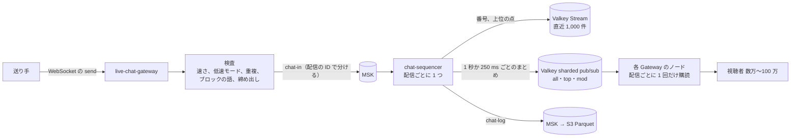

# Live chat: YouTube

ライブとプレミア公開のチャットを決める。接続の Gateway、送信の検査と順番付け、配信ごとの扇形の配り（1 秒ごとのまとめ、表示の上限、上位のチャット）、100 万人の視聴での計算、送信の速さの上限と低速モード、モデレーション、再接続と取り直し、チャットのリプレイを扱う。

前提となる決定は次のとおり。

- ライブチャットは WebSocket の Gateway と Valkey での扇形の配り。大きな配信は 1 秒ごとにまとめて送り、送信の速さの上限（低速モード）と「上位のチャット」の絞り込みを持つ。チャットのリプレイは配信の時刻のずれで VOD に合わせる（[architecture/README.md](README.md) の 6 節）
- Slack の題材の Gateway の形（ノードごとの購読の集約、遅い受信者の切断、再接続の殺到への備え）を参考にする（[Slack の realtime.md](../../../slack/docs/architecture/realtime.md)）
- 視聴の出来事と同じく、量の多い流れは MSK に載せる（[ADR-0001](../decisions/0001-platform-and-stack.md)）
- 措置は `playable()` と配信の停止（[ADR-0009](../decisions/0009-single-tenant-and-playable.md)、[ADR-0027](../decisions/0027-takedown-deny-list-within-60s.md)）
- 利用者のデータ（チャットの本文）をログに出さない（AGENTS.md）

この文書で決めたことは次の ADR にある。

| ADR | 決定 |
| --- | --- |
| [0032](../decisions/0032-chat-sequencer-and-batched-fanout.md) | 送信は検査の後に MSK の `chat-in`（配信の ID で分ける）に書き、配信ごとに 1 つの順番付け（`chat-sequencer`）が番号を振る。視聴の 1,000 人以上の配信は 1 秒、それ未満は 250 ms ごとにまとめ、Valkey の sharded pub/sub で Gateway のノードへ 1 回だけ送る。視聴者に送るのは「すべて」で 1 秒 20 件、「上位」で 8 件まで。配りはベストエフォートで、欠けは Valkey の直近 1,000 件から取り直す |
| [0033](../decisions/0033-chat-rate-limits-slow-mode-and-moderation.md) | 送信は利用者ごとのトークンの桶（1 秒 1 件、3 件まで貯まる）、低速モード（1〜300 秒）、同じ文の 30 秒の重複の拒否、200 文字で抑える。配信の受け付けが 1 秒 1,000 件を 30 秒続けたら、低速モード 5 秒を自動で入れる。ブロックの語は保留にしてモデレーターに見せる。リプレイの時刻は「受けた時刻 − 配信の開始 − 送り手の申告した遅れ」 |

## 1. 範囲

- 扱う：
  - チャットの接続の Gateway（`live-chat-gateway`）、購読、心拍、遅い受信者、再接続
  - 送信の検査、順番付け、まとめ、扇形の配り、表示の上限と抜き取り、上位のチャット
  - 100 万人の視聴の配信の計算
  - 送信の速さの上限、低速モード、メンバー限定のチャット
  - モデレーター、ブロックの語、保留、削除、タイムアウト、チャットからの締め出し
  - チャットの記録とリプレイ
- 扱わない：
  - コメント（comments-and-moderation の領域）。自動の分類の部品は共有する
  - 有料のチャット（投げ銭）（MVP の後）
  - アカウントと年齢、不正なアカウント（accounts-and-safety の領域）
  - Gateway のネットワークと台数の構成（infrastructure の領域）

## 2. 要件

| 要件 | 目標 | NFR |
| --- | --- | --- |
| 届く速さ | 20 万人の配信で、送信から視聴者の画面まで p95 2 秒 | NFR-013 |
| 規模（設計の上限） | 1 配信 100 万人の同時の視聴（S2 の 200 万の半分まで 1 配信で受ける）。送信のピーク 1 秒 5,000 件 | [architecture/README.md](README.md) の 2 節 |
| 負荷の試験の場面 | 20 万人、ピーク 1 秒 2,000 件、3 時間 | [quality.md](../quality.md) の 2.2.1 節 H |
| 取りこぼし | 視聴者への配りはベストエフォート。受け付けた送信は記録から失わない | — |
| 措置 | モデレーターの削除が、次のまとめ（1 秒以内）で全視聴者の画面から消える | — |

## 3. 全体の流れ

- Gateway は Rust（Tokio）で、状態を持たない（接続と購読の表だけ）。管理の面の API（認証、`playable()`、モデレーターの役割）を呼ぶ。
- チャットの正本は MSK の `chat-log` と S3 である。Aurora に 1 件ずつは書かない（量が多く、配りはベストエフォートでよい）。モデレーションの操作（締め出し、ブロックの語の一覧）は Aurora に書く。

## 4. 接続

- 接続：`wss://chat.<brand>.<domain>/v1/streams/{stream_id}`。ログインしない視聴者も読める（送れない）。
- 接続の時に `playable()` を通す。措置・メンバー限定・年齢の制限の配信のチャットは、見えない視聴者に開かない。
- 心拍：30 秒ごと。90 秒なにも来なければ切る。
- 購読の種類：`top`（既定）、`all`、`mod`（モデレーターと所有者だけ）。1 つの接続は 1 つの配信。
- 遅い受信者：送信のバッファが 256 KB を超えたら、まとめを捨てる（次のまとめで追いつく）。1 MB を超えるか、30 秒 256 KB を下回らなければ切る（Slack の題材の 7 節の形）。
- 接続の受け付け：ノードあたり 1 秒 500 接続まで。超えたら `retry_after` を付けて断る。クライアントは 0〜10 秒のゆらぎの後、指数の後退で再接続する。

## 5. 送信と順番付け（ADR-0032）

### 5.1 送信

1. 送り手は `send {client_msg_id, text}` を送る。Gateway は送り手の画面に「送信中」として先に出す。
2. 検査（6 節）。通らなければ理由のコードを返す（`rate_limited`、`slow_mode`、`duplicate`、`held`、`banned` など）。
3. MSK の `chat-in` に、配信の ID を鍵にして書く（`acks=all`）。
4. 順番付けが番号を振ったら、送り手の接続にも番号つきで届く。送り手の画面の「送信中」を置き換える（`client_msg_id` で対応）。

### 5.2 順番付け（`chat-sequencer`）

- `chat-in` のパーティションの持ち主（消費者のグループ）が、そのパーティションの配信の順番付けを持つ。1 つの配信は 1 つの持ち主だけが番号を振る。
- 番号：`seq = max(前の seq + 1, 今のミリ秒 × 1024)`。持ち主が替わっても、新しい持ち主の時計の値が前より大きいので、番号は戻らない（時計の揃いは数 ms、持ち主の交代は数秒）。
- 各メッセージに上位のチャットの点を付ける（6.4 節）。
- 書く先：Valkey Stream `chat:{stream_id}`（直近 1,000 件、取り直し用）、まとめの送信（5.3 節）、MSK の `chat-log`（番号つき。S3 の Parquet へ）。
- モデレーションの操作（削除、タイムアウト、締め出し）も同じ順番付けを通し、番号を持つ出来事にする。削除は消すメッセージより後の番号で届く。

### 5.3 まとめと扇形の配り

| 視聴の人数 | まとめの間隔 | 1 回に送る件数の上限（視聴者へ） |
| --- | --- | --- |
| 1,000 人未満 | 250 ms | `all`：5 件、`top`：2 件 |
| 1,000 人以上 | 1 秒 | `all`：20 件、`top`：8 件 |
| `mod` の購読 | 250 ms | 上限なし（受け付けた全部） |

- 上限を超えたときの選び方：所有者・モデレーター・ピン留めの出来事を必ず入れ、残りを上位の点の高い順と無作為の抜き取りで半分ずつ選ぶ。選ばれなかったメッセージも番号を持ち、記録とリプレイと `mod` には残る。
- 順番付けは、まとめを Valkey の sharded pub/sub の `chat:{stream_id}:all`・`:top`・`:mod` に 1 回ずつ送る。チャネルの名前は配信ごとに別のスロットに散る（Slack の題材の S2 の形）。
- Gateway のノードは、その配信の視聴者を 1 人でも持てば、チャネルを 1 回だけ購読する。まとめを 1 回だけ直列化し、同じバイトを全接続に送る。WebSocket の圧縮は文脈を持ち越さない設定にし、圧縮した 1 つのフレームを全接続で使い回す。

### 5.4 100 万人の視聴の計算

| 項目 | 値 | 計算 |
| --- | --- | --- |
| Gateway のノード | 26 | 1 ノード 5 万接続 × 20 ＋ 30% の余裕 |
| 1 配信の購読（Valkey） | 26 × 2 種（`all`・`top`）＋ `mod` | 視聴者の数によらない |
| Valkey の送信 | 1 秒に 3 回のまとめ × 26 ノード ≈ 80 件/秒 | 1 まとめ 約 6 KB（20 件 × 約 300 バイト） |
| 1 視聴者への送信 | `all`：約 2 KB/秒（圧縮で 1 件約 100 バイト）、`top`：約 0.8 KB/秒 | — |
| 1 ノードの送信 | 5 万 × 2 KB/秒 ≈ 100 MB/秒（約 0.8 Gbps） | `all` を全員が選んだ最悪の場合 |
| 全体の送信 | 100 万 × 2 KB/秒 ≈ 2 GB/秒（約 16 Gbps） | 同じ視聴者の動画（3 Mbps × 100 万 = 3 Tbps）の約 0.5% |
| 受け付け | 1 秒 5,000 件まで | 超えた分は `busy` で断る（所有者とモデレーターを除く） |

- 視聴者 1 人に送る件数を上限で抑えるので、送りの量は「視聴者の数 × 上限」で決まり、送信の数に比例しない。1 秒 5,000 件の送信があっても、視聴者が読めるのは 1 秒 20 件までである。

### 5.5 遅延の予算（p95、20 万人）

| 区間 | 時間 |
| --- | --- |
| 送り手 → Gateway | 100 ms |
| 検査（Valkey） | 30 ms |
| MSK への書き込み（`acks=all`） | 30 ms |
| 順番付けの読み込み | 20 ms |
| まとめの待ち | 950 ms |
| Valkey → Gateway のノード | 10 ms |
| ノードの中の送り出し（5 万接続） | 200 ms |
| ネットワークと描画 | 200 ms |
| 合計 | 約 1.5 秒（目標 p95 2 秒） |

## 6. 送信の速さ・低速モード・モデレーション（ADR-0033）

### 6.1 上限

| 規則 | 値 | 超えたとき |
| --- | --- | --- |
| 利用者ごとのトークンの桶 | 1 秒 1 件、3 件まで貯まる | `rate_limited` |
| 低速モード | 配信者・モデレーターが 1〜300 秒で設定 | `slow_mode`（次に送れる時刻を返す） |
| 自動の低速モード | 受け付けが 1 秒 1,000 件を 30 秒続けたら 5 秒。10 分下回ったら外す | モデレーターに知らせる |
| 同じ文の重複 | 同じ利用者・同じ配信・正規化した同じ文を 30 秒 | `duplicate` |
| 長さ | 200 文字（絵文字の画像は 1 件に 10 個まで） | `too_long` |
| 作って 24 時間未満のアカウント | 10 秒 1 件 | `rate_limited` |
| 1 接続のフレーム | 1 秒 10 フレーム、1 フレーム 4 KB | 切る |
| 配信あたりの受け付け | 1 秒 5,000 件 | `busy` |

- 速さの判定は Valkey の鍵（`rl:{user_id}`、`slow:{stream_id}:{user_id}`）で行う。Valkey が使えないときは、Gateway のノードの中だけの桶で判定する（緩くなるが、止めない）。

### 6.2 モード

| モード | 送れる人 |
| --- | --- |
| 通常 | ログインした利用者 |
| 登録者だけ | チャンネルを 10 分以上前から登録した利用者 |
| メンバー限定 | チャンネルのメンバー（monetization-and-payouts の領域） |
| 止める | 所有者とモデレーターだけ |

### 6.3 モデレーション

| 操作 | 効果 |
| --- | --- |
| 削除 | 削除の出来事を順番付けに通す。次のまとめで全視聴者の画面から消える。リプレイからも除く |
| タイムアウト | 10 秒・1 分・5 分・10 分・1 時間・24 時間、その配信のチャットで送れない |
| 締め出し | そのチャンネルのチャットで送れない。モデレーターが選べば、その配信の過去のメッセージを全部消す |
| ブロックの語 | チャンネルの一覧と、本システムの一覧（運用が持つ）。当たったメッセージは保留にし、送り手と `mod` の購読にだけ見せる。モデレーターが通せば公開する（新しい番号を振る） |
| リンク | 既定で保留（モデレーターと所有者は通す） |
| モデレーターの任命 | 所有者がチャンネルのモデレーターを指名する（Aurora、チャンネルの RLS） |

- 自動の分類（スパム、嫌がらせ）は comments-and-moderation の領域の分類器を共有し、点が高いものを保留にする。チャットの本文を機械で読むことの扱いは **法務の確認待ち：L6**（通信の秘密との関係、他人の通信の媒介に当たるか）。結論まで、自動の分類は「保留」までにし、自動で削除しない。
- 措置で配信が止まったら（`terminated`）、チャットも閉じ、新しい接続を受けない。

## 7. 再接続と取り直し

- クライアントは最後に受け取った `seq` を持つ。まとめの中の `seq` が飛んだら、`resync {after_seq}` を送る。
- Gateway は Valkey Stream から `after_seq` の後の最大 1,000 件を返す（表示の上限の規則で抜き取る）。それより古ければ、直近だけを返し、クライアントは古い分を捨てる。チャットは流れるもので、全部を取り戻す必要はない（Slack の題材の「DB が正本で差分を取る」形と違う点）。
- Gateway のノードが落ちたら、5 万接続がゆらぎ（0〜10 秒）の後に他のノードへ再接続する。残り 25 ノードで 1 秒 2,000 接続、1 ノード 1 秒 80 接続で、受け付けの上限（500）に入る。

## 8. リプレイ

- 各メッセージに `video_offset_ms = 受けた時刻 − 配信の開始の時刻 − 送り手の申告した遅れ` を持つ。送り手の遅れは、送り手のプレイヤーのライブの端からの遅れ（0〜30 秒に丸める。申告がなければ低遅延 4 秒・通常 15 秒）。
- 配信の終わりとアーカイブの公開の後に、`chat-replay-builder` が `chat-log` を読み、削除・保留のまま・締め出しで消したメッセージを除き、30 秒ごとの JSON（圧縮）にまとめる：`s3://<media-bucket>/p/{video_id}/chat/{n}.json.gz`。
- プレイヤーは再生の位置で該当の塊を CDN から取り、`video_offset_ms` の順に出す。リプレイの配信は動画と同じ拒否の一覧で止まる（[cdn-and-delivery.md](cdn-and-delivery.md) の 10 節）。
- アーカイブが最後の 12 時間のときは、リプレイも同じ範囲にする（[live-streaming.md](live-streaming.md) の 7.2 節）。

## 9. 失敗と回復

| 失敗 | 起きること | 回復 |
| --- | --- | --- |
| Gateway のノードの停止 | その接続が切れる | ゆらぎ付きの再接続と `resync` |
| 順番付けの持ち主の停止 | その配信の新しいメッセージが止まる | MSK の消費者のグループが別の持ち主に移す（数秒）。番号は時計の値で戻らない |
| Valkey の切り替え | まとめの配りが落ちる | Gateway は購読を張り直し、接続に `resync` を送る。速さの判定はノードの中の桶に落とす |
| MSK の書き込みの失敗 | 送信が失敗する | 送り手に `retry` を返す。クライアントは同じ `client_msg_id` で送り直す（順番付けが重複を捨てる：配信ごとに直近 10 分の `client_msg_id` を覚える） |
| 送信の急増（1 秒 5,000 件超） | 受け付けを断る | 自動の低速モードと `busy` |
| 再接続の殺到 | 接続の受け付けが詰まる | ノードあたりの受け付けの上限とゆらぎ |

## 10. 上限

| 対象 | 値 |
| --- | --- |
| 1 ノードの接続 | 5 万 |
| 1 配信の視聴（設計） | 100 万 |
| 送りの上限 | `all` 1 秒 20 件、`top` 8 件 |
| 受け付け | 配信あたり 1 秒 5,000 件 |
| メッセージ | 200 文字 |
| 取り直し | 直近 1,000 件 |
| 重複の判定 | 30 秒、`client_msg_id` は 10 分 |

## 11. data-model への項目

| 表・置き場 | 中身 | 主キー・索引 | 節 |
| --- | --- | --- | --- |
| MSK `chat-in` | 検査を通った送信（配信の ID で分ける）。保持 1 日 | — | 5.1 |
| MSK `chat-log` | 番号つきのメッセージとモデレーションの出来事。S3 の Parquet（Iceberg の表）へ。保持の期間は security の領域（**法務の確認待ち：L10**） | — | 5.2 |
| Valkey | `chat:{stream_id}`（Stream、1,000 件）、`chat:{stream_id}:all`・`:top`・`:mod`（sharded pub/sub）、`rl:{user_id}`、`slow:{stream_id}:{user_id}`、`dup:{stream_id}:{user_id}:{hash}` | 期限つき | 5、6 |
| `chat_settings`（チャンネルの表） | `stream_id`、`mode`、`slow_seconds`、`auto_slow`、`links_held` | `(stream_id)` | 6.2 |
| `chat_moderators`（チャンネルの表） | `channel_id`、`user_id`、`granted_by`、`granted_at` | `(channel_id, user_id)` | 6.3 |
| `chat_bans`（チャンネルの表） | `channel_id`、`user_id`、`kind`（`timeout`・`ban`）、`until`、`by` | `(channel_id, user_id)` | 6.3 |
| `chat_blocked_terms`（チャンネルの表と運用の表） | 語、正規化の形 | `(channel_id, term)` | 6.3 |
| S3 | `p/{video_id}/chat/{n}.json.gz` | — | 8 |

- チャットの本文は `chat-in`・`chat-log`・Valkey・リプレイのファイルにだけ置き、ログ・トレース・指標には出さない（AGENTS.md）。

## 12. テストと性質

| ID | 性質・試験 |
| --- | --- |
| PROP-CHAT-001 | 任意の持ち主の交代と時計の揺れ（数 ms）で、1 つの配信の `seq` は厳密に増える |
| PROP-CHAT-002 | 任意のメッセージと削除の列で、削除の出来事は消すメッセージより後の番号を持ち、まとめを順に当てたクライアントの画面にそのメッセージが残らない |
| PROP-CHAT-003 | 任意の送信の列で、1 回のまとめで視聴者に送る件数は上限以下で、所有者・モデレーターのメッセージは必ず含まれる |
| PROP-CHAT-004 | 任意の送信の時刻の列で、利用者ごとの受け付けはトークンの桶と低速モードの両方を満たす |
| PROP-CHAT-005 | 同じ `client_msg_id` の送り直しは、1 つの番号だけになる |
| DT-CHAT-001 | 検査の決定表：モード × 役割 × 締め出し × ブロックの語 × 速さ |
| 負荷 | 20 万人・ピーク 1 秒 2,000 件・3 時間で p95 2 秒（[quality.md](../quality.md) の 2.2.1 節 H）。100 万人の模型で 1 ノードの送信と Valkey の購読の数 |
| 障害の注入 | Gateway のノード、順番付けの持ち主、Valkey の切り替え |
| 合成監視 | 見張りのチャット（[runbooks](../runbooks/README.md)） |

## 13. Story の候補

| Epic | Story | 中身 |
| --- | --- | --- |
| E13 | `chat-gateway` | 4・7 節 |
| E13 | `chat-sequencer` | 5.1・5.2 節（ADR-0032、PROP-CHAT-001・002・005） |
| E13 | `chat-batching-and-top-chat` | 5.3・5.4 節（ADR-0032、PROP-CHAT-003） |
| E13 | `chat-moderation` | 6 節（ADR-0033、PROP-CHAT-004、DT-CHAT-001。**法務の確認待ち：L6**） |
| E13 | `chat-replay` | 8 節 |
| E13 | `chat-load-tests` | 12 節の負荷 |

## 14. 未解決の問い

### 決定（2026-10-10、既定案）

- **正本**：MSK の `chat-log` と S3。Aurora に 1 件ずつ書かない（ADR-0032）。
- **まとめ**：1,000 人以上は 1 秒、未満は 250 ms（ADR-0032）。
- **表示の上限**：`all` 20 件・`top` 8 件/秒（ADR-0032）。
- **上限と低速モード**：1 秒 1 件・3 件、自動の低速モード 5 秒（ADR-0033）。
- **自動の分類**：保留までで、自動で削除しない（L6 の結論まで）。

### 持ち越し

| 問い | いつ・どう決めるか |
| --- | --- |
| チャットの本文を機械で読む範囲、他人の通信の媒介に当たるか | **法務の確認待ち：L6** |
| チャットの記録の保持の期間と、開示の請求への備え | **法務の確認待ち：L10**（security の領域） |
| 上位のチャットの点の作り方（分類器の点と規則） | comments-and-moderation の領域と `chat-batching-and-top-chat` |
| 1 ノード 5 万接続の型と台数 | infrastructure の領域、`chat-load-tests` |
| 有料のチャット | MVP の後（**法務の確認待ち：L7**） |

## 出典

- 本家のライブチャットの上限（文字数、低速モードの範囲、送信の速さ）は、公式の資料で確かめていない（**未検証**）。本文の値は本システムの値。
- [Slack の realtime.md](../../../slack/docs/architecture/realtime.md)（Gateway の形の参考。題材の中の文書）
