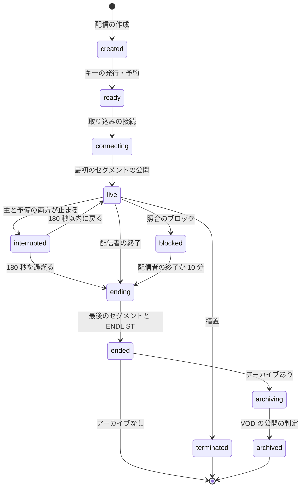
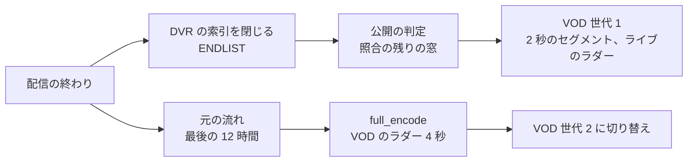

# Live streaming: YouTube

ライブの配信を決める。取り込み（RTMPS・SRT）、ストリームキー、予備の取り込み、配信の状態、GPU のライブの変換と予備、LL-HLS の値と遅延の予算、`live-origin`（部分セグメントと要求の保留）、CDN の要求の量、通常のモード、DVR（12 時間）とライブからの VOD、ライブの照合と差し替え、プレミア公開を扱う。

前提となる決定は次のとおり。

- 取り込みは RTMPS と SRT（平文の RTMP は受けない）。GPU（NVENC）で H.264 のライブのラダー。低遅延は LL-HLS（部分 0.5 秒、セグメント 2 秒、p95 6 秒）、通常は 2 秒のセグメント。DVR 12 時間。同じセグメントから VOD を作り、元の流れから作り直す（[ADR-0006](../decisions/0006-live-ingest-and-latency.md)）
- ライブの照合は 30 秒の窓、ブロックが 2 つの窓で続いたら差し替える（[ADR-0008](../decisions/0008-fingerprinting-and-match-engine.md)）
- CMAF の書き手と索引 `SIX1`（[ADR-0019](../decisions/0019-cmaf-files-segment-index-and-url-layout.md)）、エッジのトークン（[ADR-0025](../decisions/0025-edge-token-signing-and-cache-keys.md)）、配信の停止（[ADR-0027](../decisions/0027-takedown-deny-list-within-60s.md)）
- ライブの ABR（[ADR-0022](../decisions/0022-buffer-based-abr.md)）

この文書で決めたことは次の ADR にある。

| ADR | 決定 |
| --- | --- |
| [0028](../decisions/0028-live-ingest-keys-backup-and-source-recording.md) | ストリームキーは `<brand>_sk_`＋32 文字の乱数＋6 文字のチェックサムで、SHA-256 だけを持つ。主と予備の取り込みを同じキーで受け、主の流れが 1.5 秒止まったら予備へ移す。`live-ingest` は入力を 10 秒ぶんメモリーに持ち、元の流れを 10 秒ごとに S3 へ書く |
| [0029](../decisions/0029-live-transcoder-placement-and-standby.md) | ライブの変換は GPU のプールに配信を詰めて置き、AZ ごとに空きを「GPU 2 枚か 10% の大きいほう」持つ。予想の視聴が 1 万を超える配信は、別の AZ に同時に動く予備の変換を置く。セグメントの番号と IDR の位置は入力の時刻から決め、どの変換器の出力も同じ番号になる |
| [0030](../decisions/0030-ll-hls-parameters-and-live-origin.md) | LL-HLS は `PART-TARGET` 0.5（端数のあるフレームレートは 0.501）、`PART-HOLD-BACK` 1.5、`HOLD-BACK` 6、`CAN-SKIP-UNTIL` 12。プレイリストと部分は `live-origin` がメモリーの直近 60 秒から返し、要求の保留は最大 6 秒。`live-origin` は配信ごとに 2 つの AZ に写しを持つ |
| [0031](../decisions/0031-dvr-storage-and-live-to-vod.md) | DVR はレンディションごとに 10 秒（5 セグメント）を 1 つのオブジェクトにまとめて S3 に書き、接頭辞を配信の ID のハッシュで散らす。配信の終わりに DVR の索引を閉じてそのまま VOD にし、元の流れから VOD のラダー（4 秒）を作って世代を上げる。アーカイブは最後の 12 時間 |

## 1. 範囲

- 扱う：
  - 取り込みの口、ストリームキー、予備の取り込み、入力の上限、元の流れの保存
  - 配信のステートマシン
  - `live-transcoder` の置き方、予備、ライブのラダー
  - LL-HLS と通常のモードの値、遅延の予算、`live-origin`、CDN の要求の量
  - DVR の保存、ライブからの VOD、アーカイブの範囲
  - ライブの照合の流れと差し替え
  - プレミア公開
- 扱わない：
  - ライブチャット（[live-chat.md](live-chat.md)）
  - 指紋の作り方と照合のエンジン（copyright-matching の領域）
  - プレイヤーの ABR の中身（[playback-and-abr.md](playback-and-abr.md) の 5.5 節）
  - GPU のプールの調達と AMI（infrastructure の領域）
  - ライブの AV1、自動の字幕、超低遅延（WebRTC）、有料のチャット（MVP の後）

## 2. 要件

| 要件 | 目標 | NFR |
| --- | --- | --- |
| 遅延（低遅延のモード） | 撮影から画面まで p50 4 秒・p95 6 秒 | NFR-005、K4 |
| 遅延（通常のモード） | p95 20 秒 | NFR-005 |
| 開始 | 配信の開始から視聴できるまで 10 秒 | NFR-005 |
| DVR | 12 時間の窓 | NFR-005 |
| VOD | 配信の終わりから VOD で見られるまで p95 5 分 | NFR-005 |
| 切り替え | 主の取り込みの切断、変換器の停止で、欠けは 3 秒以内 | [quality.md](../quality.md) の 2.2.1 節 E |
| 可用性 | 取り込み 月間 99.95% | NFR-010 |
| 照合 | 一致の始まりから検出まで p95 90 秒。ブロックは検出から 10 秒で差し替え | NFR-007、NFR-014 |
| 規模（S1） | 同時の配信 2,000、1 配信の最大の視聴 20 万 | [architecture/README.md](README.md) の 2 節 |

## 3. 標準と本家（確かめたこと）

いずれも 2026-10-10 に確認。

| 項目 | 内容 | 出典 |
| --- | --- | --- |
| 本家の取り込み | RTMP・RTMPS（RTMPS を推奨）。HDR で RTMP のない符号化器には HLS。H.264・H.265・AV1。SRT はこのページにない（**未検証**） | [Choose live encoder settings](https://support.google.com/youtube/answer/2853702) |
| 本家の遅延 | 通常・低遅延（多くの視聴者で 10 秒未満）・超低遅延（5 秒未満）。低遅延と超低遅延は 4K なし | [Live stream latency](https://support.google.com/youtube/answer/7444635) |
| 本家の DVR とアーカイブ | 12 時間を超えると DVR が制限され、アーカイブされないことがある。配信の開始より前には戻れない | [Turn on DVR](https://support.google.com/youtube/answer/9296823)、[Archive live streams](https://support.google.com/youtube/answer/6247592) |
| LL-HLS | draft-pantos-hls-rfc8216bis-22（2026-05-01。独立の投稿の Internet-Draft で、RFC ではない。RFC 8216 は LL-HLS を含まない）：`PART-HOLD-BACK` は `PART-TARGET` の 2 倍以上（3 倍以上が望ましい）。`HOLD-BACK` は Target Duration の 3 倍以上。`CAN-SKIP-UNTIL` は 6 倍以上。部分の長さは `PART-TARGET` 以下で、85% 以上。要求の保留は、3 Target Duration を超えて返せなければ 503。部分はプレイリストの端から 3 Target Duration を過ぎたら外してよく、外した後も 3 Target Duration は取れること | [draft-pantos-hls-rfc8216bis](https://datatracker.ietf.org/doc/html/draft-pantos-hls-rfc8216bis) |
| SRT | draft-sharabayko-srt-01（2021-09-07、失効した個人の草案、IETF の標準ではない）。ARQ の再送と、受け手の時刻に基づく送り出し（一定の遅れ）。暗号は AES-CTR の 128・192・256 ビット。Stream ID は 512 バイトまでの UTF-8 | [draft-sharabayko-srt](https://datatracker.ietf.org/doc/html/draft-sharabayko-srt) |
| SRT の Stream ID の書き方（`#!::r=...,m=publish`）、SRT の既定の遅れの値 | 草案の確かめた範囲になかった（**未検証**。`ll-hls-poc` で配信のソフトの実際を確かめる） | — |
| RTMP で H.265・AV1 を送る拡張 | 公式の仕様の確認をしていない（**未検証**） | — |

## 4. 取り込み（ADR-0028）

### 4.1 口

| 方式 | URL | 終端 |
| --- | --- | --- |
| RTMPS | `rtmps://ingest.<brand>.<domain>:443/live/{stream_key}` | NLB（TCP 443）→ `live-ingest` が TLS を終える |
| SRT | `srt://ingest.<brand>.<domain>:9000?streamid=...&passphrase=...` | NLB（UDP 9000）→ `live-ingest` |

- SRT の暗号は必須にする（パスフレーズはストリームキーごとに出す 32 文字）。AES-128 以上。
- 平文の RTMP は受けない（ADR-0006）。

### 4.2 ストリームキー

- 形：`<brand>_sk_` ＋ 32 文字の base62 の乱数（約 190 ビット）＋ 6 文字の CRC32 のチェックサム。チェックサムで、漏れたキーの検出（シークレットスキャン）と、打ち間違いの早い拒否ができる（リポジトリ共通の ADR-0006）。
- 持つのは SHA-256 だけ。表示は作成の時の 1 回。
- 種類：チャンネルの既定のキー（使い回す）と、予約の配信ごとのキー。
- 失効：失効から 5 秒以内に接続を切る。
- 認証の失敗は、送り元の IP ごとに 1 分 10 回まで。超えたら 10 分拒む。キーと IP アドレスをログに出さない（AGENTS.md）。

### 4.3 入力の上限

| 項目 | 上限 | 超えたとき |
| --- | --- | --- |
| 解像度・フレームレート | 2160p60 | 接続を拒む。4K は通常のモードだけ（ADR-0006） |
| ビットレート | 40 Mbps | 超えた分を捨てず、警告を配信者に出す。60 秒続けば切る |
| 映像の符号 | H.264（必須）、H.265・AV1（受けて復号） | 他は拒む |
| 音声 | AAC・Opus、48 kHz か 44.1 kHz | 48 kHz に直す |
| キーフレームの間隔 | 4 秒以下を推奨 | 長くても受ける（変換で GOP を作り直す）。予備への切り替えが遅れる |
| 同時の配信 | チャンネルあたり 1（＋予備の取り込み） | 2 つ目を拒む |

### 4.4 予備の取り込みと入力のバッファ

- 主と予備は同じキーで、予備は `?backup=1`（SRT は Stream ID に `b=1`）を付ける。
- `live-ingest` は主と予備を組にし、主の映像のパケットが 1.5 秒来なかったら予備へ移す。入力の時刻のずれは、2 つの流れの同じ時刻のキーフレームの差から求めて合わせる。移る時の欠けは 3 秒以内（ADR-0006）。
- `live-ingest` は、入力のパケットを 10 秒ぶんメモリーに持つ（入力のバッファ）。変換器が入れ替わったとき、新しい変換器は直前のセグメントの境から作り直せる（5.3 節）。
- 元の流れ（入力のパケットのまま）を 10 秒ごとに S3 に書く（`live-src/`）。VOD の作り直し（7.2 節）と照合に使い、最後の 12 時間を持つ。

## 5. 配信の状態



- `interrupted` の間は、プレイリストに「まもなく再開」の画面のセグメント（前もって全段で作ったもの）を同じ時刻の列で足す。視聴者のプレイヤーは止まらない。
- `blocked` は差し替えの画面を流し続け、配信者に知らせる（8 節）。
- 状態の遷移は `live_streams` の条件つきの `UPDATE` と outbox（通知、チャット、`playable()` の写し）を同じトランザクションで書く。

## 6. 変換と配信

### 6.1 ライブのラダー（`live_ladder_version` 1）

| 段 | 30 fps | 60 fps |
| --- | --- | --- |
| 1080p | 4.5 Mbps | 6.0 Mbps |
| 720p | 2.5 Mbps | 3.5 Mbps |
| 480p | 1.2 Mbps | — （30 fps に落とす） |
| 360p | 0.7 Mbps | — |
| 240p | 0.3 Mbps | — |
| 音声 | AAC-LC 128 kbps、HE-AAC 48 kbps | — |

- 入力の解像度を超える段は作らない。4K の入力は 2160p 12 Mbps と 1440p 8 Mbps を足す（通常のモードだけ）。
- NVENC の H.264。低遅延のモードは B フレームなし・先読みなし（1 フレームの並べ替えの遅れを避ける）。通常のモードは B フレーム 2。
- GOP は 2 秒の閉じた GOP。IDR の位置は入力の時刻が 2 秒の倍数を越えた最初のフレームで、全段で同じ（1 回の復号を全段で使う）。
- セグメントの番号 `msn = floor((入力の時刻 − 配信の開始の時刻) / 2 秒)`。どの変換器が作っても同じ番号になる（[ADR-0029](../decisions/0029-live-transcoder-placement-and-standby.md)）。

### 6.2 変換器の置き方と予備（ADR-0029）

| 項目 | 値 |
| --- | --- |
| 1 枚の GPU（L4）の配信の数 | 1080p のラダーで 6（`ll-hls-poc` で確かめる。[architecture/README.md](README.md) の 2.1 節） |
| 空き | AZ ごとに GPU 2 枚か、使っている枚数の 10% の大きいほう |
| 置き方 | 配信を空きのある GPU に詰める。同じチャンネルの主と予備は別の AZ |
| 同時に動く予備 | 予想の視聴が 1 万を超える配信（登録者 10 万以上のチャンネル、または視聴が 1 万を超えた時点から）。別の AZ で同じ入力から同時に作る |
| 予備のない配信の変換器の停止 | 空きの GPU に新しい変換器を置き、入力のバッファから直前のセグメントの境で作り直す。目標の欠け 3 秒以内 |

- 同時に動く予備の出力は、`live-origin` が主の停止の時にセグメントの境で切り替える。同じ設定・同じドライバーなら SPS・PPS は同じと見込む（**未検証**。違えば `EXT-X-DISCONTINUITY` を入れる。`ll-hls-poc` で確かめる）。
- S1 のピーク（2,000 配信）：約 334 枚＋空き＋予備。GPU の確保は infrastructure の領域。

### 6.3 LL-HLS の値（ADR-0030）

| 値 | 整数のフレームレート | 端数のあるフレームレート（29.97 など） |
| --- | --- | --- |
| `EXT-X-TARGETDURATION` | 2 | 2（2.002 を四捨五入） |
| `EXT-X-PART-INF:PART-TARGET` | 0.5 | 0.501（15 フレーム = 0.5005 秒を収める） |
| `PART-HOLD-BACK` | 1.5（3 倍） | 1.503 |
| `HOLD-BACK` | 6（3 倍） | 6 |
| `CAN-BLOCK-RELOAD` | YES | YES |
| `CAN-SKIP-UNTIL` | 12（6 倍） | 12 |
| `EXT-X-PRELOAD-HINT` | 次の部分 | 次の部分 |
| 部分を残す範囲 | 端から 3 セグメント（6 秒）。外した後も 6 秒は取れる | 同じ |

```
#EXTM3U
#EXT-X-VERSION:9
#EXT-X-TARGETDURATION:2
#EXT-X-SERVER-CONTROL:CAN-BLOCK-RELOAD=YES,PART-HOLD-BACK=1.5,HOLD-BACK=6,CAN-SKIP-UNTIL=12
#EXT-X-PART-INF:PART-TARGET=0.5
#EXT-X-MEDIA-SEQUENCE:1820
#EXT-X-MAP:URI="init.mp4"
...
#EXT-X-PROGRAM-DATE-TIME:2026-10-10T12:00:30.000+09:00
#EXTINF:2.000,
1835.m4s
#EXT-X-PART:DURATION=0.5,URI="1836.0.m4s",INDEPENDENT=YES
#EXT-X-PART:DURATION=0.5,URI="1836.1.m4s"
#EXT-X-PRELOAD-HINT:TYPE=PART,URI="1836.2.m4s"
```

- `EXT-X-VERSION` の値は、草案のどの機能にどのバージョンが要るかを `ll-hls-poc` で確かめて決める（ここの 9 は仮の値。草案は 2026-10-10 に取得し直したが、LL-HLS のタグに要る値は確かめた範囲になかった。**未検証**）。
- `EXT-X-PROGRAM-DATE-TIME` は入力の時刻（配信の開始の時刻 ＋ `msn` × 2 秒）から各セグメントに付ける。実ユーザーの遅延の推定（心拍の `lat_ms`、[observability.md](observability.md) の 2.3 節）に使う（[ADR-0030](../decisions/0030-ll-hls-parameters-and-live-origin.md) の 2026-10-10 の注記）。

### 6.4 遅延の予算（低遅延のモード）

| 区間 | p50 | p95 | 持ち主 |
| --- | --- | --- | --- |
| 撮影と配信のソフトの符号化 | 0.5 秒 | 1.0 秒 | 配信者（推奨の設定で示す） |
| 取り込みの転送（RTMPS、SRT は遅れの設定 0.5〜1 秒） | 0.2 | 0.8 | — |
| `live-ingest` → 変換器 | 0.05 | 0.1 | 本システム |
| GPU の復号・縮小・符号化（B なし、先読みなし） | 0.15 | 0.3 | 本システム |
| 部分の完成（0.5 秒の部分を全部作ってから出す） | 0.5 | 0.5 | 本システム |
| `live-origin` の公開とプレイリストの更新 | 0.05 | 0.1 | 本システム |
| CDN（要求の保留の応答、エッジ → Origin Shield → `live-origin`） | 0.1 | 0.3 | 本システム |
| プレイヤーの後ろの距離（`PART-HOLD-BACK`、揺れの調整） | 1.5 | 2.5 | プレイヤー |
| 復号と描画 | 0.1 | 0.2 | プレイヤー |
| 合計 | 約 3.2 秒 | 約 5.8 秒 | 目標 p50 4 秒・p95 6 秒 |

- 部分は「全部を最大の速さで送れるまで 1 バイトも送らない」（草案の推奨）。部分の長さ 0.5 秒がそのまま遅れに入る。
- 予算の大きいのは配信者の側とプレイヤーの後ろの距離である。配信者の推奨（キーフレーム 2 秒、B フレームなし、RTMPS か SRT の遅れ 0.5 秒）を配信の画面で示す。

### 6.5 CDN の要求の量と費用

低遅延のモードの視聴者 1 人は、0.5 秒ごとにプレイリストの保留の要求 1 つ、映像の部分 1 つ、音声の部分 1 つを出す。

| 項目 | 低遅延（部分 0.5 秒） | 通常（2 秒のセグメント） |
| --- | --- | --- |
| 1 視聴者の要求 | 6 件/秒 | 1.5 件/秒 |
| 20 万人の配信のエッジの要求 | 120 万件/秒 | 30 万件/秒 |
| 1 視聴時間の要求の費用（HTTPS の要求 1 万件 0.012 USD。`AmazonCloudFront` の価格表） | 約 0.026 USD | 約 0.006 USD |
| 1 視聴時間の転送の費用（平均 3 Mbps、0.02 USD/GB） | 約 0.027 USD | 約 0.027 USD |

- 低遅延のモードは、要求の費用が転送の費用と同じくらいになり、1 視聴時間の配信の原価が約 2 倍になる。ディストリビューションの要求の上限（既定 25 万件/秒。[cdn-and-delivery.md](cdn-and-delivery.md) の 3 節）も超える。
- オリジンへの要求は、エッジと Origin Shield が同じ URL（`_HLS_msn`・`_HLS_part` が同じ）の保留の要求を合わせるので、配信の数 × 段の数に比例し、視聴者の数によらない。
- 対応：
  - ライブを別のディストリビューション（`live`）にし、E12 の前に 1.2 Tbps・250 万件/秒への引き上げを申請する（`live-distribution-quota`。[ADR-0064](../decisions/0064-accounts-network-and-edge-distributions.md)）。
  - プレイリストの差分の更新（`_HLS_skip=YES`）で、12 時間の DVR のプレイリスト（約 21,600 セグメント）を毎回送らない。
  - `ll-hls-poc` で、実際の要求の数と費用を測る。1 視聴時間の要求の費用が転送の費用を超えるなら、部分を 1 秒にする ADR（ADR-0006 の部分の長さを置き換える）を起票する。部分 1 秒なら `PART-HOLD-BACK` 3 秒で、遅延の予算は p95 約 7.3 秒になり、NFR-005（p95 6 秒）を外れる。この ADR は PM の合意を条件にする（[architecture/README.md](README.md) の 6 節の残る未解決事項）。

### 6.6 通常のモード

- 2 秒のセグメントの HLS と DASH（部分なし）。`HOLD-BACK` 6 秒、プレイヤーのバッファ 3 セグメント以上（ADR-0006）。撮影から画面まで p95 20 秒に十分に入る（予算：上の表の部分の完成と後ろの距離を 2 秒のセグメントと 6〜12 秒に置き換える）。
- 4K の配信、回線の悪い配信者（SRT の損失が 5% を超える）、配信者が選んだ配信はこのモード。

### 6.7 `live-origin`（ADR-0030）

- 配信ごとに、直近 60 秒の部分・セグメント・プレイリストの状態をメモリーに持つ Rust の部品。主のノードと、別の AZ の写しのノードの 2 つに、変換器が両方へ送る。
- 要求の保留：`_HLS_msn`・`_HLS_part` が未来なら、その部分ができるまで待つ。6 秒（3 Target Duration）を超えたら 503（草案）。2 つ先より先の要求は 400。
- 60 秒より古いセグメントは、DVR の S3 から `origin-cache` 経由で返す（[cdn-and-delivery.md](cdn-and-delivery.md) の 4 節の `/v/` のパス）。
- パス：`/l/{video_id}/{caps}/{rendition}/index.m3u8`、部分 `/l/{video_id}/{rendition}/{msn}.{part}.m4s`、セグメント `/l/{video_id}/{rendition}/{msn}.m4s`。ID は配信の動画の `video_id`（エッジのトークンの署名と拒否の鍵 `b:{video_id}` を効かせるため。[data-model.md](data-model.md) の D-30）。

## 7. DVR とアーカイブ（ADR-0031）

### 7.1 DVR の保存

- 変換器は、レンディションごとに 10 秒（5 セグメント）を 1 つの fMP4 のオブジェクトにまとめ、S3 に書く：`l/{h2}/{stream_id}/{rendition}/{chunk}.cmfv`（`h2` は配信の ID のハッシュの 2 文字。接頭辞を散らす）。
- 索引は `SIX1` のライブの印（[ADR-0019](../decisions/0019-cmaf-files-segment-index-and-url-layout.md)）で、項目の `offset` はまとめたオブジェクトの中の位置にする（オブジェクトの番号は `msn / 5`）。
- 直近の 10 秒は、まだ S3 にない。`live-origin` のメモリー（60 秒）が返す。

| 項目 | 1 配信・1 時間 | S1 のピーク（2,000 配信） |
| --- | --- | --- |
| レンディションの量 | 約 4.2 GB（1080p30 のラダーの合計 約 9.3 Mbps） | 8.4 TB/時間 |
| 元の流れ | 約 2.7 GB（6 Mbps） | 5.4 TB/時間 |
| S3 の PUT | 段 7 つ × 1 回/10 秒 ＋ 元の流れ 1 回/10 秒 ≈ 0.8 件/秒 | 約 1,600 件/秒（1 セグメント 1 オブジェクトなら 5 倍） |

- DVR の窓は 12 時間。窓を出たセグメントは、アーカイブにならない配信なら 24 時間の後に消す（ライフサイクル）。

### 7.2 ライブからの VOD



1. 配信の終わりに DVR の索引を閉じ、プレイリストに `ENDLIST` を足す。DVR で見ていた視聴者はそのまま見続けられる。
2. 照合：配信の間、各窓の指紋を全部の参照の索引でも後ろで照合しておく（ライブの照合の対象の参照だけでなく）。終わりには最後の窓だけが残り、公開の判定は数十秒で出る。
3. 判定が通れば、DVR の索引をそのまま VOD の世代 1（2 秒のセグメント、ライブのラダー）として公開する。配信の終わりから p95 5 分（NFR-005）。
4. 次のどれかに当たったアーカイブだけ、元の流れ（最後の 12 時間）から `pipeline` の run を作り、VOD のラダー（4 秒のセグメント、per-title）を作って世代 2 に切り替える（[transcoding-pipeline.md](transcoding-pipeline.md)、[packaging-and-drm.md](packaging-and-drm.md) の 4.5 節）：配信の終わりから 7 日で確定の視聴が 100 回を超えた、登録者 10 万以上のチャンネル、AV1 の条件（[ADR-0016](../decisions/0016-av1-promotion-rule-and-cost.md)）。当たらないアーカイブは世代 1 のまま VOD にし、30 日の後に 720p・360p と音声のレンディションだけを残し、元の流れを消す（[ADR-0031](../decisions/0031-dvr-storage-and-live-to-vod.md) の 2026-10-10 の注記。仮、PM と Dev の判断待ち）。
5. 配信が 12 時間を超えたら、アーカイブは最後の 12 時間にする。DVR で見られた範囲と VOD の中身が同じになる（intent の「守るべき振る舞い」）。

## 8. ライブの照合と差し替え

- `live-transcoder` は、復号したフレームと音声から 30 秒の窓ごとに指紋を作り、`match-engine` に送る（指紋の方式は copyright-matching の領域）。
- ライブの照合の対象の参照（権利者が選んだもの）で、ブロックの方針の一致が 2 つの窓で続いたら、`live-origin` は次のセグメントの境から、全段で前もって作った差し替えの画面のセグメント（同じ時刻の列）を出す。検出から 10 秒以内（NFR-014）。
- 差し替えの間も変換は続ける。一致が 2 つの窓で消えたら元に戻す（配信者の誤りの訂正のため）。ただし同じ配信で 3 回目のブロックでは `blocked` にし、配信を終わらせる準備に入る（5 節）。
- 措置（`terminated`）は [cdn-and-delivery.md](cdn-and-delivery.md) の 10 節の拒否と同時に、変換を止める。

## 9. プレミア公開

- 予約の公開の動画を、決まった時刻に全員で同時に見る形。VOD の処理と `publish_gate` が、開始の時刻の前に終わっている動画だけを受ける（終わっていなければ開始を遅らせ、創作者に知らせる）。
- `manifest-service` が、VOD の索引から壁の時計に合わせた滑る窓のプレイリスト（`EXT-X-PROGRAM-DATE-TIME`、4 秒のセグメント、`HOLD-BACK` 12 秒）を作る。変換はしない。
- ライブチャットを開く（[live-chat.md](live-chat.md)）。終わったら通常の VOD のマニフェストに戻る。
- 開始の前のカウントダウンの画面は、プレイヤーが出す。

## 10. 失敗と回復

| 失敗 | 起きること | 回復 |
| --- | --- | --- |
| 主の取り込みの切断 | 映像が止まる | 1.5 秒で予備へ。予備がなければ `interrupted` と「まもなく再開」の画面 |
| `live-ingest` のタスクの停止 | 接続が切れる | 配信のソフトが再接続する（NLB が他のタスクへ）。入力のバッファを失うので、変換器は新しい入力の最初の IDR から続ける。欠けは再接続の時間 |
| 変換器の停止（予備なし） | 部分が来ない | 空きの GPU で新しい変換器、入力のバッファから直前の境で作り直す。欠け 3 秒以内 |
| 変換器の停止（同時の予備あり） | — | `live-origin` が次のセグメントの境で予備へ切り替える |
| `live-origin` の主の停止 | 保留の要求が切れる | 写しのノードが返す。プレイヤーは再要求する（CDN のオリジンの再試行） |
| AZ の停止 | その AZ の変換器と `live-origin` が止まる | 予備のない配信は他の AZ の空きで作り直す。空きは「GPU 2 枚か 10%」で、AZ の 1 つ分の再配置には足りない。大きな配信（予備あり）を先に守り、小さな配信は空きの順に戻す。Ops を呼ぶ |
| S3 の書き込みの遅れ | DVR の古い側が欠ける | `live-origin` は 60 秒をメモリーに持つ。書き込みは指数の後退でやり直す |
| `match-engine` の停止 | ライブの照合が止まる | 配信は止めない（ライブは公開の前の照合ができない）。アーカイブの公開の判定は照合を待つ（ADR-0008） |

## 11. 上限

| 対象 | 値 |
| --- | --- |
| 入力 | 2160p60、40 Mbps |
| 同時の配信 | チャンネルあたり 1（＋予備） |
| 再接続の猶予 | 180 秒 |
| 入力のバッファ | 10 秒 |
| `live-origin` のメモリー | 配信あたり 60 秒 |
| 要求の保留 | 6 秒 |
| DVR | 12 時間 |
| アーカイブ | 最後の 12 時間 |
| 認証の失敗 | IP あたり 1 分 10 回 |

## 12. data-model への項目

列・キー・索引の正本は [data-model.md](data-model.md) と [data-model/](data-model/) の各ファイルである。この節は提案の記録として残す（2026-10-10 のデータモデルの工程）。

| 表・置き場 | 中身 | 主キー・索引 | 節 |
| --- | --- | --- | --- |
| `live_streams`（チャンネルの表） | `stream_id`、`video_id`、`channel_id`、`state`、`mode`（`low_latency`・`normal`）、`scheduled_at`、`started_at`、`ended_at`、`start_ts`（入力の時刻の原点）、`standby`（予備の有無）、`blocked_windows`、`archive` | `(stream_id)`、`(channel_id, state)` | 5 |
| `stream_keys` | `key_id`、`channel_id`、`kind`（`default`・`event`）、`sha256`、`srt_passphrase_wrapped`、`created_at`、`revoked_at` | `(key_id)`、一意 `(sha256)` | 4.2 |
| `live_assignments` | `stream_id`、`role`（`primary`・`standby`）、`node_id`、`gpu_slot`、`az`、`assigned_at`、`released_at` | `(stream_id, role, assigned_at)` | 6.2 |
| `live_match_windows` | `stream_id`、`window_no`、`result`、`policy` | `(stream_id, window_no)` | 8 |
| S3 | `l/{h2}/{stream_id}/{rendition}/{chunk}.cmfv`、`.six`、`live-src/{h2}/{stream_id}/{n}.ts`（元の流れ、最後の 12 時間） | — | 7 |
| outbox | `live_state_changed`（通知、チャット、`playable()` の写し） | — | 5 |

- `stream_keys` は平文のキーを持たない。

## 13. テストと性質

| ID | 性質・試験 |
| --- | --- |
| PROP-LIVE-001 | 任意の入力の時刻の列（揺れ、欠け、主と予備の切り替え）で、`msn` と IDR の位置は入力の時刻だけで決まり、2 つの変換器で同じになる |
| PROP-LIVE-002 | 任意の状態の遷移の列で、`ended` の配信の DVR の索引と、VOD の世代 1 の索引が同じ範囲を指す（DVR で見た範囲と VOD のフレームが一致） |
| PROP-LIVE-003 | `live-origin` は、`_HLS_msn`・`_HLS_part` が 2 つ先より先なら 400、6 秒で作れなければ 503、それ以外はその部分を含むプレイリストを返す |
| PROP-LIVE-004 | 任意の照合の窓の結果の列で、差し替えはブロックの一致が 2 つの窓で続いた次のセグメントの境から始まる |
| DT-LIVE-001 | 配信の状態の遷移表（5 節）の全行 |
| 遅延の試験 | 時刻の焼き込みの見張りの配信で、低遅延 p50 4 秒・p95 6 秒、通常 p95 20 秒（[quality.md](../quality.md) の 2.2.1 節 E） |
| 障害の注入 | 主の取り込みの切断、変換器の停止、`live-origin` の停止、AZ の停止で、欠け 3 秒以内 |
| 負荷 | 20 万人の配信の模型で、エッジの要求の量と `live-origin` への要求の量（6.5 節） |
| ファジング | RTMP・SRT の受け口（[quality.md](../quality.md) の 2.2 節） |

## 14. Story の候補

| Epic | Story | 中身 |
| --- | --- | --- |
| E12 | `ll-hls-poc` | 6.2・6.3・6.5 節：GPU 1 枚の配信の数、SPS の一致、`EXT-X-VERSION`、端末と CDN の対応、要求の数と費用、SRT の Stream ID |
| E12 | `stream-keys` | 4.2 節（ADR-0028） |
| E12 | `live-ingest` | 4.1・4.3・4.4 節（ADR-0028） |
| E12 | `live-transcoder` | 6.1・6.2 節（ADR-0029、PROP-LIVE-001） |
| E12 | `ll-hls-and-dash-live` | 6.3・6.6・6.7 節（ADR-0030、PROP-LIVE-003） |
| E12 | `dvr-and-archive` | 7 節（ADR-0031、PROP-LIVE-002） |
| E12 | `live-matching` | 8 節（PROP-LIVE-004） |
| E12 | `premieres` | 9 節 |
| E12 | `live-latency-tests` | 13 節の遅延の試験 |

## 15. 未解決の問い

### 決定（2026-10-10、既定案）

- **予備の取り込みの切り替え**：主の映像が 1.5 秒止まったら（ADR-0028）。
- **変換器の予備**：空きは「GPU 2 枚か 10%」、予想 1 万の視聴を超える配信に同時の予備（ADR-0029）。
- **LL-HLS の値**：`PART-HOLD-BACK` 1.5、`HOLD-BACK` 6、`CAN-SKIP-UNTIL` 12（ADR-0030）。
- **DVR の保存**：10 秒ごとにまとめる（ADR-0031）。
- **アーカイブ**：最後の 12 時間（ADR-0031）。
- **再接続の猶予**：180 秒。

### 持ち越し

| 問い | いつ・どう決めるか |
| --- | --- |
| 低遅延のモードの要求の費用（1 視聴時間で転送と同じくらい）と、部分 1 秒への変更 | `ll-hls-poc` で実測。超えるなら ADR-0006 の部分の長さを置き換える ADR を起票し、NFR-005 の見直しを PM と相談する |
| ディストリビューションの要求の上限の引き上げ（`live` 250 万件/秒）の承認 | `live-distribution-quota`（E12 の前） |
| アーカイブの作り直しの条件（7 日 100 回）と 30 日の後の間引き | PM と Dev（[ADR-0031](../decisions/0031-dvr-storage-and-live-to-vod.md) の注記） |
| 2 つの変換器の SPS・PPS の一致（**未検証**） | `ll-hls-poc` |
| SRT の Stream ID の書き方と既定の遅れ（**未検証**） | `ll-hls-poc` で配信のソフトの実際を確かめる |
| RTMP での H.265・AV1（**未検証**） | E12 の後 |
| AZ の停止のときの小さな配信の戻しの順と時間 | infrastructure の領域（GPU の空きの量） |
| ライブの自動の字幕、ライブの AV1、超低遅延 | MVP の後（[intent.md](../intent.md)） |

## 出典

いずれも 2026-10-10 に確認。

- YouTube Help, [Choose live encoder settings, bitrates, and resolutions](https://support.google.com/youtube/answer/2853702)
- YouTube Help, [Live stream latency](https://support.google.com/youtube/answer/7444635)
- YouTube Help, [Turn on DVR on live streams](https://support.google.com/youtube/answer/9296823)
- YouTube Help, [Archive live streams](https://support.google.com/youtube/answer/6247592)
- IETF, [draft-pantos-hls-rfc8216bis-22](https://datatracker.ietf.org/doc/html/draft-pantos-hls-rfc8216bis)（2026-05-01）
- IETF, [draft-sharabayko-srt-01](https://datatracker.ietf.org/doc/html/draft-sharabayko-srt)（2021-09-07、失効した個人の草案）
- AWS, [CloudFront Quotas](https://docs.aws.amazon.com/AmazonCloudFront/latest/DeveloperGuide/cloudfront-limits.html)
