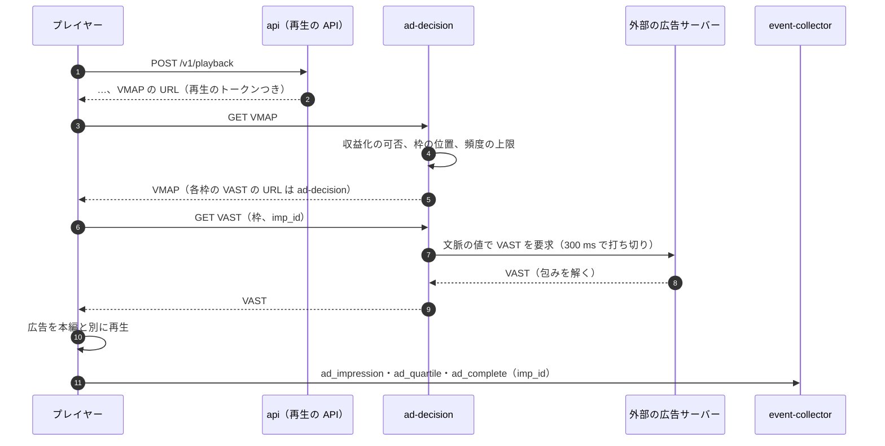
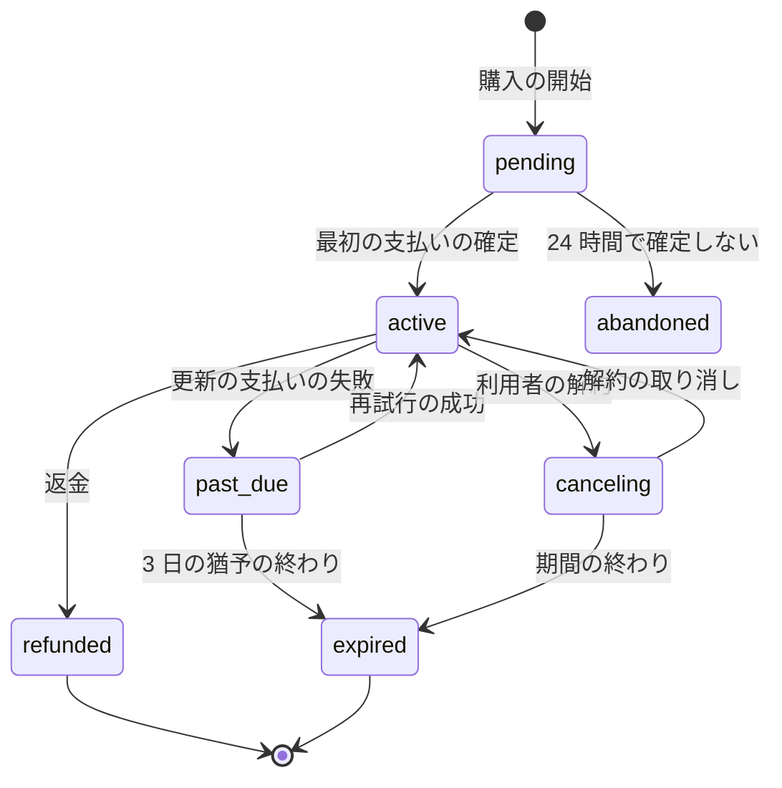
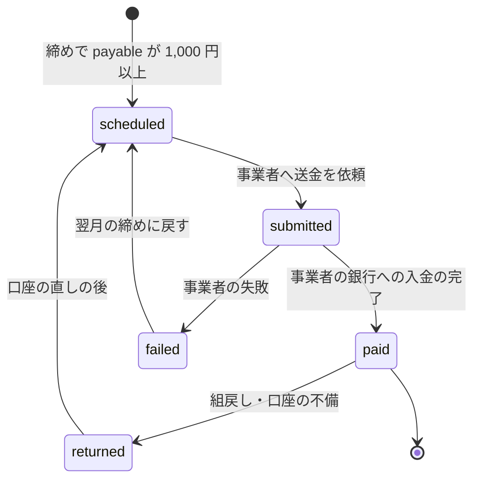

# Monetization and payouts: YouTube

創作者と権利者が収益を得て、支払いを受けるまでを決める。収益化の条件、広告の判断の口と外部の広告サーバー（VAST・VMAP）、広告の表示の計測と無効なトラフィックの除外、チャンネルのメンバーシップとメンバー限定の動画、台帳、収益の分配の計算（例つき）と丸め、月の締めと調整、決済の事業者を通した支払い、源泉徴収とインボイスの枠組み（**法務の確認待ち：L7**）を扱う。

> **法務の確認待ち（L7）**：メンバーシップの代金を本システムが受け取り創作者へ渡す流れの資金決済法の上の位置づけ（収納代行か、資金移動業か）、特定商取引法の表示、消費税とインボイス制度、国外の創作者への源泉徴収、創作者との契約の形は決まっていない（[intent.md](../intent.md)）。この文書は位置づけに依らない設計にするが、確認が済むまで E14 の Story の spec を承認しない。広告の要求に入れる情報は**法務の確認待ち：L5・L6**、タイアップの表示は**法務の確認待ち：L4**。

前提となる決定は次のとおり。

- 収益の分配、収益化の条件は確定の数（1 日の確定）だけを使う（[ADR-0007](../decisions/0007-two-phase-view-counting.md)、[view-counting-and-analytics.md](view-counting-and-analytics.md) の 5.2 節）
- 広告はクライアントの側の挿入。プレイヤーが本システムの判断の口の VMAP を読む。`no_ads` の動画は VMAP を取らない（[ADR-0024](../decisions/0024-client-side-ad-insertion.md)、[playback-and-abr.md](playback-and-abr.md) の 8 節）
- メンバー限定の動画は DRM（[ADR-0004](../decisions/0004-cmaf-packaging-and-drm-scope.md)、[packaging-and-drm.md](packaging-and-drm.md) の 8 節）
- 照合の収益の分け方は 1 秒ごとの重み（[ADR-0047](../decisions/0047-claim-policies-territory-overlap-and-per-second-split.md)、[copyright-claims-and-disputes.md](copyright-claims-and-disputes.md) の 6 節）
- 台帳と支払いの形は Stripe の題材（[ledger.md](../../../stripe/docs/architecture/ledger.md)、[payouts-and-reconciliation.md](../../../stripe/docs/architecture/payouts-and-reconciliation.md)）を参考にする
- 収益の分配の計算は参照の実装との差 0 円、月の締めから明細まで 5 営業日（NFR-015）

この文書で決めたことは次の ADR にある。

| ADR | 決定 |
| --- | --- |
| [0055](../decisions/0055-ad-decision-vmap-and-server-side-ad-request.md) | 広告の判断の口 `ad-decision` が VMAP を作り、各枠の VAST は `ad-decision` が外部の広告サーバーへ代わりに要求して返す（プレイヤーは広告サーバーに直接要求しない）。MVP の要求は文脈だけ（利用者の識別子を送らない）。表示ごとに `imp_id` を付け、広告サーバーの請求の報告と、本システムの有効な表示の両方に入った表示だけを収益にする |
| [0056](../decisions/0056-channel-memberships-via-payment-provider.md) | メンバーシップは決済の事業者の定期の課金で受け、MVP は Web だけで売る。会員の状態は事業者の webhook で進め、`active` と `past_due`（3 日の猶予）の間だけ会員の特典とメンバー限定の動画を `playable()` で許す |
| [0057](../decisions/0057-revenue-ledger-share-calculation-and-rounding.md) | 収益は複式の台帳にマイクロ円の整数で日ごとに積み、創作者の側の取り分を「広告 55%・メンバーシップ 70%（契約の値）」で切り捨てて出し、残りを本システムの収益にする。照合の分け方の端数は最大剰余で配る。円への丸めは月の締めで相手ごとに 1 回だけ切り捨て、端数は翌月へ繰り越す。締めた月は書き換えず、翌月の調整の仕訳で直す |
| [0058](../decisions/0058-payouts-via-provider-and-tax-profile.md) | 支払いは決済の事業者の接続アカウントへの送金で月 1 回（毎月 25 日、1,000 円未満は繰り越し）。冪等の鍵は `payout:{party}:{yyyymm}`。税の情報（居住、インボイスの登録番号、源泉徴収の区分）を持ち、源泉徴収の率と区分は設定の表に置いて法務の確認の後に値を入れる |

## 1. 範囲

- 扱う：
  - 収益化の条件と参加の審査
  - 広告の枠の判断、VMAP・VAST、外部の広告サーバーとの口、表示の計測、無効なトラフィック、広告の収益の取り込み
  - メンバーシップ（段、価格、購入、状態、特典）、メンバー限定の動画の許可
  - 台帳、日ごとの積み上げ、分配の計算、丸め、月の締め、調整
  - 支払い（決済の事業者）、明細、税の情報、源泉徴収とインボイスの枠組み
- 扱わない：
  - 広告の販売、入札、広告主の画面（intent の Non-goals）
  - 広告の挿入の方式と再生（[playback-and-abr.md](playback-and-abr.md) の 8 節）
  - DRM の鍵とライセンス（[packaging-and-drm.md](packaging-and-drm.md) の 8 節）
  - 有料のチャット、レンタル（MVP の後）
  - 照合の方針と申し立ての状態（[copyright-claims-and-disputes.md](copyright-claims-and-disputes.md)）

## 2. 要件と本家の形

### 2.1 要件

| 要件 | 目標 | NFR・根拠 |
| --- | --- | --- |
| 分配の正しさ | 参照の実装との差 0 円（台帳の単位） | NFR-015 |
| 明細 | 月の締めから 5 営業日 | NFR-015 |
| 数の元 | 1 日の確定だけ。仮の数を使わない | [ADR-0007](../decisions/0007-two-phase-view-counting.md) |
| 広告の要求 | VAST の取得 p95 300 ms。超えたら枠を空にする（本編の開始を待たせない） | NFR-003 |
| 台帳 | 借方と貸方の和が常に一致。二重の計上と二重の支払いがない | — |
| 会員の効き | 支払いの確定から 60 秒でメンバー限定の動画が見られる。解約・猶予の終わりから 60 秒で見られなくなる | NFR-014 と同じ写しの経路 |

### 2.2 本家の形（確かめたこと）

| 項目 | 本家 | 出典 |
| --- | --- | --- |
| 収益化の条件（長い動画の道） | 登録者 1,000 と直近 12 か月の公開の動画の有効な視聴時間 4,000 時間。Shorts の視聴時間は数えない | [YouTube Partner Program overview & eligibility](https://support.google.com/youtube/answer/72851) |
| 広告の収益の分配 | 公開の動画の視聴の画面の広告の純収益の 55% を創作者へ | [YouTube Partner Program: Revenue shares](https://support.google.com/youtube/answer/72902) |
| メンバーシップの分配 | 商取引の部分（メンバーシップ、Super Chat など）の純収益の 70% を創作者へ | 同上 |
| 純収益の定義、価格の段、支払いの日、支払いの下限 | 公式の資料で確かめられなかった（**未検証**） | — |

いずれも 2026-10-10 に確認。[architecture/README.md](README.md) の 1.4 節と [intent.md](../intent.md) は分配の率を「未検証」としていたが、上の出典で 55%・70% を確かめ、統合の工程で両方を直した。本システムは分配の率を契約の値として持ち、既定を本家と同じ 55%・70% にする。

## 3. 収益化の条件

- 条件（既定、本家と同じ）：確かめの後の登録者 1,000（[channels-subscriptions-and-notifications.md](channels-subscriptions-and-notifications.md) の 4.2 節）と、直近 12 か月の公開の動画の 1 日の確定の総再生時間 4,000 時間（[view-counting-and-analytics.md](view-counting-and-analytics.md) の 6.2 節）。
- 毎日 JST 8:00（1 日の確定の後）に、全チャンネルの条件を計算し、`monetization_status` を `ineligible`・`eligible` にする。
- `eligible` のチャンネルは、上級の機能の段（[accounts-and-safety.md](accounts-and-safety.md) の 7 節）にあり、有効な strike で申し込みが止まっていなければ（同じ文書の 9.2 節）申し込める。申し込むと、運営の審査（規約、タイアップの表示、照合の申し立ての状況）を経て `active` になる。審査の基準のうちタイアップは**法務の確認待ち：L4**。
- `active` を外す：規約の違反の措置、アカウントの状態（[accounts-and-safety.md](accounts-and-safety.md) の 9.3 節）、創作者の退出。外しても、それまでの積み上げは支払う（違反の内容による差し止めは**法務の確認待ち：L7**）。
- 収益化していないチャンネルの動画でも、照合の `monetize` の申し立てがあれば広告を出し、権利者の分だけを分配する（創作者の重みの分は本システムの収益にする。7.2 節）。

## 4. 広告（ADR-0055）

### 4.1 流れ



- 収益化の可否：動画が `playable()` で `allow`（`no_ads` でない）、チャンネルが `active` か照合の結果が `monetize`、創作者が動画の広告を無効にしていない。
- 枠：再生の前（1 つ）、途中（8 分以上の動画。創作者の指定かチャプターの境を 4 秒のセグメントの境に丸める。既定は 8 分ごと。[ADR-0024](../decisions/0024-client-side-ad-insertion.md)）、後。
- 頻度の上限：同じ視聴者に、再生の前の広告は 2 本の動画に 1 回、広告の枠は視聴の 8 分に 1 回まで（再生のトークンの `sid` と `viewer_key` で数える。本システムの値）。
- 再生の前の VAST が 300 ms で返らなければ、その枠を空にして本編を始める。開始の時間（[ADR-0023](../decisions/0023-playback-token-and-qoe-metrics.md)）は広告を除いて測る。

### 4.2 VAST の要求の値（**法務の確認待ち：L5・L6**）

| 値 | 中身 | MVP |
| --- | --- | --- |
| 内容の ID | `video_id` を広告サーバーごとの鍵でハッシュした値 | 送る |
| 文脈 | カテゴリ、長さ、言語、チャンネルの ID のハッシュ、年齢の制限の印（[comments-and-moderation.md](comments-and-moderation.md) の 8.1 節）、ライブか | 送る |
| 枠 | `pre`・`mid`・`post`、位置 | 送る |
| 端末 | 端末の種類（電話・テレビ・パソコン） | 送る |
| 場所 | 都道府県 | 送る |
| `imp_id` | 本システムが作った表示の ID（UUIDv7） | 送る |
| 利用者の識別子、広告の ID、IP アドレス、視聴の履歴 | — | 送らない |

- VAST の要求は `ad-decision` が出すので、広告サーバーは視聴者の IP アドレスを要求から受け取らない。ただし、VAST に書かれた素材の取得と第三者の計測の URL への送信は端末から出る（外部送信。[playback-and-abr.md](playback-and-abr.md) の 8.1 節、**法務の確認待ち：L6**）。
- 個人に合わせた広告（利用者の識別子を送る）は MVP で行わない。行うかは**法務の確認待ち：L5・L6**。

### 4.3 表示の計測と無効なトラフィック

- 表示の出来事は `watch-events` に入り、`view-verifier` の 1 日の確定で、B07 と視聴の規則（[view-counting-and-analytics.md](view-counting-and-analytics.md) の 5.1 節）で有効か決める。
- 有効な表示：`ad_impression` があり、広告の再生の 2 秒以上が画面に見え（`vis`）、その視聴が除かれていない。

### 4.4 広告の収益の取り込み

- 広告サーバーは日ごとに、`imp_id` ごとの請求の値（マイクロ円）を報告する。報告は D＋1 に仮、D＋3 に確定（本システムの想定。広告サーバーとの契約で決める）。
- 照合：`imp_id` で、広告サーバーの請求と本システムの有効な表示を突き合わせる。

| 広告サーバー | 本システム | 扱い |
| --- | --- | --- |
| 請求あり | 有効 | 収益にする（動画・日に積む） |
| 請求あり | 無効 | 収益にしない。`ivt_reserve` に入れ、広告サーバーとの精算で返す |
| 請求なし | 有効 | 収益 0（記録だけ） |

- 不一致の割合を毎日見る。有効で請求なしが 2% を超えたら、広告サーバーとの照合を調べる。

## 5. メンバーシップとメンバー限定（ADR-0056）

### 5.1 段と価格

- チャンネルは段を 5 つまで持つ。価格は決まった一覧（月額 90〜12,000 円の税込み）から選ぶ（本システムの値。本家の価格の段は**未検証**）。
- 特典：会員の印（コメントとライブチャット）、メンバー限定の動画、絵文字（MVP の後）。段ごとにどの特典を持つかを創作者が決める。
- 子ども向けのチャンネル・動画ではメンバーシップを売らない（[comments-and-moderation.md](comments-and-moderation.md) の 8.2 節）。

### 5.2 購入と状態

- MVP は Web で売る。アプリの中の購入（アプリの店の決済）は、店の規則と**法務の確認待ち：L7** の後に決める。
- 決済の事業者の定期の課金（顧客、定期の契約、請求）を使う。カードの情報は事業者が持ち、本システムは事業者の ID だけを持つ。



- 状態は事業者の webhook（`invoice.paid`・`invoice.payment_failed`・`customer.subscription.deleted` に当たる出来事）で進める。出来事の ID で冪等にする。webhook が欠けても、1 時間ごとに事業者の状態を読んで突き合わせる。
- 会員の判定：`active`・`past_due`・`canceling` の間、`memberships.valid_until` までを会員とする。`playable()` の写し（Valkey の `mem:{user_id}:{channel_id}`）を outbox から 60 秒以内に更新する。
- メンバー限定の動画：`playable()` が会員に `allow_with: drm` を返し、ライセンスの代理がもう一度会員を確かめる（[packaging-and-drm.md](packaging-and-drm.md) の 8.4 節）。

### 5.3 代金と純収益

- 純収益 = 税込みの代金 − 消費税 − 決済の手数料（本システムの定義。本家の定義は**未検証**）。消費税の扱いは**法務の確認待ち：L7**。
- 返金・チャージバック：起きた日の調整の仕訳にする（7.5 節）。

## 6. 台帳（ADR-0057）

- 複式の台帳。仕訳は追記だけで、1 つの仕訳の借方と貸方の和が一致する（Stripe の題材の [ledger.md](../../../stripe/docs/architecture/ledger.md) と同じ考え方）。
- 単位：積み上げの勘定はマイクロ円（1 円 = 1,000,000）の整数。支払いと明細は円の整数。

| 勘定 | 中身 |
| --- | --- |
| `ad_revenue_clearing` | 広告サーバーの請求（4.4 節） |
| `membership_clearing` | メンバーシップの純収益 |
| `platform_revenue` | 本システムの取り分 |
| `creator_accrued:{channel_id}` | 創作者の積み上げ（マイクロ円） |
| `owner_accrued:{rights_owner_id}` | 権利者の積み上げ |
| `claim_escrow:{claim_id}` | 異議の間の預かり（[copyright-claims-and-disputes.md](copyright-claims-and-disputes.md) の 6.3 節） |
| `ivt_reserve` | 無効な表示の請求 |
| `payable:{party}` | 締めた支払いの額（円） |
| `withholding_payable` | 源泉徴収の預かり（9 節） |
| `payout_in_transit` | 送金の途中 |

## 7. 分配（ADR-0057）

### 7.1 日ごとの積み上げ

- 毎日、広告の確定の報告（D＋3）と 1 日の確定の数が揃った動画・日について、次を 1 つのトランザクションで書く。仕訳の冪等の鍵は `accrual:{video_id}:{date}:{kind}`。
- メンバーシップは、支払いの確定ごとに積む（鍵は事業者の請求の ID）。

### 7.2 創作者の側の取り分

```
R      = その日の動画の広告の収益（マイクロ円）
pool   = floor(R × share_bps / 10,000)      share_bps：広告 5,500、メンバーシップ 7,000（契約の値）
platform = R − pool
pool を 照合の重み（creator、owner:i、escrow:claim）で分け、端数は最大剰余
```

- 照合の申し立てがない動画は、`pool` が全部創作者。
- 収益化していないチャンネルの動画の照合の収益（3 節）は、創作者の重みの分を `platform_revenue` に入れる。
- メンバーシップの `pool` は全部創作者（チャンネルの代金で、動画の照合の分け方を当てない。[copyright-claims-and-disputes.md](copyright-claims-and-disputes.md) の 6.3 節）。

### 7.3 例と丸め

**広告（1 日、1 本の動画）**：`R = 12,345,678,901` マイクロ円（12,345.678901 円）。照合は [copyright-claims-and-disputes.md](copyright-claims-and-disputes.md) の 6.2 節（A 150 秒、B 90 秒、創作者 360 秒、計 600 秒）。

| 段 | 計算 | 値（マイクロ円） |
| --- | --- | --- |
| `pool` | floor(12,345,678,901 × 5,500 / 10,000) = floor(6,790,123,395.55) | 6,790,123,395 |
| `platform` | 12,345,678,901 − 6,790,123,395 | 5,555,555,506 |
| A | 6,790,123,395 × 150 / 600 = 1,697,530,848.75 → 切り捨て 1,697,530,848、剰余 0.75 | 1,697,530,849（最大剰余で ＋1） |
| B | × 90 / 600 = 1,018,518,509.25 → 1,018,518,509、剰余 0.25 | 1,018,518,509 |
| 創作者 | × 360 / 600 = 4,074,074,037 | 4,074,074,037 |
| 和 | A ＋ B ＋ 創作者 ＋ `platform` | 12,345,678,901（`R` と一致） |

- 切り捨ての和 6,790,123,394 と `pool` の差 1 を、剰余の大きい A に配る。剰余が同じなら `party` の ID の順。

**月の締めでの円への丸め**：相手ごとに、その月の積み上げ（前の月の繰り越しを含む）を 1 回だけ円に切り捨てる。

| 相手 | 月の積み上げ（マイクロ円） | 支払い | 繰り越し |
| --- | --- | --- | --- |
| A | 1,697,530,849 | 1,697 円 | 530,849 |
| B | 1,018,518,509 | 1,018 円 | 518,509 |
| 創作者 | 4,074,074,037 | 4,074 円 | 74,037 |

- 繰り越しは相手の積み上げの勘定に残り、翌月の締めに足される。相手の取り分の端数を本システムが取らない。

**メンバーシップ（1 か月、会員 1,000 人、月額 490 円）**：1 件ごとの消費税 floor(490 × 10 / 110) = 44 円、手数料 18 円、純収益 428 円。

| 丸めの時機 | 創作者 |
| --- | --- |
| 1 件ごとに円で切り捨て | floor(428 × 0.7) = 299 円 × 1,000 = 299,000 円 |
| 本システム（マイクロ円で積み、月に 1 回だけ丸める） | 428,000,000 × 7,000 / 10,000 = 299,600,000 マイクロ円 → 299,600 円 |

- 1 件ごとに丸めると、創作者は月に 600 円を失う。丸めを月の 1 回にまとめるのはこのためである。
- 消費税・手数料の 1 件ごとの円の値は、決済の事業者の請求の値をそのまま使う（事業者が円で決める）。

### 7.4 月の締め

| 日 | 作業 |
| --- | --- |
| 月の最後の日の翌日 6:00 | 最後の日の 1 日の確定 |
| 翌月の 3 営業日 | 広告の確定の報告が揃う。全部の積み上げを終える |
| 4 営業日 | 締め：相手ごとに円へ丸め、`payable:{party}` へ移す。月の締めの印 `closed_months` を書く |
| 5 営業日 | 明細を公開（NFR-015） |
| 25 日（休業日なら前の営業日） | 支払い（8 節） |

- 締めの後に、その月の仕訳は書かない。

### 7.5 調整

| 出来事 | 扱い |
| --- | --- |
| 確定の数の作り直し（規則の変更、[view-counting-and-analytics.md](view-counting-and-analytics.md) の 5.5 節） | 締めた月は書き換えない。差の収益を、知った日の負（または正）の積み上げの仕訳にする |
| 広告サーバーの請求の取り消し（無効な表示の後からの判定） | 同上 |
| メンバーシップの返金・チャージバック | 同上 |
| 照合の結末で預かりを移す | 結末の日の仕訳 |

- 相手の月の積み上げが負になったら、翌月以降の積み上げから差し引く。銀行の口座から取り戻さない。負のまま 6 か月を超えたら運用の担当が見る。

## 8. 支払い（ADR-0058）

### 8.1 接続アカウント

- 創作者と権利者は、決済の事業者の接続アカウント（本人の確かめと銀行の口座は事業者が持つ）を作る。本システムは `payout_accounts` に事業者のアカウントの ID と状態だけを持つ。
- 事業者の本人の確かめが済み、税の情報（9 節）が揃うまで、支払いを止めて積み上げを残す。

### 8.2 流れ



- 1,000 円未満は送らず、翌月へ繰り越す（本システムの値。本家の支払いの下限は**未検証**）。
- 送金の冪等の鍵：`payout:{party}:{yyyymm}`。同じ鍵で何度呼んでも 1 回だけ送る。
- 仕訳：`payable:{party}` → `withholding_payable`（源泉徴収）と `payout_in_transit`（純額）→ 入金の完了で `payout_in_transit` を消す。失敗・組戻しは逆の仕訳で `payable` に戻す。
- 照合：毎日、本システムの台帳、事業者の送金の記録、事業者の入金の記録を突き合わせる（Stripe の題材の 3 つの照合の形。[payouts-and-reconciliation.md](../../../stripe/docs/architecture/payouts-and-reconciliation.md)）。合わないものは仮の勘定に入れて運用の担当が見る。

### 8.3 明細

- 月ごと・相手ごと：動画ごとの広告の収益、照合の分け方、メンバーシップ、調整、繰り越し、源泉徴収、支払いの額。PDF と CSV。明細の書式（支払通知書・仕入明細書としての扱い）は**法務の確認待ち：L7**。

## 9. 税とインボイス（**法務の確認待ち：L7**）

この節は枠組みだけを決める。率と区分と書式は法務の確認の後に設定に入れる。

- `tax_profiles`：相手ごとに、個人か法人か、居住者か非居住者か、国、適格請求書発行事業者の登録番号（`T` と 13 桁。国税庁の公表のサイトで形と有効を確かめる）、源泉徴収の区分、租税条約の届出の有無。
- `withholding_rules`（設定の表）：区分ごとの率（ベーシスポイント）、適用の条件、有効の期間。支払いの時に、`payable` の額に率を掛けて円未満を切り捨てる。
- 創作者への分配が消費税の課税の対象か、インボイス制度の下でどの書類を誰が出すか、国外の創作者・権利者への源泉徴収の要否と率は**法務の確認待ち：L7**。決まるまで、`withholding_rules` は空（率 0）で、国外の相手への支払いを止める。
- 源泉徴収した額の納付と、支払調書などの法定の書類の作成は、会計の側の手続きとして `withholding_payable` の集計を渡す。

## 10. 失敗と回復

| 失敗 | 起きること | 回復 |
| --- | --- | --- |
| 広告サーバーの遅れ・障害 | VAST が返らない | 300 ms で枠を空にする。本編は止めない |
| 広告の報告の遅れ | 積み上げが遅れる | 締めを最大 2 営業日延ばす。それでも揃わない分は翌月の調整にする |
| webhook の欠け・順の入れ替え | 会員の状態が古い | 出来事の ID で冪等。1 時間ごとに事業者の状態と突き合わせる |
| 積み上げの作業の二重の実行 | 二重の計上 | 仕訳の冪等の鍵で 2 回目を書かない |
| 送金の依頼の後の応答の欠け | 送ったか分からない | 同じ冪等の鍵で問い合わせ直す。二重に送らない |
| 台帳の不一致（借方と貸方） | 締めができない | 締めを止め、SEV2 で運用の担当が見る |
| 事業者の障害 | 支払いが遅れる | 支払いの日を延ばし、創作者に知らせる |

## 11. 上限

| 対象 | 値 |
| --- | --- |
| メンバーシップの段 | チャンネルに 5 |
| 会員の価格 | 月額 90〜12,000 円（一覧から） |
| 支払いの下限 | 1,000 円（下回れば繰り越し） |
| 広告の枠 | 再生の前 1、途中は 8 分ごと、後 1 |
| VAST の取得 | 300 ms |
| 負の積み上げの見張り | 6 か月 |

## 12. data-model への項目

| 表・置き場 | 中身 | 主キー・索引 | 節 |
| --- | --- | --- | --- |
| `monetization_status`（チャンネルの表） | `channel_id`、`state`（`ineligible`・`eligible`・`reviewing`・`active`・`suspended`）、`share_bps_ads`、`share_bps_commerce`、`contract_version`、`updated_at` | `(channel_id)` | 3 |
| `eligibility_daily` | `channel_id`、`date`、`subscribers_verified`、`public_watch_hours_12m` | `(channel_id, date)` | 3 |
| `ad_impressions` | `imp_id`、`video_id`、`sid`、`break`、`requested_at`、`valid`、`billed_micro_jpy` | `(imp_id)`。`(video_id, date)` | 4 |
| `ad_server_reports` | `report_date`、`imp_id`、`billed_micro_jpy`、`final` | `(report_date, imp_id)` | 4.4 |
| `membership_tiers`（チャンネルの表） | `tier_id`、`channel_id`、`price_jpy`、`perks` | `(tier_id)` | 5.1 |
| `memberships`（本人の表とチャンネルの表の写し） | `membership_id`、`user_id`、`channel_id`、`tier_id`、`state`、`valid_until`、`provider_subscription_id` | `(membership_id)`。一意 `(user_id, channel_id)` | 5.2 |
| `provider_events` | 事業者の出来事の ID、種類、受けた時刻、処理の結果 | `(provider_event_id)` | 5.2 |
| `ledger_entries`・`ledger_lines`（追記だけ） | 仕訳の ID、冪等の鍵、日付、行（勘定、借方・貸方、マイクロ円） | `(entry_id)`。一意 `(idempotency_key)` | 6、7 |
| `closed_months` | `yyyymm`、`closed_at`、`closed_by` | `(yyyymm)` | 7.4 |
| `payout_accounts` | `party`、`provider_account_id`、`state` | `(party)` | 8.1 |
| `payouts` | `payout_id`、`party`、`yyyymm`、`gross_jpy`、`withholding_jpy`、`net_jpy`、`state`、`provider_transfer_id` | `(payout_id)`。一意 `(party, yyyymm)` | 8.2 |
| `statements` | `party`、`yyyymm`、S3 のキー、`published_at` | `(party, yyyymm)` | 8.3 |
| `tax_profiles`（本人・チャンネル・権利者の表） | 9 節（登録番号と住所は暗号化） | `(party)` | 9 |
| `withholding_rules`（設定の表） | 区分、率、条件、有効の期間 | `(category, valid_from)` | 9 |
| Valkey | `mem:{user_id}:{channel_id}`（会員の写し）、`adcap:{viewer_key}`（頻度の上限） | — | 4.1、5.2 |
| outbox | `membership_changed`、`payout_state_changed`、`month_closed` | — | 5、7、8 |

## 13. テストと性質

| ID | 性質・試験 |
| --- | --- |
| PROP-REV-001 | 任意の `R`（0〜10^15 マイクロ円）と任意の照合の重みで、`platform ＋ Σ 相手の分 = R`（マイクロ円まで一致）。どの相手の分も負にならない |
| PROP-REV-002 | 最大剰余：各相手の分は、正確な値の切り捨て以上、切り捨て ＋ 1 以下。剰余が同じときは ID の順で決まる（決定的） |
| PROP-REV-003 | 月の丸め：任意の月の積み上げの列で、`支払い（円）× 10^6 ＋ 繰り越し = 積み上げ`、繰り越しは 0 以上 10^6 未満。丸めは相手・月ごとに 1 回だけ |
| PROP-REV-004 | 任意の仕訳の列で、全部の勘定の借方と貸方の和が一致する。冪等の鍵の同じ仕訳を何度書いても残高が同じ |
| PROP-REV-005 | 任意の送金の依頼・応答の欠け・やり直しの列で、`(party, yyyymm)` の送金は最大 1 回 |
| PROP-REV-006 | 締めた月の仕訳は増えない。調整は締めの後の日付の仕訳だけ |
| PROP-MEM-001 | 任意の webhook の順序・重複・欠けと 1 時間の突き合わせで、会員の状態は事業者の状態に収束し、`expired` の後にメンバー限定の動画のライセンスが出ない |
| DT-REV-001 | 分配の決定表：収益化の状態 × 照合の結果（なし・収益化・預かり）× 収入の種類（広告・メンバーシップ） |
| DT-ADS-001 | 広告の可否：`playable()` の結果 × 収益化の状態 × 照合 × 創作者の設定 × 動画の長さ（途中の枠） |
| 参照の実装 | 分配の計算を、別の言語で書いた参照の実装（任意の精度の整数）と、生成した 1 万の月の場面で比べ、差 0 円（NFR-015）。7.3 節の例を試験のベクトルにする |
| 結合 | 決済の事業者の試験の環境で、購入・更新の失敗・猶予・解約・返金の webhook |

## 14. Story の候補

| Epic | Story | 中身 |
| --- | --- | --- |
| E14 | `monetization-eligibility` | 3 節 |
| E14 | `ad-slots-and-vast` | 4 節（ADR-0055、DT-ADS-001）。要求の値は**法務の確認待ち：L5・L6** |
| E14 | `memberships` | 5 節（ADR-0056、PROP-MEM-001）。**法務の確認待ち：L7** |
| E14 | `members-only-drm` | 5.2 節と [packaging-and-drm.md](packaging-and-drm.md) の 8 節 |
| E14 | `revenue-ledger` | 6・7 節（ADR-0057、PROP-REV-001〜004・006、DT-REV-001、参照の実装） |
| E14 | `creator-payouts` | 8・9 節（ADR-0058、PROP-REV-005）。**法務の確認待ち：L7** |

## 15. 未解決の問い

### 決定（2026-10-10、既定案）

- **広告の要求**：`ad-decision` が代わりに要求、文脈だけ、`imp_id` の突き合わせ（ADR-0055）。
- **メンバーシップ**：決済の事業者の定期の課金、Web だけ、3 日の猶予（ADR-0056）。
- **分配**：広告 55%・メンバーシップ 70%（本家と同じ既定、契約の値）、マイクロ円の積み上げ、最大剰余、月 1 回の切り捨てと繰り越し（ADR-0057）。
- **支払い**：決済の事業者の接続アカウント、毎月 25 日、1,000 円の下限（ADR-0058）。

### 持ち越し

| 問い | いつ・どう決めるか |
| --- | --- |
| メンバーシップの代金の流れの資金決済法の上の位置づけ、特定商取引法の表示 | **法務の確認待ち：L7** |
| 消費税・インボイスの書類、源泉徴収の要否と率、国外の相手 | **法務の確認待ち：L7** |
| 個人に合わせた広告、広告の要求の値、第三者の計測の外部送信 | **法務の確認待ち：L5・L6** |
| タイアップの審査の基準 | **法務の確認待ち：L4** |
| アプリの中のメンバーシップの購入 | 店の規則と**法務の確認待ち：L7** |
| 外部の広告サーバーと決済の事業者の選定、報告の時機 | E14 の前の選定 |
| 有料のチャット、レンタル | MVP の後（intent） |

## 出典

いずれも 2026-10-10 に確認。

- YouTube Help, [YouTube Partner Program overview & eligibility](https://support.google.com/youtube/answer/72851)
- YouTube Help, [YouTube Partner Program: Revenue shares](https://support.google.com/youtube/answer/72902)
- IAB Tech Lab, VAST・VMAP（公開の標準。バージョンの細部は**未検証**。E14 の選定で広告サーバーが対応するバージョンを確かめる）
