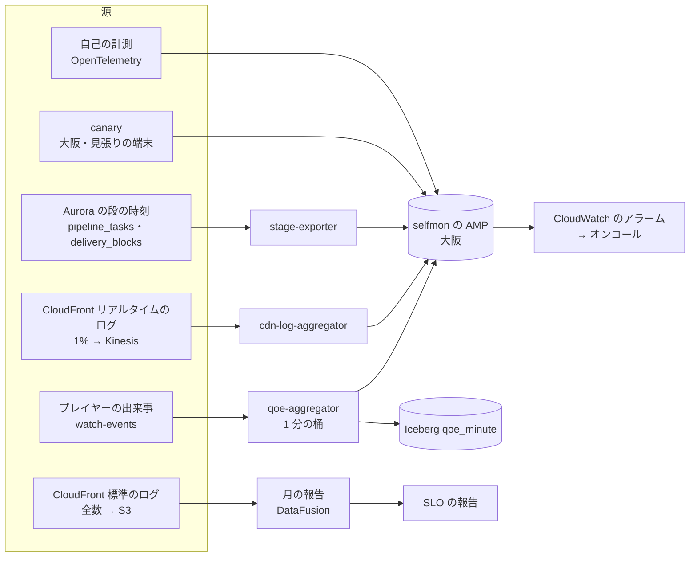

# Observability: YouTube

SLI の計測の源と計算（アップロードから再生できるまで、再生の開始、再バッファ、ライブの遅延、視聴回数の遅れ、措置の停止、配信の可用性ほか）、端末の QoE の出来事とその限度（**法務の確認待ち：L6**）、CDN のログ、パイプラインの段の時刻、見張り（`canary`）、自己監視の経路、ログとトレース、ダッシュボードとアラートを決める。SLO の値とアラートの一覧の正本は [runbooks/](../runbooks/README.md) で、この文書は計測の実装を書く。

この文書で決めたことは次の ADR にある。

| ADR | 決定 |
| --- | --- |
| [0067](../decisions/0067-sli-sources-and-computation.md) | SLI は 4 つの源から作る：端末の QoE の出来事（`watch-events` を `qoe-aggregator` が 1 分ごとにまとめる）、CDN のログ（警報はリアルタイムのログの 1% の抜き取り、月の報告と突き合わせは標準のログの全数）、パイプラインと措置の段の時刻（Aurora の行）、見張り（`canary`）。SLO の判定に使う値と、警報に使う値を分け、警報は速い源、報告は全数の源にする |
| [0068](../decisions/0068-qoe-privacy-limits-cdn-logs-and-selfmon.md) | QoE の出来事は本システムの受け口にだけ送り、題・URL・IP・端末の固有の識別子を入れず、切り口は決めた種類の値だけにする。CDN のリアルタイムのログは IP・cookie・見出しの欄を選ばず、パスのトークンを消費者で落とす。標準のログは 7 日で IP を落とす。自己監視は大阪の `selfmon` のアカウントに置き、東京の本番に依存しない |

前提：QoE の指標の定義（[ADR-0023](../decisions/0023-playback-token-and-qoe-metrics.md)、[playback-and-abr.md](playback-and-abr.md) の 7 節）、出来事の封筒（[ADR-0034](../decisions/0034-watch-event-envelope-and-ingest.md)）、措置の段の時刻（[ADR-0027](../decisions/0027-takedown-deny-list-within-60s.md) の `delivery_blocks`）、パイプラインの段の時刻（[transcoding-pipeline.md](transcoding-pipeline.md) の `pipeline_tasks.stage_times`）、アカウントの構成（[infrastructure.md](infrastructure.md) の 2 節）。

## 1. 範囲と要件

| 要件 | 目標 |
| --- | --- |
| 警報の速さ | 配信・再生の API・QoE の悪化を 5 分以内に検出する |
| 見えなくならない | 本番（東京）の障害の間も、SLI と警報が動く。CDN のログが遅れても、QoE の出来事が別の経路で見える（[runbooks](../runbooks/README.md) の 5 節） |
| 利用者のデータを出さない | 指標・ログ・トレースに、題・本文・検索の語・IP・ストリームキーが入らない（AGENTS.md） |
| 報告 | 月の SLI の報告を全数の源で作り、警報の源との差を記録する |

## 2. SLI の源と計算

ADR-0067。[runbooks](../runbooks/README.md) の 1 節の SLI ごとに、源と計算と警報の源を決める。

| SLI（runbooks） | SLO の判定の源 | 計算 | 警報の源 |
| --- | --- | --- | --- |
| 配信の可用性 | 標準のログ（全数） | 5xx・時間切れでない ÷ セグメントの要求。403（措置・署名の期限切れ・地域・`t:`）を除く | リアルタイムのログの 1%（5 分の窓）と CloudFront の `5xxErrorRate` |
| 再生の API の可用性 | ALB のログ（全数） | 5xx・時間切れでない ÷ `POST /v1/playback` | ALB の指標（1 分） |
| 再生の開始 | QoE（`play_intent` → `first_frame`） | p50・p95、日本、端末の種類ごと。広告の時間を除く（ADR-0023） | 同じ（1 分の桶、15 分の窓） |
| 開始の失敗 | QoE | `start_failure` ÷ `play_intent`（開始の前の離脱を除く） | 同じ（10 分の窓） |
| 再バッファ | QoE | Σ 止まった時間 ÷（Σ 再生 ＋ Σ 止まった時間） | 同じ。ISP・CDN ごと |
| キャッシュの外れ | `origin-cache` の受けたバイト ÷ CloudFront の `BytesDownloaded` | — | 同じ（1 分） |
| アップロードの可用性 | ALB のログ | 部分の確定・完了の要求の 5xx でない割合 | ALB の指標 |
| 再生できるまで | `pipeline_runs`（`created_at` → `gated_at`） | 2.1 節 | `stage-exporter`（1 分） |
| 照合の待ち | `pipeline_tasks`（完了 → `match` の確定） | 1 時間以下の動画の p95、「照合待ち」の最古の年齢 | 同じ |
| ライブの取り込みの可用性 | `live_streams` と `live-ingest` の指標 | 配信の分のうち、取り込みの側の原因で止まらなかった分 | `live-ingest` の切断の理由のコード |
| ライブの遅延 | `canary` の見張りの配信（時刻の焼き込み） | 撮影 → 画面（2.3 節） | 同じ ＋ 実ユーザーの推定（2.3 節） |
| 仮の視聴回数の遅れ | `canary` の見張りの再生 | `play_start` → 公開の数の増え（2.4 節） | `view-validator` の消費の遅れ（時間） |
| 確定の数の遅れ | `view_counts_hourly`・`daily` の `computed_at` | 時間の区切り → 確定 | 同じ |
| 措置の停止 | `canary` の見張りの措置（毎日）と、本番の措置の `delivery_blocks` | 決定 → エッジの 403（2.5 節） | 同じ |
| 漏れの監査 | 抜き取りの監査の作業 | 不一致の件数 | 同じ |
| ストレージの突き合わせ | S3 Inventory とカタログ | 元のファイルのない動画の数 | 同じ（毎週） |
| チャットの遅れ | `canary` の見張りのチャット | 送信 → 受信 | 同じ ＋ `chat-sequencer` の消費の遅れ |

- 社内の見張り（`canary` の再生・アップロード）は、SLO の計算の母数から除き、別に見る（[runbooks](../runbooks/README.md) の 1 節）。`canary` の出来事は再生のトークンの `u` の印（見張りのアカウント）で分ける。

### 2.1 アップロードから再生できるまで

- [runbooks](../runbooks/README.md) の 1 節の SLI は「10 分の 1080p 相当に正規化した」値である。正規化を式で行わず、**動画の帯で選ぶ**：長さ 8〜12 分、元の解像度 720p 以上の動画の `gated_at − completed_at` の p95 を SLI とする。理由は、段の時間が長さに比例しない（照合と並びの待ちが支配的。[transcoding-pipeline.md](transcoding-pipeline.md) の 11 節）ためで、式の正規化は誤りを含む。
- 1 時間の帯（50〜70 分）の p95 を別に出す（NFR-002 の 1 時間の目標 p95 10 分）。
- 全段まで（`full_package` の確定）も同じ帯で出す（p95 10 分・40 分）。
- この選び方は runbooks の SLI の定義の具体化で、値は変えない。定義の変更に当たるかは QA と合意する（[runbooks](../runbooks/README.md) の 1 節の注）。

### 2.2 QoE の集計

- `qoe-aggregator`（Rust、Fargate）は `watch-events` を別の消費者のグループで読み、セッション（`sid`）ごとに開始・失敗・再バッファ・再生の時間を組み、1 分の桶にまとめる。
- 切り口（ADR-0068 の限度の中）：

| 切り口 | 値の数 | 中身 |
| --- | --- | --- |
| `device_class` | 8 | Web・Android・iOS・テレビ × 電話・大きな画面 |
| `player_version` | 直近 5 ＋ `other` | プレイヤーのリリースの判定に使う（[delivery.md](delivery.md) の 4 節） |
| `cdn` | 3 | S2 の振り分けに使う |
| `asn` | 上位 30 ＋ `other` | ISP ごとの悪化 |
| `pref` | 47 ＋ `unknown` | 都道府県（`event-collector` が足す） |
| `mode` | 3 | VOD・低遅延・通常のライブ |
| `codec` | 2 | H.264・AV1 |

- AMP には `device_class` × `cdn` × `asn` × `mode` の組（約 8 × 3 × 31 × 3 ≈ 2,200 系列 × 指標 6）だけを送る。`pref`・`player_version`・`codec` との組は Iceberg の `qoe_minute` に書き、ダッシュボードの調べで使う。
- セッションが組み上がるのを待つので、開始の時間は `first_frame` の受け取りから 1 分以内に桶に入る。再バッファの割合は心拍ごと（最大 30 秒の遅れ）。

### 2.3 ライブの遅延

- **見張りの配信**（SLO）：`canary` の配信のソフトが映像に時刻の QR を焼き込み、音声に時刻の合図を入れる（[quality.md](../quality.md) の 2.2.1 節 E）。見張りの端末（6 節）が画面を読み、撮影の時刻と比べる。低遅延と通常のモードの 2 本を 24 時間流す。
- **実ユーザーの推定**（警報と調べ）：プレイヤーは心拍に `lat_ms`（今の時刻 − 再生の位置の `EXT-X-PROGRAM-DATE-TIME`）を足す。端末の時計のずれを除くため、再生の API の応答の時刻で端末の時計を補正する。
- **必要な前提**：ライブのプレイリストに `EXT-X-PROGRAM-DATE-TIME`（入力の時刻から）を入れること。[live-streaming.md](live-streaming.md) の 6.3 節の例にはないので、live-streaming の担当に足すことを提案する（14 節）。
- 撮影から取り込みまで（配信者の側）は実ユーザーの推定に入らない（プログラムの時刻は取り込みの時刻）。見張りの配信とは差がある。

### 2.4 視聴回数の遅れ

- `canary` が見張りの動画（非公開ではなく限定公開、見張りのチャンネル）を 1 分ごとに再生し、公開の数の API を 5 秒ごとに読んで、増えるまでの時間を測る。
- 見張りの再生は `view-rules` の「同じ組の 24 時間 4 回」に当たるので、見張りの端末の識別子を回す（`canary` の印は `view-rules` の正しさの判定から除く。数には入れて遅れを測り、確定の段で見張りの印で除く）。この扱いは view-counting の担当と合意する（14 節）。

### 2.5 措置の停止

- `delivery_blocks` の各段の時刻（`decided_at`、`kvs_put_at`、`replica_at`、`origin_at`、`invalidated_at`。[cdn-and-delivery.md](cdn-and-delivery.md) の 16 節）から、決定 → 各段の時間を出す。本番のすべての措置の p99。
- **エッジの 403 の確かめ**：段の時刻は「置いた」時刻で、エッジに効いた時刻ではない。`canary` は毎日の見張りの措置で、見張りの動画のトークンつきの URL を、6 つの見張りの端末と東京・大阪の EC2 から 5 秒ごとに取り、全部が 403 になった時刻を記録する（[quality.md](../quality.md) の 2.2.1 節 I）。これが SLO の値（60 秒以内）。
- 1 回でも 120 秒を超えたら呼び出し（[runbooks](../runbooks/README.md) の 1 節）。

## 3. CDN のログ

ADR-0067、ADR-0068。

### 3.1 2 つのログ

| ログ | 中身 | 送り先 | 使い道 |
| --- | --- | --- | --- |
| リアルタイムのログ | 抜き取り 1%（`vod`）、0.1%（`live`）。欄は 3.2 節 | Kinesis Data Streams（CloudFront のリアルタイムのログの送り先はこれだけ。[Use real-time access logs](https://docs.aws.amazon.com/AmazonCloudFront/latest/DeveloperGuide/real-time-logs.html)、2026-10-10 に確認） | 警報（5xx、結果の種類、最初のバイトまでの時間）、トークンの悪用の検出（[security.md](security.md) の 3.3 節） |
| 標準のログ | 全数 | log-archive の S3 | 月の SLI の報告、請求との突き合わせ、事後の調べ |

- リアルタイムのログは届きがベストエフォートで、欠けることがある（同じ出典）。SLO の判定には使わない。
- 量：`vod` の平常のピーク 9 万件/秒 × 1% ＝ 900 件/秒、`live` の 120 万件/秒 × 0.1% ＝ 1,200 件/秒。1 件 約 500 バイト。Kinesis の 1 シャードは 1 秒 1,000 件・1 MB まで（同じ出典）なので、平常 2 シャード、大きな催しで 4 シャード。費用はログ 100 万行 0.01 USD（`AmazonCloudFront` の価格表）と Kinesis。
- Kinesis は [ADR-0001](../decisions/0001-platform-and-stack.md) で出来事の流れに選ばなかったが、CloudFront のリアルタイムのログの送り先が Kinesis だけなので、この用途に限って使う。
- 標準のログの届きの遅れの値は**未検証**。遅れを `cdn-log-delay` の指標で見る（[runbooks](../runbooks/README.md) の 5 節）。

### 3.2 リアルタイムのログの欄

| 選ぶ欄 | 選ばない欄 |
| --- | --- |
| `timestamp`、`sc-status`、`sc-bytes`、`time-to-first-byte`、`time-taken`、`x-edge-location`、`x-edge-result-type`、`x-edge-detailed-result-type`、`cs-uri-stem`、`asn`、`c-country`、`cs-protocol-version`、`origin-fbl`、`origin-lbl`、`sr-reason` | `c-ip`、`x-forwarded-for`、`cs-cookie`、`cs-headers`、`cs-user-agent`、`cs-referer`、`cs-uri-query`、CMCD の欄（MVP） |

- 欄の一覧は同じ出典。`cs-uri-stem` はパスの頭のエッジのトークン（`/t/{kid}.{exp}.{caps}.{rg}.{sig}/`）を含む。`cdn-log-aggregator` は読んだ直後にトークンを `sig` の先頭 16 文字（悪用の検出の鍵）と `kid` だけにし、残りを捨てる。Kinesis の保持は 24 時間。
- CMCD（プレイヤーが CDN に送る再生の情報）の欄は、プレイヤーが CMCD を送らないので MVP で使わない。S2 の複数の CDN の比べで使うかを決める。

### 3.3 標準のログ

- 全数を log-archive の S3 へ。7 日の後に、IP の欄を落とした形に書き換え、元を消す（[security.md](security.md) の 6.1 節）。書き換えの後は 13 か月持つ。
- 月の SLI の報告（配信の可用性、キャッシュの外れ）と、CDN の請求の量との突き合わせ（転送の量の差 1% 以内）に使う。

## 4. 指標と自己の計測

- 本番のサービスの自己の計測は OpenTelemetry（ADOT）で、大阪の `selfmon` の AMP へ送る（ADR-0068）。
- 部品ごとの主な指標：

| 部品 | 指標 |
| --- | --- |
| `pipeline-orchestrator`・作業者 | 段ごとの待ち行列の長さと最古の年齢、作業の時間、やり直し、Spot の中断、貸し出しの切れ |
| `origin-cache` | ヒットの率（要求・バイト）、要求の合流の割合、S3 の GET の数と 503、応答の p95 |
| `live-origin` | 保留の要求の数、保留の時間、503・400、配信の数 |
| `live-ingest`・`live-transcoder` | 配信の数、切断の理由、予備への切り替え、入力のビットレート、GPU の使用 |
| `match-engine` | 照合の時間、索引の大きさ、照合待ちの数 |
| `event-collector`・`view-validator` | 受けた・捨てた（理由ごと）、消費の遅れ（時間）、仮と確定の差 |
| `license-proxy` | ライセンスの成功・失敗（理由）、p95 |
| `delivery-blocker` | 段ごとの時間、やり直し、KeyValueStore の置き場の使用 |
| CloudFront | `Requests`、`BytesDownloaded`、`5xxErrorRate`、ディストリビューションの上限の使用の割合（[infrastructure.md](infrastructure.md) の 3.3 節） |
| 費用 | 項目ごとの日の原価（[capacity.md](capacity.md) の 6 節、`cost-metering`） |

- 指標の名前と次元の数の予算：サービスあたり 5,000 系列。動画の ID・チャンネルの ID・利用者の ID を次元にしない（急な人気の動画の調べは Iceberg とログの ID で行う）。

## 5. ログとトレース

- ログは JSON の 1 行。入れてよいのは ID（`video_id`、`channel_id`、`run_id`、`stream_id`、`sid`）と数と理由のコード（AGENTS.md）。
- CI の lint：ログの関数に任意の文字列の欄を渡す型を禁止し、決めた欄の型だけを受ける。
- 本番のログの抜き取りの走査：1 時間ごとに 1% を、電話番号・メールアドレス・IPv4・IPv6・ストリームキーの接頭辞（`<brand>_sk_`）の形で走査し、当たれば Security と Ops にチケット。
- ログの保持：サービスのログ 30 日、監査は [security.md](security.md) の 5 節。
- トレース：管理の面の要求は 1% の抜き取りと、エラー・遅い要求の全数（末尾の抜き取り）。パイプラインは `run_id` ごとに 1 つのトレースにまとめ、段を span にする（10 分の動画で区切り 30 × 段 5 ＝ 約 150 span）。

## 6. 見張り（`canary`）と自己監視

ADR-0068。

| 見張り | 場所 | 頻度 | 測るもの |
| --- | --- | --- | --- |
| 見張りの動画の再生 | 東京・大阪の EC2、見張りの端末 6 拠点 | 1 分 | 開始の時間、セグメントの成功、再バッファ |
| 見張りのアップロード | 東京の EC2 | 15 分 | アップロードから再生できるまで（10 分の生成した動画） |
| 見張りのライブ | 配信は東京の EC2、受けるのは見張りの端末 | 24 時間 | 撮影 → 画面（2.3 節） |
| 見張りの措置 | `canary` と全拠点 | 毎日 | 決定 → エッジの 403（2.5 節） |
| 見張りのチャット | 東京・大阪 | 1 分 | 送信 → 受信 |
| 見張りの視聴回数 | 東京 | 1 分 | 2.4 節 |
| DR | 大阪 | 週次（staging） | オリジングループの切り替え（[infrastructure.md](infrastructure.md) の 7.4 節） |

- **見張りの端末**：家庭の固定回線の主な ISP 3 つと、携帯の回線の主な事業者 3 つに、小さな端末（ブラウザーのプレイヤーと時刻の読み取り）を置く。AWS の中からの見張りは ISP の経路を代表しないため（[runbooks](../runbooks/README.md) の 1 節の「ISP の代表」）。端末は利用者の識別子を持たず、見張りのアカウントだけを使う。
- **自己監視は大阪**：AMP、CloudWatch、Grafana、`canary` の制御を `selfmon` のアカウントの大阪に置く。東京のリージョンの障害の間も警報が動く。東京の本番からは自己の計測だけが入る（利用者のデータなし）。
- **デッドマンスイッチ**：各見張りと `qoe-aggregator`・`cdn-log-aggregator`・`stage-exporter` は 1 分ごとに心拍を送り、5 分来なければ CloudWatch のアラームで呼ぶ。

## 7. 端末の QoE の出来事の限度（**法務の確認待ち：L6**）

ADR-0068。プレイヤーの出来事は [playback-and-abr.md](playback-and-abr.md) の 7 節と [view-counting-and-analytics.md](view-counting-and-analytics.md) の 4.1 節で決まる。この節は計測としての限度を決める。

| 限度 | 中身 |
| --- | --- |
| 送り先 | 本システムの `event-collector`（`app` のディストリビューション）だけ。第三者の解析のタグを置かない（[playback-and-abr.md](playback-and-abr.md) の 8.1 節） |
| 入れない項目 | 題・説明・URL の全体（参照元の URL を含む）・検索の語・IP アドレス・広告の識別子・端末の固有の識別子（OS の広告 ID など） |
| 入れてよい項目 | 再生のトークン（端末の識別子のハッシュを含む。[ADR-0023](../decisions/0023-playback-token-and-qoe-metrics.md)）、2.2 節の切り口の値、QoE の数 |
| 端末の識別子 | ハッシュで、塩を 30 日で回す（[view-counting-and-analytics.md](view-counting-and-analytics.md) の 8 節）。QoE の集計（`qoe_minute`）には入れない |
| 送る間隔 | 心拍（最初の 1 分 10 秒、その後 30 秒）。QoE のための追加の送信を作らない |
| 停止 | 利用者が計測の送信を止める設定を持つかは L6・L5 の結論で決める。止めても再生は止めない |
| 外部送信の公表 | 通知・公表の文言は**法務の確認待ち：L6** |

- QoE の集計の値は、端末・ISP・地域の単位の数で、個人を特定する値を持たない。`qoe_minute` は 13 か月持つ（出来事の Parquet と同じ。**法務の確認待ち：L5**）。

## 8. ダッシュボードとアラート

| ダッシュボード | 中身 | 見る人 |
| --- | --- | --- |
| 配信 | 可用性、外れ、上限の使用の割合、CDN と ISP ごとの開始の時間と再バッファ | Ops |
| パイプライン | 再生できるまで（帯ごと）、照合の待ち、待ち行列、Spot の中断 | Ops、Dev |
| ライブ | 配信の数、遅延（見張りと実ユーザー）、切断、GPU、`live-origin` | Ops |
| 数 | 仮の遅れ、確定の遅れ、仮と確定の差 | Ops、QA |
| 措置 | 措置の段の時間、見張りの措置、漏れの監査 | Ops、QA |
| 費用 | 単位あたりの原価と予算（[capacity.md](capacity.md) の 6 節） | Ops、PM |
| リリース | プレイヤーのバージョンごとの QoE、ラダーのバージョンごとの平均の VMAF | QA、Dev |

- アラートの一覧と手順は [runbooks](../runbooks/README.md) の 4 節が正本。すべてのアラートは手順の URL を注釈に持ち、CI で検査する。
- バーンレート（1 時間 14.4 倍・6 時間 6 倍で呼び出し、3 日 1 倍でチケット）は、警報の源（2 節の表の右の列）で計算する。

## 9. 失敗と回復

| 失敗 | 起きること | 回復 |
| --- | --- | --- |
| リアルタイムのログの欠け・Kinesis の絞り | 配信の警報が鈍る | CloudFront の `5xxErrorRate`（1 分）と QoE の開始の失敗を並べて見る。シャードを足す |
| 標準のログの遅れ | 月の報告が遅れる | `cdn-log-delay` で見る。報告は遅れても SLO の判定は後から作る |
| `qoe-aggregator` の停止 | QoE の警報が止まる | デッドマンスイッチで呼ぶ。`watch-events`（7 日）から読み直して桶を作り直す |
| 東京のリージョンの障害 | 本番の計測が止まる | 自己監視は大阪で動く。`canary` が外からの失敗を見せる |
| 見張りの端末の故障 | ISP の見張りが欠ける | 拠点ごとの心拍。欠けた拠点を除いて判定し、チケット |
| AMP の系列の急増 | 費用と遅れ | サービスごとの系列の予算（4 節）を超えたら CI で落とす |

## 10. 上限

| 対象 | 値 |
| --- | --- |
| リアルタイムのログの抜き取り | `vod` 1%、`live` 0.1% |
| Kinesis の保持 | 24 時間 |
| 標準のログの IP の保持 | 7 日 |
| サービスの系列 | 5,000 |
| QoE の AMP の系列 | 約 2,200 × 6 |
| サービスのログ | 30 日 |
| トレースの抜き取り | 1% ＋ エラーと遅い要求 |

## 11. data-model への項目

| 表・置き場 | 中身 | 主キー・索引 | 節 |
| --- | --- | --- | --- |
| Iceberg `qoe_minute` | 1 分の桶：2.2 節の切り口、`intents`、`first_frames`、`start_ms_hist`（ヒストグラム）、`failures`、`play_ms`、`stall_ms`、`stalls`、`vmaf_weighted` | 分割 `event_date`・`hour` | 2.2 |
| Iceberg `cdn_rt_sample` | 3.2 節の欄（トークンを落とした形）、`sig16` | 分割 `event_date` | 3 |
| `canary_results`（運用の表） | `probe`（再生・アップロード・ライブ・措置・チャット・視聴回数）、拠点、時刻、値、成否 | `(probe, at)`。90 日 | 6 |
| `sli_monthly`（運用の表） | 月、SLI、良い数、全数、値、警報の源の値、差 | `(month, sli)` | 2 |
| MSK `watch-events` に足す欄 | 心拍の `lat_ms`（ライブだけ） | — | 2.3 |
| Kinesis `cdn-rt-vod`・`cdn-rt-live` | リアルタイムのログ | — | 3.1 |

## 12. テストと性質

| ID | 性質・試験 |
| --- | --- |
| PROP-OBS-001 | 任意の出来事の列（順序の入れ替え、重複、遅れ 30 分以内）で、`qoe-aggregator` の 1 分の桶の合計が、同じセッションを組んで計算した値と一致する（[playback-and-abr.md](playback-and-abr.md) の PROP-QOE-001 と同じ定義） |
| PROP-OBS-002 | `cdn-log-aggregator` が書く値に、エッジのトークンの `sig` の全体・IP・問い合わせの文字列が含まれない |
| DT-OBS-001 | 配信の可用性の母数から除く応答（403 の理由ごと、見張り）の決定表 |
| 結合 | `canary` の見張りの措置で、エッジの 403 の時刻と `delivery_blocks` の段の時刻の差を記録する |
| 構成の検査 | すべてのアラートに手順の URL がある。デッドマンスイッチがすべての集計と見張りにある |
| 障害の注入 | 東京の本番を止めた staging で、大阪の自己監視が警報を出す |

## 13. Story の候補

| Epic | Story | 中身 |
| --- | --- | --- |
| E1 | `self-monitoring-baseline` | 6 節（大阪の `selfmon`、デッドマンスイッチ、`canary` の骨格） |
| E1 | `logging-policy` | 5 節（lint、抜き取りの走査） |
| E4 | `qoe-telemetry` | 2.2・7 節（ADR-0068、PROP-OBS-001）。法務：L6 |
| E5 | `cdn-logs` | 3 節（ADR-0067・0068、PROP-OBS-002） |
| E5 | `canary-probes` | 6 節の見張りの端末と見張りの措置 |
| E12 | `live-latency-telemetry` | 2.3 節（`lat_ms`） |
| E15 | `slo-dashboards-alerts` | 2・8 節 |

## 14. 未解決の問い

### 決定（2026-10-10、既定案）

- **SLI の源**：警報は速い源、報告は全数の源（ADR-0067）。
- **再生できるまでの正規化**：動画の帯で選ぶ（2.1 節）。
- **CDN のログ**：リアルタイムのログを 1%・0.1% で抜き取り、IP の欄を選ばない。標準のログは 7 日で IP を落とす（ADR-0068）。
- **自己監視**：大阪の `selfmon`（ADR-0068）。
- **見張りの端末**：固定回線 3・携帯 3 の拠点。

### 持ち越し

| 問い | いつ・どう決めるか |
| --- | --- |
| 端末の計測の外部送信の通知・公表、送信を止める設定 | **法務の確認待ち：L6** |
| `qoe_minute` の保持 | **法務の確認待ち：L5** |
| ライブのプレイリストへの `EXT-X-PROGRAM-DATE-TIME` | live-streaming の担当に提案する（`ll-hls-and-dash-live`） |
| 見張りの再生を数に入れて確定で除く扱い | view-counting の担当と合意する（`provisional-view-counts`） |
| 再生できるまでの帯の選び方を、runbooks の SLI の定義の変更とみなすか | QA と Ops で合意する |
| 標準のログの届きの遅れ | E5 の `cdn-logs` で測る（**未検証**） |
| CMCD を使うか | S2 の `multi-cdn-poc` |

## 出典

いずれも 2026-10-10 に確認。

- AWS, [Use real-time access logs](https://docs.aws.amazon.com/AmazonCloudFront/latest/DeveloperGuide/real-time-logs.html)：リアルタイムのログは数秒で届き、送り先は Kinesis Data Streams。抜き取りは 1〜100%。届きはベストエフォート。欄の一覧。Kinesis の 1 シャードは 1 秒 1,000 件・1 MB
- AWS の公開の価格表 `AmazonCloudFront`（2026-10-03 の公開分）：リアルタイムのログ 100 万行 0.01 USD
