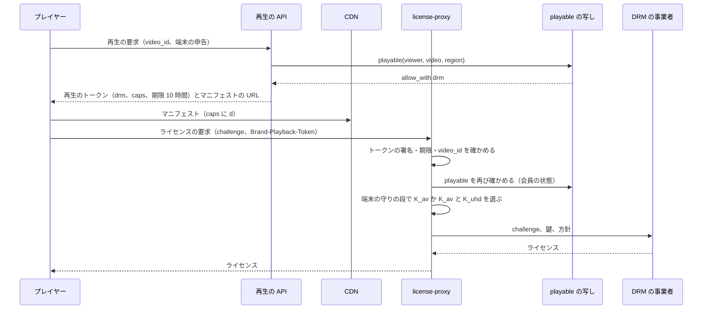

# Packaging and DRM: YouTube

符号化した区切りを、配れる形にまとめるところを決める。CMAF の書き手、レンディションのファイルとセグメントの索引の形、配信の URL の形、要求の時に作る HLS と DASH のマニフェスト、端末ごとの段の選び方、字幕・シークの縮小の画像のトラック、メンバー限定の動画の DRM（CENC `cbcs`、鍵の階層、ライセンスの流れ）を扱う。

前提となる決定は次のとおり。

- CMAF の fMP4 で 1 回だけ保存し、HLS と DASH のマニフェストを要求の時に作る。VOD のセグメント 4 秒、ライブは 2 秒と部分 0.5 秒。レンディションごとに 1 つのファイルとセグメントの索引。DRM はメンバー限定の動画だけ（[ADR-0004](../decisions/0004-cmaf-packaging-and-drm-scope.md)）
- GOP 2 秒、全段でキーフレームの時刻を揃える（[ADR-0003](../decisions/0003-codecs-and-per-title-ladder.md)、[ADR-0018](../decisions/0018-encode-worker-pools-and-spot-interruption.md)）
- 配信は `<brand>video.<domain>`、CDN → Origin Shield → `origin-cache` → S3（[ADR-0005](../decisions/0005-cdn-and-origin-strategy.md)）。署名の形は [cdn-and-delivery.md](cdn-and-delivery.md)
- 見える範囲は `playable()`（[ADR-0009](../decisions/0009-single-tenant-and-playable.md)）

この文書で決めたことは次の ADR にある。

| ADR | 決定 |
| --- | --- |
| [0019](../decisions/0019-cmaf-files-segment-index-and-url-layout.md) | レンディションの fMP4 は `init` とセグメントを連ねた 1 つのファイルにし、索引 `SIX1`（32 バイトの頭と 1 セグメント 16 バイト）を別に置く。URL は `/v/{video_id}/{gen}/{rendition}/{seq}.m4s`。段の追加は同じ世代にレンディションを足し、作り直しは世代を上げる |
| [0020](../decisions/0020-manifest-generation-and-capability-classes.md) | マニフェストは端末の対応を「能力の組」（コーデック × 段の上限 × DRM、形式ごと）に丸め、組ごとに CDN でキャッシュする。HLS は `EXT-X-VERSION:7`、DASH は `SegmentTemplate` と `SegmentTimeline`。段の帯域の値はセグメントの索引から計算する |
| [0021](../decisions/0021-drm-key-hierarchy-and-license-proxy.md) | メンバー限定の動画は 2 つの内容の鍵（音声と 1080p まで、1440p 以上）を持ち、KMS で包んで Aurora に置く。ライセンスは自前の `license-proxy` が再生のトークンと `playable()` を確かめてから事業者に求め、鍵は要求ごとに渡す。ライセンスの期限 6 時間、持ち出し（オフライン）なし |

## 1. 範囲

- 扱う：
  - CMAF の書き手（`crates/cmaf`）、`init` とセグメントの箱の構成、音声のセグメント
  - レンディションのファイル、セグメントの索引の形、世代
  - 配信の URL の形（パス）。署名と拒否の一覧は [cdn-and-delivery.md](cdn-and-delivery.md)
  - `manifest-service`：HLS・DASH の生成、能力の組、段の選び方、キャッシュの期限
  - 字幕、シークの縮小の画像、チャプターのマニフェストへの載せ方
  - DRM：範囲、鍵、暗号化、ライセンスの流れと方針、公開の範囲の切り替え
- 扱わない：
  - 符号化とラダー（[transcoding-pipeline.md](transcoding-pipeline.md)）
  - ライブの部分セグメントとプレイリスト（[live-streaming.md](live-streaming.md)）。この文書は VOD の形を決め、ライブは同じ書き手を使う
  - 再生の API と再生のトークンの中身（[playback-and-abr.md](playback-and-abr.md)）
  - CDN の署名と拒否の一覧（[cdn-and-delivery.md](cdn-and-delivery.md)）
  - メンバーシップの販売と会員の判定（monetization-and-payouts の領域）

## 2. 要件

| 要件 | 目標 | NFR |
| --- | --- | --- |
| 1 回だけ保存 | 同じセグメントのバイトを HLS と DASH で配る | ADR-0004 |
| 再生の開始 | マニフェストの応答（CDN のヒット）p95 50 ms、外れ p95 200 ms。DRM の動画の開始の上乗せ p95 300 ms 以内 | NFR-003 |
| 段の追加 | 全段・AV1 の追加で、配っているセグメントの URL を変えない | ADR-0004 |
| 適合 | 作ったセグメントとマニフェストが、CMAF・HLS・DASH の検査の道具を通る | [quality.md](../quality.md) の 2.2.1 節 A |
| DRM | ライセンスなしで復号できない。トークンの期限の後にライセンスが出ない | ADR-0004 |
| 措置 | マニフェストとライセンスの発行が `playable()` に従う | NFR-014 |

## 3. 標準と本家（確かめたこと）

| 項目 | 内容 | 出典 |
| --- | --- | --- |
| HLS の改訂 | RFC 8216 の改訂の草案は draft-pantos-hls-rfc8216bis-22（2026-05-01）。IETF の独立の投稿の Internet-Draft（Informational を目指す）で、RFC ではない。プロトコルのバージョン 13 を記す | [draft-pantos-hls-rfc8216bis](https://datatracker.ietf.org/doc/html/draft-pantos-hls-rfc8216bis)、2026-10-10 に確認 |
| `EXT-X-TARGETDURATION` | 各セグメントの長さを四捨五入した整数が、Target Duration 以下でなければならない。1 以上 | 同上 |
| HLS の元の仕様 | RFC 8216（2017、Informational。LL-HLS を含まない） | [RFC 8216](https://www.rfc-editor.org/rfc/rfc8216)、2026-10-10 に確認（本文の細部は改訂の草案に寄せる） |
| CMAF | ISO/IEC 23000-19。規格の本文は有料で、確かめていない（**未検証**）。本文で使うのは、fMP4 の `init`（`ftyp`・`moov`）とセグメント（`styp`・`moof`・`mdat`）の構成だけ | — |
| DASH | ISO/IEC 23009-1。規格の本文は確かめていない（**未検証**）。`SegmentTemplate`・`SegmentTimeline` の書き方は、`dash-conformance` の検査で確かめる | — |
| CENC `cbcs` | ISO/IEC 23001-7。AES-CBC のパターンの暗号化（映像は 1 ブロック暗号化・9 ブロック素通し、固定の IV）と広く説明されるが、規格の本文は確かめていない（**未検証**。DRM の事業者の試験の資料と `drm-provider-poc` で確かめる） | — |
| 本家の DRM の範囲、セグメントの長さ | 公式の資料で確かめられなかった（**未検証**） | — |

標準と本家が違う点は、上の範囲で見つかっていない。本システムは標準に寄せる。

## 4. CMAF の書き手とファイル（ADR-0019）

### 4.1 レンディションのファイル

```
s3://<media-bucket>/p/{video_id}/{gen}/{rendition}.cmfv   （映像。音声は .cmfa、字幕は .vtt）
  [init]  ftyp, moov(mvhd, trak(tkhd, mdia(mdhd, hdlr, minf(stbl(stsd(avc1|av01, ...)))), mvex(trex)))
  [seg 0] styp, moof(mfhd, traf(tfhd, tfdt, trun)), mdat
  [seg 1] styp, moof(...), mdat
  ...
s3://<media-bucket>/p/{video_id}/{gen}/{rendition}.six    （セグメントの索引）
```

- 1 セグメント 1 フラグメント（`moof`＋`mdat` 1 組）。VOD のセグメントは 2 GOP（約 4 秒）で、先頭は IDR。
- `tfdt` の基準の時刻は、動画の先頭からの通しの時刻。全段・全トラックで同じ時間の尺（映像は 90,000、音声は 48,000）を使う。
- `pipeline` の区切り（10 GOP）の出力を順に読み、5 セグメントずつ書き足す。区切りの境はセグメントの境と一致するので、区切りをまたぐセグメントはできない（[ADR-0018](../decisions/0018-encode-worker-pools-and-spot-interruption.md)）。

### 4.2 音声のセグメント

- 音声は全体を 1 回で符号化した AAC のフレームを、映像のセグメントの境に最も近いフレームの境で切る。48 kHz で 4 秒は 187.5 フレームなので、187 と 188 のセグメントが交互に並ぶ（[transcoding-pipeline.md](transcoding-pipeline.md) の 7 節）。
- 音声のセグメントの番号は映像と同じにする。プレイヤーは番号で対応を取れる。

### 4.3 セグメントの索引 `SIX1`

```
頭（32 バイト、ビッグエンディアン）
  magic       4  "SIX1"
  version     2  1
  flags       2  bit0: 暗号化 / bit1: ライブ（追記中）
  timescale   4  90000（音声は 48000）
  seg_count   4
  init_size   4  ファイルの先頭からの init の大きさ
  total_size  8
  reserved    4
項目（1 セグメント 16 バイト）
  offset      6  ファイルの中の位置（48 ビット、最大 256 TiB）
  size        4
  duration    4  timescale の単位
  flags       2  bit0: 先頭が IDR / bit1: 埋めた区間（壊れた区間の黒と無音）
```

例：10 分の 1080p（4.3 Mbps）のレンディション。

- 150 セグメント、1 セグメント約 2.15 MB、ファイル約 323 MB。
- 索引は 32 ＋ 150 × 16 = 2,432 バイト。12 時間の動画でも 10,800 × 16 ＋ 32 ≈ 173 KB。
- `origin-cache` は索引をメモリーに持ち、`seq` → `(offset, size)` を引いて S3 の範囲の GET を 1 回出す（[cdn-and-delivery.md](cdn-and-delivery.md) の 6 節）。

### 4.4 URL の形

| 対象 | パス（`<brand>video.<domain>` の下。前に署名の `/t/{token}` が付く） |
| --- | --- |
| `init` | `/v/{video_id}/{gen}/{rendition}/init.mp4` |
| セグメント | `/v/{video_id}/{gen}/{rendition}/{seq}.m4s` |
| 字幕 | `/v/{video_id}/cap/{lang}-{kind}-{rev}/{n}.vtt` |
| シークの縮小の画像 | `/v/{video_id}/sb/{rev}/{n}.jpg` と `/v/{video_id}/sb/{rev}/index.vtt` |
| マニフェスト | `/m/{mf}/{video_id}/{caps}/master.m3u8`、`/m/{mf}/{video_id}/{caps}/{rendition}/index.m3u8`、`/m/{mf}/{video_id}/{caps}/manifest.mpd`。`mf` はマニフェストの形式の番号（[ADR-0071](../decisions/0071-encoder-pinning-reencode-and-manifest-format-versions.md)、[ADR-0020](../decisions/0020-manifest-generation-and-capability-classes.md) の注記） |

- `rendition` は `h1080-c24`（H.264・1080p・CRF 24）や `a-aac128` のような、段の中身から決まる名前。暗号化したものは末尾に `-cbcs` を付ける。
- URL は中身が変わらない。同じ URL の中身を作り直さない。作り直すときは `gen` を上げる。

### 4.5 世代

| 出来事 | 世代 | マニフェスト |
| --- | --- | --- |
| `fast_package`（360p・720p） | `gen` 1 | 1 の段だけ |
| `full_package`（全段） | `gen` 2 | 2 の段に切り替え。1 は 24 時間の猶予の後に消す（ADR-0004） |
| `av1_package` | 同じ `gen` 2 にレンディションを足す | AV1 の組の能力のマニフェストに段を足す。既存の URL は変わらない |
| 新しい `ladder_version` での作り直し | `gen` 3 | 3 に切り替え。2 は 24 時間の後に消す |
| メンバー限定への切り替え | 暗号化した `-cbcs` を同じ世代に足す | 8.6 節 |

- 世代の切り替えは `renditions` の行と `videos.active_gen` を同じトランザクションで変え、outbox でマニフェストのキャッシュを無効にする。
- 再生中のプレイヤーは古い世代のマニフェストを持っている。24 時間の猶予の間は古い世代も配れるので、途中で止まらない。

## 5. マニフェスト（ADR-0020）

### 5.1 能力の組

再生の API（[playback-and-abr.md](playback-and-abr.md)）は、端末の申告と既知の機種の表から、能力の組 `caps` を決めて再生のトークンに入れる。マニフェストのパスにも同じ `caps` を入れ、CDN はパスでキャッシュする（トークンはキャッシュの鍵に入れない）。

| 軸 | 値 |
| --- | --- |
| コーデック | `h`（H.264 だけ）、`a`（AV1 と H.264） |
| 段の上限 | `m`（`mobile_top` まで）、`1080`、`2160` |
| 形式 | HLS、DASH（パスの末尾で分かれる） |
| DRM | `d`（暗号化した段だけ）。メンバー限定の動画だけ |

- 例：`h-m`（H.264、スマートフォンの上限）、`a-2160`（AV1 と H.264、4K のテレビ）、`a-1080-d`（メンバー限定）。組は最大 16 通りで、1 つの動画のマニフェストのキャッシュは 16 × 形式 2 ＝ 32 本まで。
- 画面の小さい端末（短い辺 ×  画素の密度 ≤ 1,080 の電話）は `m`。`mobile_top` は、スマートフォンのモデルで VMAF 93 を最初に満たす段（[transcoding-pipeline.md](transcoding-pipeline.md) の 5.1 節）。利用者が画質を手で選んだときは、プレイヤーが上限を外したトークンを取り直す。

### 5.2 段の選び方

1. `renditions` から、`videos.active_gen` の世代で、状態が `ready` の段を取る。
2. コーデックの軸で絞る。`a` の組で AV1 の段があれば、AV1 の段と、H.264 の段の両方を載せる（HLS はコーデックの違う `EXT-X-STREAM-INF` を並べ、プレイヤーが選ぶ）。
3. 段の上限の軸で、解像度とビットレートの上の段を除く。
4. DRM の軸で、暗号化した段だけを残す（`playable()` が DRM を求めた動画）。
5. 音声は AAC-LC 128 kbps と HE-AAC 48 kbps の 2 つ。最下段の 2 つ（144p・240p）は HE-AAC と組む。

### 5.3 HLS の例

```
#EXTM3U
#EXT-X-VERSION:7
#EXT-X-INDEPENDENT-SEGMENTS
#EXT-X-MEDIA:TYPE=AUDIO,GROUP-ID="aac",NAME="main",LANGUAGE="ja",DEFAULT=YES,AUTOSELECT=YES,CHANNELS="2",URI="a-aac128/index.m3u8"
#EXT-X-MEDIA:TYPE=AUDIO,GROUP-ID="he",NAME="main",LANGUAGE="ja",DEFAULT=YES,AUTOSELECT=YES,CHANNELS="2",URI="a-heaac48/index.m3u8"
#EXT-X-MEDIA:TYPE=SUBTITLES,GROUP-ID="sub",NAME="ja auto",LANGUAGE="ja",AUTOSELECT=YES,URI="cap-ja-auto/index.m3u8"
#EXT-X-STREAM-INF:BANDWIDTH=5980000,AVERAGE-BANDWIDTH=4430000,CODECS="avc1.640028,mp4a.40.2",RESOLUTION=1920x1080,FRAME-RATE=29.970,AUDIO="aac",SUBTITLES="sub"
h1080-c24/index.m3u8
#EXT-X-STREAM-INF:BANDWIDTH=3150000,AVERAGE-BANDWIDTH=2430000,CODECS="avc1.64001f,mp4a.40.2",RESOLUTION=1280x720,FRAME-RATE=29.970,AUDIO="aac",SUBTITLES="sub"
h720-c24/index.m3u8
#EXT-X-STREAM-INF:BANDWIDTH=150000,AVERAGE-BANDWIDTH=148000,CODECS="avc1.42c00c,mp4a.40.5",RESOLUTION=256x144,FRAME-RATE=29.970,AUDIO="he",SUBTITLES="sub"
h144-f/index.m3u8
```

```
#EXTM3U
#EXT-X-VERSION:7
#EXT-X-TARGETDURATION:4
#EXT-X-PLAYLIST-TYPE:VOD
#EXT-X-MEDIA-SEQUENCE:0
#EXT-X-INDEPENDENT-SEGMENTS
#EXT-X-MAP:URI="../../../../../v/0192.../2/h1080-c24/init.mp4"
#EXTINF:4.004,
../../../../../v/0192.../2/h1080-c24/0.m4s
#EXTINF:4.004,
../../../../../v/0192.../2/h1080-c24/1.m4s
...
#EXT-X-ENDLIST
```

- `BANDWIDTH` は、索引から求めた 1 セグメントの最大のビットレート（映像）＋音声。`AVERAGE-BANDWIDTH` は平均。マニフェストを作る時に索引から計算する。
- セグメントの URI は相対のパス。プレイヤーはマニフェストの URL（`/t/{token}/m/{mf}/...`）を基準に解決するので、`/t/{token}/v/...` になり、トークンが付く（[cdn-and-delivery.md](cdn-and-delivery.md) の 5 節）。マニフェストの本文には利用者ごとの値が入らず、CDN で共有できる。
- `EXTINF` には実際の長さ（4.004 など）を書く。四捨五入で 4 なので `TARGETDURATION:4` に収まる。
- I フレームの再生リストは作らない。シークの縮小の画像で代える（MVP）。

### 5.4 DASH の例

```xml
<MPD xmlns="urn:mpeg:dash:schema:mpd:2011" type="static" mediaPresentationDuration="PT10M0.6S"
     minBufferTime="PT4S" profiles="urn:mpeg:dash:profile:isoff-live:2011">
  <Period id="0">
    <AdaptationSet contentType="video" segmentAlignment="true" startWithSAP="1">
      <SegmentTemplate timescale="90000" initialization="../../../../v/0192.../2/$RepresentationID$/init.mp4"
                       media="../../../../v/0192.../2/$RepresentationID$/$Number$.m4s" startNumber="0">
        <SegmentTimeline><S t="0" d="360360" r="149"/></SegmentTimeline>
      </SegmentTemplate>
      <Representation id="h1080-c24" codecs="avc1.640028" width="1920" height="1080" bandwidth="5850000"/>
      <Representation id="h720-c24" codecs="avc1.64001f" width="1280" height="720" bandwidth="3020000"/>
    </AdaptationSet>
    <AdaptationSet contentType="audio" lang="ja">...</AdaptationSet>
    <AdaptationSet contentType="text" mimeType="text/vtt" lang="ja">...</AdaptationSet>
  </Period>
</MPD>
```

- `d="360360"` は 4.004 秒 × 90,000。端数のないフレームレートは `d="360000"`。
- CMAF の DASH の profile の URN を足すかは、`dash-conformance` の検査とプレイヤーの試験で決める（**未検証**）。

### 5.5 キャッシュ

| 対象 | CDN の期限 | 無効化 |
| --- | --- | --- |
| VOD のマスター・メディアの再生リスト、MPD | 1 時間 | 世代の切り替え、段の追加、措置で、動画の cache tag を無効にする |
| `init`・セグメント | 1 年 | 措置のときだけ（[cdn-and-delivery.md](cdn-and-delivery.md) の 10 節） |
| 字幕・シークの縮小の画像 | 1 日（字幕は `rev` で変わる） | 措置 |

- `manifest-service` は状態を持たない。`renditions`・`videos` の写し（Valkey、outbox で更新）と索引（`origin-cache` 経由）から作る。12 時間の動画のメディアの再生リストは約 10,800 行・約 650 KB（圧縮で約 60 KB）。

## 6. 字幕・シークの縮小の画像・チャプター

| 対象 | HLS | DASH |
| --- | --- | --- |
| 字幕（WebVTT） | 字幕の再生リスト（`TYPE=SUBTITLES`）。60 秒ごとの `.vtt` のセグメント、`X-TIMESTAMP-MAP` 付き。再生リストの `TARGETDURATION:60` | `AdaptationSet contentType="text"`、1 つの `.vtt` を `BaseURL` で |
| シークの縮小の画像 | 再生の API の応答で URL を渡す（マニフェストに載せない） | 同じ |
| チャプター | 再生の API の応答で渡す | 同じ |

- 字幕の再生リストの `TARGETDURATION` を映像と別にしてよいかは、Apple の端末での振る舞いを `cmaf-writer-and-index` の端末の試験で確かめる（Apple のオーサリングの資料は確かめられなかった：**未検証**）。合わなければ字幕も 4 秒に分ける。

## 7. 適合の検査

- 夜間に、黄金の動画の集まりの全部の出力（セグメントとマニフェスト）を、HLS の検査の道具、DASH の `dash-conformance`、CMAF の構造の検査に通す（[quality.md](../quality.md) の 2.2.1 節 A）。
- 試験のベクトル：同じセグメントを HLS（Safari、AVPlayer）と DASH（Media3、MSE）で再生し、フレームの数と時刻が一致する（ADR-0004 の Confirmation）。

## 8. DRM（ADR-0021）

### 8.1 範囲

- 暗号化するのは、`playable()` が `allow_with: drm` を返す動画だけ。MVP ではメンバー限定の動画（ADR-0004）。公開・限定公開・非公開の動画は暗号化しない。
- DRM の方式：Widevine、PlayReady、FairPlay。1 つの `cbcs` のセグメントで 3 つに配る（ADR-0004）。

### 8.2 鍵

| 鍵 | 対象 | 出す端末 |
| --- | --- | --- |
| `K_av`（動画ごと） | 音声と、1080p までの映像 | すべての DRM の端末（ソフトウェアの Widevine を含む） |
| `K_uhd`（動画ごと） | 1440p 以上の映像（AV1） | ハードウェアで守る端末（Widevine のハードウェアの段、PlayReady のハードウェアの段、FairPlay）と HDCP 2.2 |

- 鍵と KID は 16 バイトの乱数。KMS の鍵 `drm-content` で包み、`drm_keys` に置く。`drm-content` の復号を許すのは `packager` と `license-proxy` の役割だけ。
- VOD の鍵は回さない。漏れたら新しい KID で作り直し（世代を上げる）、古い KID のライセンスを止める。

### 8.3 暗号化

- `packager` が `K_av`・`K_uhd` を復号してメモリーに持ち、`cbcs` で暗号化した `-cbcs` のレンディションを書く。映像は 1:9 のパターン、固定の IV（KID ごと 16 バイト）。音声の扱いとパターンの細部は規格の本文を確かめていない（**未検証**、`drm-provider-poc`）。
- `init` に `tenc` と、Widevine・PlayReady の `pssh` を入れる。マニフェストにも同じ値を入れる（DASH の `ContentProtection`、HLS の `EXT-X-KEY`。FairPlay は `skd://` の URI）。
- 暗号化しない段（クリアの先頭）は作らない。開始の遅れは、ライセンスの先取り（8.4 節）で抑える。

### 8.4 ライセンスの流れ



- プレイヤーはマニフェストを読んだらすぐにライセンスを求め、最初のセグメントの取得と並べる（ライセンスの先取り）。開始の上乗せの目標は p95 300 ms。
- `license-proxy` は TypeScript の管理の面の部品にする（`playable()` を呼ぶため）。事業者は口 `DrmLicenseProvider` の後ろに置き、複数の事業者を差し替えられる（ADR-0004）。
- ヘッダーの名前は `<Brand>-Playback-Token`（リポジトリ共通の ADR-0006）。

### 8.5 ライセンスの方針

| 項目 | 値 |
| --- | --- |
| ライセンスの期限 | 6 時間、または再生のトークンの残りの短いほう |
| 持ち出し（オフライン） | なし |
| 更新 | 期限の 10 分前にプレイヤーが再生のトークンを取り直し、ライセンスを求め直す |
| `K_uhd` | ハードウェアの守りと HDCP 2.2 が要る |
| 会員の終わり | 次の更新でライセンスが出ない。最大 6 時間は再生できる |
| 措置 | `playable()` が `deny` を返したら、次の要求でライセンスが出ない。配信は拒否の一覧で止まる（[cdn-and-delivery.md](cdn-and-delivery.md) の 10 節） |

### 8.6 公開の範囲の切り替え

| 切り替え | 処理 |
| --- | --- |
| 公開 → メンバー限定 | `-cbcs` の段を作り（後ろの組ではなく急ぎの組）、できたらマニフェストを `d` の組に切り替える。それまでは `playable()` がメンバー限定として扱い、非会員には出さない |
| メンバー限定 → 公開 | クリアの段（同じ世代に残っている）へ、マニフェストをすぐに切り替える |
| メンバー限定の間のクリアの段 | `origin-cache` が `videos.drm_required` を見て、クリアのパスに 403 を返す。マニフェストにも載せない |

- クリアの段を残すのは、切り替えのたびに元のファイルから作り直さないためである。メンバー限定の動画は全体の少しなので、保存の増えは小さい。

## 9. 失敗と回復

| 失敗 | 起きること | 回復 |
| --- | --- | --- |
| `packager` の停止 | パッケージの作業が戻る | 冪等（[ADR-0014](../decisions/0014-pipeline-task-leases-and-idempotent-outputs.md)）。最初から書き直す |
| 索引とファイルの食い違い | 範囲の読み出しが壊れたセグメントを返す | 書き手は、ファイルを置いてから索引を置く。`origin-cache` は返す前に `moof` の頭を確かめ、合わなければ 502 と記録 |
| `manifest-service` の停止 | 新しいマニフェストが作れない | CDN にキャッシュがあれば配れる。状態を持たないので他のタスクで受ける |
| 写し（Valkey）の消失 | マニフェストの作成が Aurora の読み手に寄る | 読み手から作る。Valkey は失ってよい |
| DRM の事業者の停止 | メンバー限定の動画の開始が失敗する | 2 つ目の事業者へ切り替える（S2 で 2 社目。MVP は 1 社で、開始の失敗に数える） |
| KMS の停止 | `license-proxy` と `packager` が鍵を開けない | `license-proxy` は復号した鍵を 10 分メモリーに持つ。新しい動画の暗号化は待つ |

## 10. 上限

| 対象 | 値 |
| --- | --- |
| 1 動画のレンディション | 映像 16、音声 4、字幕 20 言語 |
| 能力の組 | 16 通り × 2 形式 |
| マニフェストの大きさ | 12 時間の動画で約 650 KB（圧縮なし） |
| 索引 | 1 セグメント 16 バイト、最大 256 TiB のファイル |
| 世代の猶予 | 24 時間 |
| ライセンス | 6 時間、オフラインなし |

## 11. data-model への項目

| 表・置き場 | 中身 | 主キー・索引 | 節 |
| --- | --- | --- | --- |
| `renditions` に足す列 | `gen`、`name`（`h1080-c24`）、`kind`（`video`・`audio`）、`encrypted`、`peak_bps`、`avg_bps`、`s3_key`、`index_key`、`seg_count` | `(video_id, gen, name)` | 4 |
| `videos` に足す列 | `active_gen`、`drm_required` | — | 4.5、8.6 |
| `drm_keys` | `video_id`、`kid`、`group`（`av`・`uhd`）、`wrapped_key`、`kms_key_id`、`created_at`、`revoked_at` | `(video_id, kid)` | 8.2 |
| `drm_license_log`（集計だけ。利用者の ID はハッシュ） | `video_id`、`system`、`result`、`reason`、`at` | `(video_id, at)`、90 日で消す | 8.4 |
| S3 | `p/{video_id}/{gen}/{rendition}.cmfv`・`.cmfa`・`.six`、字幕、シークの縮小の画像 | — | 4 |
| Valkey | `rend:{video_id}`（世代と段の写し） | outbox で更新 | 5.5 |

## 12. テストと性質

| ID | 性質・試験 |
| --- | --- |
| PROP-PKG-001 | 任意の区切りの列から書いたファイルについて、索引の各項目の範囲を読むと、`styp`・`moof`・`mdat` で始まる完全なフラグメントで、`tfdt` が前の項目の `tfdt` ＋ `duration` に等しい |
| PROP-PKG-002 | 任意の段の組と能力の組で、マニフェストに載る段は、能力の組のコーデック・上限・DRM の条件を満たすものだけで、空にならない（最下段は必ず残る） |
| PROP-PKG-003 | 同じ索引と状態から、同じマニフェストのバイトが出る（キャッシュの共有の前提） |
| PROP-PKG-004 | 任意の世代の切り替えの列で、配っている URL の中身が変わらない |
| PROP-DRM-001 | 任意のトークン（期限切れ、別の動画、改ざん）と `playable()` の結果で、`license-proxy` が鍵を出すのは、有効なトークンかつ `allow_with: drm` のときだけ。`K_uhd` はハードウェアの守りのときだけ |
| DT-PKG-001 | 能力の組 × 段の有無（AV1、`mobile_top`、暗号化）の決定表 |
| DT-DRM-001 | 公開の範囲の切り替え（8.6 節）の決定表 |
| 試験のベクトル | `SIX1` の頭と項目、HLS・DASH のマニフェストの黄金の出力 |
| 適合 | 7 節の検査（夜間） |
| 端末 | Safari・AVPlayer・Media3・MSE（Chrome・Firefox・Edge）とテレビの代表の機種で、クリアと `cbcs` の再生 |
| 暗号化 | ライセンスなしで復号できない。トークンの期限の後にライセンスが出ない（ADR-0004 の Confirmation） |

## 13. Story の候補

| Epic | Story | 中身 |
| --- | --- | --- |
| E4 | `cmaf-writer-and-index` | 4 節（ADR-0019、PROP-PKG-001・004） |
| E4 | `manifest-service` | 5・6 節（ADR-0020、PROP-PKG-002・003、DT-PKG-001） |
| E14 | `drm-provider-poc` | `cbcs` の細部、事業者の鍵を要求ごとに渡す形、端末の試験 |
| E14 | `drm-packaging-and-license-proxy` | 8 節（ADR-0021、PROP-DRM-001、DT-DRM-001） |

## 14. 未解決の問い

### 決定（2026-10-10、既定案）

- **索引の形**：`SIX1`、1 セグメント 16 バイト（ADR-0019）。
- **能力の組**：16 通りに丸めて CDN で共有（ADR-0020）。
- **鍵**：2 つ（`K_av`・`K_uhd`）、要求ごとに事業者へ渡す（ADR-0021）。
- **ライセンスの期限**：6 時間、オフラインなし（ADR-0021）。
- **I フレームの再生リスト**：作らない（MVP）。

### 持ち越し

| 問い | いつ・どう決めるか |
| --- | --- |
| `cbcs` の音声の扱いとパターンの細部（**未検証**） | `drm-provider-poc` |
| 事業者が「鍵を要求ごとに受ける」形に対応するか（**未検証**） | `drm-provider-poc`。対応しなければ、鍵の登録の API（CPIX の形）で事業者に置く ADR を書く |
| 字幕の再生リストの `TARGETDURATION` を映像と別にしてよいか（**未検証**） | `cmaf-writer-and-index` の端末の試験 |
| DASH の CMAF の profile の URN | `manifest-service` の適合の検査 |
| 2 社目の DRM の事業者 | S2 の前 |
| メンバー限定の動画の範囲と、有料の作品（レンタル） | monetization-and-payouts の領域（**法務の確認待ち：L7**） |

## 出典

いずれも 2026-10-10 に確認。

- IETF, [draft-pantos-hls-rfc8216bis-22](https://datatracker.ietf.org/doc/html/draft-pantos-hls-rfc8216bis)（2026-05-01）
- IETF, [RFC 8216: HTTP Live Streaming](https://www.rfc-editor.org/rfc/rfc8216)
- ISO/IEC 23000-19（CMAF）、ISO/IEC 23009-1（DASH）、ISO/IEC 23001-7（CENC）：規格の本文は確かめていない（**未検証**）
